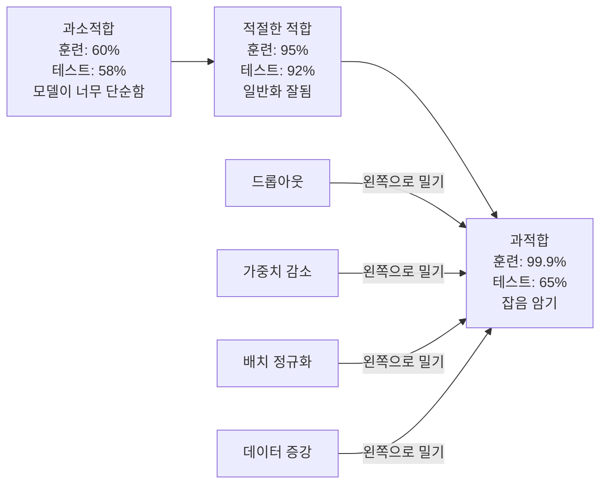
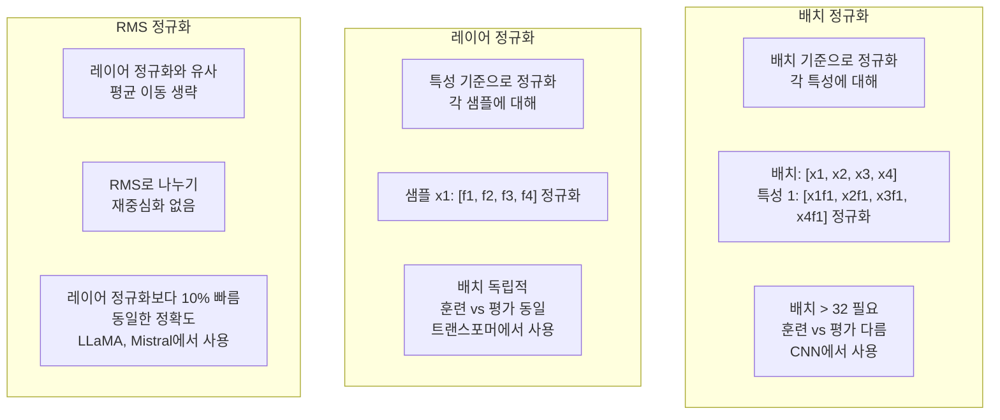
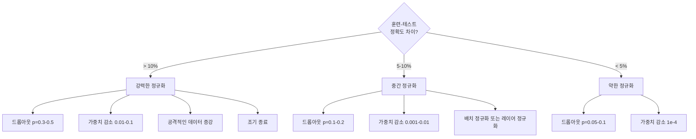

# 정규화(Regularization)

> 모델이 훈련 데이터에서 99% 정확도를 기록하지만 테스트 데이터에서는 60% 정확도를 보입니다. 이는 학습이 아닌 암기(memorization)가 발생했음을 의미합니다. 정규화는 복잡성에 부과하는 "세금"으로, 일반화(generalization)를 강제하는 방법입니다.

**유형:** Build  
**언어:** Python  
**선수 지식:** Lesson 03.06 (옵티마이저)  
**소요 시간:** ~75분

## 학습 목표

- 역전파 스케일링(inverted scaling)을 적용한 드롭아웃(dropout), L2 가중치 감소(L2 weight decay), 배치 정규화(batch normalization), 레이어 정규화(layer normalization), RMSNorm을 처음부터 구현
- 정규화 실험을 통해 훈련-테스트 정확도 차이를 측정하고 과적합(overfitting)을 진단
- 트랜스포머(transformer)가 배치 정규화 대신 레이어 정규화를 사용하는 이유와 현대 대형 언어 모델(LLM)이 RMSNorm을 선호하는 이유 설명
- 과적합의 심각도에 따라 정규화 기법의 올바른 조합 적용

## 문제

충분한 파라미터를 가진 신경망은 어떤 데이터셋도 암기할 수 있습니다. 이는 가설이 아닌 사실로, Zhang et al. (2017)은 ImageNet에 무작위 레이블을 할당한 표준 네트워크를 훈련시켜 이를 증명했습니다. 이 네트워크들은 완전히 무작위로 할당된 레이블에 대해 거의 0에 가까운 훈련 손실을 달성했습니다. 학습할 패턴이 없는 100만 개의 무작위 입력-출력 쌍을 암기한 것입니다. 훈련 손실은 완벽했지만 테스트 정확도는 0이었습니다.

이것이 과적합 문제이며, 모델 크기가 커질수록 더 악화됩니다. GPT-3는 1,750억 개의 파라미터를 가지고 있습니다. 훈련 세트는 약 5,000억 개의 토큰으로 구성됩니다. 그 많은 파라미터로 모델은 훈련 데이터의 상당 부분을 그대로 암기할 수 있는 충분한 용량을 가집니다. 정규화가 없다면 일반화 가능한 패턴을 학습하는 대신 훈련 예시를 그대로 되풀이할 것입니다.

훈련 성능과 테스트 성능 사이의 격차가 바로 과적합 격차입니다. 이 강의의 모든 기법은 서로 다른 각도에서 이 격차를 공략합니다. 드롭아웃(Dropout)은 네트워크가 단일 뉴런에 의존하지 않도록 강제합니다. 가중치 감소(Weight decay)는 단일 가중치가 지나치게 커지는 것을 방지합니다. 배치 정규화(Batch normalization)는 손실 함수를 매끄럽게 만들어 최적화기가 더 평탄하고 일반화 가능한 최소값을 찾도록 합니다. 레이어 정규화(Layer normalization)는 배치 정규화가 실패하는 경우(작은 배치, 가변 길이 시퀀스)에서 동일한 작업을 수행합니다. RMSNorm은 평균 계산을 생략하여 10% 더 빠르게 동작합니다. 각 기법은 단순하지만, 함께 사용하면 암기하는 모델과 일반화하는 모델의 차이를 만듭니다.

## 개념

### 과적합 스펙트럼

모든 모델은 과소적합(패턴을 포착하기에 너무 단순함)부터 과적합(잡음까지 포착할 정도로 복잡함)까지의 스펙트럼 상에 위치합니다. 최적의 지점은 중간이며, 정규화는 과적합 측면에서 모델을 이 방향으로 밀어줍니다.



### 드롭아웃

가장 우아한 해석을 가진 가장 간단한 정규화 기법입니다. 훈련 중에 각 뉴런의 출력을 확률 p로 무작위로 0으로 설정합니다.

```
output = activation(z) * mask    where mask[i] ~ Bernoulli(1 - p)
```

p = 0.5일 때, 매 순전파마다 절반의 뉴런이 0이 됩니다. 네트워크는 어떤 뉴런이 활성화될지 예측할 수 없기 때문에 중복된 표현을 학습해야 합니다. 이는 공동 적응(co-adaptation)을 방지합니다. 즉, 특정 뉴런이 존재할 것이라고 가정하고 학습하는 것을 방지합니다.

앙상블 해석: N개의 뉴런을 가진 네트워크에 드롭아웃을 적용하면 2^N개의 가능한 부분 네트워크가 생성됩니다(어떤 뉴런이 켜지거나 꺼지는 모든 조합). 드롭아웃을 사용한 훈련은 이 2^N개의 부분 네트워크를 서로 다른 미니배치로 동시에 훈련시킵니다. 테스트 시에는 모든 뉴런을 사용하고(드롭아웃 없음), 훈련 중 기대값과 일치하도록 출력을 (1 - p)로 스케일링합니다. 이는 단일 모델에서 2^N개의 부분 네트워크 예측을 평균하는 것과 동일합니다.

실제 구현에서는 테스트 대신 훈련 중에 스케일링을 적용합니다(인버티드 드롭아웃):

```
훈련 중:  output = activation(z) * mask / (1 - p)
테스트 중:   output = activation(z)   (변경 필요 없음)
```

테스트 코드가 드롭아웃을 알 필요가 없으므로 더 깔끔합니다.

기본 비율: 트랜스포머는 p = 0.1, MLP는 p = 0.5, CNN은 p = 0.2-0.3. 드롭아웃 비율이 높을수록 정규화 강도가 커지고 과소적합 위험이 증가합니다.

### 가중치 감소(L2 정규화)

모든 가중치의 제곱 크기를 손실에 추가합니다:

```
total_loss = task_loss + (lambda / 2) * sum(w_i^2)
```

정규화 항의 기울기는 lambda * w입니다. 이는 매 단계에서 각 가중치가 크기에 비례하는 비율로 0으로 축소됨을 의미합니다. 큰 가중치는 더 큰 페널티를 받습니다. 모델은 단일 가중치가 지배적인 해를 피하도록 유도됩니다.

일반화에 도움이 되는 이유: 과적합 모델은 훈련 데이터의 잡음을 증폭시키는 큰 가중치를 가지는 경향이 있습니다. 가중치 감소는 가중치를 작게 유지하여 모델의 유효 용량을 제한하고, 암기된 특징이 아닌 강건한 일반화 가능한 특징에 의존하도록 강제합니다.

람다 하이퍼파라미터는 강도를 제어합니다. 일반적인 값:

- 트랜스포머의 AdamW는 0.01
- CNN의 SGD는 1e-4
- 심하게 과적합된 모델은 0.1

레슨 06에서 논의했듯이, 가중치 감소와 L2 정규화는 SGD에서는 동등하지만 Adam에서는 그렇지 않습니다. Adam으로 훈련할 때는 항상 AdamW(분리된 가중치 감소)를 사용하세요.

### 배치 정규화

다음 레이어로 전달하기 전에 미니배치 단위로 각 레이어의 출력을 정규화합니다.

특정 레이어의 미니배치 활성화 값에 대해:

```
mu = (1/B) * sum(x_i)           (배치 평균)
sigma^2 = (1/B) * sum((x_i - mu)^2)   (배치 분산)
x_hat = (x_i - mu) / sqrt(sigma^2 + eps)   (정규화)
y = gamma * x_hat + beta        (스케일링 및 이동)
```

감마와 베타는 학습 가능한 파라미터로, 네트워크가 최적의 경우 정규화를 되돌릴 수 있게 합니다. 이들이 없으면 모든 레이어의 출력을 평균 0, 단위 분산으로 강제하게 되며, 이는 네트워크가 원하는 바가 아닐 수 있습니다.

**훈련 vs 추론 분할:** 훈련 중에는 현재 미니배치에서 평균과 분산을 가져옵니다. 추론 시에는 훈련 중에 누적된 지수 이동 평균(모멘텀 = 0.1, 즉 90% 이전 값 + 10% 새로운 값)을 사용합니다.

배치 정규화가 작동하는 이유는 여전히 논쟁 중입니다. 원본 논문에서는 "내부 공변량 이동"(이전 레이어가 업데이트됨에 따라 레이어 입력의 분포가 변화하는 현상)을 줄인다고 주장했습니다. Santurkar et al. (2018)은 이 설명이 틀렸음을 보였습니다. 실제 이유는 배치 정규화가 손실 지형을 더 부드럽게 만들기 때문입니다. 기울기가 더 예측 가능하고, 립시츠 상수가 작아지며, 최적화기가 안전하게 더 큰 단계를 밟을 수 있습니다. 이것이 배치 정규화를 사용하면 더 높은 학습률을 사용하고 더 빠르게 수렴할 수 있는 이유입니다.

배치 정규화의 근본적인 한계: 배치 통계에 의존합니다. 배치 크기가 1이면 평균과 분산이 무의미합니다. 작은 배치(< 32)에서는 통계가 노이즈가 되어 성능이 저하됩니다. 이는 객체 감지(메모리 제한으로 배치 크기가 제한됨)나 언어 모델링(시퀀스 길이가 다양함)과 같은 작업에서 중요합니다.

### 레이어 정규화

배치 대신 특성 차원에서 정규화합니다. 단일 샘플에 대해:

```
mu = (1/D) * sum(x_j)           (특성 평균)
sigma^2 = (1/D) * sum((x_j - mu)^2)   (특성 분산)
x_hat = (x_j - mu) / sqrt(sigma^2 + eps)
y = gamma * x_hat + beta
```

D는 특성 차원입니다. 각 샘플은 독립적으로 정규화되며, 배치 크기에 의존하지 않습니다. 트랜스포머가 배치 정규화 대신 레이어 정규화를 사용하는 이유입니다. 시퀀스 길이는 가변적이며, 배치 크기는 종종 작거나(생성 시 1), 훈련과 추론 간 계산이 동일합니다.

트랜스포머의 레이어 정규화는 각 자기 주의 블록과 각 피드포워드 블록 이후에 적용되거나(Post-LN), 이전에 적용됩니다(Pre-LN, 훈련에 더 안정적).

### RMS 정규화

평균 이동을 제거한 레이어 정규화입니다. Zhang & Sennrich (2019)가 제안했습니다.

```
rms = sqrt((1/D) * sum(x_j^2))
y = gamma * x / rms
```

이것이 전부입니다. 평균 계산과 베타 파라미터가 없습니다. 관찰: 레이어 정규화의 재중심화(평균 이동)는 모델 성능에 거의 기여하지 않지만 계산 비용이 듭니다. 이를 제거하면 약 10% 오버헤드 감소로 동일한 정확도를 얻을 수 있습니다.

LLaMA, LLaMA 2, LLaMA 3, Mistral 및 대부분의 현대 LLM은 레이어 정규화 대신 RMS 정규화를 사용합니다. 수십억 개의 파라미터와 수조 개의 토큰 규모에서 10% 절약은 의미가 있습니다.

### 정규화 비교



### 정규화로서의 데이터 증강

모델 수정이 아닌 데이터 수정입니다. 레이블을 유지하면서 훈련 입력을 변환합니다:

- 이미지: 무작위 자르기, 뒤집기, 회전, 색상 조정, 컷아웃
- 텍스트: 동의어 대체, 역번역, 무작위 삭제
- 오디오: 시간 늘림, 피치 이동, 노이즈 추가

효과는 정규화와 동일합니다. 훈련 세트의 유효 크기를 증가시켜 모델이 특정 예시를 암기하기 어렵게 만듭니다. 원본 형태로 각 이미지를 한 번만 보는 모델은 이를 암기할 수 있습니다. 각 이미지의 50가지 증강 버전을 보는 모델은 불변 구조를 학습하도록 강제됩니다.

### 조기 종료

가장 간단한 정규화 기법: 검증 손실이 증가하기 시작할 때 훈련을 중단합니다. 그 시점에서는 모델이 아직 과적합되지 않았습니다. 실제로 매 에포크마다 검증 손실을 추적하고, 최고 모델을 저장한 후 "인내" 기간(일반적으로 5-20 에포크) 동안 훈련을 계속합니다. 인내 기간 내에 검증 손실이 개선되지 않으면 중단하고 저장된 최고 모델을 로드합니다.

### 어떤 기법을 언제 적용할지



## 구현 단계

### 1단계: 드롭아웃 (학습 및 평가 모드)

```python
import random
import math


class Dropout:
    def __init__(self, p=0.5):
        self.p = p
        self.training = True
        self.mask = None

    def forward(self, x):
        if not self.training:
            return list(x)
        self.mask = []
        output = []
        for val in x:
            if random.random() < self.p:
                self.mask.append(0)
                output.append(0.0)
            else:
                self.mask.append(1)
                output.append(val / (1 - self.p))
        return output

    def backward(self, grad_output):
        grads = []
        for g, m in zip(grad_output, self.mask):
            if m == 0:
                grads.append(0.0)
            else:
                grads.append(g / (1 - self.p))
        return grads
```

### 2단계: L2 가중치 감소

```python
def l2_regularization(weights, lambda_reg):
    penalty = 0.0
    for w in weights:
        penalty += w * w
    return lambda_reg * 0.5 * penalty

def l2_gradient(weights, lambda_reg):
    return [lambda_reg * w for w in weights]
```

### 3단계: 배치 정규화

```python
class BatchNorm:
    def __init__(self, num_features, momentum=0.1, eps=1e-5):
        self.gamma = [1.0] * num_features
        self.beta = [0.0] * num_features
        self.eps = eps
        self.momentum = momentum
        self.running_mean = [0.0] * num_features
        self.running_var = [1.0] * num_features
        self.training = True
        self.num_features = num_features

    def forward(self, batch):
        batch_size = len(batch)
        if self.training:
            mean = [0.0] * self.num_features
            for sample in batch:
                for j in range(self.num_features):
                    mean[j] += sample[j]
            mean = [m / batch_size for m in mean]

            var = [0.0] * self.num_features
            for sample in batch:
                for j in range(self.num_features):
                    var[j] += (sample[j] - mean[j]) ** 2
            var = [v / batch_size for v in var]

            for j in range(self.num_features):
                self.running_mean[j] = (1 - self.momentum) * self.running_mean[j] + self.momentum * mean[j]
                self.running_var[j] = (1 - self.momentum) * self.running_var[j] + self.momentum * var[j]
        else:
            mean = list(self.running_mean)
            var = list(self.running_var)

        self.x_hat = []
        output = []
        for sample in batch:
            normalized = []
            out_sample = []
            for j in range(self.num_features):
                x_h = (sample[j] - mean[j]) / math.sqrt(var[j] + self.eps)
                normalized.append(x_h)
                out_sample.append(self.gamma[j] * x_h + self.beta[j])
            self.x_hat.append(normalized)
            output.append(out_sample)
        return output
```

### 4단계: 레이어 정규화

```python
class LayerNorm:
    def __init__(self, num_features, eps=1e-5):
        self.gamma = [1.0] * num_features
        self.beta = [0.0] * num_features
        self.eps = eps
        self.num_features = num_features

    def forward(self, x):
        mean = sum(x) / len(x)
        var = sum((xi - mean) ** 2 for xi in x) / len(x)

        self.x_hat = []
        output = []
        for j in range(self.num_features):
            x_h = (x[j] - mean) / math.sqrt(var + self.eps)
            self.x_hat.append(x_h)
            output.append(self.gamma[j] * x_h + self.beta[j])
        return output
```

### 5단계: RMS 정규화

```python
class RMSNorm:
    def __init__(self, num_features, eps=1e-6):
        self.gamma = [1.0] * num_features
        self.eps = eps
        self.num_features = num_features

    def forward(self, x):
        rms = math.sqrt(sum(xi * xi for xi in x) / len(x) + self.eps)
        output = []
        for j in range(self.num_features):
            output.append(self.gamma[j] * x[j] / rms)
        return output
```

### 6단계: 정규화 적용 유무에 따른 학습

```python
def sigmoid(x):
    x = max(-500, min(500, x))
    return 1.0 / (1.0 + math.exp(-x))


def make_circle_data(n=200, seed=42):
    random.seed(seed)
    data = []
    for _ in range(n):
        x = random.uniform(-2, 2)
        y = random.uniform(-2, 2)
        label = 1.0 if x * x + y * y < 1.5 else 0.0
        data.append(([x, y], label))
    return data


class RegularizedNetwork:
    def __init__(self, hidden_size=16, lr=0.05, dropout_p=0.0, weight_decay=0.0):
        random.seed(0)
        self.hidden_size = hidden_size
        self.lr = lr
        self.dropout_p = dropout_p
        self.weight_decay = weight_decay
        self.dropout = Dropout(p=dropout_p) if dropout_p > 0 else None

        self.w1 = [[random.gauss(0, 0.5) for _ in range(2)] for _ in range(hidden_size)]
        self.b1 = [0.0] * hidden_size
        self.w2 = [random.gauss(0, 0.5) for _ in range(hidden_size)]
        self.b2 = 0.0

    def forward(self, x, training=True):
        self.x = x
        self.z1 = []
        self.h = []
        for i in range(self.hidden_size):
            z = self.w1[i][0] * x[0] + self.w1[i][1] * x[1] + self.b1[i]
            self.z1.append(z)
            self.h.append(max(0.0, z))

        if self.dropout and training:
            self.dropout.training = True
            self.h = self.dropout.forward(self.h)
        elif self.dropout:
            self.dropout.training = False
            self.h = self.dropout.forward(self.h)

        self.z2 = sum(self.w2[i] * self.h[i] for i in range(self.hidden_size)) + self.b2
        self.out = sigmoid(self.z2)
        return self.out

    def backward(self, target):
        eps = 1e-15
        p = max(eps, min(1 - eps, self.out))
        d_loss = -(target / p) + (1 - target) / (1 - p)
        d_sigmoid = self.out * (1 - self.out)
        d_out = d_loss * d_sigmoid

        for i in range(self.hidden_size):
            d_relu = 1.0 if self.z1[i] > 0 else 0.0
            d_h = d_out * self.w2[i] * d_relu
            self.w2[i] -= self.lr * (d_out * self.h[i] + self.weight_decay * self.w2[i])
            for j in range(2):
                self.w1[i][j] -= self.lr * (d_h * self.x[j] + self.weight_decay * self.w1[i][j])
            self.b1[i] -= self.lr * d_h
        self.b2 -= self.lr * d_out

    def evaluate(self, data):
        correct = 0
        total_loss = 0.0
        for x, y in data:
            pred = self.forward(x, training=False)
            eps = 1e-15
            p = max(eps, min(1 - eps, pred))
            total_loss += -(y * math.log(p) + (1 - y) * math.log(1 - p))
            if (pred >= 0.5) == (y >= 0.5):
                correct += 1
        return total_loss / len(data), correct / len(data) * 100

    def train_model(self, train_data, test_data, epochs=300):
        history = []
        for epoch in range(epochs):
            total_loss = 0.0
            correct = 0
            for x, y in train_data:
                pred = self.forward(x, training=True)
                self.backward(y)
                eps = 1e-15
                p = max(eps, min(1 - eps, pred))
                total_loss += -(y * math.log(p) + (1 - y) * math.log(1 - p))
                if (pred >= 0.5) == (y >= 0.5):
                    correct += 1
            train_loss = total_loss / len(train_data)
            train_acc = correct / len(train_data) * 100
            test_loss, test_acc = self.evaluate(test_data)
            history.append((train_loss, train_acc, test_loss, test_acc))
            if epoch % 75 == 0 or epoch == epochs - 1:
                gap = train_acc - test_acc
                print(f"    Epoch {epoch:3d}: train_acc={train_acc:.1f}%, test_acc={test_acc:.1f}%, gap={gap:.1f}%")
        return history
```

## 사용 방법

PyTorch는 모든 정규화(normalization)와 정규화(regularization)를 모듈로 제공합니다:

```python
import torch
import torch.nn as nn

model = nn.Sequential(
    nn.Linear(784, 256),
    nn.BatchNorm1d(256),
    nn.ReLU(),
    nn.Dropout(0.3),
    nn.Linear(256, 128),
    nn.BatchNorm1d(128),
    nn.ReLU(),
    nn.Dropout(0.3),
    nn.Linear(128, 10),
)

model.train()
out_train = model(torch.randn(32, 784))

model.eval()
out_test = model(torch.randn(1, 784))
```

`model.train()` / `model.eval()` 토글은 매우 중요합니다. 이는 드롭아웃(dropout)을 활성화/비활성화하고, 배치 정규화(BatchNorm)가 배치 통계량 vs 실행 평균 통계량을 사용하도록 지시합니다. 추론 전에 `model.eval()`을 호출하는 것을 잊는 것은 딥러닝에서 가장 흔한 버그 중 하나입니다. 드롭아웃이 여전히 활성화되어 있고 배치 정규화가 미니배치 통계량을 사용하기 때문에 테스트 정확도가 무작위로 변동할 것입니다.

트랜스포머(transformer)의 경우 패턴이 다릅니다:

```python
class TransformerBlock(nn.Module):
    def __init__(self, d_model=512, nhead=8, dropout=0.1):
        super().__init__()
        self.attention = nn.MultiheadAttention(d_model, nhead, dropout=dropout)
        self.norm1 = nn.LayerNorm(d_model)
        self.ff = nn.Sequential(
            nn.Linear(d_model, d_model * 4),
            nn.GELU(),
            nn.Linear(d_model * 4, d_model),
            nn.Dropout(dropout),
        )
        self.norm2 = nn.LayerNorm(d_model)
        self.dropout = nn.Dropout(dropout)

    def forward(self, x):
        attended, _ = self.attention(x, x, x)
        x = self.norm1(x + self.dropout(attended))
        x = self.norm2(x + self.ff(x))
        return x
```

배치 정규화(BatchNorm)가 아닌 레이어 정규화(LayerNorm)를 사용합니다. 드롭아웃(dropout) p=0.1이며, p=0.5가 아닙니다. 이는 트랜스포머의 기본 설정입니다.

## Ship It

이 레슨은 다음을 생성합니다:
- `outputs/prompt-regularization-advisor.md` -- 과적합(overfitting)을 진단하고 적절한 정규화(regularization) 전략을 추천하는 프롬프트(prompt)

## 연습 문제

1. 2D 데이터에 대한 공간 드롭아웃(spatial dropout)을 구현하세요: 개별 뉴런을 드롭하는 대신 전체 특성 채널(feature channel)을 드롭하세요. 연속된 특성 그룹을 채널로 취급하고 전체 그룹을 드롭하여 시뮬레이션하세요. hidden_size=32인 원 데이터셋에서 표준 드롭아웃(standard dropout)과 비교하여 훈련-테스트 갭(train-test gap)을 비교하세요.

2. 레슨 05의 라벨 스무딩(label smoothing)과 이번 레슨의 드롭아웃(dropout)을 결합하세요. 네 가지 구성으로 훈련하세요: 둘 다 없음, 드롭아웃만, 라벨 스무딩만, 둘 다. 각각의 최종 훈련-테스트 정확도 갭(train-test accuracy gap)을 측정하세요. 어떤 조합이 가장 작은 갭을 제공하나요?

3. 원 데이터셋 네트워크의 은닉층과 활성화 사이에 배치 정규화(BatchNorm) 레이어를 추가하세요. 학습률 0.01, 0.05, 0.1에서 배치 정규화 사용 여부와 사용하지 않는 경우를 비교하세요. 배치 정규화는 일반 네트워크가 발산하는 높은 학습률에서도 안정적인 훈련을 가능하게 해야 합니다.

4. 조기 종료(early stopping)를 구현하세요: 각 에포크마다 테스트 손실을 추적하고, 최고 가중치를 저장하며, 20 에포크 동안 테스트 손실이 개선되지 않으면 중지하세요. 정규화된 네트워크를 1000 에포크 동안 실행하세요. 어떤 에포크에서 최고 테스트 정확도를 기록했는지와 얼마나 많은 에포크 계산 시간을 절약했는지 보고하세요.

5. 4층 네트워크(2층 아님)에서 레이어 정규화(LayerNorm) 대 RMS 정규화(RMSNorm)를 비교하세요. 둘 다 동일한 가중치로 초기화하세요. 200 에포크 동안 훈련하고 최종 정확도, 훈련 속도(에포크당 시간), 첫 번째 레이어의 그래디언트 크기를 비교하세요. RMS 정규화가 동일한 정확도로 더 빠른지 확인하세요.

## 핵심 용어

| 용어 | 사람들이 말하는 표현 | 실제 의미 |
|------|----------------|----------------------|
| 과적합(overfitting) | "모델이 데이터를 암기했다" | 모델의 훈련 성능이 테스트 성능을 크게 초과할 때, 신호 대신 노이즈를 학습했음을 나타냄 |
| 정규화(regularization) | "과적합 방지" | 일반화 성능을 향상시키기 위해 모델 복잡도를 제약하는 모든 기법: 드롭아웃(dropout), 가중치 감소(weight decay), 정규화(normalization), 증강(augmentation) |
| 드롭아웃(dropout) | "무작위 뉴런 삭제" | 확률 p로 훈련 중 무작위 뉴런을 0으로 만들어 중복 표현을 강제함; 앙상블 훈련과 동등 |
| 가중치 감소(weight decay) | "L2 패널티" | 각 단계에서 lambda * w를 빼서 모든 가중치를 0으로 축소; 가중치 크기를 통해 복잡도에 패널티 부여 |
| 배치 정규화(batch normalization) | "배치별 정규화" | 훈련 시 배치 통계를 사용해 배치 차원으로 레이어 출력을 정규화하고, 추론 시 이동 평균을 사용 |
| 레이어 정규화(layer normalization) | "샘플별 정규화" | 각 샘플 내 특성(feature)들에 대해 정규화; 배치 독립적, 배치 크기가 변동하는 트랜스포머(transformer)에서 사용 |
| RMSNorm | "평균을 뺀 LayerNorm" | 제곱평균 정규화; LayerNorm에서 평균 계산을 제거해 10% 속도 향상, 정확도는 동일 |
| 조기 종료(early stopping) | "과적합 전에 중단" | 검증 손실이 개선되지 않을 때 훈련 중단; 가장 간단한 정규화 기법, 다른 기법과 함께 자주 사용 |
| 데이터 증강(data augmentation) | "적은 데이터로 더 많은 데이터" | 훈련 입력(뒤집기, 자르기, 노이즈 추가)을 변환해 유효 데이터셋 크기를 늘리고 불변성 학습을 강제 |
| 일반화 격차(generalization gap) | "훈련-테스트 분할" | 훈련 성능과 테스트 성능의 차이; 정규화는 이 격차를 최소화하는 것을 목표로 함 |

## 추가 학습 자료

- Srivastava et al., "Dropout: A Simple Way to Prevent Neural Networks from Overfitting" (2014) -- 앙상블 해석과 광범위한 실험을 포함한 원본 드롭아웃(dropout) 논문
- Ioffe & Szegedy, "Batch Normalization: Accelerating Deep Network Training by Reducing Internal Covariate Shift" (2015) -- 배치 정규화(BatchNorm)와 그 학습 절차를 소개한 가장 많이 인용된 딥러닝 논문 중 하나
- Zhang & Sennrich, "Root Mean Square Layer Normalization" (2019) -- RMSNorm이 계산량 감소에도 레이어 정규화(LayerNorm) 수준의 정확도를 달성함을 입증; LLaMA와 Mistral에서 채택
- Zhang et al., "Understanding Deep Learning Requires Rethinking Generalization" (2017) -- 신경망이 무작위 레이블을 암기할 수 있음을 보여 일반화(generalization)에 대한 기존 관점을 뒤흔든 획기적인 논문