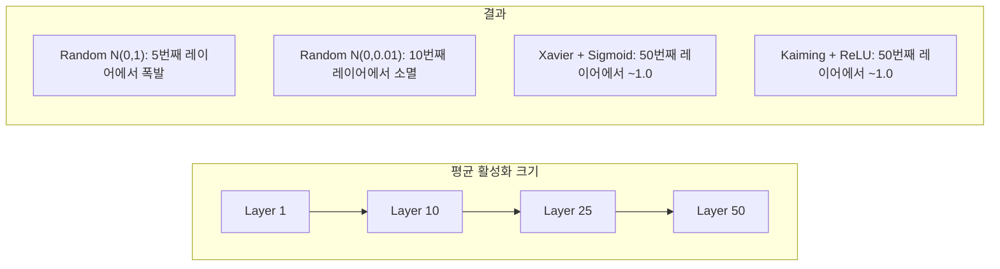
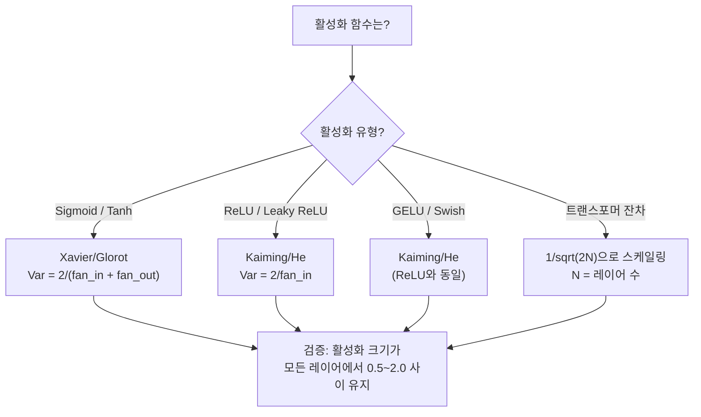

# 가중치 초기화와 훈련 안정성

> 잘못 초기화하면 훈련이 시작조차 되지 않습니다. 올바르게 초기화하면 50개 레이어도 3개 레이어 못지않게 부드럽게 훈련됩니다.

**유형:** 구축(Build)
**언어:** Python
**선수 지식:** 레슨 03.04 (활성화 함수), 레슨 03.07 (정규화)
**소요 시간:** ~90분

## 학습 목표

- 제로(Zero), 랜덤(Random), 자비에르/글로로트(Xavier/Glorot), 카이밍/허(Kaiming/He) 초기화 전략을 구현하고 50개 레이어를 통해 활성화 크기(activation magnitudes)에 미치는 영향을 측정
- 자비에르 초기화가 Var(w) = 2/(fan_in + fan_out)를 사용하는 이유와 카이밍이 Var(w) = 2/fan_in을 사용하는 이유 유도
- 제로 초기화의 대칭성 문제(symmetry problem)를 실증하고 랜덤 스케일(random scale)만으로는 부족한 이유 설명
- 활성화 함수에 맞는 올바른 초기화 전략 매칭: 시그모이드(sigmoid)/하이퍼볼릭 탄젠트(tanh)에는 자비에르, ReLU/GELU에는 카이밍

> **참고**:  
> - `fan_in`: 현재 레이어의 입력 유닛 수  
> - `fan_out`: 현재 레이어의 출력 유닛 수  
> - `Var(w)`: 가중치 분포의 분산(variance)

## 문제

모든 가중치를 0으로 초기화하면 아무것도 학습되지 않습니다. 모든 뉴런이 동일한 함수를 계산하고, 동일한 그래디언트를 수신하며, 동일하게 업데이트됩니다. 10,000 에포크 후에도 512개의 뉴런으로 구성된 은닉층은 여전히 동일한 뉴런의 512개 복사본일 뿐입니다. 512개의 파라미터에 비용을 지불했지만 실제로는 1개만 얻은 셈입니다.

가중치를 너무 크게 초기화하면 활성화 값이 네트워크를 통해 폭발적으로 증가합니다. 10번째 레이어에서는 값이 1e15에 도달하고, 20번째 레이어에서는 무한대로 오버플로우됩니다. 그래디언트도 역방향으로 동일한 경로를 따릅니다.

표준 정규 분포에서 무작위로 초기화하면 3개 레이어에서는 작동합니다. 하지만 50개 레이어에서는 무작위 스케일이 약간 작았는지 약간 컸는지에 따라 신호가 0으로 소멸하거나 무한대로 폭발합니다. "작동"과 "고장" 사이의 경계는 매우 좁습니다.

가중치 초기화는 딥러닝에서 가장 과소평가된 결정입니다. 아키텍처는 논문 주제로 다뤄지고, 옵티마이저는 블로그 포스트의 주제가 됩니다. 초기화는 각주로 처리되지만, 이를 잘못하면 다른 모든 것이 무의미해집니다 — 훈련이 시작되기 전에 네트워크가 이미 죽어버립니다.

## 개념

### 대칭 문제

레이어의 모든 뉴런은 동일한 구조를 가집니다: 입력에 가중치를 곱하고, 바이어스를 더한 후 활성화 함수를 적용합니다. 모든 가중치가 동일한 값(극단적인 경우 0)으로 시작하면 모든 뉴런이 동일한 출력을 계산합니다. 역전파 과정에서 모든 뉴런은 동일한 기울기를 받고, 업데이트 단계에서 동일한 양만큼 변화합니다.

이 경우 학습이 정체됩니다. 네트워크에는 수백 개의 매개변수가 있지만 모두 동기화되어 움직입니다. 이를 대칭 문제라고 하며, 무작위 초기화는 이를 깨는 강력한 방법입니다. 각 뉴런은 가중치 공간에서 서로 다른 지점에서 시작하므로 각각 다른 특징을 학습합니다.

하지만 "무작위"만으로는 충분하지 않습니다. 무작위성의 *규모*가 네트워크 학습 여부를 결정합니다.

### 레이어별 분산 전파

fan_in 입력을 받는 단일 레이어를 고려해 봅시다:

```
z = w1*x1 + w2*x2 + ... + w_n*x_n
```

각 가중치 wi가 분산 Var(w)를 가지는 분포에서 추출되고, 각 입력 xi가 분산 Var(x)를 가진다면, 출력 분산은 다음과 같습니다:

```
Var(z) = fan_in * Var(w) * Var(x)
```

Var(w) = 1이고 fan_in = 512이면 출력 분산은 입력 분산의 512배가 됩니다. 10개 레이어를 거치면: 512^10 = 1.2e27. 신호가 폭발합니다.

Var(w) = 0.001이면 출력 분산은 레이어당 0.001 * 512 = 0.512로 감소합니다. 10개 레이어를 거치면: 0.512^10 = 0.00013. 신호가 사라집니다.

목표: Var(z) = Var(x)가 되도록 Var(w)를 선택합니다. 신호 크기는 레이어를 통과하면서 일정하게 유지됩니다.

### Xavier/Glorot 초기화

Glorot과 Bengio(2010)는 시그모이드 및 tanh 활성화 함수에 대한 해법을 도출했습니다. 순전파와 역전파 모두에서 분산을 일정하게 유지하려면:

```
Var(w) = 2 / (fan_in + fan_out)
```

실제로 가중치는 다음 분포에서 추출됩니다:

```
w ~ Uniform(-limit, limit)  where limit = sqrt(6 / (fan_in + fan_out))
```

또는:

```
w ~ Normal(0, sqrt(2 / (fan_in + fan_out)))
```

이 방법은 시그모이드와 tanh가 0 근처에서 대략 선형이기 때문에 작동합니다. 적절히 초기화된 활성화 값이 이 영역에 머무르면 분산이 수십 개의 레이어를 거치면서도 안정적으로 유지됩니다.

### Kaiming/He 초기화

ReLU는 출력의 절반을 0으로 만듭니다(음수 값이 모두 0이 됨). 평균적으로 입력의 절반이 0이 되므로 유효 fan_in은 절반으로 줄어듭니다. Xavier 초기화는 이를 고려하지 않아 필요한 분산을 과소평가합니다.

He 등(2015)은 공식을 조정했습니다:

```
Var(w) = 2 / fan_in
```

가중치는 다음 분포에서 추출됩니다:

```
w ~ Normal(0, sqrt(2 / fan_in))
```

2의 계수는 ReLU가 활성화 값의 절반을 0으로 만드는 것을 보상합니다. 이 계수가 없으면 신호는 레이어당 ~0.5배씩 감소합니다. 50개 레이어를 거치면: 0.5^50 = 8.8e-16. Kaiming 초기화는 이를 방지합니다.

### 트랜스포머 초기화

GPT-2는 다른 패턴을 도입했습니다. 잔차 연결은 각 하위 레이어의 출력을 입력에 더합니다:

```
x = x + sublayer(x)
```

각 덧셈은 분산을 증가시킵니다. N개의 잔차 레이어가 있으면 분산은 N에 비례하여 증가합니다. GPT-2는 잔차 레이어의 가중치를 1/sqrt(2N)으로 스케일링합니다. 여기서 N은 레이어 수입니다. 이는 누적된 신호 크기를 안정적으로 유지합니다.

Llama 3(405B 매개변수, 126개 레이어)도 유사한 방식을 사용합니다. 이 스케일링이 없으면 잔차 스트림은 126개의 어텐션 및 피드포워드 블록을 거치면서 무한히 증가합니다.

```mermaid
flowchart TD
    subgraph "Zero Init"
        Z1["Layer 1<br/>모든 가중치 = 0"] --> Z2["Layer 2<br/>모든 뉴런 동일"]
        Z2 --> Z3["Layer 3<br/>여전히 동일"]
        Z3 --> ZR["결과: 1개의 유효 뉴런<br/>너비와 무관"]
    end

    subgraph "Xavier Init"
        X1["Layer 1<br/>Var = 2/(fan_in+fan_out)"] --> X2["Layer 2<br/>신호 안정적"]
        X2 --> X3["Layer 50<br/>신호 안정적"]
        X3 --> XR["결과: 학습 가능<br/>sigmoid/tanh 사용 시"]
    end

    subgraph "Kaiming Init"
        K1["Layer 1<br/>Var = 2/fan_in"] --> K2["Layer 2<br/>신호 안정적"]
        K2 --> K3["Layer 50<br/>신호 안정적"]
        K3 --> KR["결과: 학습 가능<br/>ReLU/GELU 사용 시"]
    end
```



### 50개 레이어를 통한 활성화 크기



### 적절한 초기화 방법 선택



## 구축 방법

### 1단계: 초기화 전략

가중치 행렬을 초기화하는 네 가지 방법. 각각 fan_in 열과 fan_out 행을 가진 2D 행렬(리스트의 리스트)을 반환합니다.

```python
import math
import random


def zero_init(fan_in, fan_out):
    return [[0.0 for _ in range(fan_in)] for _ in range(fan_out)]


def random_init(fan_in, fan_out, scale=1.0):
    return [[random.gauss(0, scale) for _ in range(fan_in)] for _ in range(fan_out)]


def xavier_init(fan_in, fan_out):
    std = math.sqrt(2.0 / (fan_in + fan_out))
    return [[random.gauss(0, std) for _ in range(fan_in)] for _ in range(fan_out)]


def kaiming_init(fan_in, fan_out):
    std = math.sqrt(2.0 / fan_in)
    return [[random.gauss(0, std) for _ in range(fan_in)] for _ in range(fan_out)]
```

### 2단계: 활성화 함수

각 초기화 전략을 해당 활성화 함수와 함께 테스트하기 위해 시그모이드, tanh, ReLU가 필요합니다.

```python
def sigmoid(x):
    x = max(-500, min(500, x))
    return 1.0 / (1.0 + math.exp(-x))


def tanh_act(x):
    return math.tanh(x)


def relu(x):
    return max(0.0, x)
```

### 3단계: 50개 레이어 순전파

랜덤 데이터를 깊은 네트워크에 통과시키고 각 레이어의 평균 활성화 크기를 측정합니다.

```python
def forward_deep(init_fn, activation_fn, n_layers=50, width=64, n_samples=100):
    random.seed(42)
    layer_magnitudes = []

    inputs = [[random.gauss(0, 1) for _ in range(width)] for _ in range(n_samples)]

    for layer_idx in range(n_layers):
        weights = init_fn(width, width)
        biases = [0.0] * width

        new_inputs = []
        for sample in inputs:
            output = []
            for neuron_idx in range(width):
                z = sum(weights[neuron_idx][j] * sample[j] for j in range(width)) + biases[neuron_idx]
                output.append(activation_fn(z))
            new_inputs.append(output)
        inputs = new_inputs

        magnitudes = []
        for sample in inputs:
            magnitudes.append(sum(abs(v) for v in sample) / width)
        mean_mag = sum(magnitudes) / len(magnitudes)
        layer_magnitudes.append(mean_mag)

    return layer_magnitudes
```

### 4단계: 실험 실행

모든 조합을 실행합니다: 제로 초기화, 랜덤 N(0,1), 랜덤 N(0,0.01), 시그모이드와 함께 Xavier, tanh와 함께 Xavier, ReLU와 함께 Kaiming. 주요 레이어의 크기를 출력합니다.

```python
def run_experiment():
    configs = [
        ("Zero init + Sigmoid", lambda fi, fo: zero_init(fi, fo), sigmoid),
        ("Random N(0,1) + ReLU", lambda fi, fo: random_init(fi, fo, 1.0), relu),
        ("Random N(0,0.01) + ReLU", lambda fi, fo: random_init(fi, fo, 0.01), relu),
        ("Xavier + Sigmoid", xavier_init, sigmoid),
        ("Xavier + Tanh", xavier_init, tanh_act),
        ("Kaiming + ReLU", kaiming_init, relu),
    ]

    print(f"{'Strategy':<30} {'L1':>10} {'L5':>10} {'L10':>10} {'L25':>10} {'L50':>10}")
    print("-" * 80)

    for name, init_fn, act_fn in configs:
        mags = forward_deep(init_fn, act_fn)
        row = f"{name:<30}"
        for idx in [0, 4, 9, 24, 49]:
            val = mags[idx]
            if val > 1e6:
                row += f" {'EXPLODED':>10}"
            elif val < 1e-6:
                row += f" {'VANISHED':>10}"
            else:
                row += f" {val:>10.4f}"
        print(row)
```

### 5단계: 대칭성 시연

제로 초기화가 동일한 뉴런을 생성함을 보여줍니다.

```python
def symmetry_demo():
    random.seed(42)
    weights = zero_init(2, 4)
    biases = [0.0] * 4

    inputs = [0.5, -0.3]
    outputs = []
    for neuron_idx in range(4):
        z = sum(weights[neuron_idx][j] * inputs[j] for j in range(2)) + biases[neuron_idx]
        outputs.append(sigmoid(z))

    print("\n대칭성 시연 (4개 뉴런, 제로 초기화):")
    for i, out in enumerate(outputs):
        print(f"  뉴런 {i}: 출력 = {out:.6f}")
    all_same = all(abs(outputs[i] - outputs[0]) < 1e-10 for i in range(len(outputs)))
    print(f"  모두 동일: {all_same}")
    print(f"  유효 파라미터: 1 (아닌 {len(weights) * len(weights[0])})")
```

### 6단계: 레이어별 크기 보고서

50개 레이어를 통과하는 활성화 크기의 시각적 막대 차트를 출력합니다.

```python
def magnitude_report(name, magnitudes):
    print(f"\n{name}:")
    for i, mag in enumerate(magnitudes):
        if i % 5 == 0 or i == len(magnitudes) - 1:
            if mag > 1e6:
                bar = "X" * 50 + " EXPLODED"
            elif mag < 1e-6:
                bar = "." + " VANISHED"
            else:
                bar_len = min(50, max(1, int(mag * 10)))
                bar = "#" * bar_len
            print(f"  레이어 {i+1:3d}: {bar} ({mag:.6f})")
```

## 사용 방법

PyTorch는 다음과 같은 내장 함수를 제공합니다:

```python
import torch
import torch.nn as nn

layer = nn.Linear(512, 256)

nn.init.xavier_uniform_(layer.weight)
nn.init.xavier_normal_(layer.weight)

nn.init.kaiming_uniform_(layer.weight, nonlinearity='relu')
nn.init.kaiming_normal_(layer.weight, nonlinearity='relu')

nn.init.zeros_(layer.bias)
```

`nn.Linear(512, 256)`를 호출할 때 PyTorch는 기본적으로 Kaiming 균일 초기화를 사용합니다. 그래서 대부분의 간단한 네트워크가 "그냥 작동"하는 것입니다 — PyTorch가 이미 올바른 선택을 했기 때문입니다. 하지만 커스텀 아키텍처를 구축하거나 20층보다 깊게 갈 때는 내부 동작을 이해하고 필요시 기본값을 재정의해야 합니다.

트랜스포머의 경우, HuggingFace 모델들은 일반적으로 `_init_weights` 메서드에서 초기화를 처리합니다. GPT-2 구현에서는 잔차 투영(residual projections)을 1/√N 비율로 스케일링합니다. 트랜스포머를 처음부터 구축하는 경우 이 부분을 직접 추가해야 합니다.

## Ship It

이 레슨은 다음을 생성합니다:
- `outputs/prompt-init-strategy.md` -- 가중치 초기화 문제를 진단하고 적절한 전략을 추천하는 프롬프트

## 연습 문제

1. LeCun 초기화(Var = 1/fan_in, SELU 활성화 함수용 설계)를 추가하세요. 50층 실험을 LeCun 초기화 + tanh로 실행하고 Xavier + tanh와 비교하세요.

2. GPT-2 잔차 스케일링을 구현하세요: 각 레이어의 출력에 1/sqrt(2*N)을 곱한 후 잔차 스트림에 더하세요. 스케일링 유무에 따라 50층을 실행하고 잔차 크기가 얼마나 빠르게 증가하는지 측정하세요.

3. 네트워크의 레이어 차원과 활성화 함수 유형을 입력받아 올바른 초기화를 추천하고 현재 초기화가 문제를 일으킬 경우 경고하는 "초기화 상태 점검" 함수를 만드세요.

4. fan_in = 16과 fan_in = 1024로 실험을 실행하세요. Xavier와 Kaiming은 fan_in에 적응하지만 무작위 초기화는 그렇지 않습니다. 더 큰 레이어에서 "작동"과 "실패" 간 격차가 어떻게 벌어지는지 보여주세요.

5. 직교 초기화(랜덤 행렬 생성 후 SVD 계산, 직교 행렬 U 사용)를 구현하세요. 50층 ReLU 네트워크에서 Kaiming과 비교하세요.

## 주요 용어

| 용어 | 사람들이 말하는 것 | 실제 의미 |
|------|----------------|----------------------|
| 가중치 초기화(Weight initialization) | "시작 가중치를 무작위로 설정" | 네트워크가 훈련될 수 있는지 여부를 결정하는 초기 가중치 값 선택 전략 |
| 대칭성 깨짐(Symmetry breaking) | "뉴런을 다르게 만들기" | 무작위 초기화를 사용하여 뉴런이 동일한 함수를 계산하는 대신 서로 다른 특징을 학습하도록 보장 |
| 팬인(Fan-in) | "뉴런의 입력 수" | 입력 연결 수, 가중치 합에서 입력 분산이 누적되는 방식을 결정 |
| 팬아웃(Fan-out) | "뉴런의 출력 수" | 출력 연결 수, 역전파 시 기울기 분산 유지에 관련됨 |
| 자비에/글로로트 초기화(Xavier/Glorot init) | "시그모이드 초기화" | Var(w) = 2/(fan_in + fan_out), 시그모이드 및 tanh 활성화 함수를 통해 분산 보존을 위해 설계됨 |
| 카이밍/허 초기화(Kaiming/He init) | "ReLU 초기화" | Var(w) = 2/fan_in, ReLU가 활성화의 절반을 0으로 만드는 것을 고려함 |
| 분산 전파(Variance propagation) | "레이어를 통해 신호가 성장하거나 축소되는 방식" | 가중치 스케일에 따라 활성화 분산이 레이어별로 어떻게 변화하는지 수학적으로 분석 |
| 잔차 스케일링(Residual scaling) | "GPT-2의 초기화 트릭" | N개의 트랜스포머 레이어를 통해 분산 성장을 방지하기 위해 잔차 연결 가중치를 1/sqrt(2N)으로 스케일링 |
| 죽은 네트워크(Dead network) | "아무것도 훈련되지 않음" | 부적절한 초기화로 인해 모든 기울기가 0이 되거나 모든 활성화가 포화되는 네트워크 |
| 폭발적 활성화(Exploding activations) | "값이 무한대로 발산" | 가중치 분산이 너무 높아 활성화 크기가 레이어를 통해 기하급수적으로 증가하는 경우 |

## 추가 자료

- Glorot & Bengio, "Understanding the difficulty of training deep feedforward neural networks" (2010) -- 분산 분석을 포함한 원본 Xavier 초기화(초기화) 논문
- He et al., "Delving Deep into Rectifiers" (2015) -- ReLU 네트워크를 위한 Kaiming 초기화(초기화) 제안
- Radford et al., "Language Models are Unsupervised Multitask Learners" (2019) -- 잔차 스케일링 초기화(초기화)를 포함한 GPT-2 논문
- Mishkin & Matas, "All You Need is a Good Init" (2016) -- 분석적 공식의 경험적 대안인 계층 순차적 단위 분산 초기화(초기화)