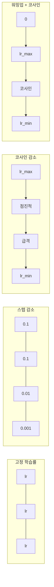
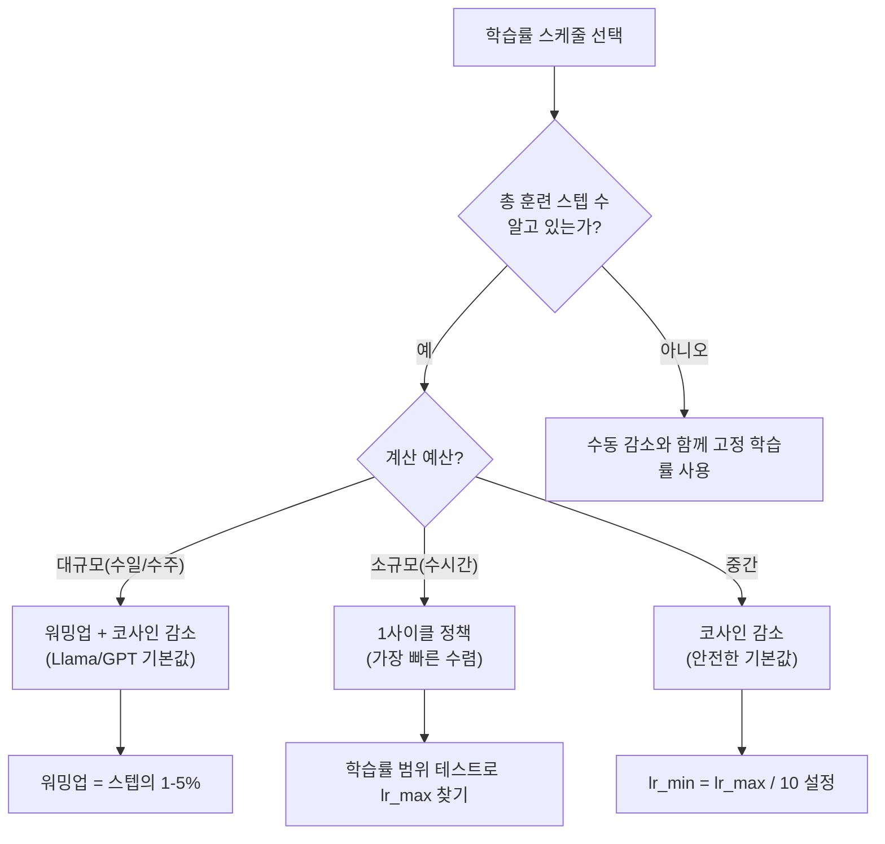
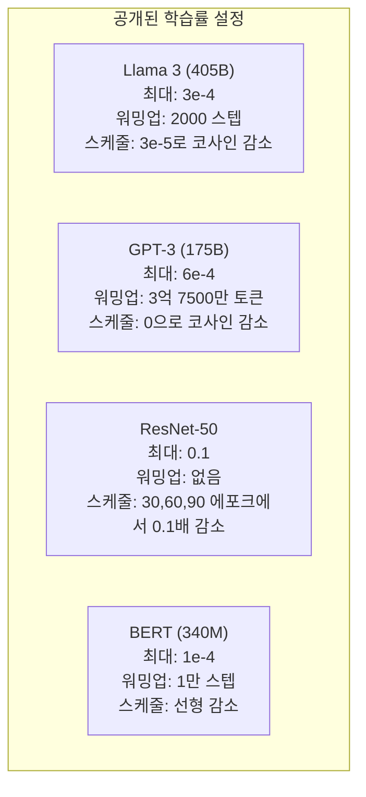

# 학습률 스케줄과 워밍업

> 학습률은 가장 중요한 하이퍼파라미터입니다. 모델 구조도, 데이터셋 크기도, 활성화 함수도 아닙니다. 학습률이 가장 중요합니다. 다른 것은 조정하지 않더라도 이것만은 반드시 조정하세요.

**유형:** 구축(Build)
**언어:** Python
**선수 지식:** 레슨 03.06 (옵티마이저), 레슨 03.08 (가중치 초기화)
**소요 시간:** ~90분

## 학습 목표

- 상수, 스텝 디케이, 코사인 어닐링, 웜업 + 코사인, 1사이클 학습률 스케줄러를 직접 구현
- 학습률 선택의 세 가지 실패 모드(너무 높을 때 발산, 너무 낮을 때 정체, 디케이 없을 때 진동) 시연
- Adam 기반 옵티마이저에 웜업이 필요한 이유와 초기 훈련 안정화 메커니즘 설명
- 동일한 태스크에서 5가지 스케줄러의 수렴 속도 비교 및 주어진 훈련 예산에 적합한 스케줄러 선택 방법

## 문제

학습률(learning rate)을 0.1로 설정하면 훈련이 발산합니다 — 3단계 만에 손실(loss)이 무한대로 뛰어오릅니다. 0.0001로 설정하면 훈련이 매우 느립니다 — 100 에포크(epoch)가 지나도 모델이 랜덤 초기값에서 거의 움직이지 않습니다. 0.01로 설정하면 50 에포크 동안 훈련이 작동하지만, 이후 손실이 너무 큰 단계로 인해 절대 도달할 수 없는 최소값 주변에서 진동합니다.

최적의 학습률은 상수가 아닙니다. 훈련 중에 변화합니다. 초기에는 빠르게 영역을 커버하기 위해 큰 단계가 필요합니다. 훈련 후반에는 날카로운 최소값에 안착하기 위해 아주 작은 단계가 필요합니다. 90% 정확도의 모델과 95% 정확도의 모델 차이는 종종 단순히 스케줄에 달려 있습니다.

지난 3년간 발표된 모든 주요 모델은 학습률 스케줄(learning rate schedule)을 사용합니다. Llama 3는 2000개의 워밍업(warmup) 단계와 함께 3e-4의 최대 학습률(peak lr)을 사용하고 코사인 감소(cosine decay)로 3e-5까지 낮췄습니다. GPT-3는 3억 7500만 토큰에 걸쳐 워밍업을 진행한 6e-4의 학습률을 사용했습니다. 이는 임의의 선택이 아닙니다. 수백만 달러의 비용이 드는 광범위한 하이퍼파라미터 탐색(hyperparameter sweep)의 결과입니다.

스케줄을 이해해야 하는 이유는 기본값이 당신의 문제에 맞지 않기 때문입니다. 사전 훈련된 모델을 파인튜닝(fine-tuning)할 때, 올바른 스케줄은 처음부터 훈련하는 경우와 다릅니다. 배치 크기(batch size)를 증가시킬 때, 워밍업 기간을 변경해야 합니다. 훈련이 10,000단계에서 실패할 때, 스케줄 문제인지 아니면 다른 문제인지 구분할 수 있어야 합니다.

## 학습률 스케줄링 개념

### 고정 학습률(Constant Learning Rate)

가장 단순한 접근법. 숫자를 하나 선택하고 모든 스텝에 사용.

```
lr(t) = lr_0
```

거의 최적이 아님. 훈련 후반에는 너무 높아 최소값 주변에서 진동하거나, 초반에는 너무 낮아 작은 스텝으로 계산 자원을 낭비함. 작은 모델이나 디버깅에는 적합. 1시간 이상 훈련하는 경우 최악의 선택.

### 스텝 감소(Step Decay)

ResNet 시대의 구식 접근법. 고정된 에포크에서 학습률을 일정 비율(보통 10배) 감소.

```
lr(t) = lr_0 * gamma^(floor(epoch / step_size))
```

gamma = 0.1, step_size = 30일 때: 30 에포크마다 학습률이 10배 감소. ResNet-50은 이 방식을 사용 — lr=0.1, 30, 60, 90 에포크에서 10배 감소.

문제점: 최적의 감소 지점은 데이터셋과 아키텍처에 의존. 다른 문제로 이동하면 감소 시점을 재조정해야 함. 전환이 급격해 학습률이 갑자기 변할 때 손실이 급증할 수 있음.

### 코사인 감소(Cosine Annealing)

최대 학습률에서 최소 학습률로 코사인 곡선을 따라 부드럽게 감소:

```
lr(t) = lr_min + 0.5 * (lr_max - lr_min) * (1 + cos(pi * t / T))
```

t는 현재 스텝, T는 총 스텝 수. t=0일 때 코사인 항은 1이므로 lr = lr_max. t=T일 때 코사인 항은 -1이므로 lr = lr_min. 감소는 처음에는 완만하다가 중간에 가속되고, 후반에는 다시 완만해짐.

대부분의 현대 훈련 실행에서 기본값. lr_max와 lr_min 외에 튜닝할 하이퍼파라미터 없음. 코사인 형태는 대부분의 학습이 훈련 중간에 일어난다는 경험적 관찰과 일치 — 이 중요한 기간 동안 적절한 스텝 크기를 원함.

### 워밍업(Warmup): 작게 시작하는 이유

Adam과 같은 적응형 옵티마이저는 그래디언트 평균과 분산의 실행 평균을 유지. 스텝 0에서 이 추정값은 0으로 초기화. 처음 몇 그래디언트 업데이트는 쓰레기 통계에 기반. 이 기간 동안 학습률이 크면 모델이 크고 방향이 잘못된 스텝을 취함.

워밍업이 이를 해결. 작은 학습률(종종 lr_max / warmup_steps 또는 0)로 시작해 처음 N 스텝 동안 선형적으로 lr_max까지 증가. 전체 학습률에 도달할 때쯤 Adam의 통계가 안정화됨.

```
lr(t) = lr_max * (t / warmup_steps)     for t < warmup_steps
```

일반적인 워밍업: 전체 훈련 스텝의 1-5%. Llama 3은 약 1.8조 토큰을 훈련하고 2000 스텝 동안 워밍업. GPT-3은 3억 7500만 토큰 동안 워밍업.

### 선형 워밍업 + 코사인 감소

현대 기본값. 선형적으로 증가 후 코사인 감소:

```
if t < warmup_steps:
    lr(t) = lr_max * (t / warmup_steps)
else:
    progress = (t - warmup_steps) / (total_steps - warmup_steps)
    lr(t) = lr_min + 0.5 * (lr_max - lr_min) * (1 + cos(pi * progress))
```

Llama, GPT, PaLM 및 대부분의 현대 트랜스포머에서 사용. 워밍업은 초기 불안정성을 방지. 코사인 감소는 모델을 좋은 최소값으로 안정화.

### 1사이클 정책(1cycle Policy)

Leslie Smith의 발견(2018): 훈련 전반부에 학습률을 낮은 값에서 높은 값으로 증가시킨 후 후반부에 다시 감소. 직관적이지 않음 — 왜 중간에 학습률을 *증가*할까?

이론: 높은 학습률은 최적화 경로에 노이즈를 추가해 정규화 역할을 함. 모델은 증가 단계에서 손실 지형을 더 탐색해 더 나은 영역을 찾음. 감소 단계에서는 찾은 최적 영역을 개선.

```
Phase 1 (0 to T/2):    lr ramps from lr_max/25 to lr_max
Phase 2 (T/2 to T):    lr ramps from lr_max to lr_max/10000
```

1사이클은 고정된 계산 예산에서 코사인 감소보다 빠르게 훈련할 수 있음. 단점: 총 스텝 수를 미리 알아야 함.

### 스케줄 형태



### 결정 흐름도



### 공개된 모델의 실제 설정



## 구축 방법

### 1단계: 스케줄 함수 정의

각 함수는 현재 스텝을 입력으로 받아 해당 스텝에서의 학습률(learning rate)을 반환합니다.

```python
import math


def constant_schedule(step, lr=0.01, **kwargs):
    return lr


def step_decay_schedule(step, lr=0.1, step_size=100, gamma=0.1, **kwargs):
    return lr * (gamma ** (step // step_size))


def cosine_schedule(step, lr=0.01, total_steps=1000, lr_min=1e-5, **kwargs):
    if step >= total_steps:
        return lr_min
    return lr_min + 0.5 * (lr - lr_min) * (1 + math.cos(math.pi * step / total_steps))


def warmup_cosine_schedule(step, lr=0.01, total_steps=1000, warmup_steps=100, lr_min=1e-5, **kwargs):
    if total_steps <= warmup_steps:
        return lr * (step / max(warmup_steps, 1))
    if step < warmup_steps:
        return lr * step / warmup_steps
    progress = (step - warmup_steps) / (total_steps - warmup_steps)
    return lr_min + 0.5 * (lr - lr_min) * (1 + math.cos(math.pi * progress))


def one_cycle_schedule(step, lr=0.01, total_steps=1000, **kwargs):
    mid = max(total_steps // 2, 1)
    if step < mid:
        return (lr / 25) + (lr - lr / 25) * step / mid
    else:
        progress = (step - mid) / max(total_steps - mid, 1)
        return lr * (1 - progress) + (lr / 10000) * progress
```

### 2단계: 모든 스케줄 시각화

각 스케줄이 훈련 과정에서 어떻게 변화하는지 텍스트 기반 플롯으로 출력합니다.

```python
def visualize_schedule(name, schedule_fn, total_steps=500, **kwargs):
    steps = list(range(0, total_steps, total_steps // 20))
    if total_steps - 1 not in steps:
        steps.append(total_steps - 1)

    lrs = [schedule_fn(s, total_steps=total_steps, **kwargs) for s in steps]
    max_lr = max(lrs) if max(lrs) > 0 else 1.0

    print(f"\n{name}:")
    for s, lr_val in zip(steps, lrs):
        bar_len = int(lr_val / max_lr * 40)
        bar = "#" * bar_len
        print(f"  Step {s:4d}: lr={lr_val:.6f} {bar}")
```

### 3단계: 네트워크 훈련

이전 레슨과 동일한 원 데이터셋(circle dataset)에 대한 간단한 2층 네트워크를 사용하되, 이번에는 스케줄을 다양하게 변경합니다.

```python
import random


def sigmoid(x):
    x = max(-500, min(500, x))
    return 1.0 / (1.0 + math.exp(-x))


def relu(x):
    return max(0.0, x)


def relu_deriv(x):
    return 1.0 if x > 0 else 0.0


def make_circle_data(n=200, seed=42):
    random.seed(seed)
    data = []
    for _ in range(n):
        x = random.uniform(-2, 2)
        y = random.uniform(-2, 2)
        label = 1.0 if x * x + y * y < 1.5 else 0.0
        data.append(([x, y], label))
    return data


def train_with_schedule(schedule_fn, schedule_name, data, epochs=300, base_lr=0.05, **kwargs):
    random.seed(0)
    hidden_size = 8
    total_steps = epochs * len(data)

    std = math.sqrt(2.0 / 2)
    w1 = [[random.gauss(0, std) for _ in range(2)] for _ in range(hidden_size)]
    b1 = [0.0] * hidden_size
    w2 = [random.gauss(0, std) for _ in range(hidden_size)]
    b2 = 0.0

    step = 0
    epoch_losses = []

    for epoch in range(epochs):
        total_loss = 0
        correct = 0

        for x, target in data:
            lr = schedule_fn(step, lr=base_lr, total_steps=total_steps, **kwargs)

            z1 = []
            h = []
            for i in range(hidden_size):
                z = w1[i][0] * x[0] + w1[i][1] * x[1] + b1[i]
                z1.append(z)
                h.append(relu(z))

            z2 = sum(w2[i] * h[i] for i in range(hidden_size)) + b2
            out = sigmoid(z2)

            error = out - target
            d_out = error * out * (1 - out)

            for i in range(hidden_size):
                d_h = d_out * w2[i] * relu_deriv(z1[i])
                w2[i] -= lr * d_out * h[i]
                for j in range(2):
                    w1[i][j] -= lr * d_h * x[j]
                b1[i] -= lr * d_h
            b2 -= lr * d_out

            total_loss += (out - target) ** 2
            if (out >= 0.5) == (target >= 0.5):
                correct += 1
            step += 1

        avg_loss = total_loss / len(data)
        accuracy = correct / len(data) * 100
        epoch_losses.append(avg_loss)

    return epoch_losses
```

### 4단계: 모든 스케줄 비교

각 스케줄로 동일한 네트워크를 훈련시키고 최종 손실(loss)과 수렴(convergence) 행동을 비교합니다.

```python
def compare_schedules(data):
    configs = [
        ("Constant", constant_schedule, {}),
        ("Step Decay", step_decay_schedule, {"step_size": 15000, "gamma": 0.1}),
        ("Cosine", cosine_schedule, {"lr_min": 1e-5}),
        ("Warmup+Cosine", warmup_cosine_schedule, {"warmup_steps": 3000, "lr_min": 1e-5}),
        ("1cycle", one_cycle_schedule, {}),
    ]

    print(f"\n{'Schedule':<20} {'Start Loss':>12} {'Mid Loss':>12} {'End Loss':>12} {'Best Loss':>12}")
    print("-" * 70)

    for name, schedule_fn, extra_kwargs in configs:
        losses = train_with_schedule(schedule_fn, name, data, epochs=300, base_lr=0.05, **extra_kwargs)
        mid_idx = len(losses) // 2
        best = min(losses)
        print(f"{name:<20} {losses[0]:>12.6f} {losses[mid_idx]:>12.6f} {losses[-1]:>12.6f} {best:>12.6f}")
```

### 5단계: 학습률 민감도 분석

학습률이 너무 높은 경우(발산), 너무 낮은 경우(느린 학습), 적절한 경우의 3가지 실패 모드를 보여줍니다.

```python
def lr_sensitivity(data):
    learning_rates = [1.0, 0.1, 0.01, 0.001, 0.0001]

    print("\nLR Sensitivity (constant schedule, 100 epochs):")
    print(f"  {'LR':>10} {'Start Loss':>12} {'End Loss':>12} {'Status':>15}")
    print("  " + "-" * 52)

    for lr in learning_rates:
        losses = train_with_schedule(constant_schedule, f"lr={lr}", data, epochs=100, base_lr=lr)
        start = losses[0]
        end = losses[-1]

        if end > start or math.isnan(end) or end > 1.0:
            status = "DIVERGED"
        elif end > start * 0.9:
            status = "BARELY MOVED"
        elif end < 0.15:
            status = "CONVERGED"
        else:
            status = "LEARNING"

        end_str = f"{end:.6f}" if not math.isnan(end) else "NaN"
        print(f"  {lr:>10.4f} {start:>12.6f} {end_str:>12} {status:>15}")
```

## 사용 방법

PyTorch는 `torch.optim.lr_scheduler`에서 스케줄러를 제공합니다:

```python
import torch
import torch.optim as optim
from torch.optim.lr_scheduler import CosineAnnealingLR, OneCycleLR, StepLR

model = nn.Sequential(nn.Linear(10, 64), nn.ReLU(), nn.Linear(64, 1))
optimizer = optim.Adam(model.parameters(), lr=3e-4)

scheduler = CosineAnnealingLR(optimizer, T_max=1000, eta_min=1e-5)

for step in range(1000):
    loss = train_step(model, optimizer)
    scheduler.step()
```

워밍업 + 코사인 스케줄링을 사용하려면 람다 스케줄러 또는 HuggingFace의 `get_cosine_schedule_with_warmup`을 사용하세요:

```python
from transformers import get_cosine_schedule_with_warmup

scheduler = get_cosine_schedule_with_warmup(
    optimizer,
    num_warmup_steps=2000,
    num_training_steps=100000,
)
```

HuggingFace 함수는 대부분의 Llama 및 GPT 파인튜닝(fine-tuning) 스크립트에서 사용됩니다. 확신이 없을 때는 전체 스텝의 3-5%를 워밍업으로 설정한 코사인 스케줄링을 사용하세요. 거의 모든 경우에 잘 작동합니다.

## Ship It

이 레슨은 다음을 생성합니다:
- `outputs/prompt-lr-schedule-advisor.md` -- 학습 설정에 적합한 학습률 스케줄과 하이퍼파라미터를 추천하는 프롬프트

## 연습 문제

1. 지수 감쇠(exponential decay) 구현: lr(t) = lr_0 * gamma^t (여기서 gamma = 0.999). 원 데이터셋(circle dataset)에서 코사인 감쇠(cosine annealing)와 비교.

2. 학습률 범위 테스트(Leslie Smith) 구현: 1e-7부터 1까지 지수적으로 학습률(LR)을 증가시키며 수백 스텝 동안 학습. 손실(loss) 대 학습률(LR) 그래프 그리기. 최적의 최대 학습률(LR)은 손실이 증가하기 바로 직전 값.

3. 워밍업(warmup) + 코사인(cosine) 학습률 스케줄링으로 학습하되, 워밍업 길이 변경: 전체 스텝의 0%, 1%, 5%, 10%, 20%. 학습이 가장 안정적인 최적 지점(sweet spot) 찾기.

4. 웜 리스타트(warm restarts)가 포함된 코사인 감쇠(SGDR) 구현: T 스텝마다 학습률을 lr_max로 재설정하고 다시 감쇠. 더 긴 학습 실행에서 표준 코사인 감쇠와 비교.

5. "스케줄 외과의(schedule surgeon)" 구축: 훈련 손실(training loss)을 모니터링하고, 손실이 안정되면 워밍업에서 코사인으로 자동 전환, 손실이 너무 오래 정체되면 학습률 감소.

## 주요 용어

| 용어 | 사람들이 말하는 것 | 실제 의미 |
|------|----------------|----------------------|
| 학습률(learning rate) | "모델이 학습하는 속도" | 기울기(gradient)에 곱해져 파라미터 업데이트 크기를 결정하는 스칼라 값 |
| 스케줄(schedule) | "시간에 따라 LR을 변경" | 훈련 단계를 학습률(learning rate)에 매핑하는 함수로, 수렴 최적화를 위해 설계됨 |
| 워밍업(warmup) | "작은 LR로 시작" | 처음 N 단계 동안 LR을 거의 0에서 목표 값까지 선형적으로 증가시켜 옵티마이저 통계를 안정화 |
| 코사인 어닐링(cosine annealing) | "부드러운 LR 감소" | 훈련 동안 코사인 곡선을 따라 lr_max에서 lr_min으로 LR을 감소 |
| 스텝 디케이(step decay) | "마일스톤에서 LR 감소" | 고정된 에폭 간격으로 LR을 특정 계수(보통 0.1)로 곱해 감소 |
| 1사이클 정책(1cycle policy) | "상승 후 하강" | 레슬리 스미스(Leslie Smith)의 방법으로, 단일 사이클에서 LR을 상승 후 하강시켜 더 빠른 수렴 달성 |
| LR 범위 테스트(LR range test) | "최적의 학습률 찾기" | LR을 증가시키면서 짧게 훈련하여 손실이 발산하기 시작하는 값 찾기 |
| 웜 리스타트가 있는 코사인(cosine with warm restarts) | "리셋 후 반복" | 주기적으로 LR을 lr_max로 리셋하고 다시 감소 (SGDR) |
| 에타 최소(eta min) | "LR의 바닥" | 스케줄이 감소하는 최소 학습률(learning rate) |
| 피크 학습률(peak learning rate) | "최대 LR" | 훈련 중 도달하는 최고 학습률, 일반적으로 워밍업 후 값 |

## 추가 자료

- Loshchilov & Hutter, "SGDR: Stochastic Gradient Descent with Warm Restarts" (2017) -- 코사인 감소(cosine annealing)와 웜 리스타트(warm restarts) 기법 소개
- Smith, "Super-Convergence: Very Fast Training of Neural Networks Using Large Learning Rates" (2018) -- 1사이클(1cycle) 정책 논문
- Touvron et al., "Llama 2: Open Foundation and Fine-Tuned Chat Models" (2023) -- 대규모 적용 시 사용된 웜업(warmup) + 코사인 스케줄(cosine schedule) 문서화
- Goyal et al., "Accurate, Large Minibatch SGD: Training ImageNet in 1 Hour" (2017) -- 대규모 배치 훈련을 위한 선형 스케일링 규칙(linear scaling rule) 및 웜업(warmup) 기법