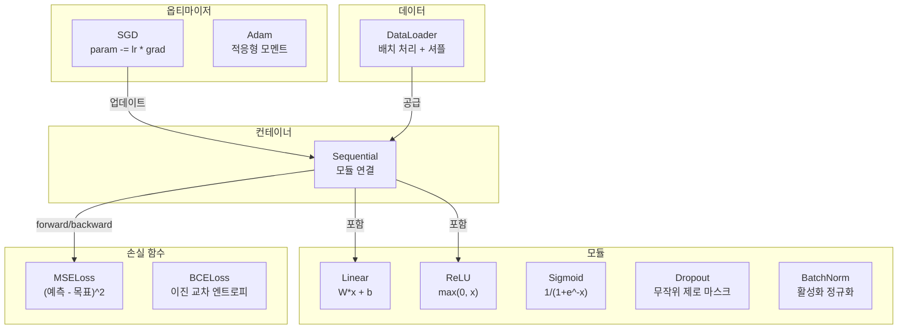
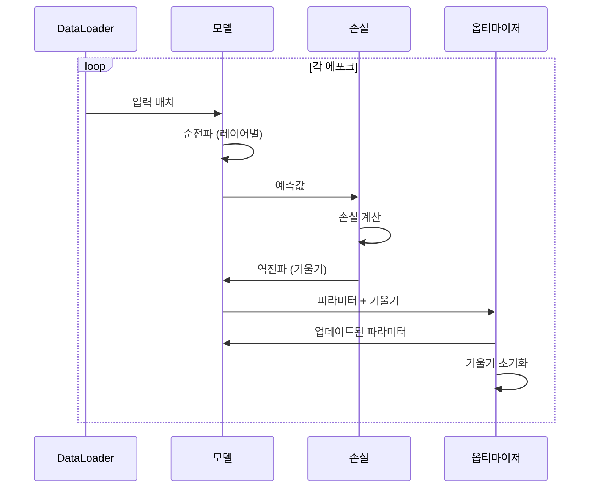
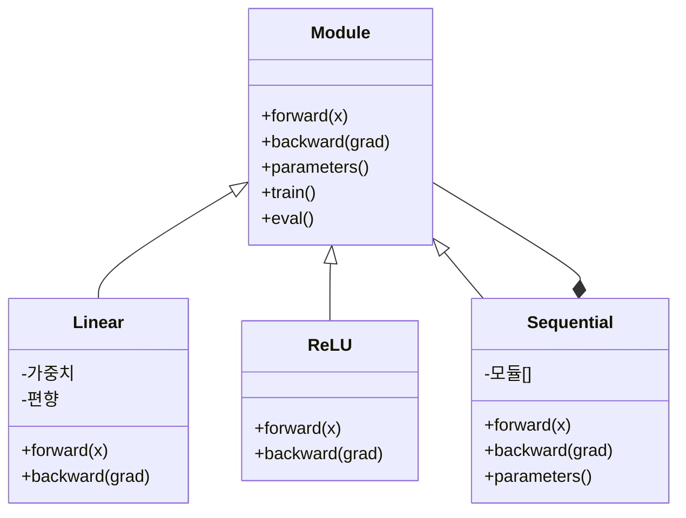

# 나만의 미니 프레임워크 구축하기

> 뉴런, 레이어, 네트워크, 역전파, 활성화 함수, 손실 함수, 옵티마이저, 정규화, 초기화, 학습률 스케줄러를 모두 별도의 구성 요소로 구현했습니다. 이제 이들을 연결하여 프레임워크를 만들어 보세요. PyTorch도, TensorFlow도 아닌 바로 여러분의 프레임워크입니다.

**유형:** 구축
**언어:** Python
**선수 지식:** Phase 03 전체 (레슨 01-09)
**소요 시간:** ~120분

## 학습 목표

- **Module, Linear, ReLU, Sigmoid, Dropout, BatchNorm, Sequential, 손실 함수, 옵티마이저, DataLoader**를 포함한 완전한 딥러닝 프레임워크(~500줄) 구축
- **Module 추상화**(forward, backward, parameters) 설명 및 **train/eval 모드 전환** 필요성 설명
- 모든 구성 요소를 연결하여 **원 분류(circle classification) 작업을 수행하는 4층 네트워크 훈련 루프** 구현
- 프레임워크의 각 구성 요소를 **PyTorch 대응 요소**(nn.Module, nn.Sequential, optim.Adam, DataLoader)에 매핑

> **참고**:  
> - `Module`은 PyTorch의 `nn.Module`과 동일한 추상화 계층  
> - `Sequential`은 레이어를 순차적으로 연결하는 컨테이너  
> - `train/eval 모드`는 Dropout/BatchNorm과 같은 레이어의 동작 방식을 변경하기 위해 필요  
> - `DataLoader`는 미니배치 샘플링 및 데이터 증강을 지원

## 문제

10개의 레슨에 걸쳐 별도의 파일에 흩어져 있는 빌딩 블록들이 있습니다. 여기에는 `Value` 클래스, 훈련 루프, 다른 파일의 가중치 초기화, 또 다른 파일의 학습률 스케줄 등이 있습니다. 네트워크를 훈련시키려면 5개의 다른 레슨에서 복사-붙여넣기를 하고 직접 연결해야 합니다.

이것이 프레임워크가 해결하는 문제입니다. PyTorch는 `nn.Module`, `nn.Sequential`, `optim.Adam`, `DataLoader` 및 이들을 연결하는 훈련 루프 패턴을 제공합니다. TensorFlow는 `keras.Layer`, `keras.Sequential`, `keras.optimizers.Adam`을 제공합니다. 이들은 마법이 아닙니다. 매번 배관 작업을 다시 하지 않고도 네트워크를 정의, 훈련, 평가할 수 있게 해주는 조직 패턴입니다.

약 500줄의 파이썬 코드로 동일한 것을 구축할 것입니다. NumPy도, 외부 의존성도 없습니다. 임의의 피드포워드 네트워크를 정의하고, SGD 또는 Adam으로 훈련하며, 데이터를 배치 처리하고, 드롭아웃과 배치 정규화를 적용하며, 임의의 활성화 함수를 사용하고, 학습률을 스케줄링할 수 있는 프레임워크입니다.

작업을 마치면 PyTorch에서 `model = nn.Sequential(...)`을 작성할 때 정확히 어떤 일이 일어나는지 이해하게 될 것입니다. `model.train()`과 `model.eval()`이 왜 존재하는지, `optimizer.zero_grad()`가 왜 별도의 호출인지, 이 모든 것을 직접 구축했기 때문에 완전히 이해하게 될 것입니다.

## 개념

### 모듈 추상화

PyTorch의 모든 레이어는 `nn.Module`에서 상속됩니다. 모듈은 세 가지 책임을 가집니다:

1. **forward()** -- 입력에 대한 출력 계산
2. **parameters()** -- 모든 학습 가능한 가중치 반환
3. **backward()** -- 기울기 계산 (PyTorch에서는 autograd가 처리, 우리 구현에서는 명시적)

Linear 레이어는 모듈입니다. ReLU 활성화 함수는 모듈입니다. 드롭아웃 레이어는 모듈입니다. 배치 정규화 레이어도 모듈입니다. 모두 동일한 인터페이스를 가집니다.

### 순차적 컨테이너

`nn.Sequential`은 모듈을 연결합니다. 순전파: 데이터를 모듈 1 → 모듈 2 → 모듈 3 순으로 전달합니다. 역전파: 체인을 역순으로 처리합니다. 컨테이너 자체도 모듈입니다 — forward(), parameters(), backward()를 가집니다. 이는 컴포지트 패턴입니다: 모듈 시퀀스는 그 자체로 모듈입니다.

### 훈련 vs 평가 모드

드롭아웃은 훈련 시 뉴런을 무작위로 비활성화하지만 평가 시에는 모든 값을 통과시킵니다. 배치 정규화는 훈련 시 배치 통계를 사용하고 평가 시 이동 평균을 사용합니다. `train()`과 `eval()` 메서드가 이 동작을 전환합니다. 모든 모듈에는 `training` 플래그가 있습니다.

### 옵티마이저

옵티마이저는 기울기를 사용하여 파라미터를 업데이트합니다. SGD: `param -= lr * grad`. Adam: 모멘텀과 분산 추정치를 유지한 후 업데이트합니다. 옵티마이저는 네트워크 구조를 알지 못합니다 — 평탄한 파라미터 목록과 기울기만을 봅니다.

### 데이터로더

배치 처리는 두 가지 이유로 중요합니다. 첫째, 대규모 문제에서는 전체 데이터셋을 메모리에 올릴 수 없습니다. 둘째, 미니배치 경사 하강법은 국소 최소값 탈출에 도움이 되는 노이즈를 제공합니다. 데이터로더는 데이터를 배치로 분할하고 에포크 사이에 선택적으로 셔플합니다.

### 프레임워크 아키텍처



### 훈련 루프



### 모듈 계층 구조



## 구축 단계

### 1단계: 모듈 기본 클래스

모든 레이어가 구현하는 추상 인터페이스.

```python
class Module:
    def __init__(self):
        self.training = True

    def forward(self, x):
        raise NotImplementedError

    def backward(self, grad):
        raise NotImplementedError

    def parameters(self):
        return []

    def train(self):
        self.training = True

    def eval(self):
        self.training = False
```

### 2단계: 선형 레이어

기본 구성 요소. 가중치와 편향을 저장하고, 순전파 시 Wx + b를 계산하며, 역전파 시 가중치/입력 기울기를 계산.

```python
import math
import random


class Linear(Module):
    def __init__(self, fan_in, fan_out):
        super().__init__()
        std = math.sqrt(2.0 / fan_in)
        self.weights = [[random.gauss(0, std) for _ in range(fan_in)] for _ in range(fan_out)]
        self.biases = [0.0] * fan_out
        self.weight_grads = [[0.0] * fan_in for _ in range(fan_out)]
        self.bias_grads = [0.0] * fan_out
        self.fan_in = fan_in
        self.fan_out = fan_out
        self.input = None

    def forward(self, x):
        self.input = x
        output = []
        for i in range(self.fan_out):
            val = self.biases[i]
            for j in range(self.fan_in):
                val += self.weights[i][j] * x[j]
            output.append(val)
        return output

    def backward(self, grad):
        input_grad = [0.0] * self.fan_in
        for i in range(self.fan_out):
            self.bias_grads[i] += grad[i]
            for j in range(self.fan_in):
                self.weight_grads[i][j] += grad[i] * self.input[j]
                input_grad[j] += grad[i] * self.weights[i][j]
        return input_grad

    def parameters(self):
        params = []
        for i in range(self.fan_out):
            for j in range(self.fan_in):
                params.append((self.weights, i, j, self.weight_grads))
            params.append((self.biases, i, None, self.bias_grads))
        return params
```

### 3단계: 활성화 함수 모듈

ReLU, Sigmoid, Tanh를 Module로 구현. 각각 역전파를 위해 필요한 값을 캐싱.

```python
class ReLU(Module):
    def __init__(self):
        super().__init__()
        self.mask = None

    def forward(self, x):
        self.mask = [1.0 if v > 0 else 0.0 for v in x]
        return [max(0.0, v) for v in x]

    def backward(self, grad):
        return [g * m for g, m in zip(grad, self.mask)]


class Sigmoid(Module):
    def __init__(self):
        super().__init__()
        self.output = None

    def forward(self, x):
        self.output = []
        for v in x:
            v = max(-500, min(500, v))
            self.output.append(1.0 / (1.0 + math.exp(-v)))
        return self.output

    def backward(self, grad):
        return [g * o * (1 - o) for g, o in zip(grad, self.output)]


class Tanh(Module):
    def __init__(self):
        super().__init__()
        self.output = None

    def forward(self, x):
        self.output = [math.tanh(v) for v in x]
        return self.output

    def backward(self, grad):
        return [g * (1 - o * o) for g, o in zip(grad, self.output)]
```

### 4단계: 드롭아웃 모듈

훈련 시 무작위로 요소를 0으로 만듦. 남은 요소는 1/(1-p)로 스케일링하여 기대값이 동일하게 유지. 평가 모드에서는 아무 작업도 하지 않음.

```python
class Dropout(Module):
    def __init__(self, p=0.5):
        super().__init__()
        self.p = p
        self.mask = None

    def forward(self, x):
        if not self.training:
            return x
        self.mask = [0.0 if random.random() < self.p else 1.0 / (1 - self.p) for _ in x]
        return [v * m for v, m in zip(x, self.mask)]

    def backward(self, grad):
        if self.mask is None:
            return grad
        return [g * m for g, m in zip(grad, self.mask)]
```

### 5단계: 배치 정규화 모듈

배치 내 특성별로 활성화 값을 평균 0, 분산 1로 정규화. 평가 모드를 위한 실행 통계를 유지.

```python
class BatchNorm(Module):
    def __init__(self, size, momentum=0.1, eps=1e-5):
        super().__init__()
        self.size = size
        self.gamma = [1.0] * size
        self.beta = [0.0] * size
        self.gamma_grads = [0.0] * size
        self.beta_grads = [0.0] * size
        self.running_mean = [0.0] * size
        self.running_var = [1.0] * size
        self.momentum = momentum
        self.eps = eps
        self.x_norm = None
        self.std_inv = None
        self.batch_input = None

    def forward_batch(self, batch):
        batch_size = len(batch)
        output_batch = []

        if self.training:
            mean = [0.0] * self.size
            for sample in batch:
                for j in range(self.size):
                    mean[j] += sample[j]
            mean = [m / batch_size for m in mean]

            var = [0.0] * self.size
            for sample in batch:
                for j in range(self.size):
                    var[j] += (sample[j] - mean[j]) ** 2
            var = [v / batch_size for v in var]

            self.std_inv = [1.0 / math.sqrt(v + self.eps) for v in var]

            self.x_norm = []
            self.batch_input = batch
            for sample in batch:
                normed = [(sample[j] - mean[j]) * self.std_inv[j] for j in range(self.size)]
                self.x_norm.append(normed)
                output = [self.gamma[j] * normed[j] + self.beta[j] for j in range(self.size)]
                output_batch.append(output)

            for j in range(self.size):
                self.running_mean[j] = (1 - self.momentum) * self.running_mean[j] + self.momentum * mean[j]
                self.running_var[j] = (1 - self.momentum) * self.running_var[j] + self.momentum * var[j]
        else:
            std_inv = [1.0 / math.sqrt(v + self.eps) for v in self.running_var]
            for sample in batch:
                normed = [(sample[j] - self.running_mean[j]) * std_inv[j] for j in range(self.size)]
                output = [self.gamma[j] * normed[j] + self.beta[j] for j in range(self.size)]
                output_batch.append(output)

        return output_batch

    def forward(self, x):
        result = self.forward_batch([x])
        return result[0]

    def backward(self, grad):
        if self.x_norm is None:
            return grad
        for j in range(self.size):
            self.gamma_grads[j] += self.x_norm[0][j] * grad[j]
            self.beta_grads[j] += grad[j]
        return [grad[j] * self.gamma[j] * self.std_inv[j] for j in range(self.size)]

    def parameters(self):
        params = []
        for j in range(self.size):
            params.append((self.gamma, j, None, self.gamma_grads))
            params.append((self.beta, j, None, self.beta_grads))
        return params
```

### 6단계: 순차적 컨테이너

모듈을 연결. 순전파는 왼쪽에서 오른쪽, 역전파는 오른쪽에서 왼쪽으로 진행.

```python
class Sequential(Module):
    def __init__(self, *modules):
        super().__init__()
        self.modules = list(modules)

    def forward(self, x):
        for module in self.modules:
            x = module.forward(x)
        return x

    def backward(self, grad):
        for module in reversed(self.modules):
            grad = module.backward(grad)
        return grad

    def parameters(self):
        params = []
        for module in self.modules:
            params.extend(module.parameters())
        return params

    def train(self):
        self.training = True
        for module in self.modules:
            module.train()

    def eval(self):
        self.training = False
        for module in self.modules:
            module.eval()
```

### 7단계: 손실 함수

MSE(평균 제곱 오차)와 BCE(이진 교차 엔트로피). 각각 손실 값을 반환하고, 역전파를 위한 기울기를 반환.

```python
class MSELoss:
    def __call__(self, predicted, target):
        self.predicted = predicted
        self.target = target
        n = len(predicted)
        self.loss = sum((p - t) ** 2 for p, t in zip(predicted, target)) / n
        return self.loss

    def backward(self):
        n = len(self.predicted)
        return [2 * (p - t) / n for p, t in zip(self.predicted, self.target)]


class BCELoss:
    def __call__(self, predicted, target):
        self.predicted = predicted
        self.target = target
        eps = 1e-7
        n = len(predicted)
        self.loss = 0
        for p, t in zip(predicted, target):
            p = max(eps, min(1 - eps, p))
            self.loss += -(t * math.log(p) + (1 - t) * math.log(1 - p))
        self.loss /= n
        return self.loss

    def backward(self):
        eps = 1e-7
        n = len(self.predicted)
        grads = []
        for p, t in zip(self.predicted, self.target):
            p = max(eps, min(1 - eps, p))
            grads.append((-t / p + (1 - t) / (1 - p)) / n)
        return grads
```

### 8단계: SGD 및 Adam 옵티마이저

각각 파라미터 목록을 받아 기울기를 사용해 가중치를 업데이트.

```python
class SGD:
    def __init__(self, parameters, lr=0.01):
        self.params = parameters
        self.lr = lr

    def step(self):
        for container, i, j, grad_container in self.params:
            if j is not None:
                container[i][j] -= self.lr * grad_container[i][j]
            else:
                container[i] -= self.lr * grad_container[i]

    def zero_grad(self):
        for container, i, j, grad_container in self.params:
            if j is not None:
                grad_container[i][j] = 0.0
            else:
                grad_container[i] = 0.0


class Adam:
    def __init__(self, parameters, lr=0.001, beta1=0.9, beta2=0.999, eps=1e-8):
        self.params = parameters
        self.lr = lr
        self.beta1 = beta1
        self.beta2 = beta2
        self.eps = eps
        self.t = 0
        self.m = [0.0] * len(parameters)
        self.v = [0.0] * len(parameters)

    def step(self):
        self.t += 1
        for idx, (container, i, j, grad_container) in enumerate(self.params):
            if j is not None:
                g = grad_container[i][j]
            else:
                g = grad_container[i]

            self.m[idx] = self.beta1 * self.m[idx] + (1 - self.beta1) * g
            self.v[idx] = self.beta2 * self.v[idx] + (1 - self.beta2) * g * g

            m_hat = self.m[idx] / (1 - self.beta1 ** self.t)
            v_hat = self.v[idx] / (1 - self.beta2 ** self.t)

            update = self.lr * m_hat / (math.sqrt(v_hat) + self.eps)

            if j is not None:
                container[i][j] -= update
            else:
                container[i] -= update

    def zero_grad(self):
        for container, i, j, grad_container in self.params:
            if j is not None:
                grad_container[i][j] = 0.0
            else:
                grad_container[i] = 0.0
```

### 9단계: 데이터 로더

데이터를 배치로 분할하고, 선택적으로 각 에포크마다 섞음.

```python
class DataLoader:
    def __init__(self, data, batch_size=32, shuffle=True):
        self.data = data
        self.batch_size = batch_size
        self.shuffle = shuffle

    def __iter__(self):
        indices = list(range(len(self.data)))
        if self.shuffle:
            random.shuffle(indices)
        for start in range(0, len(indices), self.batch_size):
            batch_indices = indices[start:start + self.batch_size]
            batch = [self.data[i] for i in batch_indices]
            inputs = [item[0] for item in batch]
            targets = [item[1] for item in batch]
            yield inputs, targets

    def __len__(self):
        return (len(self.data) + self.batch_size - 1) // self.batch_size
```

### 10단계: 원 분류 작업에 4층 네트워크 훈련

모든 요소를 연결. 모델 정의, 손실 함수 선택, 옵티마이저 선택, 훈련 루프 실행.

```python
def make_circle_data(n=500, seed=42):
    random.seed(seed)
    data = []
    for _ in range(n):
        x = random.uniform(-2, 2)
        y = random.uniform(-2, 2)
        label = 1.0 if x * x + y * y < 1.5 else 0.0
        data.append(([x, y], [label]))
    return data


def train():
    random.seed(42)

    model = Sequential(
        Linear(2, 16),
        ReLU(),
        Linear(16, 16),
        ReLU(),
        Linear(16, 8),
        ReLU(),
        Linear(8, 1),
        Sigmoid(),
    )

    criterion = BCELoss()
    optimizer = Adam(model.parameters(), lr=0.01)

    data = make_circle_data(500)
    split = int(len(data) * 0.8)
    train_data = data[:split]
    test_data = data[split:]

    loader = DataLoader(train_data, batch_size=16, shuffle=True)

    model.train()

    for epoch in range(100):
        total_loss = 0
        total_correct = 0
        total_samples = 0

        for batch_inputs, batch_targets in loader:
            batch_loss = 0
            for x, t in zip(batch_inputs, batch_targets):
                pred = model.forward(x)
                loss = criterion(pred, t)
                batch_loss += loss

                optimizer.zero_grad()
                grad = criterion.backward()
                model.backward(grad)
                optimizer.step()

                predicted_class = 1.0 if pred[0] >= 0.5 else 0.0
                if predicted_class == t[0]:
                    total_correct += 1
                total_samples += 1

            total_loss += batch_loss

        avg_loss = total_loss / total_samples
        accuracy = total_correct / total_samples * 100

        if epoch % 10 == 0 or epoch == 99:
            print(f"Epoch {epoch:3d} | Loss: {avg_loss:.6f} | Train Accuracy: {accuracy:.1f}%")

    model.eval()
    correct = 0
    for x, t in test_data:
        pred = model.forward(x)
        predicted_class = 1.0 if pred[0] >= 0.5 else 0.0
        if predicted_class == t[0]:
            correct += 1
    test_accuracy = correct / len(test_data) * 100
    print(f"\nTest Accuracy: {test_accuracy:.1f}% ({correct}/{len(test_data)})")

    return model, test_accuracy
```

## 사용 방법

방금 구축한 것과 동일한 PyTorch 구현 예시입니다:

```python
import torch
import torch.nn as nn
from torch.utils.data import DataLoader, TensorDataset

model = nn.Sequential(
    nn.Linear(2, 16),
    nn.ReLU(),
    nn.Linear(16, 16),
    nn.ReLU(),
    nn.Linear(16, 8),
    nn.ReLU(),
    nn.Linear(8, 1),
    nn.Sigmoid(),
)

criterion = nn.BCELoss()
optimizer = torch.optim.Adam(model.parameters(), lr=0.01)

for epoch in range(100):
    model.train()
    for inputs, targets in dataloader:
        optimizer.zero_grad()
        predictions = model(inputs)
        loss = criterion(predictions, targets)
        loss.backward()
        optimizer.step()

    model.eval()
    with torch.no_grad():
        test_predictions = model(test_inputs)
```

구조는 완전히 동일합니다. `Sequential`, `Linear`, `ReLU`, `Sigmoid`, `BCELoss`, `Adam`, `zero_grad`, `backward`, `step`, `train`, `eval` 등 모든 개념이 1:1로 대응됩니다. 차이점은 PyTorch가 자동 미분(autograd)을 자동으로 처리하고(각 모듈에서 `backward()`를 구현할 필요 없음), GPU에서 실행되며, 수년간 최적화되어 왔다는 점입니다. 하지만 기본 뼈대는 동일합니다.

이제 PyTorch 코드를 보면 모든 라인이 무엇을 수행하는지 정확히 알 수 있습니다. 이러한 이해가 바로 핵심입니다.

## Ship It

이 레슨은 다음을 생성합니다:
- `outputs/prompt-framework-architect.md` -- 프레임워크 추상화를 사용한 신경망 아키텍처 설계를 위한 프롬프트

## 연습 문제

1. 다중 클래스 분류를 위한 `SoftmaxCrossEntropyLoss` 클래스를 추가하세요. 예측값에 소프트맥스(softmax)를 적용하고, 교차 엔트로피 손실(cross-entropy loss)을 계산하며, 결합된 역전파(backpropagation) 과정을 처리하세요. 3-클래스 나선형(spiral) 데이터셋에서 테스트하세요.

2. 옵티마이저에 학습률 스케줄링(learning rate scheduling)을 구현하세요: `set_lr()` 메서드를 추가하고 Lesson 09의 코사인 스케줄(cosine schedule)을 연결하세요. 웜업(warmup) + 코사인 스케줄로 원 분류기(circle classifier)를 훈련시키고, 상수 학습률(constant LR)과 비교하세요.

3. `Sequential`에 `save()` 및 `load()` 메서드를 추가하세요. 모든 가중치를 JSON 파일로 직렬화하고 다시 로드하는 기능을 구현하세요. 로드된 모델이 원본과 동일한 예측값을 생성하는지 확인하세요.

4. Adam 옵티마이저에 가중치 감소(weight decay, L2 정규화)를 구현하세요. 매 단계마다 가중치를 0으로 축소하는 `weight_decay` 매개변수를 추가하세요. `decay=0`과 `decay=0.01`로 훈련한 결과를 비교하세요.

5. 샘플별 훈련 루프를 미니배치(mini-batch) 기반 그래디언트 누적(gradient accumulation)으로 대체하세요: 배치 내 모든 샘플에 대한 그래디언트를 누적한 후 배치 크기로 나누고 한 번의 옵티마이저 단계를 수행하세요. 이 방식이 수렴 속도에 영향을 미치는지 측정하세요.

## 주요 용어

| 용어 | 사람들이 말하는 것 | 실제 의미 |
|------|----------------|----------------------|
| Module | "A layer" | 프레임워크의 기본 추상화 단위 — `forward()`, `backward()`, `parameters()`를 가진 모든 것 |
| Sequential | "Stack layers in order" | 모듈을 순차적으로 연결하는 컨테이너 — 순방향 시 순서대로, 역방향 시 역순으로 적용 |
| Forward pass | "Run the network" | 입력을 각 모듈에 순서대로 전달하여 출력 계산 |
| Backward pass | "Compute gradients" | 손실 그래디언트를 역순으로 전파하여 파라미터 그래디언트 계산 |
| Parameters | "The trainable weights" | 옵티마이저가 업데이트할 수 있는 네트워크의 모든 값 — 가중치(weights)와 편향(biases) |
| Optimizer | "The thing that updates weights" | 그래디언트를 사용하여 파라미터를 업데이트하는 알고리즘 — SGD, Adam 등의 규칙 구현 |
| DataLoader | "The thing that feeds data" | 데이터셋을 배치로 분할하는 이터레이터 — 에포크 간 선택적 셔플(shuffling) 지원 |
| Training mode | "model.train()" | 드롭아웃(dropout) 및 배치 통계(batch stats)를 사용한 배치 정규화(batch normalization)와 같은 확률적 동작을 활성화하는 플래그 |
| Evaluation mode | "model.eval()" | 드롭아웃(dropout) 비활성화 및 배치 정규화(batch normalization) 시 실행 평균 통계 사용 |
| Zero grad | "Clear the gradients" | 다음 배치의 그래디언트 계산 전 모든 파라미터 그래디언트를 0으로 재설정 |

## 추가 자료

- Paszke et al., "PyTorch: An Imperative Style, High-Performance Deep Learning Library" (2019) -- PyTorch의 설계 결정을 설명하는 논문
- Chollet, "Deep Learning with Python, Second Edition" (2021) -- 3장에서 동일한 모듈/레이어 추상화를 사용한 Keras 내부 구조 설명
- Johnson, "Tiny-DNN" (https://github.com/tiny-dnn/tiny-dnn) -- 프레임워크 내부 구조 이해를 위한 헤더 전용 C++ 딥러닝 프레임워크