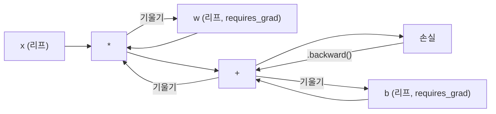
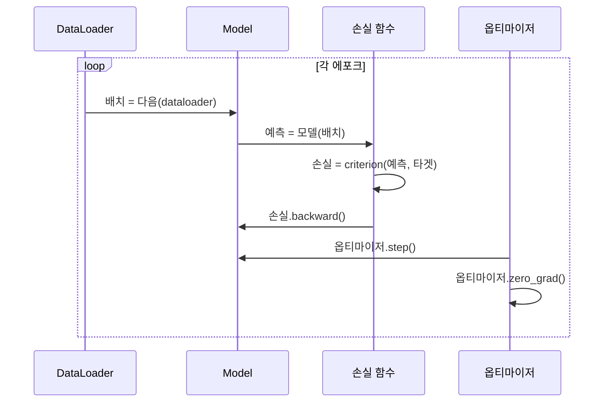

# PyTorch 소개

> 피스톤과 크랭크샤프트로 엔진을 구축했습니다. 이제 모두가 실제로 운전하는 엔진을 배워보세요.

**유형:** 구축
**언어:** Python
**선수 조건:** 레슨 03.10 (나만의 미니 프레임워크 구축하기)
**소요 시간:** ~75분

## 학습 목표

- PyTorch의 `nn.Module`, `nn.Sequential`, `autograd`를 사용하여 신경망 구축 및 훈련
- PyTorch 텐서, GPU 가속, 표준 훈련 루프(`zero_grad`, `forward`, `loss`, `backward`, `step`) 활용
- 직접 구현한 미니 프레임워크 구성 요소를 PyTorch 대응 요소로 변환
- 순수 Python 프레임워크와 PyTorch의 동일 작업 훈련 속도 프로파일링 및 비교

## 문제

작동하는 미니 프레임워크가 있습니다. 선형 레이어(Linear layer), ReLU, 드롭아웃(dropout), 배치 정규화(batch norm), Adam, DataLoader, 훈련 루프(training loop)가 있습니다. 이 프레임워크는 순수 Python에서 원 분류(circle classification) 문제에 대해 4층 네트워크를 훈련시킵니다.

하지만 동일한 문제에서 PyTorch보다 500배 느립니다.

미니 프레임워크는 중첩된 Python 루프를 사용해 한 번에 하나의 샘플만 처리합니다. 반면 PyTorch는 GPU에서 실행되는 최적화된 C++/CUDA 커널로 동일한 연산을 디스패치합니다. 단일 NVIDIA A100에서 PyTorch는 ImageNet(128만 개 이미지)에 대해 ResNet-50(2,560만 개 파라미터)을 약 6시간 만에 훈련시킵니다. 동일한 작업에서 미니 프레임워크는 메모리 부족 문제가 발생하지 않는다는 가정 하에 대략 3,000시간이 소요될 것입니다.

속도만이 유일한 격차는 아닙니다. 미니 프레임워크에는 GPU 지원이 없습니다. 자동 미분(automatic differentiation)도 없어 모든 모듈에 대해 `backward()`를 직접 구현해야 합니다. 직렬화(serialization), 분산 훈련(distributed training), 혼합 정밀도(mixed precision), `print` 문 없이 그래디언트 흐름을 디버깅할 방법도 없습니다.

PyTorch는 이러한 모든 격차를 메웁니다. 그리고 이미 구축한 것과 정확히 동일한 멘탈 모델을 유지하면서 이를 수행합니다: `Module`, `forward()`, `parameters()`, `backward()`, `optimizer.step()`. 개념들은 1:1로 대응됩니다. 구문도 거의 동일합니다. 차이점은 PyTorch가 직접 처음부터 설계한 인터페이스에 10년간의 시스템 엔지니어링을 통합했다는 점입니다.

## 개념

### PyTorch가 승리한 이유

2015년 TensorFlow는 아무 작업도 실행하기 전에 정적 계산 그래프를 정의해야 했습니다. 그래프를 구축한 후 컴파일하고 데이터를 공급했습니다. 디버깅은 그래프 시각화를 응시하는 것을 의미했습니다. 아키텍처 변경은 그래프를 처음부터 다시 구축하는 것을 의미했습니다.

PyTorch는 2017년 다른 철학인 즉시 실행(eager execution)으로 출시되었습니다. Python 코드를 작성하면 즉시 실행됩니다. `y = model(x)`는 실제로 지금 y를 계산하며, "나중에 y를 계산할 그래프에 노드를 추가"하지 않습니다. 이는 표준 Python 디버깅 도구가 작동함을 의미했습니다. `print()`가 작동했고, `pdb`가 작동했으며, 순전파(forward pass) 내 `if/else`가 작동했습니다.

2020년까지 시장은 결정을 내렸습니다. PyTorch의 ML 연구 논문 점유율은 7%(2017년)에서 75% 이상(2022년)으로 증가했습니다. Meta, Google DeepMind, OpenAI, Anthropic, Hugging Face는 모두 PyTorch를 주요 프레임워크로 사용합니다. TensorFlow 2.x는 이에 대응하여 즉시 실행을 채택했습니다. 이는 PyTorch의 설계가 옳았음을 암묵적으로 인정한 것입니다.

교훈: 개발자 경험은 복리로 증가합니다. 10% 느리지만 디버깅이 50% 빠른 프레임워크가 항상 승리합니다.

### 텐서(Tensor)

텐서는 형태(shape), dtype, 장치(device)라는 세 가지 중요한 속성을 가진 다차원 배열입니다.

```python
import torch

x = torch.zeros(3, 4)           # shape: (3, 4), dtype: float32, device: cpu
x = torch.randn(2, 3, 224, 224) # 224x224 크기의 RGB 이미지 배치 2개
x = torch.tensor([1, 2, 3])     # Python 리스트에서 생성
```

**형태(shape)**는 차원입니다. 스칼라는 형태 (), 벡터는 (n,), 행렬은 (m, n), 이미지 배치는 (배치, 채널, 높이, 너비)입니다.

**dtype**은 정밀도와 메모리를 제어합니다.

| dtype | 비트 | 범위 | 사용 사례 |
|-------|------|-------|----------|
| float32 | 32 | ~7 소수점 자리 | 기본 학습 |
| float16 | 16 | ~3.3 소수점 자리 | 혼합 정밀도 |
| bfloat16 | 16 | float32와 동일한 범위, 낮은 정밀도 | LLM 학습 |
| int8 | 8 | -128에서 127 | 양자화 추론 |

**장치(device)**는 계산이 발생하는 위치를 결정합니다.

```python
device = torch.device("cuda" if torch.cuda.is_available() else "cpu")
x = torch.randn(3, 4, device=device)
x = x.to("cuda")
x = x.cpu()
```

모든 연산은 모든 텐서가 동일한 장치에 있어야 합니다. 이는 초보자가 가장 많이 마주치는 PyTorch 오류입니다: `RuntimeError: Expected all tensors to be on the same device`. 계산 전에 모든 것을 동일한 장치로 이동시켜 해결하세요.

**형태 변경(Reshaping)**은 상수 시간 연산입니다. 메타데이터를 변경하며 데이터는 변경하지 않습니다.

```python
x = torch.randn(2, 3, 4)
x.view(2, 12)      # (2, 12)로 형태 변경 -- 연속적이어야 함
x.reshape(6, 4)    # (6, 4)로 형태 변경 -- 항상 작동
x.permute(2, 0, 1) # 차원 재정렬
x.unsqueeze(0)     # 차원 추가: (1, 2, 3, 4)
x.squeeze()        # 크기 1인 차원 제거
```

### 오토그래드(Autograd)

미니 프레임워크에서는 모든 모듈에 대해 `backward()`를 직접 구현해야 했습니다. PyTorch는 그렇지 않습니다. 텐서에 대한 모든 연산을 방향 비순환 그래프(계산 그래프)에 기록하고, 이 그래프를 역방향으로 탐색하여 자동으로 기울기를 계산합니다.



미니 프레임워크와의 주요 차이점: PyTorch는 테이프 기반 자동 미분을 사용합니다. 순전파 동안 모든 연산이 "테이프"에 추가됩니다. `.backward()`를 호출하면 테이프를 역방향으로 재생합니다.

```python
x = torch.randn(3, requires_grad=True)
y = x ** 2 + 3 * x
z = y.sum()
z.backward()
print(x.grad)  # dz/dx = 2x + 3
```

오토그래드의 세 가지 규칙:

1. `requires_grad=True`인 리프 텐서만 기울기를 누적합니다
2. 기울기는 기본적으로 누적됩니다. 각 역전파 전에 `optimizer.zero_grad()`를 호출하세요
3. `torch.no_grad()`는 기울기 추적을 비활성화합니다(평가 시 사용)

### nn.Module

`nn.Module`은 PyTorch의 모든 신경망 구성 요소의 기본 클래스입니다. 이미 10강에서 이 추상화를 구축했습니다. PyTorch 버전은 자동 파라미터 등록, 재귀적 모듈 탐색, 장치 관리, 상태 딕셔너리 직렬화를 추가합니다.

```python
import torch.nn as nn

class MLP(nn.Module):
    def __init__(self, input_dim, hidden_dim, output_dim):
        super().__init__()
        self.layer1 = nn.Linear(input_dim, hidden_dim)
        self.relu = nn.ReLU()
        self.layer2 = nn.Linear(hidden_dim, output_dim)

    def forward(self, x):
        x = self.layer1(x)
        x = self.relu(x)
        x = self.layer2(x)
        return x
```

`__init__`에서 `nn.Module` 또는 `nn.Parameter`를 속성으로 할당하면 PyTorch가 자동으로 등록합니다. `model.parameters()`는 모든 등록된 파라미터를 재귀적으로 수집합니다. 이는 미니 프레임워크에서 수동으로 가중치를 수집할 필요가 없는 이유입니다.

주요 구성 요소:

| 모듈 | 기능 | 파라미터 |
|--------|-------------|------------|
| nn.Linear(in, out) | Wx + b | in*out + out |
| nn.Conv2d(in_ch, out_ch, k) | 2D 합성곱 | in_ch*out_ch*k*k + out_ch |
| nn.BatchNorm1d(features) | 활성화 정규화 | 2 * features |
| nn.Dropout(p) | 무작위 제로링 | 0 |
| nn.ReLU() | max(0, x) | 0 |
| nn.GELU() | 가우시안 오류 선형 | 0 |
| nn.Embedding(vocab, dim) | 룩업 테이블 | vocab * dim |
| nn.LayerNorm(dim) | 샘플별 정규화 | 2 * dim |

### 손실 함수와 옵티마이저

PyTorch는 여러분이 구축한 모든 것의 프로덕션 준비 버전을 제공합니다.

**손실 함수** (`torch.nn`에서):

| 손실 | 작업 | 입력 |
|------|------|-------|
| nn.MSELoss() | 회귀 | 모든 형태 |
| nn.CrossEntropyLoss() | 다중 클래스 분류 | 로짓 (소프트맥스 아님) |
| nn.BCEWithLogitsLoss() | 이진 분류 | 로짓 (시그모이드 아님) |
| nn.L1Loss() | 회귀 (강건) | 모든 형태 |
| nn.CTCLoss() | 시퀀스 정렬 | 로그 확률 |

참고: `CrossEntropyLoss`는 내부적으로 `LogSoftmax` + `NLLLoss`를 결합합니다. 소프트맥스 출력이 아닌 원시 로짓을 전달하세요. 이는 잘못된 기울기를 조용히 생성하는 일반적인 실수입니다.

**옵티마이저** (`torch.optim`에서):

| 옵티마이저 | 사용 시기 | 일반적인 학습률 |
|-----------|-------------|-----------|
| SGD(params, lr, momentum) | CNN, 잘 조정된 파이프라인 | 0.01--0.1 |
| Adam(params, lr) | 기본 시작점 | 1e-3 |
| AdamW(params, lr, weight_decay) | 트랜스포머, 파인튜닝 | 1e-4--1e-3 |
| LBFGS(params) | 소규모, 2차 | 1.0 |

### 학습 루프

모든 PyTorch 학습 루프는 동일한 5단계 패턴을 따릅니다. 10강에서 이미 알고 있습니다.



표준 패턴:

```python
for epoch in range(num_epochs):
    model.train()
    for inputs, targets in train_loader:
        inputs, targets = inputs.to(device), targets.to(device)
        optimizer.zero_grad()
        outputs = model(inputs)
        loss = criterion(outputs, targets)
        loss.backward()
        optimizer.step()
```

배치 루프 내 5줄. GPT-4, Stable Diffusion, LLaMA를 훈련시킨 5줄입니다. 아키텍처는 변경됩니다. 데이터는 변경됩니다. 이 5줄은 변경되지 않습니다.

### 데이터셋과 데이터로더

PyTorch의 `Dataset`은 `__len__`과 `__getitem__`이라는 두 가지 메서드를 가진 추상 클래스입니다. `DataLoader`는 배치 처리, 셔플, 멀티프로세스 데이터 로딩을 추가합니다.

```python
from torch.utils.data import Dataset, DataLoader

class MNISTDataset(Dataset):
    def __init__(self, images, labels):
        self.images = images
        self.labels = labels

    def __len__(self):
        return len(self.labels)

    def __getitem__(self, idx):
        return self.images[idx], self.labels[idx]

loader = DataLoader(dataset, batch_size=64, shuffle=True, num_workers=4)
```

`num_workers=4`는 GPU가 현재 배치를 훈련하는 동안 데이터를 병렬로 로드하기 위해 4개의 프로세스를 생성합니다. 디스크 바운드 작업(대형 이미지, 오디오)에서는 이 기능만으로도 훈련 속도를 2배 높일 수 있습니다.

### GPU 훈련

모델을 GPU로 이동:

```python
device = torch.device("cuda" if torch.cuda.is_available() else "cpu")
model = model.to(device)
```

이는 모든 파라미터와 버퍼를 재귀적으로 GPU로 이동시킵니다. 훈련 중 각 배치도 이동시킵니다:

```python
inputs, targets = inputs.to(device), targets.to(device)
```

**혼합 정밀도**는 현대 GPU(A100, H100, RTX 4090)에서 메모리 사용량을 절반으로 줄이고 처리량을 2배로 늘립니다. 순전파/역전파를 float16으로 실행하면서 마스터 가중치는 float32로 유지합니다:

```python
from torch.amp import autocast, GradScaler

scaler = GradScaler()
for inputs, targets in loader:
    with autocast(device_type="cuda"):
        outputs = model(inputs)
        loss = criterion(outputs, targets)
    scaler.scale(loss).backward()
    scaler.step(optimizer)
    scaler.update()
    optimizer.zero_grad()
```

### 비교: 미니 프레임워크 vs PyTorch vs JAX

| 기능 | 미니 프레임워크 (L10) | PyTorch | JAX |
|---------|---------------------|---------|-----|
| 자동 미분 | 수동 backward() | 테이프 기반 오토그래드 | 함수형 변환 |
| 실행 | 즉시 실행 (Python 루프) | 즉시 실행 (C++ 커널) | 추적 + JIT 컴파일 |
| GPU 지원 | 없음 | 예 (CUDA, ROCm, MPS) | 예 (CUDA, TPU) |
| 속도 (MNIST MLP) | ~300초/에포크 | ~0.5초/에포크 | ~0.3초/에포크 |
| 모듈 시스템 | 사용자 정의 Module 클래스 | nn.Module | 상태 비저장 함수 (Flax/Equinox) |
| 디버깅 | print() | print(), pdb, breakpoint() | 어려움 (JIT 추적이 print를 방해) |
| 생태계 | 없음 | Hugging Face, Lightning, timm | Flax, Optax, Orbax |
| 학습 곡선 | 직접 구축 | 보통 | 가파름 (함수형 패러다임) |
| 프로덕션 사용 | 장난감 문제 | Meta, OpenAI, Anthropic, HF | Google DeepMind, Midjourney |

## 빌드하기

PyTorch 기본 요소만을 사용하여 MNIST 데이터셋으로 학습한 3층 MLP입니다. 고수준 래퍼나 `torchvision.datasets`를 사용하지 않습니다. 원시 데이터를 직접 다운로드하고 파싱합니다.

### 1단계: 원시 파일에서 MNIST 로드하기

MNIST는 4개의 gzip 압축 파일로 제공됩니다: 훈련 이미지(60,000 x 28 x 28), 훈련 라벨, 테스트 이미지(10,000 x 28 x 28), 테스트 라벨. 이 파일들을 다운로드하고 바이너리 형식을 파싱합니다.

```python
import torch
import torch.nn as nn
import struct
import gzip
import urllib.request
import os

def download_mnist(path="./mnist_data"):
    base_url = "https://storage.googleapis.com/cvdf-datasets/mnist/"
    files = [
        "train-images-idx3-ubyte.gz",
        "train-labels-idx1-ubyte.gz",
        "t10k-images-idx3-ubyte.gz",
        "t10k-labels-idx1-ubyte.gz",
    ]
    os.makedirs(path, exist_ok=True)
    for f in files:
        filepath = os.path.join(path, f)
        if not os.path.exists(filepath):
            urllib.request.urlretrieve(base_url + f, filepath)

def load_images(filepath):
    with gzip.open(filepath, "rb") as f:
        magic, num, rows, cols = struct.unpack(">IIII", f.read(16))
        data = f.read()
        images = torch.frombuffer(bytearray(data), dtype=torch.uint8)
        images = images.reshape(num, rows * cols).float() / 255.0
    return images

def load_labels(filepath):
    with gzip.open(filepath, "rb") as f:
        magic, num = struct.unpack(">II", f.read(8))
        data = f.read()
        labels = torch.frombuffer(bytearray(data), dtype=torch.uint8).long()
    return labels
```

### 2단계: 모델 정의하기

3층 MLP: 784 -> 256 -> 128 -> 10. ReLU 활성화 함수. 정규화를 위한 드롭아웃. 단순성을 위해 배치 정규화는 사용하지 않습니다.

```python
class MNISTModel(nn.Module):
    def __init__(self):
        super().__init__()
        self.net = nn.Sequential(
            nn.Linear(784, 256),
            nn.ReLU(),
            nn.Dropout(0.2),
            nn.Linear(256, 128),
            nn.ReLU(),
            nn.Dropout(0.2),
            nn.Linear(128, 10),
        )

    def forward(self, x):
        return self.net(x)
```

출력층은 10개의 원시 로짓(각 숫자당 하나)을 생성합니다. 소프트맥스는 사용하지 않습니다. `CrossEntropyLoss`가 내부적으로 처리합니다.

매개변수 수: 784*256 + 256 + 256*128 + 128 + 128*10 + 10 = 235,146. 현대 기준으로는 매우 작습니다. GPT-2 small은 124M입니다. 이 모델은 몇 초 안에 학습됩니다.

### 3단계: 학습 루프

정석적인 순전파-손실-역전파-단계 패턴입니다.

```python
def train_one_epoch(model, loader, criterion, optimizer, device):
    model.train()
    total_loss = 0
    correct = 0
    total = 0
    for images, labels in loader:
        images, labels = images.to(device), labels.to(device)
        optimizer.zero_grad()
        outputs = model(images)
        loss = criterion(outputs, labels)
        loss.backward()
        optimizer.step()
        total_loss += loss.item() * images.size(0)
        _, predicted = outputs.max(1)
        correct += predicted.eq(labels).sum().item()
        total += labels.size(0)
    return total_loss / total, correct / total


def evaluate(model, loader, criterion, device):
    model.eval()
    total_loss = 0
    correct = 0
    total = 0
    with torch.no_grad():
        for images, labels in loader:
            images, labels = images.to(device), labels.to(device)
            outputs = model(images)
            loss = criterion(outputs, labels)
            total_loss += loss.item() * images.size(0)
            _, predicted = outputs.max(1)
            correct += predicted.eq(labels).sum().item()
            total += labels.size(0)
    return total_loss / total, correct / total
```

평가 시 `torch.no_grad()`를 사용합니다. 이는 자동 미분을 비활성화하여 메모리 사용량을 줄이고 추론 속도를 높입니다. 이 기능을 사용하지 않으면 PyTorch는 사용하지 않는 계산 그래프를 생성합니다.

### 4단계: 모든 요소 통합하기

```python
def main():
    device = torch.device("cuda" if torch.cuda.is_available() else "cpu")

    download_mnist()
    train_images = load_images("./mnist_data/train-images-idx3-ubyte.gz")
    train_labels = load_labels("./mnist_data/train-labels-idx1-ubyte.gz")
    test_images = load_images("./mnist_data/t10k-images-idx3-ubyte.gz")
    test_labels = load_labels("./mnist_data/t10k-labels-idx1-ubyte.gz")

    train_dataset = torch.utils.data.TensorDataset(train_images, train_labels)
    test_dataset = torch.utils.data.TensorDataset(test_images, test_labels)
    train_loader = torch.utils.data.DataLoader(
        train_dataset, batch_size=64, shuffle=True
    )
    test_loader = torch.utils.data.DataLoader(
        test_dataset, batch_size=256, shuffle=False
    )

    model = MNISTModel().to(device)
    criterion = nn.CrossEntropyLoss()
    optimizer = torch.optim.Adam(model.parameters(), lr=1e-3)

    num_params = sum(p.numel() for p in model.parameters())
    print(f"장치: {device}")
    print(f"매개변수: {num_params:,}")
    print(f"훈련 샘플: {len(train_dataset):,}")
    print(f"테스트 샘플: {len(test_dataset):,}")
    print()

    for epoch in range(10):
        train_loss, train_acc = train_one_epoch(
            model, train_loader, criterion, optimizer, device
        )
        test_loss, test_acc = evaluate(
            model, test_loader, criterion, device
        )
        print(
            f"에포크 {epoch+1:2d} | "
            f"훈련 손실: {train_loss:.4f} | 훈련 정확도: {train_acc:.4f} | "
            f"테스트 손실: {test_loss:.4f} | 테스트 정확도: {test_acc:.4f}"
        )

    torch.save(model.state_dict(), "mnist_mlp.pt")
    print(f"\n모델이 mnist_mlp.pt에 저장됨")
    print(f"최종 테스트 정확도: {test_acc:.4f}")
```

10 에포크 후 예상 출력: ~97.8% 테스트 정확도. CPU에서 훈련 시간: ~30초. GPU에서: ~5초. 동일한 아키텍처를 가진 미니 프레임워크에서: ~45분.

## 사용 방법

### 빠른 비교: 미니 프레임워크 vs PyTorch

| 미니 프레임워크 (레슨 10) | PyTorch |
|---------------------------|---------|
| `model = Sequential(Linear(784, 256), ReLU(), ...)` | `model = nn.Sequential(nn.Linear(784, 256), nn.ReLU(), ...)` |
| `pred = model.forward(x)` | `pred = model(x)` |
| `optimizer.zero_grad()` | `optimizer.zero_grad()` |
| `grad = criterion.backward()` then `model.backward(grad)` | `loss.backward()` |
| `optimizer.step()` | `optimizer.step()` |
| GPU 미지원 | `model.to("cuda")` |
| 모든 모듈에 대한 수동 역전파 | 오토그래드(autograd)가 모든 것 처리 |

인터페이스는 거의 동일합니다. 차이는 모든 내부 구현에 있습니다.

### 모델 저장 및 불러오기

```python
torch.save(model.state_dict(), "model.pt")

model = MNISTModel()
model.load_state_dict(torch.load("model.pt", weights_only=True))
model.eval()
```

모델 객체가 아닌 `state_dict()`(파라미터 딕셔너리)를 항상 저장하세요. 모델 객체 저장은 피클(pickle)을 사용하는데, 코드 리팩토링 시 깨집니다. 상태 딕셔너리는 이식성이 있습니다.

### 학습률 스케줄링

```python
scheduler = torch.optim.lr_scheduler.CosineAnnealingLR(
    optimizer, T_max=10
)
for epoch in range(10):
    train_one_epoch(model, train_loader, criterion, optimizer, device)
    scheduler.step()
```

PyTorch는 15개 이상의 스케줄러를 제공합니다: StepLR, ExponentialLR, CosineAnnealingLR, OneCycleLR, ReduceLROnPlateau. 모두 동일한 옵티마이저 인터페이스에 연결됩니다.

## Ship It

이 레슨은 두 가지 산출물을 생성합니다:

- `outputs/prompt-pytorch-debugger.md` -- 일반적인 PyTorch 학습 실패 진단을 위한 프롬프트
- `outputs/skill-pytorch-patterns.md` -- PyTorch 학습 패턴 기술 참조 문서

## 연습 문제

1. **배치 정규화 추가.** 각 선형 레이어 뒤에 `nn.BatchNorm1d`를 삽입(활성화 함수 이전). 드롭아웃만 사용한 버전과 테스트 정확도 및 학습 속도를 비교. 배치 정규화는 더 적은 에포크 안에 98%+ 정확도에 도달해야 함.

2. **학습률 탐색기 구현.** 지수적으로 증가하는 학습률(1e-7부터 1.0까지)로 1에포크 동안 학습. 손실 대 학습률(Loss vs LR) 그래프 그리기. 최적 학습률은 손실이 상승하기 직전의 값. 이를 활용해 MNIST 모델에 더 나은 학습률 선택.

3. **GPU로 이식 및 혼합 정밀도 적용.** 학습 루프에 `torch.amp.autocast`와 `GradScaler` 추가. GPU에서 혼합 정밀도 적용 여부에 따른 처리량(초당 샘플 수) 측정. A100 기준 ~2배 속도 향상 예상.

4. **커스텀 Dataset 구현.** Fashion-MNIST 다운로드(MNIST와 동일한 포맷이지만 의류 아이템 포함). `__getitem__`과 `__len__` 메서드를 가진 `FashionMNISTDataset(Dataset)` 클래스 구현. 동일한 MLP로 학습 후 정확도 비교. Fashion-MNIST는 더 어려움 — ~88% vs ~98% 예상.

5. **Adam을 SGD + 모멘텀으로 교체.** `SGD(params, lr=0.01, momentum=0.9)`로 학습. 수렴 곡선 비교. 이후 `CosineAnnealingLR` 스케줄러 추가 후 SGD가 10에포크 안에 Adam 성능을 따라잡는지 확인.

## 주요 용어

| 용어 | 사람들이 말하는 것 | 실제 의미 |
|------|----------------|----------------------|
| 텐서(Tensor) | "다차원 배열" | 모든 연산에 자동 미분 지원이 내장된 타입 및 장치 인식 배열 |
| 오토그래드(Autograd) | "자동 역전파" | 순전파 중 연산을 기록한 후 역순으로 재생하여 정확한 기울기를 계산하는 테이프 기반 시스템 |
| nn.Module | "레이어" | 모든 미분 가능 계산 블록의 기본 클래스 — 파라미터 등록, 중첩 지원, 학습/평가 모드 처리 |
| state_dict | "모델 가중치" | 파라미터 이름을 텐서에 매핑하는 OrderedDict — 훈련된 모델의 이식 가능하고 직렬화 가능한 표현 |
| .backward() | "기울기 계산" | 계산 그래프를 역방향으로 탐색하며 requires_grad=True인 모든 리프 텐서에 대한 기울기를 계산하고 누적 |
| .to(device) | "GPU로 이동" | 모든 파라미터와 버퍼를 지정된 장치(CPU, CUDA, MPS)로 재귀적으로 전송 |
| DataLoader | "데이터 파이프라인" | Dataset에서 데이터를 배치 처리, 셔플링, 선택적으로 병렬화하는 이터레이터 |
| 혼합 정밀도(Mixed precision) | "float16 사용" | 수치 안정성을 위해 float32 마스터 가중치를 유지하면서 속도를 위해 float16으로 순전파/역전파 수행 |
| 즉시 실행(Eager execution) | "지금 실행" | 호출 시 즉시 실행되며 나중 컴파일 단계로 연기되지 않음 — PyTorch를 TF 1.x와 차별화하는 핵심 설계 선택 |
| zero_grad | "기울기 초기화" | PyTorch는 기본적으로 기울기를 누적하므로 다음 역전파 전에 모든 파라미터 기울기를 0으로 설정 |

## 추가 자료

- Paszke et al., "PyTorch: An Imperative Style, High-Performance Deep Learning Library" (2019) -- PyTorch의 설계 트레이드오프를 설명하는 원본 논문
- PyTorch 튜토리얼: "예제로 배우는 PyTorch" (https://pytorch.org/tutorials/beginner/pytorch_with_examples.html) -- 텐서에서 nn.Module까지의 공식 학습 경로
- PyTorch 성능 튜닝 가이드 (https://pytorch.org/tutorials/recipes/recipes/tuning_guide.html) -- 혼합 정밀도, DataLoader 워커, 고정 메모리 및 기타 프로덕션 최적화 기법
- Horace He, "Making Deep Learning Go Brrrr" (https://horace.io/brrr_intro.html) -- GPU 훈련이 빠른 이유, PyTorch 특화 최적화 전략 포함