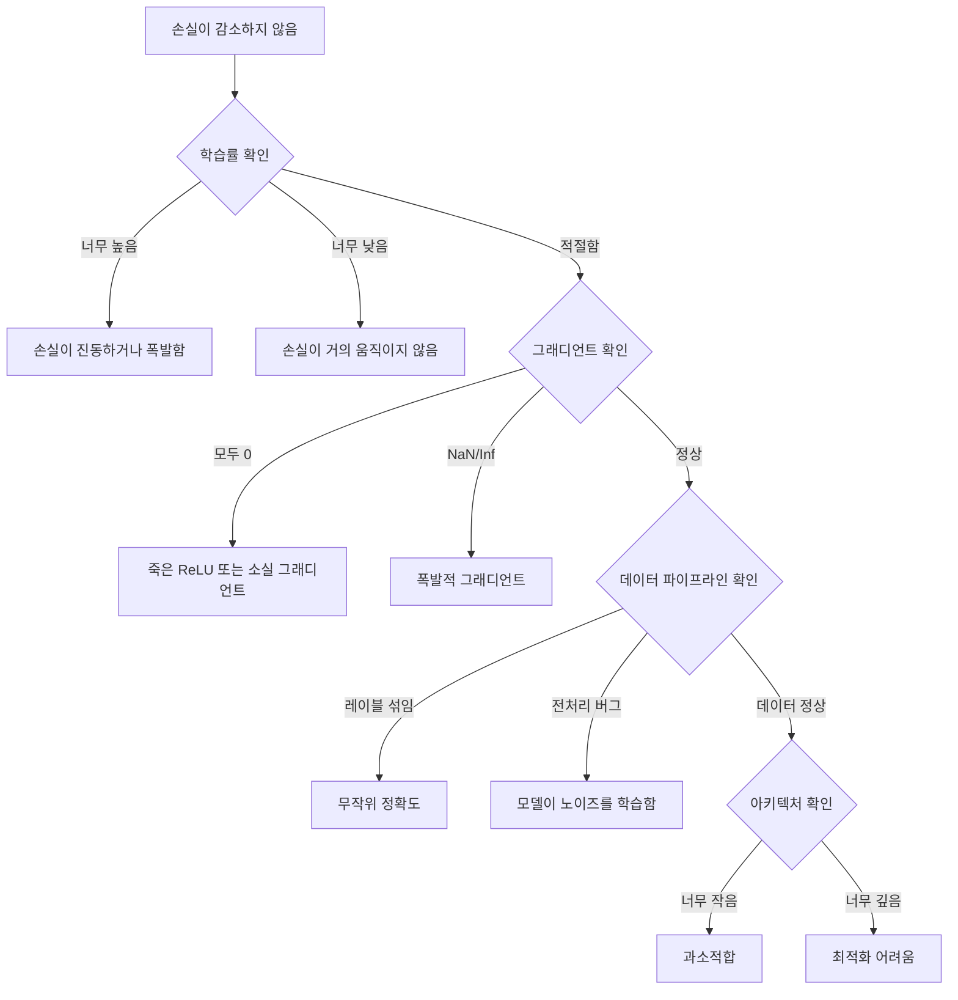
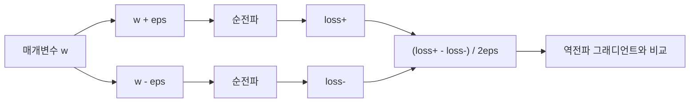
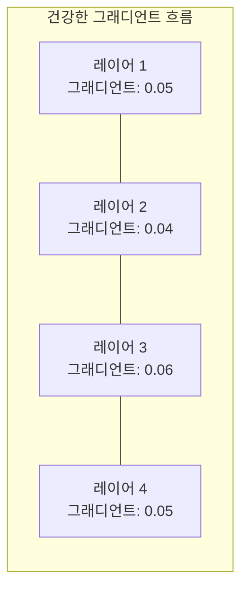
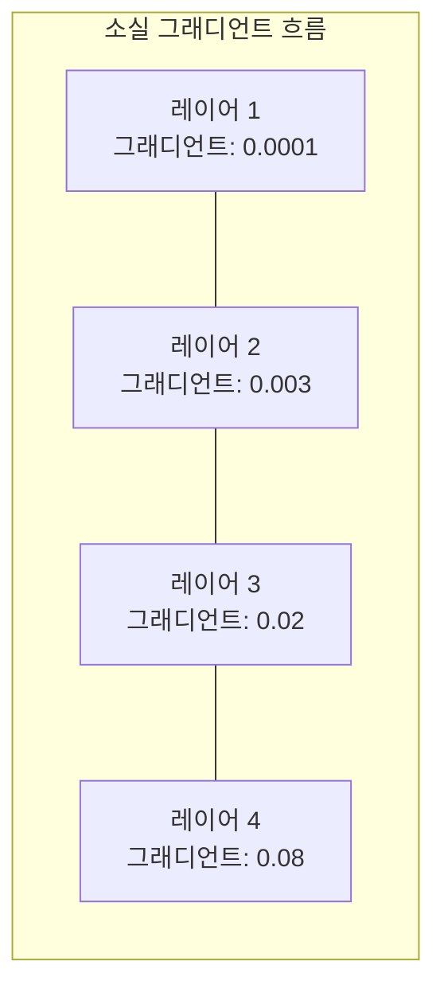
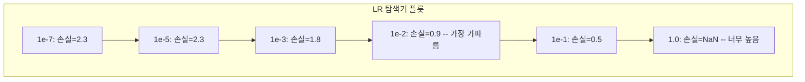

# 신경망 디버깅

> 네트워크가 컴파일되었습니다. 실행도 되었습니다. 숫자 하나를 출력했습니다. 그 숫자가 틀렸고 아무것도 충돌하지 않았습니다. 가장 어려운 디버깅 종류에 오신 것을 환영합니다 — 오류 메시지가 없는 디버깅입니다.

**유형:** 실습  
**언어:** Python, PyTorch  
**선수 지식:** Phase 03 레슨 01-10 (특히 역전파, 손실 함수, 옵티마이저)  
**소요 시간:** ~90분

## 학습 목표

- 체계적인 디버깅 전략을 사용하여 일반적인 신경망 실패 사례(NaN 손실, 평탄한 손실 곡선, 과적합(overfitting), 진동(oscillation))를 진단
- 모델 아키텍처와 훈련 루프가 올바른지 확인하기 위해 "한 배치 과적합(overfit one batch)" 기법 적용
- 기울기 크기(gradient magnitude), 활성화 분포(activation distribution), 가중치 노름(weight norm)을 검사하여 소실/폭발 기울기(vanishing/exploding gradient) 문제 식별
- 데이터 파이프라인, 모델 아키텍처, 손실 함수(loss function), 옵티마이저(optimizer), 학습률(learning rate) 문제를 포괄하는 디버깅 체크리스트 구축

## 문제 정의

전통적인 소프트웨어는 문제가 발생하면 충돌합니다. 널 포인터(null pointer)는 예외를 발생시킵니다. 타입 불일치(type mismatch)는 컴파일 시간에 실패합니다. 오프-바이-원(off-by-one) 오류는 명백히 잘못된 출력을 생성합니다.

신경망(neural network)은 그러한 여유를 주지 않습니다.

고장난 신경망은 실행을 완료하고 손실(loss) 값을 출력하며 예측 결과를 내놓습니다. 손실이 감소할 수도 있습니다. 예측 결과가 그럴듯해 보일 수도 있습니다. 하지만 모델은 소리 없이 잘못된 상태일 수 있습니다 — 학습 과정에서 단축키(shortcut)를 학습하거나, 노이즈를 암기하거나, 쓸모없는 지역 최소값(local minimum)에 수렴할 수 있습니다. 구글(Google) 연구원들은 ML 디버깅 시간의 60-70%가 오류는 발생하지 않지만 모델 품질을 저하시키는 "소리 없는" 버그들에 소요된다고 추정했습니다.

작동하는 모델과 고장난 모델의 차이는 종종 단 하나의 잘못된 코드 라인일 수 있습니다: 누락된 `zero_grad()`, 전치된 차원(transposed dimension), 10배 차이가 나는 학습률(learning rate) 등. "신경망 훈련 레시피(Recipe for Training Neural Networks)"(2019)는 다음과 같이 시작합니다: "가장 흔한 신경망 실수는 충돌하지 않는 버그들입니다."

이 강의에서는 그러한 버그들을 찾는 방법을 가르칩니다.

## 개념

### 디버깅 마인드셋

`print-and-pray` 디버깅은 잊어라. 신경망 디버깅은 체계적인 접근이 필요하다. 피드백 루프가 느리고(훈련당 몇 분에서 몇 시간), 증상이 모호하기 때문이다(나쁜 손실 함수는 20가지 다른 원인을 의미할 수 있음).

황금률: **간단하게 시작하고, 한 번에 한 조각씩 복잡성을 추가하며, 각 조각을 독립적으로 검증하라.**



### 증상 1: 손실이 감소하지 않음

가장 흔한 불만이다. 훈련 루프가 실행되고, 에폭이 지나도 손실이 평평하거나 심하게 진동한다.

**잘못된 학습률.** 너무 높음: 손실이 진동하거나 NaN으로 점프. 너무 낮음: 손실이 너무 천천히 감소하여 평평해 보임. Adam의 경우 1e-3에서 시작. SGD의 경우 1e-1 또는 1e-2에서 시작. 다른 문제가 있다고 결론내리기 전에 항상 10배 간격으로 3가지 학습률(예: 1e-2, 1e-3, 1e-4)을 시도하라.

**죽은 ReLU.** ReLU 뉴런이 큰 음수 입력을 받으면 0을 출력하고 그래디언트도 0이다. 다시 활성화되지 않는다. 충분한 뉴런이 죽으면 네트워크는 학습할 수 없다. 확인: 각 ReLU 레이어 이후 정확히 0인 활성화 비율을 출력. 50% 이상이면 LeakyReLU로 전환하거나 학습률을 줄여라.

**소실 그래디언트.** 시그모이드 또는 tanh 활성화 함수를 사용하는 깊은 네트워크에서 그래디언트는 역전파 시 지수적으로 감소한다. 첫 번째 레이어에 도달할 때쯤에는 ~0이 된다. 첫 번째 레이어는 학습을 멈춘다. 해결: ReLU/GELU 사용, 잔차 연결 추가, 또는 배치 정규화 사용.

**폭발적 그래디언트.** 반대 문제 — 그래디언트가 지수적으로 증가. RNN과 매우 깊은 네트워크에서 흔함. 손실이 NaN으로 점프. 해결: 그래디언트 클리핑(`torch.nn.utils.clip_grad_norm_`), 학습률 낮추기, 또는 정규화 추가.

### 증상 2: 손실은 감소하지만 모델이 나쁨

손실은 감소한다. 훈련 정확도는 99%에 도달. 하지만 테스트 정확도는 55%. 또는 모델이 실제 데이터에서 무의미한 출력을 생성.

**과적합.** 모델이 패턴 학습 대신 훈련 데이터를 암기. 훈련 손실과 검증 손실 간 격차가 시간이 지남에 따라 증가. 해결: 더 많은 데이터, 드롭아웃, 가중치 감소, 조기 종료, 데이터 증강.

**데이터 누수.** 테스트 데이터가 훈련에 누출. 정확도가 의심스럽게 높음. 일반적인 원인: 분할 전 섞기, 전체 데이터셋의 통계로 전처리, 분할 간 중복 샘플. 해결: 먼저 분할, 두 번째 전처리, 중복 확인.

**레이블 오류.** 대부분의 실제 데이터셋에서 5-10%의 레이블이 잘못됨(Northcutt et al., 2021 -- "테스트 세트의 만연한 레이블 오류"). 모델이 노이즈를 학습. 해결: 확신 학습을 사용하여 잘못 레이블된 예제 찾기 및 수정, 또는 손실 절단을 사용하여 높은 손실 샘플 무시.

### 증상 3: 손실에 NaN 또는 Inf

손실 값이 `nan` 또는 `inf`가 됨. 훈련이 멈춤.

**학습률이 너무 높음.** 그래디언트 업데이트가 너무 멀리 점프하여 가중치가 폭발. 해결: 10배 감소.

**log(0) 또는 log(음수).** 교차 엔트로피 손실은 `log(p)`를 계산. 모델이 정확히 0 또는 음수 확률을 출력하면 로그가 폭발. 해결: 예측을 `[eps, 1-eps]`로 클램핑(여기서 `eps=1e-7`).

**0으로 나누기.** 배치 정규화는 표준편차로 나눔. 상수 값을 가진 배치의 표준편차는 0. 해결: 분모에 엡실론 추가(PyTorch는 기본 제공, 하지만 커스텀 구현은 아닐 수 있음).

**수치적 오버플로우.** 큰 활성화 값이 `exp()`에 입력되면 Inf가 생성. 소프트맥스가 특히 취약. 해결: 지수 계산 전 최댓값 빼기(로그-합-지수 트릭).

### 기법 1: 그래디언트 확인

역전파에서 얻은 해석적 그래디언트와 유한 차분에서 얻은 수치적 그래디언트를 비교. 불일치 시 역전파에 버그가 있음.

매개변수 `w`에 대한 수치적 그래디언트:

```
grad_numerical = (loss(w + eps) - loss(w - eps)) / (2 * eps)
```

일치도 지표(상대 차이):

```
rel_diff = |grad_analytical - grad_numerical| / max(|grad_analytical|, |grad_numerical|, 1e-8)
```

`rel_diff < 1e-5`: 정확. `rel_diff > 1e-3`: 거의 확실히 버그.



### 기법 2: 활성화 통계

훈련 중 각 레이어 이후 활성화의 평균과 표준편차를 모니터링. 건강한 네트워크는 평균이 0 근처, 표준편차가 1 근처(또는 적어도 유계)를 유지.

| 건강 지표 | 평균 | 표준편차 | 진단 |
|-----------------|------|-----|-----------|
| 건강함 | ~0 | ~1 | 네트워크가 정상적으로 학습 중 |
| 포화됨 | >>0 또는 <<0 | ~0 | 활성화가 극단적 값에 고정 |
| 죽음 | 0 | 0 | 뉴런이 죽음(모두 0) |
| 폭발 | >>10 | >>10 | 활성화가 무한히 증가 |

### 기법 3: 그래디언트 흐름 시각화

각 레이어의 평균 그래디언트 크기를 플롯. 건강한 네트워크에서는 그래디언트 크기가 레이어 간 대략 유사. 초기 레이어의 그래디언트가 후기 레이어보다 1000배 작으면 소실 그래디언트 문제.





### 기법 4: 한 배치 과적합 테스트

딥러닝에서 가장 중요한 디버깅 기법.

작은 배치(8-32개 샘플)를 선택. 100+ 반복 동안 훈련. 손실이 거의 0으로 감소하고 훈련 정확도가 100%에 도달해야 함. 그렇지 않으면 모델이나 훈련 루프에 근본적 버그가 있음 — 전체 훈련으로 진행하지 마라.

이 테스트는 다음을 포착:
- 고장난 손실 함수
- 고장난 역전파
- 데이터를 표현하기에 너무 작은 아키텍처
- 최적화 프로그램이 모델 매개변수에 연결되지 않음
- 데이터와 레이블이 일치하지 않음

이 테스트는 30초 소요, 전체 훈련 실행 시 디버깅 시간을 절약.

### 기법 5: 학습률 탐색기

Leslie Smith(2017)는 한 에폭 동안 매우 작은(1e-7) 학습률에서 매우 큰(10) 학습률로 스위핑하며 손실을 기록할 것을 제안. 손실 대 학습률 플롯. 최적 학습률은 손실이 가장 빠르게 감소하기 시작하는 지점보다 대략 10배 작음.



이 예시에서 최적 LR: ~1e-3(가장 가파른 지점보다 10배 작음).

### 일반적인 PyTorch 버그

PyTorch 커뮤니티에서 가장 많은 시간을 낭비하는 버그들:

| 버그 | 증상 | 해결 |
|-----|---------|-----|
| `optimizer.zero_grad()` 잊음 | 그래디언트가 배치 간 누적, 손실 진동 | `loss.backward()` 전에 `optimizer.zero_grad()` 추가 |
| 테스트 시 `model.eval()` 잊음 | 드롭아웃과 배치 정규화가 다르게 동작, 테스트 정확도가 실행마다 다름 | `model.eval()`과 `torch.no_grad()` 추가 |
| 잘못된 텐서 형태 | 묵시적 브로드캐스팅으로 잘못된 결과, 오류 없음 | 디버깅 중 매 연산 후 형태 출력 |
| CPU/GPU 불일치 | `RuntimeError: CUDA 텐서 기대` | 모델과 데이터에 `.to(device)` 사용 |
| 텐서 분리 안 함 | 계산 그래프가 무한히 성장, OOM | `.detach()` 또는 `with torch.no_grad()` 사용 |
| 인플레이스 연산이 autograd 깨짐 | `RuntimeError: 인플레이스 연산으로 수정됨` | `x += 1`을 `x = x + 1`로 대체 |
| 데이터 정규화 안 함 | 손실이 무작위 수준 유지 | 입력을 평균=0, 표준편차=1로 정규화 |
| 레이블이 잘못된 dtype | 교차 엔트로피는 `Long`을 기대, `Float`을 받음 | 레이블 캐스팅: `labels.long()` |

### 마스터 디버깅 테이블

| 증상 | 가능한 원인 | 첫 번째 시도 |
|---------|-------------|-------------------|
| 손실이 -log(1/클래스 수)에 멈춤 | 모델이 균일 분포 예측 | 데이터 파이프라인 확인, 레이블이 입력과 일치하는지 검증 |
| 몇 단계 후 손실 NaN | 학습률이 너무 높음 | LR을 10배 감소 |
| 즉시 손실 NaN | log(0) 또는 0으로 나누기 | 로그/나누기 연산에 엡실론 추가 |
| 손실이 심하게 진동 | LR이 너무 높거나 배치 크기가 너무 작음 | LR 감소, 배치 크기 증가 |
| 손실 감소 후 정체 | 미세 조정 단계에 LR이 너무 높음 | LR 스케줄러 추가(코사인 또는 단계 감소) |
| 훈련 정확도 높음, 테스트 정확도 낮음 | 과적합 | 드롭아웃, 가중치 감소, 더 많은 데이터 추가 |
| 훈련 정확도 = 테스트 정확도 = 무작위 | 모델이 아무것도 학습하지 않음 | 한 배치 과적합 테스트 실행 |
| 훈련 정확도 = 테스트 정확도지만 둘 다 낮음 | 과소적합 | 더 큰 모델, 더 많은 레이어, 더 많은 특징 |
| 그래디언트가 모두 0 | 죽은 ReLU 또는 분리된 계산 그래프 | LeakyReLU로 전환, `.requires_grad` 확인 |
| 훈련 중 메모리 부족 | 배치가 너무 크거나 그래프가 해제되지 않음 | 배치 크기 감소, 평가에 `torch.no_grad()` 사용 |

## 빌드하기

활성화, 기울기, 손실 곡선을 모니터링하는 진단 툴킷입니다. 네트워크를 의도적으로 망가뜨리고 툴킷을 사용하여 각 문제를 진단합니다.

### 단계 1: NetworkDebugger 클래스

PyTorch 모델에 훅을 등록하여 레이어별 활성화 및 기울기 통계를 기록합니다.

```python
import torch
import torch.nn as nn
import math


class NetworkDebugger:
    def __init__(self, model):
        self.model = model
        self.activation_stats = {}
        self.gradient_stats = {}
        self.loss_history = []
        self.lr_losses = []
        self.hooks = []
        self._register_hooks()

    def _register_hooks(self):
        for name, module in self.model.named_modules():
            if isinstance(module, (nn.Linear, nn.Conv2d, nn.ReLU, nn.LeakyReLU)):
                hook = module.register_forward_hook(self._make_activation_hook(name))
                self.hooks.append(hook)
                hook = module.register_full_backward_hook(self._make_gradient_hook(name))
                self.hooks.append(hook)

    def _make_activation_hook(self, name):
        def hook(module, input, output):
            with torch.no_grad():
                out = output.detach().float()
                self.activation_stats[name] = {
                    "mean": out.mean().item(),
                    "std": out.std().item(),
                    "fraction_zero": (out == 0).float().mean().item(),
                    "min": out.min().item(),
                    "max": out.max().item(),
                }
        return hook

    def _make_gradient_hook(self, name):
        def hook(module, grad_input, grad_output):
            if grad_output[0] is not None:
                with torch.no_grad():
                    grad = grad_output[0].detach().float()
                    self.gradient_stats[name] = {
                        "mean": grad.mean().item(),
                        "std": grad.std().item(),
                        "abs_mean": grad.abs().mean().item(),
                        "max": grad.abs().max().item(),
                    }
        return hook

    def record_loss(self, loss_value):
        self.loss_history.append(loss_value)

    def check_loss_health(self):
        if len(self.loss_history) < 2:
            return "NOT_ENOUGH_DATA"
        recent = self.loss_history[-10:]
        if any(math.isnan(v) or math.isinf(v) for v in recent):
            return "NAN_OR_INF"
        if len(self.loss_history) >= 20:
            first_half = sum(self.loss_history[:10]) / 10
            second_half = sum(self.loss_history[-10:]) / 10
            if second_half >= first_half * 0.99:
                return "NOT_DECREASING"
        if len(recent) >= 5:
            diffs = [recent[i+1] - recent[i] for i in range(len(recent)-1)]
            if max(diffs) - min(diffs) > 2 * abs(sum(diffs) / len(diffs)):
                return "OSCILLATING"
        return "HEALTHY"

    def check_activations(self):
        issues = []
        for name, stats in self.activation_stats.items():
            if stats["fraction_zero"] > 0.5:
                issues.append(f"DEAD_NEURONS: {name} has {stats['fraction_zero']:.0%} zero activations")
            if abs(stats["mean"]) > 10:
                issues.append(f"EXPLODING_ACTIVATIONS: {name} mean={stats['mean']:.2f}")
            if stats["std"] < 1e-6:
                issues.append(f"COLLAPSED_ACTIVATIONS: {name} std={stats['std']:.2e}")
        return issues if issues else ["HEALTHY"]

    def check_gradients(self):
        issues = []
        grad_magnitudes = []
        for name, stats in self.gradient_stats.items():
            grad_magnitudes.append((name, stats["abs_mean"]))
            if stats["abs_mean"] < 1e-7:
                issues.append(f"VANISHING_GRADIENT: {name} abs_mean={stats['abs_mean']:.2e}")
            if stats["abs_mean"] > 100:
                issues.append(f"EXPLODING_GRADIENT: {name} abs_mean={stats['abs_mean']:.2e}")
        if len(grad_magnitudes) >= 2:
            first_mag = grad_magnitudes[0][1]
            last_mag = grad_magnitudes[-1][1]
            if last_mag > 0 and first_mag / last_mag > 100:
                issues.append(f"GRADIENT_RATIO: first/last = {first_mag/last_mag:.0f}x (vanishing)")
        return issues if issues else ["HEALTHY"]

    def print_report(self):
        print("\n=== NETWORK DEBUGGER REPORT ===")
        print(f"\nLoss health: {self.check_loss_health()}")
        if self.loss_history:
            print(f"  Last 5 losses: {[f'{v:.4f}' for v in self.loss_history[-5:]]}")
        print("\nActivation diagnostics:")
        for item in self.check_activations():
            print(f"  {item}")
        print("\nGradient diagnostics:")
        for item in self.check_gradients():
            print(f"  {item}")
        print("\nPer-layer activation stats:")
        for name, stats in self.activation_stats.items():
            print(f"  {name}: mean={stats['mean']:.4f} std={stats['std']:.4f} zero={stats['fraction_zero']:.1%}")
        print("\nPer-layer gradient stats:")
        for name, stats in self.gradient_stats.items():
            print(f"  {name}: abs_mean={stats['abs_mean']:.2e} max={stats['max']:.2e}")

    def remove_hooks(self):
        for hook in self.hooks:
            hook.remove()
        self.hooks.clear()
```

### 단계 2: 오버핏-원-배치 테스트

```python
def overfit_one_batch(model, x_batch, y_batch, criterion, lr=0.01, steps=200):
    optimizer = torch.optim.Adam(model.parameters(), lr=lr)
    model.train()
    print("\n=== OVERFIT ONE BATCH TEST ===")
    print(f"Batch size: {x_batch.shape[0]}, Steps: {steps}")

    for step in range(steps):
        optimizer.zero_grad()
        output = model(x_batch)
        loss = criterion(output, y_batch)
        loss.backward()
        optimizer.step()

        if step % 50 == 0 or step == steps - 1:
            with torch.no_grad():
                preds = (output > 0).float() if output.shape[-1] == 1 else output.argmax(dim=1)
                targets = y_batch if y_batch.dim() == 1 else y_batch.squeeze()
                acc = (preds.squeeze() == targets).float().mean().item()
            print(f"  Step {step:3d} | Loss: {loss.item():.6f} | Accuracy: {acc:.1%}")

    final_loss = loss.item()
    if final_loss > 0.1:
        print(f"\n  FAIL: Loss did not converge ({final_loss:.4f}). Model or training loop is broken.")
        return False
    print(f"\n  PASS: Loss converged to {final_loss:.6f}")
    return True
```

### 단계 3: 학습률 탐색기

```python
def find_learning_rate(model, x_data, y_data, criterion, start_lr=1e-7, end_lr=10, steps=100):
    import copy
    original_state = copy.deepcopy(model.state_dict())
    optimizer = torch.optim.SGD(model.parameters(), lr=start_lr)
    lr_mult = (end_lr / start_lr) ** (1 / steps)

    model.train()
    results = []
    best_loss = float("inf")
    current_lr = start_lr

    print("\n=== LEARNING RATE FINDER ===")

    for step in range(steps):
        optimizer.zero_grad()
        output = model(x_data)
        loss = criterion(output, y_data)

        if math.isnan(loss.item()) or loss.item() > best_loss * 10:
            break

        best_loss = min(best_loss, loss.item())
        results.append((current_lr, loss.item()))

        loss.backward()
        optimizer.step()

        current_lr *= lr_mult
        for param_group in optimizer.param_groups:
            param_group["lr"] = current_lr

    model.load_state_dict(original_state)

    if len(results) < 10:
        print("  Could not complete LR sweep -- loss diverged too quickly")
        return results

    min_loss_idx = min(range(len(results)), key=lambda i: results[i][1])
    suggested_lr = results[max(0, min_loss_idx - 10)][0]

    print(f"  Swept {len(results)} steps from {start_lr:.0e} to {results[-1][0]:.0e}")
    print(f"  Minimum loss {results[min_loss_idx][1]:.4f} at lr={results[min_loss_idx][0]:.2e}")
    print(f"  Suggested learning rate: {suggested_lr:.2e}")

    return results
```

### 단계 4: 기울기 검사기

```python
def _flat_to_multi_index(flat_idx, shape):
    multi_idx = []
    remaining = flat_idx
    for dim in reversed(shape):
        multi_idx.insert(0, remaining % dim)
        remaining //= dim
    return tuple(multi_idx)


def gradient_check(model, x, y, criterion, eps=1e-4):
    model.train()
    x_double = x.double()
    y_double = y.double()
    model_double = model.double()

    print("\n=== GRADIENT CHECK ===")
    overall_max_diff = 0
    checked = 0

    for name, param in model_double.named_parameters():
        if not param.requires_grad:
            continue

        layer_max_diff = 0

        model_double.zero_grad()
        output = model_double(x_double)
        loss = criterion(output, y_double)
        loss.backward()
        analytical_grad = param.grad.clone()

        num_checks = min(5, param.numel())
        for i in range(num_checks):
            idx = _flat_to_multi_index(i, param.shape)
            original = param.data[idx].item()

            param.data[idx] = original + eps
            with torch.no_grad():
                loss_plus = criterion(model_double(x_double), y_double).item()

            param.data[idx] = original - eps
            with torch.no_grad():
                loss_minus = criterion(model_double(x_double), y_double).item()

            param.data[idx] = original

            numerical = (loss_plus - loss_minus) / (2 * eps)
            analytical = analytical_grad[idx].item()

            denom = max(abs(numerical), abs(analytical), 1e-8)
            rel_diff = abs(numerical - analytical) / denom

            layer_max_diff = max(layer_max_diff, rel_diff)
            checked += 1

        overall_max_diff = max(overall_max_diff, layer_max_diff)
        status = "OK" if layer_max_diff < 1e-5 else "MISMATCH"
        print(f"  {name}: max_rel_diff={layer_max_diff:.2e} [{status}]")

    model.float()

    print(f"\n  Checked {checked} parameters")
    if overall_max_diff < 1e-5:
        print("  PASS: Gradients match (rel_diff < 1e-5)")
    elif overall_max_diff < 1e-3:
        print("  WARN: Small differences (1e-5 < rel_diff < 1e-3)")
    else:
        print("  FAIL: Gradient mismatch detected (rel_diff > 1e-3)")
    return overall_max_diff
```

### 단계 5: 의도적으로 망가뜨린 네트워크

이제 툴킷을 망가뜨린 네트워크에 적용하고 각 문제를 진단합니다.

```python
def demo_broken_networks():
    torch.manual_seed(42)
    x = torch.randn(64, 10)
    y = (x[:, 0] > 0).long()

    print("\n" + "=" * 60)
    print("BUG 1: 학습률이 너무 높음 (lr=10)")
    print("=" * 60)
    model1 = nn.Sequential(nn.Linear(10, 32), nn.ReLU(), nn.Linear(32, 2))
    debugger1 = NetworkDebugger(model1)
    optimizer1 = torch.optim.SGD(model1.parameters(), lr=10.0)
    criterion = nn.CrossEntropyLoss()
    for step in range(20):
        optimizer1.zero_grad()
        out = model1(x)
        loss = criterion(out, y)
        debugger1.record_loss(loss.item())
        loss.backward()
        optimizer1.step()
    debugger1.print_report()
    debugger1.remove_hooks()

    print("\n" + "=" * 60)
    print("BUG 2: 나쁜 초기화로 인한 죽은 ReLU")
    print("=" * 60)
    model2 = nn.Sequential(nn.Linear(10, 32), nn.ReLU(), nn.Linear(32, 32), nn.ReLU(), nn.Linear(32, 2))
    with torch.no_grad():
        for m in model2.modules():
            if isinstance(m, nn.Linear):
                m.weight.fill_(-1.0)
                m.bias.fill_(-5.0)
    debugger2 = NetworkDebugger(model2)
    optimizer2 = torch.optim.Adam(model2.parameters(), lr=1e-3)
    for step in range(50):
        optimizer2.zero_grad()
        out = model2(x)
        loss = criterion(out, y)
        debugger2.record_loss(loss.item())
        loss.backward()
        optimizer2.step()
    debugger2.print_report()
    debugger2.remove_hooks()

    print("\n" + "=" * 60)
    print("BUG 3: zero_grad 누락 (기울기 누적)")
    print("=" * 60)
    model3 = nn.Sequential(nn.Linear(10, 32), nn.ReLU(), nn.Linear(32, 2))
    debugger3 = NetworkDebugger(model3)
    optimizer3 = torch.optim.SGD(model3.parameters(), lr=0.01)
    for step in range(50):
        out = model3(x)
        loss = criterion(out, y)
        debugger3.record_loss(loss.item())
        loss.backward()
        optimizer3.step()
    debugger3.print_report()
    debugger3.remove_hooks()

    print("\n" + "=" * 60)
    print("건강한 네트워크: 비교를 위한 올바른 설정")
    print("=" * 60)
    model_good = nn.Sequential(nn.Linear(10, 32), nn.ReLU(), nn.Linear(32, 2))
    debugger_good = NetworkDebugger(model_good)
    optimizer_good = torch.optim.Adam(model_good.parameters(), lr=1e-3)
    for step in range(50):
        optimizer_good.zero_grad()
        out = model_good(x)
        loss = criterion(out, y)
        debugger_good.record_loss(loss.item())
        loss.backward()
        optimizer_good.step()
    debugger_good.print_report()
    debugger_good.remove_hooks()

    print("\n" + "=" * 60)
    print("오버핏-원-배치 테스트 (건강한 모델)")
    print("=" * 60)
    model_test = nn.Sequential(nn.Linear(10, 32), nn.ReLU(), nn.Linear(32, 2))
    overfit_one_batch(model_test, x[:8], y[:8], criterion)

    print("\n" + "=" * 60)
    print("학습률 탐색기")
    print("=" * 60)
    model_lr = nn.Sequential(nn.Linear(10, 32), nn.ReLU(), nn.Linear(32, 2))
    find_learning_rate(model_lr, x, y, criterion)

    print("\n" + "=" * 60)
    print("기울기 검사")
    print("=" * 60)
    model_grad = nn.Sequential(nn.Linear(10, 8), nn.ReLU(), nn.Linear(8, 2))
    gradient_check(model_grad, x[:4], y[:4], criterion)
```

## 사용 방법

### PyTorch 내장 도구

```python
import torch
import torch.nn as nn

model = nn.Sequential(
    nn.Linear(768, 256),
    nn.ReLU(),
    nn.Linear(256, 10),
)

with torch.autograd.detect_anomaly():
    output = model(input_tensor)
    loss = criterion(output, target)
    loss.backward()

for name, param in model.named_parameters():
    if param.grad is not None:
        print(f"{name}: grad_mean={param.grad.abs().mean():.2e}")
```

### Weights & Biases 통합

```python
import wandb

wandb.init(project="debug-training")

for epoch in range(100):
    loss = train_one_epoch()
    wandb.log({
        "loss": loss,
        "lr": optimizer.param_groups[0]["lr"],
        "grad_norm": torch.nn.utils.clip_grad_norm_(model.parameters(), float("inf")),
    })

    for name, param in model.named_parameters():
        if param.grad is not None:
            wandb.log({f"grad/{name}": wandb.Histogram(param.grad.cpu().numpy())})
```

### TensorBoard

```python
from torch.utils.tensorboard import SummaryWriter

writer = SummaryWriter("runs/debug_experiment")

for epoch in range(100):
    loss = train_one_epoch()
    writer.add_scalar("Loss/train", loss, epoch)

    for name, param in model.named_parameters():
        writer.add_histogram(f"weights/{name}", param, epoch)
        if param.grad is not None:
            writer.add_histogram(f"gradients/{name}", param.grad, epoch)
```

### 디버그 체크리스트 (전체 학습 전)

1. 한 배치 과적합 테스트 실행. 실패 시 중단.
2. 모델 요약 출력 -- 파라미터 수 확인.
3. 무작위 데이터로 단일 순전파 실행 -- 출력 형태 확인.
4. 5에폭 학습 -- 손실 감소 확인.
5. 활성화 통계 확인 -- 죽은 레이어, 폭발 현상 없음.
6. 그래디언트 흐름 확인 -- 소실/폭발 현상 없음.
7. 데이터 파이프라인 검증 -- 라벨과 함께 5개 무작위 샘플 출력.

## Ship It

이 레슨은 다음을 생성합니다:
- `outputs/prompt-nn-debugger.md` -- 신경망 훈련 실패 진단을 위한 프롬프트
- `outputs/skill-debug-checklist.md` -- 훈련 문제 디버깅을 위한 결정 트리 체크리스트

디버깅을 위한 주요 배포 패턴:
- 프로덕션 훈련 스크립트에 모니터링 훅 추가
- N단계마다 활성화 및 기울기 통계를 W&B 또는 TensorBoard에 기록
- NaN 손실, 죽은 뉴런(>80% 제로), 기울기 폭발에 대한 자동 경고 구현
- 아키텍처 또는 데이터 파이프라인 변경 시 항상 "한 배치 과적합 테스트" 실행

## 연습 문제

1. **폭발하는 기울기 감지기 추가.** `NetworkDebugger`를 수정하여 기울기가 임계값을 초과할 때 감지하고 자동으로 기울기 클리핑 값을 제안하도록 합니다. 정규화가 없는 20층 네트워크에서 테스트합니다.

2. **죽은 뉴런 부활기 구축.** 죽은 ReLU 뉴런(항상 0을 출력)을 식별하고 해당 뉴런의 입력 가중치를 Kaiming 초기화(kaiming initialization)로 재초기화하는 함수를 작성합니다. 이 방법이 70% 이상의 뉴런이 죽은 네트워크를 복구함을 보여줍니다.

3. **학습률 탐색기 구현 및 시각화.** `find_learning_rate`를 확장하여 결과를 CSV로 저장하고, CSV를 읽어 matplotlib을 사용해 학습률 대 손실 곡선을 표시하는 별도의 스크립트를 작성합니다. CIFAR-10에서 ResNet-18에 대한 최적의 학습률(learning rate)을 식별합니다.

4. **데이터 파이프라인 검증기 생성.** 다음을 확인하는 함수를 작성합니다:  
   - 훈련/테스트 분할 간 중복 샘플  
   - 라벨 분포 불균형(>10:1 비율)  
   - 입력 정규화(평균이 0 근처, 표준편차가 1 근처)  
   - 데이터의 NaN/Inf 값  
   의도적으로 손상된 데이터셋에서 실행합니다.

5. **실제 실패 사례 디버깅.** Lesson 10의 미니 프레임워크에서 미묘한 버그(예: 역전파에서 가중치 행렬 전치)를 도입한 후, 기울기 확인(gradient checking)을 사용해 정확히 어떤 파라미터의 기울기가 잘못되었는지 찾아냅니다. 디버깅 과정을 문서화합니다.

## 주요 용어

| 용어 | 사람들이 말하는 표현 | 실제 의미 |
|------|----------------|----------------------|
| Silent bug | "실행되지만 나쁜 결과를 준다" | 오류는 발생하지 않지만 모델 품질을 저하시키는 버그 -- ML에서 가장 흔한 실패 모드 |
| Dead ReLU | "뉴런이 죽었다" | 입력이 항상 음수여서 0을 출력하고 영구적으로 0 기울기(gradient)를 받는 ReLU 뉴런 |
| Vanishing gradients | "초기 레이어가 학습을 멈춘다" | 레이어를 통과할 때 기울기가 지수적으로 축소되어 초기 레이어의 가중치가 사실상 고정됨 |
| Exploding gradients | "손실이 NaN이 되었다" | 레이어를 통과할 때 기울기가 지수적으로 증가하여 가중치 업데이트가 너무 커져 오버플로우 발생 |
| Gradient checking | "역전파(backpropagation) 정확성 검증" | 역전파(backpropagation)로 계산한 해석적 기울기와 유한 차분법(numerical gradient)의 수치적 기울기를 비교 |
| Overfit-one-batch | "가장 중요한 디버깅 테스트" | 단일 소규모 배치로 훈련하여 모델이 학습할 수 있는지 확인 -- 학습 불가능하면 근본적인 문제 존재 |
| LR finder | "적절한 학습률(learning rate) 탐색을 위한 스위핑" | 한 에포크 동안 학습률(learning rate)을 지수적으로 증가시킨 후 손실이 발산하기 직전의 값을 선택 |
| Data leakage | "테스트 데이터가 훈련에 누출되었다" | 테스트 세트의 정보가 훈련을 오염시켜 인위적으로 높은 정확도 생성 |
| Activation statistics | "레이어 상태 모니터링" | 각 레이어 출력의 평균, 표준편차, 0 비율을 추적하여 죽은 뉴런, 포화 상태, 폭주하는 뉴런 감지 |
| Gradient clipping | "기울기 크기 제한" | 기울기 노름(norm)이 임계값을 초과할 때 기울기를 축소하여 폭주하는 기울기 업데이트 방지 |

## 추가 자료

- Smith, "신경망 훈련을 위한 순환 학습률" (2017) -- 학습률 범위 테스트(LR 파인더)를 소개한 논문
- Northcutt et al., "테스트 세트의 만연한 라벨 오류가 머신러닝 벤치마크를 불안정하게 만든다" (2021) -- ImageNet, CIFAR-10 및 기타 주요 벤치마크의 3-6% 라벨이 잘못되었음을 입증
- Zhang et al., "심층 학습 이해를 위한 일반화 재고" (2017) -- 신경망이 무작위 라벨을 암기할 수 있음을 보여주는 논문, 이는 배치 하나 과적합 테스트(overfit-one-batch test)가 작동하는 이유
- PyTorch의 `torch.autograd.detect_anomaly` 및 `torch.autograd.set_detect_anomaly`에 대한 문서 -- 내장 NaN/Inf 감지 기능 설명