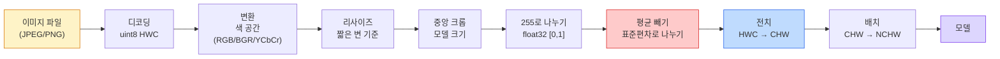
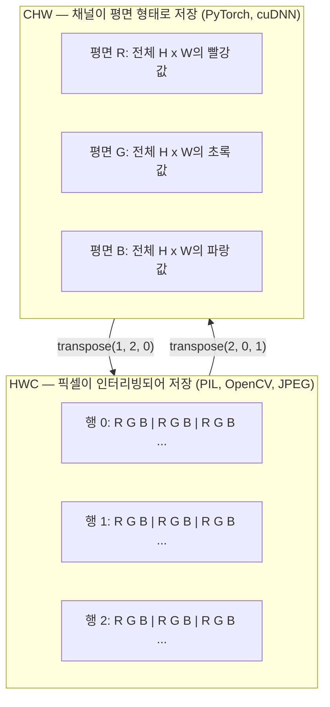

# 이미지 기초 — 픽셀, 채널, 색 공간

> 이미지는 빛의 샘플로 구성된 텐서입니다. 앞으로 사용할 모든 비전 모델은 이 하나의 사실에서 출발합니다.

**유형:** 구축
**언어:** Python
**선수 지식:** 1단계 12강(텐서 연산), 3단계 11강(PyTorch 입문)
**소요 시간:** ~45분

## 학습 목표

- 연속적인 장면이 어떻게 픽셀로 이산화되는지 설명하고, 샘플링/양자화 결정이 모든 다운스트림 모델의 상한을 설정하는 이유를 설명
- NumPy 배열로 이미지를 읽고, 슬라이스하고, 검사하며 HWC와 CHW 레이아웃 간 원활하게 전환
- RGB, 그레이스케일, HSV, YCbCr 간 변환하고 각 색 공간이 존재하는 이유 정당화
- `torchvision`이 요구하는 대로 픽셀 수준 전처리(정규화, 표준화, 리사이즈, 채널-퍼스트)를 정확히 적용

> **참고**: PyTorch, NumPy, torchvision은 번역하지 않음. 예: `torchvision`은 그대로 유지.

## 문제 정의

당신이 읽게 될 모든 논문, 다운로드할 모든 사전 훈련 가중치, 호출할 모든 비전 API는 입력에 대한 특정 인코딩을 가정합니다. 모델이 `float32`를 원하는데 `uint8` 이미지를 전달하면 여전히 실행은 되지만 — 소리 없이 쓰레기 값을 생성합니다. RGB로 훈련된 네트워크에 BGR을 입력하면 정확도가 10% 포인트나 떨어집니다. 채널-퍼스트(channels-first) 입력을 기대하는 모델에 채널-라스트(channels-last) 입력을 주면 첫 번째 합성곱 레이어가 높이를 특징 채널로 처리합니다. 이 중 어떤 것도 오류를 발생시키지 않습니다. 단지 메트릭을 망가뜨리고, 파일을 로드하는 방식에 숨은 버그를 찾는 데 일주일을 허비하게 만듭니다.

합성곱은 무엇을 슬라이딩하는지 알면 복잡하지 않습니다. 어려운 부분은 "이미지"라는 개념이 카메라, JPEG 디코더, PIL, OpenCV, torchvision, CUDA 커널 각각에서 다른 의미를 가진다는 것입니다. 각 스택은 고유한 축 순서, 바이트 범위, 채널 규약을 가지고 있습니다. 이러한 차이를 구분하지 못하는 비전 엔지니어는 고장난 파이프라인을 배포하게 됩니다.

이 레슨은 기초를 단단히 다져서 이후 단계에서 안정적으로 구축할 수 있도록 합니다. 끝까지 학습하면 픽셀이 무엇인지, 왜 픽셀당 하나의 숫자가 아닌 세 개의 숫자가 필요한지, "ImageNet 통계로 정규화"가 실제로 어떤 작업을 수행하는지, 그리고 이 단계의 다른 모든 레슨에서 가정할 두 가지 또는 세 가지 레이아웃 간 변환 방법을 알게 될 것입니다.

## 개념

### 전체 전처리 파이프라인 개요

모든 프로덕션 비전 시스템은 가역적 변환의 동일한 시퀀스로 구성됩니다. 한 단계라도 잘못되면 모델이 학습한 입력과 다른 입력을 보게 됩니다.



빨간색과 파란색 상자 두 개는 80%의 무음 실패가 발생하는 곳입니다: 표준화 누락과 잘못된 레이아웃.

### 픽셀은 사각형이 아닌 샘플

카메라 센서는 작은 검출기 격자에 도달하는 광자를 카운트합니다. 각 검출기는 1초 미만의 시간 동안 빛을 적분하고, 도달한 광자 수에 비례하는 전압을 방출합니다. 센서는 이 전압을 정수로 이산화합니다. 하나의 검출기가 하나의 픽셀이 됩니다.

```
연속적인 장면                 센서 격자                     디지털 이미지
(무한한 디테일)                (H x W 검출기)               (H x W 정수)

    ~~~~~                        +--+--+--+--+--+                 210 198 180 155 120
   ~   ~   ~                     |  |  |  |  |  |                 205 195 178 152 118
  ~ 빛 ~      ---->           +--+--+--+--+--+     ---->       200 190 175 150 115
   ~~~~~                         |  |  |  |  |  |                 195 185 170 148 112
                                 +--+--+--+--+--+                 188 180 165 145 108
```

이 단계에서 두 가지 선택이 발생하며, 이는 모든 다운스트림 작업의 상한을 결정합니다:

- **공간 샘플링**은 장면의 각도당 검출기 수를 결정합니다. 너무 적으면 에지가 들쭉날쭉해집니다(앨리어싱). 너무 많으면 저장 공간과 계산량이 폭발적으로 증가합니다.
- **강도 양자화**는 전압을 얼마나 세밀하게 구간화할지 결정합니다. 8비트는 256단계를 제공하며 디스플레이 표준입니다. 10, 12, 16비트는 더 부드러운 그라데이션을 제공하며 의료 영상, HDR, 원시 센서 파이프라인에 중요합니다.

픽셀은 면적이 있는 색칠된 사각형이 아닙니다. 하나의 측정값입니다. 리사이즈나 회전 시 이 측정 격자를 재샘플링하는 것입니다.

### 왜 세 개의 채널인가

하나의 검출기는 전체 가시광선 스펙트럼에 걸쳐 광자를 카운트합니다. 이것이 그레이스케일입니다. 색상을 얻기 위해 센서는 격자에 빨강, 초록, 파랑 필터를 모자이크 형태로 덮습니다. 디모자이킹 후, 모든 공간 위치에는 세 개의 정수가 있습니다: 빨강 필터 검출기, 초록 필터 검출기, 파랑 필터 근처 검출기의 응답입니다. 이 세 정수가 픽셀의 RGB 트리플렛입니다.

```
메모리 내 하나의 픽셀:

    (R, G, B) = (210, 140, 30)   <- 적주황색

H x W RGB 이미지:

    형태 (H, W, 3)     저장 방식   H 행의 W 픽셀, 각 픽셀은 3개의 값
                                    uint8의 경우 각 값은 [0, 255] 범위
```

3은 마법이 아닙니다. 깊이 카메라는 Z 채널을 추가합니다. 위성은 적외선과 자외선 대역을 추가합니다. 의료 스캔은 종종 하나의 채널(X선, CT)이나 많은 채널(초분광)을 가집니다. 채널 수는 마지막 축이며, 합성곱 레이어는 이 축을 따라 혼합을 학습합니다.

### 두 가지 레이아웃 규칙: HWC와 CHW

동일한 텐서, 두 가지 순서. 모든 라이브러리는 하나를 선택합니다.

```
HWC (높이, 너비, 채널)           CHW (채널, 높이, 너비)

   W ->                                    H ->
  +-----+-----+-----+                     +-----+-----+
H |R G B|R G B|R G B|                   C |R R R R R R|
| +-----+-----+-----+                   | +-----+-----+
v |R G B|R G B|R G B|                   v |G G G G G G|
  +-----+-----+-----+                     +-----+-----+
                                          |B B B B B B|
                                          +-----+-----+

   PIL, OpenCV, matplotlib,              PyTorch, 대부분의 딥러닝
   디스크에 저장된 거의 모든 이미지       프레임워크, cuDNN 커널
```

CHW는 합성곱 커널이 H와 W를 따라 슬라이드하기 때문에 존재합니다. 채널 축을 첫 번째로 유지하면 각 커널이 채널당 연속적인 2D 평면을 보게 되어 벡터화가 깔끔하게 이루어집니다. 디스크 형식은 HWC를 유지하는데, 이는 센서에서 스캔라인이 나오는 방식과 일치하기 때문입니다.

천 번은 입력할 변환 코드:

```
img_chw = img_hwc.transpose(2, 0, 1)      # NumPy
img_chw = img_hwc.permute(2, 0, 1)        # PyTorch 텐서
```

메모리 레이아웃 시각화:



### 바이트 범위와 데이터 타입

세 가지 규칙이 지배적입니다:

| 규칙 | dtype | 범위 | 사용처 |
|------------|-------|-------|------------------|
| Raw | `uint8` | [0, 255] | 디스크 파일, PIL, OpenCV 출력 |
| 정규화 | `float32` | [0.0, 1.0] | `img.astype('float32') / 255` 이후 |
| 표준화 | `float32` | 대략 [-2, +2] | 평균 빼기 및 표준편차로 나누기 이후 |

합성곱 네트워크는 표준화된 입력으로 학습되었습니다. ImageNet 통계 `mean=[0.485, 0.456, 0.406]`, `std=[0.229, 0.224, 0.225]`는 전체 ImageNet 학습 세트에 대한 세 채널의 산술 평균과 표준편차이며, [0, 1] 정규화 픽셀에서 계산됩니다. 표준화된 float을 기대하는 모델에 raw `uint8`을 입력하는 것은 응용 비전에서 가장 흔한 무음 실패 원인입니다.

### 색 공간과 존재 이유

RGB는 캡처 형식이지만 모델에 항상 가장 유용한 표현은 아닙니다.

```
 RGB               HSV                       YCbCr / YUV

 R 빨강             H 색조 (각도 0-360)       Y 휘도 (밝기)
 G 초록           S 채도 (0-1)        Cb 색차 파랑-노랑
 B 파랑            V 값/밝기 (0-1)  Cr 색차 빨강-초록

 센서 출력에 선형         색상과 밝기 분리. 색상 기반     밝기와 색상 분리. JPEG 및
                   임계값 설정, UI 슬라이더,        대부분의 비디오 코덱은
                   간단한 필터에 유용           색차 채널을 더 강하게 압축
                                             합니다. 인간의 눈은 Y보다
                                             색차 디테일에 덜 민감하기
                                             때문입니다.
```

대부분의 현대 CNN에는 RGB를 입력합니다. 다른 색 공간을 만나는 경우:

- **HSV** — 클래식 CV 코드, 색상 기반 분할, 화이트 밸런싱.
- **YCbCr** — JPEG 내부 읽기, 비디오 파이프라인, Y만 사용하는 초해상도 모델.
- **그레이스케일** — OCR, 문서 모델, 색상이 신호가 아닌 방해 변수인 모든 경우.

RGB에서 그레이스케일은 가중 합입니다. 단순 평균이 아닌 이유는 인간의 눈이 빨강이나 파랑보다 초록에 더 민감하기 때문입니다:

```
Y = 0.299 R + 0.587 G + 0.114 B       (ITU-R BT.601, 클래식 가중치)
```

### 종횡비, 리사이즈, 보간

모든 모델은 고정된 입력 크기를 가집니다(ImageNet 분류기의 경우 224x224, 현대 검출기의 경우 384x384 또는 512x512). 이미지가 이 크기와 일치하는 경우는 드뭅니다. 중요한 세 가지 리사이즈 선택:

- **짧은 변 리사이즈 후 중앙 크롭** — 표준 ImageNet 레시피. 종횡비 유지, 가장자리 픽셀 스트립 제거.
- **리사이즈 및 패딩** — 종횡비와 모든 픽셀 유지, 검은색 막대 추가. 검출 및 OCR 표준.
- **타겟으로 직접 리사이즈** — 이미지 늘림. 저렴하지만 기하학적 왜곡 발생, 많은 분류 작업에 적합.

보간 방법은 새 격자가 이전 격자와 정렬되지 않을 때 중간 픽셀을 계산하는 방식을 결정합니다:

```
최근접 이웃     가장 빠름, 블록 현상, 마스크/라벨에 유일한 선택
양선형              빠르고 부드러움, 대부분의 이미지 리사이즈 기본값
양삼차              더 느림, 업스케일링 시 더 선명
랜츠즈              가장 느림, 최고 품질, 최종 디스플레이에 사용
```

경험적 규칙: 학습에는 양선형, 사람이 볼 자산에는 양삼차 또는 랜츠즈, 정수 클래스 ID가 포함된 모든 것에는 최근접 이웃.

## 빌드하기

### 1단계: 이미지 로드 및 형태 확인

Pillow를 사용하여 JPEG 또는 PNG 파일을 로드하고 NumPy로 변환한 후 결과를 출력합니다. 오프라인에서 실행되는 결정적 예제를 위해 합성 이미지를 생성합니다.

```python
import numpy as np
from PIL import Image

def synthetic_rgb(h=128, w=192, seed=0):
    rng = np.random.default_rng(seed)
    yy, xx = np.meshgrid(np.linspace(0, 1, h), np.linspace(0, 1, w), indexing="ij")
    r = (np.sin(xx * 6) * 0.5 + 0.5) * 255
    g = yy * 255
    b = (1 - yy) * xx * 255
    rgb = np.stack([r, g, b], axis=-1) + rng.normal(0, 6, (h, w, 3))
    return np.clip(rgb, 0, 255).astype(np.uint8)

arr = synthetic_rgb()
# 또는 디스크에서 로드:
# arr = np.asarray(Image.open("your_image.jpg").convert("RGB"))

print(f"type:   {type(arr).__name__}")
print(f"dtype:  {arr.dtype}")
print(f"shape:  {arr.shape}     # (H, W, C)")
print(f"min:    {arr.min()}")
print(f"max:    {arr.max()}")
print(f"pixel at (0, 0): {arr[0, 0]}")
```

예상 출력: `shape: (H, W, 3)`, `dtype: uint8`, 범위 `[0, 255]`. 이는 카메라, JPEG 디코더 또는 합성 생성기에서 온 바이트의 표준 디스크 표현입니다.

### 2단계: 채널 분할 및 레이아웃 재주문

R, G, B 채널을 개별적으로 분리한 후 PyTorch를 위해 HWC에서 CHW로 변환합니다.

```python
R = arr[:, :, 0]
G = arr[:, :, 1]
B = arr[:, :, 2]
print(f"R shape: {R.shape}, mean: {R.mean():.1f}")
print(f"G shape: {G.shape}, mean: {G.mean():.1f}")
print(f"B shape: {B.shape}, mean: {B.mean():.1f}")

arr_chw = arr.transpose(2, 0, 1)
print(f"\nHWC shape: {arr.shape}")
print(f"CHW shape: {arr_chw.shape}")
```

채널당 하나의 그레이스케일 평면. CHW는 축 순서만 변경하며, 메모리 레이아웃이 허용하는 경우 데이터 복사가 엄격히 필요하지 않습니다.

### 3단계: 그레이스케일 및 HSV 변환

가중치 합 그레이스케일, 그리고 수동 RGB-to-HSV 변환.

```python
def rgb_to_grayscale(rgb):
    weights = np.array([0.299, 0.587, 0.114], dtype=np.float32)
    return (rgb.astype(np.float32) @ weights).astype(np.uint8)

def rgb_to_hsv(rgb):
    rgb_f = rgb.astype(np.float32) / 255.0
    r, g, b = rgb_f[..., 0], rgb_f[..., 1], rgb_f[..., 2]
    cmax = np.max(rgb_f, axis=-1)
    cmin = np.min(rgb_f, axis=-1)
    delta = cmax - cmin

    h = np.zeros_like(cmax)
    mask = delta > 0
    rmax = mask & (cmax == r)
    gmax = mask & (cmax == g)
    bmax = mask & (cmax == b)
    h[rmax] = ((g[rmax] - b[rmax]) / delta[rmax]) % 6
    h[gmax] = ((b[gmax] - r[gmax]) / delta[gmax]) + 2
    h[bmax] = ((r[bmax] - g[bmax]) / delta[bmax]) + 4
    h = h * 60.0

    s = np.where(cmax > 0, delta / cmax, 0)
    v = cmax
    return np.stack([h, s, v], axis=-1)

gray = rgb_to_grayscale(arr)
hsv = rgb_to_hsv(arr)
print(f"gray shape: {gray.shape}, range: [{gray.min()}, {gray.max()}]")
print(f"hsv   shape: {hsv.shape}")
print(f"hue range: [{hsv[..., 0].min():.1f}, {hsv[..., 0].max():.1f}] degrees")
print(f"sat range: [{hsv[..., 1].min():.2f}, {hsv[..., 1].max():.2f}]")
print(f"val range: [{hsv[..., 2].min():.2f}, {hsv[..., 2].max():.2f}]")
```

색조(Hue)는 도(degrees) 단위로, 채도(Saturation)와 명도(Value)는 [0, 1] 범위로 출력됩니다. 이는 OpenCV의 `hsv_full` 규칙과 일치합니다.

### 4단계: 정규화, 표준화 및 역변환

원시 바이트에서 사전 훈련된 ImageNet 모델이 기대하는 정확한 텐서로 변환한 후 다시 역변환합니다.

```python
mean = np.array([0.485, 0.456, 0.406], dtype=np.float32)
std = np.array([0.229, 0.224, 0.225], dtype=np.float32)

def preprocess_imagenet(rgb_uint8):
    x = rgb_uint8.astype(np.float32) / 255.0
    x = (x - mean) / std
    x = x.transpose(2, 0, 1)
    return x

def deprocess_imagenet(chw_float32):
    x = chw_float32.transpose(1, 2, 0)
    x = x * std + mean
    x = np.clip(x * 255.0, 0, 255).astype(np.uint8)
    return x

x = preprocess_imagenet(arr)
print(f"preprocessed shape: {x.shape}     # (C, H, W)")
print(f"preprocessed dtype: {x.dtype}")
print(f"preprocessed mean per channel:  {x.mean(axis=(1, 2)).round(3)}")
print(f"preprocessed std  per channel:  {x.std(axis=(1, 2)).round(3)}")

roundtrip = deprocess_imagenet(x)
max_diff = np.abs(roundtrip.astype(int) - arr.astype(int)).max()
print(f"roundtrip max pixel diff: {max_diff}    # should be 0 or 1")
```

채널별 평균은 0에 가까워야 하고, 표준편차는 1에 가까워야 합니다. `preprocess/deprocess` 쌍은 `torchvision.transforms.Normalize` 호출이 내부적으로 수행하는 작업과 정확히 일치합니다.

### 5단계: 세 가지 보간법으로 리사이즈

차이가 눈에 띄도록 업스케일 시 최근접, 양선형, 양입방 보간법을 비교합니다.

```python
target = (arr.shape[0] * 3, arr.shape[1] * 3)

nearest = np.asarray(Image.fromarray(arr).resize(target[::-1], Image.NEAREST))
bilinear = np.asarray(Image.fromarray(arr).resize(target[::-1], Image.BILINEAR))
bicubic = np.asarray(Image.fromarray(arr).resize(target[::-1], Image.BICUBIC))

def local_roughness(x):
    gy = np.diff(x.astype(float), axis=0)
    gx = np.diff(x.astype(float), axis=1)
    return float(np.abs(gy).mean() + np.abs(gx).mean())

for name, out in [("nearest", nearest), ("bilinear", bilinear), ("bicubic", bicubic)]:
    print(f"{name:>8}  shape={out.shape}  roughness={local_roughness(out):6.2f}")
```

최근접 보간은 거친 가장자리를 유지하므로 거칠기 점수가 가장 높습니다. 양선형이 가장 부드럽고, 양입방은 계단식 아티팩트 없이 인지된 선명도를 유지하면서 중간 위치에 있습니다.

## 사용 방법

`torchvision.transforms`는 위의 모든 기능을 단일 조합 가능한 파이프라인으로 묶어 제공합니다. 아래 코드는 `preprocess_imagenet`이 수행하는 작업을 재현하며, 여기에 리사이즈와 크롭을 추가합니다.

```python
import torch
from torchvision import transforms
from PIL import Image

img = Image.fromarray(synthetic_rgb(256, 256))

pipeline = transforms.Compose([
    transforms.Resize(256),
    transforms.CenterCrop(224),
    transforms.ToTensor(),
    transforms.Normalize(mean=[0.485, 0.456, 0.406], std=[0.229, 0.224, 0.225]),
])

x = pipeline(img)
print(f"텐서 타입:  {type(x).__name__}")
print(f"텐서 데이터 타입: {x.dtype}")
print(f"텐서 형태: {tuple(x.shape)}      # (C, H, W)")
print(f"채널별 평균: {x.mean(dim=(1, 2)).tolist()}")
print(f"채널별 표준편차:  {x.std(dim=(1, 2)).tolist()}")

batch = x.unsqueeze(0)
print(f"\n배치 형태: {tuple(batch.shape)}   # (N, C, H, W) — 모델 입력 준비 완료")
```

네 가지 단계, 이 정확한 순서대로 진행됩니다: `Resize(256)`은 짧은 변을 256으로 조정합니다; `CenterCrop(224)`은 중앙에서 224x224 패치를 추출합니다; `ToTensor()`는 255로 나누고 HWC를 CHW로 변환합니다; `Normalize`는 ImageNet 평균을 빼고 표준편차로 나눕니다. 이 순서를 반대로 하면 모델에 전달되는 값이 조용히 변경됩니다.

## Ship It

이 레슨은 다음을 생성합니다:

- `outputs/prompt-vision-preprocessing-audit.md` — 어떤 모델 카드나 데이터셋 카드를 팀이 반드시 준수해야 하는 전처리 불변 항목 체크리스트로 변환하는 프롬프트입니다.
- `outputs/skill-image-tensor-inspector.md` — 이미지 형태의 텐서나 배열이 주어지면 데이터 타입(dtype), 레이아웃(layout), 범위(range), 그리고 원시(raw), 정규화(normalized), 표준화(standardized) 상태 여부를 보고하는 스킬입니다.

## 연습 문제

1. **(쉬움)** OpenCV(`cv2.imread`)와 Pillow로 JPEG를 로드하세요. 두 배열의 모양과 `(0, 0)` 위치의 픽셀 값을 출력하세요. 채널 순서 차이를 설명한 후, OpenCV 배열을 Pillow 배열과 동일하게 만드는 한 줄짜리 변환 코드를 작성하세요.  
   - *힌트: OpenCV는 BGR, Pillow는 RGB 순서를 사용합니다.*

2. **(중간)** `standardize(img, mean, std)`와 그 역함수를 작성하세요. 이 함수들은 모든 uint8 이미지에 대해 `roundtrip_max_diff <= 1` 테스트를 통과해야 합니다. 함수들은 HWC 형식의 단일 이미지와 NCHW 형식의 배치에 동일한 호출로 작동해야 합니다.  
   - *힌트: 정규화/역정규화 시 `torch.clamp` 또는 `np.clip`을 사용하여 [0, 255] 범위를 유지하세요.*

3. **(어려움)** 3채널 ImageNet-표준화된 텐서를 받아 1×1 컨볼루션을 통과시켜 RGB의 가중치 혼합을 학습한 단일 그레이스케일 채널을 생성하세요. 가중치를 `[0.299, 0.587, 0.114]`로 초기화하고 동결한 후, 출력이 수동으로 계산한 `rgb_to_grayscale`과 부동소수점 오차 범위 내에서 일치하는지 검증하세요. 1×1 컨볼루션으로 표현할 수 있는 다른 고전적인 색공간 변환은 무엇이 있을까요?  
   - *힌트: YUV, YCbCr, HSV 등의 변환도 1×1 컨볼루션으로 구현 가능합니다.*

## 주요 용어

| 용어 | 사람들이 말하는 것 | 실제 의미 |
|------|----------------|----------------------|
| 픽셀(Pixel) | "색깔이 있는 정사각형" | 하나의 격자 위치에서 측정된 빛의 강도 — 색상 3개 값, 그레이스케일 1개 값 |
| 채널(Channel) | "색상" | 이미지 텐서에 쌓인 병렬 공간 격자 중 하나; HWC에서는 마지막 축, CHW에서는 첫 번째 축 |
| HWC / CHW | "형태" | 이미지 텐서의 축 순서; 디스크 및 PIL은 HWC 사용, PyTorch 및 cuDNN은 CHW 사용 |
| 정규화(Normalize) | "이미지 크기 조정" | 픽셀을 [0, 1] 범위로 만들기 위해 255로 나눔 — 필수적이지만 충분하지는 않음 |
| 표준화(Standardize) | "영점 중심 조정" | 채널별 평균을 빼고 표준편차로 나누어 입력 분포가 모델 학습 시와 일치하도록 함 |
| 그레이스케일 변환(Grayscale conversion) | "채널 평균화" | 인간의 밝기 인지와 일치하는 0.299/0.587/0.114 가중치 합 |
| 보간법(Interpolation) | "리사이즈 시 픽셀 선택 방식" | 새 격자가 이전 격자와 정렬되지 않을 때 출력 값을 결정하는 규칙 — 라벨에는 최근접 이웃, 학습에는 쌍선형, 표시에는 3차 곡선 |
| 종횡비(Aspect ratio) | "너비 대 높이" | "리사이즈 및 패딩"과 "리사이즈 및 늘림"을 구분하는 비율

## 추가 자료

- [Charles Poynton — 색 공간 안내 투어](https://poynton.ca/PDFs/Guided_tour.pdf) — 수많은 색 공간이 존재하는 이유와 각 색 공간이 중요한 시기에 대한 가장 명확한 기술적 설명
- [PyTorch Vision 변환 문서](https://pytorch.org/vision/stable/transforms.html) — 실제 프로덕션에서 구성할 변환 파이프라인의 전체 목록
- [JPEG 작동 원리 (Colt McAnlis)](https://www.youtube.com/watch?v=F1kYBnY6mwg) — 크로마 서브샘플링, DCT 및 JPEG이 RGB 대신 YCbCr을 인코딩하는 이유를 시각적으로 설명하는 영상
- [ImageNet 전처리 규칙 (torchvision 모델)](https://pytorch.org/vision/stable/models.html) — `mean=[0.485, 0.456, 0.406]`의 출처 및 모델 동물원의 모든 모델이 이를 기대하는 이유