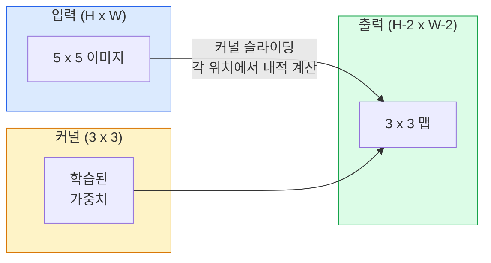
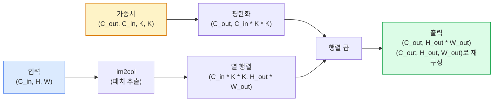

# 컨볼루션 처음부터 구현하기

> 컨볼루션은 이미지 위를 미끄러지듯 이동하며 모든 위치에서 동일한 가중치를 공유하는 작은 밀집 레이어(dense layer)입니다.

**유형:** 구현
**언어:** Python
**선수 지식:** Phase 3 (딥러닝 핵심), Phase 4 레슨 01 (이미지 기초)
**소요 시간:** ~75분

## 학습 목표

- NumPy만 사용하여 중첩 루프 버전과 벡터화된 `im2col` 버전을 포함한 2D 컨볼루션을 처음부터 구현
- 입력 크기, 커널 크기, 패딩, 스트라이드 조합에 대한 출력 공간 크기 계산 및 `(H - K + 2P) / S + 1` 공식 정당화
- 커널 직접 설계(에지, 블러, 샤프닝, Sobel) 및 각 커널이 생성하는 활성화 패턴 원리 설명
- 컨볼루션을 특징 추출기로 적층하고 적층 깊이와 수용 필드 크기 연결 관계 이해

## 문제 정의

224x224 RGB 이미지에 완전 연결 계층을 적용하면 뉴런당 224 * 224 * 3 = 150,528개의 입력 가중치가 필요합니다. 1,000개의 유닛을 가진 단일 은닉 계층은 이미 1억 5천만 개의 매개변수를 가지며 — 유용한 것을 학습하기 전입니다. 더 나쁜 점은 해당 계층이 왼쪽 상단의 개와 오른쪽 하단의 개가 동일한 패턴이라는 개념을 전혀 인식하지 못한다는 것입니다. 모든 픽셀 위치를 독립적으로 처리하는데, 이는 이미지에 대해 정확히 잘못된 접근 방식입니다: 고양이를 3픽셀 이동시켰을 때 네트워크가 해당 개념을 다시 학습해야 할 이유가 없습니다.

이미지 모델이 필요로 하는 두 가지 속성은 **평행 이동 등변성(translation equivariance)**(입력이 이동하면 출력도 이동함)과 **매개변수 공유(parameter sharing)**(모든 위치에서 동일한 특징 검출기 실행)입니다. 밀집 계층(dense layer)은 이 두 가지를 모두 제공하지 않습니다. 반면 합성곱(convolution)은 이 두 가지를 무료로 제공합니다.

합성곱은 딥러닝을 위해 발명된 것이 아닙니다. 이는 JPEG 압축, 포토샵의 가우시안 블러, 산업용 비전의 에지 검출, 그리고 모든 오디오 필터를 구동하는 동일한 연산입니다. 2012년부터 2020년까지 CNN이 ImageNet에서 지배적인 성능을 보인 이유는 합성곱이 인접 값이 관련되어 있고 동일한 패턴이 어디에나 나타날 수 있는 데이터에 대한 올바른 사전 지식(prior)이기 때문입니다.

## 개념

### 하나의 커널, 슬라이딩

2D 컨볼루션은 커널(또는 필터)이라고 하는 작은 가중치 행렬을 입력 위에 슬라이딩하며, 각 위치에서 요소별 곱의 합을 계산합니다. 이 합이 하나의 출력 픽셀이 됩니다.



5x5 입력에 대한 구체적인 3x3 예시 (패딩 없음, 스트라이드 1):

```
입력 X (5 x 5):                커널 W (3 x 3):

  1  2  0  1  2                   1  0 -1
  0  1  3  1  0                   2  0 -2
  2  1  0  2  1                   1  0 -1
  1  0  2  1  3
  2  1  1  0  1

커널은 모든 유효한 3 x 3 윈도우를 슬라이딩합니다. 출력 Y는 3 x 3입니다:

 Y[0,0] = sum( W * X[0:3, 0:3] )
 Y[0,1] = sum( W * X[0:3, 1:4] )
 Y[0,2] = sum( W * X[0:3, 2:5] )
 Y[1,0] = sum( W * X[1:4, 0:3] )
 ... (이하 생략)
```

이 하나의 공식 — **공유 가중치, 지역성, 슬라이딩 윈도우** — 이 전체 아이디어입니다. 나머지는 모두 부수적인 작업입니다.

### 출력 크기 공식

입력 공간 크기 `H`, 커널 크기 `K`, 패딩 `P`, 스트라이드 `S`가 주어졌을 때:

```
H_out = floor( (H - K + 2P) / S ) + 1
```

이것을 외우세요. 아키텍처 설계 시 수십 번 계산하게 될 것입니다.

| 시나리오 | H | K | P | S | H_out |
|----------|---|---|---|---|-------|
| 패딩 없는 유효한 컨볼루션 | 32 | 3 | 0 | 1 | 30 |
| 크기 유지 컨볼루션 | 32 | 3 | 1 | 1 | 32 |
| 2배 다운샘플링 | 32 | 3 | 1 | 2 | 16 |
| 2x2 풀링 | 32 | 2 | 0 | 2 | 16 |
| 큰 수용 영역 | 32 | 7 | 3 | 2 | 16 |

"Same 패딩"은 `S == 1`일 때 `H_out == H`가 되도록 `P`를 선택하는 것을 의미합니다. 홀수 `K`의 경우 `P = (K - 1) / 2`입니다. 3x3 커널이 주로 사용되는 이유는 중심을 가진 가장 작은 홀수 커널이기 때문입니다.

### 패딩

패딩이 없으면 모든 컨볼루션은 특징 맵을 축소시킵니다. 20개를 쌓으면 224x224 이미지가 184x184가 되어 경계에서 계산 낭비가 발생하고, 형태 일치가 필요한 잔차 연결이 복잡해집니다.

```
5 x 5 입력에 제로 패딩 (P = 1) 적용:

  0  0  0  0  0  0  0
  0  1  2  0  1  2  0
  0  0  1  3  1  0  0
  0  2  1  0  2  1  0       이제 커널은 픽셀
  0  1  0  2  1  3  0       (0, 0)을 중심으로
  0  2  1  1  0  1  0       3x3 값을 곱할 수 있습니다.
  0  0  0  0  0  0  0
```

실제로 접하는 모드: `zero` (가장 일반적), `reflect` (가장자리 반사, 생성 모델에서 경계 완화), `replicate` (가장자리 복사), `circular` (순환, 토러스 문제 사용).

### 스트라이드

스트라이드는 슬라이딩의 단계 크기입니다. `stride=1`이 기본값입니다. `stride=2`는 공간 차원을 절반으로 줄이며, 별도의 풀링 레이어없이 CNN 내부에서 다운샘플링하는 고전적인 방법입니다 — 모든 현대 아키텍처(ResNet, ConvNeXt, MobileNet)는 어딘가에 스트라이드 컨볼루션을 사용합니다.

```
5 x 5 입력, 3 x 3 커널에 스트라이드 1 적용:

  시작점: (0,0) (0,1) (0,2)        -> 출력 행 0
          (1,0) (1,1) (1,2)        -> 출력 행 1
          (2,0) (2,1) (2,2)        -> 출력 행 2

  출력: 3 x 3

동일한 입력에 스트라이드 2 적용:

  시작점: (0,0) (0,2)              -> 출력 행 0
          (2,0) (2,2)              -> 출력 행 1

  출력: 2 x 2
```

### 다중 입력 채널

실제 이미지는 3개의 채널을 가집니다. RGB 입력에 대한 3x3 컨볼루션은 실제로 3x3x3 볼륨입니다: 입력 채널당 3x3 슬라이스. 각 공간 위치에서 세 슬라이스 전체에 대해 곱하고 합산한 후 바이어스를 더합니다.

```
입력:   (C_in,  H,  W)        3 x 5 x 5
커널:  (C_in,  K,  K)        3 x 3 x 3 (하나의 커널)
출력:  (1,     H', W')       2D 맵

C_out 출력 채널을 생성하는 레이어의 경우, C_out 개의 커널을 쌓습니다:

가중치:  (C_out, C_in, K, K)   예: 64 x 3 x 3 x 3
출력:  (C_out, H', W')       64 x 3 x 3

매개변수 수: C_out * C_in * K * K + C_out   (+ C_out은 바이어스)
```

마지막 줄은 모델 설계 시 계산할 식입니다. 3채널 입력에 64채널 3x3 컨볼루션은 `64 * 3 * 3 * 3 + 64 = 1,792`개의 매개변수를 가집니다. 저렴합니다.

### im2col 트릭

중첩 루프는 읽기 쉽지만 느립니다. GPU는 큰 행렬 곱을 원합니다. 트릭: 입력의 모든 수용 영역 윈도우를 큰 행렬의 한 열로 평탄화하고, 커널을 행으로 평탄화하면 전체 컨볼루션이 단일 행렬 곱이 됩니다.



모든 프로덕션 컨볼루션 구현은 이 트릭의 변형과 캐시 타일링 기법(직접 컨볼루션, Winograd, 큰 커널용 FFT 컨볼루션)을 포함합니다. im2col을 이해하면 핵심을 이해한 것입니다.

### 수용 영역

단일 3x3 컨볼루션은 9개의 입력 픽셀을 봅니다. 3x3 컨볼루션 두 개를 쌓으면 두 번째 레이어의 뉴런은 5x5 입력 픽셀을 봅니다. 3x3 컨볼루션 세 개는 7x7을 봅니다. 일반적으로:

```
L개의 스택된 K x K 컨볼루션 (스트라이드 1) 후 수용 영역 = 1 + L * (K - 1)

스트라이드 적용 시:   수용 영역은 각 레이어의 스트라이드에 따라 곱셈적으로 증가합니다.
```

"3x3 all the way down"이 작동하는(VGG, ResNet, ConvNeXt) 전체 이유는 3x3 컨볼루션 두 개가 5x5 컨볼루션 하나와 동일한 입력 영역을 보지만 매개변수 수가 적고 중간에 비선형성(활성화 함수)이 추가되기 때문입니다.

## 구축 방법

### 1단계: 배열 패딩

가장 작은 기본 요소인 H x W 배열 주변에 0으로 패딩하는 함수부터 시작합니다.

```python
import numpy as np

def pad2d(x, p):
    if p == 0:
        return x
    h, w = x.shape[-2:]
    out = np.zeros(x.shape[:-2] + (h + 2 * p, w + 2 * p), dtype=x.dtype)
    out[..., p:p + h, p:p + w] = x
    return out

x = np.arange(9).reshape(3, 3)
print(x)
print()
print(pad2d(x, 1))
```

`x.shape[:-2]` 트레일링 축 트릭은 `(H, W)`, `(C, H, W)`, 또는 `(N, C, H, W)`에 대해 수정 없이 동일한 함수가 작동함을 의미합니다.

### 2단계: 중첩 루프를 사용한 2D 컨볼루션

참조 구현 — 느리지만 명확합니다. 이는 `torch.nn.functional.conv2d`가 원칙적으로 수행하는 작업입니다.

```python
def conv2d_naive(x, w, b=None, stride=1, padding=0):
    c_in, h, w_in = x.shape
    c_out, c_in_w, kh, kw = w.shape
    assert c_in == c_in_w

    x_pad = pad2d(x, padding)
    h_out = (h + 2 * padding - kh) // stride + 1
    w_out = (w_in + 2 * padding - kw) // stride + 1

    out = np.zeros((c_out, h_out, w_out), dtype=np.float32)
    for oc in range(c_out):
        for i in range(h_out):
            for j in range(w_out):
                hs = i * stride
                ws = j * stride
                patch = x_pad[:, hs:hs + kh, ws:ws + kw]
                out[oc, i, j] = np.sum(patch * w[oc])
        if b is not None:
            out[oc] += b[oc]
    return out
```

4개의 중첩 루프(출력 채널, 행, 열, 그리고 C_in, kh, kw에 대한 암시적 합). 이는 모든 더 빠른 구현을 검증할 기준입니다.

### 3단계: 수작업 커널로 검증

수직 소벨 커널을 구축하고 합성 단계 이미지에 적용한 후 수직 에지가 강조되는지 확인합니다.

```python
def synthetic_step_image():
    img = np.zeros((1, 16, 16), dtype=np.float32)
    img[:, :, 8:] = 1.0
    return img

sobel_x = np.array([
    [[-1, 0, 1],
     [-2, 0, 2],
     [-1, 0, 1]]
], dtype=np.float32)[None]

x = synthetic_step_image()
y = conv2d_naive(x, sobel_x, padding=1)
print(y[0].round(1))
```

8열(왼쪽에서 오른쪽으로 밝기 증가)에서 큰 양수 값이 나타나고 다른 곳에서는 0이 될 것으로 예상됩니다. 이 단일 출력은 수학이 정확함을 확인하는 검증입니다.

### 4단계: im2col

입력의 모든 커널 크기 윈도우를 행렬 열로 변환합니다. `C_in=3, K=3`의 경우 각 열은 27개의 숫자입니다.

```python
def im2col(x, kh, kw, stride=1, padding=0):
    c_in, h, w = x.shape
    x_pad = pad2d(x, padding)
    h_out = (h + 2 * padding - kh) // stride + 1
    w_out = (w + 2 * padding - kw) // stride + 1

    cols = np.zeros((c_in * kh * kw, h_out * w_out), dtype=x.dtype)
    col = 0
    for i in range(h_out):
        for j in range(w_out):
            hs = i * stride
            ws = j * stride
            patch = x_pad[:, hs:hs + kh, ws:ws + kw]
            cols[:, col] = patch.reshape(-1)
            col += 1
    return cols, h_out, w_out
```

여전히 Python 루프이지만, 이제 주요 작업은 단일 벡터화된 행렬 곱셈으로 수행됩니다.

### 5단계: im2col + 행렬 곱셈을 통한 빠른 컨볼루션

4중 루프를 하나의 행렬 곱셈으로 대체합니다.

```python
def conv2d_im2col(x, w, b=None, stride=1, padding=0):
    c_out, c_in, kh, kw = w.shape
    cols, h_out, w_out = im2col(x, kh, kw, stride, padding)
    w_flat = w.reshape(c_out, -1)
    out = w_flat @ cols
    if b is not None:
        out += b[:, None]
    return out.reshape(c_out, h_out, w_out)
```

정확성 검증: 두 구현을 실행하고 비교합니다.

```python
rng = np.random.default_rng(0)
x = rng.normal(0, 1, (3, 16, 16)).astype(np.float32)
w = rng.normal(0, 1, (8, 3, 3, 3)).astype(np.float32)
b = rng.normal(0, 1, (8,)).astype(np.float32)

y_naive = conv2d_naive(x, w, b, padding=1)
y_im2col = conv2d_im2col(x, w, b, padding=1)

print(f"최대 절대 차이: {np.max(np.abs(y_naive - y_im2col)):.2e}")
```

`최대 절대 차이`는 약 `1e-5` 정도여야 합니다. 이는 부동소수점 누적 순서 차이일 뿐 버그가 아닙니다.

### 6단계: 수작업 커널 집합

훈련 전에 단일 컨볼루션 레이어가 표현할 수 있는 것을 보여주는 5개의 필터입니다.

```python
KERNELS = {
    "identity": np.array([[0, 0, 0], [0, 1, 0], [0, 0, 0]], dtype=np.float32),
    "blur_3x3": np.ones((3, 3), dtype=np.float32) / 9.0,
    "sharpen": np.array([[0, -1, 0], [-1, 5, -1], [0, -1, 0]], dtype=np.float32),
    "sobel_x": np.array([[-1, 0, 1], [-2, 0, 2], [-1, 0, 1]], dtype=np.float32),
    "sobel_y": np.array([[-1, -2, -1], [0, 0, 0], [1, 2, 1]], dtype=np.float32),
}

def apply_kernel(img2d, kernel):
    x = img2d[None].astype(np.float32)
    w = kernel[None, None]
    return conv2d_im2col(x, w, padding=1)[0]
```

그레이스케일 이미지에 적용하면 블러는 부드럽게, 샤프닝은 에지를 선명하게, 소벨-x는 수직 에지를, 소벨-y는 수평 에지를 강조합니다. 이는 AlexNet과 VGG의 *첫 번째* 훈련된 컨볼루션 레이어가 학습한 패턴과 정확히 일치합니다. 좋은 이미지 모델은 이후 어떤 작업이 오든 에지 및 블롭 검출기가 필요하기 때문입니다.

## 사용 방법

PyTorch의 `nn.Conv2d`는 자동 미분(autograd), CUDA 커널, cuDNN 최적화를 포함한 동일한 연산을 래핑합니다. 형태 의미론(shape semantics)은 동일합니다.

```python
import torch
import torch.nn as nn

conv = nn.Conv2d(in_channels=3, out_channels=64, kernel_size=3, stride=1, padding=1)
print(conv)
print(f"weight shape: {tuple(conv.weight.shape)}   # (C_out, C_in, K, K)")
print(f"bias shape:   {tuple(conv.bias.shape)}")
print(f"param count:  {sum(p.numel() for p in conv.parameters())}")

x = torch.randn(8, 3, 224, 224)
y = conv(x)
print(f"\ninput  shape: {tuple(x.shape)}")
print(f"output shape: {tuple(y.shape)}")
```

`padding=1`을 `padding=0`으로 변경하면 출력 크기가 222x222로 감소합니다. `stride=1`을 `stride=2`로 변경하면 112x112로 감소합니다. 이전에 암기한 공식과 동일합니다.

## Ship It

이 레슨은 다음을 생성합니다:

- `outputs/prompt-cnn-architect.md` — 입력 크기, 파라미터 예산, 목표 수용 영역(receptive field)이 주어졌을 때, 모든 단계에서 적절한 K/S/P(커널 크기/스트라이드/패딩)를 가진 `Conv2d` 레이어 스택을 설계하는 프롬프트입니다.
- `outputs/skill-conv-shape-calculator.md` — 네트워크 스펙(spec)을 레이어별로 순회하며 모든 블록에 대한 출력 형태(shape), 수용 영역(receptive field), 파라미터 수를 반환하는 스킬입니다.

## 연습 문제

1. **(쉬움)** 128x128 그레이스케일 입력과 `[Conv3x3(s=1,p=1), Conv3x3(s=2,p=1), Conv3x3(s=1,p=1), Conv3x3(s=2,p=1)]` 스택이 주어졌을 때, 각 레이어의 출력 공간 크기와 수용 필드(receptive field)를 직접 계산하시오. 더미 컨볼루션으로 구성된 PyTorch `nn.Sequential`로 검증하시오.
2. **(중간)** `conv2d_naive`와 `conv2d_im2col`을 확장하여 `groups` 인수를 지원하도록 수정하시오. `groups=C_in=C_out`일 때 깊이별 컨볼루션(depthwise convolution)이 재현되고, 파라미터 수가 `C * C * K * K` 대신 `C * K * K`가 됨을 보이시오.
3. **(어려움)** `conv2d_im2col`의 역전파(backpropagation)를 직접 구현하시오: 출력 그래디언트가 주어졌을 때 입력 `x`와 가중치 `w`의 그래디언트를 계산하시오. 동일한 입력과 가중치에 대해 `torch.autograd.grad`와 비교하여 검증하시오. 힌트: im2col의 그래디언트는 `col2im`이며, 겹치는 윈도우를 누적해야 합니다.

## 주요 용어

| 용어 | 사람들이 말하는 것 | 실제 의미 |
|------|----------------|----------------------|
| 컨볼루션(Convolution) | "필터를 슬라이딩" | 공유 가중치를 사용하여 모든 공간 위치에 적용되는 학습 가능한 내적(dot product); 수학적으로는 상호 상관(cross-correlation)이지만 모두가 컨볼루션이라고 부름 |
| 커널/필터(Kernel / filter) | "특징 감지기" | 입력의 창(window)과 내적하여 하나의 출력 픽셀을 생성하는 (C_in, K, K) 형태의 작은 가중치 텐서 |
| 스트라이드(Stride) | "얼마나 멀리 점프" | 연속적인 커널 배치 사이의 단계 크기; 스트라이드 2는 각 공간 차원을 절반으로 줄임 |
| 패딩(Padding) | "가장자리에 0 추가" | 커널이 경계 픽셀에 중앙 정렬될 수 있도록 입력 주변에 추가되는 값; `same` 패딩은 출력 크기를 입력 크기와 동일하게 유지 |
| 수용 필드(Receptive field) | "뉴런이 보는 범위" | 주어진 출력 활성화 값이 의존하는 원본 입력의 패치(patch); 깊이와 스트라이드가 증가함에 따라 성장 |
| im2col | "GEMM 트릭" | 모든 수용 필드를 열로 재배열하여 컨볼루션을 하나의 큰 행렬 곱셈으로 변환 — 모든 빠른 컨볼루션 커널의 핵심 |
| 깊이별 컨볼루션(Depthwise conv) | "채널당 하나의 커널" | `groups == C_in`인 컨볼루션으로, 각 출력 채널을 해당 입력 채널에서만 계산; MobileNet과 ConvNeXt의 백본 |
| 이동 등가성(Translation equivariance) | "입력 이동 시 출력도 이동" | 입력을 k픽셀만큼 이동하면 출력도 k픽셀만큼 이동하는 성질; 공유 가중치로 인해 자동으로 제공됨

## 추가 자료

- [딥러닝을 위한 컨볼루션 연산 가이드 (Dumoulin & Visin, 2016)](https://arxiv.org/abs/1603.07285) — 모든 과정에서 조용히 복사하는 패딩/스트라이드/확장(딜레이션) 관련 결정판 다이어그램
- [CS231n: 시각적 인식을 위한 컨볼루션 신경망](https://cs231n.github.io/convolutional-networks/) — 원본 im2col 설명을 포함한 표준 강의 노트
- [주석이 달린 ConvNet (fast.ai)](https://nbviewer.org/github/fastai/fastbook/blob/master/13_convolutions.ipynb) — 수동 컨볼루션부터 훈련된 숫자 분류기까지 안내하는 노트북
- [CNN의 수용 필드 연산 (Dang Ha The Hien)](https://distill.pub/2019/computing-receptive-fields/) — 수용 필드 계산에 대한 논문 수준의 인터랙티브 설명자