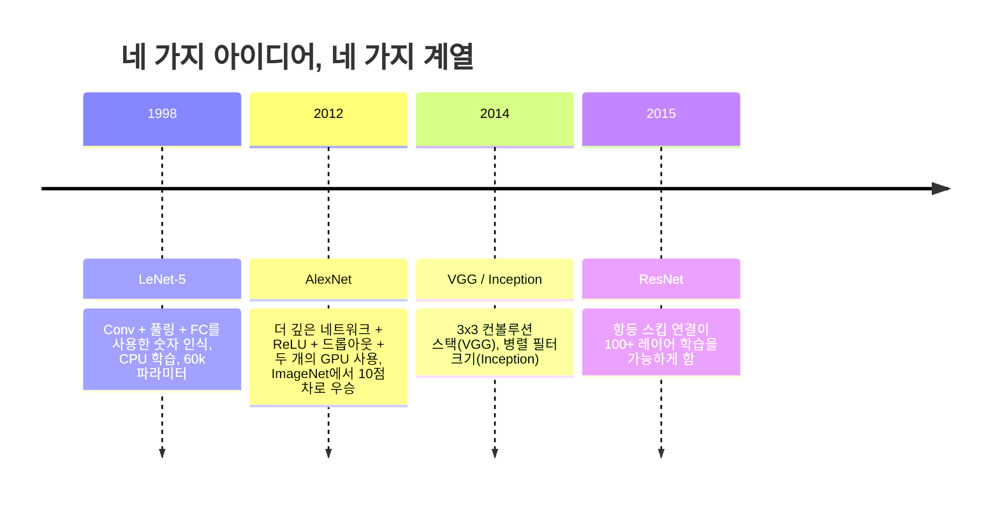
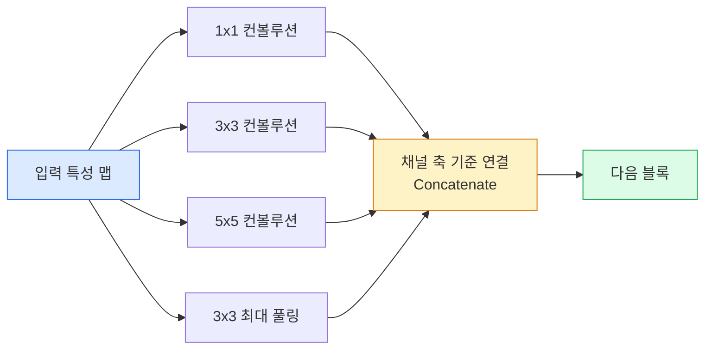
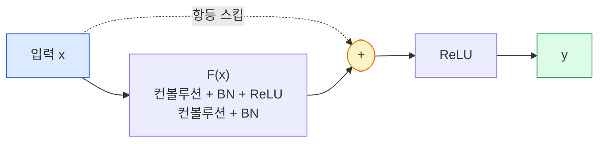

# CNNs — LeNet에서 ResNet까지

> 지난 30년간 주요 CNN들은 모두 동일한 합성곱–비선형성–다운샘플링 레시피에 하나의 새로운 아이디어가 추가된 형태입니다. 아이디어들을 순서대로 배워보세요.

**유형:** 학습 + 구현  
**언어:** Python  
**선수 지식:** 3단계 11강 (PyTorch), 4단계 01강 (이미지 기초), 4단계 02강 (합성곱 기초)  
**소요 시간:** ~75분

## 학습 목표

- LeNet-5 → AlexNet → VGG → Inception → ResNet의 아키텍처 계보를 추적하고, 각 계보가 기여한 단일 핵심 아이디어를 설명
- PyTorch로 LeNet-5, VGG 스타일 블록, ResNet BasicBlock을 각각 40줄 이내로 구현
- 잔차 연결(residual connection)이 1,000층 네트워크를 훈련 불가능한 모델에서 최첨단(SOTA) 모델로 전환하는 이유 설명
- 현대 백본(ResNet-18, ResNet-50)을 읽고 소스 코드를 보기 전에 출력 형태, 수용 영역(receptive field), 파라미터 수를 예측

## 전문 용어 설명
- **수용 영역(receptive field)**: 각 뉴런이 입력으로 받아들이는 영역의 크기
- **파라미터 수(parameter count)**: 모델 내 학습 가능한 가중치와 편향의 총 개수
- **잔차 연결(residual connection)**: 입력을 출력에 직접 더하는 연결 방식
- **최첨단(SOTA, state-of-the-art)**: 현재 가장 성능이 우수한 모델 또는 방법론

> 구현 시 PyTorch의 `nn.Module`과 기본 레이어(`Conv2d`, `BatchNorm2d`, `Linear` 등)를 활용하되, 커스텀 블록 설계는 간결하게 유지

## 문제 정의

2011년 최고의 ImageNet 분류기는 약 74%의 top-5 정확도를 기록했습니다. 2012년 AlexNet은 85%를 달성했고, 2015년 ResNet은 96%를 기록했습니다. 새로운 데이터도 없었고, 새로운 GPU 세대도 없었습니다. 이러한 성능 향상은 아키텍처 아이디어에서 비롯되었습니다. 현업 비전 엔지니어는 어떤 아이디어가 어떤 논문에서 나왔는지 알아야 합니다. 왜냐하면 2026년에 출시하는 모든 프로덕션 백본은 동일한 구성 요소들의 재조합일 것이기 때문입니다. 또한 아이디어들은 계속 전이되고 있습니다: 그룹화된 합성곱(grouped convs)은 CNN에서 트랜스포머로, 잔차 연결(residual connections)은 ResNet에서 모든 LLM(Large Language Model)로, 배치 정규화(batch normalization)는 확산 모델(diffusion models)에 적용되었습니다.

이러한 네트워크들을 순서대로 공부하면 흔한 실수로부터 보호받을 수 있습니다: LeNet 크기의 네트워크로 문제를 해결할 수 있는데도 가장 큰 모델을 선택하는 실수입니다. MNIST에는 ResNet이 필요하지 않습니다. 각 모델 패밀리의 확장 곡선을 알면 어디에 위치해야 할지 알 수 있습니다.

## 개념

## 비전을 바꾼 네 가지 아이디어



고전적인 비전 분야에서 이 네 가지 도약만큼 중요한 것은 없었습니다.

## LeNet-5 (1998)

Yann LeCun의 숫자 인식 모델. 60,000개의 파라미터. 두 개의 컨볼루션-풀링 블록, 두 개의 완전 연결 레이어, tanh 활성화 함수. 모든 CNN이 계승하는 템플릿을 정의했습니다:

```
입력 (1, 32, 32)
  컨볼루션 5x5 -> (6, 28, 28)
  평균 풀링 2x2 -> (6, 14, 14)
  컨볼루션 5x5 -> (16, 10, 10)
  평균 풀링 2x2 -> (16, 5, 5)
  평탄화 -> 400
  밀집 레이어 -> 120
  밀집 레이어 -> 84
  밀집 레이어 -> 10
```

현대 세계에서 CNN이라고 부르는 모든 것 — 컨볼루션과 다운샘플링을 번갈아 가며 작은 분류기 헤드에 연결하는 방식 — 은 더 많은 레이어, 더 큰 채널, 더 나은 활성화 함수를 가진 LeNet입니다.

## AlexNet (2012)

ImageNet을 깨뜨린 세 가지 변화:

1. **ReLU**를 tanh 대신 사용. 그래디언트 소실 문제 해결. 학습 속도가 6배 빨라짐.
2. **드롭아웃**을 완전 연결 헤드에 적용. 정규화가 트릭이 아닌 레이어가 됨.
3. **깊이와 너비**. 5개의 컨볼루션 레이어, 3개의 밀집 레이어, 60M 파라미터, 두 개의 GPU에서 모델을 분할하여 학습.

논문의 그림 2는 여전히 GPU 분할을 두 개의 병렬 스트림으로 보여줍니다. 이 병렬성은 하드웨어적 해결책이었으며 아키텍처 통찰은 아니었지만, 위의 세 가지 아이디어는 여전히 사용하는 모든 모델에 있습니다.

## VGG (2014)

VGG는 질문했습니다: 3x3 컨볼루션만 사용하고 깊이를 늘리면 어떻게 될까?

```
스택:   컨볼루션 3x3 -> 컨볼루션 3x3 -> 풀링 2x2
반복:  16 또는 19개의 컨볼루션 레이어
```

두 개의 2x2 컨볼루션은 하나의 5x5 컨볼루션과 동일한 5x5 입력 영역을 보지만 파라미터가 더 적고(2*9*C^2 = 18C^2 vs 25*C^2) 중간에 추가 ReLU가 있습니다. VGG는 이 관찰을 전체 아키텍처로 변환했습니다. 단순성 — 하나의 블록 유형을 반복 — 은 이후 모든 모델의 기준점이 되었습니다.

비용: 138M 파라미터, 학습 속도가 느림, 추론 비용이 높음.

## Inception (2014, 같은 해)

"어떤 커널 크기를 사용해야 하는가?"에 대한 Google의 대답은: 모두, 병렬로.



각 브랜치는 전문화됩니다 — 1x1은 채널 혼합, 3x3은 지역 텍스처, 5x5는 큰 패턴, 풀링은 이동 불변 특성 — 그리고 연결은 다음 레이어가 유용한 브랜치를 선택할 수 있게 합니다. Inception v1은 파라미터 수를 줄이기 위해 각 브랜치 내부에 1x1 컨볼루션을 병목 현상으로 사용했습니다.

## 퇴화 문제

2015년까지 VGG-19는 작동했지만 VGG-32는 작동하지 않았습니다. 깊이는 도움이 되어야 했지만 약 20개 이상의 레이어에서는 학습 손실과 테스트 손실이 모두 악화되었습니다. 이는 과적합이 아닙니다. 그래디언트가 모든 레이어를 통해 곱셈적으로 축소되어 최적화기가 유용한 가중치를 찾지 못하는 문제입니다.

```
일반 심층 네트워크:
  y = f_L( f_{L-1}( ... f_1(x) ... ) )

초기 레이어에 대한 그래디언트:
  dL/dW_1 = dL/dy * df_L/df_{L-1} * ... * df_2/df_1 * df_1/dW_1

각 곱셈 항의 크기는 대략 (가중치 크기) * (활성화 이득)입니다.
이득이 1보다 작은 100개의 항을 쌓으면 그래디언트는 사실상 0이 됩니다.
```

VGG는 19개 레이어에서 작동했는데, 이는 동시에 발표된 배치 정규화(batch normalization)가 활성화 값을 잘 조정했기 때문입니다. 하지만 배치 정규화도 30개 이상의 레이어를 구제할 수 없었습니다.

## ResNet (2015)

He, Zhang, Ren, Sun은 모든 문제를 해결한 하나의 변화를 제안했습니다:

```
표준 블록:   y = F(x)
잔차 블록:   y = F(x) + x
```

`+ x`는 레이어가 `F(x)`를 0으로 만들어 아무것도 하지 않을 수 있음을 의미합니다. 1,000개 레이어의 ResNet은 이제 최대 1개 레이어 네트워크만큼 나쁠 수 있습니다. 모든 추가 블록에 간단한 탈출구가 있기 때문입니다. 이 보장으로 최적화기는 모든 블록을 *약간* 유용하게 만들 의향이 있습니다 — 그리고 100번 쌓인 약간 유용한 블록은 최첨단 기술입니다.



이 블록의 두 가지 변형이 모든 곳에 나타납니다:

- **BasicBlock** (ResNet-18, ResNet-34): 두 개의 3x3 컨볼루션, 둘 주위에 스킵 연결.
- **Bottleneck** (ResNet-50, -101, -152): 1x1 축소, 3x3 중간, 1x1 확장, 삼중 주위에 스킵 연결. 채널 수가 많을 때 더 저렴합니다.

스킵 연결이 다운샘플링(stride=2)을 건너야 할 때, 항등 경로는 1x1 stride=2 컨볼루션으로 대체되어 형태를 맞춥니다.

## 잔차 연결이 비전 너머 중요한 이유

이 아이디어는 실제로 이미지 분류에 관한 것이 아니었습니다. 깊은 네트워크를 "손가락을 교차하고 그래디언트가 살아남기를 바라는" 것에서 신뢰할 수 있고 확장 가능한 엔지니어링 도구로 바꾸는 것이었습니다. 다음 단계에서 읽을 모든 트랜스포머는 모든 블록에 정확히 동일한 스킵 연결을 가지고 있습니다. ResNet이 없다면 GPT도 없습니다.

## 구축 방법

## 1단계: LeNet-5

최소한의 충실한 LeNet. Tanh 활성화 함수, 평균 풀링 사용. 현대성에 대한 유일한 양보는 원본 가우시안 연결 대신 `nn.CrossEntropyLoss`를 사용한다는 점입니다.

```python
import torch
import torch.nn as nn
import torch.nn.functional as F

class LeNet5(nn.Module):
    def __init__(self, num_classes=10):
        super().__init__()
        self.conv1 = nn.Conv2d(1, 6, kernel_size=5)
        self.conv2 = nn.Conv2d(6, 16, kernel_size=5)
        self.pool = nn.AvgPool2d(2)
        self.fc1 = nn.Linear(16 * 5 * 5, 120)
        self.fc2 = nn.Linear(120, 84)
        self.fc3 = nn.Linear(84, num_classes)

    def forward(self, x):
        x = self.pool(torch.tanh(self.conv1(x)))
        x = self.pool(torch.tanh(self.conv2(x)))
        x = torch.flatten(x, 1)
        x = torch.tanh(self.fc1(x))
        x = torch.tanh(self.fc2(x))
        return self.fc3(x)

net = LeNet5()
x = torch.randn(1, 1, 32, 32)
print(f"output: {net(x).shape}")
print(f"params: {sum(p.numel() for p in net.parameters()):,}")
```

예상 출력: `output: torch.Size([1, 10])`, `params: 61,706`. 이것이 현대 비전 분야를 시작한 전체 숫자 분류기입니다.

## 2단계: VGG 블록

재사용 가능한 블록 하나: 3x3 컨볼루션 2개, ReLU, 배치 정규화, 최대 풀링.

```python
class VGGBlock(nn.Module):
    def __init__(self, in_c, out_c):
        super().__init__()
        self.conv1 = nn.Conv2d(in_c, out_c, kernel_size=3, padding=1)
        self.bn1 = nn.BatchNorm2d(out_c)
        self.conv2 = nn.Conv2d(out_c, out_c, kernel_size=3, padding=1)
        self.bn2 = nn.BatchNorm2d(out_c)
        self.pool = nn.MaxPool2d(2)

    def forward(self, x):
        x = F.relu(self.bn1(self.conv1(x)))
        x = F.relu(self.bn2(self.conv2(x)))
        return self.pool(x)

class MiniVGG(nn.Module):
    def __init__(self, num_classes=10):
        super().__init__()
        self.stack = nn.Sequential(
            VGGBlock(3, 32),
            VGGBlock(32, 64),
            VGGBlock(64, 128),
        )
        self.head = nn.Sequential(
            nn.AdaptiveAvgPool2d(1),
            nn.Flatten(),
            nn.Linear(128, num_classes),
        )

    def forward(self, x):
        return self.head(self.stack(x))

net = MiniVGG()
x = torch.randn(1, 3, 32, 32)
print(f"output: {net(x).shape}")
print(f"params: {sum(p.numel() for p in net.parameters()):,}")
```

CIFAR 크기 입력에 3개의 VGG 블록, 적응형 풀링, 선형 계층 1개. 약 290k 파라미터. CIFAR-10에 충분합니다.

## 3단계: ResNet BasicBlock

ResNet-18과 ResNet-34의 핵심 구성 블록.

```python
class BasicBlock(nn.Module):
    def __init__(self, in_c, out_c, stride=1):
        super().__init__()
        self.conv1 = nn.Conv2d(in_c, out_c, kernel_size=3, stride=stride, padding=1, bias=False)
        self.bn1 = nn.BatchNorm2d(out_c)
        self.conv2 = nn.Conv2d(out_c, out_c, kernel_size=3, stride=1, padding=1, bias=False)
        self.bn2 = nn.BatchNorm2d(out_c)
        if stride != 1 or in_c != out_c:
            self.shortcut = nn.Sequential(
                nn.Conv2d(in_c, out_c, kernel_size=1, stride=stride, bias=False),
                nn.BatchNorm2d(out_c),
            )
        else:
            self.shortcut = nn.Identity()

    def forward(self, x):
        out = F.relu(self.bn1(self.conv1(x)))
        out = self.bn2(self.conv2(out))
        out = out + self.shortcut(x)
        return F.relu(out)
```

컨볼루션 계층의 `bias=False`는 배치 정규화 관례입니다. BN의 베타 파라미터가 이미 편향을 처리하므로 컨볼루션 편향까지 가지는 것은 낭비입니다. `shortcut`은 스트라이드나 채널 수가 변경될 때만 실제 컨볼루션이 필요하며, 그렇지 않으면 항등 연산입니다.

## 4단계: 소형 ResNet

4개의 BasicBlock 그룹을 쌓아 CIFAR 크기 입력에 작동하는 ResNet을 만듭니다.

```python
class TinyResNet(nn.Module):
    def __init__(self, num_classes=10):
        super().__init__()
        self.stem = nn.Sequential(
            nn.Conv2d(3, 32, kernel_size=3, stride=1, padding=1, bias=False),
            nn.BatchNorm2d(32),
            nn.ReLU(inplace=True),
        )
        self.layer1 = self._make_group(32, 32, num_blocks=2, stride=1)
        self.layer2 = self._make_group(32, 64, num_blocks=2, stride=2)
        self.layer3 = self._make_group(64, 128, num_blocks=2, stride=2)
        self.layer4 = self._make_group(128, 256, num_blocks=2, stride=2)
        self.head = nn.Sequential(
            nn.AdaptiveAvgPool2d(1),
            nn.Flatten(),
            nn.Linear(256, num_classes),
        )

    def _make_group(self, in_c, out_c, num_blocks, stride):
        blocks = [BasicBlock(in_c, out_c, stride=stride)]
        for _ in range(num_blocks - 1):
            blocks.append(BasicBlock(out_c, out_c, stride=1))
        return nn.Sequential(*blocks)

    def forward(self, x):
        x = self.stem(x)
        x = self.layer1(x)
        x = self.layer2(x)
        x = self.layer3(x)
        x = self.layer4(x)
        return self.head(x)

net = TinyResNet()
x = torch.randn(1, 3, 32, 32)
print(f"output: {net(x).shape}")
print(f"params: {sum(p.numel() for p in net.parameters()):,}")
```

2개의 블록으로 구성된 4개의 그룹. 그룹 2, 3, 4 시작 시 스트라이드 2. 다운샘플링 시 채널 수 2배 증가. 약 2.8M 파라미터. ResNet-152까지 깔끔하게 확장 가능한 표준 레시피입니다.

## 5단계: 파라미터 대 특징 효율성 비교

동일한 입력을 세 네트워크에 통과시켜 파라미터 수를 비교합니다.

```python
def summary(name, net, x):
    y = net(x)
    params = sum(p.numel() for p in net.parameters())
    print(f"{name:12s}  input {tuple(x.shape)} -> output {tuple(y.shape)}  params {params:>10,}")

x = torch.randn(1, 3, 32, 32)
summary("LeNet5",     LeNet5(),       torch.randn(1, 1, 32, 32))
summary("MiniVGG",    MiniVGG(),      x)
summary("TinyResNet", TinyResNet(),   x)
```

세 모델, 세 시대, 파라미터 수에서 3차수 차이. CIFAR-10 정확도(몇 에폭 훈련 후): LeNet 60%, MiniVGG 89%, TinyResNet 93%.

## 사용 방법

`torchvision.models`는 위에서 언급한 모든 모델의 사전 훈련된 버전을 제공합니다. 호출 시그니처는 모든 패밀리에서 동일하며, 이는 백본 추상화의 핵심 목적입니다.

```python
from torchvision.models import resnet18, ResNet18_Weights, vgg16, VGG16_Weights

r18 = resnet18(weights=ResNet18_Weights.IMAGENET1K_V1)
r18.eval()

print(f"ResNet-18 파라미터: {sum(p.numel() for p in r18.parameters()):,}")
print(r18.layer1[0])
print()

v16 = vgg16(weights=VGG16_Weights.IMAGENET1K_V1)
v16.eval()
print(f"VGG-16   파라미터: {sum(p.numel() for p in v16.parameters()):,}")
```

ResNet-18은 11.7M 파라미터를 가지며, VGG-16은 138M 파라미터를 가집니다. 유사한 ImageNet Top-1 정확도(69.8% vs 71.6%)를 보이지만, 잔차 연결(Residual connections)은 12배의 파라미터 효율성 향상을 제공합니다. 이것이 ResNet 변형들이 2016년부터 2021년 ViT 등장까지 지배적이었으며, 여전히 계산 자원이 제약인 실제 배포 환경에서 우위를 유지하는 이유입니다.

전이 학습(transfer learning)을 위한 방법은 항상 동일합니다: 사전 훈련된 모델을 로드하고, 백본을 고정한 후 분류기 헤드(classifier head)를 교체합니다.

```python
for p in r18.parameters():
    p.requires_grad = False
r18.fc = nn.Linear(r18.fc.in_features, 10)
```

단 3줄입니다. 이제 ImageNet에서 학습한 표현(representation)을 상속받는 10-class CIFAR 분류기를 갖게 되었습니다.

## Ship It

이 레슨은 다음을 생성합니다:

- `outputs/prompt-backbone-selector.md` — 작업, 데이터셋 크기, 컴퓨팅 예산을 고려하여 적절한 CNN 패밀리(LeNet/VGG/ResNet/MobileNet/ConvNeXt)를 선택하는 프롬프트.
- `outputs/skill-residual-block-reviewer.md` — PyTorch 모듈을 읽고 스킵 연결 오류(스트라이드 변경 시 숏컷 누락, 숏컷 활성화 순서, 덧셈 대비 BN 배치)를 표시하는 스킬.

## 연습 문제

1. **(쉬움)** `TinyResNet`의 파라미터를 레이어별로 직접 계산하세요. `sum(p.numel() for p in net.parameters())` 결과와 비교하세요. 파라미터 예산의 대부분은 어디에 할당되나요 — 합성곱(convs), 배치 정규화(BN), 또는 분류기 헤드(classifier head)?
2. **(중간)** Bottleneck 블록(1x1 -> 3x3 -> 1x1 + 스킵 연결)을 구현하고, 이를 사용하여 CIFAR용 ResNet-50 스타일 네트워크를 구축하세요. `TinyResNet`과 파라미터 수를 비교하세요.
3. **(어려움)** `BasicBlock`에서 스킵 연결을 제거하고, 34블록 "plain" 네트워크와 34블록 ResNet을 CIFAR-10에서 각각 10에포크 동안 학습시키세요. 두 모델의 에포크별 학습 손실(training loss vs epoch)을 그래프로 그리세요. He et al.의 Figure 1 결과를 재현하여, plain 깊은 네트워크가 더 얕은 네트워크보다 높은 손실로 수렴하는 것을 확인하세요.

## 주요 용어

| 용어 | 사람들이 말하는 표현 | 실제 의미 |
|------|----------------|----------------------|
| 백본(Backbone) | "모델" | 태스크 헤드(Task Head)에 입력되는 특징 맵(Feature Map)을 생성하는 합성곱 블록(Convolutional Block)의 스택 |
| 잔차 연결(Residual connection) | "스킵 연결(Skip connection)" | `y = F(x) + x`; 최적화기(Optimiser)가 F를 0으로 설정하여 항등 함수를 학습할 수 있게 하여 임의의 깊이 학습이 가능하도록 함 |
| 베이직블록(BasicBlock) | "스킵 연결이 있는 두 개의 3x3 합성곱" | ResNet-18/34 빌딩 블록: 합성곱(Conv)-배치 정규화(BN)-ReLU-합성곱(Conv)-배치 정규화(BN)-덧셈(Add)-ReLU |
| 병목(Bottleneck) | "1x1 축소, 3x3, 1x1 확장" | ResNet-50/101/152 블록; 3x3 합성곱이 감소된 채널 폭에서 실행되므로 높은 채널 수에서 효율적 |
| 퇴화 문제(Degradation problem) | "더 깊을수록 성능이 나빠짐" | 약 20개 이상의 일반 합성곱 레이어부터는 훈련 및 테스트 오류가 증가함; 잔차 연결로 해결되며 더 많은 데이터가 아닌 구조적 개선으로 해결 |
| 스템(Stem) | "첫 번째 레이어" | 3채널 입력을 기본 특징 맵 폭으로 변환하는 초기 합성곱 레이어; 일반적으로 ImageNet에서는 7x7 스트라이드 2, CIFAR에서는 3x3 스트라이드 1 사용 |
| 헤드(Head) | "분류기" | 최종 백본 블록 이후의 레이어: 적응형 풀링(Adaptive Pool), 평탄화(Flatten), 선형 레이어(Linear) |
| 전이 학습(Transfer learning) | "사전 훈련된 가중치" | ImageNet에서 훈련된 백본을 로드하고 헤드만 특정 태스크에 파인튜닝(Fine-tuning)하는 것 |

## 추가 자료

- [Deep Residual Learning for Image Recognition (He et al., 2015)](https://arxiv.org/abs/1512.03385) — ResNet 논문; 모든 그림은 연구 가치가 있음
- [Very Deep Convolutional Networks (Simonyan & Zisserman, 2014)](https://arxiv.org/abs/1409.1556) — VGG 논문; 여전히 "3x3 필터의 이유"에 대한 최고의 참고 자료
- [ImageNet Classification with Deep CNNs (Krizhevsky et al., 2012)](https://papers.nips.cc/paper_files/paper/2012/hash/c399862d3b9d6b76c8436e924a68c45b-Abstract.html) — AlexNet; 수작업 특징 공학 시대를 끝낸 논문
- [Going Deeper with Convolutions (Szegedy et al., 2014)](https://arxiv.org/abs/1409.4842) — Inception v1; 비전 트랜스포머에서도 여전히 나타나는 병렬 필터 아이디어