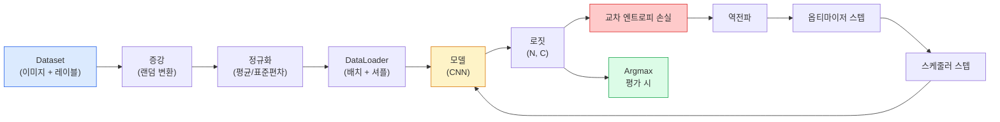

# 이미지 분류

> 분류기(classifier)는 픽셀에서 클래스별 확률 분포로의 함수입니다. 나머지는 모두 부수적인 것들입니다.

**유형:** 구축(Build)
**언어:** Python
**선수 지식:** Phase 2 Lesson 09 (모델 평가), Phase 3 Lesson 10 (미니 프레임워크), Phase 4 Lesson 03 (CNNs)
**소요 시간:** ~75분

## 학습 목표

- CIFAR-10에서 엔드투엔드 이미지 분류 파이프라인 구축: 데이터셋, 증강, 모델, 학습 루프, 평가
- 각 구성 요소(데이터로더, 손실 함수, 옵티마이저, 스케줄러, 증강)의 역할 설명 및 어떤 하나가 고장났을 때 손실 곡선에 어떻게 나타나는지 예측
- 믹스업(mixup), 컷아웃(cutout), 라벨 스무딩(label smoothing)을 처음부터 구현하고 각각을 추가할 가치가 있는 경우 정당화
- 혼동 행렬(confusion matrix)과 클래스별 정밀도/재현율 표를 읽어 집계 정확도를 넘어 데이터셋 및 모델 실패 진단

## 문제 정의

출시되는 모든 비전 작업은 어떤 수준에서든 이미지 분류로 귀결됩니다. 검출은 영역을 분류하고, 분할은 픽셀을 분류하며, 검색은 클래스 중심점과의 유사성에 따라 순위를 매깁니다. 데이터세트 루프, 증강 정책, 손실 함수, 평가 등 분류를 올바르게 수행하는 것은 해당 단계의 다른 모든 작업으로 전이되는 핵심 기술입니다.

대부분의 분류 오류는 모델에 있지 않습니다. 파이프라인에 존재합니다: 고장난 정규화, 셔플되지 않은 훈련 세트, 레이블을 왜곡하는 증강, 훈련 데이터로 오염된 검증 분할, 30번째 에포크 이후 소리 없이 발산하는 학습률 등. 올바른 설정으로 CIFAR-10에서 93% 정확도를 달성할 수 있는 CNN은 파이프라인이 고장난 경우 일반적으로 70-75% 점수를 기록하며, 손실 곡선은 계속 그럴듯하게 보입니다.

이 강의에서는 파이프라인을 직접 구성하여 모든 부분을 검사할 수 있도록 합니다. `torchvision.datasets`에서 버그를 숨길 수 있는 어떤 것도 사용하지 않을 것입니다.

## 개념

### 분류 파이프라인



이 루프의 모든 단계는 버그가 발생할 수 있는 지점입니다. 교차 엔트로피는 소프트맥스 출력이 아닌 원시 로짓을 입력으로 받습니다. 따라서 손실 계산 전에 `model(x).softmax()`를 적용하면 잘못된 그래디언트가 조용히 계산됩니다. 증강은 입력에만 적용되며 레이블에는 적용되지 않습니다. 단, 믹스업(mixup)은 예외로 입력과 레이블을 모두 혼합합니다. `optimizer.zero_grad()`는 매 스텝마다 한 번씩 호출되어야 합니다. 이를 건너뛰면 그래디언트가 누적되어 학습률이 불안정해지는 것처럼 보입니다. 이러한 버그들은 에러를 발생시키지 않으면서 학습 곡선을 평평하게 만듭니다.

### 교차 엔트로피, 로짓, 소프트맥스

분류기는 이미지당 `C`개의 숫자(로짓)를 출력합니다. 소프트맥스를 적용하면 이 값들이 확률 분포로 변환됩니다:

```
softmax(z)_i = exp(z_i) / sum_j exp(z_j)
```

교차 엔트로피는 정답 클래스의 음의 로그 확률을 측정합니다:

```
CE(z, y) = -log( softmax(z)_y )
        = -z_y + log( sum_j exp(z_j) )
```

오른쪽 수식은 수치적으로 안정적인 형태(log-sum-exp)입니다. PyTorch의 `nn.CrossEntropyLoss`는 소프트맥스 + NLL을 하나의 연산으로 결합하며, 원시 로짓을 직접 입력으로 받습니다. 소프트맥스를 직접 적용한 후 손실을 계산하는 것은 거의 항상 버그입니다. 이는 의미 없는 양인 `log(softmax(softmax(z)))`를 계산하게 됩니다.

### 증강이 작동하는 이유

CNN은 가중치 공유를 통해 병진 이동(translation)에 대한 귀납적 편향을 가지지만, 크롭, 플립, 색상 변환, 가림(occlusion)에 대한 불변성은 내장되어 있지 않습니다. 이러한 불변성을 학습시키는 유일한 방법은 해당 변환들을 적용한 픽셀을 보여주는 것입니다. 훈련 중 적용되는 모든 랜덤 변환은 다음과 같이 말하는 것과 같습니다: "이 두 이미지는 동일한 레이블을 가집니다. 차이를 무시하는 특징을 학습하세요."

```
원본 크롭:  "왼쪽으로 향하는 개"
플립:       "오른쪽으로 향하는 개"       <- 동일 레이블, 다른 픽셀
회전(+15): "약간 기울어진 개"
색상 변환: "더 따뜻한 조명 아래 개"
랜덤 지우기: "패치가 지워진 개"
```

규칙: 증강은 레이블을 보존해야 합니다. 숫자 데이터셋에서 컷아웃(cutout)이나 회전은 "6"을 "9"로 바꿀 수 있습니다. 따라서 이러한 데이터셋에서는 더 작은 회전 범위를 사용하고, 숫자별 불변성을 존중하는 증강 기법을 선택해야 합니다.

### 믹스업과 컷믹스

일반적인 증강은 픽셀만 변환하고 레이블은 원-핫(one-hot)으로 유지합니다. **믹스업**과 **컷믹스**는 입력과 레이블을 모두 보간(interpolate)합니다.

```
믹스업:
  lambda ~ Beta(a, a)
  x = lambda * x_i + (1 - lambda) * x_j
  y = lambda * y_i + (1 - lambda) * y_j

컷믹스:
  x_j의 랜덤 사각형을 x_i에 붙여넣기
  y = y_i와 y_j의 면적 가중치 혼합
```

도움이 되는 이유: 모델이 뾰족한 원-핫 타겟을 암기하는 것을 멈추고 클래스 간 보간을 학습합니다. 훈련 손실은 증가하지만 테스트 정확도는 향상됩니다. 이는 모든 분류기에 적용할 수 있는 가장 저렴한 강건성 향상 방법입니다.

### 레이블 스무딩

믹스업의 변형 기법입니다. `[0, 0, 1, 0, 0]` 대신 `[eps/C, eps/C, 1-eps, eps/C, eps/C]`와 같은 부드러운 타겟으로 훈련합니다. 여기서 `eps`는 0.1과 같은 작은 값입니다. 모델이 지나치게 날카로운 로짓을 생성하는 것을 방지하고, 거의 비용 없이 보정(calibration)을 개선합니다. PyTorch 1.10부터는 `nn.CrossEntropyLoss(label_smoothing=0.1)`에 내장되어 있습니다.

### 정확도 이상의 평가

집계된 정확도는 불균형을 숨깁니다. 항상 다수 클래스를 예측하는 90-10 이진 분류기는 90% 정확도를 기록합니다. 실제로 무슨 일이 일어나는지 알려주는 도구들:

- **클래스별 정확도** — 클래스당 하나의 숫자; 성능이 낮은 범주를 즉시 파악합니다.
- **혼동 행렬** — 행 i, 열 j = 실제 클래스 i가 클래스 j로 예측된 횟수; 대각선은 정답, 비대각선은 모델이 실수하는 부분입니다.
- **Top-1 / Top-5** — 정답 클래스가 상위 1개 또는 5개 예측에 포함되는지; ImageNet에서는 "노리치 테리어"와 "노퍽 테리어" 같은 클래스가 모호하기 때문에 Top-5가 중요합니다.
- **보정(ECE)** — 0.8 신뢰도 예측이 실제로 80% 정확도를 가지는가? 현대 네트워크는 체계적으로 과신합니다. 온도 스케일링(temperature scaling)이나 레이블 스무딩으로 해결합니다.

## 구축

### 1단계: 결정적 합성 데이터셋

CIFAR-10은 디스크에 저장됩니다. 이 레슨을 재현 가능하고 빠르게 만들기 위해 CIFAR와 유사한 합성 데이터셋을 구축합니다. 32x32 RGB 이미지에 클래스별 구조가 있어 모델이 학습해야 합니다. 동일한 파이프라인이 실제 CIFAR-10에서도 변경 없이 작동합니다.

```python
import numpy as np
import torch
from torch.utils.data import Dataset


def synthetic_cifar(num_per_class=1000, num_classes=10, seed=0):
    rng = np.random.default_rng(seed)
    X = []
    Y = []
    for c in range(num_classes):
        centre = rng.uniform(0, 1, (3,))
        freq = 2 + c
        for _ in range(num_per_class):
            yy, xx = np.meshgrid(np.linspace(0, 1, 32), np.linspace(0, 1, 32), indexing="ij")
            r = np.sin(xx * freq) * 0.5 + centre[0]
            g = np.cos(yy * freq) * 0.5 + centre[1]
            b = (xx + yy) * 0.5 * centre[2]
            img = np.stack([r, g, b], axis=-1)
            img += rng.normal(0, 0.08, img.shape)
            img = np.clip(img, 0, 1)
            X.append(img.astype(np.float32))
            Y.append(c)
    X = np.stack(X)
    Y = np.array(Y)
    idx = rng.permutation(len(X))
    return X[idx], Y[idx]


class ArrayDataset(Dataset):
    def __init__(self, X, Y, transform=None):
        self.X = X
        self.Y = Y
        self.transform = transform

    def __len__(self):
        return len(self.X)

    def __getitem__(self, i):
        img = self.X[i]
        if self.transform is not None:
            img = self.transform(img)
        img = torch.from_numpy(img).permute(2, 0, 1)
        return img, int(self.Y[i])
```

각 클래스는 고유한 색상 팔레트와 주파수 패턴을 가지며, 가우시안 노이즈가 추가되어 모델이 픽셀을 암기하는 대신 신호를 학습하도록 강제합니다. 10개 클래스, 각 클래스당 1,000개 이미지, 순열 적용.

### 2단계: 정규화 및 증강

모든 비전 파이프라인에 있는 두 가지 변환입니다.

```python
def standardize(mean, std):
    mean = np.array(mean, dtype=np.float32)
    std = np.array(std, dtype=np.float32)
    def _fn(img):
        return (img - mean) / std
    return _fn


def random_hflip(p=0.5):
    def _fn(img):
        if np.random.random() < p:
            return img[:, ::-1, :].copy()
        return img
    return _fn


def random_crop(pad=4):
    def _fn(img):
        h, w = img.shape[:2]
        padded = np.pad(img, ((pad, pad), (pad, pad), (0, 0)), mode="reflect")
        y = np.random.randint(0, 2 * pad)
        x = np.random.randint(0, 2 * pad)
        return padded[y:y + h, x:x + w, :]
    return _fn


def compose(*fns):
    def _fn(img):
        for fn in fns:
            img = fn(img)
        return img
    return _fn
```

자르기 전에 반사 패딩을 적용합니다. 제로 패딩이 아닌 이유는 검은색 테두리가 모델이 무시하는 신호로 학습될 수 있기 때문입니다.

### 3단계: Mixup

훈련 단계 내에서 두 이미지와 두 레이블을 혼합합니다. 배치 변환으로 구현되어 데이터셋 내부가 아닌 순전파 근처에 위치합니다.

```python
def mixup_batch(x, y, num_classes, alpha=0.2):
    if alpha <= 0:
        return x, torch.nn.functional.one_hot(y, num_classes).float()
    lam = float(np.random.beta(alpha, alpha))
    idx = torch.randperm(x.size(0), device=x.device)
    x_mixed = lam * x + (1 - lam) * x[idx]
    y_onehot = torch.nn.functional.one_hot(y, num_classes).float()
    y_mixed = lam * y_onehot + (1 - lam) * y_onehot[idx]
    return x_mixed, y_mixed


def soft_cross_entropy(logits, soft_targets):
    log_probs = torch.log_softmax(logits, dim=-1)
    return -(soft_targets * log_probs).sum(dim=-1).mean()
```

`soft_cross_entropy`는 소프트 레이블 분포에 대한 교차 엔트로피입니다. 타겟이 정확히 원-핫인 경우 일반적인 경우로 축소됩니다.

### 4단계: 훈련 루프

완전한 레시피: 데이터를 한 번 순회, 배치당 한 번 그래디언트, 에포크당 한 번 스케줄러 단계.

```python
import torch
import torch.nn as nn
from torch.utils.data import DataLoader
from torch.optim import SGD
from torch.optim.lr_scheduler import CosineAnnealingLR

def train_one_epoch(model, loader, optimizer, device, num_classes, use_mixup=True):
    model.train()
    total, correct, loss_sum = 0, 0, 0.0
    for x, y in loader:
        x, y = x.to(device), y.to(device)
        if use_mixup:
            x_m, y_soft = mixup_batch(x, y, num_classes)
            logits = model(x_m)
            loss = soft_cross_entropy(logits, y_soft)
        else:
            logits = model(x)
            loss = nn.functional.cross_entropy(logits, y, label_smoothing=0.1)
        optimizer.zero_grad()
        loss.backward()
        optimizer.step()
        loss_sum += loss.item() * x.size(0)
        total += x.size(0)
        # Mixup이 활성화된 경우 훈련 정확도는 근사치입니다.
        # 모델이 소프트 타겟을 보았기 때문에 실제 성능은 검증 정확도에 의존합니다.
        with torch.no_grad():
            pred = logits.argmax(dim=-1)
            correct += (pred == y).sum().item()
    return loss_sum / total, correct / total


@torch.no_grad()
def evaluate(model, loader, device, num_classes):
    model.eval()
    total, correct = 0, 0
    loss_sum = 0.0
    cm = torch.zeros(num_classes, num_classes, dtype=torch.long)
    for x, y in loader:
        x, y = x.to(device), y.to(device)
        logits = model(x)
        loss = nn.functional.cross_entropy(logits, y)
        pred = logits.argmax(dim=-1)
        for t, p in zip(y.cpu(), pred.cpu()):
            cm[t, p] += 1
        loss_sum += loss.item() * x.size(0)
        total += x.size(0)
        correct += (pred == y).sum().item()
    return loss_sum / total, correct / total, cm
```

훈련 루프를 작성할 때마다 확인하는 5가지 불변량:

1. 훈련 전 `model.train()`, 평가 전 `model.eval()` — 드롭아웃과 배치 정규화 동작 변경.
2. `.backward()` 전 `.zero_grad()`.
3. 메트릭 누적 시 `.item()` 사용 — 계산 그래프가 살아있지 않도록.
4. 평가 시 `@torch.no_grad()` — 메모리와 시간 절약, 미묘한 사고 방지.
5. 소프트맥스가 아닌 원시 로짓에 대한 argmax — 동일한 결과, 연산 하나 감소.

### 5단계: 통합

이전 레슨의 `TinyResNet`을 사용하여 몇 에포크 동안 훈련하고 평가합니다.

```python
from main import synthetic_cifar, ArrayDataset
from main import standardize, random_hflip, random_crop, compose
from main import mixup_batch, soft_cross_entropy
from main import train_one_epoch, evaluate
# TinyResNet은 이전 레슨(03-cnns-lenet-to-resnet)에서 가져옵니다.
# 이전 레슨 코드 저장 위치에 따라 임포트 경로를 조정하세요.
from cnns_lenet_to_resnet import TinyResNet  # 예시 플레이스홀더

X, Y = synthetic_cifar(num_per_class=500)
split = int(0.9 * len(X))
X_train, Y_train = X[:split], Y[:split]
X_val, Y_val = X[split:], Y[split:]

mean = [0.5, 0.5, 0.5]
std = [0.25, 0.25, 0.25]
train_tf = compose(random_hflip(), random_crop(pad=4), standardize(mean, std))
eval_tf = standardize(mean, std)

train_ds = ArrayDataset(X_train, Y_train, transform=train_tf)
val_ds = ArrayDataset(X_val, Y_val, transform=eval_tf)

train_loader = DataLoader(train_ds, batch_size=128, shuffle=True, num_workers=0)
val_loader = DataLoader(val_ds, batch_size=256, shuffle=False, num_workers=0)

device = "cuda" if torch.cuda.is_available() else "cpu"
model = TinyResNet(num_classes=10).to(device)
optimizer = SGD(model.parameters(), lr=0.1, momentum=0.9, weight_decay=5e-4, nesterov=True)
scheduler = CosineAnnealingLR(optimizer, T_max=10)

for epoch in range(10):
    tr_loss, tr_acc = train_one_epoch(model, train_loader, optimizer, device, 10, use_mixup=True)
    va_loss, va_acc, _ = evaluate(model, val_loader, device, 10)
    scheduler.step()
    print(f"epoch {epoch:2d}  lr {scheduler.get_last_lr()[0]:.4f}  "
          f"train {tr_loss:.3f}/{tr_acc:.3f}  val {va_loss:.3f}/{va_acc:.3f}")
```

합성 데이터셋에서 이 방법은 5 에포크 내에 거의 완벽한 검증 정확도에 도달합니다. 이는 파이프라인이 정확하고 모델이 학습 가능한 것을 학습할 수 있음을 의미합니다. 데이터셋을 실제 CIFAR-10으로 교체하면 변경 없이 ~90% 정확도로 훈련됩니다.

### 6단계: 혼동 행렬 읽기

정확도만으로는 모델의 실패 지점을 알 수 없습니다. 혼동 행렬이 이를 알려줍니다.

```python
def print_confusion(cm, labels=None):
    c = cm.shape[0]
    labels = labels or [str(i) for i in range(c)]
    print(f"{'':>6}" + "".join(f"{l:>5}" for l in labels))
    for i in range(c):
        row = cm[i].tolist()
        print(f"{labels[i]:>6}" + "".join(f"{v:>5}" for v in row))
    print()
    tp = cm.diag().float()
    fp = cm.sum(dim=0).float() - tp
    fn = cm.sum(dim=1).float() - tp
    prec = tp / (tp + fp).clamp_min(1)
    rec = tp / (tp + fn).clamp_min(1)
    f1 = 2 * prec * rec / (prec + rec).clamp_min(1e-9)
    for i in range(c):
        print(f"{labels[i]:>6}  prec {prec[i]:.3f}  rec {rec[i]:.3f}  f1 {f1[i]:.3f}")

_, _, cm = evaluate(model, val_loader, device, 10)
print_confusion(cm)
```

행은 실제 클래스, 열은 예측입니다. 클래스 3과 5 사이의 비대각선 카운트 클러스터는 모델이 이 두 클래스를 혼동함을 의미하며, 대상 데이터 수집이나 클래스별 증강을 위한 시작점을 제공합니다.

## 사용 방법

`torchvision`은 위의 모든 것을 관용적인 구성 요소로 래핑합니다. 실제 CIFAR-10의 경우 전체 파이프라인은 4줄의 코드와 학습 루프로 구성됩니다.

```python
from torchvision.datasets import CIFAR10
from torchvision.transforms import Compose, RandomCrop, RandomHorizontalFlip, ToTensor, Normalize

mean = (0.4914, 0.4822, 0.4465)
std = (0.2470, 0.2435, 0.2616)
train_tf = Compose([
    RandomCrop(32, padding=4, padding_mode="reflect"),
    RandomHorizontalFlip(),
    ToTensor(),
    Normalize(mean, std),
])
eval_tf = Compose([ToTensor(), Normalize(mean, std)])

train_ds = CIFAR10(root="./data", train=True,  download=True, transform=train_tf)
val_ds   = CIFAR10(root="./data", train=False, download=True, transform=eval_tf)
```

주목할 두 가지 사항: 평균/표준편차는 **데이터셋별**로 계산되며 — ImageNet이 아닌 CIFAR-10 훈련 세트에서 계산된 값 — 반사 패딩(reflect pad)은 커뮤니티에서 기본적으로 사용하는 크롭 정책입니다. 여기에 ImageNet 통계를 복사해 붙여넣는 것은 모델 프로파일링을 하기 전까지는 아무도 발견하지 못하는 약 1% 정확도 누수를 유발합니다.

## Ship It

이 레슨은 다음을 생성합니다:

- `outputs/prompt-classifier-pipeline-auditor.md` — 훈련 스크립트에 대해 위의 5가지 불변식(invariant)을 감사하고 첫 번째 위반 사항을 표면화하는 프롬프트입니다.
- `outputs/skill-classification-diagnostics.md` — 혼동 행렬(confusion matrix)과 클래스 이름 목록을 입력으로 받아 클래스별 실패 사례를 요약하고 가장 영향력 있는 단일 수정 사항을 제안하는 스킬입니다.

## 연습 문제

1. **(쉬움)** 합성 데이터셋에서 5에포크 동안 mixup을 적용한 모델과 적용하지 않은 동일한 모델을 각각 학습시켜 보세요. 두 모델의 학습 및 검증 손실(train and val loss)을 그래프로 그려 비교하세요. mixup을 사용한 모델의 학습 손실이 더 높음에도 불구하고 검증 정확도가 비슷하거나 더 높은 이유를 설명하세요.
2. **(중간)** Cutout — 각 학습 이미지에서 무작위로 8x8 크기의 정사각형을 0으로 만드는 기법 — 을 구현하고, 데이터 증강이 없는 경우, hflip+crop, hflip+crop+cutout, hflip+crop+mixup과 비교 실험을 진행하세요. 각 경우의 검증 정확도(val accuracy)를 보고하세요.
3. **(어려움)** CIFAR-100 파이프라인(100개 클래스, 동일한 입력 크기)을 구축하고, ResNet-34 모델을 사용하여 논문 결과와 1% 이내의 정확도로 재현하세요. 추가 과제: 3가지 학습률(learning rate)과 2가지 가중치 감쇠(weight decay)를 탐색(sweep)하고, 로컬 CSV 파일에 로깅하며, 최종 혼동 행렬(confusion-matrix)에서 상위 오분류 사례(top-confusions) 표를 생성하세요.

## 주요 용어

| 용어 | 사람들이 말하는 표현 | 실제 의미 |
|------|----------------|----------------------|
| 로짓(Logits) | "Raw outputs" | 이미지당 C개의 숫자로 구성된 소프트맥스(softmax) 이전 벡터; 교차 엔트로피(cross-entropy)는 소프트맥스가 적용되지 않은 이 값을 기대함 |
| 교차 엔트로피(Cross-entropy) | "The loss" | 정답 클래스의 음의 로그 확률(negative log-probability); 로그 소프트맥스(log-softmax)와 NLL을 하나의 안정적인 연산으로 결합 |
| 데이터 로더(DataLoader) | "The batcher" | 데이터셋에 셔플링(shuffling), 배치 처리(batching), (선택적) 멀티-워커 로딩을 적용하는 래퍼; 훈련 버그의 절반을 이 녀석 탓으로 돌림 |
| 증강(Augmentation) | "Random transforms" | 훈련 시 픽셀 수준에서 적용되면서 레이블을 보존하는 모든 변환; CNN이 본래 가지지 않은 불변성(invariances)을 학습시킴 |
| 믹스업/컷믹스(Mixup / Cutmix) | "Mix two images" | 입력과 레이블을 혼합하여 분류기가 경계 대신 부드러운 보간(interpolation)을 학습하도록 함 |
| 레이블 스무딩(Label smoothing) | "Softer targets" | 원-핫(one-hot)을 (1-eps, eps/(C-1), ...)로 대체; 캘리브레이션(calibration) 개선과 약간의 정확도 향상 효과 |
| Top-k 정확도(Top-k accuracy) | "Top-5" | 정답 클래스가 확률 상위 k개 예측에 포함됨; 클래스가 본질적으로 모호한 데이터셋에서 사용 |
| 혼동 행렬(Confusion matrix) | "Where errors live" | C x C 테이블에서 (i, j) 항목은 실제 클래스 i가 j로 예측된 사례 수; 대각선은 정답, 비대각선은 개선해야 할 부분 나타냄 |

## 추가 학습 자료

- [CS231n: 신경망 훈련](https://cs231n.github.io/neural-networks-3/) — 단일 페이지로 구성된 훈련 파이프라인에 대한 가장 명확한 설명
- [이미지 분류를 위한 트릭 모음 (He et al., 2019)](https://arxiv.org/abs/1812.01187) — ImageNet에서 ResNet 정확도를 3-4% 향상시키는 모든 작은 기법들
- [mixup: 경험적 위험 최소화를 넘어서 (Zhang et al., 2017)](https://arxiv.org/abs/1710.09412) — 원본 mixup 논문; 3페이지 분량의 이론과 설득력 있는 실험 결과
- [온도 스케일링의 중요성 (Guo et al., 2017)](https://arxiv.org/abs/1706.04599) — 현대 네트워크가 잘못 보정됨을 증명하고 스칼라 파라미터 하나로 해결한 논문