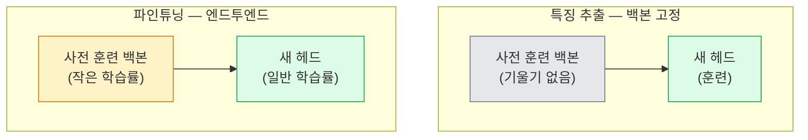

# 전이 학습(Transfer Learning) & 파인튜닝(Fine-Tuning)

> 다른 사람이 네트워크가 엣지(edge), 텍스처(texture), 객체 부분(object parts)을 인식하도록 백만 GPU 시간을 들여 훈련시켰습니다. 당신도 직접 훈련하기 전에 이러한 특징(feature)을 차용해야 합니다.

**유형:** 구축(Build)
**언어:** Python
**사전 요구 사항:** 4단계 03레슨(CNNs), 4단계 04레슨(이미지 분류)
**소요 시간:** ~75분

## 학습 목표

- 특징 추출(feature extraction)과 파인튜닝(fine-tuning)을 구분하고, 데이터셋 크기, 도메인 거리(domain distance), 컴퓨팅 예산(compute budget)에 따라 적절한 방법을 선택
- 사전 훈련된 백본(pretrained backbone)을 로드하고 분류기 헤드(classifier head)를 교체한 후, 20줄 이내의 코드로 헤드만 훈련하여 기본 기준 모델(working baseline) 구축
- 판별적 학습률(discriminative learning rates)을 사용하여 레이어를 점진적으로 언프리즈(unfreeze)할 때, 초기 일반 특징(early generic features)은 후기 작업 특화 특징(late task-specific features)보다 작은 업데이트가 적용되도록 구성
- 세 가지 일반적인 실패 사례 진단: 언프리즈된 블록(unfrozen blocks)의 너무 높은 학습률(LR)로 인한 특징 드리프트(feature drift), 소규모 데이터셋에서 배치 정규화(BN) 통계 붕괴(BN statistics collapse), 그리고 치명적 망각(catastrophic forgetting)

## 문제 정의

ImageNet에서 ResNet-50을 훈련시키는 데는 약 2,000 GPU-시간이 소요됩니다. 대부분의 팀은 모든 작업에 이 예산을 할당할 여유가 없습니다. 실제로 거의 모든 팀이 배포하는 것은 사전 훈련된 백본(backbone)에 새로운 헤드(head)를 추가해 수백 또는 수천 개의 작업별 이미지로 추가 훈련한 모델입니다.

이것은 단순한 단축 방법이 아닙니다. ImageNet으로 훈련된 모든 CNN의 첫 번째 합성곱 블록(conv block)은 에지(edge)와 가보(Gabor) 필터와 유사한 특징을 학습합니다. 다음 몇 블록은 텍스처(texture)와 단순한 모티프(motif)를 학습합니다. 중간 블록들은 객체 부분(object parts)을 학습하며, 마지막 블록들은 1,000개의 ImageNet 범주와 유사한 조합을 학습합니다. 이 계층 구조의 처음 90%는 의료 영상, 산업 검사, 위성 데이터 및 기타 모든 컴퓨터 비전 작업에 거의 변경 없이 전이됩니다. 왜냐하면 자연에는 에지와 텍스처의 제한된 어휘(vocabulary)만 존재하기 때문입니다. 실제로 훈련해야 하는 부분은 마지막 10%입니다.

전이 학습(transfer learning)을 올바르게 수행하는 데는 세 가지 주요 문제가 있습니다: 너무 높은 학습률(learning rate)로 사전 훈련된 특징을 파괴하는 것, 너무 많은 레이어를 고정(freeze)하여 모델에 정보가 부족하게 만드는 것, 그리고 배치 정규화(BatchNorm)의 실행 통계(running statistics)가 네트워크의 나머지 부분이 학습하지 않은 작은 데이터셋으로 표류(drift)하는 것입니다. 이 강의에서는 이러한 문제들을 의도적으로 하나씩 다룹니다.

## 개념

### 특징 추출 vs 파인튜닝

사전 훈련된 특징을 얼마나 신뢰하는지, 그리고 얼마나 많은 데이터를 가지고 있는지에 따라 선택되는 두 가지 방식.



경험적 규칙:

| 데이터셋 크기 | 도메인 거리 | 레시피 |
|--------------|-----------------|--------|
| < 1k 이미지 | ImageNet과 유사 | 백본 고정, 헤드만 훈련 |
| 1k-10k | 유사 | 처음 2-3단계 고정, 나머지 파인튜닝 |
| 10k-100k | 무관 | 판별적 학습률로 엔드투엔드 파인튜닝 |
| 100k+ | 먼 경우 | 전체 파인튜닝; 도메인이 충분히 먼 경우 처음부터 훈련 고려 |

"ImageNet과 유사"는 대략 물체 형태의 자연 RGB 사진을 의미합니다. 의료 CT 스캔, 항공 위성 이미지, 현미경 이미지는 먼 도메인입니다 — 특징은 여전히 도움이 되지만 더 많은 레이어를 적응시켜야 합니다.

### 고정이 작동하는 이유

CNN이 ImageNet에서 학습하는 특징은 1,000개 카테고리에 특화되지 않습니다. 특정 방향의 에지, 질감, 대비 패턴, 형태 원시와 같은 자연 이미지의 통계에 특화되어 있습니다. 이러한 통계는 인간이 명명할 수 있는 거의 모든 시각 도메인에서 안정적입니다. 그래서 ImageNet으로 훈련되고 CIFAR-10에서 제로샷으로 평가된 모델(백본 파인튜닝 없이 새 선형 헤드만 사용)이 80% 이상의 정확도를 달성합니다. 헤드는 이 작업을 위해 이미 학습된 특징 중 어떤 것을 가중치로 사용할지 학습합니다.

### 판별적 학습률

언프리즈할 때 초기 레이어는 후기 레이어보다 느리게 훈련되어야 합니다. 초기 레이어는 보존하려는 일반적인 특징을 인코딩하고, 후기 레이어는 많이 이동해야 하는 작업별 구조를 인코딩합니다.

```
일반적인 레시피:

  stage 0 (스템 + 첫 번째 그룹): lr = base_lr / 100    (대부분 고정)
  stage 1:                       lr = base_lr / 10
  stage 2:                       lr = base_lr / 3
  stage 3 (마지막 백본 그룹): lr = base_lr
  헤드:                          lr = base_lr  (또는 약간 더 높음)
```

PyTorch에서는 옵티마이저에 전달되는 파라미터 그룹 목록일 뿐입니다. 하나의 모델, 다섯 개의 학습률, 추가 코드 없음.

### 배치 정규화 문제

BN 레이어는 ImageNet에서 계산된 `running_mean`과 `running_var` 버퍼를 보유합니다. 작업에 다른 픽셀 분포(조명, 센서, 색 공간 차이)가 있는 경우 이 버퍼는 잘못됩니다. 선호 순서대로 세 가지 옵션:

1. **BN을 훈련 모드로 파인튜닝.** BN이 다른 모든 것과 함께 실행 통계를 업데이트하도록 합니다. 작업 데이터셋이 중간 크기(>= 5k 예시)일 때 기본 선택.
2. **BN을 평가 모드로 고정.** ImageNet 통계를 유지하고 가중치만 훈련합니다. BN의 이동 평균이 노이즈가 될 정도로 데이터셋이 작을 때 정확.
3. **BN을 그룹 정규화로 대체.** 이동 평균 문제를 완전히 제거합니다. GPU당 배치 크기가 작은 검출 및 분할 백본에서 사용.

이를 잘못하면 정확도가 5-15% 침묵적으로 저하됩니다.

### 헤드 설계

분류기 헤드는 1-3개의 선형 레이어와 선택적 드롭아웃으로 구성됩니다. 모든 torchvision 백본은 교체할 기본 헤드를 제공합니다:

```
backbone.fc = nn.Linear(backbone.fc.in_features, num_classes)          # ResNet
backbone.classifier[1] = nn.Linear(..., num_classes)                    # EfficientNet, MobileNet
backbone.heads.head = nn.Linear(..., num_classes)                       # torchvision ViT
```

작은 데이터셋의 경우 단일 선형 레이어로 충분합니다. 작업 분포가 백본 훈련 분포와 더 먼 경우 은닉층(Linear -> ReLU -> Dropout -> Linear) 추가가 도움이 됩니다.

### 레이어별 학습률 감소

현대 파인튜닝(BEiT, DINOv2, ViT-B 파인튜닝)에서 사용되는 판별적 학습률의 부드러운 버전. 레이어를 단계별로 그룹화하는 대신 모든 레이어에 바로 위 레이어보다 약간 작은 학습률을 부여합니다:

```
lr_layer_k = base_lr * decay^(L - k)
```

decay = 0.75 및 L = 12 트랜스포머 블록일 때 첫 번째 블록은 헤드의 학습률 `0.75^11 ≈ 0.04x`로 훈련됩니다. CNN보다 트랜스포머 파인튜닝에 더 중요하며, 일반적으로 단계 그룹 학습률로 충분합니다.

### 평가할 항목

전이 학습 실행에는 처음부터 훈련할 때 추적하지 않는 두 가지 숫자가 필요합니다:

- **사전 훈련만 정확도** — 백본을 고정한 헤드의 정확도. 이는 최저선입니다.
- **파인튜닝 정확도** — 엔드투엔드 훈련 후 동일 모델. 이는 최고선입니다.

파인튜닝이 사전 훈련만보다 낮으면 학습률 또는 BN 버그가 있습니다. 항상 둘 다 출력합니다.

## 빌드하기

### 1단계: 사전 훈련된 백본 로드 및 검사

```python
import torch
import torch.nn as nn
from torchvision.models import resnet18, ResNet18_Weights

backbone = resnet18(weights=ResNet18_Weights.IMAGENET1K_V1)
print(backbone)
print()
print("분류 헤드:", backbone.fc)
print("특성 차원:", backbone.fc.in_features)
```

`ResNet18`은 4개의 스테이지(`layer1..layer4`)와 스템(stem), `fc` 헤드로 구성됩니다. 모든 torchvision 분류 백본은 유사한 구조를 가집니다.

### 2단계: 특성 추출 — 모든 파라미터 동결, 헤드 교체

```python
def make_feature_extractor(num_classes=10):
    model = resnet18(weights=ResNet18_Weights.IMAGENET1K_V1)
    for p in model.parameters():
        p.requires_grad = False
    model.fc = nn.Linear(model.fc.in_features, num_classes)
    return model

model = make_feature_extractor(num_classes=10)
trainable = sum(p.numel() for p in model.parameters() if p.requires_grad)
frozen = sum(p.numel() for p in model.parameters() if not p.requires_grad)
print(f"훈련 가능: {trainable:>10,}")
print(f"동결:    {frozen:>10,}")
```

`model.fc`만 훈련 가능합니다. 백본은 동결된 특성 추출기입니다.

### 3단계: 판별적 파인튜닝

스테이지별 학습률을 적용한 파라미터 그룹을 생성하는 유틸리티입니다.

```python
def discriminative_param_groups(model, base_lr=1e-3, decay=0.3):
    stages = [
        ["conv1", "bn1"],
        ["layer1"],
        ["layer2"],
        ["layer3"],
        ["layer4"],
        ["fc"],
    ]
    groups = []
    for i, names in enumerate(stages):
        lr = base_lr * (decay ** (len(stages) - 1 - i))
        params = [p for n, p in model.named_parameters()
                  if any(n.startswith(k) for k in names)]
        if params:
            groups.append({"params": params, "lr": lr, "name": "_".join(names)})
    return groups

model = resnet18(weights=ResNet18_Weights.IMAGENET1K_V1)
model.fc = nn.Linear(model.fc.in_features, 10)
for p in model.parameters():
    p.requires_grad = True

groups = discriminative_param_groups(model)
for g in groups:
    print(f"{g['name']:>10s}  lr={g['lr']:.2e}  파라미터={sum(p.numel() for p in g['params']):>8,}")
```

`decay=0.3`은 각 스테이지가 다음 스테이지의 30% 학습률로 훈련됨을 의미합니다. `fc`는 `base_lr`, `layer4`는 `0.3 * base_lr`, `conv1`은 `0.3^5 * base_lr ≈ 0.00243 * base_lr`을 받습니다. 극단적으로 들리지만 경험적으로 효과적입니다.

### 4단계: 배치 정규화(BatchNorm) 처리

가중치를 동결하지 않고 BN 실행 통계를 동결하는 헬퍼입니다.

```python
def freeze_bn_stats(model):
    for m in model.modules():
        if isinstance(m, (nn.BatchNorm1d, nn.BatchNorm2d, nn.BatchNorm3d)):
            m.eval()
            for p in m.parameters():
                p.requires_grad = False
    return model
```

매 에폭 시작 시 `model.train()`을 호출한 후 이 함수를 호출하세요. `model.train()`은 모든 레이어를 훈련 모드로 전환하지만, 이 함수는 BN 레이어만 평가 모드로 되돌립니다.

### 5단계: 최소한의 엔드투엔드 파인튜닝 루프

```python
from torch.optim import SGD
from torch.utils.data import DataLoader
from torch.optim.lr_scheduler import CosineAnnealingLR
import torch.nn.functional as F

def fine_tune(model, train_loader, val_loader, device, epochs=5, base_lr=1e-3, freeze_bn=False):
    model = model.to(device)
    groups = discriminative_param_groups(model, base_lr=base_lr)
    optimizer = SGD(groups, momentum=0.9, weight_decay=1e-4, nesterov=True)
    scheduler = CosineAnnealingLR(optimizer, T_max=epochs)

    for epoch in range(epochs):
        model.train()
        if freeze_bn:
            freeze_bn_stats(model)
        tr_loss, tr_correct, tr_total = 0.0, 0, 0
        for x, y in train_loader:
            x, y = x.to(device), y.to(device)
            logits = model(x)
            loss = F.cross_entropy(logits, y, label_smoothing=0.1)
            optimizer.zero_grad()
            loss.backward()
            optimizer.step()
            tr_loss += loss.item() * x.size(0)
            tr_total += x.size(0)
            tr_correct += (logits.argmax(-1) == y).sum().item()
        scheduler.step()

        model.eval()
        va_total, va_correct = 0, 0
        with torch.no_grad():
            for x, y in val_loader:
                x, y = x.to(device), y.to(device)
                pred = model(x).argmax(-1)
                va_total += x.size(0)
                va_correct += (pred == y).sum().item()
        print(f"에폭 {epoch}  훈련 {tr_loss/tr_total:.3f}/{tr_correct/tr_total:.3f}  "
              f"검증 {va_correct/va_total:.3f}")
    return model
```

CIFAR-10에서 위 레시피로 5에폭 파인튜닝하면 `ResNet18-IMAGENET1K_V1`의 제로샷 선형 프로브 정확도(~70%)가 파인튜닝 후 ~93%로 향상됩니다. 헤드만 사용할 경우 백본을 건드리지 않고 86%에서 정체됩니다.

### 6단계: 점진적 동결 해제

마지막부터 시작하여 매 에폭마다 한 스테이지씩 동결을 해제하는 스케줄입니다. 특성 드리프트를 완화하지만 추가 에폭이 필요합니다.

```python
def progressive_unfreeze_schedule(model):
    stages = ["layer4", "layer3", "layer2", "layer1"]
    yielded = set()

    def start():
        for p in model.parameters():
            p.requires_grad = False
        for p in model.fc.parameters():
            p.requires_grad = True

    def unfreeze(epoch):
        if epoch < len(stages):
            name = stages[epoch]
            yielded.add(name)
            for n, p in model.named_parameters():
                if n.startswith(name):
                    p.requires_grad = True
            return name
        return None

    return start, unfreeze
```

첫 에폭 전에 `start()`를 한 번 호출하세요. 매 에폭 시작 시 `unfreeze(epoch)`를 호출하세요. 훈련 가능한 파라미터 집합이 변경될 때마다 옵티마이저를 재생성해야 합니다. 그렇지 않으면 동결된 파라미터의 캐시된 모멘텀이 혼동을 일으킬 수 있습니다.

## 사용 방법

대부분의 실제 작업에서는 `torchvision.models` + 세 줄의 코드로 충분합니다. 라이브러리 기본값이 해결하지 못하는 문제에 직면할 때 위에서 설명한 더 복잡한 기법이 중요해집니다.

```python
from torchvision.models import resnet50, ResNet50_Weights

model = resnet50(weights=ResNet50_Weights.IMAGENET1K_V2)
model.fc = nn.Linear(model.fc.in_features, num_classes)
optimizer = torch.optim.AdamW(model.parameters(), lr=1e-4, weight_decay=1e-4)
```

두 가지 다른 프로덕션급 기본값:

- `timm`은 일관된 API(`timm.create_model("resnet50", pretrained=True, num_classes=10)`)로 약 800개의 사전 학습된 비전 백본을 제공합니다. `torchvision` 라이브러리 외부의 모든 파인튜닝 작업에는 이 도구가 표준입니다.
- 트랜스포머의 경우, `transformers.AutoModelForImageClassification.from_pretrained(name, num_labels=N)`은 ViT / BEiT / DeiT를 텍스트 모델과 동일한 로딩 시맨틱으로 제공합니다.

## Ship It

이 레슨은 다음을 생성합니다:

- `outputs/prompt-fine-tune-planner.md` — 데이터셋 크기, 도메인 거리, 컴퓨팅 예산을 기준으로 특징 추출(feature-extraction) vs 점진적(progressive) vs 종단간(end-to-end) 파인튜닝(fine-tuning) 전략을 선택하는 프롬프트.
- `outputs/skill-freeze-inspector.md` — PyTorch 모델을 입력으로 받아 어떤 파라미터가 학습 가능한지, 어떤 BatchNorm 레이어가 평가 모드(eval mode)에 있는지, 그리고 옵티마이저가 실제로 학습 가능한 파라미터를 전달받고 있는지 보고하는 스킬(skill).

## 연습 문제

1. **(쉬움)** `ResNet18`을 선형 프로브(백본 고정)와 전체 파인튜닝으로 동일한 합성-CIFAR 데이터셋에서 학습시켜 보세요. 두 정확도를 나란히 보고하세요. 어떤 격차가 특징들이 잘 전이됨을 알려주는지, 그리고 어떤 격차가 그렇지 않음을 알려주는지 설명하세요.

2. **(중간)** 의도적으로 버그를 도입하세요: 헤드 대신 백본 단계에서 `base_lr = 1e-1`을 설정하세요. 훈련 손실이 발산하는 것을 확인한 후, `discriminative_param_groups` 헬퍼 함수를 적용하여 복구하세요. 각 단계에서 발산이 시작되는 학습률(LR)을 기록하세요.

3. **(어려움)** 의료 영상 데이터셋(예: CheXpert-small, PatchCamelyon, HAM10000)을 사용하여 다음 세 가지 방식을 비교하세요: (a) ImageNet-사전 학습된 고정 백본 + 선형 헤드; (b) ImageNet-사전 학습된 엔드투엔드 파인튜닝; (c) 스크래치 학습. 각 방식의 정확도와 계산 비용을 보고하세요. 어떤 데이터셋 크기에서 스크래치 학습이 경쟁력을 갖게 되는지 분석하세요.

## 주요 용어

| 용어 | 사람들이 하는 말 | 실제 의미 |
|------|----------------|----------------------|
| 특징 추출(Feature extraction) | "Freeze and train head" | 백본(backbone) 파라미터는 고정, 새로운 분류기 헤드만 기울기(gradient) 수신 |
| 파인튜닝(Fine-tuning) | "Retrain end-to-end" | 모든 파라미터 학습 가능, 일반적으로 처음부터 학습(scratch training)보다 훨씬 작은 학습률(learning rate) 사용 |
| 판별적 학습률(Discriminative LR) | "Smaller LR for early layers" | 옵티마이저 파라미터 그룹화, 초기 단계 학습률이 후기 단계 학습률의 일부분인 방식 |
| 레이어별 학습률 감소(Layer-wise LR decay) | "Smooth LR gradient" | 레이어별 학습률 × 감소율^(L - k); 트랜스포머 파인튜닝에서 흔히 사용 |
| 치명적 망각(Catastrophic forgetting) | "The model lost ImageNet" | 너무 높은 학습률이 새로운 작업 신호를 학습하기 전에 사전 학습된 특징을 덮어씀 |
| BN 통계 드리프트(BN statistics drift) | "Running mean is wrong" | 배치 정규화(BatchNorm)의 running_mean/var가 현재 작업과 다른 분포에서 계산되어 정확도가 소리 없이 저하됨 |
| 선형 프로브(Linear probe) | "Frozen backbone + linear head" | 사전 학습된 특징 평가 — 고정된 표현(frozen representation) 위에 최적의 선형 분류기 정확도 |
| 치명적 붕괴(Catastrophic collapse) | "Everything predicts one class" | 헤드(head)의 기울기가 안정화되기 전에 특징을 파괴할 정도로 높은 학습률로 파인튜닝할 때 발생 |

## 추가 자료

- [심층 신경망에서 특징의 전이 가능성 (Yosinski et al., 2014)](https://arxiv.org/abs/1411.1792) — 계층 간 특징 전이 가능성을 정량화한 논문
- [범용 언어 모델 파인튜닝 (ULMFiT, Howard & Ruder, 2018)](https://arxiv.org/abs/1801.06146) — 판별적 학습률/점진적 언프리징 레시피의 원본; 이 아이디어는 컴퓨터 비전으로 직접 전이 가능
- [timm 문서](https://huggingface.co/docs/timm) — 현대 시각 백본 및 해당 모델이 훈련된 정확한 파인튜닝 기본값 참조
- [선형 프로브 평가를 위한 간단한 프레임워크 (Kornblith et al., 2019)](https://arxiv.org/abs/1805.08974) — 선형 프로브 정확도가 중요한 이유와 올바른 보고 방법