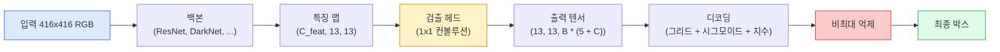

# 객체 감지 — 처음부터 시작하는 YOLO

> 감지는 분류(classification)에 회귀(regression)를 더한 것으로, 특징 맵(feature map)의 모든 위치에서 실행된 후 비최대 억제(non-maximum suppression)로 정리됩니다.

**유형:** 구축(Build)
**언어:** Python
**선수 지식:** 4단계 3강(CNNs), 4단계 4강(이미지 분류), 4단계 5강(전이 학습)
**소요 시간:** ~75분

## 학습 목표

- 탐지를 밀집 예측 문제로 변환하는 **그리드-앵커(grid-and-anchor) 설계**를 설명하고, 출력 텐서의 모든 숫자가 의미하는 바를 기술할 수 있다
- 박스 간 **교집합-합집합 비율(Intersection-over-Union, IoU)** 을 계산하고, **비최대 억제(non-maximum suppression, NMS)** 를 처음부터 구현할 수 있다
- 사전 훈련된 백본(backbone) 위에 **YOLO 스타일 헤드**를 구축하며, 분류(classification), 객체성(objectness), 박스 회귀(box-regression) 손실 함수를 포함할 수 있다
- 탐지 메트릭 행(precision@0.5, recall, mAP@0.5, mAP@0.5:0.95)을 읽고, 다음에 조정할 하이퍼파라미터(knob)를 선택할 수 있다

## 문제 정의

분류(classification)는 "이 이미지는 개입니다"라고 말합니다. 검출(detection)은 "픽셀 (112, 40, 280, 210)에 개가 있고, (400, 180, 560, 310)에 고양이가 있으며, 프레임 내 다른 객체는 없습니다"라고 말합니다. 이미지당 하나의 레이블 대신 가변 개수의 레이블된 박스를 예측한다는 이 구조적 변화가 모든 자율 시스템, 모든 감시 제품, 모든 문서 레이아웃 파서, 모든 공장 비전 라인의 핵심 기반입니다.

검출은 또한 비전 분야의 모든 엔지니어링 트레이드오프가 한 번에 나타나는 영역입니다. 정확한 박스(회귀 헤드(regression head)), 각 박스에 대한 올바른 클래스(분류 헤드(classification head)), 검출할 객체가 없을 때를 아는 것(객체성 점수(objectness score)), 실제 객체당 정확히 하나의 예측(비최대 억제(non-maximum suppression))이 필요합니다. 이 중 하나라도 실패하면 파이프라인은 객체를 놓치거나, 환각 박스를 보고하거나, 같은 객체를 약간 다른 위치에 15번 예측하는 등의 문제가 발생합니다.

YOLO(You Only Look Once, Redmon et al. 2016)는 단일 컨볼루션 네트워크(conv net) 순방향 전달로 이 모든 작업을 실시간으로 수행하는 설계였으며, 동일한 구조적 결정이 현대 검출기(YOLOv8, YOLOv9, YOLO-NAS, RT-DETR)의 백본으로 여전히 사용되고 있습니다. 핵심 원리를 배우면 모든 변형 모델이 동일한 구성 요소의 재배열임을 알 수 있습니다.

## 개념

### 밀집 예측으로서의 검출

분류기는 이미지당 C개의 숫자를 출력합니다. YOLO 스타일 검출기는 이미지당 `(S x S x (5 + C))`개의 숫자를 출력하며, 여기서 S는 공간 그리드 크기입니다.



`S * S` 그리드 셀 각각은 `B`개의 박스를 예측합니다. 각 박스에 대해:

- 4개의 숫자는 기하학적 정보를 설명합니다: `tx, ty, tw, th`.
- 1개의 숫자는 객체성 점수입니다: "이 셀에 중심이 있는 객체가 있는가?"
- C개의 숫자는 클래스 확률입니다.

셀당 총합: `B * (5 + C)`. `S=13, B=2, C=20`인 VOC의 경우 셀당 50개의 숫자입니다.

### 그리드와 앵커 사용 이유

순수 회귀는 모든 객체에 대해 `(x, y, w, h)`를 절대 좌표로 예측합니다. 이는 컨볼루션 네트워크에 어려운 작업입니다. 이미지를 평행 이동하면 모든 예측도 같은 양만큼 이동해야 하지만, 각 객체는 공간적으로 고정되어 있습니다. 그리드는 이 문제를 해결하기 위해 각 실제 박스를 그 중심이 속한 그리드 셀에 할당하고, 해당 셀만 그 객체를 담당하도록 합니다.

앵커는 두 번째 문제를 해결합니다. 3x3 컨볼루션은 16픽셀 수용 영역의 특징 셀에서 500픽셀 너비의 박스를 쉽게 회귀할 수 없습니다. 대신, 셀당 `B`개의 사전 정의된 박스 모양(앵커)을 사용하고 각 앵커에서 작은 델타 값을 예측합니다. 모델은 아무것도 없는 상태에서 회귀하는 대신 적절한 앵커를 선택하고 미세 조정하는 방법을 학습합니다.

```
앵커 박스 사전 정의 (416x416 입력 예시):

  소형:   (30,  60)
  중형:  (75,  170)
  대형:   (200, 380)

각 그리드 셀에서 모든 앵커는 (tx, ty, tw, th, obj, c_1, ..., c_C)를 출력합니다.
```

현대 검출기는 종종 FPN을 사용하며 해상도별로 다른 앵커 세트를 가집니다. 얕은 고해상도 맵에는 소형 앵커, 깊은 저해상도 맵에는 대형 앵커를 사용합니다. 같은 아이디어지만 더 많은 스케일을 지원합니다.

### 예측 디코딩

원시 `tx, ty, tw, th`는 박스 좌표가 아닙니다. 플롯하기 전에 변환해야 하는 회귀 대상입니다:

```
중심 x  = (시그모이드(tx) + 셀_x) * 스트라이드
중심 y  = (시그모이드(ty) + 셀_y) * 스트라이드
너비     = 앵커_w * exp(tw)
높이     = 앵커_h * exp(th)
```

`시그모이드`는 중심 오프셋을 셀 내부로 유지합니다. `exp`는 부호 반전 없이 앵커에서 자유롭게 너비를 조정할 수 있게 합니다. `스트라이드`는 그리드 좌표를 픽셀로 다시 스케일링합니다. 이 디코딩 단계는 YOLO v2 이후 모든 버전에서 동일합니다.

### IoU

두 박스 간의 검출 보편적 유사도 측정:

```
IoU(A, B) = area(A ∩ B) / area(A ∪ B)
```

IoU = 1은 완전히 일치함을 의미하고, IoU = 0은 겹치지 않음을 의미합니다. 예측과 실제 박스 간의 IoU는 예측이 참 양성으로 간주되는지 여부를 결정합니다(일반적으로 IoU >= 0.5). 두 예측 간의 IoU는 NMS가 중복을 제거하는 데 사용합니다.

### 비최대 억제

인접한 앵커로 학습된 컨볼루션 네트워크는 종종 같은 객체에 대해 겹치는 박스를 예측합니다. NMS는 가장 높은 신뢰도의 예측을 유지하고 임계값 이상의 IoU를 가진 다른 예측을 삭제합니다.

```
NMS(박스, 점수, iou_임계값):
    점수를 기준으로 박스를 내림차순 정렬
    keep = []
    박스가 빌 때까지 반복:
        가장 높은 점수의 박스를 선택하고 keep에 추가
        선택된 박스와 IoU > iou_임계값인 모든 박스 제거
    keep 반환
```

일반적인 임계값: 객체 검출의 경우 0.45. 최근 검출기는 표준 NMS를 `soft-NMS`, `DIoU-NMS`로 대체하거나 억제를 직접 학습합니다(RT-DETR). 그러나 구조적 목적은 동일합니다.

### 손실 함수

YOLO 손실 함수는 가중치가 적용된 세 가지 손실의 합입니다:

```
L = lambda_coord * L_box(예측, 타겟, where obj=1)
  + lambda_obj   * L_obj(예측, 1,     where obj=1)
  + lambda_noobj * L_obj(예측, 0,     where obj=0)
  + lambda_cls   * L_cls(예측, 타겟, where obj=1)
```

객체를 포함하는 셀만 박스 회귀 및 분류 손실에 기여합니다. 객체가 없는 셀은 객체성 손실에만 기여합니다(모델이 침묵하도록 학습). `lambda_noobj`는 일반적으로 작습니다(~0.5). 대부분의 셀이 비어 있어 그렇지 않으면 전체 손실을 지배할 수 있기 때문입니다.

현대 변형들은 MSE 박스 손실을 CIoU/DIoU로 교체하고(IoU를 직접 최적화), 클래스 불균형에 포컬 손실을 사용하며, 품질 포컬 손실로 객체성을 균형 있게 조정합니다. 세 가지 구성 요소 구조는 변경되지 않았습니다.

### 검출 지표

정확도는 검출에 적용되지 않습니다. 다음 네 가지 숫자가 적용됩니다:

- **IoU=0.5에서의 정밀도** — 양성으로 간주된 예측 중 실제로 정확한 비율.
- **IoU=0.5에서의 재현율** — 실제 객체 중 검출된 비율.
- **AP@0.5** — IoU 임계값 0.5에서의 정밀도-재현율 곡선 면적. 클래스당 하나의 숫자.
- **mAP@0.5:0.95** — IoU 임계값 0.5, 0.55, ..., 0.95에서의 AP 평균. COCO 지표. 가장 엄격하고 정보량이 많음.

네 가지 모두를 보고하세요. mAP@0.5에서 강하지만 mAP@0.5:0.95에서 약한 검출기는 대략적으로는 잘 지역화하지만 정확하지는 않습니다. 더 나은 박스 회귀 손실 함수로 수정하세요. 높은 정밀도와 낮은 재현율을 가진 검출기는 너무 보수적입니다. 신뢰도 임계값을 낮추거나 객체성 가중치를 높이세요.

## 구축

### 단계 1: IoU

전체 수업의 핵심 작업. `(x1, y1, x2, y2)` 형식의 두 박스 배열에서 작동합니다.

```python
import numpy as np

def box_iou(boxes_a, boxes_b):
    ax1, ay1, ax2, ay2 = boxes_a[:, 0], boxes_a[:, 1], boxes_a[:, 2], boxes_a[:, 3]
    bx1, by1, bx2, by2 = boxes_b[:, 0], boxes_b[:, 1], boxes_b[:, 2], boxes_b[:, 3]

    inter_x1 = np.maximum(ax1[:, None], bx1[None, :])
    inter_y1 = np.maximum(ay1[:, None], by1[None, :])
    inter_x2 = np.minimum(ax2[:, None], bx2[None, :])
    inter_y2 = np.minimum(ay2[:, None], by2[None, :])

    inter_w = np.clip(inter_x2 - inter_x1, 0, None)
    inter_h = np.clip(inter_y2 - inter_y1, 0, None)
    inter = inter_w * inter_h

    area_a = (ax2 - ax1) * (ay2 - ay1)
    area_b = (bx2 - bx1) * (by2 - by1)
    union = area_a[:, None] + area_b[None, :] - inter
    return inter / np.clip(union, 1e-8, None)
```

`(N_a, N_b)` 행렬 형태의 쌍별 IoU를 반환합니다. 배열 중 하나의 형태를 `(1, 4)`로 만들어 단일 그라운드 트루스 박스와 비교에 사용할 수 있습니다.

### 단계 2: 비최대 억제(Non-max suppression)

```python
def nms(boxes, scores, iou_threshold=0.45):
    order = np.argsort(-scores)
    keep = []
    while len(order) > 0:
        i = order[0]
        keep.append(i)
        if len(order) == 1:
            break
        rest = order[1:]
        ious = box_iou(boxes[[i]], boxes[rest])[0]
        order = rest[ious <= iou_threshold]
    return np.array(keep, dtype=np.int64)
```

결정론적(deterministic)이며, 정렬로 인해 `O(N log N)` 복잡도를 가지며, 동일한 입력에 대해 `torchvision.ops.nms`와 동일한 동작을 합니다.

### 단계 3: 박스 인코딩 및 디코딩

픽셀 좌표와 네트워크가 실제로 회귀하는 `(tx, ty, tw, th)` 타겟 간 변환.

```python
def encode(box_xyxy, cell_x, cell_y, stride, anchor_wh):
    x1, y1, x2, y2 = box_xyxy
    cx = 0.5 * (x1 + x2)
    cy = 0.5 * (y1 + y2)
    w = x2 - x1
    h = y2 - y1
    tx = cx / stride - cell_x
    ty = cy / stride - cell_y
    tw = np.log(w / anchor_wh[0] + 1e-8)
    th = np.log(h / anchor_wh[1] + 1e-8)
    return np.array([tx, ty, tw, th])


def decode(tx_ty_tw_th, cell_x, cell_y, stride, anchor_wh):
    tx, ty, tw, th = tx_ty_tw_th
    cx = (sigmoid(tx) + cell_x) * stride
    cy = (sigmoid(ty) + cell_y) * stride
    w = anchor_wh[0] * np.exp(tw)
    h = anchor_wh[1] * np.exp(th)
    return np.array([cx - w / 2, cy - h / 2, cx + w / 2, cy + h / 2])


def sigmoid(x):
    return 1.0 / (1.0 + np.exp(-x))
```

테스트: 박스를 인코딩한 후 디코딩하면 원래 박스와 매우 유사한 결과를 얻을 수 있습니다(`tx`가 시그모이드 후 범위에 있지 않을 때 시그모이드 역함수가 완벽하게 역변환되지 않는 경우를 제외).

### 단계 4: 최소한의 YOLO 헤드

특성 맵에 1x1 컨볼루션을 적용하고, `(B, S, S, num_anchors, 5 + C)` 형태로 재구성.

```python
import torch
import torch.nn as nn

class YOLOHead(nn.Module):
    def __init__(self, in_c, num_anchors, num_classes):
        super().__init__()
        self.num_anchors = num_anchors
        self.num_classes = num_classes
        self.conv = nn.Conv2d(in_c, num_anchors * (5 + num_classes), kernel_size=1)

    def forward(self, x):
        n, _, h, w = x.shape
        y = self.conv(x)
        y = y.view(n, self.num_anchors, 5 + self.num_classes, h, w)
        y = y.permute(0, 3, 4, 1, 2).contiguous()
        return y
```

출력 형태: `(N, H, W, num_anchors, 5 + C)`. 마지막 차원은 `[tx, ty, tw, th, obj, cls_0, ..., cls_{C-1}]`을 포함합니다.

### 단계 5: 그라운드 트루스 할당

모든 그라운드 트루스 박스에 대해 어떤 `(셀, 앵커)`가 담당할지 결정.

```python
def assign_targets(boxes_xyxy, classes, anchors, stride, grid_size, num_classes):
    num_anchors = len(anchors)
    target = np.zeros((grid_size, grid_size, num_anchors, 5 + num_classes), dtype=np.float32)
    has_obj = np.zeros((grid_size, grid_size, num_anchors), dtype=bool)

    for box, cls in zip(boxes_xyxy, classes):
        x1, y1, x2, y2 = box
        cx, cy = 0.5 * (x1 + x2), 0.5 * (y1 + y2)
        gx, gy = int(cx / stride), int(cy / stride)
        bw, bh = x2 - x1, y2 - y1

        ious = np.array([
            (min(bw, aw) * min(bh, ah)) / (bw * bh + aw * ah - min(bw, aw) * min(bh, ah))
            for aw, ah in anchors
        ])
        best = int(np.argmax(ious))
        aw, ah = anchors[best]

        target[gy, gx, best, 0] = cx / stride - gx
        target[gy, gx, best, 1] = cy / stride - gy
        target[gy, gx, best, 2] = np.log(bw / aw + 1e-8)
        target[gy, gx, best, 3] = np.log(bh / ah + 1e-8)
        target[gy, gx, best, 4] = 1.0
        target[gy, gx, best, 5 + cls] = 1.0
        has_obj[gy, gx, best] = True
    return target, has_obj
```

앵커 선택은 "그라운드 트루스와의 최적 모양 IoU"로, YOLOv2/v3 할당과 일치하는 저렴한 프록시입니다. v5 이상에서는 더 정교한 전략(태스크 정렬 매칭, 동적 k)을 사용하여 동일한 아이디어를 개선합니다.

### 단계 6: 세 가지 손실

```python
def yolo_loss(pred, target, has_obj, lambda_coord=5.0, lambda_obj=1.0, lambda_noobj=0.5, lambda_cls=1.0):
    has_obj_t = torch.from_numpy(has_obj).bool()
    target_t = torch.from_numpy(target).float()

    # 박스 회귀 손실: 객체가 있는 셀에서만
    box_pred = pred[..., :4][has_obj_t]
    box_true = target_t[..., :4][has_obj_t]
    loss_box = torch.nn.functional.mse_loss(box_pred, box_true, reduction="sum")

    # 객체성 손실
    obj_pred = pred[..., 4]
    obj_true = target_t[..., 4]
    loss_obj_pos = torch.nn.functional.binary_cross_entropy_with_logits(
        obj_pred[has_obj_t], obj_true[has_obj_t], reduction="sum")
    loss_obj_neg = torch.nn.functional.binary_cross_entropy_with_logits(
        obj_pred[~has_obj_t], obj_true[~has_obj_t], reduction="sum")

    # 객체가 있는 셀에서의 분류 손실
    cls_pred = pred[..., 5:][has_obj_t]
    cls_true = target_t[..., 5:][has_obj_t]
    loss_cls = torch.nn.functional.binary_cross_entropy_with_logits(
        cls_pred, cls_true, reduction="sum")

    total = (lambda_coord * loss_box
             + lambda_obj * loss_obj_pos
             + lambda_noobj * loss_obj_neg
             + lambda_cls * loss_cls)
    return total, {"box": loss_box.item(), "obj_pos": loss_obj_pos.item(),
                   "obj_neg": loss_obj_neg.item(), "cls": loss_cls.item()}
```

모든 YOLO 튜토리얼에서 하드코딩하거나 스윕하는 5개의 하이퍼파라미터. 비율이 중요: `lambda_coord=5, lambda_noobj=0.5`는 원래 YOLOv1 논문을 반영하며 여전히 합리적인 기본값으로 작동합니다.

### 단계 7: 추론 파이프라인

원시 헤드 출력을 디코딩하고, 시그모이드/지수 적용, 객체성 임계값 적용, NMS 수행.

```python
def postprocess(pred_tensor, anchors, stride, img_size, conf_threshold=0.25, iou_threshold=0.45):
    pred = pred_tensor.detach().cpu().numpy()
    grid_h, grid_w = pred.shape[1], pred.shape[2]
    num_anchors = len(anchors)

    boxes, scores, classes = [], [], []
    for gy in range(grid_h):
        for gx in range(grid_w):
            for a in range(num_anchors):
                tx, ty, tw, th, obj, *cls = pred[0, gy, gx, a]
                score = sigmoid(obj) * sigmoid(np.array(cls)).max()
                if score < conf_threshold:
                    continue
                cls_idx = int(np.argmax(cls))
                cx = (sigmoid(tx) + gx) * stride
                cy = (sigmoid(ty) + gy) * stride
                w = anchors[a][0] * np.exp(tw)
                h = anchors[a][1] * np.exp(th)
                boxes.append([cx - w / 2, cy - h / 2, cx + w / 2, cy + h / 2])
                scores.append(float(score))
                classes.append(cls_idx)

    if not boxes:
        return np.zeros((0, 4)), np.zeros((0,)), np.zeros((0,), dtype=int)
    boxes = np.array(boxes)
    scores = np.array(scores)
    classes = np.array(classes)
    keep = nms(boxes, scores, iou_threshold)
    return boxes[keep], scores[keep], classes[keep]
```

이것이 완전한 평가 경로입니다: 헤드 -> 디코딩 -> 임계값 적용 -> NMS.

## 사용 방법

`torchvision.models.detection`은 동일한 개념적 구조를 가진 프로덕션용 검출기를 제공합니다. 사전 훈련된 모델을 로드하는 데는 세 줄의 코드만 필요합니다.

```python
import torch
from torchvision.models.detection import fasterrcnn_resnet50_fpn_v2

model = fasterrcnn_resnet50_fpn_v2(weights="DEFAULT")
model.eval()
with torch.no_grad():
    predictions = model([torch.randn(3, 400, 600)])
print(predictions[0].keys())
print(f"boxes:  {predictions[0]['boxes'].shape}")
print(f"scores: {predictions[0]['scores'].shape}")
print(f"labels: {predictions[0]['labels'].shape}")
```

실시간 추론 파이프라인의 경우 `ultralytics`(YOLOv8/v9)가 표준입니다: `from ultralytics import YOLO; model = YOLO('yolov8n.pt'); model(img)`. 이 모델은 디코딩과 NMS(비최대 억제)를 내부적으로 처리하며, 위에서 구성한 것과 동일한 `boxes / scores / labels` 트리플을 반환합니다.

## Ship It

이 레슨은 다음을 생성합니다:

- `outputs/prompt-detection-metric-reader.md` — `precision, recall, AP, mAP@0.5:0.95` 행을 한 줄 진단과 가장 유용한 다음 실험으로 변환하는 프롬프트.
- `outputs/skill-anchor-designer.md` — 실제 바운딩 박스 데이터셋을 입력으로 받아 `(w, h)`에 대해 k-평균을 실행하고 FPN 레벨별 앵커 세트 및 적절한 앵커 개수를 선택하는 데 필요한 커버리지 통계를 반환하는 스킬.

## 연습 문제

1. **(쉬움)** `box_iou`를 구현하고 1,000개의 무작위 박스 쌍에 대해 `torchvision.ops.box_iou`와 비교 실행. 최대 절대 차이가 `1e-6` 미만인지 확인.
2. **(중간)** `yolo_loss`를 MSE 대신 `CIoU` 박스 손실을 사용하는 버전으로 포팅. 100개 이미지 합성 데이터셋에서 CIoU가 동일한 에포크 수에서 MSE보다 더 나은 최종 mAP@0.5:0.95로 수렴함을 보여줌.
3. **(어려움)** 멀티스케일 추론 구현: 동일한 이미지를 3가지 해상도로 모델에 입력, 박스 예측 결과를 합집합한 후 단일 NMS 실행. 홀드아웃 세트에서 단일 스케일 추론 대비 mAP 향상도 측정.

## 주요 용어

| 용어 | 사람들이 말하는 표현 | 실제 의미 |
|------|----------------|----------------------|
| 앵커(Anchor) | "박스 사전(Box prior)" | 네트워크가 절대 좌표 대신 델타(delta)를 예측하는 각 그리드 셀의 미리 정의된 박스 형태 |
| IoU(Intersection over Union) | "중첩(Overlap)" | 두 박스의 교차 영역 대 합집합 영역 비율; 탐지에서 사용되는 보편적인 유사도 측정 기준 |
| NMS(Non-Maximum Suppression) | "중복 제거(Deduplicate)" | 가장 높은 점수의 예측을 유지하고 임계값 이상의 중첩 예측을 제거하는 탐욕 알고리즘 |
| 오브젝트니스(Objectness) | "여기에 뭔가 있나요" | 해당 셀에 객체가 중심에 위치하는지 예측하는 앵커별, 셀별 스칼라 값 |
| 그리드 스트라이드(Grid stride) | "다운샘플링 계수(Downsample factor)" | 그리드 셀당 픽셀 수; 416px 입력에 13-그리드 헤드가 있는 경우 스트라이드는 32 |
| mAP(Mean Average Precision) | "평균 평균 정밀도" | 정밀도-재현율 곡선 아래 영역의 평균값, 클래스 및 (COCO의 경우) IoU 임계값들에 대해 평균화 |
| AP@0.5 | "PASCAL VOC AP" | IoU 임계값 0.5에서의 평균 정밀도; 관대한 버전의 평가 지표 |
| mAP@0.5:0.95 | "COCO AP" | 0.5부터 0.95까지 0.05 단계로 IoU 임계값을 평균화한 값; 엄격한 버전이자 현재 커뮤니티 표준 |

## 추가 자료

- [YOLOv1: You Only Look Once (Redmon et al., 2016)](https://arxiv.org/abs/1506.02640) — YOLO 시리즈의 기반 논문; 이후 모든 YOLO 모델은 이 구조를 개선한 버전
- [YOLOv3 (Redmon & Farhadi, 2018)](https://arxiv.org/abs/1804.02767) — 멀티스케일 FPN 스타일 헤드를 도입한 논문; 여전히 가장 명확한 다이어그램 제공
- [Ultralytics YOLOv8 문서](https://docs.ultralytics.com) — 현재 프로덕션 레퍼런스; 데이터셋 형식, 증강 기법, 학습 레시피 포함
- [객체 감지 그림 설명 가이드 (Jonathan Hui)](https://jonathan-hui.medium.com/object-detection-series-24d03a12f904) — 전체 검출기 종류(zoo)에 대한 최고의 평이한 설명; DETR, RetinaNet, FCOS, YOLO 간 관계 이해에 귀중한 자료