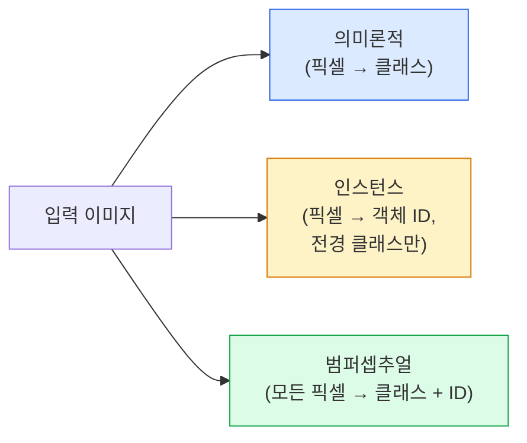
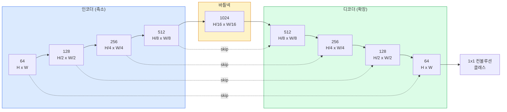

# 시맨틱 분할 — U-Net

> 분할은 모든 픽셀에 대한 분류입니다. U-Net은 다운샘플링 인코더와 업샘플링 디코더를 쌍으로 구성하고, 이들 사이에 스킵 연결(skip connection)을 추가하여 이를 가능하게 합니다.

**유형:** 구축(Build)
**언어:** Python
**사전 요구 사항:** 4단계 03강(CNNs), 4단계 04강(이미지 분류)
**소요 시간:** ~75분

## 학습 목표

- 시맨틱(semantic), 인스턴스(instance), 팬옵틱(panoptic) 분할을 구분하고 주어진 문제에 적합한 작업을 선택
- 인코더 블록, 병목(bottleneck), 전치 합성곱(transposed convolution)을 포함한 디코더, 스킵 연결(skip connection)로 구성된 U-Net을 PyTorch에서 처음부터 구축
- 픽셀 단위 교차 엔트로피(pixel-wise cross-entropy), Dice 손실(Dice loss), 의료 및 산업용 분할의 현재 기본값인 결합 손실 구현
- 클래스별 IoU(Intersection over Union) 및 Dice 메트릭을 읽고, 낮은 점수가 작은 객체 재현율, 경계 정확도, 클래스 불균형 중 어디에서 발생하는지 진단

## 문제 정의

분류는 이미지당 하나의 레이블을 출력하고, 탐지는 이미지당 소수의 박스를 출력합니다. 분할은 픽셀당 하나의 레이블을 출력합니다. `H x W` 크기의 입력에 대해 출력은 `H x W` (시맨틱) 또는 `H x W x N_instances` (인스턴스) 형태의 텐서입니다. 즉, 이미지당 수백만 개의 예측이 생성됩니다.

분할의 구조는 거의 모든 밀집 예측 비전 제품을 구동하는 이유입니다: 의료 영상(종양 마스크), 자율주행(도로, 차선, 장애물), 위성(건물 경계, 작물 영역), 문서 파싱(레이아웃 영역), 로봇공학(파악 가능 영역). 이러한 작업들은 객체에 박스를 그리는 것만으로는 해결할 수 없으며, 정확한 실루엣이 필요합니다.

아키텍처적 문제는 간단히 설명할 수 있지만 해결은 쉽지 않습니다: 네트워크가 이미지의 전역 컨텍스트(이 장면이 어떤 종류인지)와 로컬 픽셀 디테일(정확히 어떤 픽셀이 도로인지 보도인지)을 동시에 인식해야 합니다. 표준 CNN은 컨텍스트를 얻기 위해 공간적으로 압축하는데, 이 과정에서 디테일이 손실됩니다. U-Net은 이 두 가지를 모두 달성한 설계입니다.

## 개념

### 의미론적 vs 인스턴스 vs 범퍼셉추얼



- **의미론적**은 "이 픽셀은 도로, 저 픽셀은 자동차"라고 말합니다. 옆에 있는 두 자동차는 하나의 덩어리로 합쳐집니다.
- **인스턴스**는 "이 픽셀은 자동차 #3, 저 픽셀은 자동차 #5"라고 말합니다. 배경 요소("stuff" = 하늘, 도로, 풀)는 무시합니다.
- **범퍼셉추얼**은 두 가지를 통합합니다: 모든 픽셀은 클래스 레이블을, 모든 인스턴스는 고유 ID를 가지며, "stuff"와 "things" 모두 분할됩니다.

이 레슨은 의미론적 분할을 다룹니다. 다음 레슨(Mask R-CNN)에서는 인스턴스 분할을 다룹니다.

### U-Net 구조



인코더는 공간 해상도를 4번 절반으로 줄이고 채널 수를 2배씩 늘립니다. 디코더는 반대로 공간 해상도를 4번 2배로 늘리고 채널 수를 절반으로 줄입니다. 스킵 연결은 모든 해상도에서 인코더 특징과 디코더 특징을 연결(concatenate)합니다. 마지막 1x1 컨볼루션은 `64 → num_classes`로 전체 해상도에서 클래스 수를 매핑합니다.

**스킵 연결이 필요한 이유**: 디코더는 픽셀 수준 예측을 시도할 때 이미 작은 특징 맵만 보았습니다. 스킵 연결 없이는 인코더에서 압축된 정보로 인해 정확한 에지 위치 파악이 불가능합니다. 스킵 연결은 인코더가 하강 과정에서 계산한 고해상도 특징 맵을 전달합니다.

### 전치 컨볼루션 vs 양선형 업샘플링

디코더는 공간 차원을 확장해야 합니다. 두 가지 옵션:

- **전치 컨볼루션** (`nn.ConvTranspose2d`) — 학습 가능한 업샘플링. 역사적 U-Net 기본값. 스트라이드와 커널 크기가 균등하게 나누지 않으면 체커보드 아티팩트가 발생할 수 있습니다.
- **양선형 업샘플링 + 3x3 컨볼루션** — 부드러운 업샘플링 후 컨볼루션. 아티팩트가 적고 파라미터가 적어 현재 현대식 기본값입니다.

둘 다 실제로 사용됩니다. 첫 U-Net에는 양선형이 더 안전합니다.

### 픽셀 그리드에서의 교차 엔트로피

C개 클래스를 가진 의미론적 분할에서 모델 출력은 `(N, C, H, W)`입니다. 타겟은 `(N, H, W)`의 정수 클래스 ID입니다. 교차 엔트로피는 분류 사례와 동일하지만 모든 공간 위치에서 적용됩니다:

```
손실 = (n, h, w)에 대한 평균 -log( softmax(logits[n, :, h, w])[target[n, h, w]] )
```

PyTorch의 `F.cross_entropy`는 이 형태를 네이티브로 처리합니다. 리쉐이프가 필요 없습니다.

### Dice 손실과 필요성

교차 엔트로피는 모든 픽셀을 동등하게 취급합니다. 한 클래스가 프레임을 지배할 때(예: 의료 영상: 99% 배경, 1% 종양) 이는 잘못되었습니다. 네트워크는 배경만 예측해도 99% 정확도를 얻을 수 있지만 쓸모없습니다.

Dice 손실은 예측 마스크와 실제 마스크의 중첩을 직접 최적화하여 이를 해결합니다:

```
Dice(p, y) = 2 * sum(p * y) / (sum(p) + sum(y) + epsilon)
Dice_loss = 1 - Dice
```

여기서 `p`는 클래스에 대한 시그모이드/소프트맥스 확률 맵이고 `y`는 이진 정답 마스크입니다. 손실은 중첩이 완벽할 때만 0입니다. 비율 기반이므로 클래스 불균형은 무관합니다.

실제로는 **결합 손실**을 사용합니다:

```
L = L_cross_entropy + lambda * L_dice       (lambda ~ 1)
```

교차 엔트로피는 훈련 초기에 안정적인 그래디언트를 제공하고, Dice는 훈련 후반에 마스크 형태 일치에 집중합니다. 이 조합은 클래스 불균형이 있는 데이터셋에서 의료 영상 분야의 기본값이며 따라오기 어렵습니다.

### 평가 지표

- **픽셀 정확도** — 올바르게 예측된 픽셀 비율. 저렴하지만 불균형 데이터에서는 분류의 정확도와 같은 이유로 고장납니다.
- **클래스별 IoU** — 각 클래스 마스크의 교차 영역 대 합집합 영역 비율; 클래스 평균 = mIoU.
- **Dice (픽셀 F1)** — IoU와 유사; `Dice = 2 * IoU / (1 + IoU)`. 의료 영상은 Dice를, 운전 커뮤니티는 IoU를 선호하지만 단조롭게 관련됩니다.
- **경계 F1** — 예측 경계가 정답 경계와 얼마나 가까운지 측정하며 작은 이동도 패널티 부여합니다. 반도체 검사와 같은 고정밀 작업에 중요합니다.

mIoU가 아닌 클래스별 IoU를 보고하세요. 평균 IoU는 9개 클래스가 85%일 때 15%인 클래스를 숨깁니다.

### 입력 해상도 트레이드오프

U-Net의 인코더는 해상도를 4번 절반으로 줄이므로 입력은 16의 배수여야 합니다. 의료 영상은 종종 512x512 또는 1024x1024입니다. 자율주행 차량 크롭은 2048x1024입니다. U-Net의 메모리 비용은 `H * W * C_max`에 비례하며, 1024x1024 입력과 1024 병목 채널에서 순전파만으로도 VRAM 기가바이트를 사용합니다.

두 가지 표준 해결책:
1. 입력을 타일링 — 256x256 타일을 중첩 처리하여 스티칭합니다.
2. 공간 해상도를 유지하면서 수용 영역을 넓히는 확장 컨볼루션으로 병목 대체(DeepLab 계열).

첫 모델에는 256x256 입력과 64채널 기반 U-Net이 8GB VRAM에서 편안하게 훈련됩니다.

## 구축 방법

### 1단계: 인코더 블록

배치 정규화(BatchNorm)와 ReLU를 사용하는 두 개의 3x3 컨볼루션(Convolution). 첫 번째 컨볼루션은 채널 수를 변경하고, 두 번째는 유지합니다.

```python
import torch
import torch.nn as nn
import torch.nn.functional as F

class DoubleConv(nn.Module):
    def __init__(self, in_c, out_c):
        super().__init__()
        self.net = nn.Sequential(
            nn.Conv2d(in_c, out_c, kernel_size=3, padding=1, bias=False),
            nn.BatchNorm2d(out_c),
            nn.ReLU(inplace=True),
            nn.Conv2d(out_c, out_c, kernel_size=3, padding=1, bias=False),
            nn.BatchNorm2d(out_c),
            nn.ReLU(inplace=True),
        )

    def forward(self, x):
        return self.net(x)
```

이 블록은 전체적으로 재사용됩니다. `bias=False`로 설정한 이유는 배치 정규화의 베타(beta)가 바이어스 역할을 하기 때문입니다.

### 2단계: 다운/업 블록

```python
class Down(nn.Module):
    def __init__(self, in_c, out_c):
        super().__init__()
        self.net = nn.Sequential(
            nn.MaxPool2d(2),
            DoubleConv(in_c, out_c),
        )

    def forward(self, x):
        return self.net(x)


class Up(nn.Module):
    def __init__(self, in_c, out_c):
        super().__init__()
        self.up = nn.Upsample(scale_factor=2, mode="bilinear", align_corners=False)
        self.conv = DoubleConv(in_c, out_c)

    def forward(self, x, skip):
        x = self.up(x)
        if x.shape[-2:] != skip.shape[-2:]:
            x = F.interpolate(x, size=skip.shape[-2:], mode="bilinear", align_corners=False)
        x = torch.cat([skip, x], dim=1)
        return self.conv(x)
```

공간적 형태만 확인하는 `shape[-2:]`는 16으로 나누어 떨어지지 않는 입력 크기를 처리합니다. 안전한 `F.interpolate`는 텐서를 정렬한 후 연결(concatenate)합니다. 전체 형태를 비교하면 채널 수 차이도 트리거가 되지만, 이는 큰 오류로 간주되어 무음 보간(interpolate)이 아닌 큰 오류로 처리되어야 합니다.

### 3단계: U-Net

```python
class UNet(nn.Module):
    def __init__(self, in_channels=3, num_classes=2, base=64):
        super().__init__()
        self.inc = DoubleConv(in_channels, base)
        self.d1 = Down(base, base * 2)
        self.d2 = Down(base * 2, base * 4)
        self.d3 = Down(base * 4, base * 8)
        self.d4 = Down(base * 8, base * 16)
        self.u1 = Up(base * 16 + base * 8, base * 8)
        self.u2 = Up(base * 8 + base * 4, base * 4)
        self.u3 = Up(base * 4 + base * 2, base * 2)
        self.u4 = Up(base * 2 + base, base)
        self.outc = nn.Conv2d(base, num_classes, kernel_size=1)

    def forward(self, x):
        x1 = self.inc(x)
        x2 = self.d1(x1)
        x3 = self.d2(x2)
        x4 = self.d3(x3)
        x5 = self.d4(x4)
        x = self.u1(x5, x4)
        x = self.u2(x, x3)
        x = self.u3(x, x2)
        x = self.u4(x, x1)
        return self.outc(x)

net = UNet(in_channels=3, num_classes=2, base=32)
x = torch.randn(1, 3, 256, 256)
print(f"output: {net(x).shape}")
print(f"params: {sum(p.numel() for p in net.parameters()):,}")
```

출력 형태는 `(1, 2, 256, 256)`로 입력과 동일한 공간 크기이며, `num_classes` 채널을 가집니다. `base=32`일 때 약 7.7M 파라미터가 있습니다.

### 4단계: 손실 함수

```python
def dice_loss(logits, targets, num_classes, eps=1e-6):
    probs = F.softmax(logits, dim=1)
    targets_one_hot = F.one_hot(targets, num_classes).permute(0, 3, 1, 2).float()
    dims = (0, 2, 3)
    intersection = (probs * targets_one_hot).sum(dim=dims)
    denom = probs.sum(dim=dims) + targets_one_hot.sum(dim=dims)
    dice = (2 * intersection + eps) / (denom + eps)
    return 1 - dice.mean()


def combined_loss(logits, targets, num_classes, lam=1.0):
    ce = F.cross_entropy(logits, targets)
    dc = dice_loss(logits, targets, num_classes)
    return ce + lam * dc, {"ce": ce.item(), "dice": dc.item()}
```

Dice는 클래스별로 계산된 후 평균화됩니다(매크로 Dice). `eps`는 배치에 없는 클래스에 대한 0으로 나누기 오류를 방지합니다.

### 5단계: IoU 지표

```python
@torch.no_grad()
def iou_per_class(logits, targets, num_classes):
    preds = logits.argmax(dim=1)
    ious = torch.zeros(num_classes)
    for c in range(num_classes):
        pred_c = (preds == c)
        true_c = (targets == c)
        inter = (pred_c & true_c).sum().float()
        union = (pred_c | true_c).sum().float()
        ious[c] = (inter / union) if union > 0 else torch.tensor(float("nan"))
    return ious
```

길이가 `C`인 벡터를 반환합니다. `nan`은 배치에 없는 클래스를 표시하며, mIoU 계산 시 평균을 내지 않습니다.

### 6단계: 엔드투엔드 검증을 위한 합성 데이터셋

픽셀 색상이 아닌 형태를 학습하도록 색상이 있는 배경에 도형을 생성합니다.

```python
import numpy as np
from torch.utils.data import Dataset, DataLoader

def synthetic_segmentation(num_samples=200, size=64, seed=0):
    rng = np.random.default_rng(seed)
    images = np.zeros((num_samples, size, size, 3), dtype=np.float32)
    masks = np.zeros((num_samples, size, size), dtype=np.int64)
    for i in range(num_samples):
        bg = rng.uniform(0, 1, (3,))
        images[i] = bg
        masks[i] = 0
        num_shapes = rng.integers(1, 4)
        for _ in range(num_shapes):
            cls = int(rng.integers(1, 3))
            color = rng.uniform(0, 1, (3,))
            cx, cy = rng.integers(10, size - 10, size=2)
            r = int(rng.integers(4, 12))
            yy, xx = np.meshgrid(np.arange(size), np.arange(size), indexing="ij")
            if cls == 1:
                mask = (xx - cx) ** 2 + (yy - cy) ** 2 < r ** 2
            else:
                mask = (np.abs(xx - cx) < r) & (np.abs(yy - cy) < r)
            images[i][mask] = color
            masks[i][mask] = cls
        images[i] += rng.normal(0, 0.02, images[i].shape)
        images[i] = np.clip(images[i], 0, 1)
    return images, masks


class SegDataset(Dataset):
    def __init__(self, images, masks):
        self.images = images
        self.masks = masks

    def __len__(self):
        return len(self.images)

    def __getitem__(self, i):
        img = torch.from_numpy(self.images[i]).permute(2, 0, 1).float()
        mask = torch.from_numpy(self.masks[i]).long()
        return img, mask
```

세 가지 클래스: 배경(0), 원(1), 사각형(2). 네트워크는 형태를 구별하도록 학습해야 합니다.

### 7단계: 학습 루프

```python
def train_one_epoch(model, loader, optimizer, device, num_classes):
    model.train()
    loss_sum, total = 0.0, 0
    iou_sum = torch.zeros(num_classes)
    for x, y in loader:
        x, y = x.to(device), y.to(device)
        logits = model(x)
        loss, _ = combined_loss(logits, y, num_classes)
        optimizer.zero_grad()
        loss.backward()
        optimizer.step()
        loss_sum += loss.item() * x.size(0)
        total += x.size(0)
        iou_sum += iou_per_class(logits, y, num_classes).nan_to_num(0)
    return loss_sum / total, iou_sum / len(loader)
```

합성 데이터셋에서 10-30 에포크 동안 실행하고 형태 클래스의 mIoU가 0.9 이상으로 상승하는 것을 확인하세요. `nan_to_num(0)`은 배치에 없는 클래스를 0으로 처리합니다. 정확한 클래스별 IoU를 계산하려면 평가 시 존재 여부를 마스크 처리하고 `torch.nanmean`을 사용하세요.

## 사용 방법

프로덕션 환경을 위해 `segmentation_models_pytorch`("smp")는 모든 표준 세그멘테이션 아키텍처를 torchvision 또는 timm 백본과 함께 래핑합니다. 세 줄만으로 구현 가능:

```python
import segmentation_models_pytorch as smp

model = smp.Unet(
    encoder_name="resnet34",
    encoder_weights="imagenet",
    in_channels=3,
    classes=3,
)
```

실제 작업 시 참고할 만한 내용:
- **DeepLabV3+**는 최대 풀링 기반 다운샘플링을 확장 합성곱(dilated convs)으로 대체하여 병목 계층이 해상도를 유지하도록 합니다. 위성 및 주행 데이터에서 더 빠른 경계 검출이 가능합니다.
- **SegFormer**는 합성곱 인코더를 계층적 트랜스포머로 교체합니다. 많은 벤치마크에서 현재 SOTA(State Of The Art) 성능을 보입니다.
- **Mask2Former** / **OneFormer**는 시맨틱, 인스턴스, 팬옵틱 세그멘테이션을 단일 아키텍처로 통합합니다.

이 세 가지 모두 `smp` 또는 `transformers`에서 동일한 데이터 로더와 함께 바로 사용 가능한(drop-in) 대체 모델입니다.

## Ship It

이 레슨은 다음을 생성합니다:

- `outputs/prompt-segmentation-task-picker.md` — 시맨틱, 인스턴스, 팬옵틱 세분화 작업 중 하나를 선택하고 주어진 작업에 대한 아키텍처 이름을 지정하는 프롬프트입니다.
- `outputs/skill-segmentation-mask-inspector.md` — 클래스 분포, 예측된 마스크 통계, 그리고 과소 예측되거나 경계가 흐릿한 클래스를 보고하는 스킬입니다.

## 연습 문제

1. **(쉬움)** 이진 분할 작업(전경 vs 배경)을 위한 `bce_dice_loss`를 구현하세요. 전경이 픽셀의 5%인 합성 두 클래스 데이터셋에서 BCE 단독보다 결합 손실이 더 빠르게 수렴하는지 검증하세요.
2. **(중간)** `nn.Upsample + conv` 업블록을 `nn.ConvTranspose2d` 업블록으로 교체하세요. 합성 데이터셋에서 둘 다 훈련하고 mIoU를 비교하세요. 전치 합성곱 버전에서 체커보드 아티팩트가 나타나는 위치를 관찰하세요.
3. **(어려움)** 실제 분할 데이터셋(Oxford-IIIT Pets, Cityscapes 미니 스플릿 또는 의료 서브셋)을 사용하여 U-Net을 훈련하고 `smp.Unet` 기준 대비 2 IoU 포인트 이내로 성능을 달성하세요. 클래스별 IoU를 보고하고 손실에 Dice를 추가했을 때 가장 큰 이점을 얻는 클래스를 식별하세요.

## 주요 용어

| 용어 | 사람들이 말하는 표현 | 실제 의미 |
|------|----------------|----------------------|
| 시맨틱 분할(semantic segmentation) | "모든 픽셀에 라벨 부여" | C 클래스로의 픽셀 단위 분류; 동일 클래스 인스턴스는 병합 |
| 인스턴스 분할(instance segmentation) | "모든 객체에 라벨 부여" | 동일 클래스의 개별 인스턴스 분리; 전경만 대상 |
| 패노픽 분할(panoptic segmentation) | "시맨틱 + 인스턴스" | 모든 픽셀에 클래스 할당; 모든 사물 인스턴스에는 고유 ID 추가 |
| 스킵 연결(skip connection) | "U-Net 브리지" | 인코더 특징을 해상도가 일치하는 디코더 특징에 연결; 고주파 세부 정보 보존 |
| 전치 합성곱(transposed conv) | "디컨볼루션" | 학습 가능한 업샘플링; 체커보드 아티팩트 발생 가능 |
| 다이스 손실(Dice loss) | "오버랩 손실" | 1 - 2|A ∩ B| / (|A| + |B|); 마스크 오버랩 직접 최적화, 클래스 불균형 강건 |
| mIoU | "평균 교집합 대 합집합" | 클래스별 IoU 평균; 분할 분야의 표준 평가 지표 |
| 경계 F1(Boundary F1) | "경계 정확도" | 경계 픽셀만 계산한 F1 점수; 정밀도-중요 작업에 영향 |

## 추가 자료

- [U-Net: 생의학 이미지 분할을 위한 합성곱 네트워크 (Ronneberger et al., 2015)](https://arxiv.org/abs/1505.04597) — 원본 논문; 모두가 복사하는 그림은 2페이지에 있음
- [완전 합성곱 네트워크 (Long et al., 2015)](https://arxiv.org/abs/1411.4038) — 분할을 엔드투엔드 합성곱 문제로 처음 만든 논문
- [segmentation_models_pytorch](https://github.com/qubvel/segmentation_models.pytorch) — 프로덕션 분할을 위한 레퍼런스; 모든 표준 아키텍처와 표준 손실 함수 포함
- [SOTA 분할 훈련에서 얻은 교훈 (kaggle.com competitions)](https://www.kaggle.com/code/iafoss/carvana-unet-pytorch) — TTA, 의사 라벨링, 클래스 가중치가 실제 데이터에서 중요한 이유를 설명하는 워크스루