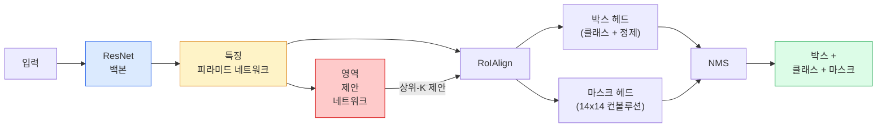

# 인스턴스 분할 — Mask R-CNN

> Faster R-CNN 검출기에 작은 마스크 분기를 추가하면 인스턴스 분할이 됩니다. 어려운 부분은 RoIAlign이며, 보기보다 더 어렵습니다.

**유형:** 구축 + 학습  
**언어:** Python  
**선수 지식:** 4단계 06강 (YOLO), 4단계 07강 (U-Net)  
**소요 시간:** ~75분

## 학습 목표

- Mask R-CNN 아키텍처(백본, FPN, RPN, RoIAlign, 박스 헤드, 마스크 헤드)를 종단간(end-to-end)으로 추적
- RoIAlign을 처음부터 구현하고 RoIPool이 더 이상 사용되지 않는 이유 설명
- 프로덕션 품질의 인스턴스 마스크를 위해 `torchvision`의 `maskrcnn_resnet50_fpn_v2` 사전 학습 모델 사용 및 출력 형식 정확히 읽기
- 박스 헤드와 마스크 헤드를 교체하고 백본을 동결(frozen)한 상태로 소규모 사용자 정의 데이터셋에 Mask R-CNN 파인튜닝(fine-tuning) 수행

## 문제 정의

시맨틱 분할(semantic segmentation)은 클래스당 하나의 마스크를 제공합니다. 인스턴스 분할(instance segmentation)은 두 객체가 동일한 클래스를 공유하더라도 객체당 하나의 마스크를 제공합니다. 개체 수 세기, 프레임 간 추적, 측정 작업(벽면의 각 벽돌, 현미경 이미지의 각 셀에 대한 바운딩 박스)은 모두 인스턴스 분할을 요구합니다.

Mask R-CNN(He et al., 2017)은 인스턴스 분할을 "검출(detection) + 마스크(mask)"로 재구성하여 이 문제를 해결했습니다. 이 설계는 매우 깔끔하여 이후 5년간 거의 모든 인스턴스 분할 논문이 Mask R-CNN 변형 모델이었으며, torchvision 구현체는 여전히 소규모에서 중간 규모 데이터셋의 프로덕션 기본값으로 사용됩니다.

어려운 엔지니어링 문제는 샘플링(sampling)입니다: 모서리 픽셀이 정확히 정렬되지 않는 제안 박스(proposal box)에서 고정 크기의 특징 영역을 어떻게 크롭할 것인가? 이를 잘못 구현하면 모든 곳에서 mAP 점수가 0.1포인트씩 감소합니다. RoIAlign이 그 해답입니다.

## 개념

### 아키텍처



이해해야 할 5가지 구성 요소:

1. **백본** — ImageNet으로 학습된 ResNet-50 또는 ResNet-101. 스트라이드 4, 8, 16, 32에서 특징 맵 계층 구조를 생성합니다.
2. **FPN (Feature Pyramid Network)** — 상향식(top-down) 및 측면(lateral) 연결로 모든 레벨에 의미론적 특징이 풍부한 C 채널을 제공합니다. 객체 크기에 맞는 FPN 레벨을 쿼리합니다.
3. **RPN (Region Proposal Network)** — 모든 앵커 위치에서 "여기에 객체가 있는가?"와 "박스를 어떻게 정제할 것인가?"를 예측하는 작은 컨볼루션 헤드. 이미지당 약 1,000개의 제안을 생성합니다.
4. **RoIAlign** — 모든 FPN 레벨의 박스에서 고정 크기(예: 7x7) 특징 패치를 샘플링합니다. 양선형 보간(bilinear sampling)을 사용하며 양자화(quantisation)가 없습니다.
5. **헤드** — 박스를 정제하고 클래스를 선택하는 2층 박스 헤드와, 각 제안에 대해 `28x28` 이진 마스크를 출력하는 작은 컨볼루션 헤드.

### RoIPool이 아닌 RoIAlign을 사용하는 이유

원래 Fast R-CNN은 RoIPool을 사용했는데, 이는 제안 박스를 그리드로 분할하고 각 셀에서 최대 특징을 취하며 모든 좌표를 정수로 반올림합니다. 이 반올림은 입력 픽셀 좌표에서 특징 맵을 최대 한 픽셀까지 오정렬시킵니다. 224x224 이미지에서는 작지만, 특징 맵 스트라이드가 32일 때는 치명적입니다.

```
RoIPool:
  박스 (34.7, 51.3, 98.2, 142.9)
  반올림 -> (34, 51, 98, 142)
  그리드 분할 -> 각 셀 경계 반올림
  오정렬이 모든 단계에서 누적됨

RoIAlign:
  박스 (34.7, 51.3, 98.2, 142.9)
  양선형 보간을 사용하여 정확한 부동 소수점 좌표에서 샘플링
  어디에서도 반올림 없음
```

RoIAlign은 COCO에서 마스크 AP를 3-4 포인트 무료로 향상시킵니다. YOLOv7 seg, RT-DETR, Mask2Former 등 위치 정확도에 신경 쓰는 모든 검출기가 현재 이를 사용합니다.

### RPN을 한 단락으로 설명

특징 맵의 모든 위치에 다양한 크기와 모양의 K개의 앵커 박스를 배치합니다. 각 앵커에 대해 객체 점수(objectness score)와 앵커를 더 잘 맞는 박스로 변환하는 회귀 오프셋을 예측합니다. 점수 기준으로 상위 ~1,000개 박스를 유지하고 IoU 0.7에서 NMS를 적용한 후 생존한 박스를 헤드에 전달합니다. RPN은 자체 미니 손실로 훈련됩니다. 이는 레슨 6의 YOLO 손실과 동일한 구조이며, 두 클래스(객체/배경)만 있습니다.

### 마스크 헤드

각 제안(RoIAlign 이후)에 대해 마스크 헤드는 작은 FCN입니다: 3x3 컨볼루션 4개, 2x 디컨볼루션, 최종 1x1 컨볼루션으로 `28x28` 해상도에서 `num_classes` 출력 채널을 생성합니다. 예측된 클래스에 해당하는 채널만 유지하고 나머지는 무시합니다. 이는 마스크 예측과 분류를 분리합니다.

28x28 마스크를 제안의 원래 픽셀 크기로 업샘플링하여 최종 이진 마스크를 생성합니다.

### 손실 함수

Mask R-CNN은 다음 4가지 손실 함수를 합산합니다:

```
L = L_rpn_cls + L_rpn_box + L_box_cls + L_box_reg + L_mask
```

- `L_rpn_cls`, `L_rpn_box` — RPN 제안에 대한 객체 점수 + 박스 회귀.
- `L_box_cls` — 헤드의 분류기에서 (배경 포함) (C+1) 클래스에 대한 교차 엔트로피.
- `L_box_reg` — 헤드의 박스 정제에 대한 smooth L1.
- `L_mask` — 28x28 마스크 출력에 대한 픽셀별 이진 교차 엔트로피.

각 손실에는 기본 가중치가 있으며, torchvision 구현에서는 생성자 인수로 노출됩니다.

### 출력 형식

`torchvision.models.detection.maskrcnn_resnet50_fpn_v2`는 이미지당 하나의 딕셔너리를 포함하는 리스트를 반환합니다:

```
{
    "boxes":  (N, 4) (x1, y1, x2, y2) 픽셀 좌표,
    "labels": (N,) 클래스 ID, 0 = 배경이므로 인덱스는 1부터 시작,
    "scores": (N,) 신뢰도 점수,
    "masks":  (N, 1, H, W) [0, 1] 범위의 부동 소수점 마스크 — 이진 마스크를 위해 0.5 임계값 적용,
}
```

마스크는 이미 전체 이미지 해상도입니다. 28x28 헤드 출력은 내부적으로 업샘플링되었습니다.

## 빌드하기

### 1단계: RoIAlign 처음부터 구현하기

이것은 Mask R-CNN 구성 요소 중 코드로는 산문보다 이해하기 쉬운 유일한 구성 요소입니다.

```python
import torch
import torch.nn.functional as F

def roi_align_single(feature, box, output_size=7, spatial_scale=1 / 16.0):
    """
    feature: (C, H, W) 단일 이미지 특징 맵
    box: 원본 이미지 픽셀 좌표의 (x1, y1, x2, y2)
    output_size: 출력 그리드 한 변의 길이 (박스 헤드는 7, 마스크 헤드는 14)
    spatial_scale: 특징 맵 스트라이드의 역수
    """
    C, H, W = feature.shape
    x1, y1, x2, y2 = [c * spatial_scale - 0.5 for c in box]
    bin_w = (x2 - x1) / output_size
    bin_h = (y2 - y1) / output_size

    grid_y = torch.linspace(y1 + bin_h / 2, y2 - bin_h / 2, output_size)
    grid_x = torch.linspace(x1 + bin_w / 2, x2 - bin_w / 2, output_size)
    yy, xx = torch.meshgrid(grid_y, grid_x, indexing="ij")

    gx = 2 * (xx + 0.5) / W - 1
    gy = 2 * (yy + 0.5) / H - 1
    grid = torch.stack([gx, gy], dim=-1).unsqueeze(0)
    sampled = F.grid_sample(feature.unsqueeze(0), grid, mode="bilinear",
                            align_corners=False)
    return sampled.squeeze(0)
```

모든 숫자는 쌍선형 보간 위치에 있습니다. 반올림, 양자화, 기울기 손실 없음.

### 2단계: torchvision의 RoIAlign과 비교하기

```python
from torchvision.ops import roi_align

feature = torch.randn(1, 16, 50, 50)
boxes = torch.tensor([[0, 10, 20, 100, 90]], dtype=torch.float32)  # (batch_idx, x1, y1, x2, y2)

ours = roi_align_single(feature[0], boxes[0, 1:].tolist(), output_size=7, spatial_scale=1/4)
theirs = roi_align(feature, boxes, output_size=(7, 7), spatial_scale=1/4, sampling_ratio=1, aligned=True)[0]

print(f"shape ours:   {tuple(ours.shape)}")
print(f"shape theirs: {tuple(theirs.shape)}")
print(f"max|diff|:    {(ours - theirs).abs().max().item():.3e}")
```

`sampling_ratio=1` 및 `aligned=True`로 두 결과는 `1e-5` 이내에서 일치합니다.

### 3단계: 사전 학습된 Mask R-CNN 로드하기

```python
import torch
from torchvision.models.detection import maskrcnn_resnet50_fpn_v2, MaskRCNN_ResNet50_FPN_V2_Weights

model = maskrcnn_resnet50_fpn_v2(weights=MaskRCNN_ResNet50_FPN_V2_Weights.DEFAULT)
model.eval()
print(f"params: {sum(p.numel() for p in model.parameters()):,}")
print(f"classes (including background): {len(model.roi_heads.box_predictor.cls_score.out_features * [0])}")
```

46M 파라미터, 91개 클래스(COCO). 첫 번째 클래스(ID 0)는 배경이며, 모델이 실제로 감지하는 것은 ID 1부터 시작합니다.

### 4단계: 추론 실행하기

```python
with torch.no_grad():
    x = torch.randn(3, 400, 600)
    predictions = model([x])
p = predictions[0]
print(f"boxes:  {tuple(p['boxes'].shape)}")
print(f"labels: {tuple(p['labels'].shape)}")
print(f"scores: {tuple(p['scores'].shape)}")
print(f"masks:  {tuple(p['masks'].shape)}")
```

마스크 텐서는 `(N, 1, H, W)` 형태입니다. 0.5 임계값으로 이진 마스크를 얻습니다:

```python
binary_masks = (p['masks'] > 0.5).squeeze(1)  # (N, H, W) boolean
```

### 5단계: 사용자 정의 클래스 수를 위한 헤드 교체하기

일반적인 파인튜닝 레시피: 백본, FPN, RPN 재사용; 두 분류기 헤드 교체.

```python
from torchvision.models.detection.faster_rcnn import FastRCNNPredictor
from torchvision.models.detection.mask_rcnn import MaskRCNNPredictor

def build_custom_maskrcnn(num_classes):
    model = maskrcnn_resnet50_fpn_v2(weights=MaskRCNN_ResNet50_FPN_V2_Weights.DEFAULT)
    in_features = model.roi_heads.box_predictor.cls_score.in_features
    model.roi_heads.box_predictor = FastRCNNPredictor(in_features, num_classes)
    in_features_mask = model.roi_heads.mask_predictor.conv5_mask.in_channels
    hidden_layer = 256
    model.roi_heads.mask_predictor = MaskRCNNPredictor(in_features_mask, hidden_layer, num_classes)
    return model

custom = build_custom_maskrcnn(num_classes=5)
print(f"custom cls_score.out_features: {custom.roi_heads.box_predictor.cls_score.out_features}")
```

`num_classes`는 배경 클래스를 포함해야 하므로, 4개 객체 클래스가 있는 데이터셋은 `num_classes=5`를 사용합니다.

### 6단계: 훈련이 필요 없는 부분 동결하기

소규모 데이터셋에서는 백본과 FPN을 동결합니다. RPN 객체성 + 회귀 및 두 헤드만 학습합니다.

```python
def freeze_backbone_and_fpn(model):
    # torchvision Mask R-CNN은 FPN을 `model.backbone` 내부에
    # `model.backbone.fpn`으로 패킹하므로, `model.backbone.parameters()` 반복은
    # ResNet 특징 레이어와 FPN 측면/출력 컨볼루션을 모두 포함합니다.
    for p in model.backbone.parameters():
        p.requires_grad = False
    return model

custom = freeze_backbone_and_fpn(custom)
trainable = sum(p.numel() for p in custom.parameters() if p.requires_grad)
print(f"trainable after freeze: {trainable:,}")
```

500개 이미지 데이터셋에서는 수렴과 과적합 사이의 차이를 만듭니다.

## 사용 방법

torchvision의 Mask R-CNN 전체 학습 루프는 40줄로 구성되어 있으며 작업 간에 의미 있는 변경 없이 데이터셋만 교체하면 됩니다.

```python
def train_step(model, images, targets, optimizer):
    model.train()
    loss_dict = model(images, targets)
    losses = sum(loss for loss in loss_dict.values())
    optimizer.zero_grad()
    losses.backward()
    optimizer.step()
    return {k: v.item() for k, v in loss_dict.items()}
```

`targets` 리스트는 이미지별 딕셔너리를 포함해야 하며, 여기에는 `boxes`, `labels`, `masks`( `(num_instances, H, W)` 이진 텐서)가 포함되어야 합니다. 모델은 학습 중에는 4개의 손실을 포함하는 딕셔너리를 반환하고, 평가 중에는 `model.training`을 키로 사용하는 예측 리스트를 반환합니다.

`pycocotools` 평가기는 박스와 마스크 모두에 대해 mAP@IoU=0.5:0.95를 생성합니다. 박스 헤드 또는 마스크 헤드 중 어느 쪽이 병목 현상인지 확인하려면 두 수치가 모두 필요합니다.

## Ship It

이 레슨은 다음을 생성합니다:

- `outputs/prompt-instance-vs-semantic-router.md` — 인스턴스 vs 시맨틱 vs 팬옵틱 중 어떤 방식을 선택할지 묻는 3가지 질문과 시작할 정확한 모델을 선택하는 프롬프트.
- `outputs/skill-mask-rcnn-head-swapper.md` — 새로운 `num_classes`가 주어졌을 때, torchvision 검출 모델의 헤드를 교체하는 데 필요한 10줄의 코드를 생성하는 스킬.

## 연습 문제

1. **(쉬움)** 100개의 무작위 박스에 대해 `torchvision.ops.roi_align`과 비교하여 RoIAlign을 검증하세요. 최대 절대 차이를 보고하세요. 또한 RoIPool(2017년 이전 동작 방식)을 실행하고 경계 근처 박스에서 ~1-2 특징 맵 픽셀만큼 차이가 발생함을 보여주세요.
2. **(중간)** 50개 이미지의 커스텀 데이터셋(풍선, 물고기, 포트홀, 로고 중 두 클래스 선택)에서 `maskrcnn_resnet50_fpn_v2`를 파인튜닝(fine-tuning)하세요. 백본(backbone)을 동결(freeze)하고 20 에포크(epoch) 동안 훈련한 후 마스크 AP@0.5를 보고하세요.
3. **(어려움)** Mask R-CNN의 마스크 헤드(mask head)를 28x28 대신 56x56 해상도로 예측하는 구조로 변경하세요. 변경 전후의 mAP@IoU=0.75를 측정하고, 성능 향상(또는 부재)이 경계 정밀도(boundary-precision)와 메모리 간의 예상된 트레이드오프와 어떻게 일치하는지 설명하세요.

## 주요 용어

| 용어 | 사람들이 말하는 것 | 실제 의미 |
|------|----------------|----------------------|
| Mask R-CNN | "검출 + 마스크" | Faster R-CNN + 제안(Proposal)별 클래스당 28x28 마스크를 예측하는 소형 FCN 헤드 |
| FPN | "특징 피라미드" | 모든 스트라이드 레벨에 의미론적 특징이 풍부한 C채널을 제공하는 하향식(Top-down) + 측면 연결(Lateral connections) |
| RPN | "영역 제안자" | 이미지당 약 1000개의 객체/비객체 제안을 생성하는 소형 컨볼루션 헤드 |
| RoIAlign | "반올림 없는 크롭" | 임의의 부동소수점 좌표 박스에서 고정 크기 특징 그리드를 양선형 샘플링 |
| RoIPool | "2017년 이전 크롭" | RoIAlign과 동일한 목적, 박스 좌표 반올림 사용; 더 이상 사용되지 않음 |
| Mask AP | "인스턴스 mAP" | 박스 IoU 대신 마스크 IoU로 계산된 평균 정밀도; COCO 인스턴스 분할 메트릭 |
| 이진 마스크 헤드 | "클래스별 마스크" | 각 제안에 대해 클래스당 하나의 이진 마스크 예측; 예측된 클래스의 채널만 유지 |
| 배경 클래스 | "클래스 0" | "객체 없음"을 포괄하는 클래스; 실제 클래스 인덱스는 1부터 시작 |

## 추가 자료

- [Mask R-CNN (He et al., 2017)](https://arxiv.org/abs/1703.06870) — 논문; RoIAlign에 대한 3절이 핵심 읽기 부분
- [FPN: Feature Pyramid Networks (Lin et al., 2017)](https://arxiv.org/abs/1612.03144) — FPN 논문; 모든 현대 검출기가 이를 사용
- [torchvision Mask R-CNN 튜토리얼](https://pytorch.org/tutorials/intermediate/torchvision_tutorial.html) — 파인튜닝(fine-tuning) 루프에 대한 참조 자료
- [Detectron2 모델 동물원](https://github.com/facebookresearch/detectron2/blob/main/MODEL_ZOO.md) — 거의 모든 검출 및 분할 변형에 대한 훈련된 가중치가 포함된 프로덕션 구현