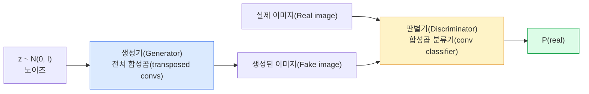
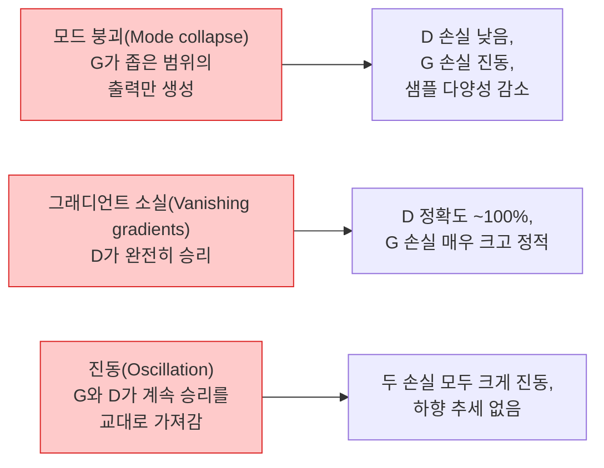

# 이미지 생성 — GANs

> GAN은 고정된 게임 내 두 개의 신경망입니다. 하나는 그림을 그리고, 하나는 비평합니다. 그림이 비평가를 속일 때까지 함께 발전합니다.

**유형:** 구축
**언어:** Python
**선수 지식:** 4단계 03레슨 (CNNs), 3단계 06레슨 (Optimizers), 3단계 07레슨 (Regularization)
**소요 시간:** ~75분

## 학습 목표

- 생성자(generator)와 판별자(discriminator) 간의 미니맥스 게임(minimax game)과 균형(equilibrium)이 p_model = p_data에 해당하는 이유를 설명
- PyTorch에서 DCGAN을 구현하고 60줄 이내로 일관된 32x32 합성 이미지 생성
- 비포화 손실(non-saturating loss), 스펙트럴 노름(spectral norm), TTUR(two-timescale update rule) 세 가지 표준 기법으로 GAN 훈련 안정화
- 건강한 수렴(healthy convergence), 모드 붕괴(mode collapse), 진동(oscillation), 판별자 완전 승리(discriminator-wins-completely)를 구분하는 훈련 곡선(training curves) 해석

## 문제 정의

분류(classification)는 네트워크가 이미지를 라벨에 매핑하도록 가르치는 반면, 생성(generation)은 문제를 뒤집습니다: 동일한 분포에서 나온 것처럼 보이는 새로운 이미지를 샘플링합니다. "정답" 출력을 비교할 수 있는 기준이 없으며, 모방하고자 하는 분포만 존재합니다.

표준 손실 함수(MSE, 교차 엔트로피)는 "이 샘플이 실제 분포에서 나왔는가?"를 측정할 수 없습니다. 픽셀 단위 오차를 최소화하면 흐릿한 평균이 생성되며, 현실적인 샘플이 나오지 않습니다. 돌파구는 손실 함수를 학습하는 것이었습니다: 실제 이미지와 가짜 이미지를 구분하는 두 번째 네트워크를 훈련시키고, 그 판단 결과를 활용해 생성기를 개선하는 것입니다.

GAN(Goodfellow et al., 2014)은 이 프레임워크를 정의했습니다. 2018년에는 StyleGAN이 사진과 구별할 수 없는 1024x1024 해상도의 얼굴을 생성했습니다. 이후 확산 모델(diffusion model)이 품질과 제어 가능성 측면에서 우위를 차지했지만, 확산 모델을 실용적으로 만드는 모든 기법(정규화 선택, 잠재 공간, 특징 손실 등)은 GAN에서 먼저 연구되었습니다.

## 개념

### 두 네트워크



**생성기(Generator)** G는 노이즈 벡터 `z`를 입력받아 이미지를 출력합니다. **판별기(Discriminator)** D는 이미지를 입력받아 단일 스칼라 값을 출력합니다: 이미지가 실제일 확률입니다.

### 게임

G는 D가 틀리도록 하고, D는 맞추려고 합니다. 공식적으로는:

```
min_G max_D  E_x[log D(x)] + E_z[log(1 - D(G(z)))]
```

오른쪽에서 왼쪽으로 읽습니다: D는 실제 이미지(`log D(real)`)와 생성된 이미지(`log (1 - D(fake))`)에 대한 정확도를 최대화합니다. G는 생성된 이미지에 대한 D의 정확도를 최소화합니다 — `D(G(z))`가 높아지길 원합니다.

Goodfellow는 이 미니맥스 게임이 `p_G = p_data`인 전역 균형점을 가지며, D가 모든 곳에서 0.5를 출력하고 생성된 분포와 실제 분포 사이의 Jensen-Shannon 발산이 0이 됨을 증명했습니다. 어려운 부분은 이 균형점에 도달하는 것입니다.

### 비포화 손실(Non-saturating loss)

위 형태는 수치적으로 불안정합니다. 학습 초기에는 `D(G(z))`가 0에 가까워 `log(1 - D(G(z)))`의 G에 대한 그래디언트가 사라집니다. 해결책: G의 손실 함수를 뒤집습니다.

```
L_D = -E_x[log D(x)] - E_z[log(1 - D(G(z)))]
L_G = -E_z[log D(G(z))]                          # 비포화 손실(non-saturating)
```

이제 `D(G(z))`가 0에 가까워도 G의 손실은 크고 그래디언트는 정보적입니다. 모든 현대 GAN은 이 변형으로 훈련됩니다.

### DCGAN 아키텍처 규칙

Radford, Metz, Chintala (2015)는 수년간의 실패한 실험을 5가지 규칙으로 요약했으며, 이는 GAN 훈련을 안정적으로 만듭니다:

1. 풀링(pooling)을 스트라이드 합성곱(strided convs)으로 대체합니다 (두 네트워크 모두).
2. 생성기와 판별기 모두에 배치 정규화(batch norm)를 사용합니다. 단, G의 출력층과 D의 입력층은 예외입니다.
3. 더 깊은 아키텍처에서는 완전 연결층(fully connected layers)을 제거합니다.
4. G는 모든 레이어에서 ReLU를 사용하고, 출력층에서는 tanh를 사용합니다 (출력 범위 [-1, 1]).
5. D는 모든 레이어에서 LeakyReLU(negative_slope=0.2)를 사용합니다.

모든 현대 합성곱 기반 GAN(StyleGAN, BigGAN, GigaGAN)은 여전히 이 규칙에서 시작하여 한 번에 하나씩 구성 요소를 교체합니다.

### 실패 모드와 그 징후



- **모드 붕괴(Mode collapse)**: G가 D를 속이는 하나의 이미지를 찾아 그것만 생성합니다. 해결책: 미니배치 판별(minibatch discrimination), 스펙트럴 노름(spectral norm), 또는 레이블 조건부(conditioning) 추가.
- **판별기 승리**: D가 너무 빨리 강해져 G의 그래디언트가 사라집니다. 해결책: 더 작은 D, 더 낮은 D 학습률, 또는 실제 레이블에 레이블 스무딩(label smoothing) 적용.
- **진동(Oscillation)**: 두 네트워크가 균형점에 접근하지 못하고 승리를 교대합니다. 해결책: TTUR(D가 G보다 2-4배 빠르게 학습), 또는 Wasserstein 손실로 전환.

### 평가

GAN은 정답이 없으므로 작동 여부를 어떻게 알 수 있을까요?

- **샘플 검사(Sample inspection)** — 매 에포크 끝에 64개 샘플을 확인합니다. 필수 항목입니다.
- **FID (Fréchet Inception Distance)** — 실제 및 생성된 세트의 Inception-v3 특징 분포 간 거리. 낮을수록 좋습니다. 커뮤니티 표준.
- **Inception Score** — 더 오래되고 취약함; FID를 선호합니다.
- **생성 모델의 정밀도/재현율(Precision/Recall)** — 품질(정밀도)과 범위(재현율)를 별도로 측정합니다. FID 단독보다 더 많은 정보를 제공합니다.

소규모 합성 데이터 실행의 경우 샘플 검사만으로 충분합니다.

## 구축 방법

### 1단계: 생성자

64차원 노이즈를 입력으로 받아 32x32 이미지를 생성하는 소형 DCGAN 생성자.

```python
import torch
import torch.nn as nn

class Generator(nn.Module):
    def __init__(self, z_dim=64, img_channels=3, feat=64):
        super().__init__()
        self.net = nn.Sequential(
            nn.ConvTranspose2d(z_dim, feat * 4, kernel_size=4, stride=1, padding=0, bias=False),
            nn.BatchNorm2d(feat * 4),
            nn.ReLU(inplace=True),
            nn.ConvTranspose2d(feat * 4, feat * 2, kernel_size=4, stride=2, padding=1, bias=False),
            nn.BatchNorm2d(feat * 2),
            nn.ReLU(inplace=True),
            nn.ConvTranspose2d(feat * 2, feat, kernel_size=4, stride=2, padding=1, bias=False),
            nn.BatchNorm2d(feat),
            nn.ReLU(inplace=True),
            nn.ConvTranspose2d(feat, img_channels, kernel_size=4, stride=2, padding=1, bias=False),
            nn.Tanh(),
        )

    def forward(self, z):
        return self.net(z.view(z.size(0), -1, 1, 1))
```

4개의 전치 합성곱 레이어로 구성되며, 각각 `kernel_size=4, stride=2, padding=1`로 공간 크기를 2배씩 증가시킵니다. tanh를 통해 출력 활성화 값을 [-1, 1] 범위로 제한합니다.

### 2단계: 판별자

생성자의 미러 구조. LeakyReLU, 스트라이드 합성곱, 스칼라 로짓으로 종료.

```python
class Discriminator(nn.Module):
    def __init__(self, img_channels=3, feat=64):
        super().__init__()
        self.net = nn.Sequential(
            nn.Conv2d(img_channels, feat, kernel_size=4, stride=2, padding=1),
            nn.LeakyReLU(0.2, inplace=True),
            nn.Conv2d(feat, feat * 2, kernel_size=4, stride=2, padding=1, bias=False),
            nn.BatchNorm2d(feat * 2),
            nn.LeakyReLU(0.2, inplace=True),
            nn.Conv2d(feat * 2, feat * 4, kernel_size=4, stride=2, padding=1, bias=False),
            nn.BatchNorm2d(feat * 4),
            nn.LeakyReLU(0.2, inplace=True),
            nn.Conv2d(feat * 4, 1, kernel_size=4, stride=1, padding=0),
        )

    def forward(self, x):
        return self.net(x).view(-1)
```

마지막 합성곱 레이어는 `4x4` 특징 맵을 `1x1`로 축소합니다. 출력은 이미지당 단일 스칼라 값이며, 손실 계산 시에만 시그모이드를 적용합니다.

### 3단계: 학습 단계

매번 배치마다 판별자(D)를 한 번 업데이트한 후 생성자(G)를 한 번 업데이트합니다.

```python
import torch.nn.functional as F

def train_step(G, D, real, z, opt_g, opt_d, device):
    real = real.to(device)
    bs = real.size(0)

    # D 단계
    opt_d.zero_grad()
    d_real = D(real)
    d_fake = D(G(z).detach())
    loss_d = (F.binary_cross_entropy_with_logits(d_real, torch.ones_like(d_real))
              + F.binary_cross_entropy_with_logits(d_fake, torch.zeros_like(d_fake)))
    loss_d.backward()
    opt_d.step()

    # G 단계
    opt_g.zero_grad()
    d_fake = D(G(z))
    loss_g = F.binary_cross_entropy_with_logits(d_fake, torch.ones_like(d_fake))
    loss_g.backward()
    opt_g.step()

    return loss_d.item(), loss_g.item()
```

판별자(D) 단계에서 `G(z).detach()`는 매우 중요합니다. 생성자(G) 업데이트 시 그래디언트가 G로 흐르지 않도록 하기 위함입니다. 이를 잊는 것은 초보자들의 흔한 실수입니다.

### 4단계: 합성 도형 데이터셋에서의 전체 학습 루프

```python
from torch.utils.data import DataLoader, TensorDataset
import numpy as np

def synthetic_images(num=2000, size=32, seed=0):
    rng = np.random.default_rng(seed)
    imgs = np.zeros((num, 3, size, size), dtype=np.float32) - 1.0
    for i in range(num):
        r = rng.uniform(6, 12)
        cx, cy = rng.uniform(r, size - r, size=2)
        yy, xx = np.meshgrid(np.arange(size), np.arange(size), indexing="ij")
        mask = (xx - cx) ** 2 + (yy - cy) ** 2 < r ** 2
        color = rng.uniform(-0.5, 1.0, size=3)
        for c in range(3):
            imgs[i, c][mask] = color[c]
    return torch.from_numpy(imgs)

device = "cuda" if torch.cuda.is_available() else "cpu"
data = synthetic_images()
loader = DataLoader(TensorDataset(data), batch_size=64, shuffle=True)

G = Generator(z_dim=64, img_channels=3, feat=32).to(device)
D = Discriminator(img_channels=3, feat=32).to(device)
opt_g = torch.optim.Adam(G.parameters(), lr=2e-4, betas=(0.5, 0.999))
opt_d = torch.optim.Adam(D.parameters(), lr=2e-4, betas=(0.5, 0.999))

for epoch in range(10):
    for (batch,) in loader:
        z = torch.randn(batch.size(0), 64, device=device)
        ld, lg = train_step(G, D, batch, z, opt_g, opt_d, device)
    print(f"epoch {epoch}  D {ld:.3f}  G {lg:.3f}")
```

`Adam(lr=2e-4, betas=(0.5, 0.999))`는 DCGAN의 기본 설정입니다. 낮은 beta1 값은 모멘텀 항이 적대적 게임을 너무 빨리 안정화시키는 것을 방지합니다.

### 5단계: 샘플링

```python
@torch.no_grad()
def sample(G, n=16, z_dim=64, device="cpu"):
    G.eval()
    z = torch.randn(n, z_dim, device=device)
    imgs = G(z)
    imgs = (imgs + 1) / 2
    return imgs.clamp(0, 1)
```

샘플링 전 항상 평가 모드로 전환해야 합니다. DCGAN에서는 배치 정규화의 실행 통계가 배치 통계 대신 사용되기 때문에 이 과정이 중요합니다.

### 6단계: 스펙트럴 정규화

판별자의 배치 정규화를 대체할 수 있는 드롭인 방식으로, 네트워크가 1-립시츠임을 보장합니다. "판별자가 너무 강하게 승리"하는 대부분의 실패를 해결합니다.

```python
from torch.nn.utils import spectral_norm

def build_sn_discriminator(img_channels=3, feat=64):
    return nn.Sequential(
        spectral_norm(nn.Conv2d(img_channels, feat, 4, 2, 1)),
        nn.LeakyReLU(0.2, inplace=True),
        spectral_norm(nn.Conv2d(feat, feat * 2, 4, 2, 1)),
        nn.LeakyReLU(0.2, inplace=True),
        spectral_norm(nn.Conv2d(feat * 2, feat * 4, 4, 2, 1)),
        nn.LeakyReLU(0.2, inplace=True),
        spectral_norm(nn.Conv2d(feat * 4, 1, 4, 1, 0)),
    )
```

`Discriminator`를 `build_sn_discriminator()`로 교체하면 TTUR 트릭이 필요하지 않은 경우가 많습니다. 스펙트럴 정규화는 적용할 수 있는 가장 쉬운 단일 견고성 업그레이드입니다.

## 사용 방법

본격적인 생성을 위해 사전 훈련된 가중치를 사용하거나 확산(diffusion)으로 전환하세요. 두 가지 표준 라이브러리:

- `torch_fidelity`는 사용자 정의 평가 코드 작성 없이 생성기에 대한 FID / IS를 계산합니다.
- `pytorch-gan-zoo` (레거시) 및 `StudioGAN`은 DCGAN, WGAN-GP, SN-GAN, StyleGAN, BigGAN의 테스트된 구현체를 제공합니다.

2026년에도 GAN은 다음 분야에서 여전히 최고의 선택입니다: 실시간 이미지 생성(지연 시간 <10ms), 스타일 변환, 정밀한 제어가 필요한 이미지-이미지 변환(Pix2Pix, CycleGAN). 확산 모델은 사실성(photorealism)과 텍스트 조건 부여(text conditioning) 분야에서 우수합니다.

## Ship It

이 레슨은 다음을 생성합니다:

- `outputs/prompt-gan-training-triage.md` — 훈련 곡선 설명을 읽고 실패 모드(모드 붕괴(mode collapse), D-wins, 진동(oscillation))와 단일 권장 수정 사항을 선택하는 프롬프트.
- `outputs/skill-dcgan-scaffold.md` — `z_dim`, 대상 `image_size`, `num_channels`로부터 DCGAN 스캐폴드를 작성하는 스킬. 훈련 루프와 샘플 저장기 포함.

## 연습 문제

1. **(쉬움)** 위의 DCGAN을 합성 원 데이터셋에 훈련시키고 각 에포크 종료 시 16개 샘플 그리드를 저장하세요. 몇 번째 에포크에서 생성된 원이 명확하게 원형이 되나요?
2. **(중간)** 판별자(Discriminator)의 배치 정규화(batch norm)를 스펙트럴 정규화(spectral norm)로 교체하세요. 두 버전을 나란히 훈련시켜 보세요. 어떤 것이 더 빠르게 수렴하나요? 세 개의 시드(seed)에서 어떤 것이 더 낮은 분산을 가지나요?
3. **(어려움)** 조건부 DCGAN(Conditional DCGAN)을 구현하세요: 클래스 레이블을 생성자(G)와 판별자(D) 모두에 입력합니다 (G에서는 노이즈에 원-핫(one-hot)을 연결(concat)하고, D에서는 클래스 임베딩(class embedding) 채널을 연결). 7강에서 나온 합성 "원 vs 사각형" 데이터셋으로 훈련시키고 특정 레이블로 샘플링하여 클래스 조건화가 작동함을 보여주세요.

## 주요 용어

| 용어 | 사람들이 말하는 표현 | 실제 의미 |
|------|----------------|----------------------|
| 생성기(Generator (G)) | "그림을 그리는 네트워크" | 노이즈를 이미지로 매핑; 판별기를 속이도록 훈련됨 |
| 판별기(Discriminator (D)) | "비평가" | 이진 분류기; 실제 이미지와 생성된 이미지를 구분하도록 훈련됨 |
| 미니맥스(Minimax) | "게임" | 생성기(G)에 대한 최소화, 판별기(D)에 대한 최대화를 하는 적대적 손실; 균형점은 p_G = p_data |
| 비포화 손실(Non-saturating loss) | "수치적으로 안정적인 버전" | G의 손실은 log(1 - D(G(z))) 대신 -log(D(G(z)))로 훈련 초기 기울기 소실 방지 |
| 모드 붕괴(Mode collapse) | "생성기가 한 가지만 만듦" | G가 데이터 분포의 작은 부분집합만 생성; SN, 미니배치 판별, 더 큰 배치로 해결 |
| TTUR | "두 학습률" | D가 G보다 2-4배 빠르게 학습; 훈련 안정화 |
| 스펙트럴 노름(Spectral norm) | "1-립시츠 레이어" | 각 레이어의 립시츠 상수를 제한하는 가중치 정규화; D가 임의로 가파르게 되는 것 방지 |
| FID | "Fréchet Inception Distance" | 실제 및 생성 이미지 세트의 Inception-v3 특징 분포 간 거리; 표준 평가 지표 |

## 추가 자료

- [생성적 적대 신경망(Generative Adversarial Networks, Goodfellow et al., 2014)](https://arxiv.org/abs/1406.2661) — 모든 것의 시작점이 된 논문
- [DCGAN (Radford, Metz, Chintala, 2015)](https://arxiv.org/abs/1511.06434) — GAN 학습을 가능하게 한 아키텍처 규칙
- [GAN을 위한 스펙트럴 정규화(Spectral Normalization for GANs, Miyato et al., 2018)](https://arxiv.org/abs/1802.05957) — 가장 유용한 안정화 기법
- [StyleGAN3 (Karras et al., 2021)](https://arxiv.org/abs/2106.12423) — 최신 GAN 기술; 지난 10년간의 모든 기법을 집대성한 논문