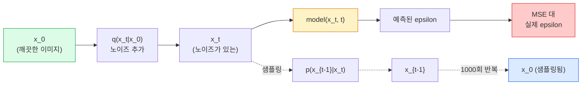

# 이미지 생성 — 확산 모델

> 확산 모델은 노이즈를 제거하는 방법을 학습합니다. 노이즈가 있는 이미지에서 약간의 노이즈를 제거하도록 훈련시키고, 이를 천 번 정도 역순으로 반복하면 이미지 생성기가 완성됩니다.

**유형:** Build  
**언어:** Python  
**선수 지식:** Phase 4 Lesson 07 (U-Net), Phase 1 Lesson 06 (확률), Phase 3 Lesson 06 (옵티마이저)  
**소요 시간:** ~75분

## 학습 목표

- 순방향 노이즈 추가 과정 `x_0 -> x_1 -> ... -> x_T`를 유도하고, 임의의 t에 대해 닫힌 형태(closed-form) `q(x_t | x_0)`가 성립하는 이유를 설명
- 각 단계에서 추가된 노이즈를 회귀(regression)하는 DDPM 스타일 학습 목표와, 순수 노이즈에서 이미지로 역추적하는 샘플러를 구현
- 임의의 타임스텝에 대한 노이즈를 예측하는 시간 조건화(time-conditioned) U-Net(CPU에서 훈련 가능한 작은 규모)을 구축
- DDPM과 DDIM 샘플링의 차이점을 설명하고, 각각이 적절한 경우 설명 (레슨 23에서 플로우 매칭(flow matching)과 정류된 플로우(rectified flow)를 심층 다룸)

## 문제 정의

GAN은 단일 단계 생성 방식을 사용합니다: 노이즈가 입력되면 단일 순전파(forward pass)를 통해 이미지가 출력됩니다. GAN은 빠르지만 훈련이 어렵습니다. 반면 확산 모델(Diffusion models)은 반복적으로 생성합니다: 순수한 노이즈에서 시작하여 작은 단계로 노이즈를 제거하며 이미지를 생성합니다. 확산 모델은 느리지만 훈련이 쉽습니다. 지난 5년간 후자의 특성이 지배적이었습니다: 소규모 팀도 확산 모델을 훈련시켜 합리적인 샘플을 얻을 수 있지만, GAN 훈련은 수년간의 실패 경험을 통해 습득하는 기술(craft)입니다.

훈련 안정성을 넘어, 확산 모델의 반복적 구조는 현대 이미지 생성 기술의 모든 가능성을 열어줍니다: 텍스트 조건화(text conditioning), 인페인팅(inpainting), 이미지 편집, 초해상도(super-resolution), 제어 가능한 스타일(controllable style) 등. 샘플링 루프의 각 단계는 새로운 제약 조건을 주입할 수 있는 지점입니다. 이러한 유연성 덕분에 Stable Diffusion, Imagen, DALL-E 3, Midjourney 및 사용 가능한 모든 제어 가능한 이미지 모델이 확산 모델 기반으로 구현되었습니다.

이 강의에서는 최소한의 DDPM(Denoising Diffusion Probabilistic Models)을 구축합니다: 순방향 노이즈 추가(forward noising), 역방향 노이즈 제거(backward denoising), 훈련 루프(training loop). 다음 강의(Stable Diffusion)에서는 VAE, 텍스트 인코더(text encoder), 분류자 없는 가이드(classifier-free guidance)를 활용해 이를 프로덕션 시스템에 통합하는 방법을 다룹니다.

## 개념

### 순방향 과정

이미지 `x_0`를 가져옵니다. 약간의 가우시안 노이즈를 추가하여 `x_1`을 얻습니다. 조금 더 추가하여 `x_2`를 얻습니다. `x_T`가 순수 가우시안 노이즈와 거의 구별되지 않을 때까지 T단계로 계속 진행합니다.

```
q(x_t | x_{t-1}) = N(x_t; sqrt(1 - beta_t) * x_{t-1},  beta_t * I)
```

`beta_t`는 작은 분산 스케줄로, 일반적으로 T=1000단계에 걸쳐 0.0001에서 0.02까지 선형적으로 증가합니다. 각 단계는 신호를 약간 축소하고 새로운 노이즈를 주입합니다.

### 폐형식 점프

한 번에 한 단계씩 노이즈를 추가하는 것은 마르코프 체인이지만, 수학적으로 다음과 같이 접힙니다: `x_0`에서 한 단계로 `x_t`를 직접 샘플링할 수 있습니다.

```
alpha_t = 1 - beta_t로 정의
alpha_bar_t = prod_{s=1..t} alpha_s로 정의

그러면:
  q(x_t | x_0) = N(x_t; sqrt(alpha_bar_t) * x_0,  (1 - alpha_bar_t) * I)

동등하게:
  x_t = sqrt(alpha_bar_t) * x_0 + sqrt(1 - alpha_bar_t) * epsilon
  여기서 epsilon ~ N(0, I)
```

이 단일 방정식이 디퓨전이 실용적인 이유입니다. 학습 중에는 임의의 `t`를 선택하고 `x_0`에서 직접 `x_t`를 샘플링한 후 한 단계로 학습합니다. 전체 마르코프 체인 시뮬레이션이 필요 없습니다.

### 역방향 과정

순방향 과정은 고정되어 있습니다. 역방향 과정 `p(x_{t-1} | x_t)`는 신경망이 학습합니다. 디퓨전 모델은 `x_{t-1}`을 직접 예측하지 않고, 단계 t에서 추가된 노이즈 `epsilon`을 예측하며, 수학적으로 `x_{t-1}`을 유도합니다.



### 학습 손실

모든 학습 단계에서:

1. 실제 이미지 `x_0`를 샘플링합니다.
2. [1, T]에서 균일하게 타임스텝 `t`를 샘플링합니다.
3. 노이즈 `epsilon ~ N(0, I)`를 샘플링합니다.
4. `x_t = sqrt(alpha_bar_t) * x_0 + sqrt(1 - alpha_bar_t) * epsilon`을 계산합니다.
5. 네트워크로 `epsilon_theta(x_t, t)`를 예측합니다.
6. `|| epsilon - epsilon_theta(x_t, t) ||^2`를 최소화합니다.

이게 전부입니다. 신경망은 임의의 타임스텝에서 노이즈를 예측하도록 학습합니다. 손실은 MSE입니다. 적대적 게임, 붕괴, 진동이 없습니다.

### 샘플러 (DDPM)

생성하려면 `x_T ~ N(0, I)`에서 시작하여 한 단계씩 역방향으로 진행합니다.

```
for t = T, T-1, ..., 1:
    eps = model(x_t, t)
    x_{t-1} = (1 / sqrt(alpha_t)) * (x_t - (beta_t / sqrt(1 - alpha_bar_t)) * eps) + sqrt(beta_t) * z
    여기서 z ~ N(0, I) (t > 1인 경우), 그렇지 않으면 0
return x_0
```

핵심은 일반적으로 역방향 조건부가 폐형식으로 알려지지 않았지만, 이 특정 가우시안 순방향 과정에 대해서는 알려져 있다는 것입니다. 복잡한 계수들은 베이즈 규칙이 제공하는 것입니다.

### 왜 1000단계인가

순방향 노이즈 스케줄은 각 단계가 역방향 단계가 거의 가우시안이 되도록 충분한 노이즈를 추가하도록 선택됩니다. 단계가 너무 적으면 역방향 단계가 가우시안에서 멀어져 네트워크가 잘 모델링할 수 없습니다. 단계가 너무 많으면 샘플링 비용이 증가하고 이득이 감소합니다. 선형 스케줄을 사용하는 T=1000이 DDPM의 기본값입니다.

### DDIM: 20배 빠른 샘플링

학습은 동일합니다. 샘플링이 변경됩니다. DDIM(Song et al., 2020)은 재학습 없이 타임스텝을 건너뛰는 결정적 역방향 과정을 정의합니다. DDIM으로 50단계 샘플링하면 1000단계 DDPM 품질에 근접합니다. 모든 프로덕션 시스템은 DDIM 또는 더 빠른 변형(DPM-Solver, Euler ancestral)을 사용합니다.

### 시간 조건화

네트워크 `epsilon_theta(x_t, t)`는 어떤 타임스텝을 디노이징하는지 알아야 합니다. 현대 디퓨전 모델은 사인파 시간 임베딩(트랜스포머의 위치 인코딩과 동일한 아이디어)을 통해 `t`를 주입하며, 이는 모든 U-Net 레벨에서 특징 맵에 추가됩니다.

```
t_embedding = sinusoidal(t)
feature_map += MLP(t_embedding)
```

시간 조건화가 없으면 네트워크는 이미지 자체에서 노이즈 레벨을 추측해야 하며, 이는 작동하지만 샘플 효율성이 훨씬 낮습니다.

## 구축 방법

### 1단계: 노이즈 스케줄

```python
import torch

def linear_beta_schedule(T=1000, beta_start=1e-4, beta_end=2e-2):
    return torch.linspace(beta_start, beta_end, T)


def precompute_schedule(betas):
    alphas = 1.0 - betas
    alphas_cumprod = torch.cumprod(alphas, dim=0)
    return {
        "betas": betas,
        "alphas": alphas,
        "alphas_cumprod": alphas_cumprod,
        "sqrt_alphas_cumprod": torch.sqrt(alphas_cumprod),
        "sqrt_one_minus_alphas_cumprod": torch.sqrt(1.0 - alphas_cumprod),
        "sqrt_recip_alphas": torch.sqrt(1.0 / alphas),
    }

schedule = precompute_schedule(linear_beta_schedule(T=1000))
```

한 번 사전 계산하고, 학습 및 샘플링 시 인덱스로 조회합니다.

### 2단계: 순방향 확산(q_sample)

```python
def q_sample(x0, t, noise, schedule):
    sqrt_a = schedule["sqrt_alphas_cumprod"][t].view(-1, 1, 1, 1)
    sqrt_one_minus_a = schedule["sqrt_one_minus_alphas_cumprod"][t].view(-1, 1, 1, 1)
    return sqrt_a * x0 + sqrt_one_minus_a * noise
```

단일 행 클로즈드 폼. `t`는 배치 내 이미지당 하나의 타임스텝으로 구성된 배치입니다.

### 3단계: 소형 시간 조건화 U-Net

```python
import torch.nn as nn
import torch.nn.functional as F
import math

def timestep_embedding(t, dim=64):
    half = dim // 2
    freqs = torch.exp(-math.log(10000) * torch.arange(half, device=t.device) / half)
    args = t[:, None].float() * freqs[None]
    emb = torch.cat([args.sin(), args.cos()], dim=-1)
    return emb


class TinyUNet(nn.Module):
    def __init__(self, img_channels=3, base=32, t_dim=64):
        super().__init__()
        self.t_mlp = nn.Sequential(
            nn.Linear(t_dim, base * 4),
            nn.SiLU(),
            nn.Linear(base * 4, base * 4),
        )
        self.t_dim = t_dim
        self.enc1 = nn.Conv2d(img_channels, base, 3, padding=1)
        self.enc2 = nn.Conv2d(base, base * 2, 4, stride=2, padding=1)
        self.mid = nn.Conv2d(base * 2, base * 2, 3, padding=1)
        self.dec1 = nn.ConvTranspose2d(base * 2, base, 4, stride=2, padding=1)
        self.dec2 = nn.Conv2d(base * 2, img_channels, 3, padding=1)
        self.time_proj = nn.Linear(base * 4, base * 2)

    def forward(self, x, t):
        t_emb = timestep_embedding(t, self.t_dim)
        t_emb = self.t_mlp(t_emb)
        t_proj = self.time_proj(t_emb)[:, :, None, None]

        h1 = F.silu(self.enc1(x))
        h2 = F.silu(self.enc2(h1)) + t_proj
        h3 = F.silu(self.mid(h2))
        d1 = F.silu(self.dec1(h3))
        d2 = torch.cat([d1, h1], dim=1)
        return self.dec2(d2)
```

병목 지점에 시간 조건화를 주입한 2단계 U-Net. 실제 이미지에는 깊이와 너비를 확장해야 합니다.

### 4단계: 학습 루프

```python
def train_step(model, x0, schedule, optimizer, device, T=1000):
    model.train()
    x0 = x0.to(device)
    bs = x0.size(0)
    t = torch.randint(0, T, (bs,), device=device)
    noise = torch.randn_like(x0)
    x_t = q_sample(x0, t, noise, schedule)
    pred = model(x_t, t)
    loss = F.mse_loss(pred, noise)
    optimizer.zero_grad()
    loss.backward()
    optimizer.step()
    return loss.item()
```

이것이 전체 학습 루프입니다. GAN 게임도, 특수 손실 함수도, 단일 MSE 호출만 있습니다.

### 5단계: 샘플러(DDPM)

```python
@torch.no_grad()
def sample(model, schedule, shape, T=1000, device="cpu"):
    model.eval()
    x = torch.randn(shape, device=device)
    betas = schedule["betas"].to(device)
    sqrt_one_minus_a = schedule["sqrt_one_minus_alphas_cumprod"].to(device)
    sqrt_recip_alphas = schedule["sqrt_recip_alphas"].to(device)

    for t in reversed(range(T)):
        t_batch = torch.full((shape[0],), t, dtype=torch.long, device=device)
        eps = model(x, t_batch)
        coef = betas[t] / sqrt_one_minus_a[t]
        mean = sqrt_recip_alphas[t] * (x - coef * eps)
        if t > 0:
            x = mean + torch.sqrt(betas[t]) * torch.randn_like(x)
        else:
            x = mean
    return x
```

샘플 한 배치를 생성하려면 1000번의 순방향 패스가 필요합니다. 실제 코드에서는 DDIM 50단계 샘플러로 교체할 수 있습니다.

### 6단계: DDIM 샘플러(결정적, ~20배 빠름)

```python
@torch.no_grad()
def sample_ddim(model, schedule, shape, steps=50, T=1000, device="cpu", eta=0.0):
    model.eval()
    x = torch.randn(shape, device=device)
    alphas_cumprod = schedule["alphas_cumprod"].to(device)

    ts = torch.linspace(T - 1, 0, steps + 1).long()
    for i in range(steps):
        t = ts[i]
        t_prev = ts[i + 1]
        t_batch = torch.full((shape[0],), t, dtype=torch.long, device=device)
        eps = model(x, t_batch)
        a_t = alphas_cumprod[t]
        a_prev = alphas_cumprod[t_prev] if t_prev >= 0 else torch.tensor(1.0, device=device)
        x0_pred = (x - torch.sqrt(1 - a_t) * eps) / torch.sqrt(a_t)
        sigma = eta * torch.sqrt((1 - a_prev) / (1 - a_t) * (1 - a_t / a_prev))
        dir_xt = torch.sqrt(1 - a_prev - sigma ** 2) * eps
        noise = sigma * torch.randn_like(x) if eta > 0 else 0
        x = torch.sqrt(a_prev) * x0_pred + dir_xt + noise
    return x
```

`eta=0`은 완전히 결정적입니다(동일한 노이즈 입력은 항상 동일한 출력을 생성). `eta=1`은 DDPM을 복원합니다.

## 사용 방법

프로덕션 작업에는 `diffusers`를 사용하세요:

```python
from diffusers import DDPMScheduler, UNet2DModel

unet = UNet2DModel(sample_size=32, in_channels=3, out_channels=3, layers_per_block=2)
scheduler = DDPMScheduler(num_train_timesteps=1000)
```

이 라이브러리는 즉시 사용 가능한 스케줄러(DDPM, DDIM, DPM-Solver, Euler, Heun), 구성 가능한 U-Net, 텍스트-이미지 및 이미지-이미지 파이프라인, LoRA 파인튜닝(fine-tuning) 헬퍼를 제공합니다.

연구 목적에는 `k-diffusion`(Katherine Crowson)이 가장 정확한 레퍼런스 구현과 최고의 샘플링 변형(variants)을 제공합니다.

## Ship It

이 레슨은 다음을 생성합니다:

- `outputs/prompt-diffusion-sampler-picker.md` — 품질 목표, 지연 시간 예산, 조건화 유형에 따라 DDPM / DDIM / DPM-Solver / Euler를 선택하는 프롬프트.
- `outputs/skill-noise-schedule-designer.md` — T와 목표 왜곡 수준을 기반으로 선형, 코사인 또는 시그모이드 베타 스케줄을 생성하는 스킬, 시간에 따른 신호 대 잡음 비율 진단 플롯 포함.

## 연습 문제

1. **(쉬움)** 순방향 과정 시각화: 하나의 이미지를 선택하고 `t in [0, 100, 250, 500, 750, 1000]`에서 `x_t`를 플롯으로 표시하시오. `x_1000`이 순수 가우시안 노이즈처럼 보이는지 확인하시오.
2. **(중간)** 합성-원(synthetic-circles) 데이터셋에서 TinyUNet을 20 에포크 동안 훈련시키고 16개의 원을 샘플링하시오. DDPM(1000 스텝)과 DDIM(50 스텝) 샘플링을 비교하시오 — 동일한 노이즈 시드에서 유사한 이미지를 생성하는지 확인하시오.
3. **(어려움)** 코사인 노이즈 스케줄(Nichol & Dhariwal, 2021) 구현: `alpha_bar_t = cos^2((t/T + s) / (1 + s) * pi / 2)`. 선형 스케줄과 코사인 스케줄로 동일한 모델을 훈련시키고, 코사인 스케줄이 낮은 스텝 수에서 더 나은 샘플을 생성함을 보이시오.

## 주요 용어

| 용어 | 사람들이 말하는 것 | 실제 의미 |
|------|----------------|----------------------|
| 순방향 과정(Forward process) | "시간에 따라 노이즈 추가" | T 단계 동안 이미지를 가우시안 노이즈로 손상시키는 고정된 마르코프 체인 |
| 역방향 과정(Reverse process) | "단계별로 노이즈 제거" | 노이즈에서 이미지로 역추적하는 학습된 분포 |
| 엡실론 예측(Epsilon prediction) | "노이즈 예측" | 학습 목표: `epsilon_theta(x_t, t)`는 t 단계에서 추가된 노이즈를 예측 |
| 베타 스케줄(Beta schedule) | "노이즈 양" | 각 단계별로 추가되는 노이즈 양을 정의하는 T개의 작은 분산 시퀀스 |
| 알파 바 티(alpha_bar_t) | "누적 보존 계수" | 시간 t까지의 (1 - beta_s) 곱; t가 클수록 남은 신호 감소 |
| DDPM 샘플러(DDPM sampler) | "조상, 확률적" | 조건부 가우시안으로부터 각 x_{t-1} 샘플링; 1000단계 |
| DDIM 샘플러(DDIM sampler) | "결정론적, 빠른" | 샘플링을 결정론적 ODE로 재작성; 20-100단계로도 유사 품질 |
| 시간 조건화(Time conditioning) | "모델에 t 알려주기" | U-Net에 주입되는 t의 사인 함수 임베딩으로 노이즈 수준 인지 |

## 추가 자료

- [Denoising Diffusion Probabilistic Models (Ho et al., 2020)](https://arxiv.org/abs/2006.11239) — 확산 모델을 실용적으로 만들고 FID에서 GAN을 능가한 논문
- [Improved DDPM (Nichol & Dhariwal, 2021)](https://arxiv.org/abs/2102.09672) — 코사인 스케줄링과 v-파라미터화
- [DDIM (Song, Meng, Ermon, 2020)](https://arxiv.org/abs/2010.02502) — 실시간 추론을 가능하게 한 결정적 샘플러
- [Elucidating the Design Space of Diffusion (Karras et al., 2022)](https://arxiv.org/abs/2206.00364) — 모든 확산 설계 선택에 대한 통합 관점; 현재 최고의 참고 자료