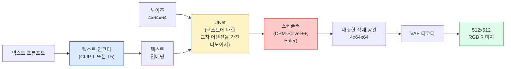

# Stable Diffusion — 아키텍처 및 파인튜닝

> Stable Diffusion은 사전 학습된 VAE의 잠재 공간에서 실행되며, 크로스 어텐션을 통해 텍스트에 조건부로 적용되고, 빠른 결정적 ODE 솔버로 샘플링되며, 분류자 없는 가이드에 의해 조종되는 DDPM입니다.

**유형:** 학습 + 활용  
**언어:** Python  
**선수 지식:** Phase 4 Lesson 10 (확산 모델), Phase 7 Lesson 02 (셀프 어텐션)  
**소요 시간:** ~75분

## 학습 목표

- Stable Diffusion 파이프라인의 5가지 구성 요소(VAE, 텍스트 인코더, U-Net, 스케줄러, 안전 검사기)를 추적하고 각각이 실제로 수행하는 역할 설명
- 잠재 확산(latent diffusion) 원리 및 3x512x512 이미지 대신 4x64x64 잠재 공간에서 훈련할 때 품질 저하 없이 계산량을 48배 줄이는 이유 설명
- `diffusers`를 사용하여 이미지 생성, 이미지-이미지 변환, 인페인팅, ControlNet 가이드 생성 실행
- 소규모 커스텀 데이터셋으로 LoRA를 활용해 Stable Diffusion을 파인튜닝(fine-tuning)하고 추론 시 LoRA 어댑터(adapter) 로드

## 문제

512x512 RGB 이미지에 DDPM(Denoising Diffusion Probabilistic Model)을 직접 적용하는 것은 비용이 많이 듭니다. 매 훈련 단계마다 3x512x512 = 786,432개의 입력 값을 처리하는 U-Net을 통해 역전파(backpropagation)가 수행되며, 샘플링에는 동일한 U-Net을 50회 이상 순전파(forward pass)해야 합니다. Stable Diffusion 1.5(2022년 출시) 수준의 품질을 달성하려면 픽셀 공간 확산 모델은 대략 256 GPU-개월의 훈련 시간과 소비자 GPU에서 이미지당 10~30초가 소요됩니다.

오픈 웨이트 텍스트-이미지 생성을 실용적으로 만든 핵심 기술은 **잠재 확산(latent diffusion)**(Rombach et al., CVPR 2022)입니다. 3x512x512 이미지를 4x64x64 잠재 텐서(latent tensor)로 매핑하고 다시 복원하는 VAE(Variational Autoencoder)를 훈련시킨 후, 해당 잠재 공간에서 확산을 수행합니다. 계산량은 `(3*512*512)/(4*64*64) = 48배` 감소합니다. 샘플링 시간도 동일한 GPU에서 수십 초에서 2초 미만으로 단축됩니다.

SDXL, SD3, FLUX, HunyuanDiT, Wan-Video 등 거의 모든 현대 이미지 생성 모델은 오토인코더(autoencoder), 노이즈 제거기(U-Net 또는 DiT), 텍스트 조건화(text conditioning) 변형 요소를 갖춘 잠재 확산 모델입니다. Stable Diffusion을 학습하면 템플릿을 익힌 것과 같습니다.

## 개념

### 파이프라인



- **VAE** — 고정된 오토인코더. 인코더는 이미지를 잠재 공간으로 변환(이미지-이미지 변환 및 학습에 사용). 디코더는 잠재 공간을 다시 이미지로 변환.
- **텍스트 인코더** — CLIP 텍스트 인코더(SD 1.x/2.x), CLIP-L + CLIP-G(SDXL), 또는 T5-XXL(SD3/FLUX). 토큰 임베딩 시퀀스를 생성.
- **U-Net** — 디노이저. 모든 해상도 수준에서 잠재 공간에서 텍스트 임베딩으로 어텐션하는 교차 어텐션 레이어를 가짐.
- **스케줄러** — 샘플링 알고리즘(DDIM, Euler, DPM-Solver++). 시그마를 선택하고 예측된 노이즈를 잠재 공간에 혼합.
- **안전성 검사기** — 출력 이미지에 대한 선택적 NSFW/불법 콘텐츠 필터.

### 분류자 없는 가이드(CFG)

일반 텍스트 조건화는 모든 프롬프트 `c`에 대해 `epsilon_theta(x_t, t, c)`를 학습합니다. CFG는 동일한 네트워크에 `c`를 10% 확률로 제거(빈 임베딩으로 대체)하며 학습하여 조건부 및 무조건부 노이즈를 모두 예측하는 단일 모델을 제공합니다. 추론 시:

```
eps = eps_uncond + w * (eps_cond - eps_uncond)
```

`w`는 가이드 스케일입니다. `w=0`은 무조건부, `w=1`은 일반 조건부, `w>1`은 다양성 손실을 감수하고 출력을 "프롬프트에 더 조건화"되도록 강제합니다. SD 기본값은 `w=7.5`입니다.

CFG는 텍스트-이미지 생성이 프로덕션 품질로 작동하는 이유입니다. CFG 없이는 프롬프트가 출력을 약하게 편향시키지만, CFG와 함께하면 프롬프트가 출력을 지배합니다.

### 잠재 공간 기하학

VAE의 4채널 잠재 공간은 단순히 압축된 이미지가 아닙니다. 산술 연산이 대략 의미론적 편집(프롬프트 엔지니어링 + 보간)에 대응되는 매니폴드이며, 디퓨전 U-Net이 전체 모델링 예산을 소비하도록 학습된 공간입니다. 무작위 4x64x64 잠재 공간을 디코딩하면 무작위 이미지가 아닌 쓰레기가 생성됩니다. 잠재 공간의 특정 부분 매니폴드만 유효한 이미지로 디코딩되기 때문입니다.

두 가지 결과:

1. **이미지-이미지 변환** = 이미지를 잠재 공간으로 인코딩, 부분 노이즈 추가, 디노이저 실행, 디코딩. 인코딩이 거의 가역적이므로 이미지 구조가 유지되며, 프롬프트에 따라 콘텐츠가 변경됩니다.
2. **인페인팅** = 이미지-이미지 변환과 동일하지만 디노이저가 마스크된 영역만 업데이트; 마스크되지 않은 영역은 인코딩된 잠재 공간으로 유지.

### U-Net 아키텍처

SD U-Net은 레슨 10의 TinyUNet에 다음 세 가지 기능을 추가한 대형 버전입니다:

- **트랜스포머 블록** — 모든 공간 해상도에 존재하며, 텍스트 임베딩에 대한 자기 어텐션 + 교차 어텐션을 포함.
- **시간 임베딩** — 사인 인코딩에 MLP를 적용.
- **스킵 연결** — 인코더와 디코더 간 매칭 해상도에서 연결.

SD 1.5의 총 파라미터: ~860M. SDXL: ~2.6B. FLUX: ~12B. 파라미터 증가는 주로 어텐션 레이어에서 발생합니다.

### LoRA 파인튜닝

Stable Diffusion의 전체 파인튜닝에는 20+GB VRAM과 860M 파라미터 업데이트가 필요합니다. LoRA(Low-Rank Adaptation)는 기본 모델을 고정하고 어텐션 레이어에 작은 랭크 분해 행렬을 주입합니다. SD용 LoRA 어댑터는 일반적으로 10-50MB이며, 소비자 GPU에서 10-60분 내 학습되고 추론 시 드롭인 수정으로 로드됩니다.

```
원본: W_q : (d_in, d_out)   고정
LoRA: W_q + alpha * (A @ B)   여기서 A : (d_in, r), B : (r, d_out)

r은 일반적으로 4-32.
```

LoRA는 거의 모든 커뮤니티 파인튜닝이 배포되는 방식입니다. CivitAI와 Hugging Face는 수백만 개의 LoRA를 호스팅합니다.

### 자주 접하는 스케줄러

- **DDIM** — 결정적, ~50단계, 단순.
- **Euler ancestral** — 확률적, 30-50단계, 약간 더 창의적인 샘플.
- **DPM-Solver++ 2M Karras** — 결정적, 20-30단계, 프로덕션 기본값.
- **LCM / TCD / Turbo** — 일관성 모델 및 증류 변형; 1-4단계, 일부 품질 손실.

스케줄러 교체는 `diffusers`에서 한 줄 변경으로 가능하며, 재학습 없이 샘플 문제를 해결할 수 있습니다.

## 빌드하기

이 레슨은 Stable Diffusion을 처음부터 다시 빌드하는 대신 `diffusers`를 엔드투엔드로 사용합니다. 재구성에 필요한 구성 요소(VAE, 텍스트 인코더, U-Net, 스케줄러)는 각각 별도의 레슨 주제입니다. 여기서는 프로덕션 API에 대한 유창함을 목표로 합니다.

### 1단계: 텍스트-이미지

```python
import torch
from diffusers import StableDiffusionPipeline

pipe = StableDiffusionPipeline.from_pretrained(
    "runwayml/stable-diffusion-v1-5",
    torch_dtype=torch.float16,
).to("cuda")

image = pipe(
    prompt="도쿄에서 스케이트보드를 타는 개, 스튜디오 지브리 스타일",
    guidance_scale=7.5,
    num_inference_steps=25,
    generator=torch.Generator("cuda").manual_seed(42),
).images[0]
image.save("dog.png")
```

`float16`은 VRAM을 절반으로 줄이면서도 눈에 띄는 품질 손실이 없습니다. 기본 DPM-Solver++를 사용한 `num_inference_steps=25`는 DDIM의 `num_inference_steps=50`과 동일한 결과를 제공합니다.

### 2단계: 스케줄러 교체

```python
from diffusers import DPMSolverMultistepScheduler, EulerAncestralDiscreteScheduler

pipe.scheduler = DPMSolverMultistepScheduler.from_config(pipe.scheduler.config)
pipe.scheduler = EulerAncestralDiscreteScheduler.from_config(pipe.scheduler.config)
```

스케줄러 상태는 U-Net 가중치와 분리되어 있습니다. DDPM으로 학습한 후 어떤 스케줄러로도 샘플링이 가능합니다.

### 3단계: 이미지-이미지

```python
from diffusers import StableDiffusionImg2ImgPipeline
from PIL import Image

img2img = StableDiffusionImg2ImgPipeline.from_pretrained(
    "runwayml/stable-diffusion-v1-5",
    torch_dtype=torch.float16,
).to("cuda")

init_image = Image.open("dog.png").convert("RGB").resize((512, 512))
out = img2img(
    prompt="스케이트보드를 타는 개, 유화",
    image=init_image,
    strength=0.6,
    guidance_scale=7.5,
).images[0]
```

`strength`는 노이즈 제거 전 추가할 노이즈의 양을 제어합니다(0.0 = 변경 없음, 1.0 = 완전 재생성). 스타일 전송의 표준 범위는 0.5-0.7입니다.

### 4단계: 인페인팅

```python
from diffusers import StableDiffusionInpaintPipeline

inpaint = StableDiffusionInpaintPipeline.from_pretrained(
    "runwayml/stable-diffusion-inpainting",
    torch_dtype=torch.float16,
).to("cuda")

image = Image.open("dog.png").convert("RGB").resize((512, 512))
mask = Image.open("dog_mask.png").convert("L").resize((512, 512))

out = inpaint(
    prompt="고양이",
    image=image,
    mask_image=mask,
    guidance_scale=7.5,
).images[0]
```

마스크의 흰색 픽셀은 재생성할 영역이고, 검은색 픽셀은 보존됩니다.

### 5단계: LoRA 로딩

```python
pipe.load_lora_weights("sayakpaul/sd-lora-ghibli")
pipe.fuse_lora(lora_scale=0.8)

image = pipe(prompt="지브리 스타일의 마을 광장").images[0]
```

`lora_scale`은 강도를 제어합니다(0.0 = 효과 없음, 1.0 = 전체 효과). `fuse_lora`는 속도를 위해 어댑터를 가중치에 통합하지만, 교체를 방지합니다. 다른 어댑터를 로드하기 전에 `pipe.unfuse_lora()`를 호출하세요.

### 6단계: LoRA 학습 (개요)

실제 LoRA 학습은 `peft` 또는 `diffusers.training`에 있습니다. 개요는 다음과 같습니다:

```python
# 의사 코드
for step, batch in enumerate(dataloader):
    images, prompts = batch
    latents = vae.encode(images).latent_dist.sample() * 0.18215

    t = torch.randint(0, num_train_timesteps, (batch_size,))
    noise = torch.randn_like(latents)
    noisy_latents = scheduler.add_noise(latents, noise, t)

    text_emb = text_encoder(tokenizer(prompts))

    pred_noise = unet(noisy_latents, t, text_emb)  # LoRA 가중치가 여기에 주입됨

    loss = F.mse_loss(pred_noise, noise)
    loss.backward()
    optimizer.step()
```

LoRA 행렬만 그래디언트를 수신합니다. 기본 U-Net, VAE, 텍스트 인코더는 동결됩니다. 배치 크기 1과 그래디언트 체크포인팅을 사용하면 8GB VRAM에 적합합니다.

## 사용 방법

실제 프로덕션 환경에서 내리는 결정 사항:

- **모델 패밀리**: 오픈소스 커뮤니티 파인튜닝에는 SD 1.5, 더 높은 품질에는 SDXL, 최신 기술 및 엄격한 라이선스 요구 사항에는 SD3 / FLUX.
- **스케줄러**: 20-30단계에는 DPM-Solver++ 2M Karras, 1초 미만 지연 시간에는 LCM-LoRA.
- **정밀도**: 4080/4090에서는 `float16`, A100 이상에서는 `bfloat16`, VRAM이 부족할 때는 `int8` (`bitsandbytes` 또는 `compel`을 통해).
- **컨디셔닝**: 일반 텍스트도 작동; 더 강력한 제어를 원하면 기본 파이프라인 위에 ControlNet(캐니, 깊이, 포즈) 추가.

일괄 생성에는 `AUTO1111` / `ComfyUI`가 커뮤니티 도구이며, 프로덕션 API에는 `diffusers` + `accelerate` 또는 TensorRT 컴파일이 포함된 `optimum-nvidia`를 사용.

## Ship It

이 레슨은 다음을 생성합니다:

- `outputs/prompt-sd-pipeline-planner.md` — 지연 시간 예산, 충실도 목표, 라이선스 제약 조건을 고려하여 SD 1.5 / SDXL / SD3 / FLUX와 스케줄러 및 정밀도를 선택하는 프롬프트.
- `outputs/skill-lora-training-setup.md` — 캡션, 랭크, 배치 크기, 학습률을 포함한 사용자 정의 데이터셋에 대한 전체 LoRA 학습 구성 파일을 작성하는 기술.

## 연습 문제

1. **(쉬움)** `guidance_scale`을 `[1, 3, 5, 7.5, 10, 15]` 범위에서 변경하며 동일한 프롬프트를 생성합니다. 이미지가 어떻게 변하는지 설명하세요. 어떤 guidance 값에서 아티팩트(artifact)가 나타나기 시작하나요?

2. **(중간)** 실제 사진을 하나 선택한 후, `StableDiffusionImg2ImgPipeline`을 `strength` 값 `[0.2, 0.4, 0.6, 0.8, 1.0]`으로 실행합니다. 어떤 strength 값이 구도를 유지하면서 스타일을 변경하나요? 왜 1.0은 입력 이미지를 완전히 무시하나요?

3. **(어려움)** 단일 주제(반려동물, 로고, 캐릭터 등)의 10-20개 이미지로 LoRA를 학습시킨 후, 해당 주제가 포함된 새로운 장면을 생성합니다. 입력 이미지에 과적합(overfitting)되지 않으면서 최적의 정체성 보존(identity preservation)을 달성한 LoRA 랭크(rank)와 학습 단계(training steps)를 보고하세요.

## 주요 용어

| 용어 | 사람들이 말하는 표현 | 실제 의미 |
|------|----------------|----------------------|
| 잠재 확산(Latent diffusion) | "Diffuse in latents" | 픽셀 공간(3x512x512) 대신 VAE 잠재 공간(4x64x64)에서 전체 DDPM 실행; 48x 계산 비용 절감 |
| VAE 스케일 팩터(VAE scale factor) | "0.18215" | VAE의 원시 잠재값을 대략 단위 분산으로 재조정하는 상수; 모든 SD 파이프라인에 하드코딩됨 |
| 분류기 없는 가이드(Classifier-free guidance) | "CFG" | 조건부 및 무조건부 노이즈 예측 혼합; 가장 영향력 있는 추론 조절 장치 |
| 스케줄러(Scheduler) | "Sampler" | 노이즈 + 모델 예측을 노이즈 제거 잠재 궤적으로 변환하는 알고리즘 |
| LoRA(LoRA) | "저랭크 어댑터" | 기본 가중치를 건드리지 않고 어텐션 레이어를 미세 조정하는 소규모 랭크 분해 행렬 |
| 크로스 어텐션(Cross-attention) | "텍스트-이미지 어텐션" | 잠재 토큰에서 텍스트 토큰으로의 어텐션; 모든 U-Net 레벨에서 프롬프트 정보 주입 |
| 컨트롤넷(ControlNet) | "구조 조건화" | 캔니, 깊이, 포즈, 분할 등 추가 입력으로 SD를 조종하는 별도 훈련된 어댑터 |
| DPM-Solver++(DPM-Solver++) | "기본 스케줄러" | 2차 결정론적 ODE 솔버; 2026년 기준 20-30단계 저스텝에서 최고 품질 제공

## 추가 자료

- [High-Resolution Image Synthesis with Latent Diffusion (Rombach et al., 2022)](https://arxiv.org/abs/2112.10752) — Stable Diffusion 논문; 설계를 정당화하는 모든 실험(ablation) 포함
- [Classifier-Free Diffusion Guidance (Ho & Salimans, 2022)](https://arxiv.org/abs/2207.12598) — CFG(Classifier-Free Guidance) 논문
- [LoRA: Low-Rank Adaptation of Large Language Models (Hu et al., 2021)](https://arxiv.org/abs/2106.09685) — LoRA는 NLP에서 처음 개발되었으며, 거의 변경 없이 SD에 적용됨
- [diffusers documentation](https://huggingface.co/docs/diffusers) — 모든 SD / SDXL / SD3 / FLUX 파이프라인의 공식 문서