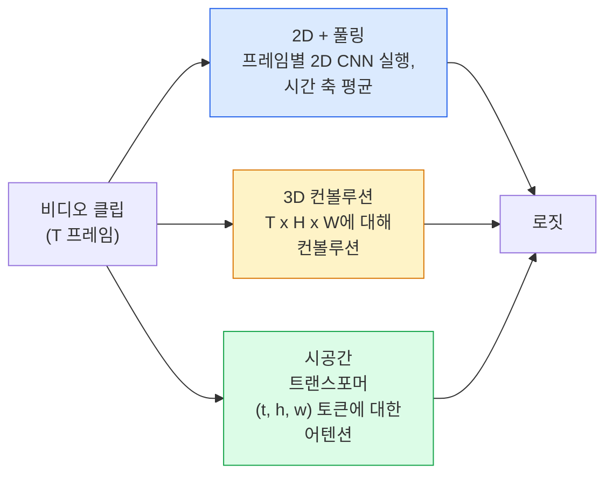

# 비디오 이해 — 시간적 모델링

> 비디오는 이미지 시퀀스 + 이를 연결하는 물리 법칙입니다. 모든 비디오 모델은 시간을 추가 축(3D 컨볼루션)으로, 어텐션할 시퀀스(트랜스포머)로, 또는 한 번 추출한 후 풀링할 특징(2D+풀링)으로 처리합니다.

**유형:** 학습 + 구현  
**언어:** Python  
**선수 지식:** 4단계 03강(CNNs), 4단계 04강(이미지 분류)  
**소요 시간:** ~45분

## 학습 목표

- 세 가지 주요 비디오 모델링 접근법(2D+풀링, 3D 합성곱, 시공간 트랜스포머)을 구분하고 비용 및 정확도 트레이드오프를 예측
- PyTorch에서 프레임 샘플링, 시간적 풀링, 2D+풀링 기준 분류기 구현
- I3D의 "확장된" 3D 커널이 ImageNet 가중치에서 잘 전이되는 이유와 분해된 (2+1)D 합성곱의 차이점 설명
- 표준 동작 인식 데이터셋 및 메트릭 읽기: Kinetics-400/600, UCF101, Something-Something V2; 클립 및 비디오 수준에서의 top-1 정확도

## 전문 용어 설명
- **2D+풀링(2D+pooling)**: 2D 합성곱에 시간적 풀링 적용
- **3D 합성곱(3D conv)**: 3차원(공간+시간) 합성곱 연산
- **시공간 트랜스포머(spatio-temporal transformer)**: 시공간적 관계를 모델링하는 트랜스포머 아키텍처
- **I3D(Inflated 3D ConvNet)**: 2D 합성곱을 3D로 확장한 네트워크
- **분해된 (2+1)D 합성곱(factorised (2+1)D conv)**: 공간(2D)과 시간(1D) 합성곱을 분리하여 적용
- **Kinetics-400/600**: 대규모 인간 동작 인식 데이터셋
- **UCF101**: 101개 동작 클래스를 포함한 비디오 데이터셋
- **Something-Something V2**: 객체 상호작용 중심의 비디오 데이터셋
- **top-1 정확도(top-1 accuracy)**: 가장 높은 확률의 예측값이 정답과 일치하는 비율

## 구현 요소
- **프레임 샘플링(frame sampling)**: 비디오에서 대표 프레임 선택
- **시간적 풀링(temporal pooling)**: 시간 축에서의 특징 집계
- **기준 분류기(baseline classifier)**: 비교 평가를 위한 기본 모델

## 평가 지표
- **클립 수준 정확도(clip-level accuracy)**: 개별 클립 단위 정확도
- **비디오 수준 정확도(video-level accuracy)**: 전체 비디오 단위 정확도

## 문제 정의

30초 분량의 30fps 동영상은 900개의 이미지로 구성됩니다. 순진하게 접근하면 동영상 분류는 이미지 분류를 900번 실행한 후 일종의 집계(aggregation) 과정을 거치는 것입니다. 이 방식은 거의 모든 프레임에서 동작이 명확하게 보이는 경우(스포츠, 요리, 운동 영상)에는 작동하지만, 동작 자체가 움직임으로 정의되는 경우("왼쪽에서 오른쪽으로 무언가를 밀기")에는 완전히 실패합니다. 이러한 동작은 개별 프레임에서는 두 개의 정지된 물체로만 보이기 때문입니다.

모든 동영상 아키텍처의 핵심 질문은 다음과 같습니다: 시간적 구조(temporal structure)는 언제, 어떻게 모델링되는가? 이 질문에 대한 답변이 다른 모든 요소(계산 비용, 사전 학습 전략, ImageNet 가중치 재사용 가능성, 모델 학습 데이터셋)를 결정합니다.

이 강의는 의도적으로 정적 이미지 강의보다 짧게 구성되었습니다. 핵심 이미지 처리 기법은 이미 확립되어 있으며, 동영상 이해는 주로 시간적 이야기(temporal story)에 관한 것입니다: 샘플링, 모델링, 집계.

## 개념

## 세 가지 아키텍처 패밀리



## 2D + 풀링

2D CNN(ResNet, EfficientNet, ViT)을 사용합니다. 샘플링된 모든 프레임에 독립적으로 실행합니다. 프레임별 임베딩을 평균(또는 최대 풀링, 어텐션 풀링)합니다. 풀링된 벡터를 분류기에 입력합니다.

장점:
- ImageNet 사전 학습이 직접 전이됩니다.
- 구현이 가장 간단합니다.
- 저렴함: T 프레임 * 단일 이미지 추론 비용.

단점:
- 모션을 모델링할 수 없습니다. 액션 = 외관 집계.
- 시간 풀링은 순서 불변; "문 열기"와 "문 닫기"가 동일하게 보입니다.

사용 시기: 외관이 중요한 작업, 소규모 비디오 데이터셋의 전이 학습, 초기 베이스라인.

## 3D 컨볼루션

2D (H, W) 커널을 3D (T, H, W) 커널로 대체합니다. 네트워크는 공간과 시간 모두에 대해 컨볼루션을 수행합니다. 초기 패밀리: C3D, I3D, SlowFast.

I3D 트릭: 사전 학습된 2D ImageNet 모델을 가져와 각 2D 커널을 새로운 시간 축으로 복사하여 "팽창"시킵니다. 3x3 2D 컨볼루션은 3x3x3 3D 컨볼루션이 됩니다. 이는 3D 모델에 처음부터 학습하는 대신 강력한 사전 학습 가중치를 제공합니다.

장점:
- 모션을 직접 모델링합니다.
- I3D 팽창은 무료 전이 학습을 제공합니다.

단점:
- 2D 대비 T/8 더 많은 FLOPs (시간 커널 3을 3번 쌓을 경우).
- 시간 커널이 작음; 장거리 모션에는 피라미드 또는 듀얼 스트림 접근 필요.

사용 시기: 모션이 신호인 액션 인식(Something-Something V2, 모션 중심 클래스가 있는 Kinetics).

## 시공간 트랜스포머

비디오를 시공간 패치 그리드로 토큰화하고 모든 토큰에 어텐션을 적용합니다. TimeSformer, ViViT, Video Swin, VideoMAE.

중요한 어텐션 패턴:
- **통합** — (t, h, w)에 대한 하나의 큰 어텐션. `T*H*W`에 대해 이차적; 비용이 큽니다.
- **분할** — 블록당 두 어텐션: 시간 어텐션과 공간 어텐션. 선형적 확장.
- **분해** — 블록 간에 시간 어텐션과 공간 어텐션이 번갈아 적용.

장점:
- 모든 주요 벤치마크에서 SOTA 정확도.
- 이미지 트랜스포머(ViT)에서 패치 팽창을 통해 전이 학습.
- 희소 어텐션을 통한 장거리 비디오 컨텍스트 지원.

단점:
- 계산 집약적.
- 주의 패턴 선택이 신중하지 않으면 런타임이 급증.

사용 시기: 대규모 데이터셋, 고정밀 비디오 이해, 멀티모달 비디오+텍스트 작업.

## 프레임 샘플링

30fps의 10초 클립은 300프레임; 모든 300프레임을 모델에 입력하는 것은 낭비입니다. 표준 전략:

- **균일 샘플링** — 클립 전체에 T 프레임을 고르게 선택. 2D+풀링의 기본값.
- **밀집 샘플링** — 무작위 연속 T 프레임 창. 모션에 인접 프레임이 필요한 3D 컨볼루션에 일반적.
- **멀티 클립** — 동일 비디오에서 여러 T 프레임 창을 샘플링, 각각 분류, 테스트 시 예측 평균.

T는 일반적으로 8, 16, 32, 64입니다. 높은 T = 더 많은 시간 신호이지만 더 많은 계산.

## 평가

두 수준:
- **클립 수준 정확도** — 모델이 하나의 T 프레임 클립을 보고 상위-k를 보고.
- **비디오 수준 정확도** — 비디오당 여러 클립의 클립 수준 예측을 평균; 더 높고 안정적.

항상 둘 다 보고합니다. 78% 클립 / 82% 비디오 점수는 테스트 시간 평균에 크게 의존; 80% / 81% 점수는 클립당 더 강건.

## 만날 데이터셋

- **Kinetics-400 / 600 / 700** — 범용 액션 데이터셋. 400k 클립; YouTube URL(현재는 많은 링크가 끊김).
- **Something-Something V2** — 모션 정의 액션("X를 왼쪽에서 오른쪽으로 이동"). 2D+풀링으로 해결 불가.
- **UCF-101**, **HMDB-51** — 오래되고 작지만 여전히 보고됨.
- **AVA** — 공간과 시간에서의 액션 *지역화*; 분류보다 어려움.

## 구축 방법

## 1단계: 프레임 샘플러

프레임 목록(또는 비디오 텐서)에서 작동하는 균일 및 밀집 샘플러.

```python
import numpy as np

def sample_uniform(num_frames_total, T):
    if num_frames_total <= T:
        return list(range(num_frames_total)) + [num_frames_total - 1] * (T - num_frames_total)
    step = num_frames_total / T
    return [int(i * step) for i in range(T)]


def sample_dense(num_frames_total, T, rng=None):
    rng = rng or np.random.default_rng()
    if num_frames_total <= T:
        return list(range(num_frames_total)) + [num_frames_total - 1] * (T - num_frames_total)
    start = int(rng.integers(0, num_frames_total - T + 1))
    return list(range(start, start + T))
```

둘 다 비디오 텐서를 슬라이싱하는 데 사용하는 `T`개의 인덱스를 반환합니다.

## 2단계: 2D+풀 기반 모델

모든 프레임에 대해 2D ResNet-18을 실행하고, 특징을 평균 풀링한 후 분류합니다.

```python
import torch
import torch.nn as nn
from torchvision.models import resnet18, ResNet18_Weights

class FramePool(nn.Module):
    def __init__(self, num_classes=400, pretrained=True):
        super().__init__()
        weights = ResNet18_Weights.IMAGENET1K_V1 if pretrained else None
        backbone = resnet18(weights=weights)
        self.features = nn.Sequential(*(list(backbone.children())[:-1]))  # 글로벌 평균 풀링 유지
        self.head = nn.Linear(512, num_classes)

    def forward(self, x):
        # x: (N, T, 3, H, W)
        N, T = x.shape[:2]
        x = x.view(N * T, *x.shape[2:])
        feats = self.features(x).view(N, T, -1)
        pooled = feats.mean(dim=1)
        return self.head(pooled)

model = FramePool(num_classes=10)
x = torch.randn(2, 8, 3, 224, 224)
print(f"출력: {model(x).shape}")
print(f"파라미터 수: {sum(p.numel() for p in model.parameters()):,}")
```

1,100만 개의 파라미터, ImageNet 사전 훈련, 프레임별 실행, 평균 풀링, 분류. 이 기반 모델은 외관이 중요한 작업에서 적절한 3D 모델과 5-10점 이내의 성능을 보이며, 때로는 더 강력한 ImageNet 백본을 재사용하기 때문에 더 나은 성능을 보이기도 합니다.

## 3단계: I3D 스타일의 팽창된 3D 컨볼루션

새로운 시간 축을 따라 가중치를 반복하여 단일 2D 컨볼루션을 3D 컨볼루션으로 변환합니다.

```python
def inflate_2d_to_3d(conv2d, time_kernel=3):
    out_c, in_c, kh, kw = conv2d.weight.shape
    weight_3d = conv2d.weight.data.unsqueeze(2)  # (out, in, 1, kh, kw)
    weight_3d = weight_3d.repeat(1, 1, time_kernel, 1, 1) / time_kernel
    conv3d = nn.Conv3d(in_c, out_c, kernel_size=(time_kernel, kh, kw),
                        padding=(time_kernel // 2, conv2d.padding[0], conv2d.padding[1]),
                        stride=(1, conv2d.stride[0], conv2d.stride[1]),
                        bias=False)
    conv3d.weight.data = weight_3d
    return conv3d

conv2d = nn.Conv2d(3, 64, kernel_size=3, padding=1, bias=False)
conv3d = inflate_2d_to_3d(conv2d, time_kernel=3)
print(f"2D 가중치 형태:  {tuple(conv2d.weight.shape)}")
print(f"3D 가중치 형태:  {tuple(conv3d.weight.shape)}")
x = torch.randn(1, 3, 8, 56, 56)
print(f"3D 출력 형태:  {tuple(conv3d(x).shape)}")
```

`time_kernel`로 나누는 것은 활성화 크기를 대략 일정하게 유지하여 첫 번째 패스에서 배치 정규화 통계를 깨뜨리지 않도록 합니다.

## 4단계: 분해된 (2+1)D 컨볼루션

3D 컨볼루션을 2D(공간) 및 1D(시간) 컨볼루션으로 분할합니다. 동일한 수용 필드, 더 적은 파라미터, 일부 벤치마크에서 더 나은 정확도.

```python
class Conv2Plus1D(nn.Module):
    def __init__(self, in_c, out_c, kernel_size=3):
        super().__init__()
        mid_c = (in_c * out_c * kernel_size * kernel_size * kernel_size) \
                // (in_c * kernel_size * kernel_size + out_c * kernel_size)
        self.spatial = nn.Conv3d(in_c, mid_c, kernel_size=(1, kernel_size, kernel_size),
                                 padding=(0, kernel_size // 2, kernel_size // 2), bias=False)
        self.bn = nn.BatchNorm3d(mid_c)
        self.act = nn.ReLU(inplace=True)
        self.temporal = nn.Conv3d(mid_c, out_c, kernel_size=(kernel_size, 1, 1),
                                  padding=(kernel_size // 2, 0, 0), bias=False)

    def forward(self, x):
        return self.temporal(self.act(self.bn(self.spatial(x))))

c = Conv2Plus1D(3, 64)
x = torch.randn(1, 3, 8, 56, 56)
print(f"(2+1)D 출력: {tuple(c(x).shape)}")
```

전체 R(2+1)D 네트워크는 ResNet-18의 모든 3x3 컨볼루션을 `Conv2Plus1D`로 대체한 것과 동일합니다.

## 사용 방법

두 라이브러리가 프로덕션 비디오 작업을 지원합니다:

- `torchvision.models.video` — R(2+1)D, MViT, Swin3D (Kinetics 사전 학습 가중치 포함). 이미지 모델과 동일한 API.
- `pytorchvideo` (Meta) — 모델 저장소, Kinetics/SSv2/AVA용 데이터 로더, 표준 변환(transforms) 제공.

Vision-Language 비디오 모델(비디오 캡셔닝, 비디오 QA)의 경우 `transformers` 라이브러리(`VideoMAE`, `VideoLLaMA`, `InternVideo`)를 사용하세요.

## Ship It

이 레슨은 다음을 생성합니다:

- `outputs/prompt-video-architecture-picker.md` — 외관(appearance) 대 동작(motion), 데이터셋 크기, 컴퓨팅 예산에 따라 2D+pool / I3D / (2+1)D / 트랜스포머를 선택하는 프롬프트.
- `outputs/skill-frame-sampler-auditor.md` — 비디오 파이프라인의 샘플러를 검사하고 일반적인 버그(off-by-one 인덱스, `num_frames < T`일 때 불균일 샘플링, 종횡비 유지 크롭 부재 등)를 플래그하는 스킬.

## 연습 문제

1. **(쉬움)** T=8인 FramePool과 T=8인 I3D 스타일 3D ResNet의 FLOPs(근사치)를 계산하시오. 2D+풀링이 3-5배 더 효율적인 이유를 설명하시오.  
2. **(중간)** 합성 비디오 데이터셋을 생성하시오: 무작위 방향으로 움직이는 공들, 운동 방향("좌→우", "우→좌", "대각선 위")으로 레이블 지정. FramePool을 훈련시켜 외양만으로는 운동 과제에 불충분함을 증명하시오(확률 수준 정확도 달성).  
3. **(어려움)** ResNet-18의 모든 Conv2d 레이어를 `Conv2Plus1D`로 대체하여 R(2+1)D-18을 구축하시오. ImageNet 사전 훈련된 ResNet-18의 첫 번째 conv 가중치를 인플레이트(inflate)하시오. 연습 2의 운동 데이터셋으로 훈련시켜 FramePool을 능가하시오.  

> **참고**:  
> - FLOPs: 부동소수점 연산 횟수  
> - I3D: Inflated 3D ConvNet  
> - R(2+1)D: 공간-시간 분리 합성곱  
> - Conv2Plus1D: 2D 공간 합성곱 + 1D 시간 합성곱 결합  
> - 인플레이트(inflate): 2D 커널을 3D로 확장 (예: (H,W) → (T,H,W))

## 주요 용어

| 용어 | 사람들이 말하는 표현 | 실제 의미 |
|------|----------------|----------------------|
| 2D + pool | "프레임별 분류기" | 샘플링된 모든 프레임에 2D CNN 실행, 시간 축 특징 평균 풀링 후 분류 |
| 3D 합성곱 | "공간-시간 커널" | (T, H, W) 차원에 대해 합성곱하는 커널; 모션 모델링 가능 |
| 인플레이션 | "2D 가중치를 3D로 확장" | 새로운 시간 축을 따라 2D 합성곱 가중치를 반복하여 3D 합성곱 가중치 초기화, 활성화 스케일 보존을 위해 kernel_T로 나눔 |
| (2+1)D | "분해된 합성곱" | 3D를 2D 공간 + 1D 시간으로 분리; 매개변수 감소, 중간에 추가 비선형성 도입 |
| 분할 어텐션 | "시간 후 공간" | 레이어당 두 개의 어텐션 헤드를 가진 트랜스포머 블록: 동일 프레임 토큰 간 어텐션, 동일 위치 토큰 간 어텐션 |
| 클립 | "T-프레임 윈도우" | T 프레임으로 구성된 샘플링된 부분 시퀀스; 비디오 모델이 처리하는 기본 단위 |
| 클립 vs 비디오 정확도 | "두 평가 설정" | 클립 = 비디오당 하나의 샘플, 비디오 = 여러 샘플링된 클립 평균 |
| 키네틱스 | "비디오의 ImageNet" | 400-700개 동작 클래스, 300k+ YouTube 클립, 표준 비디오 사전 학습 데이터셋 |

## 추가 자료

- [I3D: Quo Vadis, Action Recognition (Carreira & Zisserman, 2017)](https://arxiv.org/abs/1705.07750) — 인플레이션(inflation) 기법과 Kinetics 데이터셋 소개
- [R(2+1)D: A Closer Look at Spatiotemporal Convolutions (Tran et al., 2018)](https://arxiv.org/abs/1711.11248) — 분해된 컨볼루션(factorised conv), 여전히 강력한 베이스라인
- [TimeSformer: Is Space-Time Attention All You Need? (Bertasius et al., 2021)](https://arxiv.org/abs/2102.05095) — 최초의 강력한 비디오 트랜스포머
- [VideoMAE (Tong et al., 2022)](https://arxiv.org/abs/2203.12602) — 비디오를 위한 마스킹 오토인코더(MAE) 사전 학습; 현재 주류 사전 학습 방법