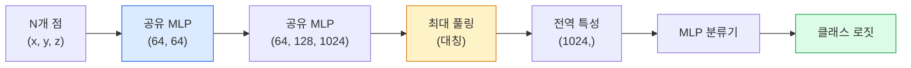

# 3D 비전 — 포인트 클라우드 & NeRFs

> 3D 비전은 두 가지 유형으로 나뉩니다. 포인트 클라우드는 센서의 원시 출력입니다. NeRFs는 학습된 체적 필드입니다. 둘 다 "공간에 무엇이 어디에 있는지"에 답합니다.

**유형:** 학습 + 구현  
**언어:** Python  
**선수 지식:** Phase 4 Lesson 03 (CNNs), Phase 1 Lesson 12 (텐서 연산)  
**소요 시간:** ~45분

## 학습 목표

- 명시적(점군(point cloud), 메시(mesh), 복셀(voxel))과 암시적(부호 거리 필드(signed distance field), NeRF) 3D 표현 방식을 구분하고 각각이 사용되는 경우 이해
- 순서 없는 점 집합에 대해 신경망을 순열 불변(permutation-invariant)하게 만드는 PointNet의 대칭 함수(symmetric-function) 기법 이해
- NeRF 순전파(forward pass) 과정 추적: 광선 캐스팅(ray casting), 체적 렌더링(volumetric rendering), 위치 인코딩(positional encoding), MLP 밀도(density)+색상(colour) 헤드
- `nerfstudio` 또는 `instant-ngp`를 사용하여 포즈(pose)가 있는 소량의 이미지 세트로부터 사전 학습된 3D 재구성 수행

## 문제 정의

카메라는 2D 이미지를 생성한다. LIDAR는 순서가 없는 3D 점 집합을 생성한다. 구조-기반-모션(structure-from-motion) 파이프라인은 희소한 3D 키포인트 클라우드를 생성한다. NeRF(Neural Radiance Fields)는 소수의 포즈 이미지(pose images)로부터 전체 3D 장면을 재구성한다. 이 모든 것들이 "비전(vision)"에 속하지만, CNN(합성곱 신경망)이 원하는 밀집 텐서(dense tensor)처럼 보이지 않는다.

3D 비전이 중요한 이유는 거의 모든 고가치 로봇 작업이 3D 환경에서 실행되기 때문이다: 물체 잡기(grasping), 장애물 회피(obstacle avoidance), 내비게이션(navigation), AR 가림 처리(occlusion), 3D 콘텐츠 캡처. 2D 이미지만 이해하는 비전 엔지니어는 해당 분야에서 가장 빠르게 성장하는 분야(AR/VR 콘텐츠, 로봇공학, 자율주행 스택, 부동산 또는 건설을 위한 NeRF 기반 3D 재구성)에서 배제된다.

두 표현 방식은 각각 다른 이유로 지배적이다. 포인트 클라우드는 센서가 기본적으로 제공하는 것이다. NeRF와 그 후속 기술(3D 가우시안 스플래팅, 신경 SDF)은 신경망에 장면 학습을 요청할 때 얻는 결과이다.

## 개념

### 포인트 클라우드

포인트 클라우드는 R^3에 있는 N개의 점으로 이루어진 순서가 없는 집합이며, 선택적으로 각 점에 특성(색상, 강도, 법선)이 부여될 수 있습니다.

```
cloud = [
  (x1, y1, z1, r1, g1, b1),
  (x2, y2, z2, r2, g2, b2),
  ...
  (xN, yN, zN, rN, gN, bN),
]
```

격자도 없고 연결성도 없습니다. 다음 두 특성으로 인해 신경망에 적용하기 어렵습니다:

- **순열 불변성(permutation invariance)** — 출력은 점 순서에 의존하면 안 됩니다.
- **가변적인 N(variable N)** — 단일 모델은 다양한 크기의 포인트 클라우드를 처리해야 합니다.

PointNet(Qi et al., 2017)은 이 두 문제를 하나의 아이디어로 해결했습니다: 모든 점에 공유 MLP를 적용한 후 대칭 함수(max pool)로 집계합니다. 그 결과 순서에 의존하지 않는 고정 크기 벡터가 생성됩니다.

```
f(P) = max_{p in P} MLP(p)
```

이것이 PointNet의 전체 핵심입니다. 더 깊은 변형(PointNet++, Point Transformer)은 계층적 샘플링과 지역 집계를 추가하지만 대칭 함수 트릭은 변하지 않습니다.

### PointNet 아키텍처



"공유 MLP"는 동일한 MLP가 모든 점에서 독립적으로 실행됨을 의미합니다. 효율성을 위해 점 차원에 대한 1x1 컨볼루션으로 구현됩니다.

### 신경 방사장(NeRFs)

NeRFs(Mildenhall et al., 2020)는 "N장의 사진에서 3D 장면을 재구성할 수 있는가?"라는 질문에 장(場) 그 자체인 신경망으로 답했습니다. 이 네트워크는 `(x, y, z, 시야 방향)`을 `(밀도, 색상)`으로 매핑합니다. 새로운 시점에서의 렌더링은 이 네트워크에 대한 광선 추적 루프입니다.

```
NeRF MLP:  (x, y, z, theta, phi) -> (sigma, r, g, b)

새로운 시점의 픽셀 (u, v)를 렌더링하려면:
  1. 카메라를 통해 픽셀 (u, v)로 광선을 발사
  2. 광선 상의 점들을 거리 t_1, t_2, ..., t_N에서 샘플링
  3. 각 점에서 MLP 쿼리
  4. (1 - exp(-sigma * dt))로 가중치를 적용한 색상 합성
  5. 합이 렌더링된 픽셀 색상
```

손실은 렌더링된 픽셀과 훈련 사진의 실제 픽셀을 비교합니다. 렌더링 단계를 통해 역전파(backpropagation)가 MLP를 업데이트합니다. 3D 실측 데이터도 없고 명시적 기하 구조도 없습니다 — 장면은 MLP 가중치에 저장됩니다.

### NeRF의 위치 인코딩

`(x, y, z)`에 대한 일반 MLP는 고주파 세부 사항을 표현할 수 없습니다. MLP는 저주파에 스펙트럼 편향이 있기 때문입니다. NeRF는 MLP 전에 각 좌표를 푸리에 특성 벡터로 인코딩하여 이를 해결합니다:

```
gamma(p) = (sin(2^0 pi p), cos(2^0 pi p), sin(2^1 pi p), cos(2^1 pi p), ...)
```

최대 L=10 주파수 레벨까지. 이는 트랜스포머가 위치에 사용하는 트릭과 동일하며, 확산 시간 조건화(레슨 10)에서도 다시 등장합니다. 이 트릭이 없으면 NeRF는 흐릿하게 보입니다.

### 체적 렌더링

```
C(r) = sum_i T_i * (1 - exp(-sigma_i * delta_i)) * c_i

T_i  = exp(- sum_{j<i} sigma_j * delta_j)
delta_i = t_{i+1} - t_i
```

`T_i`는 투과율(transmittance)로, 점 i까지 도달하는 빛의 양을 나타냅니다. `(1 - exp(-sigma_i * delta_i))`는 점 i의 불투명도입니다. `c_i`는 색상입니다. 최종 픽셀은 광선을 따라 가중치가 적용된 합입니다.

### NeRF를 대체한 기술

순수 NeRF는 훈련 시간이 길고(시간 단위) 렌더링도 느립니다(이미지당 초 단위). 이후 발전:

- **Instant-NGP** (2022) — 해시-그리드 인코딩이 MLP의 위치 입력을 대체; 수 초 내 훈련.
- **Mip-NeRF 360** — 무한한 장면과 앤티앨리어싱 처리.
- **3D 가우시안 스플래팅** (2023) — 체적 장을 수백만 개의 3D 가우시안으로 대체; 수분 내 훈련, 실시간 렌더링. 현재 프로덕션 기본값.

2026년 거의 모든 실제 NeRF 제품은 사실 3D 가우시안 스플래팅입니다. 멘탈 모델은 여전히 NeRF입니다.

### 데이터셋과 벤치마크

- **ShapeNet** — 포인트 클라우드 형태의 3D CAD 모델 분류 및 분할.
- **ScanNet** — 실내 스캔 실측 데이터 분할.
- **KITTI** — 자율 주행을 위한 실외 LIDAR 포인트 클라우드.
- **NeRF Synthetic** / **Blended MVS** — 시점 합성을 위한 포즈 이미지 데이터셋.
- **Mip-NeRF 360** 데이터셋 — 무한한 실세계 장면.

## 구축 방법

### 1단계: PointNet 분류기

```python
import torch
import torch.nn as nn

class PointNet(nn.Module):
    def __init__(self, num_classes=10):
        super().__init__()
        self.mlp1 = nn.Sequential(
            nn.Conv1d(3, 64, 1),    nn.BatchNorm1d(64),   nn.ReLU(inplace=True),
            nn.Conv1d(64, 64, 1),   nn.BatchNorm1d(64),   nn.ReLU(inplace=True),
        )
        self.mlp2 = nn.Sequential(
            nn.Conv1d(64, 128, 1),  nn.BatchNorm1d(128),  nn.ReLU(inplace=True),
            nn.Conv1d(128, 1024, 1), nn.BatchNorm1d(1024), nn.ReLU(inplace=True),
        )
        self.head = nn.Sequential(
            nn.Linear(1024, 512),   nn.BatchNorm1d(512),  nn.ReLU(inplace=True),
            nn.Dropout(0.3),
            nn.Linear(512, 256),    nn.BatchNorm1d(256),  nn.ReLU(inplace=True),
            nn.Dropout(0.3),
            nn.Linear(256, num_classes),
        )

    def forward(self, x):
        # x: (N, 3, num_points) — transposed for Conv1d
        x = self.mlp1(x)
        x = self.mlp2(x)
        x = torch.max(x, dim=-1)[0]       # (N, 1024)
        return self.head(x)

pts = torch.randn(4, 3, 1024)
net = PointNet(num_classes=10)
print(f"output: {net(pts).shape}")
print(f"params: {sum(p.numel() for p in net.parameters()):,}")
```

약 1.6M 파라미터. 포인트 클라우드당 1,024개 포인트에서 실행됩니다.

### 2단계: 위치 인코딩

```python
def positional_encoding(x, L=10):
    """
    x: (..., D) -> (..., D * 2 * L)
    """
    freqs = 2.0 ** torch.arange(L, dtype=x.dtype, device=x.device)
    args = x.unsqueeze(-1) * freqs * 3.141592653589793
    sinc = torch.cat([args.sin(), args.cos()], dim=-1)
    return sinc.reshape(*x.shape[:-1], -1)

x = torch.randn(5, 3)
y = positional_encoding(x, L=10)
print(f"input:  {x.shape}")
print(f"encoded: {y.shape}     # (5, 60)")
```

`2^l * π`를 곱하면 점진적으로 높은 주파수가 생성됩니다.

### 3단계: Tiny NeRF MLP

```python
class TinyNeRF(nn.Module):
    def __init__(self, L_pos=10, L_dir=4, hidden=128):
        super().__init__()
        self.L_pos = L_pos
        self.L_dir = L_dir
        pos_dim = 3 * 2 * L_pos
        dir_dim = 3 * 2 * L_dir
        self.trunk = nn.Sequential(
            nn.Linear(pos_dim, hidden), nn.ReLU(inplace=True),
            nn.Linear(hidden, hidden),  nn.ReLU(inplace=True),
            nn.Linear(hidden, hidden),  nn.ReLU(inplace=True),
            nn.Linear(hidden, hidden),  nn.ReLU(inplace=True),
        )
        self.sigma = nn.Linear(hidden, 1)
        self.color = nn.Sequential(
            nn.Linear(hidden + dir_dim, hidden // 2), nn.ReLU(inplace=True),
            nn.Linear(hidden // 2, 3), nn.Sigmoid(),
        )

    def forward(self, x, d):
        x_enc = positional_encoding(x, self.L_pos)
        d_enc = positional_encoding(d, self.L_dir)
        h = self.trunk(x_enc)
        sigma = torch.relu(self.sigma(h)).squeeze(-1)
        rgb = self.color(torch.cat([h, d_enc], dim=-1))
        return sigma, rgb

nerf = TinyNeRF()
x = torch.randn(128, 3)
d = torch.randn(128, 3)
s, c = nerf(x, d)
print(f"sigma: {s.shape}   rgb: {c.shape}")
```

원본 NeRF(깊이 8의 2개 MLP 트렁크 포함)에 비해 매우 작습니다. 아키텍처 시연에는 충분합니다.

### 4단계: 광선 따라 체적 렌더링

```python
def volumetric_render(sigma, rgb, t_vals):
    """
    sigma: (..., N_samples)
    rgb:   (..., N_samples, 3)
    t_vals: (N_samples,) 광선 따라 거리
    """
    delta = torch.cat([t_vals[1:] - t_vals[:-1], torch.full_like(t_vals[:1], 1e10)])
    alpha = 1.0 - torch.exp(-sigma * delta)
    trans = torch.cumprod(torch.cat([torch.ones_like(alpha[..., :1]), 1.0 - alpha + 1e-10], dim=-1), dim=-1)[..., :-1]
    weights = alpha * trans
    rendered = (weights.unsqueeze(-1) * rgb).sum(dim=-2)
    depth = (weights * t_vals).sum(dim=-1)
    return rendered, depth, weights


N = 64
t_vals = torch.linspace(2.0, 6.0, N)
sigma = torch.rand(N) * 0.5
rgb = torch.rand(N, 3)
rendered, depth, weights = volumetric_render(sigma, rgb, t_vals)
print(f"렌더링된 색상: {rendered.tolist()}")
print(f"깊이:           {depth.item():.2f}")
```

64개 샘플이 있는 하나의 광선, 단일 RGB 픽셀과 깊이로 합성됩니다.

## 사용 방법

실제 작업용:

- `nerfstudio` (Tancik et al.) — NeRF / Instant-NGP / Gaussian Splatting의 현재 표준 라이브러리. 명령줄 인터페이스 및 웹 뷰어 제공.
- `pytorch3d` (Meta) — 미분 가능 렌더링, 포인트 클라우드 유틸리티, 메시 연산.
- `open3d` — 포인트 클라우드 처리, 정합(registration), 시각화.

배포 시 3D 가우시안 스플래팅(Gaussian Splatting)은 순수 NeRF를 대부분 대체했으며, 렌더링 속도가 100배 더 빠릅니다. 재구성 품질은 비슷합니다.

## Ship It

이 레슨은 다음을 생성합니다:

- `outputs/prompt-3d-task-router.md` — 작업(task)과 입력 데이터(input data)에 따라 적절한 3D 표현 방식(point cloud, mesh, voxel, NeRF, Gaussian splat)으로 라우팅하는 프롬프트.
- `outputs/skill-point-cloud-loader.md` — .ply / .pcd / .xyz 파일 형식에 대해 정규화(normalisation), 중심 조정(centring), 포인트 샘플링(point sampling)이 올바르게 적용된 PyTorch `Dataset`을 작성하는 스킬.

## 연습 문제

1. **(쉬움)** PointNet이 순열 불변(permutation-invariant)임을 보여라: 동일한 포인트 클라우드를 두 번 실행하되, 한 번은 포인트 순서를 섞어라. 부동소수점 노이즈를 제외하고 출력이 동일한지 확인하라.
2. **(중간)** 카메라 내부 파라미터(intrinsics)와 포즈(pose)가 주어졌을 때, H x W 이미지의 모든 픽셀에 대한 광선(ray) 원점과 방향을 생성하는 최소한의 광선 생성 함수를 구현하라.
3. **(어려움)** 색상이 있는 큐브의 렌더링 뷰로 구성된 합성 데이터셋에서 TinyNeRF를 학습시켜라(미분 가능한 렌더링 또는 간단한 광선 추적기를 통해 생성). 1, 10, 100 에포크에서의 렌더링 손실을 보고하라. 몇 번째 에포크에서 모델이 인식 가능한 뷰를 생성하는가?

## 핵심 용어

| 용어 | 사람들이 말하는 표현 | 실제 의미 |
|------|----------------|----------------------|
| 포인트 클라우드 | "LIDAR에서 나온 3D 점들" | (x, y, z) + 점별 선택적 특성으로 구성된 순서가 없는 집합 |
| 포인트넷 | "포인트 클라우드 최초의 신경망" | 점별 공유 MLP + 대칭(최대) 풀링; 구조적으로 순열 불변성 보장 |
| NeRF | "장면 그 자체인 MLP" | (x, y, z, 방향)을 (밀도, 색상)으로 매핑하는 네트워크; 광선 추적을 통해 렌더링 |
| 위치 인코딩 | "푸리에 특성" | MLP의 저주파 편향을 극복하기 위해 각 좌표를 여러 주파수의 사인/코사인으로 인코딩 |
| 체적 렌더링 | "광선 통합" | 투과율과 알파를 사용해 광선 상의 샘플들을 단일 픽셀로 합성 |
| 인스턴트-NGP | "해시-그리드 NeRF" | NeRF의 좌표 MLP를 다중 해상도 해시 그리드로 대체; 100-1000배 더 빠름 |
| 3D 가우시안 스플래팅 | "수백만 개의 가우시안" | 장면 = 3D 가우시안 집합; 실시간 렌더링, 수분 내 학습 |
| SDF | "부호 있는 거리 필드" | 가장 가까운 표면까지의 부호 있는 거리를 반환하는 함수; 또 다른 암시적 표현 방식 |

## 추가 자료

- [PointNet (Qi et al., 2017)](https://arxiv.org/abs/1612.00593) — 순열 불변 분류기(permutation-invariant classifier)
- [NeRF (Mildenhall et al., 2020)](https://arxiv.org/abs/2003.08934) — 사진으로부터 3D 재구성을 신경망 문제로 만든 논문
- [Instant-NGP (Müller et al., 2022)](https://arxiv.org/abs/2201.05989) — 해시 그리드(hash grids), 1000배 속도 향상
- [3D Gaussian Splatting (Kerbl et al., 2023)](https://arxiv.org/abs/2308.04079) — 프로덕션 환경에서 NeRF를 대체한 아키텍처