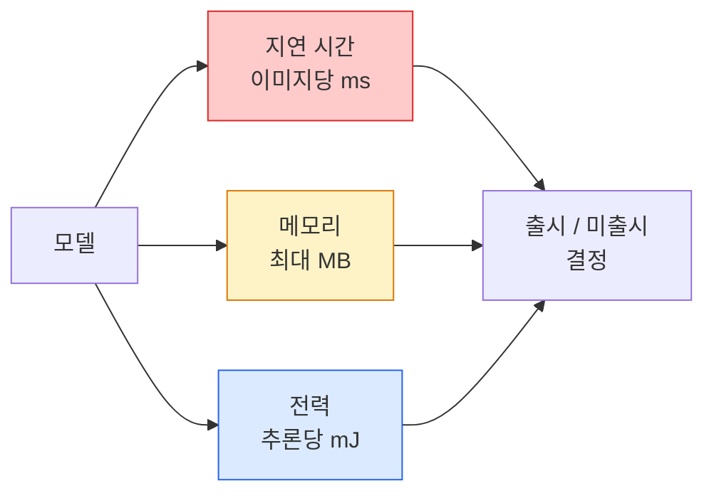

# 실시간 비전 — 엣지 배포

> 엣지 추론은 90% 정확도의 모델을 RAM 2GB 장치에서 30fps로 실행하게 만드는 분야입니다. 정확도 1% 포인트마다 지연 시간 밀리초와 트레이드오프됩니다.

**유형:** 학습 + 실습  
**언어:** Python  
**선수 지식:** Phase 4 Lesson 04 (이미지 분류), Phase 10 Lesson 11 (양자화)  
**소요 시간:** ~75분

## 학습 목표

- 모든 PyTorch 모델의 추론 지연 시간(inference latency), 최대 메모리(peak memory), 처리량(throughput)을 측정하고, FLOPs / 파라미터(parameters) / 지연 시간(latency) 트레이드오프를 분석
- PyTorch의 사후 학습 양자화(post-training quantisation)를 사용하여 비전 모델을 INT8로 양자화하고 정확도 손실(accuracy loss) < 1%임을 검증
- ONNX로 내보내기(export) 및 ONNX Runtime 또는 TensorRT로 컴파일; 가장 흔한 3가지 내보내기 실패 사례와 해결 방법 명명
- 에지 제약 조건(edge constraint) 환경에서 MobileNetV3, EfficientNet-Lite, ConvNeXt-Tiny, MobileViT 중 어떤 모델을 선택할지 설명

## 문제 정의

훈련 시 비전 모델은 부동소수점 연산 괴물입니다. 1억 개의 파라미터, 순전파당 10 GFLOPs, 2GB의 VRAM. 이 중 어느 것도 휴대폰, 차량 인포테인먼트 시스템, 산업용 카메라, 드론에는 적합하지 않습니다. 비전 시스템을 출시하려면 동일한 예측 기능을 100배 더 작은 예산에 맞춰야 합니다.

세 가지 주요 조절 장치가 대부분의 작업을 수행합니다: 모델 선택(동일한 레시피의 더 작은 아키텍처), 양자화(FP32 대신 INT8), 추론 런타임(ONNX Runtime, TensorRT, Core ML, TFLite). 이를 올바르게 설정하는 것이 워크스테이션에서 실행되는 데모와 30달러 카메라 모듈에 탑재되는 제품 간의 차이입니다.

이 강의에서는 먼저 측정 방식을 설정한 후(측정할 수 없는 것은 최적화할 수 없음), 세 가지 조절 장치를 차례로 다룹니다. 목표는 모든 에지 런타임을 배우는 것이 아니라 어떤 레버가 존재하는지, 각 레버가 의도한 대로 작동하는지 확인하는 방법을 아는 것입니다.

## 개념

### 세 가지 예산



- **지연 시간**: p50, p95, p99. p50만 평균하면 실시간 시스템에서 중요한 꼬리 분포를 숨길 수 있음.
- **최대 메모리**: 장치의 최대 사용량, 안정 상태 평균이 아님. 임베디드 타겟에서 OOM(메모리 부족)이 치명적이므로 중요함.
- **전력 / 에너지**: 배터리 구동 장치의 추론당 밀리줄. CPU/GPU 사용률 * 시간으로 대체 측정되는 경우가 많음.

(모델, 지연 시간, 메모리, 정확도) 테이블은 엣지 결정의 기반이 됨. 모든 셀은 워크스테이션이 아닌 타겟 장치에서 측정됨.

### 측정 규약

모든 엣지 프로파일은 다음 세 규칙을 따라야 함:

1. **워밍업**: 측정 전 5-10회의 더미 순방향 패스로 모델을 준비. 차가운 캐시와 JIT 컴파일은 대표성 없는 첫 번째 수치를 생성함.
2. **동기화**: 시간 측정 블록 전후에 `torch.cuda.synchronize()`로 GPU 작업 동기화. 이 과정이 없으면 커널 실행이 아닌 디스패치 시간만 측정됨.
3. **입력 크기 고정**: 프로덕션 해상도로 고정. 224x224에서의 지연 시간은 512x512에서의 지연 시간이 아님.

### 프록시로서의 FLOPs

FLOPs(추론당 부동소수점 연산)는 지연 시간에 대한 저렴하고 장치 독립적인 프록시. 아키텍처 비교에 유용하지만 절대 벽시계 시간으로는 오해의 소지가 있음. FLOPs가 10% 더 많은 모델이 하드웨어 친화적인 연산(깊이별 컨볼루션은 잘 컴파일되지만 큰 7x7 컨볼루션은 그렇지 않음)을 사용하면 실제로 2배 빠를 수 있음.

규칙: 아키텍처 탐색에는 FLOPs를, 배포 결정에는 장치 내 지연 시간을 사용.

### 한 문단으로 요약한 양자화

FP32 가중치와 활성화 함수를 INT8로 대체. 모델 크기는 4배 감소, 메모리 대역폭은 4배 감소, INT8 커널을 가진 하드웨어(모든 현대 모바일 SoC, Tensor Core가 있는 모든 NVIDIA GPU)에서 연산 속도는 2-4배 향상. 비전 작업에서의 정확도 손실은 일반적으로 사후 훈련 정적 양자화로 0.1-1% 포인트.

유형:

- **동적** — 가중치는 INT8로 양자화, 활성화는 FP로 계산. 간단하지만 속도 향상은 작음.
- **정적(사후 훈련)** — 가중치 양자화 + 작은 보정 세트에서 활성화 범위 보정. 동적보다 훨씬 빠름.
- **양자화 인식 훈련(QAT)** — 훈련 중 양자화를 시뮬레이션하여 모델이 이를 학습. 최고 정확도, 레이블된 데이터 필요.

비전의 경우, 사후 훈련 정적 양자화는 5%의 노력으로 95%의 이점을 제공. PTQ의 정확도 손실이 용납되지 않을 때만 QAT 사용.

### 가지치기 및 지식 증류

- **가지치기** — 중요도가 낮은 가중치(크기 기반) 또는 채널(구조화된)을 제거. 과매개변수화된 모델에서는 잘 작동하지만 이미 컴팩트한 아키텍처에는 덜 유용.
- **지식 증류** — 큰 교사의 로짓을 모방하도록 작은 학생을 훈련. 모델 축소로 인한 정확도 손실을 대부분 복구. 프로덕션 엣지 모델의 표준.

### 추론 런타임

- **PyTorch 즉시 실행** — 느림, 배포용이 아님. 개발용으로만 사용.
- **TorchScript** — 레거시. `torch.compile` 및 ONNX 내보내기로 대체됨.
- **ONNX Runtime** — 중립적 런타임. CPU, CUDA, CoreML, TensorRT, OpenVINO 모두 ONNX 공급자 보유. 여기서 시작.
- **TensorRT** — NVIDIA의 컴파일러. NVIDIA GPU(워크스테이션 및 Jetson)에서 최고의 지연 시간. ONNX Runtime과 통합 또는 독립 실행.
- **Core ML** — iOS/macOS용 Apple의 런타임. `.mlmodel` 또는 `.mlpackage` 필요.
- **TFLite** — Android/ARM용 Google의 런타임. `.tflite` 필요.
- **OpenVINO** — Intel의 CPU/VPU용 런타임. `.xml` + `.bin` 필요.

실제 적용: PyTorch -> ONNX로 내보내기 -> 타겟에 맞는 런타임 선택. ONNX는 공통 언어.

### 엣지 아키텍처 선택기

| 예산 | 모델 | 이유 |
|--------|-------|-----|
| < 3M 파라미터 | MobileNetV3-Small | 모든 곳에서 컴파일 가능, 좋은 기준선 |
| 3-10M | EfficientNet-Lite-B0 | TFLite에서 파라미터당 최고 정확도 |
| 10-20M | ConvNeXt-Tiny | CPU 친화적, 파라미터당 최고 정확도 |
| 20-30M | MobileViT-S 또는 EfficientViT | ImageNet 정확도를 가진 트랜스포머 |
| 30-80M | Swin-V2-Tiny | 스택이 윈도우 어텐션을 지원할 경우 |

특별한 이유가 없는 한 이 모든 모델을 INT8로 양자화.

## 구축 방법

### 1단계: 지연 시간 정확히 측정하기

```python
import time
import torch

def measure_latency(model, input_shape, device="cpu", warmup=10, iters=50):
    model = model.to(device).eval()
    x = torch.randn(input_shape, device=device)
    with torch.no_grad():
        for _ in range(warmup):
            model(x)
        if device == "cuda":
            torch.cuda.synchronize()
        times = []
        for _ in range(iters):
            if device == "cuda":
                torch.cuda.synchronize()
            t0 = time.perf_counter()
            model(x)
            if device == "cuda":
                torch.cuda.synchronize()
            times.append((time.perf_counter() - t0) * 1000)
    times.sort()
    return {
        "p50_ms": times[len(times) // 2],
        "p95_ms": times[int(len(times) * 0.95)],
        "p99_ms": times[int(len(times) * 0.99)],
        "mean_ms": sum(times) / len(times),
    }
```

워밍업, 동기화 수행, `time.perf_counter()` 사용. 평균이 아닌 백분위수 보고.

### 2단계: 파라미터 및 FLOP 수 계산

```python
def parameter_count(model):
    return sum(p.numel() for p in model.parameters())

def flops_estimate(model, input_shape):
    """
    Conv/Linear 전용 모델의 대략적인 FLOP 수. 프로덕션 환경에서는 `fvcore` 또는 `ptflops` 사용.
    """
    total = 0
    def conv_hook(m, inp, out):
        nonlocal total
        c_out, c_in, kh, kw = m.weight.shape
        h, w = out.shape[-2:]
        total += 2 * c_in * c_out * kh * kw * h * w
    def linear_hook(m, inp, out):
        nonlocal total
        total += 2 * m.in_features * m.out_features
    hooks = []
    for m in model.modules():
        if isinstance(m, torch.nn.Conv2d):
            hooks.append(m.register_forward_hook(conv_hook))
        elif isinstance(m, torch.nn.Linear):
            hooks.append(m.register_forward_hook(linear_hook))
    model.eval()
    with torch.no_grad():
        model(torch.randn(input_shape))
    for h in hooks:
        h.remove()
    return total
```

실제 프로젝트에서는 `fvcore.nn.FlopCountAnalysis` 또는 `ptflops` 사용. 모든 모듈 유형을 정확히 처리.

### 3단계: 학습 후 정적 양자화

```python
def quantise_ptq(model, calibration_loader, backend="x86"):
    import torch.ao.quantization as tq
    model = model.eval().cpu()
    model.qconfig = tq.get_default_qconfig(backend)
    tq.prepare(model, inplace=True)
    with torch.no_grad():
        for x, _ in calibration_loader:
            model(x)
    tq.convert(model, inplace=True)
    return model
```

3단계: 구성, 준비(옵저버 삽입), 실제 데이터로 캘리브레이션, 변환(퓨전 + 양자화). 모델이 퓨전되어야 함(`Conv -> BN -> ReLU` -> `ConvBnReLU`), `torch.ao.quantization.fuse_modules`가 처리.

### 4단계: ONNX로 내보내기

```python
def export_onnx(model, sample_input, path="model.onnx"):
    model = model.eval()
    torch.onnx.export(
        model,
        sample_input,
        path,
        input_names=["input"],
        output_names=["output"],
        dynamic_axes={"input": {0: "batch"}, "output": {0: "batch"}},
        opset_version=17,
    )
    return path
```

`opset_version=17`은 2026년 기준 안전한 기본값. `dynamic_axes`로 임의의 배치 크기로 ONNX 모델 실행 가능.

### 5단계: 벤치마크 및 비교

```python
import torch.nn as nn
from torchvision.models import mobilenet_v3_small

def compare_regimes():
    model = mobilenet_v3_small(weights=None, num_classes=10)
    params = parameter_count(model)
    flops = flops_estimate(model, (1, 3, 224, 224))
    lat_fp32 = measure_latency(model, (1, 3, 224, 224), device="cpu")
    print(f"FP32 MobileNetV3-Small: {params:,} params  {flops/1e9:.2f} GFLOPs  "
          f"p50={lat_fp32['p50_ms']:.2f}ms  p95={lat_fp32['p95_ms']:.2f}ms")
```

`resnet50`, `efficientnet_v2_s`, `convnext_tiny`에 대해 동일한 함수 실행하면 배포 결정에 필요한 비교 표 생성.

## 사용 방법

프로덕션 스택은 다음 세 가지 경로 중 하나로 수렴됩니다:

- **웹 / 서버리스**: PyTorch -> ONNX -> ONNX Runtime (CPU 또는 CUDA 프로바이더). 가장 쉬우며 대부분의 경우 충분히 좋습니다.
- **NVIDIA 엣지 (Jetson, GPU 서버)**: PyTorch -> ONNX -> TensorRT. 최고의 지연 시간, 가장 큰 엔지니어링 노력.
- **모바일**: PyTorch -> ONNX -> Core ML (iOS) 또는 TFLite (Android). 내보내기 전에 양자화(quantization) 수행.

측정을 위해 `torch-tb-profiler`, `nvprof` / `nsys`, macOS의 Instruments는 계층별(layer-by-layer) 분석을 제공합니다. `benchmark_app` (OpenVINO)와 `trtexec` (TensorRT)는 독립형 CLI 측정값을 제공합니다.

## Ship It

이 레슨은 다음을 생성합니다:

- `outputs/prompt-edge-deployment-planner.md` — 대상 장치 및 지연 시간 SLA를 기반으로 백본(backbone), 양자화(quantization) 전략, 런타임을 선택하는 프롬프트(prompt).
- `outputs/skill-latency-profiler.md` — 워밍업(warmup), 동기화(synchronization), 백분위수(percentiles), 메모리 추적(memory tracking)을 포함한 완전한 지연 시간 벤치마킹 스크립트를 작성하는 스킬(skill).

## 연습 문제

1. **(쉬움)** `resnet18`, `mobilenet_v3_small`, `efficientnet_v2_s`, `convnext_tiny` 모델의 224x224 입력 크기에서 CPU 기준 p50 지연 시간(latency)을 측정하세요. 표를 작성하고 ms당 정확도(accuracy-per-ms)가 가장 우수한 아키텍처를 식별하세요.
2. **(중간)** `mobilenet_v3_small`에 추론 후 정적 양자화(post-training static quantisation)를 적용하세요. CIFAR-10 또는 유사 데이터셋의 검증 세트에서 FP32 대비 INT8 지연 시간과 정확도 손실을 보고하세요.
3. **(어려움)** `convnext_tiny`를 ONNX 형식으로 내보내고, `CPUExecutionProvider`를 사용해 `onnxruntime`에서 실행하세요. PyTorch 즉시 실행(eager) 기준선과 지연 시간을 비교하고, ONNX Runtime이 더 빠른 첫 번째 레이어를 식별한 후 그 이유를 설명하세요.

## 주요 용어

| 용어 | 사람들이 말하는 것 | 실제 의미 |
|------|----------------|----------------------|
| Latency | "얼마나 빠른가" | 입력부터 출력까지의 시간; 평균 대신 p50/p95/p99 백분위수 |
| FLOPs | "모델 크기" | 순전파당 부동소수점 연산량; 계산 비용의 대략적인 대체 지표 |
| INT8 양자화 | "8비트" | FP32 가중치/활성화를 8비트 정수로 대체; ~4배 작고 2-4배 빠름 |
| PTQ | "사후 양자화" | 재학습 없이 훈련된 모델 양자화; 쉽고 일반적으로 충분함 |
| QAT | "양자화 인식 학습" | 학습 중 양자화 시뮬레이션; 최고 정확도, 레이블된 데이터 필요 |
| ONNX | "중립 형식" | 모든 주요 추론 런타임에서 지원하는 모델 교환 형식 |
| TensorRT | "NVIDIA 컴파일러" | ONNX를 NVIDIA GPU용 최적화된 엔진으로 컴파일 |
| Distillation | "교사 -> 학생" | 큰 모델의 로짓을 모방하도록 작은 모델 학습; 손실된 정확도 대부분 복구 |

## 추가 자료

- [EfficientNet (Tan & Le, 2019)](https://arxiv.org/abs/1905.11946) — 효율적인 아키텍처를 위한 복합 스케일링(compound scaling)
- [MobileNetV3 (Howard et al., 2019)](https://arxiv.org/abs/1905.02244) — h-swish 및 squeeze-excite를 활용한 모바일 최적화 아키텍처
- [TensorRT 최적화 실용 가이드 (NVIDIA)](https://developer.nvidia.com/blog/accelerating-model-inference-with-tensorrt-tips-and-best-practices-for-pytorch-users/) — 논문에서 제시된 처리량(throughput) 수치를 실제로 달성하는 방법
- [ONNX Runtime 문서](https://onnxruntime.ai/docs/) — 양자화(quantisation), 그래프 최적화(graph optimisation), 프로바이더 선택(provider selection)