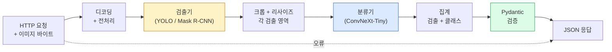

# 완전한 비전 파이프라인 구축 — 캡스톤

> 프로덕션 비전 시스템은 데이터 계약으로 연결된 모델과 규칙들의 체인입니다. 이 단계에서는 이미 모든 구성 요소가 준비되어 있으며, 캡스톤 프로젝트를 통해 이들을 엔드투엔드로 통합합니다.

**유형:** 구축  
**언어:** Python  
**선수 과목:** 4단계 레슨 01-15  
**소요 시간:** ~120분

## 학습 목표

- 객체를 탐지하고 분류하며 구조화된 JSON을 출력하는 프로덕션 비전 파이프라인 설계 — 모든 실패 경로 처리 포함
- 탐지기(Mask R-CNN 또는 YOLO), 분류기(ConvNeXt-Tiny), 데이터 계약(Pydantic)을 하나의 서비스에 통합
- 엔드투엔드 파이프라인 벤치마킹 및 첫 번째 병목 현상 식별 (일반적으로 전처리, 그 다음 탐지기)
- 이미지 업로드를 수락하고 파이프라인을 실행한 후 분류 결과가 포함된 탐지 결과를 반환하는 최소 FastAPI 서비스 배포

## 문제 정의

개별 비전 모델은 유용하지만, 비전 제품은 이러한 모델들의 체인으로 구성됩니다. 소매 진열대 감사는 객체 검출기(detector) + 제품 분류기(classifier) + 가격 OCR(Optical Character Recognition) 파이프라인으로 이루어집니다. 자율주행은 2D 검출기 + 3D 검출기 + 분할기(segmenter) + 추적기(tracker) + 계획기(planner)로 구성됩니다. 의료 사전 검사는 분할기 + 영역 분류기(region classifier) + 임상의 UI(clinician UI)로 이루어집니다.

이러한 체인을 연결하는 작업은 ML 프로토타입과 제품을 구분하는 핵심 요소입니다. 모델 간의 모든 인터페이스는 새로운 버그 발생 지점이 됩니다. 모든 좌표 변환, 정규화, 마스크 크기 조정 작업은 잠재적 실패 후보입니다. 파이프라인의 강도는 가장 약한 인터페이스에 의해 결정됩니다.

이 캡스톤 프로젝트는 최소 실행 가능 파이프라인을 구성합니다: 객체 검출(detection) + 분류(classification) + 구조화 출력(structured output) + 서빙 레이어(serving layer). 4단계의 나머지 모든 요소는 이 기본 구조에 통합됩니다: Mask R-CNN을 YOLOv8로 교체, OCR 헤드 추가, 분할 분기 추가, 추적기 추가 등. 아키텍처는 안정적이며 구성 요소는 교체 가능합니다.

## 개념

### 파이프라인



7단계. 두 모델 단계는 비용이 많이 들며, 나머지 5단계는 버그가 발생하는 곳입니다.

### Pydantic을 활용한 데이터 계약

모든 모델 경계는 타입 객체가 됩니다. 이는 침묵하는 실패를 큰 소리로 바꿉니다.

```
Detection(
    box: tuple[float, float, float, float],   # (x1, y1, x2, y2), 절대 픽셀
    score: float,                              # [0, 1]
    class_id: int,                             # 검출기의 라벨 맵에서 가져옴
    mask: Optional[list[list[int]]],           # RLE 인코딩된 경우 존재
)

PipelineResult(
    image_id: str,
    detections: list[Detection],
    classifications: list[Classification],
    inference_ms: float,
)
```

검출기가 `(x1, y1, x2, y2)` 대신 `(cx, cy, w, h)` 형식으로 박스를 반환할 때, Pydantic의 경계 검증은 실패하며, 이는 다운스트림 크롭이 침묵하며 빈 영역을 반환하는 대신 즉시 문제를 발견할 수 있게 합니다.

### 지연 시간 발생 위치

거의 모든 비전 파이프라인에서 다음 세 가지 사실이 성립합니다:

1. **전처리는 종종 가장 큰 단일 블록입니다.** JPEG 디코딩, 색 공간 변환, 리사이징 — 이들은 CPU 바운드이며 잊기 쉽습니다.
2. **검출기는 GPU 시간을 지배합니다.** GPU 시간의 70-90%는 검출 순전파(forward pass)에 소요됩니다.
3. **후처리(NMS, RLE 인코딩/디코딩)는 GPU에서는 저렴하지만 CPU에서는 비쌉니다.** 항상 실제 타겟으로 프로파일링하세요.

분포를 아는 것이 최적화를 우선순위 목록으로 바꿉니다.

### 실패 모드

- **빈 검출** — 빈 리스트 반환, 충돌하지 않음. 로그 기록.
- **이미지 범위 초과 박스** — 크롭 전 이미지 크기로 클램핑.
- **작은 크롭** — 분류기의 최소 입력보다 작은 박스는 분류 건너뜀.
- **손상된 업로드** — 500이 아닌 특정 오류 코드와 함께 400 응답.
- **모델 로드 실패** — 첫 요청이 아닌 서비스 시작 시 실패.

프로덕션 파이프라인은 실패를 숨기는 일반적인 `try/except`를 작성하지 않고 각각을 처리합니다. 모든 실패는 명명된 코드와 응답을 가집니다.

### 배치 처리

프로덕션 서비스는 여러 클라이언트를 처리합니다. 요청 간 검출 및 분류를 배치 처리하면 처리량이 배가됩니다. 트레이드오프: 배치가 채워질 때까지 기다리는 추가 지연. 일반적인 설정: 최대 20ms 동안 요청 수집, 배치 처리, 응답 분배. `torchserve`와 `triton`은 이를 네이티브로 지원하며, 예측 가능한 부하를 가진 소규모 서비스는 자체 마이크로 배치 처리기를 구현합니다.

## 빌드하기

### 1단계: 데이터 계약

```python
from pydantic import BaseModel, Field
from typing import List, Optional, Tuple

class Detection(BaseModel):
    box: Tuple[float, float, float, float]
    score: float = Field(ge=0, le=1)
    class_id: int = Field(ge=0)
    mask_rle: Optional[str] = None


class Classification(BaseModel):
    detection_index: int
    class_id: int
    class_name: str
    score: float = Field(ge=0, le=1)


class PipelineResult(BaseModel):
    image_id: str
    detections: List[Detection]
    classifications: List[Classification]
    inference_ms: float
```

5초의 코드가 심각한 파이프라인에서 1시간의 디버깅을 절약합니다.

### 2단계: 최소한의 파이프라인 클래스

```python
import time
import numpy as np
import torch
from PIL import Image

class VisionPipeline:
    def __init__(self, detector, classifier, class_names,
                 device="cpu", min_crop=32):
        self.detector = detector.to(device).eval()
        self.classifier = classifier.to(device).eval()
        self.class_names = class_names
        self.device = device
        self.min_crop = min_crop

    def preprocess(self, image):
        """
        image: PIL.Image 또는 np.ndarray (H, W, 3) uint8
        returns: CHW float tensor on device
        """
        if isinstance(image, Image.Image):
            image = np.asarray(image.convert("RGB"))
        tensor = torch.from_numpy(image).permute(2, 0, 1).float() / 255.0
        return tensor.to(self.device)

    @torch.no_grad()
    def detect(self, image_tensor):
        return self.detector([image_tensor])[0]

    @torch.no_grad()
    def classify(self, crops):
        if len(crops) == 0:
            return []
        batch = torch.stack(crops).to(self.device)
        logits = self.classifier(batch)
        probs = logits.softmax(-1)
        scores, cls = probs.max(-1)
        return list(zip(cls.tolist(), scores.tolist()))

    def run(self, image, image_id="anonymous"):
        t0 = time.perf_counter()
        tensor = self.preprocess(image)
        det = self.detect(tensor)

        crops = []
        detections = []
        valid_indices = []
        for i, (box, score, cls) in enumerate(zip(det["boxes"], det["scores"], det["labels"])):
            x1, y1, x2, y2 = [max(0, int(b)) for b in box.tolist()]
            x2 = min(x2, tensor.shape[-1])
            y2 = min(y2, tensor.shape[-2])
            detections.append(Detection(
                box=(x1, y1, x2, y2),
                score=float(score),
                class_id=int(cls),
            ))
            if (x2 - x1) < self.min_crop or (y2 - y1) < self.min_crop:
                continue
            crop = tensor[:, y1:y2, x1:x2]
            crop = torch.nn.functional.interpolate(
                crop.unsqueeze(0),
                size=(224, 224),
                mode="bilinear",
                align_corners=False,
            )[0]
            crops.append(crop)
            valid_indices.append(i)

        class_preds = self.classify(crops)

        classifications = []
        for valid_idx, (cls_id, cls_score) in zip(valid_indices, class_preds):
            classifications.append(Classification(
                detection_index=valid_idx,
                class_id=int(cls_id),
                class_name=self.class_names[cls_id],
                score=float(cls_score),
            ))

        return PipelineResult(
            image_id=image_id,
            detections=detections,
            classifications=classifications,
            inference_ms=(time.perf_counter() - t0) * 1000,
        )
```

모든 인터페이스는 타입이 지정되어 있습니다. 모든 실패 경로에는 특정 처리 결정이 있습니다.

### 3단계: 감지기와 분류기 연결

```python
from torchvision.models.detection import maskrcnn_resnet50_fpn_v2
from torchvision.models import convnext_tiny

# 훈련 없이 현실적인 파이프라인을 위해 ImageNet 사전 훈련 가중치 사용
detector = maskrcnn_resnet50_fpn_v2(weights="DEFAULT")
classifier = convnext_tiny(weights="DEFAULT")
class_names = [f"imagenet_class_{i}" for i in range(1000)]

pipe = VisionPipeline(detector, classifier, class_names)

# 합성 이미지로 테스트
test_image = (np.random.rand(400, 600, 3) * 255).astype(np.uint8)
result = pipe.run(test_image, image_id="demo")
print(result.model_dump_json(indent=2)[:500])
```

### 4단계: FastAPI 서비스

```python
from fastapi import FastAPI, UploadFile, HTTPException
from io import BytesIO

app = FastAPI()
pipe = None  # 시작 시 초기화

@app.on_event("startup")
def load():
    global pipe
    detector = maskrcnn_resnet50_fpn_v2(weights="DEFAULT").eval()
    classifier = convnext_tiny(weights="DEFAULT").eval()
    pipe = VisionPipeline(detector, classifier, class_names=[f"c{i}" for i in range(1000)])

@app.post("/detect")
async def detect_endpoint(file: UploadFile):
    if file.content_type not in {"image/jpeg", "image/png", "image/webp"}:
        raise HTTPException(status_code=400, detail="지원되지 않는 이미지 유형")
    data = await file.read()
    try:
        img = Image.open(BytesIO(data)).convert("RGB")
    except Exception:
        raise HTTPException(status_code=400, detail="이미지 디코딩 불가")
    result = pipe.run(img, image_id=file.filename or "upload")
    return result.model_dump()
```

`uvicorn main:app --host 0.0.0.0 --port 8000`로 실행합니다. `curl -F 'file=@dog.jpg' http://localhost:8000/detect`로 테스트합니다.

### 5단계: 파이프라인 벤치마킹

```python
import time

def benchmark(pipe, num_runs=20, image_size=(400, 600)):
    img = (np.random.rand(*image_size, 3) * 255).astype(np.uint8)
    pipe.run(img)  # 워밍업

    stages = {"preprocess": [], "detect": [], "classify": [], "total": []}
    for _ in range(num_runs):
        t0 = time.perf_counter()
        tensor = pipe.preprocess(img)
        t1 = time.perf_counter()
        det = pipe.detect(tensor)
        t2 = time.perf_counter()
        crops = []
        for box in det["boxes"]:
            x1, y1, x2, y2 = [max(0, int(b)) for b in box.tolist()]
            x2 = min(x2, tensor.shape[-1])
            y2 = min(y2, tensor.shape[-2])
            if (x2 - x1) >= pipe.min_crop and (y2 - y1) >= pipe.min_crop:
                crop = tensor[:, y1:y2, x1:x2]
                crop = torch.nn.functional.interpolate(
                    crop.unsqueeze(0), size=(224, 224), mode="bilinear", align_corners=False
                )[0]
                crops.append(crop)
        pipe.classify(crops)
        t3 = time.perf_counter()
        stages["preprocess"].append((t1 - t0) * 1000)
        stages["detect"].append((t2 - t1) * 1000)
        stages["classify"].append((t3 - t2) * 1000)
        stages["total"].append((t3 - t0) * 1000)

    for stage, times in stages.items():
        times.sort()
        print(f"{stage:12s}  p50={times[len(times)//2]:7.1f} ms  p95={times[int(len(times)*0.95)]:7.1f} ms")
```

CPU에서의 일반적인 출력: 전처리 ~3ms, 감지 300-500ms, 분류 20-40ms, 총 350-550ms. GPU에서는 감지가 20-40ms이며, 전처리와 분류의 상대적 비중이 더 커집니다.

## 사용 방법

프로덕션 템플릿은 다음 구조를 수렴하며 추가 기능을 포함합니다:

- **모델 버전 관리** — 응답에 항상 모델 이름과 가중치 해시를 기록합니다.
- **요청별 추적 ID** — 모든 요청의 각 단계 타이밍을 기록하여 느린 응답과 단계를 연관시킬 수 있습니다.
- **대체 경로** — 분류기 시간 초과 시 전체 요청 실패 대신 분류 없이 감지 결과만 반환합니다.
- **안전 필터** — NSFW(Not Safe For Work) / PII(Personally Identifiable Information) 필터는 분류 후, 응답이 서비스를 떠나기 전에 실행됩니다.
- **배치 엔드포인트** — 대량 처리를 위한 이미지 URL 목록을 받는 `/detect_batch`를 제공합니다.

프로덕션 서빙의 경우, `torchserve`, `Triton Inference Server`, `BentoML`은 배치 처리, 버전 관리, 메트릭, 건강 상태 확인을 기본 제공합니다. `FastAPI` 직접 실행은 프로토타입 및 소규모 제품에 적합합니다.

## Ship It

이 레슨은 다음을 생성합니다:

- `outputs/prompt-vision-service-shape-reviewer.md` — 비전 서비스 코드를 계약/응답 형태(contract/response shape) 위반 여부로 검토하고 첫 번째 치명적인 버그(breaking bug)를 식별하는 프롬프트.
- `outputs/skill-pipeline-budget-planner.md` — 목표 지연 시간(target latency)과 처리량(throughput)이 주어졌을 때, 모든 파이프라인 단계(pipeline stage)에 시간 예산(time budget)을 할당하고 어떤 단계가 예산을 가장 먼저 초과할지(flag) 표시하는 스킬.

## 연습 문제

1. **(쉬움)** 공개 데이터셋의 10개 이미지에 파이프라인을 실행합니다. 단계별 평균 시간과 이미지당 검출 객체 수 분포를 보고하세요.
2. **(중간)** `Detection`에 마스크 출력 필드를 추가하고 RLE(Run-Length Encoding)로 인코딩합니다. 10개 객체가 있는 이미지에서도 JSON이 1MB 미만인지 검증하세요.
3. **(어려움)** 분류기 앞에 마이크로 배치 처리기를 추가합니다: 최대 10ms 동안 크롭 이미지를 수집한 후 한 번의 GPU 호출로 분류하고 요청별 결과를 반환합니다. 초당 5개의 동시 요청 시 처리량 증가율과 추가된 지연 시간을 측정하세요.

## 주요 용어

| 용어 | 사람들이 말하는 표현 | 실제 의미 |
|------|----------------|----------------------|
| 파이프라인 | "시스템" | 각 단계 사이에 타입된 인터페이스를 갖는 전처리, 추론, 후처리 단계의 순차적 체인 |
| 데이터 계약 | "스키마" | 모든 단계 입력/출력이 준수하는 Pydantic/데이터클래스 정의; 경계에서 통합 버그를 잡아냄 |
| 전처리 | "모델 이전" | 디코딩, 색상 변환, 리사이징, 정규화; 일반적으로 가장 큰 CPU 시간 소요 작업 |
| 후처리 | "모델 이후" | NMS(Non-Maximum Suppression), 마스크 리사이징, 임계값 적용, RLE 인코딩; GPU에서는 저렴하지만 CPU에서는 비용이 큼 |
| 마이크로배처 | "수집 후 전달" | 여러 요청을 고정된 창 시간 동안 기다린 후 단일 배치 추론 패스를 실행하는 집계기 |
| 트레이스 ID | "요청 ID" | 모든 단계에서 로깅되는 요청별 식별자; 느린 요청을 종단간 추적할 수 있게 함 |
| 실패 코드 | "명명된 오류" | 일반적인 500 오류 대신 실패 클래스별 특정 오류 코드; 클라이언트 재시도 로직 활성화 |
| 헬스 체크 | "준비성 프로브" | 서비스가 응답 가능한지 보고하는 저렴한 엔드포인트; 로드 밸런서가 이에 의존함 |

## 추가 학습 자료

- [Full Stack Deep Learning — 모델 배포](https://fullstackdeeplearning.com/course/2022/lecture-5-deployment/) — 프로덕션 ML 배포에 대한 표준 개요
- [BentoML 문서](https://docs.bentoml.com) — 배치 처리, 버전 관리, 메트릭 기능을 갖춘 서빙 프레임워크
- [torchserve 문서](https://pytorch.org/serve/) — PyTorch 공식 서빙 라이브러리
- [NVIDIA Triton 추론 서버](https://developer.nvidia.com/triton-inference-server) — 배치 처리 및 멀티모델 지원이 가능한 고대역폭 서빙 솔루션