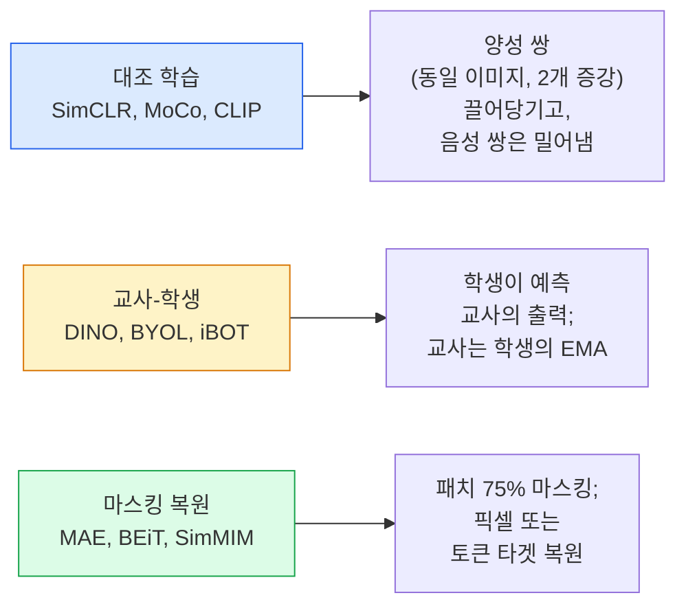

# 자기 지도 학습 비전 — SimCLR, DINO, MAE

> 라벨은 지도 학습의 병목 현상입니다. 자기 지도 사전 학습은 이를 제거합니다: 1억 개의 라벨 없는 이미지로 시각적 특징을 학습한 후, 1만 개의 라벨 있는 이미지로 파인튜닝합니다.

**유형:** 학습 + 구현  
**언어:** Python  
**선수 지식:** 4단계 04강 (이미지 분류), 4단계 14강 (ViT)  
**소요 시간:** ~75분

## 학습 목표

- 세 가지 주요 자기 지도 학습 계열(대조 학습(SimCLR), 교사-학생(DINO), 마스킹 복원(MAE))을 추적하고 각각이 최적화하는 대상을 설명
- InfoNCE 손실 함수를 처음부터 구현하고, 배치 크기 512는 작동하지만 32는 실패하는 이유 설명
- MAE의 75% 마스킹 비율이 임의적이지 않은 이유와 텍스트 분야 BERT의 15% 마스킹과의 차이점 설명
- DINOv2 또는 MAE ImageNet 체크포인트를 활용한 선형 탐색(linear probing) 및 제로샷 검색(zero-shot retrieval) 수행

## 문제 정의

지도 학습용 ImageNet에는 130만 개의 라벨이 지정된 이미지가 있으며, 이를 주석 처리하는 데 약 1,000만 달러의 비용이 소요되었습니다. 의료 및 산업용 데이터셋은 더 작으면서도 라벨링 비용이 훨씬 더 비쌉니다. 모든 컴퓨터 비전 팀은 다음과 같은 질문을 합니다: 저렴한 라벨이 없는 데이터(YouTube 프레임, 웹 크롤, 웹캠 영상, 위성 촬영 이미지 등)로 사전 학습한 후 소규모 라벨 데이터로 파인튜닝할 수 있을까요?

자기 지도 학습(self-supervised learning)이 그 해답입니다. LAION 또는 JFT 데이터셋으로 학습된 최신 자기 지도 학습 ViT(Vision Transformer)는 파인튜닝 시 지도 학습용 ImageNet 정확도를 달성하거나 능가합니다. 또한 지도 학습 기반 사전 학습보다 다운스트림 작업(검출, 분할, 깊이 추정 등)에 더 잘 전이됩니다. DINOv2(Meta, 2023)와 MAE(Meta, 2022)는 현재 전이 가능한 비전 특징 추출을 위한 프로덕션 기본 모델입니다.

개념적 전환은 사전 학습 과제(pretext task)가 다운스트림 작업과 동일할 필요가 없다는 것입니다. 중요한 것은 모델이 유용한 특징을 학습하도록 강제하는 것입니다. 그레이스케일 이미지의 색상 예측, 이미지 회전 후 회전 각도 분류, 패치 마스킹 및 재구성 등 다양한 방법이 작동했습니다. 확장 가능한 세 가지 접근 방식은 대조 학습(contrastive learning), 교사-학생 지식 증류(teacher-student distillation), 마스킹 재구성(masked reconstruction)입니다.

## 개념

### 세 가지 계열



### 대조 학습 (SimCLR)

하나의 이미지에 두 가지 무작위 증강을 적용하여 두 개의 뷰를 생성합니다. 두 뷰를 동일한 인코더와 프로젝션 헤드에 통과시킵니다. "이 두 임베딩은 가까워야 한다"와 "이 임베딩은 배치 내 다른 모든 이미지의 임베딩과 멀어야 한다"는 손실 함수를 최소화합니다.

```
배치당 2N 뷰 중 양성 쌍 (z_i, z_j)에 대한 손실:

   L_ij = -log( exp(sim(z_i, z_j) / tau) / sum_k in batch \ {i} exp(sim(z_i, z_k) / tau) )

sim = 코사인 유사도
tau = 온도 (0.1 표준)
```

이것은 InfoNCE 손실입니다. 양성 쌍당 많은 음성 쌍이 필요하므로 배치 크기가 중요합니다 — SimCLR은 512-8192가 필요합니다. MoCo는 과거 배치의 모멘텀 큐를 도입하여 음성 쌍 수를 배치 크기와 분리했습니다.

### 교사-학생 (DINO)

동일한 아키텍처를 가진 두 네트워크: 학생과 교사. 교사는 학생 가중치의 지수 이동 평균(EMA)입니다. 둘 다 이미지의 증강된 뷰를 봅니다. 학생의 출력은 교사의 출력과 일치하도록 훈련됩니다 — 명시적인 음성 쌍이 없습니다.

```
loss = CE( student_output(view_1),  teacher_output(view_2) )
     + CE( student_output(view_2),  teacher_output(view_1) )

teacher_weights = m * teacher_weights + (1 - m) * student_weights   (m ≈ 0.996)
```

"상수를 예측하여 붕괴하지 않는" 이유: 교사의 출력은 중심화(차원별 평균 빼기)되고 예리화(작은 온도로 나누기)됩니다. 중심화는 한 차원이 지배하는 것을 방지하고, 예리화는 출력이 균일해지는 것을 방지합니다.

DINO는 1억 4,200만 개의 선별된 이미지로 확장한 DINOv2입니다. 결과적인 특징은 제로샷 시각 검색 및 밀집 예측에서 현재 SOTA입니다.

### 마스킹 복원 (MAE)

ViT 입력의 75% 패치를 마스킹합니다. 보이는 25%만 인코더에 통과시킵니다. 작은 디코더는 인코더 출력과 마스킹된 위치의 마스크 토큰을 받아 마스킹된 패치의 픽셀을 복원하도록 훈련됩니다.

```
인코더:  보이는 25% 패치 -> 특징
디코더:  특징 + 마스킹된 위치의 마스크 토큰 -> 복원된 픽셀
손실:     마스킹된 패치에 대해 복원된 픽셀과 원본 픽셀 간 MSE
```

MAE를 작동하게 하는 주요 설계 선택:

- **75% 마스킹 비율** — 높음. 인코더가 의미적 특징을 학습하도록 강제합니다; 25% 복원은 너무 간단할 수 있습니다 (이웃 픽셀이 매우 상관되어 CNN이 정확히 복원할 수 있음).
- **비대칭 인코더/디코더** — 큰 ViT 인코더는 보이는 패치만 처리합니다; 작은 디코더(8층, 512차원)가 복원을 담당합니다. 순진한 BEiT보다 3배 빠른 사전 훈련.
- **픽셀 공간 복원 타겟** — BEiT의 토큰화 타겟보다 간단하며 ViT에서 더 잘 작동합니다.

사전 훈련 후 디코더를 버립니다. 인코더가 특징 추출기입니다.

### 왜 75%인가, 15%가 아닌가

BERT는 토큰의 15%를 마스킹합니다. MAE는 75%를 마스킹합니다. 차이는 정보 밀도입니다.

- 자연어는 토큰당 높은 엔트로피를 가집니다. 토큰의 15%를 예측하는 것은 여전히 어렵습니다. 각 마스킹된 위치에는 많은 타당한 완성형이 있기 때문입니다.
- 이미지 패치는 엔트로피가 낮습니다 — 마스킹되지 않은 이웃이 마스킹된 패치의 픽셀을 거의 정확히 결정할 수 있습니다. 의미적 이해를 요구하려면 공격적으로 마스킹해야 합니다.

75%는 단순한 공간적 보간으로 작업을 해결할 수 없을 정도로 높습니다; 인코더는 이미지 내용을 표현해야 합니다.

### 선형 프로브 평가

자기 지도 사전 훈련 후 표준 평가는 **선형 프로브**입니다: 인코더를 고정하고 ImageNet 라벨에 대해 단일 선형 분류기를 훈련합니다. Top-1 정확도를 보고합니다.

- SimCLR ResNet-50: ~71% (2020)
- DINO ViT-S/16: ~77% (2021)
- MAE ViT-L/16: ~76% (2022)
- DINOv2 ViT-g/14: ~86% (2023)

선형 프로브는 특징 품질의 순수한 측정치입니다; 파인튜닝은 일반적으로 2-5포인트를 추가하지만 헤드 재훈련의 효과도 혼합됩니다.

## 구축

### 단계 1: 두 뷰 증강 파이프라인

```python
import torch
import torchvision.transforms as T

two_view_train = lambda: T.Compose([
    T.RandomResizedCrop(96, scale=(0.2, 1.0)),
    T.RandomHorizontalFlip(),
    T.ColorJitter(0.4, 0.4, 0.4, 0.1),
    T.RandomGrayscale(p=0.2),
    T.ToTensor(),
])


class TwoViewDataset(torch.utils.data.Dataset):
    def __init__(self, base):
        self.base = base
        self.aug = two_view_train()

    def __len__(self):
        return len(self.base)

    def __getitem__(self, i):
        img, _ = self.base[i]
        v1 = self.aug(img)
        v2 = self.aug(img)
        return v1, v2
```

각 `__getitem__`은 동일한 이미지의 두 증강 뷰를 반환합니다. 라벨은 필요하지 않습니다.

### 단계 2: InfoNCE 손실

```python
import torch.nn.functional as F

def info_nce(z1, z2, tau=0.1):
    """
    z1, z2: (N, D) L2-정규화된 임베딩(paired views)
    """
    N, D = z1.shape
    z = torch.cat([z1, z2], dim=0)  # (2N, D)
    sim = z @ z.T / tau              # (2N, 2N)

    mask = torch.eye(2 * N, dtype=torch.bool, device=z.device)
    sim = sim.masked_fill(mask, float("-inf"))

    targets = torch.cat([torch.arange(N, 2 * N), torch.arange(0, N)]).to(z.device)
    return F.cross_entropy(sim, targets)
```

호출 전 임베딩을 L2-정규화하세요. `tau=0.1`은 SimCLR 기본값입니다. 낮을수록 손실이 더 날카로워지고 더 많은 네거티브 샘플이 필요합니다.

### 단계 3: InfoNCE 검증

```python
z1 = F.normalize(torch.randn(16, 32), dim=-1)
z2 = z1.clone()
loss_same = info_nce(z1, z2, tau=0.1).item()
z2_random = F.normalize(torch.randn(16, 32), dim=-1)
loss_random = info_nce(z1, z2_random, tau=0.1).item()
print(f"동일한 페어로 InfoNCE:  {loss_same:.3f}")
print(f"랜덤 페어로 InfoNCE:     {loss_random:.3f}")
```

동일한 페어는 낮은 손실(큰 배치와 낮은 온도에서는 0에 가까움)을, 랜덤 페어는 16-페어 배치에서 `log(2N-1) = ~log(31) = ~3.4`에 가까운 값을 가져야 합니다.

### 단계 4: MAE 스타일 마스킹

```python
def random_mask_indices(num_patches, mask_ratio=0.75, seed=0):
    g = torch.Generator().manual_seed(seed)
    n_keep = int(num_patches * (1 - mask_ratio))
    perm = torch.randperm(num_patches, generator=g)
    visible = perm[:n_keep]
    masked = perm[n_keep:]
    return visible.sort().values, masked.sort().values


num_patches = 196
visible, masked = random_mask_indices(num_patches, mask_ratio=0.75)
print(f"보이는 패치: {len(visible)} / {num_patches}")
print(f"가려진 패치:  {len(masked)} / {num_patches}")
```

간단하고 빠르며 주어진 시드에 대해 결정론적입니다. 실제 MAE 구현에서는 이를 배치 처리하고 샘플별 마스크를 유지합니다.

## 사용 방법

DINOv2는 2026년 프로덕션 표준입니다:

```python
import torch
from transformers import AutoImageProcessor, AutoModel

processor = AutoImageProcessor.from_pretrained("facebook/dinov2-base")
model = AutoModel.from_pretrained("facebook/dinov2-base")
model.eval()

# 제로샷 검색을 위한 이미지별 임베딩
with torch.no_grad():
    inputs = processor(images=[pil_image], return_tensors="pt")
    outputs = model(**inputs)
    embedding = outputs.last_hidden_state[:, 0]  # CLS 토큰
```

결과로 나오는 768차원 임베딩은 현대 이미지 검색, 밀집 대응(dense correspondence), 제로샷 전이(transfer) 파이프라인의 백본입니다. 다운스트림 작업에 대한 파인튜닝(fine-tuning)은 선형 헤드(linear head) 이상의 복잡한 구조가 거의 필요하지 않습니다.

이미지-텍스트 임베딩의 경우 SigLIP 또는 OpenCLIP이 동등한 선택지이며, MAE 스타일 파인튜닝의 경우 `timm` 리포지토리에 모든 MAE 체크포인트(checkpoint)가 포함되어 있습니다.

## Ship It

이 레슨은 다음을 생성합니다:

- `outputs/prompt-ssl-pretraining-picker.md` — 데이터셋 크기, 컴퓨팅 자원, 다운스트림 작업에 따라 SimCLR / MAE / DINOv2를 선택하는 프롬프트.
- `outputs/skill-linear-probe-runner.md` — 고정된 인코더 + 레이블된 데이터셋에 대한 선형 프로브 평가를 작성하는 스킬.

## 연습 문제

1. **(쉬움)** 잘 정렬된 임베딩에 대해 온도(temperature)를 감소시킬 때 InfoNCE 손실이 감소하고, 무작위 임베딩에 대해 온도를 감소시킬 때 손실이 증가함을 검증하세요. `tau in [0.05, 0.1, 0.2, 0.5]` 대 손실 그래프를 생성하세요.
2. **(중간)** DINO 스타일의 중심 버퍼(centre buffer)를 구현하세요. 중심화(centring)가 없을 때 학생 모델이 몇 에포크 내에 상수 벡터로 붕괴(collapse)함을 보여주세요.
3. **(어려움)** Lesson 10의 TinyUNet을 백본(backbone)으로 사용하여 CIFAR-100에서 MAE를 학습시키세요. 10, 50, 200 에포크에서의 선형 평가(linear-probe) 정확도를 보고하세요. 동일한 1,000개 이미지 부분 집합에서 MAE 사전 학습 선형 평가가 처음부터 학습한 지도 학습 선형 평가를 능가함을 보여주세요.

## 핵심 용어

| 용어 | 사람들이 말하는 것 | 실제 의미 |
|------|----------------|----------------------|
| 자기 지도 학습(Self-supervised) | "라벨 없는" | 라벨이 없는 데이터에서 유용한 표현을 생성하는 사전 과제(pretext task) |
| 사전 과제(Pretext task) | "가짜 과제" | SSL 동안 사용되는 목표(패치 재구성, 뷰 일치); 사전 훈련 후 폐기됨 |
| 선형 프로브(Linear probe) | "고정된 인코더 + 선형 헤드" | 표준 SSL 평가: 고정된 특징 위에 선형 분류기만 훈련 |
| InfoNCE | "대조 손실(Contrastive loss)" | 코사인 유사도에 대한 softmax; 양성 쌍이 타깃 클래스, 나머지는 음성 샘플 |
| EMA 교사(EMA teacher) | "이동 평균 교사" | 학생 모델의 가중치에 대한 지수 이동 평균인 교사; BYOL, MoCo, DINO에서 사용 |
| 마스크 비율(Mask ratio) | "%의 패치 숨김" | MAE 동안 마스킹되는 패치 비율; 비전 75%, 텍스트 15% |
| 표현 붕괴(Representation collapse) | "상수 출력" | 인코더가 모든 입력에 대해 상수 벡터를 출력하는 SSL 실패; 중심화, 예리화, 음성 샘플로 방지 |
| DINOv2 | "프로덕션 SSL 백본" | Meta의 2023 자기 지도 학습 ViT; 2026년 기준 가장 강력한 범용 이미지 특징 |

## 추가 자료

- [SimCLR (Chen et al., 2020)](https://arxiv.org/abs/2002.05709) — 대조 학습(contrastive learning) 참고 논문
- [DINO (Caron et al., 2021)](https://arxiv.org/abs/2104.14294) — 모멘텀(momentum), 중심화(centring), 예리화(sharpening)를 활용한 교사-학생 모델
- [MAE (He et al., 2022)](https://arxiv.org/abs/2111.06377) — ViT용 마스킹 오토인코더(masked autoencoder) 사전 학습
- [DINOv2 (Oquab et al., 2023)](https://arxiv.org/abs/2304.07193) — 자기 지도식 ViT를 프로덕션 피처로 확장