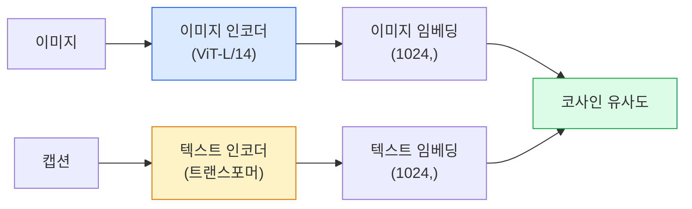

# 오픈-보캐블러리 비전 — CLIP

> 이미지 인코더와 텍스트 인코더를 함께 훈련시켜 매칭되는 (이미지, 캡션) 쌍이 공유 공간의 동일한 지점에 위치하도록 하는 것이 전체 트릭입니다.

**유형:** 구축 + 활용  
**언어:** Python  
**사전 요구 사항:** 4단계 14강 (ViT), 4단계 17강 (자기 지도 학습)  
**소요 시간:** ~45분

## 학습 목표

- CLIP의 두 개의 타워(two-tower) 아키텍처와 대조 학습(contrastive training) 목적 함수 설명  
- 사전 학습된 CLIP(또는 SigLIP)을 사용하여 작업별 학습 없이 제로샷 분류 수행  
- 제로샷 분류 직접 구현: 클래스 프롬프트 인코딩, 코사인 유사도(cosine similarity) 계산, argmax 적용  
- CLIP, SigLIP, OpenCLIP, LLaVA/LLaMA-vision 모델 구분 — 2026년 기준 각 모델의 용도 설명

## 문제 정의

전통적인 분류기(traditional classifier)는 폐쇄 어휘(closed-vocabulary) 방식을 사용합니다: 1000개 클래스의 ImageNet 모델은 오직 1000개의 레이블만 예측할 수 있습니다. 새로운 범주가 추가될 때마다 레이블된 데이터와 재학습된 헤드(head)가 필요합니다.

CLIP(Radford et al., OpenAI 2021)은 웹에서 수집한 4억 개의 (이미지, 캡션) 쌍으로 학습하면, 순수 자연어(natural language)로 설명된 어떤 범주 집합으로도 분류가 가능한 모델을 생성할 수 있음을 보여주었습니다. 새로운 클래스를 추가하려면 단순히 문장을 작성하면 됩니다.

이러한 기능 — 제로샷 전이(zero-shot transfer) — 때문에 모든 현대 비전 시스템은 CLIP 계열 체크포인트(checkpoint)로 시작합니다. 검출(Grounding DINO, OWL-ViT), 분할(CLIPSeg, SAM), 검색, 콘텐츠 조정, VLM(Vision-Language Model), 텍스트-이미지 생성 등 모든 분야가 CLIP 스타일의 결합 임베딩(joint embeddings)을 기반으로 구축됩니다.

## 개념

### 두 개의 타워



두 인코더는 동일한 임베딩 차원(CLIP-B/32의 경우 512, CLIP-L/14의 경우 1024)으로 선형 투영을 수행합니다. L2 정규화 후 코사인 유사도를 계산합니다.

### 목적 함수

N개의 (이미지, 캡션) 쌍으로 구성된 배치에서 NxN 유사도 행렬을 생성합니다. 대각선(매칭 쌍)의 유사도는 높게, 비대각선(비매칭 쌍)의 유사도는 낮게 훈련시킵니다.

```
sim_matrix = image_embeddings @ text_embeddings.T / tau

loss_i2t = cross_entropy(sim_matrix,       targets=arange(N))
loss_t2i = cross_entropy(sim_matrix.T,     targets=arange(N))
loss = (loss_i2t + loss_t2i) / 2
```

이미지-텍스트 및 텍스트-이미지 검색이 모두 작동해야 하므로 대칭적입니다. `tau`(온도)는 일반적으로 스칼라 매개변수로 학습되며, 초기값은 0.07입니다.

### SigLIP: 개선된 손실 함수

SigLIP(Zhai et al., 2023)은 소프트맥스를 페어별 시그모이드로 대체했습니다:

```
loss = mean over pairs of log(1 + exp(-y_ij * sim_ij))
y_ij = +1 if matching, -1 otherwise
```

페어별 손실 함수는 CLIP에 필요한 배치 수준 정규화를 제거합니다. SigLIP은 작은 배치 크기에서도 잘 훈련되며, 동일한 데이터에서 CLIP을 능가하거나 동등한 성능을 보입니다.

### 제로샷 분류

훈련된 CLIP을 사용하는 방법:

1. 각 클래스에 대해 프롬프트 생성: "a photo of a {class}".
2. 텍스트 인코더로 모든 클래스 프롬프트 인코딩 → `T` 형태 (C, d).
3. 테스트 이미지 인코딩 → `I` 형태 (1, d).
4. 유사도 = `I @ T.T` 형태 (1, C).
5. argmax → 예측 클래스.

프롬프트 엔지니어링이 중요합니다. OpenAI는 ImageNet용 80개의 프롬프트 템플릿을 공개했습니다("a photo of a {}", "a blurry photo of a {}", "a sketch of a {}", ...). 클래스당 모든 템플릿의 임베딩을 평균화하면 1-3% 추가 정확도 향상을 얻을 수 있습니다.

### 2026년 CLIP 스타일 모델의 활용 분야

- **제로샷 분류** — 직접 활용.
- **이미지 검색** — 모든 이미지를 한 번 인코딩하고, 추론 시 쿼리 임베딩.
- **텍스트 조건부 검출** — Grounding DINO, OWL-ViT는 검출기 주변에 CLIP 텍스트 타워를 래핑.
- **텍스트 조건부 분할** — CLIPSeg; SAM은 CLIP을 통해 텍스트 프롬프트 입력을 사용.
- **VLMs** — LLaVA, Qwen-VL, InternVL은 CLIP 계열 비전 인코더를 LLM에 연결.
- **텍스트-이미지 생성** — Stable Diffusion, DALL-E 3는 CLIP 텍스트 임베딩을 조건으로 사용.

공유 임베딩 공간이 확보되면 모든 비전+언어 작업은 거리 계산 문제로 변환됩니다.

## 구축 방법

### 1단계: 작은 두 개의 타워 모델

실제 CLIP은 ViT + 트랜스포머입니다. 이 레슨에서는 훈련 신호가 CPU에서 보이도록 사전 추출된 특성 위에 작은 MLP를 사용합니다.

```python
import torch
import torch.nn as nn
import torch.nn.functional as F


class TwoTower(nn.Module):
    def __init__(self, img_in=128, txt_in=64, emb=64):
        super().__init__()
        self.image_proj = nn.Sequential(nn.Linear(img_in, 128), nn.ReLU(), nn.Linear(128, emb))
        self.text_proj = nn.Sequential(nn.Linear(txt_in, 128), nn.ReLU(), nn.Linear(128, emb))
        self.logit_scale = nn.Parameter(torch.ones([]) * 2.6592)  # ln(1/0.07)

    def forward(self, img_feats, txt_feats):
        i = F.normalize(self.image_proj(img_feats), dim=-1)
        t = F.normalize(self.text_proj(txt_feats), dim=-1)
        return i, t, self.logit_scale.exp()
```

두 개의 프로젝션, 공유 차원 출력, 학습된 온도. 실제 CLIP API와 동일한 형태입니다.

### 2단계: 대조 손실

```python
def clip_loss(image_emb, text_emb, logit_scale):
    N = image_emb.size(0)
    sim = logit_scale * image_emb @ text_emb.T
    targets = torch.arange(N, device=sim.device)
    l_i = F.cross_entropy(sim, targets)
    l_t = F.cross_entropy(sim.T, targets)
    return (l_i + l_t) / 2
```

대칭적. 높은 `logit_scale` = 더 날카로운 소프트맥스 = 더 확신하지만 불안정성 위험.

### 3단계: 제로샷 분류기

```python
@torch.no_grad()
def zero_shot_classify(model, image_feats, class_text_feats, class_names):
    """
    image_feats:      (N, img_in)
    class_text_feats: (C, txt_in)   클래스당 하나의 평균 임베딩
    """
    i = F.normalize(model.image_proj(image_feats), dim=-1)
    t = F.normalize(model.text_proj(class_text_feats), dim=-1)
    sim = i @ t.T
    pred = sim.argmax(dim=-1)
    return [class_names[p] for p in pred.tolist()]
```

단계별 한 줄. 이는 프로덕션 CLIP 체크포인트에서 사용되는 정확한 제로샷 절차입니다.

### 4단계: 검증

```python
torch.manual_seed(0)
model = TwoTower()

img = torch.randn(8, 128)
txt = torch.randn(8, 64)
i, t, scale = model(img, txt)
loss = clip_loss(i, t, scale)
print(f"배치 크기: {i.size(0)}   손실: {loss.item():.3f}")
```

무작위 초기화 모델의 경우 손실은 `log(N) = log(8) = 2.08`에 가까워야 합니다. 아직 구조가 학습되지 않았을 때 대칭적 교차 엔트로피 대상입니다.

## 사용 방법

OpenCLIP은 2026년 커뮤니티 기본 모델입니다:

```python
import open_clip
import torch
from PIL import Image

model, _, preprocess = open_clip.create_model_and_transforms("ViT-B-32", pretrained="laion2b_s34b_b79k")
tokenizer = open_clip.get_tokenizer("ViT-B-32")

image = preprocess(Image.open("dog.jpg")).unsqueeze(0)
text = tokenizer(["a photo of a dog", "a photo of a cat", "a photo of a car"])

with torch.no_grad():
    image_features = model.encode_image(image)
    text_features = model.encode_text(text)
    image_features = image_features / image_features.norm(dim=-1, keepdim=True)
    text_features = text_features / text_features.norm(dim=-1, keepdim=True)
    probs = (100.0 * image_features @ text_features.T).softmax(dim=-1)

print(probs)
```

SigLIP은 더 최신이며, 소규모 학습에서 더 잘 훈련되고, 새로운 작업에 선호됩니다: `google/siglip-base-patch16-224`. Hugging Face는 두 모델을 모두 제공합니다.

## Ship It

이 레슨은 다음을 생성합니다:

- `outputs/prompt-zero-shot-class-picker.md` — 클래스 목록과 도메인이 주어졌을 때 제로샷 CLIP을 위한 클래스 템플릿을 설계하는 프롬프트.
- `outputs/skill-image-text-retriever.md` — 모든 CLIP 체크포인트로 이미지 임베딩 인덱스를 구축하는 스킬. 텍스트 쿼리 및 이미지 쿼리 지원.

## 연습 문제

1. **(쉬움)** 사전 훈련된 OpenCLIP ViT-B/32를 사용하여 80-템플릿 프롬프트 세트로 CIFAR-10에 대한 제로샷 분류를 수행하세요. Top-1 정확도를 보고하세요; 약 85-90% 정도여야 합니다.
2. **(중간)** 동일한 CIFAR-10 작업에서 단일 템플릿("a photo of a {}")과 80-템플릿 평균 임베딩을 비교하세요. 성능 차이를 정량화하고 템플릿이 왜 도움이 되는지 설명하세요.
3. **(어려움)** 제로샷 이미지 검색 인덱스를 구축하세요: CLIP으로 1,000개 이미지를 임베딩하고 FAISS 인덱스를 생성한 후 자연어 설명으로 쿼리하세요. 직접 작성한 20개의 테스트 쿼리에 대한 검색 recall@5를 보고하세요.

## 주요 용어

| 용어 | 사람들이 말하는 것 | 실제 의미 |
|------|----------------|----------------------|
| Two-tower | "Dual encoder" | 별도의 이미지 및 텍스트 인코더로 공유 차원 투영 헤드에서 종료 |
| Zero-shot | "No task-specific training" | 추론 시 텍스트로만 설명된 클래스로 분류; 라벨 미사용 |
| Temperature / logit_scale | "tau" | 소프트맥스 전 유사도 행렬을 스케일링하는 학습된 스칼라 값 |
| Prompt template | "A photo of a {}" | 클래스 이름 주변의 자연어 래퍼; 여러 템플릿 평균화는 제로샷 정확도 향상 |
| CLIP | "Image+text model" | 2021년 OpenAI 모델; 2026년 분야의 어휘 |
| SigLIP | "Sigmoid CLIP" | 소프트맥스를 페어별 시그모이드로 교체; 소규모 배치에서 더 나은 학습 |
| OpenCLIP | "Open reproduction" | LAION에서 커뮤니티 학습 CLIP 변형; 오픈소스 파이프라인의 기본 프로덕션 |
| VLM | "Vision-language model" | CLIP 계열 인코더 + LLM, 이미지에 대한 질문 답변 학습 |

## 추가 자료

- [CLIP: 자연어 감독으로부터 전이 가능한 시각 모델 학습 (Radford et al., 2021)](https://arxiv.org/abs/2103.00020)
- [SigLIP: 언어-이미지 사전 학습을 위한 시그모이드 손실 함수 (Zhai et al., 2023)](https://arxiv.org/abs/2303.15343)
- [OpenCLIP](https://github.com/mlfoundations/open_clip) — 커뮤니티 코드베이스
- [DINOv2 vs CLIP vs MAE: 특징 비교](https://huggingface.co/blog/dinov2) — 병렬 사용 사례 비교 가이드 (HF)