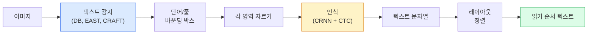

# OCR & 문서 이해

> OCR은 세 단계 파이프라인입니다 — 텍스트 박스 감지, 문자 인식, 그리고 배치. 모든 현대 OCR 시스템은 이 단계들을 재정렬하거나 병합합니다.

**유형:** 학습 + 활용  
**언어:** Python  
**선수 지식:** 4단계 06강 (감지), 7단계 02강 (셀프 어텐션)  
**소요 시간:** ~45분

## 학습 목표

- 전통적인 OCR 파이프라인(검출 -> 인식 -> 레이아웃)과 현대적인 엔드투엔드 대안(Donut, Qwen-VL-OCR)을 추적
- 시퀀스-투-시퀀스 OCR 훈련을 위한 CTC(Connectionist Temporal Classification) 손실 함수 구현
- 훈련 없이 PaddleOCR 또는 EasyOCR을 활용한 프로덕션 문서 파싱
- OCR, 레이아웃 파싱, 문서 이해 구분 및 작업별 적절한 도구 선택

## 문제 정의

텍스트로 가득 찬 이미지는 도처에 있습니다: 영수증, 송장, 신분증, 스캔된 책, 양식, 화이트보드, 간판, 스크린샷 등. 이러한 이미지에서 구조화된 데이터(단순히 문자가 아닌 "이것은 총 금액입니다"와 같은 정보)를 추출하는 것은 가장 높은 가치를 지닌 응용 비전 문제 중 하나입니다.

이 분야는 세 가지 기술 계층으로 나뉩니다:

1. **OCR(Optical Character Recognition) 자체**: 픽셀을 텍스트로 변환합니다.
2. **레이아웃 파싱**: OCR 출력을 영역(제목, 본문, 표, 헤더 등)으로 그룹화합니다.
3. **문서 이해**: 레이아웃에서 구조화된 필드("invoice_total = $42.50")를 추출합니다.

각 계층에는 고전적인 접근법과 현대적인 접근법이 있으며, "이미지에서 텍스트를 원한다"와 "이 영수증에서 총 금액을 추출해야 한다" 사이의 격차는 대부분의 팀이 인식하는 것보다 훨씬 큽니다.

## 개념

### 고전적인 파이프라인



- **텍스트 감지**는 줄 또는 단어별 사각형(quadrilaterals)을 생성합니다.
- **인식**은 각 영역을 고정 높이로 자르고, CNN + BiLSTM + CTC를 실행하여 문자 시퀀스를 생성합니다.
- **레이아웃**은 읽기 순서(라틴어의 경우 위에서 아래, 왼쪽에서 오른쪽; 아랍어, 일본어는 다름)를 재구성합니다.

### CTC 한 단락 설명

OCR 인식은 고정 길이 특징 맵에서 가변 길이 시퀀스를 생성합니다. CTC(Graves et al., 2006)는 문자 수준 정렬 없이도 이를 훈련할 수 있게 합니다. 모델은 모든 시간 단계에서 (어휘 + 공백)에 대한 분포를 출력하며, CTC 손실은 반복 병합 및 공백 제거 후 목표 텍스트로 축소되는 모든 정렬에 대해 주변화(marginalise)합니다.

```
원시 출력: "h h h _ _ e e l l _ l l o _ _"
반복 병합 및 공백 제거 후: "hello"
```

CTC는 2015년 CRNN이 작동한 이유이며, 2026년에도 대부분의 프로덕션 OCR 모델을 훈련시키는 핵심 기술입니다.

### 현대식 엔드투엔드 모델

- **Donut** (Kim et al., 2022) — ViT 인코더 + 텍스트 디코더; 이미지를 읽고 JSON을 직접 출력합니다. 텍스트 감지기, 레이아웃 모듈이 필요 없습니다.
- **TrOCR** — ViT + 트랜스포머 디코더를 사용한 줄 수준 OCR.
- **Qwen-VL-OCR / InternVL** — OCR 작업에 파인튜닝된 전체 비전-언어 모델; 2026년 복잡한 문서에서 최고 정확도를 기록했습니다.
- **PaddleOCR** — 성숙한 프로덕션 패키지의 고전적 DB + CRNN 파이프라인; 여전히 오픈소스 핵심 도구입니다.

엔드투엔드 모델은 더 많은 데이터와 계산 리소스가 필요하지만 다단계 파이프라인의 오류 누적을 방지합니다.

### 레이아웃 파싱

구조화된 문서의 경우, 각 영역에 레이블을 지정하는 레이아웃 감지기(LayoutLMv3, DocLayNet)를 실행합니다: 제목, 단락, 그림, 표, 각주. 읽기 순서는 "레이아웃 순서대로 영역을 반복하고 연결"하는 방식이 됩니다.

폼의 경우 **키-값 추출** 모델(시각적으로 풍부한 문서에는 Donut, 일반 스캔에는 LayoutLMv3)을 사용합니다. 이미지 + 감지된 텍스트 + 위치를 입력으로 받아 구조화된 키-값 쌍을 예측합니다.

### 평가 지표

- **문자 오류율(CER)** — 레벤슈타인 거리 / 참조 텍스트 길이. 낮을수록 좋습니다. 프로덕션 목표: 깨끗한 스캔에서 < 2%.
- **단어 오류율(WER)** — 단어 수준에서의 동일한 계산.
- **구조화된 필드의 F1** — 키-값 작업용; `{invoice_total: 42.50}`이 정확히 나타나는지 측정합니다.
- **JSON 편집 거리** — 엔드투엔드 문서 파싱용; Donut 논문에서 정규화된 트리 편집 거리를 도입했습니다.

## 구축 방법

### 1단계: CTC 손실 + 탐욕적 디코더

```python
import torch
import torch.nn as nn
import torch.nn.functional as F


def ctc_loss(log_probs, targets, input_lengths, target_lengths, blank=0):
    """
    log_probs:      (T, N, C) blank(0)를 포함한 어휘 집합에 대한 log-softmax
    targets:        (N, S) 정수 타겟 (blank 없음)
    input_lengths:  (N,) 샘플별 사용된 시간 단계
    target_lengths: (N,) 샘플별 타겟 길이
    """
    return F.ctc_loss(log_probs, targets, input_lengths, target_lengths,
                      blank=blank, reduction="mean", zero_infinity=True)


def greedy_ctc_decode(log_probs, blank=0):
    """
    log_probs: (T, N, C) log-softmax
    반환: 인덱스 시퀀스 리스트 (blank 제거, 반복 병합)
    """
    preds = log_probs.argmax(dim=-1).transpose(0, 1).cpu().tolist()
    out = []
    for seq in preds:
        decoded = []
        prev = None
        for idx in seq:
            if idx != prev and idx != blank:
                decoded.append(idx)
            prev = idx
        out.append(decoded)
    return out
```

`F.ctc_loss`는 사용 가능한 경우 효율적인 CuDNN 구현을 사용합니다. 탐욕적 디코더는 빔 탐색보다 간단하며 일반적으로 1% 이내의 CER 차이를 보입니다.

### 2단계: 소형 CRNN 인식기

라인 OCR을 위한 최소 CNN + 양방향 LSTM.

```python
class TinyCRNN(nn.Module):
    def __init__(self, vocab_size=40, hidden=128, feat=32):
        super().__init__()
        self.cnn = nn.Sequential(
            nn.Conv2d(1, feat, 3, 1, 1), nn.BatchNorm2d(feat), nn.ReLU(inplace=True),
            nn.MaxPool2d(2),
            nn.Conv2d(feat, feat * 2, 3, 1, 1), nn.BatchNorm2d(feat * 2), nn.ReLU(inplace=True),
            nn.MaxPool2d(2),
            nn.Conv2d(feat * 2, feat * 4, 3, 1, 1), nn.BatchNorm2d(feat * 4), nn.ReLU(inplace=True),
            nn.MaxPool2d((2, 1)),
            nn.Conv2d(feat * 4, feat * 4, 3, 1, 1), nn.BatchNorm2d(feat * 4), nn.ReLU(inplace=True),
            nn.MaxPool2d((2, 1)),
        )
        self.rnn = nn.LSTM(feat * 4, hidden, bidirectional=True, batch_first=True)
        self.head = nn.Linear(hidden * 2, vocab_size)

    def forward(self, x):
        # x: (N, 1, H, W)
        f = self.cnn(x)                # (N, C, H', W')
        f = f.mean(dim=2).transpose(1, 2)  # (N, W', C)
        h, _ = self.rnn(f)
        return F.log_softmax(self.head(h).transpose(0, 1), dim=-1)  # (W', N, vocab)
```

고정 높이 입력(CNN이 높이를 1로 최대 풀링). 너비는 CTC의 시간 차원입니다.

### 3단계: 합성 OCR

엔드투엔드 테스트를 위한 흰색 배경의 검은색 숫자 문자열 생성.

```python
import numpy as np

def synthetic_line(text, height=32, char_width=16):
    W = char_width * len(text)
    img = np.ones((height, W), dtype=np.float32)
    for i, c in enumerate(text):
        x = i * char_width
        shade = 0.0 if c.isalnum() else 0.5
        img[6:height - 6, x + 2:x + char_width - 2] = shade
    return img


def build_batch(strings, vocab):
    H = 32
    W = 16 * max(len(s) for s in strings)
    imgs = np.ones((len(strings), 1, H, W), dtype=np.float32)
    target_lengths = []
    targets = []
    for i, s in enumerate(strings):
        imgs[i, 0, :, :16 * len(s)] = synthetic_line(s)
        ids = [vocab.index(c) for c in s]
        targets.extend(ids)
        target_lengths.append(len(ids))
    return torch.from_numpy(imgs), torch.tensor(targets), torch.tensor(target_lengths)


vocab = ["_"] + list("0123456789abcdefghijklmnopqrstuvwxyz")
imgs, targets, lengths = build_batch(["hello", "world"], vocab)
print(f"images: {imgs.shape}   targets: {targets.shape}   lengths: {lengths.tolist()}")
```

실제 OCR 데이터셋은 폰트, 노이즈, 회전, 블러, 색상을 추가합니다. 위의 파이프라인은 동일합니다.

### 4단계: 학습 스케치

```python
model = TinyCRNN(vocab_size=len(vocab))
opt = torch.optim.Adam(model.parameters(), lr=1e-3)

for step in range(200):
    strings = ["abc" + str(step % 10)] * 4 + ["xyz" + str((step + 1) % 10)] * 4
    imgs, targets, target_lens = build_batch(strings, vocab)
    log_probs = model(imgs)  # (W', 8, vocab)
    input_lens = torch.full((8,), log_probs.size(0), dtype=torch.long)
    loss = ctc_loss(log_probs, targets, input_lens, target_lens, blank=0)
    opt.zero_grad(); loss.backward(); opt.step()
```

손실은 이 간단한 합성 데이터에서 200단계 동안 ~3에서 ~0.2로 감소해야 합니다.

## 사용 방법

세 가지 프로덕션 경로:

- **PaddleOCR** — 성숙하고 빠르며 다국어 지원. 한 줄 사용법: `paddleocr.PaddleOCR(lang="en").ocr(image_path)`.
- **EasyOCR** — Python 네이티브, 다국어 지원, PyTorch 백본.
- **Tesseract** — 클래식; 모델이 어려움을 겪는 오래된 스캔 문서에 여전히 유용.

엔드투엔드 문서 파싱에는 Donut 또는 VLM을 사용하세요:

```python
from transformers import DonutProcessor, VisionEncoderDecoderModel

processor = DonutProcessor.from_pretrained("naver-clova-ix/donut-base-finetuned-cord-v2")
model = VisionEncoderDecoderModel.from_pretrained("naver-clova-ix/donut-base-finetuned-cord-v2")
```

영수증, 송장, 반복 구조가 있는 양식의 경우 Donut을 파인튜닝(fine-tuning)하세요. 임의 문서나 추론이 필요한 OCR의 경우 Qwen-VL-OCR 같은 VLM이 현재 기본 선택입니다.

## Ship It

이 레슨은 다음을 생성합니다:

- `outputs/prompt-ocr-stack-picker.md` — 문서 유형, 언어, 구조에 따라 Tesseract / PaddleOCR / Donut / VLM-OCR을 선택하는 프롬프트.
- `outputs/skill-ctc-decoder.md` — 길이 정규화를 포함한 그리디 및 빔 서치 CTC 디코더를 처음부터 작성하는 기술(skill).

## 연습 문제

1. **(쉬움)** TinyCRNN을 5자리 무작위 숫자 문자열에 대해 500 스텝 동안 학습시켜 보세요. 검증 세트에서 CER(문자 오류율)을 보고하세요.
2. **(중간)** 탐욕적 디코딩(greedy decoding)을 빔 서치(beam_width=5)로 대체하세요. CER 변화량을 보고하세요. 빔 서치가 더 나은 성능을 보이는 입력은 어떤 경우인가요?
3. **(어려움)** 20개의 영수증 세트에 PaddleOCR을 적용하고, 라인 아이템을 추출한 후 {item_name, price} 쌍에 대해 수작업으로 라벨링된 정답(ground truth) 대비 F1 점수를 계산하세요.

## 주요 용어

| 용어 | 사람들이 말하는 것 | 실제 의미 |
|------|----------------|----------------------|
| OCR | "픽셀에서 텍스트" | 이미지 영역을 문자 시퀀스로 변환 |
| CTC | "정렬 없는 손실" | 타임스텝별 레이블 없이 시퀀스 모델 학습; 정렬에 대한 주변화(marginalisation) 수행 |
| CRNN | "클래식 OCR 모델" | 컨볼루션 특징 추출기 + BiLSTM + CTC; 2015년 기준 모델로 여전히 프로덕션에서 사용 |
| Donut | "엔드투엔드 OCR" | ViT 인코더 + 텍스트 디코더; 이미지에서 직접 JSON 출력 |
| 레이아웃 파싱 | "영역 찾기" | 문서 내 제목/표/그림/문단 영역 검출 및 라벨링 |
| 읽기 순서 | "텍스트 시퀀스" | 인식된 영역을 문장 순서로 정렬; 라틴 계열은 간단, 혼합 레이아웃은 복잡 |
| CER / WER | "오류율" | 문자 또는 단어 단위에서 레벤슈타인 거리 / 참조 길이 |
| VLM-OCR | "읽는 LLM" | OCR 작업을 위해 훈련되거나 프롬프트되는 비전-언어 모델; 복잡한 문서에서 현재 SOTA |

## 추가 자료

- [CRNN (Shi et al., 2015)](https://arxiv.org/abs/1507.05717) — 원본 CNN+RNN+CTC 아키텍처
- [CTC (Graves et al., 2006)](https://www.cs.toronto.edu/~graves/icml_2006.pdf) — 원본 CTC 논문; 알고리즘 아이디어로 가득 차 있음
- [Donut (Kim et al., 2022)](https://arxiv.org/abs/2111.15664) — OCR-free 문서 이해 트랜스포머
- [PaddleOCR](https://github.com/PaddlePaddle/PaddleOCR) — 오픈소스 프로덕션 OCR 스택