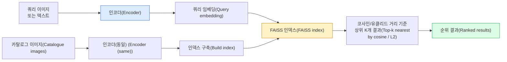

# 이미지 검색 & 메트릭 학습

> 검색 시스템은 임베딩 공간에서의 거리에 따라 후보들을 순위 매깁니다. 메트릭 학습은 해당 공간을 형성하여 거리가 원하는 의미를 갖도록 하는 학문입니다.

**유형:** 구축
**언어:** Python
**사전 요구 사항:** Phase 4 Lesson 14 (ViT), Phase 4 Lesson 18 (CLIP)
**소요 시간:** ~45분

## 학습 목표

- 트리플렛(triplet), 대조(contrastive), 프록시 기반(proxy-based) 메트릭 학습 손실 함수를 설명하고 주어진 데이터셋에 적합한 방법을 선택
- L2 정규화(L2-normalization)와 코사인 유사도(cosine similarity)를 올바르게 구현하고 "동일 항목(same item)"과 "동일 클래스(same class)" 검색 간 차이 분석
- FAISS 인덱스 구축, 텍스트 및 이미지 기반 쿼리 수행, 홀드아웃 쿼리 세트에 대한 recall@K 보고
- DINOv2, CLIP, SigLIP을 즉시 사용 가능한 임베딩 백본(embedding backbone)으로 활용하고 각 모델의 강점 파악

## 문제 정의

검색(Retrieval)은 프로덕션 비전 시스템의 핵심 요소입니다: 중복 검출, 역방향 이미지 검색, 시각적 검색("유사 제품 찾기"), 얼굴 재식별, 감시를 위한 사람 재식별, 전자상거래를 위한 인스턴스 수준 매칭 등. 제품 관련 질문은 항상 동일합니다: "이 쿼리 이미지가 주어졌을 때, 내 카탈로그를 순위별로 정렬해 주세요."

두 가지 설계 결정이 전체 시스템을 형성합니다. **임베딩(embedding)** — 어떤 모델이 벡터를 생성하는지. **인덱스(index)** — 대규모로 최근접 이웃을 어떻게 찾을지. 2026년 현재 이 두 요소는 표준화된 기술(DINOv2 임베딩, FAISS 인덱스)이 되었지만, 이로 인해 요구 수준이 높아졌습니다: 어려운 부분은 애플리케이션에 맞는 *유사성의 기준*을 정의한 후, 임베딩 공간을 조정하여 거리가 이 기준과 일치하도록 만드는 것입니다.

이러한 조정이 바로 **메트릭 러닝(metric learning)**입니다. 이는 작지만 높은 영향력을 가진 분야입니다.

## 개념

### 검색(Retrieval) 개요



### 네 가지 손실 함수(Loss) 패밀리

| 손실 함수(Loss) | 필요 조건(Requires) | 장점(Pros) | 단점(Cons) |
|----------------|---------------------|------------|------------|
| **대비(Contrastive)** | (앵커, 긍정) + 부정 샘플 | 간단함, 모든 쌍 라벨과 호환 | 많은 부정 샘플 없이 수렴 느림 |
| **트리플렛(Triplet)** | (앵커, 긍정, 부정) | 직관적, 마진 직접 제어 | 하드 트리플렛 마이닝 비용 큼 |
| **NT-Xent / InfoNCE** | 쌍 + 배치 내 부정 샘플 | 대규모 배치 확장 가능 | 큰 배치 또는 모멘텀 큐 필요 |
| **프록시 기반(ProxyNCA)** | 클래스 라벨만 | 빠름, 안정적, 마이닝 불필요 | 소규모 데이터셋에서 프록시 과적합 가능 |

대부분의 프로덕션 사용 사례에서는 사전 훈련된 백본(pretrained backbone)으로 시작하고, 테스트 세트에서 기본 임베딩(off-the-shelf embeddings) 성능이 부족할 때만 메트릭 학습 파인튜닝을 추가하세요.

### 트리플렛 손실(Triplet loss) 공식

```
L = max(0, ||f(a) - f(p)||^2 - ||f(a) - f(n)||^2 + margin)
```

앵커 `a`를 긍정 샘플 `p`에 가깝게, 부정 샘플 `n`에서 멀리 밀어내며, `margin`으로 간격을 보장합니다. 3개 이미지 구조는 모든 유사도 순서(similarity ordering)로 일반화됩니다.

마이닝(Mining) 중요: 쉬운 트리플렛(`n`이 이미 `a`에서 먼 경우)은 손실 0을 기여하며, 하드 트리플렛만 네트워크를 학습시킵니다. 세미-하드 마이닝(`n`이 `p`보다 멀지만 마진 내 있는 경우)은 2016년 FaceNet 레시피이며 여전히 널리 사용됩니다.

### 코사인 유사도(Cosine similarity) vs L2

두 가지 메트릭, 두 가지 관례:

- **코사인**: 벡터 간 각도. L2 정규화된 임베딩 필요.
- **L2**: 유클리드 거리. 원시 또는 정규화된 임베딩에서 작동하지만, 일반적으로 L2 정규화 + 제곱 L2와 함께 사용.

대부분의 현대 네트워크에서는 두 메트릭이 동등합니다: `||a - b||^2 = 2 - 2 cos(a, b)` (단, `||a|| = ||b|| = 1`). 임베딩 훈련과 일치하는 관례를 선택하세요. 혼용하면 "가장 가까운"의 의미가 달라집니다.

### Recall@K

표준 검색 메트릭:

```
recall@K = 쿼리 중 최소 한 개의 정답 매칭이 상위 K개 결과에 있는 비율
```

recall@1, @5, @10을 나란히 보고하세요. recall@10이 0.95 이상이지만 recall@1이 0.5 미만인 경우, 임베딩 공간 구조는 적절하지만 순위가 노이즈가 많음을 의미합니다. 더 긴 파인튜닝 또는 재순위(re-ranking) 단계를 시도해 보세요.

중복 검출에서는 모든 오탐이 사용자 노출 오류이므로 precision@K가 더 중요합니다. 시각적 검색에서는 recall@K가 제품 신호입니다.

### FAISS 한 단락 설명

Facebook AI Similarity Search. 최근접 이웃 검색의 사실상의 라이브러리. 세 가지 인덱스 선택:

- `IndexFlatIP` / `IndexFlatL2` — 무차별 대입, 정확, 훈련 불필요. ~100만 개 벡터까지 사용.
- `IndexIVFFlat` — K개 셀로 분할, 가장 가까운 몇 개 셀만 검색. 근사, 빠름, 훈련 데이터 필요.
- `IndexHNSW` — 그래프 기반, 많은 쿼리에 가장 빠름, 인덱스 크기 큼.

10만 개 벡터에는 코사인 유사도 기준 `IndexFlatIP`를 권장합니다. 1천만 개에는 `IndexIVFFlat`을, 1억 개 이상 + 제품 양자화(`IndexIVFPQ`)를 결합하세요.

### 인스턴스 수준(Instance-level) vs 범주 수준(Category-level) 검색

같은 이름이지만 매우 다른 두 문제:

- **범주 수준** — "내 카탈로그에서 고양이 찾기." 클래스 조건부 유사도; CLIP/DINOv2 기본 임베딩이 잘 작동.
- **인스턴스 수준** — "내 카탈로그에서 *이 정확한 제품* 찾기." 시각적으로 유사한 동일 클래스 객체 간 세밀한 판별 필요; 기본 임베딩 성능 부족; 메트릭 학습 파인튜닝 중요.

모델 선택 전 항상 어떤 문제를 해결하는지 확인하세요.

## 구축 방법

### 1단계: Triplet 손실

```python
import torch
import torch.nn.functional as F

def triplet_loss(anchor, positive, negative, margin=0.2):
    d_ap = F.pairwise_distance(anchor, positive, p=2)
    d_an = F.pairwise_distance(anchor, negative, p=2)
    return F.relu(d_ap - d_an + margin).mean()
```

한 줄로 구현. L2 정규화된 임베딩 또는 원시 임베딩에서 작동.

### 2단계: 반-하드 마이닝

임베딩 배치와 레이블이 주어졌을 때, 각 앵커에 대해 가장 어려운 반-하드 네거티브를 찾습니다.

```python
def semi_hard_negatives(emb, labels, margin=0.2):
    dist = torch.cdist(emb, emb)
    same_class = labels[:, None] == labels[None, :]
    diff_class = ~same_class
    N = emb.size(0)

    positives = dist.clone()
    positives[~same_class] = float("-inf")
    positives.fill_diagonal_(float("-inf"))
    pos_idx = positives.argmax(dim=1)

    semi_hard = dist.clone()
    semi_hard[same_class] = float("inf")
    d_ap = dist[torch.arange(N), pos_idx].unsqueeze(1)
    semi_hard[dist <= d_ap] = float("inf")
    neg_idx = semi_hard.argmin(dim=1)

    fallback_mask = semi_hard[torch.arange(N), neg_idx] == float("inf")
    if fallback_mask.any():
        hardest = dist.clone()
        hardest[same_class] = float("inf")
        neg_idx = torch.where(fallback_mask, hardest.argmin(dim=1), neg_idx)
    return pos_idx, neg_idx
```

각 앵커는 클래스 내 가장 어려운 포지티브와 포지티브보다 멀리 있지만 마진 내에 있는 반-하드 네거티브를 얻습니다.

### 3단계: Recall@K

```python
def recall_at_k(query_emb, gallery_emb, query_labels, gallery_labels, k=1):
    sim = query_emb @ gallery_emb.T
    _, top_k = sim.topk(k, dim=-1)
    matches = (gallery_labels[top_k] == query_labels[:, None]).any(dim=-1)
    return matches.float().mean().item()
```

L2 정규화된 임베딩에서 내적 기준 Top-k는 코사인 기준 Top-k와 동일. 최소 한 개의 올바른 이웃을 가진 쿼리의 평균 비율을 보고합니다.

### 4단계: 통합

```python
import torch
import torch.nn as nn
from torch.optim import Adam

class Encoder(nn.Module):
    def __init__(self, in_dim=128, emb_dim=64):
        super().__init__()
        self.net = nn.Sequential(
            nn.Linear(in_dim, 128), nn.ReLU(),
            nn.Linear(128, emb_dim),
        )

    def forward(self, x):
        return F.normalize(self.net(x), dim=-1)

torch.manual_seed(0)
num_classes = 6
protos = F.normalize(torch.randn(num_classes, 128), dim=-1)

def sample_batch(bs=32):
    labels = torch.randint(0, num_classes, (bs,))
    x = protos[labels] + 0.15 * torch.randn(bs, 128)
    return x, labels

enc = Encoder()
opt = Adam(enc.parameters(), lr=3e-3)

for step in range(200):
    x, y = sample_batch(32)
    emb = enc(x)
    pos_idx, neg_idx = semi_hard_negatives(emb, y)
    loss = triplet_loss(emb, emb[pos_idx], emb[neg_idx])
    opt.zero_grad(); loss.backward(); opt.step()
```

수백 스텝 후 임베딩 클러스터는 클래스당 하나의 클러스터를 형성합니다.

## 사용 방법

2026년 프로덕션 스택:

- **DINOv2 + FAISS** — 범용 시각 검색. 바로 사용 가능(off-the-shelf).
- **CLIP + FAISS** — 쿼리가 텍스트인 경우.
- **파인튜닝된 DINOv2 + FAISS** — 인스턴스 수준 검색, 얼굴 재식별(face re-ID), 패션, 전자상거래.
- **Milvus / Weaviate / Qdrant** — FAISS 또는 HNSW를 기반으로 한 관리형 벡터 데이터베이스 래퍼.

SOTA(최첨단) 인스턴스 검색을 위한 레시피: DINOv2 백본(backbone)에 임베딩 헤드(embedding head) 추가, 인스턴스 라벨이 지정된 쌍에 대해 트리플렛(triplet) 또는 InfoNCE 손실 함수로 파인튜닝(fine-tuning), FAISS에 인덱싱.

## Ship It

이 레슨은 다음을 생성합니다:

- `outputs/prompt-retrieval-loss-picker.md` — 주어진 검색 문제에 대해 triplet / InfoNCE / ProxyNCA 중 적절한 손실 함수를 선택하는 프롬프트.
- `outputs/skill-recall-at-k-runner.md` — train/val/gallery 분할과 적절한 데이터 계약을 기반으로 recall@K를 위한 깔끔한 평가 하네스를 작성하는 스킬.

## 연습 문제

1. **(쉬움)** 위의 장난감 예제를 실행합니다. 훈련 전후의 임베딩을 PCA로 시각화하여 6개의 클러스터가 형성되는 것을 확인합니다.
2. **(중간)** ProxyNCA 손실 구현을 추가합니다: 클래스당 하나의 학습된 "프록시"를 사용하고, 코사인 유사도에 표준 교차 엔트로피(cross-entropy)를 적용합니다. 장난감 데이터에서 트라이플릿 손실(triplet loss) 대비 수렴 속도를 비교합니다.
3. **(어려움)** ImageNet 검증 이미지 1,000장을 가져와 HuggingFace를 통해 DINOv2로 임베딩하고, FAISS 플랫 인덱스를 구축한 후 다음을 보고합니다:
   - 동일한 이미지를 쿼리로 사용했을 때의 recall@{1, 5, 10} (1.0이어야 함)
   - ImageNet 라벨을 그라운드 트루스로 사용하는 홀드아웃 분할에 대한 recall@{1, 5, 10}

## 주요 용어

| 용어 | 사람들이 말하는 것 | 실제 의미 |
|------|-------------------|-----------|
| 메트릭 학습(Metric learning) | "공간을 형성하라" | 인코더를 훈련시켜 출력 공간에서의 거리가 목표 유사성을 반영하도록 하는 것 |
| 트리플렛 손실(Triplet loss) | "당기고 밀어내라" | L = max(0, d(a, p) - d(a, n) + margin); 표준 메트릭 학습 손실 함수 |
| 세미-하드 마이닝(Semi-hard mining) | "유용한 네거티브" | 앵커에서 포지티브보다 멀지만 마진 내에 있는 네거티브; 경험적으로 가장 유익한 샘플 |
| 프록시 기반 손실(Proxy-based loss) | "클래스 프로토타입" | 클래스당 하나의 학습된 프록시; 프록시와의 유사도에 대한 크로스-엔트로피; 페어 마이닝 불필요 |
| Recall@K | "Top-K 적중률" | 상위 K개 결과 중 최소 한 개의 정답이 있는 쿼리의 비율 |
| 인스턴스 검색(Instance retrieval) | "이 정확한 것을 찾아라" | 세밀한 매칭; 오프-더-셸프 특징은 일반적으로 성능이 낮음 |
| FAISS | "NN 라이브러리" | Facebook의 최근접 이웃 라이브러리; 정확한 및 근사 인덱스 지원 |
| HNSW | "그래프 인덱스" | 계층적 탐색 가능 소형 세계; 작은 메모리 오버헤드로 빠른 근사 최근접 이웃 검색 |

## 추가 자료

- [FaceNet: 얼굴 인식을 위한 통합 임베딩 (Schroff et al., 2015)](https://arxiv.org/abs/1503.03832) — 트리플렛 손실(triplet loss) / 세미-하드 마이닝(semi-hard mining) 논문
- [사람 재식별을 위한 트리플렛 손실 방어 (Hermans et al., 2017)](https://arxiv.org/abs/1703.07737) — 트리플렛 파인튜닝(fine-tuning) 실용 가이드
- [FAISS 문서](https://github.com/facebookresearch/faiss/wiki) — 모든 인덱스, 모든 트레이드오프(trade-off)
- [SMoT: 메트릭 학습 분류 체계 (Kim et al., 2021)](https://arxiv.org/abs/2010.06927) — 현대 손실 함수(loss function) 및 상호 연결성 조사