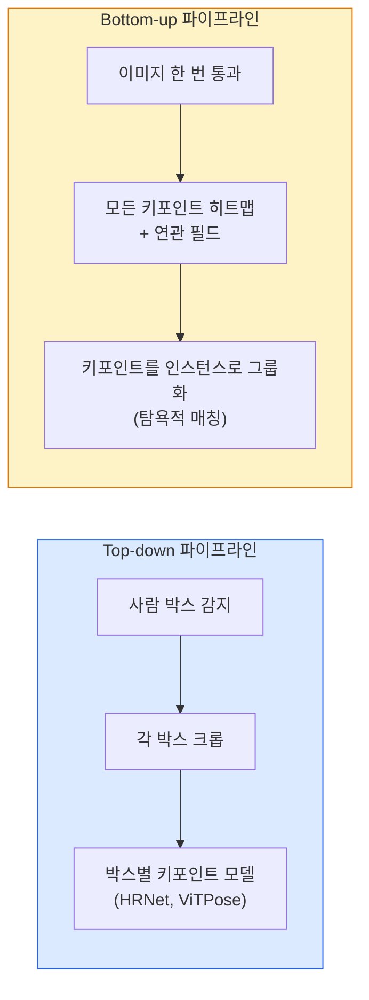

# 키포인트 검출 & 포즈 추정

> 포즈는 정렬된 키포인트들의 집합입니다. 키포인트 검출기는 히트맵 회귀 모델입니다. 나머지는 모두 관리 작업입니다.

**유형:** 구현
**언어:** Python
**사전 요구 사항:** Phase 4 Lesson 06 (검출), Phase 4 Lesson 07 (U-Net)
**소요 시간:** ~45분

## 학습 목표

- **탑다운(top-down)**과 **바텀업(bottom-up)** 포즈 추정 방식을 구분하고 각각이 사용되는 경우를 설명
- **가우시안-퍼-키포인트(Gaussian-per-keypoint)** 타겟을 사용해 K개의 키포인트에 대한 히트맵(heatmap)을 회귀하고 추론 시 키포인트 좌표를 추출
- **파트 어피니티 필드(Part Affinity Fields, PAFs)**를 설명하고 바텀업 파이프라인이 키포인트를 인스턴스(instance)로 연관짓는 방법 이해
- **MediaPipe Pose** 또는 **MMPose**를 사용해 프로덕션 키포인트 추정을 수행하고 출력 형식 이해

## 문제 정의

키포인트 작업은 다양한 이름으로 불립니다: 인간 포즈(17개 신체 관절), 얼굴 랜드마크(68개 또는 478개 점), 손(21개 점), 동물 포즈, 로봇 물체 포즈, 의료 해부학 랜드마크. 이 모든 작업은 동일한 구조를 공유합니다: 객체 상의 K개의 이산 점을 감지하고 이들의 (x, y) 좌표를 출력합니다.

포즈 추정은 모션 캡처, 피트니스 앱, 스포츠 분석, 제스처 제어, 애니메이션, AR 착용, 로봇 그리핑의 기반 기술입니다. 2D 케이스는 성숙한 반면, 3D 포즈(단일 카메라에서 세계 좌표계 상의 관절 위치 추정)는 현재 연구 최전선에 있습니다.

공학적 문제는 확장성입니다. 단일 이미지, 단일 인물 포즈는 20ms 문제이나, 군중 속 다중 인물 포즈를 30fps로 처리하는 것은 다른 아키텍처가 필요한 별개의 문제입니다.

## 개념

### Top-down vs bottom-up



- **Top-down** — 사람을 먼저 감지한 후 각 크롭에 대해 개인별 키포인트 모델을 실행합니다. 가장 높은 정확도를 제공하며, 사람 수에 따라 선형적으로 확장됩니다.
- **Bottom-up** — 한 번의 순전파로 모든 키포인트와 연관 필드를 예측한 후 그룹화합니다. 군중 크기와 무관하게 일정한 시간이 소요됩니다.

Top-down(HRNet, ViTPose)은 정확도 리더이며, bottom-up(OpenPose, HigherHRNet)은 혼잡한 장면에서의 처리량 리더입니다.

### 히트맵 회귀

`(x, y)`를 직접 회귀하는 대신, 각 키포인트에 대해 실제 위치를 중심으로 가우시안 블롭이 있는 `H x W` 히트맵을 예측합니다.

```
target[k, y, x] = exp(-((x - cx_k)^2 + (y - cy_k)^2) / (2 sigma^2))
```

추론 시 각 히트맵의 argmax가 예측된 키포인트 위치입니다.

히트맵이 직접 회귀보다 효과적인 이유: 네트워크의 공간 구조(컨볼루션 특징 맵)가 공간 출력과 자연스럽게 정렬됩니다. 가우시안 타겟은 정규화 효과도 제공합니다 — 작은 위치 오차가 0이 아닌 작은 손실을 생성합니다.

### 서브픽셀 위치 추정

Argmax는 정수 좌표를 제공합니다. 서브픽셀 정밀도를 위해 argmax와 이웃에 포물선을 피팅하거나, 잘 알려진 오프셋 `(dx, dy) = 0.25 * (heatmap[y, x+1] - heatmap[y, x-1], ...)` 방향을 사용합니다.

### 파트 어피니티 필드(PAFs)

Bottom-up 연관을 위한 OpenPose의 기법입니다. 연결된 키포인트 쌍(예: 왼쪽 어깨에서 왼쪽 팔꿈치)마다, 한 키포인트에서 다른 키포인트를 가리키는 단위 벡터를 인코딩하는 2채널 필드를 예측합니다. 어깨를 해당 팔꿈치와 연관하려면 후보 쌍을 연결하는 선을 따라 PAF를 적분합니다. 적분 값이 가장 높은 쌍이 매칭됩니다.

```
각 연결(limb)에 대해:
  PAF 채널: 2 (단위 벡터 x, y)
  선 적분: 샘플 포인트에서 (PAF . 선 방향)의 합
  높은 적분 값 = 강한 매칭
```

사람별 크롭 없이도 임의의 군중 크기에 확장 가능한 우아한 방법입니다.

### COCO 키포인트

표준 바디 포즈 데이터셋: 사람당 17개 키포인트, PCK(Percentage of Correct Keypoints) 및 OKS(Object Keypoint Similarity)를 메트릭으로 사용합니다. OKS는 키포인트 버전의 IoU이며, COCO mAP@OKS가 보고되는 지표입니다.

### 2D vs 3D

- **2D 포즈** — 이미지 좌표; 프로덕션 품질로 해결됨(MediaPipe, HRNet, ViTPose).
- **3D 포즈** — 세계/카메라 좌표; 여전히 활발한 연구 중입니다. 일반적인 접근법:
  - 작은 MLP로 2D 예측을 3D로 변환(VideoPose3D).
  - 이미지에서 직접 3D 회귀(PyMAF, MHFormer).
  - 그라운드 트루스를 위한 다중 뷰 설정(CMU Panoptic).

## 구축 방법

### 1단계: 가우시안 히트맵 타겟

```python
import numpy as np
import torch

def gaussian_heatmap(size, cx, cy, sigma=2.0):
    yy, xx = np.meshgrid(np.arange(size), np.arange(size), indexing="ij")
    return np.exp(-((xx - cx) ** 2 + (yy - cy) ** 2) / (2 * sigma ** 2)).astype(np.float32)

hm = gaussian_heatmap(64, 32, 32, sigma=2.0)
print(f"peak: {hm.max():.3f} at ({hm.argmax() % 64}, {hm.argmax() // 64})")
```

각 키포인트별 히트맵을 채널 축을 따라 쌓으면 전체 타겟 텐서가 생성됩니다.

### 2단계: 소형 키포인트 헤드

K개의 히트맵 채널을 출력하는 U-Net 스타일 모델입니다.

```python
import torch.nn as nn
import torch.nn.functional as F

class TinyKeypointNet(nn.Module):
    def __init__(self, num_keypoints=4, base=16):
        super().__init__()
        self.down1 = nn.Sequential(nn.Conv2d(3, base, 3, 2, 1), nn.ReLU(inplace=True))
        self.down2 = nn.Sequential(nn.Conv2d(base, base * 2, 3, 2, 1), nn.ReLU(inplace=True))
        self.mid = nn.Sequential(nn.Conv2d(base * 2, base * 2, 3, 1, 1), nn.ReLU(inplace=True))
        self.up1 = nn.ConvTranspose2d(base * 2, base, 2, 2)
        self.up2 = nn.ConvTranspose2d(base, num_keypoints, 2, 2)

    def forward(self, x):
        h1 = self.down1(x)
        h2 = self.down2(h1)
        h3 = self.mid(h2)
        u1 = self.up1(h3)
        return self.up2(u1)
```

입력 `(N, 3, H, W)`, 출력 `(N, K, H, W)`. 손실 함수는 가우시안 타겟에 대한 픽셀별 MSE입니다.

### 3단계: 추론 — 키포인트 좌표 추출

```python
def heatmap_to_coords(heatmaps):
    """
    heatmaps: (N, K, H, W)
    returns:  (N, K, 2) float coordinates in image pixels
    """
    N, K, H, W = heatmaps.shape
    hm = heatmaps.reshape(N, K, -1)
    idx = hm.argmax(dim=-1)
    ys = (idx // W).float()
    xs = (idx % W).float()
    return torch.stack([xs, ys], dim=-1)

coords = heatmap_to_coords(torch.randn(2, 4, 32, 32))
print(f"coords: {coords.shape}")  # (2, 4, 2)
```

추론 시 한 줄로 구현됩니다. 서브픽셀 개선을 위해 argmax 주변 보간을 적용할 수 있습니다.

### 4단계: 합성 키포인트 데이터셋

간단한 방법: 흰색 캔버스에 4개의 점을 그리고 이를 예측하도록 학습합니다.

```python
def make_synthetic_sample(size=64):
    img = np.ones((3, size, size), dtype=np.float32)
    rng = np.random.default_rng()
    kps = rng.integers(8, size - 8, size=(4, 2))
    for cx, cy in kps:
        img[:, cy - 2:cy + 2, cx - 2:cx + 2] = 0.0
    hms = np.stack([gaussian_heatmap(size, cx, cy) for cx, cy in kps])
    return img, hms, kps
```

소형 모델이 1분 내에 학습할 수 있을 정도로 간단합니다.

### 5단계: 학습

```python
model = TinyKeypointNet(num_keypoints=4)
opt = torch.optim.Adam(model.parameters(), lr=3e-3)

for step in range(200):
    batch = [make_synthetic_sample() for _ in range(16)]
    imgs = torch.from_numpy(np.stack([b[0] for b in batch]))
    hms = torch.from_numpy(np.stack([b[1] for b in batch]))
    pred = model(imgs)
    # pred를 전체 해상도로 업샘플링
    pred = F.interpolate(pred, size=hms.shape[-2:], mode="bilinear", align_corners=False)
    loss = F.mse_loss(pred, hms)
    opt.zero_grad(); loss.backward(); opt.step()
```

## 사용 방법

- **MediaPipe Pose** — Google의 프로덕션 포즈 추정기; WebGL + 모바일 런타임과 함께 제공되며 지연 시간이 10ms 미만입니다.
- **MMPose** (OpenMMLab) — 포괄적인 연구 코드베이스; 사전 훈련된 가중치와 함께 모든 SOTA 아키텍처 제공.
- **YOLOv8-pose** — 단일 순방향 패스로 가장 빠른 실시간 다중 사람 포즈 추정.
- **transformers HumanDPT / PoseAnything** — 오픈 보캐불러리 포즈(모든 객체, 모든 키포인트 세트)를 위한 최신 비전-언어 접근법.

## Ship It

이 레슨은 다음을 생성합니다:

- `outputs/prompt-pose-stack-picker.md` — 지연 시간(latency), 군중 규모(crowd size), 2D vs 3D 요구 사항에 따라 MediaPipe / YOLOv8-pose / HRNet / ViTPose를 선택하는 프롬프트.
- `outputs/skill-heatmap-to-coords.md` — 모든 프로덕션 포즈 모델에서 사용되는 서브픽셀 히트맵-좌표 변환 루틴을 작성하는 기술(skill).

## 연습 문제

1. **(쉬움)** 합성 4-포인트 데이터셋에서 소형 키포인트 모델을 학습시켜라. 200 스텝 후 예측된 키포인트와 실제 키포인트 간 평균 L2 오차를 보고하라.
2. **(중간)** 서브-픽셀 개선 추가: argmax 위치를 기준으로 인접 픽셀에서 x 및 y 방향으로 1D 포물선을 피팅하라. 정수 argmax 대비 정확도 향상을 보고하라.
3. **(어려움)** 각 이미지에 4-키포인트 패턴의 두 인스턴스가 포함된 2인 합성 데이터셋을 구축하라. 어떤 키포인트가 어떤 인스턴스에 속하는지 예측하는 PAF(Part Affinity Fields)를 사용한 바텀업 파이프라인을 학습시키고 OKS(ObjKeypoint Similarity)를 평가하라.

## 주요 용어

| 용어 | 사람들이 말하는 표현 | 실제 의미 |
|------|----------------|----------------------|
| 키포인트(Keypoint) | "랜드마크" | 객체 상의 특정 순서 있는 점 (관절, 모서리, 특징) |
| 포즈(Pose) | "스켈레톤" | 하나의 인스턴스에 속하는 순서 있는 키포인트 집합 |
| 탑다운(Top-down) | "검출 후 포즈 추정" | 2단계 파이프라인: 사람 검출기 + 크롭별 키포인트 모델; 최고 정확도 |
| 바텀업(Bottom-up) | "포즈 먼저, 그룹화는 나중에" | 단일 패스 모든 키포인트 예측 + 그룹화; 군중 규모에 따른 상수 시간 처리 |
| 히트맵(Heatmap) | "가우시안 타깃" | 실제 위치에 피크가 있는 키포인트별 H x W 텐서; 선호되는 회귀 타깃 |
| PAF(Part Affinity Field) | "부분 친화 필드" | 사지 방향을 인코딩하는 2채널 단위 벡터 필드; 키포인트를 인스턴스로 그룹화하는 데 사용 |
| OKS(Object Keypoint Similarity) | "키포인트 IoU" | 객체 키포인트 유사성; 포즈에 대한 COCO 메트릭 |
| HRNet(High-Resolution Net) | "고해상도 네트워크" | 지배적인 탑다운 키포인트 아키텍처; 전체 과정에서 고해상도 특징 보존 |

## 추가 자료

- [OpenPose (Cao et al., 2017)](https://arxiv.org/abs/1812.08008) — PAF를 활용한 바텀업 방식; 여전히 해당 접근법의 가장 우수한 설명
- [HRNet (Sun et al., 2019)](https://arxiv.org/abs/1902.09212) — 탑다운 방식의 기준 아키텍처
- [ViTPose (Xu et al., 2022)](https://arxiv.org/abs/2204.12484) — 순수 ViT를 포즈 백본으로 사용; 많은 벤치마크에서 현재 SOTA
- [MediaPipe Pose](https://developers.google.com/mediapipe/solutions/vision/pose_landmarker) — 프로덕션 실시간 포즈; 2026년 기준 가장 빠르게 배포된 스택