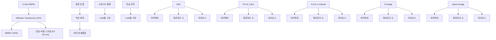
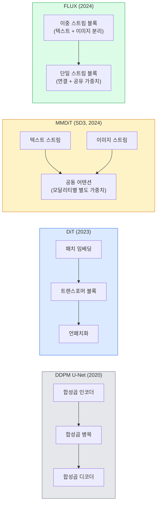

# 확산 트랜스포머 & 정류 흐름

> U-Net이 확산의 비밀이 아니다. 트랜스포머로 대체하고, 노이즈 스케줄을 직선 흐름으로 교체하면 갑자기 SD3, FLUX, 그리고 모든 2026년 텍스트-이미지 모델이 탄생한다.

**유형:** 학습 + 구현  
**언어:** Python  
**선수 지식:** Phase 4 Lesson 10 (확산 DDPM), Phase 4 Lesson 14 (ViT), Phase 7 Lesson 02 (셀프 어텐션)  
**소요 시간:** ~75분

## 학습 목표

- U-Net DDPM(레슨 10)에서 Diffusion Transformer(DiT), MMDiT(SD3), 단일+이중 스트림 DiT(FLUX)로의 발전 과정을 추적
- 정류 흐름(rectified flow) 설명: 노이즈와 데이터 사이의 직선 궤적을 통해 모델이 1000단계 대신 20단계로 샘플링할 수 있는 이유
- 100줄 이내의 소형 DiT 블록 및 정류 흐름 학습 루프 구현
- 아키텍처, 파라미터 수, 라이선스를 기준으로 모델 변형(SD3, FLUX.1-dev, FLUX.1-schnell, Z-Image, Qwen-Image) 구분



## 문제 정의

레슨 10에서는 U-Net 디노이저를 사용한 DDPM(Denoising Diffusion Probabilistic Models)을 구축했습니다. 이 레시피는 2020-2023년을 지배했으며, U-Net + 베타 스케줄 + 노이즈 예측 손실(loss)로 구성되었습니다. 이는 Stable Diffusion 1.5와 2.1, DALL-E 2를 탄생시켰습니다.

2026년 최신 텍스트-이미지 모델들은 모두 이를 넘어섰습니다. Stable Diffusion 3, FLUX, SD4, Z-Image, Qwen-Image, Hunyuan-Image 등 어느 것도 U-Net을 사용하지 않습니다. 이들은 Diffusion Transformer(DiT)를 사용합니다. SD3와 FLUX는 DDPM 노이즈 스케줄을 정류 흐름(rectified flow)으로 교체하여 노이즈에서 데이터로의 경로를 직선화하고 일관성 모델(consistency model) 또는 증류 변형(distilled variants)을 통해 1-4단계 추론을 가능하게 합니다.

이러한 변화는 확산 기반 이미지 생성이 제어 가능하고, 프롬프트 정확해졌으며(SD3/SD4는 텍스트 렌더링 문제를 해결), 프로덕션 속도가 빨라진 핵심 이유입니다. DiT와 정류 흐름을 이해하는 것은 2026년 생성형 이미지 스택을 이해하는 것입니다.

## 개념

### U-Net에서 트랜스포머까지



- **DiT** (Peebles & Xie, 2023) — 잠재 패치에 ViT 유사 트랜스포머를 적용하여 U-Net을 대체. 적응형 레이어 정규화(AdaLN)를 통한 조건화.
- **MMDiT** (SD3, Esser et al., 2024) — 공동 어텐션을 공유하는 텍스트 및 이미지 토큰용 별도 가중치의 두 스트림.
- **FLUX** (Black Forest Labs, 2024) — 처음 N개 블록은 SD3처럼 이중 스트림, 이후 블록은 효율성을 위해 연결 및 공유 가중치(단일 스트림) 사용.
- **Z-Image** (2025) — 6B 파라미터의 효율적인 단일 스트림 DiT로 "무조건 확장" 접근법에 도전.

### 한 단락으로 정리한 정류 흐름

DDPM은 `x_t`가 점점 손상되는 노이즈 SDE로 순방향 과정을 정의합니다. 학습된 역과정은 1000개의 작은 단계로 해결되는 두 번째 SDE입니다.

정류 흐름은 깨끗한 데이터와 순수 노이즈 사이의 **직선** 보간을 정의합니다:

```
x_t = (1 - t) * x_0 + t * epsilon,     t in [0, 1]
```

네트워크를 훈련시켜 속도 `v_theta(x_t, t) = epsilon - x_0`를 예측하도록 합니다. 이는 깨끗한 데이터에서 노이즈로의 직선 경로를 따라 순방향 방향(`dx_t/dt`)입니다. 샘플링 시 이 속도를 역적분하여 노이즈에서 데이터로 이동합니다. 결과 ODE는 직선에 훨씬 가까워 샘플링에 필요한 적분 단계가 훨씬 적습니다.

SD3는 이를 **정류 흐름 매칭**이라고 부릅니다. FLUX, Z-Image 및 대부분의 2026 모델도 동일한 목적 함수를 사용합니다. 일반적인 추론: 20-30 오일러 단계(결정적) vs 이전 DDPM 영역의 50+ DDIM 단계. 증류/터보/슈넬/LCM 변형은 1-4단계로 줄입니다.

### AdaLN 조건화

DiT는 **적응형 레이어 정규화**를 통해 타임스텝 및 클래스/텍스트에 조건화합니다: 조건화 벡터에서 `scale`과 `shift`를 예측하고 LayerNorm 이후에 적용합니다. U-Net의 FiLM 스타일 변조나 모든 현대 DiT의 기본 방식보다 훨씬 깔끔합니다.

```
cond -> MLP -> (scale, shift, gate)
norm(x) * (1 + scale) + shift, 이후 residual add * gate
```

### SD3와 FLUX의 텍스트 인코더

- **SD3**는 세 개의 텍스트 인코더를 사용합니다: 두 개의 CLIP 모델 + T5-XXL. 임베딩은 연결되어 이미지 스트림에 텍스트 조건화로 공급됩니다.
- **FLUX**는 하나의 CLIP-L + T5-XXL을 사용합니다.
- **Qwen-Image / Z-Image** 변형은 자체 기본 LLM과 정렬된 인하우스 텍스트 인코더를 사용합니다.

텍스트 인코더는 SD3/FLUX가 SD1.5보다 프롬프트를 훨씬 더 잘 이해하는 주요 이유입니다. T5-XXL만으로도 4.7B 파라미터입니다.

### 분류기 없는 유도 여전히 유효

정류 흐름은 샘플러를 변경하지만 조건화는 변경하지 않습니다. 분류기 없는 유도(훈련 중 10% 확률로 텍스트 삭제, 추론 시 조건부 및 무조건부 예측 혼합)는 정류 흐름에서도 동일하게 작동합니다. 대부분의 2026 모델은 유도 스케일 3.5-5를 사용합니다. 정류 흐름 모델은 기본적으로 프롬프트를 더 엄격하게 따르기 때문에 SD1.5의 7.5보다 낮습니다.

### 일관성, 터보, 슈넬, LCM

느린 다단계 모델을 빠른 소수 단계 모델로 증류하는 동일한 아이디어에 대한 네 가지 이름입니다.

- **LCM (잠재 일관성 모델)** — 중간 `x_t`에서 최종 `x_0`를 한 단계로 예측하는 학생 모델 훈련.
- **SDXL 터보 / FLUX 슈넬** — 적대적 확산 증류로 훈련된 1-4단계 모델.
- **SD 터보** — 잠재 확산에 적용된 OpenAI 스타일 일관성 모델.

새로운 모델의 프로덕션 서빙은 "풀 품질" 체크포인트와 "터보/슈넬" 변형을 모두 제공합니다. 슈넬(독일어로 "빠름", Black Forest Labs의 관례)은 1-4단계로 실행되며 실시간 파이프라인에 적합합니다.

### 2026년 모델 현황

| 모델 | 크기 | 아키텍처 | 라이선스 |
|-------|------|--------------|---------|
| Stable Diffusion 3 Medium | 2B | MMDiT | SAI 커뮤니티 |
| Stable Diffusion 3.5 Large | 8B | MMDiT | SAI 커뮤니티 |
| FLUX.1-dev | 12B | 이중 + 단일 스트림 DiT | 비상업적 |
| FLUX.1-schnell | 12B | 동일, 증류 | Apache 2.0 |
| FLUX.2 | — | FLUX.1 반복 | 혼합 |
| Z-Image | 6B | S3-DiT (확장 가능한 단일 스트림) | 허용적 |
| Qwen-Image | ~20B | DiT + Qwen 텍스트 타워 | Apache 2.0 |
| Hunyuan-Image-3.0 | ~80B | DiT | 연구용 |
| SD4 Turbo | 3B | DiT + 증류 | SAI 상업용 |

FLUX.1-schnell은 2026년 오픈소스 기본값입니다. Z-Image는 효율성 리더입니다. FLUX.2와 SD4는 현재 품질 선두주자입니다.

### 이 위상 변화가 중요한 이유

DDPM + U-Net은 작동했습니다. DiT + 정류 흐름은 **더 나은 성능, 더 빠른 속도, 더 깔끔한 확장성**을 제공합니다. 이 전환은 NLP에서 RNN에서 트랜스포머로의 전환과 유사합니다: 두 아키텍처 모두 동일한 문제를 해결했지만 트랜스포머가 확장성을 갖추고 현재는 주류입니다. 2026년 이미지, 비디오 또는 3D 생성 관련 모든 논문은 DiT 형태의 노이즈 제거기와 일반적으로 정류 흐름 목적 함수를 사용합니다. U-Net DDPM은 이제 주로 교육용(레슨 10)입니다.

## 구축

### 1단계: AdaLN을 사용한 DiT 블록

```python
import torch
import torch.nn as nn


class AdaLNZero(nn.Module):
    """
    게이트가 있는 적응형 레이어 정규화. 조건부 정보에서 (스케일, 시프트, 게이트)를 예측합니다.
    전체 블록이 항등 함수로 시작하도록 초기화("제로 초기화")합니다.
    """

    def __init__(self, dim, cond_dim):
        super().__init__()
        self.norm = nn.LayerNorm(dim, elementwise_affine=False)
        self.mlp = nn.Linear(cond_dim, dim * 3)
        nn.init.zeros_(self.mlp.weight)
        nn.init.zeros_(self.mlp.bias)

    def forward(self, x, cond):
        scale, shift, gate = self.mlp(cond).chunk(3, dim=-1)
        h = self.norm(x) * (1 + scale.unsqueeze(1)) + shift.unsqueeze(1)
        return h, gate.unsqueeze(1)


class DiTBlock(nn.Module):
    def __init__(self, dim=192, heads=3, mlp_ratio=4, cond_dim=192):
        super().__init__()
        self.adaln1 = AdaLNZero(dim, cond_dim)
        self.attn = nn.MultiheadAttention(dim, heads, batch_first=True)
        self.adaln2 = AdaLNZero(dim, cond_dim)
        self.mlp = nn.Sequential(
            nn.Linear(dim, dim * mlp_ratio),
            nn.GELU(),
            nn.Linear(dim * mlp_ratio, dim),
        )

    def forward(self, x, cond):
        h, gate1 = self.adaln1(x, cond)
        a, _ = self.attn(h, h, h, need_weights=False)
        x = x + gate1 * a
        h, gate2 = self.adaln2(x, cond)
        x = x + gate2 * self.mlp(h)
        return x
```

`AdaLNZero`는 MLP 가중치가 0으로 초기화되어 항등 사상으로 시작합니다. 학습은 블록을 항등 사상에서 벗어나게 유도하며, 이는 심층 트랜스포머 확산 모델을 극적으로 안정화합니다.

### 2단계: 소형 DiT

```python
def timestep_embedding(t, dim):
    import math
    half = dim // 2
    freqs = torch.exp(-math.log(10000) * torch.arange(half, device=t.device) / half)
    args = t[:, None].float() * freqs[None]
    return torch.cat([args.sin(), args.cos()], dim=-1)


class TinyDiT(nn.Module):
    def __init__(self, image_size=16, patch_size=2, in_channels=3, dim=96, depth=4, heads=3):
        super().__init__()
        self.patch_size = patch_size
        self.num_patches = (image_size // patch_size) ** 2
        self.patch = nn.Conv2d(in_channels, dim, kernel_size=patch_size, stride=patch_size)
        self.pos = nn.Parameter(torch.zeros(1, self.num_patches, dim))
        self.time_mlp = nn.Sequential(
            nn.Linear(dim, dim * 2),
            nn.SiLU(),
            nn.Linear(dim * 2, dim),
        )
        self.blocks = nn.ModuleList([DiTBlock(dim, heads, cond_dim=dim) for _ in range(depth)])
        self.norm_out = nn.LayerNorm(dim, elementwise_affine=False)
        self.head = nn.Linear(dim, patch_size * patch_size * in_channels)

    def forward(self, x, t):
        n = x.size(0)
        x = self.patch(x)
        x = x.flatten(2).transpose(1, 2) + self.pos
        t_emb = self.time_mlp(timestep_embedding(t, self.pos.size(-1)))
        for blk in self.blocks:
            x = blk(x, t_emb)
        x = self.norm_out(x)
        x = self.head(x)
        return self._unpatchify(x, n)

    def _unpatchify(self, x, n):
        p = self.patch_size
        h = w = int(self.num_patches ** 0.5)
        x = x.view(n, h, w, p, p, -1).permute(0, 5, 1, 3, 2, 4).reshape(n, -1, h * p, w * p)
        return x
```

### 3단계: 정류 흐름 훈련

```python
import torch.nn.functional as F

def rectified_flow_train_step(model, x0, optimizer, device):
    model.train()
    x0 = x0.to(device)
    n = x0.size(0)
    t = torch.rand(n, device=device)
    epsilon = torch.randn_like(x0)
    x_t = (1 - t[:, None, None, None]) * x0 + t[:, None, None, None] * epsilon

    target_velocity = epsilon - x0
    pred_velocity = model(x_t, t)

    loss = F.mse_loss(pred_velocity, target_velocity)
    optimizer.zero_grad()
    loss.backward()
    optimizer.step()
    return loss.item()
```

DDPM의 노이즈 예측 손실(레슨 10)과 비교: 구조는 동일하지만 대상이 다릅니다. 노이즈 `epsilon`을 예측하는 대신, 직선 보간을 따라 데이터에서 노이즈를 가리키는 **속도** `epsilon - x_0`를 예측합니다.

### 4단계: 오일러 샘플러

정류 흐름은 ODE입니다. 오일러 방법은 가장 간단하며, 잘 훈련된 정류 흐름 모델의 경우 20단계 이상에서 고차 솔버와 거의 동일한 정확도를 제공합니다.

```python
@torch.no_grad()
def rectified_flow_sample(model, shape, steps=20, device="cpu"):
    model.eval()
    x = torch.randn(shape, device=device)
    dt = 1.0 / steps
    t = torch.ones(shape[0], device=device)
    for _ in range(steps):
        v = model(x, t)
        x = x - dt * v
        t = t - dt
    return x
```

20단계. 훈련된 모델에서는 1000단계 DDPM과 유사한 샘플을 생성합니다.

### 5단계: 종단간 테스트

```python
import numpy as np

def synthetic_blobs(num=200, size=16, seed=0):
    rng = np.random.default_rng(seed)
    out = np.zeros((num, 3, size, size), dtype=np.float32)
    yy, xx = np.meshgrid(np.arange(size), np.arange(size), indexing="ij")
    for i in range(num):
        cx, cy = rng.uniform(4, size - 4, size=2)
        r = rng.uniform(2, 4)
        mask = (xx - cx) ** 2 + (yy - cy) ** 2 < r ** 2
        colour = rng.uniform(-1, 1, size=3)
        for c in range(3):
            out[i, c][mask] = colour[c]
    return torch.from_numpy(out)
```

이 합성 데이터로 `TinyDiT`를 정류 흐름으로 훈련합니다. 500단계 후 샘플링된 출력은 희미한 색상 덩어리처럼 보여야 합니다.

## 사용 방법

FLUX / SD3 / Z-Image를 이용한 실제 이미지 생성을 위해 `diffusers`는 모든 모델에 통합된 API를 제공합니다:

```python
from diffusers import FluxPipeline, StableDiffusion3Pipeline
import torch

pipe = FluxPipeline.from_pretrained(
    "black-forest-labs/FLUX.1-schnell",
    torch_dtype=torch.bfloat16,
).to("cuda")

out = pipe(
    prompt="쓰나미를 서핑하는 골든 리트리버, 초사실적, 스튜디오 조명",
    guidance_scale=0.0,           # schnell은 CFG 없이 학습됨
    num_inference_steps=4,
    max_sequence_length=256,
).images[0]
out.save("surf.png")
```

3줄의 코드로 `FLUX.1-schnell` 모델을 4단계로 실행 가능합니다. 더 높은 품질의 결과를 원하면 모델 ID를 `black-forest-labs/FLUX.1-dev`로 변경하고 20-30단계로 CFG를 적용하세요.

SD3의 경우:

```python
pipe = StableDiffusion3Pipeline.from_pretrained(
    "stabilityai/stable-diffusion-3.5-large",
    torch_dtype=torch.bfloat16,
).to("cuda")
out = pipe(prompt, guidance_scale=3.5, num_inference_steps=28).images[0]
```

## Ship It

이 레슨은 다음을 생성합니다:

- `outputs/prompt-dit-model-picker.md` — 품질, 지연 시간, 라이선스 제약 조건에 따라 SD3, FLUX.1-dev, FLUX.1-schnell, Z-Image, SD4 Turbo 중에서 모델을 선택합니다.
- `outputs/skill-rectified-flow-trainer.md` — AdaLN DiT와 오일러 샘플링(Euler sampling)을 사용한 정류 흐름(rectified flow)용 완전한 학습 루프를 작성합니다.

## 연습 문제

1. **(쉬움)** 위의 TinyDiT를 합성 blob 데이터셋에 대해 500 스텝 동안 학습시켜 보세요. 10, 20, 50 Euler 스텝으로 생성된 샘플을 비교하세요.
2. **(중간)** 학습된 클래스 임베딩을 시간 임베딩에 연결(concatenate)하여 텍스트 조건화를 추가하세요 (색상별 10개의 blob "클래스"). 클래스 0, 5, 9로 샘플링하고 색상이 일치하는지 확인하세요.
3. **(어려움)** 동일한 데이터셋을 동일한 스텝 수만큼 학습한 rectified-flow와 DDPM 버전(동일 크기 네트워크)에서 생성된 샘플 간 Fréchet 거리(FID 프록시)를 계산하세요. 어떤 방법이 더 빠르게 수렴하는지 보고하세요.

## 주요 용어

| 용어 | 사람들이 말하는 것 | 실제 의미 |
|------|----------------|----------------------|
| DiT | "Diffusion transformer" | U-Net을 대체하는 확산 노이즈 제거기 역할을 하는 트랜스포머; 패치화된 잠재 공간에서 작동 |
| AdaLN | "Adaptive layer norm" | LayerNorm 이후에 적용되는 학습된 스케일, 시프트, 게이트를 통한 타임스텝/텍스트 조건화; 모든 현대 DiT의 표준 구성 요소 |
| MMDiT | "Multi-modal DiT (SD3)" | 텍스트와 이미지 토큰을 위한 별도의 가중치 스트림이 공동 자기 어텐션을 공유하는 구조 |
| Single-stream / double-stream | "FLUX 트릭" | 처음 N개 블록은 더블 스트림(각 모달리티별 별도 가중치), 이후 블록은 싱글 스트림(결합 + 공유 가중치)으로 효율성 향상 |
| Rectified flow | "직선 노이즈-데이터 변환" | 데이터와 노이즈 간 선형 보간; 네트워크가 속도 예측; 추론 시 더 적은 ODE 단계 필요 |
| Velocity target | "epsilon - x_0" | 정류 흐름(rectified flow)의 회귀 목표; 클린 데이터에서 노이즈로 향하는 벡터 |
| CFG guidance | "classifier-free guidance" | 조건부/무조건부 예측 혼합; 정류 흐름 모델에서도 여전히 사용 |
| Schnell / turbo / LCM | "1-4단계 증류" | 풀 퀄리티 모델에서 증류된 소단계 변형; 실시간 프로덕션용 |

## 추가 자료

- [Scalable Diffusion Models with Transformers (Peebles & Xie, 2023)](https://arxiv.org/abs/2212.09748) — DiT 논문  
- [Scaling Rectified Flow Transformers (Esser et al., SD3 논문)](https://arxiv.org/abs/2403.03206) — 대규모 MMDiT 및 정류 흐름(rectified-flow)  
- [FLUX.1 모델 카드 및 기술 보고서 (Black Forest Labs)](https://huggingface.co/black-forest-labs/FLUX.1-dev) — 이중/단일 스트림 세부 사항  
- [Z-Image: 효율적인 이미지 생성 기반 모델 (2025)](https://arxiv.org/html/2511.22699v1) — 6B 단일 스트림 DiT  
- [확산 설계 공간 규명 (Karras et al., 2022)](https://arxiv.org/abs/2206.00364) — 모든 확산 설계 트레이드오프 참고 자료  
- [잠재 일관성 모델 (Luo et al., 2023)](https://arxiv.org/abs/2310.04378) — LCM-LoRA를 통한 4단계 추론 방법