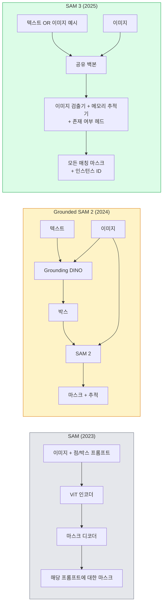

# SAM 3 & 오픈-보캐뷸러리 세그멘테이션

> 모델에 텍스트 프롬프트와 이미지를 주고 일치하는 모든 객체에 대한 마스크를 얻으세요. SAM 3은 이를 단일 순방향 패스로 구현했습니다.

**유형:** 사용 + 구축  
**언어:** Python  
**선수 지식:** Phase 4 Lesson 07 (U-Net), Phase 4 Lesson 08 (Mask R-CNN), Phase 4 Lesson 18 (CLIP)  
**소요 시간:** ~60분

## 학습 목표

- SAM(시각적 프롬프트만), Grounded SAM / SAM 2(검출기 + SAM), SAM 3(프롬프트 가능한 개념 분할을 통한 네이티브 텍스트 프롬프트) 구분
- SAM 3 아키텍처 설명: 공유 백본 + 이미지 검출기 + 메모리 기반 비디오 추적기 + 존재 헤드 + 분리된 검출기-추적기 설계
- 텍스트 프롬프트 기반 검출, 분할, 비디오 추적을 위한 Hugging Face `transformers` SAM 3 통합 사용
- 지연 시간, 개념 복잡성, 배포 대상에 따라 SAM 3, Grounded SAM 2, YOLO-World, SAM-MI 중 선택

## 문제 정의

2023년 SAM(Segment Anything Model)은 시각적 프롬프트만 지원하는 모델이었습니다: 사용자가 점을 클릭하거나 박스를 그리면 마스크를 반환했습니다. "이 사진에서 모든 오렌지를 찾아줘"와 같은 요청에는 탐지기(Grounding DINO)가 박스를 생성한 후 SAM이 각각을 분할하는 과정이 필요했습니다. Grounded SAM은 이를 파이프라인으로 통합했지만, 두 개의 고정된 모델을 연결하는 과정에서 오류가 누적되는 문제가 있었습니다.

SAM 3(Meta, 2025년 11월, ICLR 2026)은 이러한 캐스케이드 구조를 단일 모델로 통합했습니다. 짧은 명사구 또는 이미지 예시를 프롬프트로 받아 모든 일치하는 마스크와 인스턴스 ID를 단일 순방향 전달로 반환합니다. 이를 **프롬프트 가능 개념 분할(Promptable Concept Segmentation, PCS)**이라고 합니다. 2026년 3월 Object Multiplex 업데이트(SAM 3.1)와 결합되면 동일한 개념의 여러 인스턴스를 비디오에서 효율적으로 추적할 수 있습니다.

이 레슨은 이러한 구조적 변화가 의미하는 바를 다룹니다. 2D 분할, 탐지, 텍스트-이미지 그라운딩이 단일 모델로 통합되었습니다. 이제 프로덕션 환경에서 "어떤 파이프라인을 연결해야 하는가"가 아닌 "어떤 프롬프트 가능 모델이 내 사용 사례를 종단간 처리할 수 있는가"가 핵심 질문입니다.

## 개념

### 세 가지 세대



### 프롬프트 가능한 개념 분할

"개념 프롬프트"는 짧은 명사구(`"노란 스쿨 버스"`, `"줄무늬가 있는 빨간 우산"`, `"머그잔을 들고 있는 손"`) 또는 이미지 예시입니다. 모델은 개념과 일치하는 이미지 내 모든 인스턴스에 대한 분할 마스크와 각 매칭에 대한 고유 인스턴스 ID를 반환합니다.

이는 기존의 시각적 프롬프트 SAM과 세 가지 측면에서 다릅니다:

1. 인스턴스별 프롬프트 불필요 — 하나의 텍스트 프롬프트로 모든 매칭 반환.
2. 오픈-보캐불러리 — 개념은 자연어로 설명 가능한 모든 것이 될 수 있음.
3. 프롬프트당 하나의 마스크가 아닌 여러 인스턴스를 한 번에 반환.

### 주요 아키텍처 구성 요소

- **공유 백본** — 단일 ViT가 이미지를 처리. 검출기 헤드와 메모리 기반 추적기가 모두 이를 읽음.
- **존재 여부 헤드** — 개념이 이미지에 존재하는지 예측. "이것이 여기 있는가?"와 "어디에 있는가?"를 분리. 존재하지 않는 개념에 대한 오탐 감소.
- **분리된 검출기-추적기** — 이미지 수준 검출과 비디오 수준 추적은 서로 간섭하지 않도록 별도 헤드를 가짐.
- **메모리 뱅크** — 비디오 추적을 위해 프레임 간 인스턴스별 특징을 저장 (SAM 2에서 사용한 메커니즘과 동일).

### 대규모 학습

SAM 3은 **400만 개의 고유 개념**으로 학습되었으며, 이는 AI + 인간 검토를 사용해 반복적으로 주석을 달고 수정하는 데이터 엔진에 의해 생성되었습니다. 새로운 **SA-CO 벤치마크**는 27만 개의 고유 개념을 포함하며, 이전 벤치마크보다 50배 더 큽니다. SAM 3은 SA-CO에서 인간 성능의 75-80%에 도달하며, 이미지 + 비디오 PCS에서 기존 시스템을 두 배 능가합니다.

### SAM 3.1 오브젝트 멀티플렉스

2026년 3월 업데이트: **오브젝트 멀티플렉스**는 동일한 개념의 여러 인스턴스를 동시에 추적하기 위한 공유 메모리 메커니즘을 도입했습니다. 이전에는 N개의 인스턴스를 추적하려면 N개의 별도 메모리 뱅크가 필요했습니다. 멀티플렉스는 이를 하나의 공유 메모리와 인스턴스별 쿼리로 축소합니다. 결과: 정확도 저하 없이 다중 객체 추적 속도가 크게 향상됨.

### 2026년에도 Grounded SAM이 중요한 이유

- 특정 오픈-보캐불러리 검출기를 교체해야 할 때 (DINO-X, Florence-2).
- SAM 3 라이선스(HF에서 게이트 처리됨)가 차단 요소일 때.
- SAM 3이 노출하는 것보다 검출기 임계값에 대한 더 많은 제어가 필요할 때.
- 검출기 구성 요소에 대한 연구/제거 작업 시.

모듈식 파이프라인은 여전히 유용합니다. 대부분의 프로덕션 작업에는 SAM 3이 더 간단한 해결책입니다.

### YOLO-World vs SAM 3

- **YOLO-World** — 오픈-보캐불러리 검출기만 제공 (마스크 없음). 실시간. 높은 FPS에서 박스가 필요할 때 최적.
- **SAM 3** — 전체 분할 + 추적. 느리지만 더 풍부한 출력.

프로덕션 분할: 빠른 검출 전용 파이프라인(로봇 내비게이션, 빠른 대시보드)에는 YOLO-World, 마스크나 추적이 필요한 모든 작업에는 SAM 3.

### SAM-MI 효율성

SAM-MI(2025-2026)는 SAM의 디코더 병목 현상을 해결합니다. 주요 아이디어:

- **희소 점 프롬프트** — 밀집 프롬프트 대신 몇 개의 잘 선택된 점 사용; 디코더 호출 96% 감소.
- **얕은 마스크 집계** — 대략적인 마스크 예측을 하나의 더 선명한 마스크로 병합.
- **분리된 마스크 주입** — 디코더는 재실행 대신 사전 계산된 마스크 특징을 수신.

결과: 오픈-보캐불러리 벤치마크에서 Grounded-SAM 대비 약 1.6배 속도 향상.

### 세 모델의 출력 형식

모두 동일한 일반 구조(박스 + 레이블 + 점수 + 마스크 + ID)를 반환하므로, 다운스트림 파이프라인이 어떤 모델이 실행되었는지 분기할 필요가 없어 유용합니다.

## 빌드하기

### 1단계: 프롬프트 구성

사용자 문장을 SAM 3 개념 프롬프트 목록으로 변환하는 헬퍼를 구축합니다. 이는 "사용자가 입력한 내용"과 "모델이 소비하는 내용"이 만나는 경계입니다.

```python
def split_concepts(sentence):
    """
    다중 개념 프롬프트를 위한 휴리스틱 분할기.
    짧은 명사구 목록을 반환합니다.
    """
    for sep in [",", ";", "and", "or", "&"]:
        if sep in sentence:
            parts = [p.strip() for p in sentence.replace("and ", ",").split(",")]
            return [p for p in parts if p]
    return [sentence.strip()]

print(split_concepts("cats, dogs and balloons"))
```

SAM 3은 한 번의 순전파(forward pass)당 하나의 개념만 허용합니다. 다중 개념 쿼리의 경우 반복 또는 배치 처리합니다.

### 2단계: 후처리 헬퍼

SAM 3의 원시 출력을 4단계 16강 파이프라인 계약에 맞는 깨끗한 감지 목록으로 변환합니다.

```python
from dataclasses import dataclass
from typing import List

@dataclass
class ConceptDetection:
    개념: str
    인스턴스_id: int
    박스: tuple          # (x1, y1, x2, y2)
    점수: float
    마스크_rle: str       # 런 렝스 인코딩


def rle_encode(binary_mask):
    flat = binary_mask.flatten().astype("uint8")
    runs = []
    prev, count = flat[0], 0
    for v in flat:
        if v == prev:
            count += 1
        else:
            runs.append((int(prev), count))
            prev, count = v, 1
    runs.append((int(prev), count))
    return ";".join(f"{v}x{c}" for v, c in runs)
```

RLE(Run-Length Encoding)는 고해상도 마스크가 많아도 응답 페이로드를 작게 유지합니다. 이 형식은 SAM 2, SAM 3, Grounded SAM 2에서 모두 호환됩니다.

### 3단계: 통합 오픈-보캐블러리 분할 인터페이스

SAM 3, Grounded SAM 2, YOLO-World + SAM 2 등 어떤 백엔드든 단일 메서드 뒤에 감춥니다. 백엔드가 변경되어도 다운스트림 코드는 변경되지 않습니다.

```python
from abc import ABC, abstractmethod
import numpy as np

class OpenVocabSeg(ABC):
    @abstractmethod
    def 감지(self, 이미지: np.ndarray, 개념: str) -> List[ConceptDetection]:
        ...


class StubOpenVocabSeg(OpenVocabSeg):
    """
    실제 모델이 로드되지 않은 경우 파이프라인 테스트에 사용되는 결정적 스텁.
    """
    def 감지(self, 이미지, 개념):
        h, w = 이미지.shape[:2]
        return [
            ConceptDetection(
                개념=개념,
                인스턴스_id=0,
                박스=(w * 0.2, h * 0.3, w * 0.5, h * 0.8),
                점수=0.89,
                마스크_rle="0x100;1x50;0x200",
            ),
            ConceptDetection(
                개념=개념,
                인스턴스_id=1,
                박스=(w * 0.55, h * 0.25, w * 0.85, h * 0.75),
                점수=0.74,
                마스크_rle="0x80;1x40;0x220",
            ),
        ]
```

실제 `SAM3OpenVocabSeg` 서브클래스는 `transformers.Sam3Model`과 `Sam3Processor`를 래핑합니다.

### 4단계: 허깅페이스 SAM 3 사용법 (참고)

실제 모델을 위한 `transformers` 통합:

```python
from transformers import Sam3Processor, Sam3Model
import torch

processor = Sam3Processor.from_pretrained("facebook/sam3")
model = Sam3Model.from_pretrained("facebook/sam3").eval()

inputs = processor(images=pil_image, return_tensors="pt")
inputs = processor.set_text_prompt(inputs, "노란 스쿨 버스")

with torch.no_grad():
    outputs = model(**inputs)

마스크 = processor.post_process_masks(
    outputs.masks, inputs.original_sizes, inputs.reshaped_input_sizes
)
박스 = outputs.boxes
점수 = outputs.scores
```

하나의 프롬프트로 모든 일치 항목이 단일 호출에서 반환됩니다.

### 5단계: Grounded SAM 2가 무료로 제공한 것 측정

정직한 벤치마크: 실제 파이프라인에서 Grounded SAM 2를 SAM 3으로 교체하면 어떻게 될까요?

- 지연 시간: SAM 3은 순전파 한 번(별도 탐지기 없음)을 절약하지만 모델 자체가 더 무겁습니다. 일반적으로 중립적이거나 약간의 속도 향상.
- 정확도: SAM 3은 희귀하거나 구성적 개념("줄무늬가 있는 빨간 우산")에서 상당히 우수합니다. 일반적인 단일 단어 개념에서는 유사.
- 유연성: Grounded SAM 2는 탐지기 교체(DINO-X, Florence-2, Grounding DINO 1.5)가 가능합니다. SAM 3은 단일 구조.

결론: SAM 3은 2026년 오픈-보캐블러리 분할의 기본값입니다. 탐지기 유연성이나 다른 라이선스 조건이 필요할 때는 여전히 Grounded SAM 2가 정답입니다.

## 사용 방법

프로덕션 배포 패턴:

- **실시간 주석** — SAM 3 + CVAT의 label-as-text-prompt 기능. 주석 작성자가 라벨 이름을 선택하면 SAM 3이 모든 일치하는 인스턴스에 사전 라벨을 지정합니다. 검토 및 수정 가능.
- **비디오 분석** — SAM 3.1 Object Multiplex를 사용한 다중 객체 추적; 프레임을 메모리 기반 추적기에 공급.
- **로봇공학** — SAM 3을 사용한 오픈-보카브 조작("빨간 컵 집기"); 계획 프리미티브로 실행.
- **의료 영상** — 의료 개념에 대해 파인튜닝(fine-tuning)된 SAM 3; HF에서 접근 요청 필요.

Ultralytics는 SAM 3을 Python 패키지로 래핑합니다:

```python
from ultralytics import SAM

model = SAM("sam3.pt")
results = model(image_path, prompts="노란 스쿨 버스")
```

YOLO 및 SAM 2와 동일한 인터페이스.

## Ship It

이 레슨은 다음을 생성합니다:

- `outputs/prompt-open-vocab-stack-picker.md` — 지연 시간(latency), 개념 복잡성(concept complexity), 라이선스(licensing)를 기준으로 SAM 3 / Grounded SAM 2 / YOLO-World / SAM-MI를 선택하는 프롬프트(prompt).
- `outputs/skill-concept-prompt-designer.md` — 사용자 발화(utterance)를 잘 구성된 SAM 3 개념 프롬프트(concept prompt)로 변환하는 스킬(skill) (분할(splitting), 명확화(disambiguation), 대체안(fallbacks) 포함).

## 연습 문제

1. **(쉬움)** SAM 3를 사용하여 선택한 개념 프롬프트(concept prompt)로 10개의 이미지를 실행합니다. 동일한 이미지에 대해 SAM 2 + Grounding DINO 1.5와 비교합니다. 각 모델이 놓친 개념을 보고합니다.
2. **(중간)** SAM 3 위에 "클릭으로 포함/제외" UI를 구축합니다: 텍스트 프롬프트가 후보 인스턴스(candidate instances)를 반환하면, 사용자가 클릭하여 포함할 인스턴스를 선택합니다. 최종 개념 집합을 JSON 형식으로 출력합니다.
3. **(어려움)** 20개의 레이블된 이미지(예: 5종류의 전자 부품)로 SAM 3를 커스텀 개념 집합에 대해 파인튜닝(fine-tuning)합니다. 동일한 테스트 세트에서 제로샷(zero-shot) SAM 3와 비교합니다. 마스크 IoU(Intersection over Union) 개선 정도를 측정합니다.

## 주요 용어

| 용어 | 사람들이 말하는 표현 | 실제 의미 |
|------|----------------|----------------------|
| 오픈-보캐블러리 세그멘테이션 | "Segment by text" | 고정된 라벨 집합이 아닌 자연어로 설명된 객체에 대한 마스크 생성 |
| PCS | "Promptable Concept Segmentation" | SAM 3의 핵심 작업 — 명사구 또는 이미지 예시 제공 시 모든 일치하는 인스턴스 세그멘테이션 |
| 컨셉 프롬프트 | "The text input" | 짧은 명사구 또는 이미지 예시; 전체 문장이 아님 |
| 프레즌스 헤드 | "Is it here?" | SAM 3 모듈 — 위치 지정 전 이미지에 컨셉 존재 여부 판단 |
| SA-CO | "SAM 3 벤치마크" | 270K-컨셉 오픈-보캐블러리 세그멘테이션 벤치마크; 기존 오픈-보캐블러리 벤치마크 대비 50배 더 큼 |
| 오브젝트 멀티플렉스 | "SAM 3.1 업데이트" | 공유 메모리 다중 객체 추적; 많은 인스턴스의 빠른 공동 추적 |
| 그라운디드 SAM 2 | "모듈식 파이프라인" | 검출기 + SAM 2 캐스케이드; 검출기 교체가 중요한 경우 여전히 유효 |
| SAM-MI | "효율적인 SAM 변형" | 마스크 주입(Mask Injection)을 통한 그라운디드-SAM 대비 1.6배 속도 향상 |

## 추가 자료

- [SAM 3: 개념과 함께 모든 것 분할하기 (arXiv 2511.16719)](https://arxiv.org/abs/2511.16719)
- [SAM 3.1 객체 다중화 (Meta AI, 2026년 3월)](https://ai.meta.com/blog/segment-anything-model-3/)
- [허깅페이스의 SAM 3 모델 페이지](https://huggingface.co/facebook/sam3)
- [Grounded SAM 2 튜토리얼 (PyImageSearch)](https://pyimagesearch.com/2026/01/19/grounded-sam-2-from-open-set-detection-to-segmentation-and-tracking/)
- [Ultralytics SAM 3 문서](https://docs.ultralytics.com/models/sam-3/)
- [SAM3-I: 명령어 인식 SAM (arXiv 2512.04585)](https://arxiv.org/abs/2512.04585)