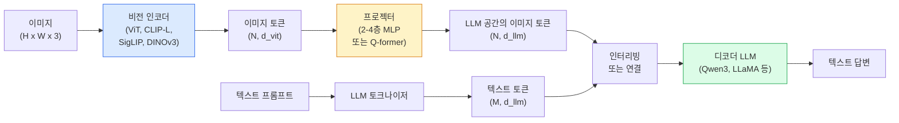

# Vision-Language Models — ViT-MLP-LLM 패턴

> 비전 인코더는 이미지를 토큰으로 변환합니다. MLP 프로젝터는 해당 토큰을 LLM의 임베딩 공간으로 매핑합니다. 언어 모델이 나머지 작업을 수행합니다. 이 패턴 — ViT-MLP-LLM — 은 2026년의 모든 프로덕션 VLM입니다.

**유형:** 학습 + 활용  
**언어:** Python  
**선수 지식:** 4단계 14강(ViT), 4단계 18강(CLIP), 7단계 2강(Self-Attention)  
**소요 시간:** ~75분

## 학습 목표

- ViT-MLP-LLM 아키텍처를 설명하고 세 구성 요소(ViT, MLP, LLM) 각각이 기여하는 바를 기술
- Qwen3-VL, InternVL3.5, LLaVA-Next, GLM-4.6V를 파라미터 수, 컨텍스트 길이, 벤치마크 성능 기준으로 비교
- DeepStack 설명: 단일 마지막 레이어 특징보다 다중 레벨 ViT 특징이 시각-언어 정렬을 더 효과적으로 강화하는 이유
- Cross-Modal Error Rate(CMER)로 프로덕션 환경에서 VLM 환각 측정 및 신호 기반 조치 방법 설명

## 문제

CLIP(Phase 4 Lesson 18)은 이미지와 텍스트를 위한 공유 임베딩 공간을 제공하며, 이는 제로샷 분류 및 검색에 충분합니다. 그러나 CLIP은 텍스트를 생성하지 않기 때문에 "이 이미지에 빨간 자동차가 몇 대 있나요?"와 같은 질문에 답할 수 없습니다. CLIP은 유사도 점수화만 수행합니다.

비전-언어 모델(VLMs) — Qwen3-VL, InternVL3.5, LLaVA-Next, GLM-4.6V — 는 CLIP 계열 이미지 인코더를 전체 언어 모델에 결합합니다. 이 모델은 이미지와 질문을 입력으로 받아 답변을 생성합니다. 2026년에는 오픈소스 VLMs이 GPT-5 및 Gemini-2.5-Pro와 멀티모달 벤치마크(MMMU, MMBench, DocVQA, ChartQA, MathVista, OSWorld)에서 경쟁하거나 능가하는 성능을 보입니다.

ViT(비전 트랜스포머), 프로젝터, LLM(대형 언어 모델)의 3가지 구성 요소가 표준 아키텍처입니다. 모델 간 차이는 사용하는 ViT, 프로젝터, LLM, 학습 데이터, 정렬(alignment) 레시피에 있습니다. 패턴을 이해하면 어떤 구성 요소든 교체하는 것은 기계적인 작업이 됩니다.

## 개념

### ViT-MLP-LLM 아키텍처



1. **비전 인코더** — 사전 훈련된 ViT(CLIP-L/14, SigLIP, DINOv3 또는 미세 조정 변형). 패치 토큰을 생성합니다.
2. **프로젝터** — 비전 토큰을 LLM의 임베딩 차원으로 매핑하는 소규모 모듈(2-4층 MLP 또는 Q-former). 여기서 대부분의 미세 조정이 발생합니다.
3. **LLM** — 디코더 전용 언어 모델(Qwen3, Llama, Mistral, GLM, InternLM). 비전 + 텍스트 토큰을 순차적으로 읽고 텍스트를 생성합니다.

세 구성 요소 모두 원칙적으로 훈련 가능합니다. 실제로는 비전 인코더와 LLM은 대부분 고정된 상태로 유지하며 프로젝터를 훈련시킵니다. 이는 저렴한 비용으로 신호를 제공하는 수십억 개의 매개변수입니다.

### 딥스택

바닐라 프로젝션은 마지막 ViT 레이어만 사용합니다. 딥스택(Qwen3-VL)은 여러 ViT 깊이에서 특징을 샘플링하고 이를 스택합니다. 더 깊은 레이어는 고수준 의미론을, 얕은 레이어는 세부적인 공간 및 질감 정보를 전달합니다. LLM에 둘 다 공급하면 "이미지에 무엇이 있는가"(의미론)와 "정확히 어디에 있는가"(공간적 근거) 사이의 격차를 해소할 수 있습니다.

### 세 가지 훈련 단계

현대 VLM은 단계별로 훈련됩니다:

1. **정렬** — ViT와 LLM을 고정합니다. 이미지-캡션 쌍에 대해 프로젝터만 훈련합니다. 프로젝터가 비전 공간을 언어 공간으로 매핑하는 방법을 학습합니다.
2. **사전 훈련** — 모든 것을 해제합니다. 대규모 인터리빙 이미지-텍스트 데이터(500M+ 쌍)로 훈련합니다. 모델의 시각적 지식을 구축합니다.
3. **지시 튜닝** — 선별된 (이미지, 질문, 답변) 삼중항에 대해 미세 조정합니다. 대화형 행동과 작업 형식을 가르칩니다. 이는 "비전 인식 LM"을 사용 가능한 어시스턴트로 변환하는 단계입니다.

대부분의 LoRA 미세 조정은 소규모 레이블 데이터 세트로 3단계를 대상으로 합니다.

### 모델 패밀리 비교 (2026년 초)

| 모델 | 매개변수 | 비전 인코더 | LLM | 컨텍스트 | 강점 |
|-------|--------|----------------|-----|---------|-----------|
| Qwen3-VL-235B-A22B (MoE) | 235B (22B 활성) | 커스텀 ViT + 딥스택 | Qwen3 | 256K | 일반 SOTA, GUI 에이전트 |
| Qwen3-VL-30B-A3B (MoE) | 30B (3B 활성) | 커스텀 ViT + 딥스택 | Qwen3 | 256K | 더 작은 MoE 대안 |
| Qwen3-VL-8B (밀집) | 8B | 커스텀 ViT | Qwen3 | 128K | 프로덕션용 밀집 기본값 |
| InternVL3.5-38B | 38B | InternViT-6B | Qwen3 + GPT-OSS | 128K | 강력한 MMBench / MMVet |
| InternVL3.5-241B-A28B | 241B (28B 활성) | InternViT-6B | Qwen3 | 128K | GPT-4o와 경쟁 |
| LLaVA-Next 72B | 72B | SigLIP | Llama-3 | 32K | 오픈 소스, 미세 조정 용이 |
| GLM-4.6V | ~70B | 커스텀 | GLM | 64K | 오픈 소스, 강력한 OCR |
| MiniCPM-V-2.6 | 8B | SigLIP | MiniCPM | 32K | 에지 친화적 |

### 시각 에이전트

Qwen3-VL-235B는 OSWorld에서 최고 글로벌 성능을 달성합니다. OSWorld는 GUI(데스크톱, 모바일, 웹)를 운영하는 **시각 에이전트**를 위한 벤치마크입니다. 모델은 스크린샷을 보고 UI를 이해한 후 동작(클릭, 입력, 스크롤)을 생성합니다. 도구와 결합하면 일반적인 데스크톱 작업을 완료할 수 있습니다. 이는 2026년 대부분의 "AI PC" 데모의 핵심 기술입니다.

### 에이전트 기능 + RoPE 변형

VLM은 **비디오 프레임의 시간**을 알아야 합니다. Qwen3-VL은 T-RoPE(시간적 회전 위치 임베딩)에서 **텍스트 기반 시간 정렬**로 진화했습니다. 이는 비디오 프레임과 인터리빙된 명시적 타임스탬프 텍스트 토큰입니다. 모델은 "`<timestamp 00:32>` 프레임, 프롬프트"를 보고 시간적 관계를 추론할 수 있습니다.

### 정렬 문제

크롤링된 데이터 세트의 이미지-텍스트 쌍 중 12%는 이미지에 완전히 근거하지 않은 설명을 포함합니다. 이를 기반으로 훈련된 VLM은 객체를 허구로 생성하거나 숫자를 잘못 읽거나 관계를 발명하는 등 환각(hallucination)을 학습합니다. 프로덕션 환경에서 이는 주요 실패 모드입니다.

Skywork.ai는 이를 추적하기 위해 **교차 모달 오류율(CMER)**을 도입했습니다:

```
CMER = 텍스트 신뢰도가 높지만 이미지-텍스트 유사도(CLIP 계열 체커)가 낮은 출력의 비율
```

높은 CMER은 모델이 이미지에 근거하지 않은 내용을 자신 있게 말하고 있음을 의미합니다. CMER을 모니터링하고 프로덕션 KPI로 처리하면 배치 시 환각률을 약 35% 줄일 수 있습니다. 핵심은 "모델을 수정"하는 것이 아니라 "CMER이 높은 출력을 인간 검토로 라우팅"하는 것입니다.

### LoRA / QLoRA를 이용한 미세 조정

70B VLM의 전체 미세 조정은 대부분의 팀에게 불가능합니다. 어텐션 + 프로젝터 레이어에 LoRA(랭크 16-64) 또는 4비트 기본 가중치를 사용하는 QLoRA는 단일 A100/H100에 적합합니다. 비용: 5,000-50,000개 예시, $100-$5,000 컴퓨팅 비용, 2-10시간 훈련.

### 공간 추론은 여전히 약함

현재 VLM은 공간 추론 벤치마크(위-아래, 좌-우, 개수 세기, 거리)에서 50-60% 점수를 기록합니다. 사용 사례가 "어떤 객체가 어떤 객체 위에 있는가"에 의존하는 경우, 일반적인 VLM 성능은 인간보다 낮으므로 철저히 검증해야 합니다. 순수 공간 작업을 위한 VLM보다 나은 대안: 특수 키포인트/포즈 추정기, 깊이 모델 또는 박스 기하학을 후처리하는 감지 모델.

## 구축 방법

### 1단계: 프로젝터

가장 자주 훈련시킬 부분. GELU를 사용하는 2-4층 MLP.

```python
import torch
import torch.nn as nn


class Projector(nn.Module):
    def __init__(self, vit_dim=768, llm_dim=4096, hidden=4096):
        super().__init__()
        self.net = nn.Sequential(
            nn.Linear(vit_dim, hidden),
            nn.GELU(),
            nn.Linear(hidden, llm_dim),
        )

    def forward(self, x):
        return self.net(x)
```

입력은 `(N_patches, d_vit)` 토큰 텐서. 출력은 `(N_patches, d_llm)`. LLM은 모든 출력 행을 또 다른 토큰으로 처리.

### 2단계: ViT-MLP-LLM 종단 간 조립

최소 VLM의 순전파 구조. 실제 코드는 `transformers`를 사용하지만, 개념적 레이아웃은 다음과 같음.

```python
class MinimalVLM(nn.Module):
    def __init__(self, vit, projector, llm, image_token_id):
        super().__init__()
        self.vit = vit
        self.projector = projector
        self.llm = llm
        self.image_token_id = image_token_id  # 텍스트 프롬프트의 플레이스홀더 토큰

    def forward(self, image, input_ids, attention_mask):
        # 1. 비전 특징
        vision_tokens = self.vit(image)                     # (B, N_patches, d_vit)
        vision_embeds = self.projector(vision_tokens)       # (B, N_patches, d_llm)

        # 2. 텍스트 임베딩
        text_embeds = self.llm.get_input_embeddings()(input_ids)  # (B, M, d_llm)

        # 3. 이미지 플레이스홀더 토큰을 비전 임베딩으로 교체
        merged = self._merge(text_embeds, vision_embeds, input_ids)

        # 4. LLM 실행
        return self.llm(inputs_embeds=merged, attention_mask=attention_mask)

    def _merge(self, text_embeds, vision_embeds, input_ids):
        out = text_embeds.clone()
        expected = vision_embeds.size(1)
        for b in range(input_ids.size(0)):
            positions = (input_ids[b] == self.image_token_id).nonzero(as_tuple=True)[0]
            if len(positions) != expected:
                raise ValueError(
                    f"배치 항목 {b}에 {len(positions)}개의 이미지 토큰이 있지만 vision_embeds에는 {expected}개의 패치가 있습니다."
                    " 배치의 모든 샘플은 동일한 수의 이미지 플레이스홀더 토큰으로 사전 패딩되어야 합니다.")
            out[b, positions] = vision_embeds[b]
        return out
```

텍스트의 `<image>` 플레이스홀더 토큰은 실제 이미지 임베딩으로 교체됨 — LLaVA, Qwen-VL, InternVL에서 사용하는 패턴과 동일.

### 3단계: CMER 계산

가벼운 런타임 검사.

```python
import torch.nn.functional as F


def cross_modal_error_rate(image_emb, text_emb, text_confidence, sim_threshold=0.25, conf_threshold=0.8):
    """
    image_emb, text_emb: 이미지와 생성된 텍스트의 임베딩 (내부적으로 정규화됨)
    text_confidence:     [0, 1] 범위의 토큰별 평균 확률
    반환값:             높은 신뢰도이지만 낮은 이미지-텍스트 정렬 비율을 가진 출력의 비율
    """
    image_emb = F.normalize(image_emb, dim=-1)
    text_emb = F.normalize(text_emb, dim=-1)
    sim = (image_emb * text_emb).sum(dim=-1)        # 코사인 유사도
    high_conf_low_sim = (text_confidence > conf_threshold) & (sim < sim_threshold)
    return high_conf_low_sim.float().mean().item()
```

CMER을 프로덕션 KPI로 취급. 엔드포인트별, 프롬프트 유형별, 고객별로 모니터링. CMER 상승은 모델이 특정 입력 분포에서 환각(hallucination)을 시작함을 나타냄.

### 4단계: 장난감 VLM 분류기 (실행 가능)

프로젝터 훈련 증명. 가짜 "ViT 특징"이 입력되고, 작은 LLM 스타일 토큰이 클래스를 예측.

```python
class ToyVLM(nn.Module):
    def __init__(self, vit_dim=32, llm_dim=64, num_classes=5):
        super().__init__()
        self.projector = Projector(vit_dim, llm_dim, hidden=64)
        self.head = nn.Linear(llm_dim, num_classes)

    def forward(self, vision_tokens):
        projected = self.projector(vision_tokens)
        pooled = projected.mean(dim=1)
        return self.head(pooled)
```

합성된 (특징, 클래스) 쌍으로 200단계 이내에 훈련 가능 — 프로젝터 패턴이 작동함을 보여주기에 충분.

## 사용 방법

2026년 프로덕션 팀에서 VLM을 활용하는 세 가지 방식:

- **호스팅 API** — OpenAI Vision, Anthropic Claude Vision, Google Gemini Vision. 인프라 불필요, 벤더 리스크 존재.
- **오픈소스 자체 호스팅** — `transformers`와 `vllm`을 통한 Qwen3-VL 또는 InternVL3.5. 완전한 제어권, 초기 설정 비용 증가.
- **도메인 특화 파인튜닝** — Qwen2.5-VL-7B 또는 LLaVA-1.6-7B 로드, 5k-50k 커스텀 예시에 LoRA 적용, `vllm` 또는 `TGI`로 서빙.

```python
from transformers import AutoProcessor, AutoModelForVision2Seq
import torch
from PIL import Image

model_id = "Qwen/Qwen3-VL-8B-Instruct"
processor = AutoProcessor.from_pretrained(model_id)
model = AutoModelForVision2Seq.from_pretrained(model_id, torch_dtype=torch.bfloat16, device_map="auto")

messages = [{
    "role": "user",
    "content": [
        {"type": "image", "image": Image.open("plot.png")},
        {"type": "text", "text": "이 차트는 무엇을 보여주나요?"},
    ],
}]
inputs = processor.apply_chat_template(messages, add_generation_prompt=True, tokenize=True, return_dict=True, return_tensors="pt").to("cuda")
generated = model.generate(**inputs, max_new_tokens=256)
answer = processor.decode(generated[0][inputs["input_ids"].shape[1]:], skip_special_tokens=True)
```

`apply_chat_template`은 `<image>` 플레이스홀더 토크나이징을 숨깁니다. 모델은 내부적으로 병합을 처리합니다.

## Ship It

이 레슨은 다음을 생성합니다:

- `outputs/prompt-vlm-selector.md` — 정확도(accuracy), 지연 시간(latency), 컨텍스트 길이(context length), 예산(budget)을 기준으로 Qwen3-VL / InternVL3.5 / LLaVA-Next / API를 선택하는 방법을 설명합니다.
- `outputs/skill-cmer-monitor.md` — 크로스 모달 오류율(cross-modal error rate), 엔드포인트별 대시보드(per-endpoint dashboards), 경고 임계값(alerting thresholds)을 포함한 프로덕션 VLM 엔드포인트 계측(instrumentation) 코드를 제공합니다.

## 연습 문제

1. **(쉬움)** "what is this?", "count the objects", "describe the scene"이라는 세 가지 프롬프트를 임의의 오픈 VLM(Visual Language Model)에 대해 5개의 이미지로 실행합니다. 각 답변을 직접 **정답/부분 정답/환각**으로 점수화하고, 1차 CMER(Composite Metric for Evaluation and Ranking) 유사율을 계산합니다.
2. **(중간)** Qwen2.5-VL-3B 또는 LLaVA-1.6-7B 모델을 LoRA(rank 16)로 500개의 대상 도메인 이미지(캡션 포함)에 대해 파인튜닝(fine-tuning)합니다. 제로샷(zero-shot) 대비 파인튜닝된 모델의 MMBench 스타일 정확도를 비교합니다.
3. **(어려움)** VLM의 이미지 인코더를 기본 SigLIP/CLIP 대신 DINOv3로 교체합니다. 프로젝터(projector)만 재훈련(LLM 및 DINOv3는 동결)하고, 밀집 예측 작업(객체 수 세기, 공간 추론) 성능이 개선되는지 측정합니다.

## 주요 용어

| 용어 | 사람들이 말하는 표현 | 실제 의미 |
|------|----------------|----------------------|
| ViT-MLP-LLM | "VLM 패턴" | 비전 인코더 + 프로젝터 + 언어 모델; 2026년 이후 모든 VLM |
| 프로젝터(Projector) | "다리" | 비전 토큰을 LLM 임베딩 공간으로 매핑하는 2-4층 MLP(또는 Q-former) |
| 딥스택(DeepStack) | "Qwen3-VL 특징 트릭" | 마지막 레이어만 사용하는 대신 여러 수준의 ViT 특징을 쌓아 사용 |
| 이미지 토큰(Image token) | "<image> 플레이스홀더" | 텍스트 스트림에서 프로젝션된 비전 임베딩으로 대체되는 특수 토큰 |
| CMER | "환각 KPI" | 크로스 모달 오류율(Cross-Modal Error Rate); 텍스트 신뢰도가 높지만 이미지-텍스트 유사도가 낮을 때 높게 나타남 |
| 비주얼 에이전트(Visual agent) | "클릭하는 VLM" | 도구 호출을 통해 GUI(OSWorld, 모바일, 웹)를 운영하는 VLM |
| Q-former | "고정 개수 토큰 다리" | BLIP-2 스타일의 프로젝터로 고정된 수의 시각적 쿼리 토큰을 생성 |
| 정렬(Alignment) / 사전 학습(Pre-training) / 지시 튜닝(Instruction tuning) | "세 단계" | 표준 VLM 학습 파이프라인 |

## 추가 자료

- [Qwen3-VL 기술 보고서 (arXiv 2511.21631)](https://arxiv.org/abs/2511.21631)
- [InternVL3.5 오픈소스 멀티모달 모델 발전 (arXiv 2508.18265)](https://arxiv.org/html/2508.18265v1)
- [LLaVA-Next 시리즈](https://llava-vl.github.io/blog/2024-05-10-llava-next-stronger-llms/)
- [BentoML: 최고의 오픈소스 VLM 2026](https://www.bentoml.com/blog/multimodal-ai-a-guide-to-open-source-vision-language-models)
- [MMMU: 다학제 멀티모달 이해 벤치마크](https://mmmu-benchmark.github.io/)
- [제조 분야의 VLM (Robotics Tomorrow, 2026년 3월)](https://www.roboticstomorrow.com/story/2026/03/when-machines-learn-to-see-like-experts-the-rise-of-vision-language-models-in-manufacturing/26335/)