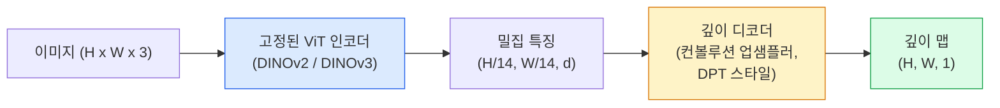

# 단안 깊이 및 기하학 추정

> 깊이 맵은 각 픽셀이 카메라로부터의 거리인 단일 채널 이미지입니다. 스테레오 또는 LiDAR 없이는 단일 RGB 프레임으로부터 예측하는 것이 불가능했지만, 2026년에는 고정된 ViT 인코더와 경량 헤드를 사용하여 실제 값에 몇 % 이내로 근접할 수 있게 되었습니다.

**유형:** 구축 + 활용  
**언어:** Python  
**사전 요구 사항:** 4단계 14강 (ViT), 4단계 17강 (자기 지도 학습 비전), 4단계 7강 (U-Net)  
**소요 시간:** ~60분

## 학습 목표

- **상대적 깊이(relative depth)**와 **메트릭 깊이(metric depth)**를 구분하고, 각 프로덕션 모델(MiDaS, Marigold, Depth Anything V3, ZoeDepth)이 어떤 문제를 해결하는지 설명  
- **Depth Anything V3**(DINOv2 백본)를 사용하여 캘리브레이션 없이 임의의 단일 이미지에 대한 깊이 예측 수행  
- **단안 깊이 추정(monocular depth)**이 단일 이미지에서 작동하는 원리(투영 단서(perspective cues), 텍스처 그래디언트(texture gradients), 학습된 사전 지식(learned priors))와 복원할 수 없는 것(절대 스케일(absolute scale), 가려진 기하학(occluded geometry)) 설명  
- 깊이 맵(depth map)과 **핀홀 카메라 내부 파라미터(pinhole camera intrinsics)**를 사용하여 2D 검출을 3D 포인트로 변환(lift)  

> **용어 설명**  
> - 상대적 깊이(relative depth): 장면 내 객체 간 상대적 거리 관계 (예: "A가 B보다 가깝다")  
> - 메트릭 깊이(metric depth): 실제 미터 단위의 절대 깊이 값  
> - 핀홀 카메라 내부 파라미터(pinhole camera intrinsics): 초점 거리(focal length), 주점(principal point) 등 카메라 광학 특성 파라미터

## 문제 정의

깊이(Depth)는 2D 컴퓨터 비전에서 누락된 축입니다. RGB 이미지를 통해 이미지 평면상의 객체 위치는 알 수 있지만, 객체까지의 거리는 알 수 없습니다. 깊이 센서(스테레오 리그, LiDAR, 시간 비행 센서)는 이를 직접 측정하지만 비용이 많이 들고, 취약하며, 측정 범위가 제한적입니다.

단일 RGB 프레임에서 깊이를 예측하는 **단안 깊이 추정(monocular depth estimation)**은 과거에는 흐릿하고 신뢰할 수 없는 결과를 생성했습니다. 그러나 2026년까지 대규모 사전 훈련된 인코더가 이 문제를 해결했습니다. **Depth Anything V3**는 고정된 DINOv2 백본을 사용하여 실내, 실외, 의료, 위성 도메인 전반에 걸쳐 일반화되는 깊이 맵을 생성합니다. **Marigold**는 깊이 예측을 조건부 확산 문제로 재구성하고, **ZoeDepth**는 실제 미터법 거리를 회귀합니다.

깊이는 또한 2D 검출과 3D 이해 사이의 가교 역할을 합니다. 검출된 바운딩 박스의 픽셀에 깊이 값을 곱하면 2D 객체를 3D 포인트 클라우드로 변환할 수 있습니다. 이는 모든 AR 가림 시스템, 장애물 회피 파이프라인, "컵 잡기" 로봇의 핵심 기술입니다.

## 개념

### 상대적 깊이 vs. 메트릭 깊이

- **상대적 깊이(relative depth)** — 실제 단위 없이 정렬된 `z` 값. "픽셀 A는 픽셀 B보다 가깝지만, 거리 비율은 미터에 고정되지 않음."
- **메트릭 깊이(metric depth)** — 카메라로부터의 미터 단위 절대 거리. 이미지 단서와 실제 거리 간의 통계적 관계를 모델이 학습해야 함.

MiDaS와 Depth Anything V3는 상대적 깊이를 생성합니다. Marigold도 상대적 깊이를 생성합니다. ZoeDepth, UniDepth, Metric3D는 메트릭 깊이를 생성합니다. 메트릭 모델은 카메라 내부 파라미터(intrinsics)에 민감하지만, 상대적 모델은 그렇지 않습니다.

### 인코더-디코더 패턴



Depth Anything V3는 인코더를 고정하고 DPT 스타일 디코더만 훈련시킵니다. 인코더는 풍부한 특징을 제공하며, 디코더는 이를 이미지 해상도로 보간하고 깊이를 회귀합니다.

### 단일 이미지로 깊이를 생성하는 이유

2D 이미지에는 깊이와 상관관계가 있는 많은 단안 단서(monocular cues)가 포함되어 있습니다:

- **원근법(perspective)** — 3D에서 평행한 선들이 2D에서 수렴합니다.
- **텍스처 그래디언트(texture gradient)** — 멀리 있는 표면은 더 작고 밀집된 텍스처를 가집니다.
- **가림 순서(occlusion order)** — 가까운 물체가 먼 물체를 가립니다.
- **크기 일관성(size constancy)** — 알려진 물체(자동차, 사람)는 대략적인 스케일을 제공합니다.
- **대기 원근법(atmospheric perspective)** — 야외 장면에서 먼 물체는 더 흐릿하고 푸르게 보입니다.

수십억 개의 이미지로 훈련된 ViT는 이러한 단서를 내재화합니다. 충분한 데이터와 강력한 백본이 있다면, 단안 깊이는 명시적인 3D 감독 없이도 합리적인 정확도를 달성합니다.

### 단안 깊이가 할 수 없는 것

- **카메라 내부 파라미터(intrinsics) 또는 장면 내 알려진 물체 없이 절대 메트릭 스케일(absolute metric scale)**. 네트워크는 "컵이 숟가락보다 두 배 멀리 있다"는 예측은 가능하지만, 컵이 1m인지 10m인지는 알 수 없습니다.
- **가려진 기하학(occluded geometry)** — 의자 뒷면은 보이지 않아 신뢰할 수 있게 추론할 수 없습니다.
- **완전히 무텍스처/반사 표면(truly untextured / reflective surfaces)** — 거울, 유리, 단색 벽. 네트워크는 그럴듯하지만 잘못된 깊이를 보고합니다.

### 2026년의 Depth Anything V3

- 인코더로 Vanilla DINOv2 ViT-L/14 사용 (고정).
- DPT 디코더.
- 다양한 소스의 포즈 이미지 쌍으로 훈련 (광학적 일관성 외에 명시적 깊이 감독 불필요).
- **임의의 수의 시각적 입력(알려진 카메라 포즈 유무 무관)**으로부터 공간적으로 일관된 기하학 예측.
- 단안 깊이, 임의 시점 기하학, 시각적 렌더링, 카메라 포즈 추정 분야에서 SOTA.

2026년에 깊이가 필요할 때 호출할 드롭인 모델입니다.

### Marigold — 깊이를 위한 확산 모델

Marigold (Ke et al., CVPR 2024)는 깊이 추정을 조건부 이미지-이미지 확산 모델로 재구성합니다. 조건: RGB. 목표: 깊이 맵. 사전 훈련된 Stable Diffusion 2 U-Net을 백본으로 사용합니다. 출력 깊이 맵은 객체 경계에서 매우 선명합니다. 단점: 피드포워드 모델보다 추론 속도가 느림 (10-50번의 노이즈 제거 단계).

### 카메라 내부 파라미터와 핀홀 카메라

깊이 `d`를 가진 픽셀 `(u, v)`를 카메라 좌표계의 3D 점 `(X, Y, Z)`로 변환하려면:

```
fx, fy, cx, cy = 카메라 내부 파라미터(intrinsics)
X = (u - cx) * d / fx
Y = (v - cy) * d / fy
Z = d
```

내부 파라미터는 EXIF 메타데이터, 캘리브레이션 패턴, 또는 단안 내부 파라미터 추정기(Perspective Fields, UniDepth)에서 얻을 수 있습니다. 내부 파라미터가 없으면 60-70° FOV와 중간 해상도의 주점(principal point)을 가정하여 포인트 클라우드를 렌더링할 수 있습니다. 이는 시각화에 사용 가능하지만 측정에는 부적합합니다.

### 평가

두 가지 표준 지표:

- **AbsRel** (절대 상대 오차): `mean(|d_pred - d_gt| / d_gt)`. 낮을수록 좋음. 프로덕션 모델의 경우 0.05-0.1.
- **delta < 1.25** (임계 정확도): `max(d_pred/d_gt, d_gt/d_pred) < 1.25`인 픽셀 비율. 높을수록 좋음. SOTA의 경우 0.9+.

상대적 깊이(Depth Anything V3, MiDaS)의 경우, 평가는 스케일 및 이동 불변 버전의 두 지표를 사용합니다.

## 구축 방법

### 1단계: 깊이 메트릭

```python
import torch

def abs_rel_error(pred, target, mask=None):
    if mask is not None:
        pred = pred[mask]
        target = target[mask]
    return (torch.abs(pred - target) / target.clamp(min=1e-6)).mean().item()


def delta_accuracy(pred, target, threshold=1.25, mask=None):
    if mask is not None:
        pred = pred[mask]
        target = target[mask]
    ratio = torch.maximum(pred / target.clamp(min=1e-6), target / pred.clamp(min=1e-6))
    return (ratio < threshold).float().mean().item()
```

평가 전에 항상 유효하지 않은 깊이 픽셀(0, NaN, 포화)을 마스킹하세요.

### 2단계: 스케일-및-시프트 정렬

상대적 깊이 모델의 경우 메트릭 계산 전에 예측을 실측값에 정렬하세요. `a * pred + b = target`의 최소 제곱 적합:

```python
def align_scale_shift(pred, target, mask=None):
    if mask is not None:
        p = pred[mask]
        t = target[mask]
    else:
        p = pred.flatten()
        t = target.flatten()
    A = torch.stack([p, torch.ones_like(p)], dim=1)
    coeffs, *_ = torch.linalg.lstsq(A, t.unsqueeze(-1))
    a, b = coeffs[:2, 0]
    return a * pred + b
```

MiDaS / Depth Anything 평가 시 `abs_rel_error` 전에 `align_scale_shift`를 실행하세요.

### 3단계: 깊이를 포인트 클라우드로 변환

```python
import numpy as np

def depth_to_point_cloud(depth, intrinsics):
    H, W = depth.shape
    fx, fy, cx, cy = intrinsics
    v, u = np.meshgrid(np.arange(H), np.arange(W), indexing="ij")
    z = depth
    x = (u - cx) * z / fx
    y = (v - cy) * z / fy
    return np.stack([x, y, z], axis=-1)


depth = np.random.uniform(0.5, 4.0, (240, 320))
intr = (320.0, 320.0, 160.0, 120.0)
pc = depth_to_point_cloud(depth, intr)
print(f"point cloud shape: {pc.shape}  (H, W, 3)")
```

모든 3D-리프팅 애플리케이션에 필요한 함수입니다. 포인트 클라우드를 `.ply`로 내보내고 MeshLab 또는 CloudCompare에서 열 수 있습니다.

### 4단계: 합성 깊이 장면으로 테스트

```python
def synthetic_depth(size=96):
    yy, xx = np.meshgrid(np.arange(size), np.arange(size), indexing="ij")
    # 바닥: 가까운 곳(상단)에서 먼 곳(하단)으로 선형 그라데이션
    depth = 1.0 + (yy / size) * 4.0
    # 중앙 상자: 더 가까운 곳
    mask = (np.abs(xx - size / 2) < size / 6) & (np.abs(yy - size * 0.6) < size / 6)
    depth[mask] = 2.0
    return depth.astype(np.float32)


gt = torch.from_numpy(synthetic_depth(96))
pred = gt + 0.3 * torch.randn_like(gt)  # 시뮬레이션된 예측
aligned = align_scale_shift(pred, gt)
print(f"정렬 전  absRel = {abs_rel_error(pred, gt):.3f}")
print(f"정렬 후  absRel = {abs_rel_error(aligned, gt):.3f}")
```

### 5단계: Depth Anything V3 사용법 (참고)

```python
import torch
from transformers import pipeline
from PIL import Image

pipe = pipeline(task="depth-estimation", model="LiheYoung/depth-anything-v2-large")

image = Image.open("street.jpg").convert("RGB")
out = pipe(image)
depth_np = np.array(out["depth"])
```

3줄이면 됩니다. `out["depth"]`는 PIL 그레이스케일 이미지입니다. 수학 연산을 위해 numpy로 변환하세요. Depth Anything V3의 경우 모델 ID가 공개되면 교체하세요. API는 변경되지 않습니다.

## 사용 방법

- **Depth Anything V3** (Meta AI / ByteDance, 2024-2026) — 상대적 깊이의 기본 모델. ViT-large 백본 기반 모델 중 프로덕션에서 가장 빠름.
- **Marigold** (ETH, 2024) — 최고 수준의 시각적 품질, 추론 속도 느림.
- **UniDepth** (ETH, 2024) — 카메라 내부 파라미터 추정과 함께 메트릭 깊이 제공.
- **ZoeDepth** (Intel, 2023) — 메트릭 깊이; 이전 버전이지만 여전히 신뢰할 수 있음.
- **MiDaS v3.1** — 레거시이지만 안정적; 비교를 위한 좋은 기준 모델.

일반적인 통합 패턴:

1. RGB 프레임 도착.
2. 깊이 모델이 깊이 맵 생성.
3. 검출기가 바운딩 박스 생성.
4. 깊이 정보를 통해 박스 중심점을 3D로 변환; 포인트 클라우드가 있는 경우 병합.
5. 다운스트림 작업: AR 가림 처리, 경로 계획, 객체 크기 추정, 스테레오 대체.

실시간 사용 시, Depth Anything V2 Small (INT8 양자화)은 518x518 해상도에서 소비자 GPU에서 약 30fps 성능 달성.

## Ship It

이 레슨은 다음을 생성합니다:

- `outputs/prompt-depth-model-picker.md` — 지연 시간(latency), 메트릭-대-상대적(metric-vs-relative) 요구 사항, 장면 유형(scene type)에 따라 Depth Anything V3, Marigold, UniDepth, MiDaS 중 모델을 선택합니다.
- `outputs/skill-depth-to-pointcloud.md` — 올바른 내부 파라미터(intrinsics) 처리와 `.ply` 파일로의 내보내기를 지원하는 깊이 맵에서 포인트 클라우드를 생성하는 스킬입니다.

## 연습 문제

1. **(쉬움)** Depth Anything V2를 책상 사진 10장에 실행해 보세요. 깊이 정보를 그레이스케일 PNG로 저장하고 확인하세요. 예측된 깊이가 잘못 보이는 물체 하나를 찾아 단안 시각 단서(monocular cues)가 왜 실패했는지 설명하세요.
2. **(중간)** Depth Anything V2로 추출한 RGB + 깊이 정보를 포인트 클라우드로 변환하고 `open3d`로 시각화하세요. 실내/실외 장면 두 가지를 비교하고 어떤 것이 더 실제처럼 보이는지 분석하세요.
3. **(어려움)** 알려진 물체의 위치만 다른 이미지 5쌍(예: 병을 30cm 가까이 이동)을 준비하세요. UniDepth로 두 이미지의 미터법 깊이(metric depth)를 예측하고, 실제 30cm 이동량과 예측된 깊이 변화량을 비교 보고하세요.

## 주요 용어

| 용어 | 사람들이 말하는 표현 | 실제 의미 |
|------|----------------|----------------------|
| 단안 깊이(Monocular depth) | "단일 이미지 깊이(Single-image depth)" | 스테레오 또는 LiDAR 없이 하나의 RGB 프레임으로부터 깊이 추정 |
| 상대적 깊이(Relative depth) | "순서화된 깊이(Ordered depth)" | 실제 단위 없이 순서가 지정된 z-값 |
| 메트릭 깊이(Metric depth) | "절대 거리(Absolute distance)" | 미터 단위의 깊이; 캘리브레이션 또는 메트릭 감독으로 학습된 모델 필요 |
| AbsRel | "절대 상대 오차(Absolute relative error)" | |d_pred - d_gt| / d_gt의 평균; 표준 깊이 메트릭 |
| 델타 정확도(Delta accuracy) | "델타 < 1.25" | 예측이 실측값의 25% 이내인 픽셀 비율 |
| 핀홀 카메라(Pinhole camera) | "fx, fy, cx, cy" | (u, v, d)를 (X, Y, Z)로 변환하는 데 사용되는 카메라 모델 |
| DPT | "밀집 예측 트랜스포머(Dense Prediction Transformer)" | 깊이 추정을 위해 고정된 ViT 인코더 위에 사용되는 합성곱 기반 디코더 |
| DINOv2 백본(DINOv2 backbone) | "작동하는 이유" | 깊이 레이블 없이도 도메인 간 일반화되는 자기 감독 학습 특징 |

## 추가 자료

- [Depth Anything V3 논문 페이지](https://depth-anything.github.io/) — DINOv2 인코더를 활용한 최첨단 단안 깊이 추정
- [Marigold (Ke et al., CVPR 2024)](https://marigoldmonodepth.github.io/) — 확산 기반 깊이 추정
- [UniDepth (Piccinelli et al., 2024)](https://arxiv.org/abs/2403.18913) — 내부 파라미터를 활용한 메트릭 깊이 추정
- [MiDaS v3.1 (Intel ISL)](https://github.com/isl-org/MiDaS) — 상대적 깊이 추정의 표준 베이스라인
- [DINOv3 블로그 포스트 (Meta)](https://ai.meta.com/blog/dinov3-self-supervised-vision-model/) — 깊이 정확도를 향상시키는 인코더 패밀리