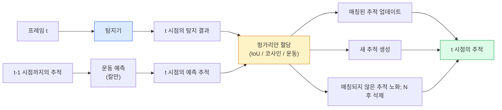

# 다중 객체 추적 & 비디오 메모리

> 추적은 검출(detection)에 연관(association)을 더한 것입니다. 모든 프레임에서 검출합니다. 현재 프레임의 검출 결과를 이전 프레임의 추적 ID와 매칭합니다.

**유형:** Build  
**언어:** Python  
**사전 요구 사항:** Phase 4 Lesson 06 (YOLO 검출), Phase 4 Lesson 08 (Mask R-CNN), Phase 4 Lesson 24 (SAM 3)  
**소요 시간:** ~60분

## 학습 목표

- **추적-검출(tracking-by-detection)**과 **쿼리 기반 추적(query-based tracking)**을 구분하고, 알고리즘 패밀리(SORT, DeepSORT, ByteTrack, BoT-SORT, SAM 2 메모리 트래커, SAM 3.1 Object Multiplex)를 명명할 수 있다.
- **IoU(Intersection over Union) + 헝가리안 할당(Hungarian assignment)**을 처음부터 구현하여 클래식 추적-검출 방식을 이해한다.
- **SAM 2의 메모리 뱅크(memory bank)**가 IoU 기반 연관보다 **가림(occlusion)**을 더 잘 처리하는 이유를 설명한다.
- **세 가지 추적 메트릭(MOTA, IDF1, HOTA)**을 읽고, 주어진 사용 사례에 어떤 메트릭이 중요한지 선택할 수 있다.

## 문제 정의

검출기(detector)는 단일 프레임에서 객체의 위치를 알려줍니다. 추적기(tracker)는 프레임 `t`의 어떤 검출이 프레임 `t-1`의 어떤 객체와 동일한지 알려줍니다. 이것이 없으면 선을 넘는 객체 수를 세거나, 가림 현상(occlusion)을 통과하는 공을 추적하거나, "차량 #4가 8초 동안 차선에 있었다"는 정보를 알 수 없습니다.

추적은 모든 비디오 기반 제품에 필수적입니다: 스포츠 분석, 감시, 자율주행, 의료 영상 분석, 야생동물 모니터링, 워드마크 카운팅. 핵심 구성 요소는 다음과 같이 공유됩니다: 프레임별 검출기(per-frame detector), 운동 모델(motion model, 칼만 필터 또는 더 복잡한 모델), 연관 단계(association step, IoU/코사인/학습된 특징에 대한 헝가리안 알고리즘), 추적 생명 주기(track lifecycle, 생성, 업데이트, 소멸).

2026년에는 두 가지 새로운 패턴이 등장했습니다: **SAM 2 메모리 기반 추적**(운동 모델 연관 대신 특징-메모리 사용)과 **SAM 3.1 객체 멀티플렉스**(동일 개념의 여러 인스턴스에 대한 공유 메모리). 이 강의에서는 먼저 고전적인 추적 스택을 설명한 후 메모리 기반 접근법을 다룹니다.

## 개념

### 탐지 기반 추적(Tracking-by-detection)



2026년에 접할 모든 추적기는 이 루프의 변형입니다. 차이점:

- **SORT** (2016): 칼만 필터 + IoU 헝가리안. 단순하고 빠르며 외관 모델 없음.
- **DeepSORT** (2017): SORT + 추적별 CNN 기반 외관 특징(ReID 임베딩). 교차 상황 처리 개선.
- **ByteTrack** (2021): 저신뢰도 탐지를 2단계로 연관; 외관 특징 없이도 MOT17 최고 성능.
- **BoT-SORT** (2022): Byte + 카메라 운동 보정 + ReID.
- **StrongSORT / OC-SORT** — ByteTrack의 후손으로 운동 및 외관 모델 개선.

### 칼만 필터 한 단락 설명

칼만 필터는 공분산을 가진 추적별 상태 `(x, y, w, h, dx, dy, dw, dh)`를 유지합니다. 각 프레임에서 **상수 속도 모델**로 상태를 예측한 후, 매칭된 탐지로 **업데이트**합니다. 예측 불확실성이 높을 때 탐지를 더 신뢰합니다. 이는 부드러운 궤적과 짧은 가림(1-5 프레임) 동안 추적 유지 능력을 제공합니다.

모든 고전적 추적기는 운동 예측 단계에서 칼만 필터를 사용합니다.

### 헝가리안 알고리즘

`M x N` 비용 행렬(추적 x 탐지)이 주어졌을 때, 총 비용을 최소화하는 일대일 할당을 찾습니다. 비용은 일반적으로 `1 - IoU(추적_바운딩박스, 탐지_바운딩박스)` 또는 외관 특징의 음의 코사인 유사도입니다. 실행 시간은 O((M+N)^3)이며, M, N이 ~1000까지일 때 `scipy.optimize.linear_sum_assignment`를 통해 Python에서 충분히 빠릅니다.

### ByteTrack의 핵심 아이디어

표준 추적기는 저신뢰도 탐지(< 0.5)를 버립니다. ByteTrack은 이를 **2단계 후보**로 유지합니다: 고신뢰도 탐지와 추적을 매칭한 후, 매칭되지 않은 추적은 약간 완화된 IoU 임계값으로 저신뢰도 탐지와 매칭을 시도합니다. 짧은 가림, 군중 근처 ID 전환 복구.

### SAM 2 메모리 기반 추적

SAM 2는 인스턴스별 시공간 특징의 **메모리 뱅크**를 유지하여 비디오를 처리합니다. 한 프레임에서 프롬프트(클릭, 박스, 텍스트)가 주어지면 인스턴스를 메모리에 인코딩합니다. 이후 프레임에서 메모리는 새 프레임의 특징과 교차 어텐션되며, 디코더는 새 프레임에서 동일 인스턴스의 마스크를 생성합니다.

칼만 필터, 헝가리안 할당 없음. 연관성은 메모리-어텐션 연산에 암묵적.

장점:
- 큰 가림에 강건(메모리가 여러 프레임에 걸쳐 인스턴스 ID 유지).
- SAM 3의 텍스트 프롬프트와 결합 시 오픈-보캐블러리.
- 별도의 운동 모델 없이 작동.

단점:
- 다중 객체 추적에서 ByteTrack보다 느림.
- 메모리 뱅크 증가; 컨텍스트 윈도우 제한.

### SAM 3.1 객체 멀티플렉스

이전 SAM 2/SAM 3 추적은 인스턴스별로 별도의 메모리 뱅크를 유지했습니다. 50개 객체에는 50개 메모리 뱅크. 객체 멀티플렉스(2026년 3월)는 **인스턴스별 쿼리 토큰**이 있는 공유 메모리로 통합합니다. 비용은 인스턴스 수에 대해 준선형적으로 증가.

멀티플렉스는 2026년 군중 추적의 새로운 기본: 콘서트 군중, 창고 작업자, 교통 교차로.

### 알아야 할 세 가지 지표

- **MOTA (다중 객체 추적 정확도)** — 1 - (FN + FP + ID 전환) / GT. 오류 유형별 가중치; 탐지 및 연관성 실패를 혼합하는 단일 지표.
- **IDF1 (ID F1)** — ID 정밀도와 재현율의 조화 평균. 각 그라운드 트루스 추적이 시간에 따라 ID를 얼마나 잘 유지하는지에 집중. ID 전환 민감 작업에 MOTA보다 우수.
- **HOTA (고차원 추적 정확도)** — 탐지 정확도(DetA)와 연관성 정확도(AssA)로 분해. 2020년 이후 커뮤니티 표준; 가장 포괄적.

감시(누가 누구인가): IDF1 보고. 스포츠 분석(패스 카운팅): HOTA. 일반 학술 비교: HOTA.

## 구축 방법

### 1단계: IoU 기반 비용 행렬

```python
import numpy as np


def bbox_iou(a, b):
    """
    a, b: (N, 4) 배열의 [x1, y1, x2, y2].
    (N_a, N_b) IoU 행렬을 반환합니다.
    """
    ax1, ay1, ax2, ay2 = a[:, 0], a[:, 1], a[:, 2], a[:, 3]
    bx1, by1, bx2, by2 = b[:, 0], b[:, 1], b[:, 2], b[:, 3]
    inter_x1 = np.maximum(ax1[:, None], bx1[None, :])
    inter_y1 = np.maximum(ay1[:, None], by1[None, :])
    inter_x2 = np.minimum(ax2[:, None], bx2[None, :])
    inter_y2 = np.minimum(ay2[:, None], by2[None, :])
    inter = np.clip(inter_x2 - inter_x1, 0, None) * np.clip(inter_y2 - inter_y1, 0, None)
    area_a = (ax2 - ax1) * (ay2 - ay1)
    area_b = (bx2 - bx1) * (by2 - by1)
    union = area_a[:, None] + area_b[None, :] - inter
    return inter / np.clip(union, 1e-8, None)
```

### 2단계: 최소 SORT 스타일 추적기

간결성을 위해 고정 속도 칼만 필터는 생략되었습니다. 여기서는 간단한 IoU 매칭을 사용합니다. 실제 시스템에서는 칼만 예측이 필수적입니다. `sort` Python 패키지에서 전체 버전을 제공합니다.

```python
from scipy.optimize import linear_sum_assignment


class Track:
    def __init__(self, tid, bbox, frame):
        self.id = tid
        self.bbox = bbox
        self.last_frame = frame
        self.hits = 1

    def update(self, bbox, frame):
        self.bbox = bbox
        self.last_frame = frame
        self.hits += 1


class SimpleTracker:
    def __init__(self, iou_threshold=0.3, max_age=5):
        self.tracks = []
        self.next_id = 1
        self.iou_threshold = iou_threshold
        self.max_age = max_age

    def step(self, detections, frame):
        if not self.tracks:
            for d in detections:
                self.tracks.append(Track(self.next_id, d, frame))
                self.next_id += 1
            return [(t.id, t.bbox) for t in self.tracks]

        track_boxes = np.array([t.bbox for t in self.tracks])
        det_boxes = np.array(detections) if len(detections) else np.empty((0, 4))

        iou = bbox_iou(track_boxes, det_boxes) if len(det_boxes) else np.zeros((len(track_boxes), 0))
        cost = 1 - iou
        cost[iou < self.iou_threshold] = 1e6

        matched_track = set()
        matched_det = set()
        if cost.size > 0:
            row, col = linear_sum_assignment(cost)
            for r, c in zip(row, col):
                if cost[r, c] < 1.0:
                    self.tracks[r].update(det_boxes[c], frame)
                    matched_track.add(r); matched_det.add(c)

        for i, d in enumerate(det_boxes):
            if i not in matched_det:
                self.tracks.append(Track(self.next_id, d, frame))
                self.next_id += 1

        self.tracks = [t for t in self.tracks if frame - t.last_frame <= self.max_age]
        return [(t.id, t.bbox) for t in self.tracks]
```

60줄. 프레임별 검출을 입력으로 받아 프레임별 추적 ID를 반환합니다. 실제 시스템에서는 칼만 예측, ByteTrack의 2단계 재매칭, 외형 특징 등을 추가합니다.

### 3단계: 합성 궤적 테스트

```python
def synthetic_frames(num_frames=20, num_objects=3, H=240, W=320, seed=0):
    rng = np.random.default_rng(seed)
    starts = rng.uniform(20, 200, size=(num_objects, 2))
    velocities = rng.uniform(-5, 5, size=(num_objects, 2))
    frames = []
    for f in range(num_frames):
        dets = []
        for i in range(num_objects):
            cx, cy = starts[i] + f * velocities[i]
            dets.append([cx - 10, cy - 10, cx + 10, cy + 10])
        frames.append(dets)
    return frames


tracker = SimpleTracker()
for f, dets in enumerate(synthetic_frames()):
    tracks = tracker.step(dets, f)
```

직선으로 움직이는 3개의 객체가 20프레임 동안 ID를 유지해야 합니다.

### 4단계: ID 전환 메트릭

```python
def count_id_switches(tracks_per_frame, gt_per_frame):
    """
    tracks_per_frame:  (track_id, bbox) 리스트 리스트
    gt_per_frame:      (gt_id, bbox) 리스트 리스트
    ID 전환 횟수를 반환합니다.
    """
    prev_assignment = {}
    switches = 0
    for tracks, gts in zip(tracks_per_frame, gt_per_frame):
        if not tracks or not gts:
            continue
        t_boxes = np.array([b for _, b in tracks])
        g_boxes = np.array([b for _, b in gts])
        iou = bbox_iou(g_boxes, t_boxes)
        for g_idx, (gt_id, _) in enumerate(gts):
            j = iou[g_idx].argmax()
            if iou[g_idx, j] > 0.5:
                t_id = tracks[j][0]
                if gt_id in prev_assignment and prev_assignment[gt_id] != t_id:
                    switches += 1
                prev_assignment[gt_id] = t_id
    return switches
```

이것은 단순화된 IDF1 유사 메트릭입니다. 실제 MOTA/IDF1/HOTA 툴은 `py-motmetrics`와 `TrackEval`에 있습니다.

## 사용 방법

2026년 프로덕션 트래커:

- `ultralytics` — YOLOv8 + ByteTrack / BoT-SORT 내장. `results = model.track(source, tracker="bytetrack.yaml")`. 기본값.
- `supervision` (Roboflow) — ByteTrack 래퍼 및 어노테이션 유틸리티.
- SAM 2 / SAM 3.1 — `processor.track()`을 통한 메모리 기반 트래킹.
- 커스텀 스택: 탐지기(YOLOv8 / RT-DETR) + `sort-tracker` / `OC-SORT` / `StrongSORT`.

선택 가이드:

- 보행자 / 차량 / 상자 30+ fps: **ultralytics의 ByteTrack**.
- 군중 속 동일 클래스 다수 인스턴스: **SAM 3.1 Object Multiplex**.
- 식별 가능한 외형의 심한 가림 현상: **DeepSORT / StrongSORT** (ReID 특징).
- 스포츠 / 복잡한 상호작용: **BoT-SORT** 또는 학습 기반 트래커(MOTRv3).

## Ship It

이 레슨은 다음을 생성합니다:

- `outputs/prompt-tracker-picker.md` — 장면 유형, 가림 패턴, 지연 예산에 따라 SORT / ByteTrack / BoT-SORT / SAM 2 / SAM 3.1을 선택합니다.
- `outputs/skill-mot-evaluator.md` — 실제 트랙에 대한 MOTA / IDF1 / HOTA 평가 하네스를 완전히 작성합니다.

## 연습 문제

1. **(쉬움)** 위의 합성 트래커를 3개, 10개, 30개의 객체로 실행해 보세요. 각 경우의 ID 전환 횟수를 보고하세요. 단순한 IoU(Intersection over Union) 기반 연관 방식이 실패하기 시작하는 지점을 파악하세요.
2. **(중간)** 연관 단계 전에 상수 속도 칼만 예측 단계를 추가하세요. 짧은(2-3 프레임) 가림 현상이 더 이상 ID 전환을 유발하지 않음을 보여주세요.
3. **(어려움)** `transformers`를 통해 SAM 2의 메모리 기반 트래커를 대체 트래커 백엔드로 통합하세요. 30초 분량의 군중 영상에서 SimpleTracker와 SAM 2를 모두 실행하고, 5명의 눈에 띄는 사람에 대해 수동으로 실제 ID를 라벨링하여 ID 전환 횟수를 비교하세요.

## 주요 용어

| 용어 | 사람들이 말하는 것 | 실제 의미 |
|------|----------------|----------------------|
| Tracking-by-detection | "검출 후 연관" | 프레임별 검출기 + IoU/외형 기반 헝가리안 할당 |
| Kalman filter | "운동 예측" | 선형 동역학 + 공분산을 통한 부드러운 추적 예측 및 가림 처리 |
| Hungarian algorithm | "최적 할당" | 최소 비용 이분 매칭 문제 해결; `scipy.optimize.linear_sum_assignment` |
| ByteTrack | "저신뢰도 2차 패스" | 매칭되지 않은 트랙을 저신뢰도 검출과 재매칭하여 짧은 가림 복구 |
| DeepSORT | "SORT + 외형" | 프레임 간 매칭을 위한 ReID 특징 추가; ID 보존에 더 우수 |
| Memory bank | "SAM 2 트릭" | 프레임 간 저장된 인스턴스별 시공간 특징; 명시적 연관 대체용 교차 어텐션 |
| Object Multiplex | "SAM 3.1 공유 메모리" | 빠른 다중 객체 추적을 위한 인스턴스별 쿼리가 있는 단일 공유 메모리 |
| HOTA | "현대적 추적 지표" | 검출 및 연관 정확도로 분해; 커뮤니티 표준 |

## 추가 자료

- [SORT (Bewley et al., 2016)](https://arxiv.org/abs/1602.00763) — 최소 추적-검출 논문
- [DeepSORT (Wojke et al., 2017)](https://arxiv.org/abs/1703.07402) — 외형 특징 추가
- [ByteTrack (Zhang et al., 2022)](https://arxiv.org/abs/2110.06864) — 저신뢰도 2차 패스
- [BoT-SORT (Aharon et al., 2022)](https://arxiv.org/abs/2206.14651) — 카메라 모션 보정
- [HOTA (Luiten et al., 2020)](https://arxiv.org/abs/2009.07736) — 분해된 추적 메트릭
- [SAM 2 비디오 세그멘테이션 (Meta, 2024)](https://ai.meta.com/sam2/) — 메모리 기반 추적기
- [SAM 3.1 오브젝트 멀티플렉스 (Meta, 2026년 3월)](https://ai.meta.com/blog/segment-anything-model-3/)