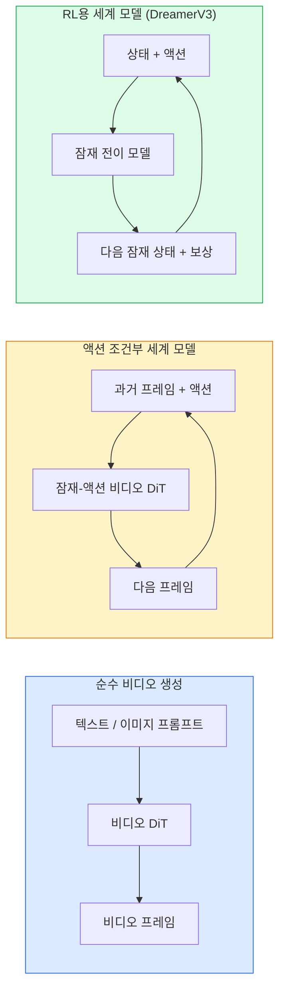

# 월드 모델 & 비디오 디퓨전

> 장면의 다음 몇 초를 예측하는 비디오 모델은 세계 시뮬레이터(simulator)입니다. 그 예측을 액션에 조건화하면 학습된 게임 엔진을 갖게 됩니다.

**유형:** 학습 + 구축  
**언어:** Python  
**선수 지식:** 4단계 10강 (디퓨전), 4단계 12강 (비디오 이해), 4단계 23강 (DiT + 정류 흐름)  
**소요 시간:** ~75분

## 학습 목표

- 순수 비디오 생성 모델(Sora 2)과 액션 조건부 세계 모델(Genie 3, DreamerV3)의 차이점 설명
- 비디오 DiT 설명: 시공간 패치(spatio-temporal patches), 3D 위치 인코딩(3D position encoding), (T, H, W) 토큰 간 결합 어텐션(joint attention)
- 세계 모델이 로봇공학에 통합되는 과정 추적: VLM(Visual Language Model) 계획 → 비디오 모델 시뮬레이션 → 역역학(inverse dynamics) 액션 출력
- 주어진 사용 사례(창의적 비디오, 대화형 시뮬레이션, 자율주행 합성)에 따라 Sora 2, Genie 3, Runway GWM-1 Worlds, Wan-Video, HunyuanVideo 중 적절한 모델 선택

## 문제 정의

비디오 생성과 세계 모델링은 2026년에 융합되었습니다. 일관된 1분 길이의 비디오를 생성할 수 있는 모델은 어떤 의미에서 세계가 어떻게 움직이는지 학습한 것입니다: 물체의 영속성, 중력, 인과 관계, 스타일 등. 만약 해당 예측에 행동(왼쪽으로 이동, 문 열기)을 조건으로 부여하면, 비디오 모델은 게임 엔진, 운전 시뮬레이터 또는 로봇 환경을 대체할 수 있는 학습 가능한 시뮬레이터가 됩니다.

이 문제의 중요성은 구체적입니다. Genie 3는 단일 이미지로부터 플레이 가능한 환경을 생성합니다. Runway GWM-1 Worlds는 무한히 탐험 가능한 장면을 합성합니다. Sora 2는 동기화된 오디오와 모델링된 물리 법칙을 갖춘 1분 길이의 비디오를 제작합니다. NVIDIA Cosmos-Drive, Wayve Gaia-2, Tesla DrivingWorld는 자율 주행 차량 훈련 데이터를 위한 현실적인 운전 비디오를 생성합니다. 세계 모델 패러다임은 로봇 공학의 시뮬레이션-실제(sim-to-real) 분야를 조용히 장악하고 있습니다.

이 레슨은 Phase 4를 위한 "큰 그림" 레슨입니다. 이미지 생성, 비디오 이해, 에이전트 추론을 연결하여 연구 분야에서 주류가 되고 있는 아키텍처 패턴으로 통합합니다.

## 개념

### 세계 모델링의 세 가지 계열



- **Sora 2**는 프롬프트에 조건화된 순수 비디오 생성입니다. 액션 인터페이스가 없습니다. 생성 중간에 "조종"할 수 없습니다.
- **Genie 3**, **GWM-1 Worlds**, **Mirage / Magica**는 액션 조건부 세계 모델입니다. 관찰된 비디오에서 잠재 액션을 추론한 후, 미래 프레임 예측을 액션에 조건화합니다. 인터랙티브 — 키를 누르거나 카메라를 움직이면 장면이 반응합니다.
- **DreamerV3** 및 클래식 RL 세계 모델 계열은 보상 신호로 훈련되며, 명시적 액션 조건화를 통해 잠재 공간에서 예측합니다. 시각적 품질은 낮지만 샘플 효율적인 RL에 더 유용합니다.

### 비디오 DiT 아키텍처

```
비디오 잠재 공간:          (C, T, H, W)
패치화 (공간):    프레임당 P_h x P_w 패치 그리드
패치화 (시간):   P_t 프레임을 시간 패치로 그룹화
결과 토큰:      (T / P_t) * (H / P_h) * (W / P_w) 토큰
```

위치 인코딩은 3D입니다: (t, h, w) 좌표당 회전식 또는 학습된 임베딩. 어텐션은 다음과 같을 수 있습니다:

- **전체 결합** — 모든 토큰이 모든 토큰에 어텐션. N 토큰에 대해 O(N²). 긴 비디오에는 부적합.
- **분할** — 시간 어텐션(동일 공간 위치, 시간 축: `(H*W) * T²`)과 공간 어텐션(동일 타임스텝, 공간 축: `T * (H*W)²`)을 번갈아 사용. TimeSformer 및 대부분의 비디오 DiT에서 사용.
- **윈도우** — (t, h, w)의 로컬 윈도우. Video Swin에서 사용.

모든 2026년 비디오 확산 모델은 이 세 가지 패턴 중 하나와 AdaLN 조건화(레슨 23) 및 정류 흐름(rectified flow)을 사용합니다.

### 액션 조건화: 잠재 액션 모델

Genie는 연속된 두 프레임 간 액션을 판별적으로 예측하여 프레임당 **잠재 액션**을 학습합니다. 디코더는 추론된 잠재 액션에 조건화됩니다 — 명시적 키보드 키가 아닙니다. 추론 시 사용자는 잠재 액션을 지정하거나(새 사전 분포에서 샘플링) 모델이 해당 액션과 일관된 다음 프레임을 생성합니다.

Sora는 액션 인터페이스를 완전히 생략합니다. 디코더는 과거 시공간 토큰에서 다음 시공간 토큰을 예측합니다. 프롬프트는 시작을 조건화하지만, 생성 중간에는 아무것도 조종하지 않습니다.

### 물리적 타당성

Sora 2의 2026년 릴리스는 **물리적 타당성**을 명시적으로 광고했습니다: 무게, 균형, 객체 영속성, 인과 관계. 팀은 수작업으로 평가된 타당성 점수로 측정했으며, Sora 1 대비 떨어진 물체, 캐릭터 충돌, 의도적 실패(미스된 점프)에서 모델이 개선되었습니다.

물리적 타당성은 여전히 주요 실패 모드입니다. 2024-2025년 스파게티 먹기 또는 유리잔 마시기 비디오에서 모델의 지속적 객체 표현 부족이 드러났습니다. 2026년 모델(Sora 2, Runway Gen-5, HunyuanVideo)은 이를 줄였지만 완전히 제거하지는 못했습니다.

### 자율 주행 세계 모델

주행 세계 모델은 궤적, 경계 상자 또는 내비게이션 맵에 조건화된 현실적인 도로 장면을 생성합니다. 활용 사례:

- **Cosmos-Drive-Dreams** (NVIDIA) — RL 훈련을 위한 수분 길이의 주행 비디오 생성.
- **Gaia-2** (Wayve) — 정책 평가를 위한 궤적 조건부 장면 합성.
- **DrivingWorld** (Tesla) — 다양한 날씨, 시간대, 교통 조건 시뮬레이션.
- **Vista** (ByteDance) — 반응형 주행 장면 합성.

이들은 수백만 마일의 주행이 필요한 코너 케이스(야간 보행자 무단횡단, 빙판 교차로, 특이한 차량 유형)에 대한 실제 데이터 수집 비용을 대체합니다.

### 로봇 공학 스택: VLM + 비디오 모델 + 역역학

새롭게 부상하는 3단계 로봇 공학 루프:

1. **VLM**이 목표("빨간 컵 집기")를 파싱하고 고수준 액션 시퀀스를 계획합니다.
2. **비디오 생성 모델**이 각 액션 실행 시 예상되는 관측값을 시뮬레이션 — N 프레임 앞을 예측합니다.
3. **역역학 모델**이 해당 관측값을 생성할 구체적 모터 명령을 추출합니다.

이는 보상 형성 및 샘플 집약적 RL을 대체합니다. 세계 모델이 상상을 수행하고, 역역학이 구동을 닫습니다. Genie Envisioner가 한 구현체이며, 많은 연구 그룹이 이 구조로 수렴 중입니다.

### 평가

- **시각적 품질** — FVD(Fréchet Video Distance), 사용자 연구.
- **프롬프트 정렬** — 프레임당 CLIPScore, VQA 스타일 평가.
- **물리적 타당성** — 벤치마크 스위트(Sora 2 내부 벤치마크, VBench)에서 수작업 평가.
- **제어 가능성** (인터랙티브 세계 모델용) — 액션 → 관측 일관성; 이전 상태로 돌아갈 수 있는가?

### 2026년 모델 현황

| 모델 | 용도 | 파라미터 | 출력 | 라이선스 |
|-------|-----|------------|--------|---------|
| Sora 2 | 텍스트-비디오, 오디오 | — | 1분 1080p + 오디오 | API 전용 |
| Runway Gen-5 | 텍스트/이미지-비디오 | — | 10초 클립 | API |
| Runway GWM-1 Worlds | 인터랙티브 세계 | — | 무한 3D 롤아웃 | API |
| Genie 3 | 이미지로부터 인터랙티브 세계 | 11B+ | 플레이 가능한 프레임 | 연구 프리뷰 |
| Wan-Video 2.1 | 오픈 텍스트-비디오 | 14B | 고품질 클립 | 비상업적 |
| HunyuanVideo | 오픈 텍스트-비디오 | 13B | 10초 클립 | 허용적 |
| Cosmos / Cosmos-Drive | 자율 주행 시뮬레이션 | 7-14B | 주행 장면 | NVIDIA 오픈 |
| Magica / Mirage 2 | AI 네이티브 게임 엔진 | — | 수정 가능한 세계 | 제품 |

## 구축 방법

### 1단계: 비디오를 위한 3D 패치화

```python
import torch
import torch.nn as nn


class VideoPatch3D(nn.Module):
    def __init__(self, in_channels=4, dim=64, patch_t=2, patch_h=2, patch_w=2):
        super().__init__()
        self.proj = nn.Conv3d(
            in_channels, dim,
            kernel_size=(patch_t, patch_h, patch_w),
            stride=(patch_t, patch_h, patch_w),
        )
        self.patch_t = patch_t
        self.patch_h = patch_h
        self.patch_w = patch_w

    def forward(self, x):
        # x: (N, C, T, H, W)
        x = self.proj(x)
        n, c, t, h, w = x.shape
        tokens = x.reshape(n, c, t * h * w).transpose(1, 2)
        return tokens, (t, h, w)
```

커널과 동일한 스트라이드를 가진 3D 컨볼루션은 시공간 패치화기 역할을 합니다. `(T, H, W) -> (T/2, H/2, W/2)` 토큰 그리드를 생성합니다.

### 2단계: 3D 회전 위치 인코딩

회전 위치 임베딩(RoPE)은 `t`, `h`, `w` 축에 별도로 적용됩니다:

```python
def rope_3d(tokens, t_dim, h_dim, w_dim, grid):
    """
    tokens: (N, T*H*W, D)
    grid: (T, H, W) 크기
    t_dim + h_dim + w_dim == D
    """
    T, H, W = grid
    n, seq, d = tokens.shape
    if t_dim + h_dim + w_dim != d:
        raise ValueError(f"t_dim+h_dim+w_dim ({t_dim}+{h_dim}+{w_dim}) must equal D={d}")
    assert seq == T * H * W
    t_idx = torch.arange(T, device=tokens.device).repeat_interleave(H * W)
    h_idx = torch.arange(H, device=tokens.device).repeat_interleave(W).repeat(T)
    w_idx = torch.arange(W, device=tokens.device).repeat(T * H)
    # 단순화: 채널에 주파수 스케일 적용. 실제 RoPE는 쌍을 회전시킵니다.
    freqs_t = torch.exp(-torch.log(torch.tensor(10000.0)) * torch.arange(t_dim // 2, device=tokens.device) / (t_dim // 2))
    freqs_h = torch.exp(-torch.log(torch.tensor(10000.0)) * torch.arange(h_dim // 2, device=tokens.device) / (h_dim // 2))
    freqs_w = torch.exp(-torch.log(torch.tensor(10000.0)) * torch.arange(w_dim // 2, device=tokens.device) / (w_dim // 2))
    emb_t = torch.cat([torch.sin(t_idx[:, None] * freqs_t), torch.cos(t_idx[:, None] * freqs_t)], dim=-1)
    emb_h = torch.cat([torch.sin(h_idx[:, None] * freqs_h), torch.cos(h_idx[:, None] * freqs_h)], dim=-1)
    emb_w = torch.cat([torch.sin(w_idx[:, None] * freqs_w), torch.cos(w_idx[:, None] * freqs_w)], dim=-1)
    return tokens + torch.cat([emb_t, emb_h, emb_w], dim=-1)
```

단순화된 덧셈 형태입니다. 실제 RoPE는 주파수에서 쌍으로 채널을 회전시킵니다. 위치 정보는 동일합니다.

### 3단계: 분할 어텐션 블록

```python
class DividedAttentionBlock(nn.Module):
    def __init__(self, dim=64, heads=2):
        super().__init__()
        self.time_attn = nn.MultiheadAttention(dim, heads, batch_first=True)
        self.space_attn = nn.MultiheadAttention(dim, heads, batch_first=True)
        self.ln1 = nn.LayerNorm(dim)
        self.ln2 = nn.LayerNorm(dim)
        self.ln3 = nn.LayerNorm(dim)
        self.mlp = nn.Sequential(nn.Linear(dim, 4 * dim), nn.GELU(), nn.Linear(4 * dim, dim))

    def forward(self, x, grid):
        T, H, W = grid
        n, seq, d = x.shape
        # 시간 어텐션: 동일한 (h, w), t에 걸쳐
        xt = x.view(n, T, H * W, d).permute(0, 2, 1, 3).reshape(n * H * W, T, d)
        a, _ = self.time_attn(self.ln1(xt), self.ln1(xt), self.ln1(xt), need_weights=False)
        xt = (xt + a).reshape(n, H * W, T, d).permute(0, 2, 1, 3).reshape(n, seq, d)
        # 공간 어텐션: 동일한 t, (h, w)에 걸쳐
        xs = xt.view(n, T, H * W, d).reshape(n * T, H * W, d)
        a, _ = self.space_attn(self.ln2(xs), self.ln2(xs), self.ln2(xs), need_weights=False)
        xs = (xs + a).reshape(n, T, H * W, d).reshape(n, seq, d)
        xs = xs + self.mlp(self.ln3(xs))
        return xs
```

시간 어텐션은 각 공간 위치에서 시간에 걸쳐 어텐션을 수행합니다. 공간 어텐션은 각 프레임에서 위치에 걸쳐 어텐션을 수행합니다. 하나의 O((THW)^2) 연산 대신 두 개의 O(T^2 + (HW)^2) 연산을 수행합니다. 이는 TimeSformer와 모든 현대 비디오 DiT의 핵심입니다.

### 4단계: 소형 비디오 DiT 구성

```python
class TinyVideoDiT(nn.Module):
    def __init__(self, in_channels=4, dim=64, depth=2, heads=2):
        super().__init__()
        self.patch = VideoPatch3D(in_channels=in_channels, dim=dim, patch_t=2, patch_h=2, patch_w=2)
        self.blocks = nn.ModuleList([DividedAttentionBlock(dim, heads) for _ in range(depth)])
        self.out = nn.Linear(dim, in_channels * 2 * 2 * 2)

    def forward(self, x):
        tokens, grid = self.patch(x)
        for blk in self.blocks:
            tokens = blk(tokens, grid)
        return self.out(tokens), grid
```

작동하는 비디오 생성기는 아닙니다. 모든 구성 요소가 올바르게 형성되는지 보여주는 구조적 데모입니다.

### 5단계: 형태 확인

```python
vid = torch.randn(1, 4, 8, 16, 16)  # (N, C, T, H, W)
model = TinyVideoDiT()
out, grid = model(vid)
print(f"입력  {tuple(vid.shape)}")
print(f"토큰 그리드 {grid}")
print(f"출력 {tuple(out.shape)}")
```

패치화 후 `grid = (4, 8, 8)` 및 `out = (1, 256, 32)`를 기대합니다. 헤드는 토큰별 시공간 패치로 투영하여 비디오로 다시 패치화할 준비를 합니다.

## 사용 방법

2026년 프로덕션 접근 패턴:

- **Sora 2 API** (OpenAI) — 텍스트-비디오, 동기화된 오디오. 프리미엄 가격 책정.
- **Runway Gen-5 / GWM-1** (Runway) — 이미지-비디오, 인터랙티브 월드.
- **Wan-Video 2.1 / HunyuanVideo** — 오픈소스 자체 호스팅.
- **Cosmos / Cosmos-Drive** (NVIDIA) — 운전 시뮬레이션 오픈 웨이트.
- **Genie 3** — 연구 프리뷰, 액세스 요청 필요.

인터랙티브 월드 모델 데모 구축을 위한 방법: 품질 확보를 위해 Wan-Video로 시작하고, 인터랙티브 기능을 위해 잠재 행동 어댑터(latent-action adapter)를 추가합니다. 자율 주행 시뮬레이션의 경우: Cosmos-Drive가 2026년 오픈 레퍼런스입니다.

로봇공학 분야의 실제 스택:

1. 언어 목표 → VLM(Qwen3-VL) → 고수준 계획.
2. 계획 → 잠재 행동 비디오 모델 → 상상된 롤아웃(imagined rollout).
3. 롤아웃 → 역동학 모델(inverse dynamics model) → 저수준 행동.
4. 실행된 행동 → 관측값을 1단계에 피드백.

## Ship It

이 레슨은 다음을 생성합니다:

- `outputs/prompt-video-model-picker.md` — 작업, 라이선스, 지연 시간(latency)에 따라 Sora 2 / Runway / Wan / HunyuanVideo / Cosmos 중 모델을 선택합니다.
- `outputs/skill-physical-plausibility-checks.md` — 생성된 모든 비디오에 대해 배송 전 실행할 자동화된 물리적 타당성 검사(물체 영속성(object permanence), 중력(gravity), 연속성(continuity))를 정의하는 스킬입니다.

## 연습 문제

1. **(쉬움)** 5초 길이의 360p 동영상에 대해 `patch-t=2`, `patch-h=8`, `patch-w=8`일 때 토큰 수를 계산하시오. 이 크기에서 어텐션에 필요한 메모리에 대해 설명하시오.  
   - 360p 해상도: 640×360 (프레임당 픽셀 수: 640×360)  
   - 초당 프레임 수(FPS): 30 (5초 → 150프레임)  
   - 토큰 수 계산:  
     - 시간 축 토큰: `150 / patch-t = 150 / 2 = 75`  
     - 공간 축 토큰: `(640 / patch-w) × (360 / patch-h) = (640 / 8) × (360 / 8) = 80 × 45 = 3,600`  
     - 총 토큰 수: `75 × 3,600 = 270,000`  
   - 어텐션 메모리 복잡도: `O(N²)` (N=270,000 → 약 7.3×10¹⁰ 연산 필요). 실제 구현에서는 메모리 최적화가 필수적입니다.

2. **(중간)** 위의 분할 어텐션 블록을 전체 결합 어텐션 블록으로 교체하고, 출력 형태와 파라미터 수를 측정하시오. 실제 비디오 모델에서 분할 어텐션이 필요한 이유를 설명하시오.  
   - 분할 어텐션 vs. 결합 어텐션:  
     - 분할 어텐션: 입력 토큰을 그룹으로 나누어 병렬 계산 (메모리 사용량 감소)  
     - 결합 어텐션: 모든 토큰 간 상호작용을 계산 (메모리 사용량 급증)  
   - 파라미터 수: 어텐션 헤드 수(`h`)와 임베딩 차원(`d`)에 따라 결정되나, 블록 구조 변경 시 추가 파라미터는 발생하지 않음.  
   - 필요성:  
     - 비디오의 긴 시퀀스(시간+공간)에서 `O(N²)` 복잡도를 피하기 위해 필수적  
     - 실시간 처리 및 대규모 배치 학습에 필수적

3. **(어려움)** 최소 잠재 행동 비디오 모델을 구축하시오: `(frame_t, action_t, frame_{t+1})` 트리플렛 데이터셋(간단한 2D 게임)을 사용해, 행동 임베딩에 조건화된 소형 비디오 DiT를 학습하고, 서로 다른 행동이 다른 다음 프레임을 생성함을 입증하시오.  
   - 구현 단계:  
     1. 데이터셋 준비: CartPole 또는 Pong 같은 간단한 게임 환경 구축  
     2. 모델 설계:  
        - 인코더: 비디오 프레임을 패치 임베딩으로 변환  
        - 조건부 DiT: 행동 임베딩을 크로스-어텐션 레이어에 주입  
        - 디코더: 잠재 공간에서 다음 프레임 재구성  
     3. 학습:  
        - 손실 함수: `frame_{t+1}`과 생성된 프레임 간 L2 손실  
        - 최적화: AdamW + 학습률 스케줄링  
     4. 평가:  
        - 행동 클래스별 생성 결과 시각화 (예: "왼쪽 이동" vs "오른쪽 이동")  
        - FID(Fréchet Inception Distance)로 생성 품질 정량화  

> 참고: 실제 구현 시 `patch-t`, `patch-h`, `patch-w`는 입력 해상도와 계산 자원에 따라 조정해야 합니다.

## 주요 용어

| 용어 | 사람들이 말하는 표현 | 실제 의미 |
|------|----------------|----------------------|
| 월드 모델(World model) | "학습된 시뮬레이터" | 상태와 행동이 주어졌을 때 미래 관측값을 예측하는 모델 |
| 비디오 DiT(Video DiT) | "시공간 트랜스포머" | 3D 패치화(patchification)와 분할 어텐션(divided attention)을 갖춘 디퓨전 트랜스포머 |
| 잠재 행동(Latent action) | "추론된 제어" | 프레임 쌍에서 추론된 이산적 또는 연속적 행동 잠재 변수; 다음 프레임 생성의 조건(condition)으로 사용 |
| 분할 어텐션(Divided attention) | "시간 후 공간" | 블록당 두 번의 어텐션 연산 — 시간 축을 따라, 이후 공간 축을 따라 — O(N²) 복잡도 관리 |
| 객체 영속성(Object permanence) | "사물은 실제로 존재" | 비디오 모델이 학습해야 하는 장면 속성; 음식, 유리제품에서 발생하는 고전적 실패 사례 |
| FVD(FVD) | "프레셰 비디오 거리" | FID의 비디오 버전; 주요 시각적 품질 평가 지표 |
| 역동학 모델(Inverse dynamics model) | "관측값에서 행동으로" | (상태, 다음 상태)가 주어졌을 때 이를 연결하는 행동을 출력; 로봇공학 루프(loop) 완성 |
| 코스모스 드라이브(Cosmos-Drive) | "엔비디아 운전 시뮬레이터" | 강화학습(RL) 및 평가를 위한 오픈소스 가중치 자율 주행 월드 모델 |

## 추가 자료

- [Sora 기술 보고서 (OpenAI)](https://openai.com/index/video-generation-models-as-world-simulators/)
- [Genie: 생성형 인터랙티브 환경 (Bruce et al., 2024)](https://arxiv.org/abs/2402.15391) — 잠재 행동 세계 모델
- [TimeSformer (Bertasius et al., 2021)](https://arxiv.org/abs/2102.05095) — 비디오 트랜스포머를 위한 분할 어텐션
- [DreamerV3 (Hafner et al., 2023)](https://arxiv.org/abs/2301.04104) — 강화 학습을 위한 세계 모델
- [Cosmos-Drive-Dreams (NVIDIA, 2025)](https://research.nvidia.com/labs/toronto-ai/cosmos-drive-dreams/) — 운전 세계 모델
- [2026년 최고의 비디오 생성 모델 10선 (DataCamp)](https://www.datacamp.com/blog/top-video-generation-models)
- [비디오 생성에서 세계 모델까지 — 조사 자료 저장소](https://github.com/ziqihuangg/Awesome-From-Video-Generation-to-World-Model/)