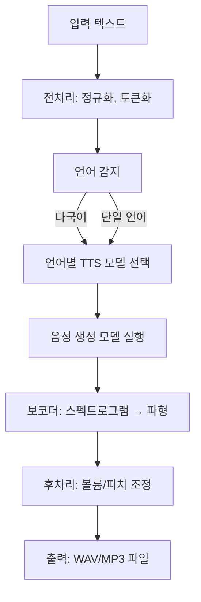

# 텍스트-음성 변환(TTS) — Tacotron에서 F5 및 Kokoro까지

> ASR은 음성을 텍스트로 변환하고, TTS는 텍스트를 음성으로 변환합니다. 2026년 스택은 세 부분으로 구성됩니다: 텍스트 → 토큰, 토큰 → 멜, 멜 → 파형. 각 부분에는 노트북에 적합한 기본 모델이 있습니다.

**유형:** 구축
**언어:** Python
**선수 지식:** Phase 6 · 02 (스펙트로그램 & 멜), Phase 5 · 09 (Seq2Seq), Phase 7 · 05 (풀 트랜스포머)
**소요 시간:** ~75분

## 문제

다음과 같은 문자열이 있습니다: "Please remind me to water the plants at 6 pm." 자연스러운 음성의 3초 오디오 클립이 필요하며, 올바른 운율(휴지, 강세)을 갖추고, "plants"를 정확한 모음으로 발음하며, 라이브 음성 어시스턴트를 위해 CPU에서 300ms 이내에 실행되어야 합니다. 또한 음성 교체, 코드 전환 입력 처리("remind me at 6 pm, daijoubu?")가 가능해야 하며, 이름 발음에서 실수하지 않아야 합니다.

현대 TTS 파이프라인은 다음과 같습니다:

1. **텍스트 프론트엔드.** 텍스트 정규화(날짜, 숫자, 이메일), 음소 또는 서브워드 토큰 변환, 운율 특징 예측.
2. **음향 모델.** 텍스트 → 멜 스펙트로그램. Tacotron 2 (2017), FastSpeech 2 (2020), VITS (2021), F5-TTS (2024), Kokoro (2024).
3. **보코더.** 멜 → 파형. WaveNet (2016), WaveRNN, HiFi-GAN (2020), BigVGAN (2022), 2024+의 신경망 코덱 보코더.

2026년에는 음향 + 보코더 구분이 종단간 확산 및 흐름 매칭 모델로 모호해지지만, 디버깅을 위한 3단계 정신 모델은 여전히 유효합니다.

## 개념


**Tacotron 2 (2017).** Seq2seq: 문자 임베딩(char-embedding) → BiLSTM 인코더 → 위치 감도 어텐션(location-sensitive attention) → 자기회귀적 LSTM 디코더가 멜 프레임(mel frames)을 출력. 느림(AR), 긴 텍스트에서 불안정. 여전히 베이스라인으로 인용됨.

**FastSpeech 2 (2020).** 비자기회귀적(Non-autoregressive). 지속 시간 예측기(duration predictor)가 각 음소(phoneme)에 할당되는 멜 프레임 수를 출력. 1-pass, Tacotron 대비 10배 빠름. 자연스러움 일부 손실(단조 정렬)하지만 널리 배포됨.

**VITS (2021).** 변분 추론(variational inference)으로 인코더 + 플로우 기반 지속 시간(flow-based duration) + HiFi-GAN 보코더(vocoder)를 종단간(end-to-end) 공동 학습. 고품질, 단일 모델. 2022–2024 오픈소스 TTS 주류. 변형: YourTTS(다중 화자 제로샷), XTTS v2(2024, Coqui).

**F5-TTS (2024).** 플로우 매칭(flow matching) 기반 디퓨전 트랜스포머. 자연스러운 운율(prosody), 5초 참조 오디오로 제로샷 음성 복제. 2026 오픈소스 TTS 리더보드 1위. 335M 파라미터.

**Kokoro (2024).** 소형(82M), CPU 실행 가능, 실시간용 최고 수준 영어 TTS. 폐쇄형 어휘(closed-vocabulary) 영어 전용, 아파치-2.0 라이선스.

**OpenAI TTS-1-HD, ElevenLabs v2.5, Google Chirp-3.** 상용 최신 기술. ElevenLabs v2.5 감정 태그(""[속삭임]"", ""[웃음]"") 및 캐릭터 음성이 2026 오디오북 제작 주류.

## 보코더 진화

| 시대 | 보코더 | 지연 시간 | 품질 |
|------|--------|-----------|-------|
| 2016 | WaveNet | 오프라인 전용 | 출시 당시 SOTA |
| 2018 | WaveRNN | ~실시간 | 우수 |
| 2020 | HiFi-GAN | 실시간 100배 | 인간 수준 근접 |
| 2022 | BigVGAN | 실시간 50배 | 화자/언어 간 일반화 |
| 2024 | SNAC, DAC (신경망 코덱) | AR 모델과 통합 | 이산 토큰, 비트 효율적 |

2026년까지 대부분의 "TTS" 모델은 텍스트에서 파형까지 종단간 처리; 멜 스펙트로그램은 내부 표현.

## 평가

- **MOS (Mean Opinion Score).** 1–5 척도, 크라우드소싱. 여전히 표준; 매우 느림.
- **CMOS (Comparative MOS).** A-vs-B 선호도. 주석당 신뢰 구간 좁음.
- **UTMOS, DNSMOS.** 참조 없는 신경망 MOS 예측기. 리더보드 사용.
- **CER (Character Error Rate) via ASR.** TTS 출력을 Whisper로 처리, 입력 텍스트 대비 CER 계산. 이해도 대리 지표.
- **SECS (Speaker Embedding Cosine Similarity).** 음성 복제 품질.

LibriTTS 테스트 클린 2026 결과:

| 모델 | UTMOS | CER (Whisper 경유) | 크기 |
|------|-------|---------------------|-------|
| 실제 음성 | 4.08 | 1.2% | — |
| F5-TTS | 3.95 | 2.1% | 335M |
| XTTS v2 | 3.81 | 3.5% | 470M |
| VITS | 3.62 | 3.1% | 25M |
| Kokoro v0.19 | 3.87 | 1.8% | 82M |
| Parler-TTS Large | 3.76 | 2.8% | 2.3B |

## 구축 방법

## 1단계: 입력 음성소 변환

```python
from phonemizer import phonemize
ph = phonemize("Hello world", language="en-us", backend="espeak")
# 'həloʊ wɜːld'
```

음성소(phoneme)는 보편적인 연결 다리입니다. VITS 수준 미만의 모델에는 원시 텍스트를 직접 입력하지 마세요.

## 2단계: Kokoro 실행 (2026 CPU 기본값)

```python
from kokoro import KPipeline
tts = KPipeline(lang_code="a")  # "a" = 미국 영어
audio, sr = tts("Please remind me to water the plants at 6 pm.", voice="af_bella")
# audio: float32 텐서, sr=24000
```

오프라인 실행, 단일 파일, 82M 파라미터.

## 3단계: F5-TTS로 음성 복제 실행

```python
from f5_tts.api import F5TTS
tts = F5TTS()
wav = tts.infer(
    ref_file="my_voice_5s.wav",
    ref_text="The quick brown fox jumps over the lazy dog.",
    gen_text="Please remind me to water the plants.",
)
```

5초 참조 음성 클립과 해당 텍스트를 입력하면 F5가 운율(prosody)과 음색(timbre)을 복제합니다.

## 4단계: HiFi-GAN 보코더 처음부터 구축

튜토리얼 스크립트에 담기엔 너무 크지만 기본 구조는 다음과 같습니다:

```python
class HiFiGAN(nn.Module):
    def __init__(self, mel_channels=80, upsample_rates=[8, 8, 2, 2]):
        super().__init__()
        # 4개의 업샘플링 블록, 총 256배 업샘플링으로 mel-rate에서 오디오-rate로 변환
        ...
    def forward(self, mel):
        return self.blocks(mel)  # -> 파형(waveform)
```

훈련: 적대적 학습(짧은 윈도우에 대한 판별자) + 멜-스펙트로그램 재구성 손실 + 특징 일치 손실. 상용화된 기술 — `hifi-gan` 리포지토리나 nvidia-NeMo에서 사전 훈련된 체크포인트 사용.

## 5단계: 전체 파이프라인 (의사 코드)

```python
text = "Please remind me at 6 pm."
phones = phonemize(text)
mel = acoustic_model(phones, speaker=alice)      # [T, 80]
wav = vocoder(mel)                                # [T * 256]
soundfile.write("out.wav", wav, 24000)
```

## 사용 방법

2026년 스택:

| 상황 | 선택 |
|-----------|------|
| 실시간 영어 음성 비서 | Kokoro (CPU) 또는 XTTS v2 (GPU) |
| 5초 참조 음성 복제 | F5-TTS |
| 상업용 캐릭터 음성 | ElevenLabs v2.5 |
| 오디오북 내레이션 | ElevenLabs v2.5 또는 XTTS v2 + 파인튜닝 |
| 저자원 언어 | 5–20시간 대상 언어 데이터로 VITS 학습 |
| 표현적 / 감정 태그 | ElevenLabs v2.5 또는 StyleTTS 2 파인튜닝 |

2026년 기준 오픈소스 리더: **품질은 F5-TTS, 효율성은 Kokoro**. 역사학자가 아니라면 Tacotron을 선택하지 마세요.

## 함정(Pitfalls)

- **텍스트 정규화 미적용.** "Dr. Smith"가 "Doctor"로 읽힐지 "Drive"로 읽힐지? "2026"이 "twenty twenty six"로 읽힐지 "two zero two six"로 읽힐지? 음소 변환기(phonemizer) 적용 **전**에 정규화 필수.
- **OOV 고유명사.** "Ghumare" → "ghyu-mair"? 알 수 없는 토큰을 위한 대체 그래프음-음소(grapheme-to-phoneme) 모델 필수 탑재.
- **클리핑.** 보코더(vocoder) 출력은 거의 클리핑되지 않지만, 추론 시 멜 스케일 불일치로 ±1.0을 초과할 수 있음. 항상 `np.clip(wav, -1, 1)` 적용.
- **샘플링 레이트 불일치.** Kokoro 출력은 24kHz; 다운스트림 파이프라인이 16kHz를 기대 → 리샘플링하지 않으면 에일리어싱 발생.

## Ship It

`outputs/skill-tts-designer.md`로 저장. 주어진 음성, 지연 시간, 언어 대상에 맞는 TTS(텍스트-음성 변환) 파이프라인을 설계합니다.

## 1. 요구사항 정의
- **대상 음성**: [예: 영어 여성 목소리, 한국어 남성 목소리 등]
- **지연 시간 목표**: [예: 500ms 미만, 1초 미만 등]
- **지원 언어**: [예: 영어, 한국어, 일본어 등]

## 2. TTS 아키텍처 선택
- **기본 모델**: [예: VITS, Tacotron 2, FastSpeech 2 등]
  - *선택 기준*: 음성 품질, 지연 시간, 언어 지원 여부
- **보코더**: [예: HiFi-GAN, WaveGlow 등]
  - *선택 기준*: 생성 속도, 음질, 계산 효율성

## 3. 최적화 전략
- **지연 시간 최적화**:
  - 모델 경량화 (예: 양자화, 프루닝)
  - 캐싱 전략 (자주 사용되는 문장 미리 생성)
  - 병렬 처리 (텍스트 전처리/음성 생성 분리)
- **언어 지원**:
  - 다국어 모델 사용 (예: Multilingual TTS)
  - 언어별 음성 데이터베이스 구축
  - 언어 감지 모듈 추가 (자동 언어 전환)

## 4. 파이프라인 구성


## 5. 평가 지표
- **음성 품질**: MOS(Mean Opinion Score) ≥ 4.0
- **지연 시간**: [목표치] 이내 (텍스트 입력 → 음성 출력)
- **언어 정확도**: 지원 언어별 발음 정확도 ≥ 95%

## 6. 배포 환경
- **하드웨어**: [예: CPU/GPU 서버, 엣지 디바이스]
- **프레임워크**: PyTorch/TensorFlow
- **API**: REST/gRPC 엔드포인트 제공

## 7. 유지보수 계획
- **음성 데이터베이스 업데이트**: 분기별 새로운 음성 샘플 추가
- **모델 재학습**: 반기별 새로운 데이터로 파인튜닝
- **모니터링**: 지연 시간/에러율 실시간 추적

> **참고**: 실제 구현 시 [대상 음성]과 [지연 시간 목표]에 따라 모델/하이퍼파라미터를 조정해야 합니다.

## 연습 문제

1. **쉬움.** `code/main.py`를 실행합니다. 장난감 어휘(vocab)에서 음소(phoneme) 사전을 구축하고, 음소별 지속 시간(duration)을 추정한 후 가짜 "mel" 스케줄을 출력합니다.
2. **중간.** Kokoro를 설치하고, `af_bella`와 `am_adam` 보이스에서 동일한 문장을 합성합니다. 오디오 지속 시간(duration)과 주관적 품질(quality)을 비교합니다.
3. **어려움.** 5초짜리 참조 클립(reference clip)을 직접 녹음합니다. F5-TTS를 사용해 이를 클론(clone)합니다. 참조 클립과 클론된 출력 간의 SECS(Subjective Error Count Score)를 보고합니다.

## 주요 용어

| 용어 | 사람들이 말하는 것 | 실제 의미 |
|------|-------------------|-----------|
| Phoneme | 소리 단위 | 추상적 소리 클래스; 영어에는 39개(ARPABet). |
| Duration predictor | 각 Phoneme의 지속 시간 | Non-AR 모델 출력; Phoneme당 정수 프레임 수. |
| Vocoder | Mel → 파형 | Mel-스펙트로그램을 원시 샘플로 매핑하는 신경망. |
| HiFi-GAN | 표준 Vocoder | GAN 기반; 2020–2024년 지배적. |
| MOS | 주관적 품질 | 인간 평가자의 1–5점 평균 의견 점수. |
| SECS | 음성 복제 메트릭 | 대상 및 출력 화자 임베딩 간 코사인 유사도. |
| F5-TTS | 2024 오픈소스 SOTA | 흐름 매칭 확산; 제로샷 복제. |
| Kokoro | CPU 영어 리더 | 82M-파라미터 모델, Apache 2.0. |

## 추가 자료

- [Shen et al. (2017). Tacotron 2](https://arxiv.org/abs/1712.05884) — seq2seq 베이스라인.
- [Kim, Kong, Son (2021). VITS](https://arxiv.org/abs/2106.06103) — end-to-end 흐름 기반.
- [Chen et al. (2024). F5-TTS](https://arxiv.org/abs/2410.06885) — 현재 오픈소스 SOTA.
- [Kong, Kim, Bae (2020). HiFi-GAN](https://arxiv.org/abs/2010.05646) — 2026년에도 여전히 사용되는 보코더.
- [Kokoro-82M on HuggingFace](https://huggingface.co/hexgrad/Kokoro-82M) — 2024년 CPU 친화적인 영어 TTS.