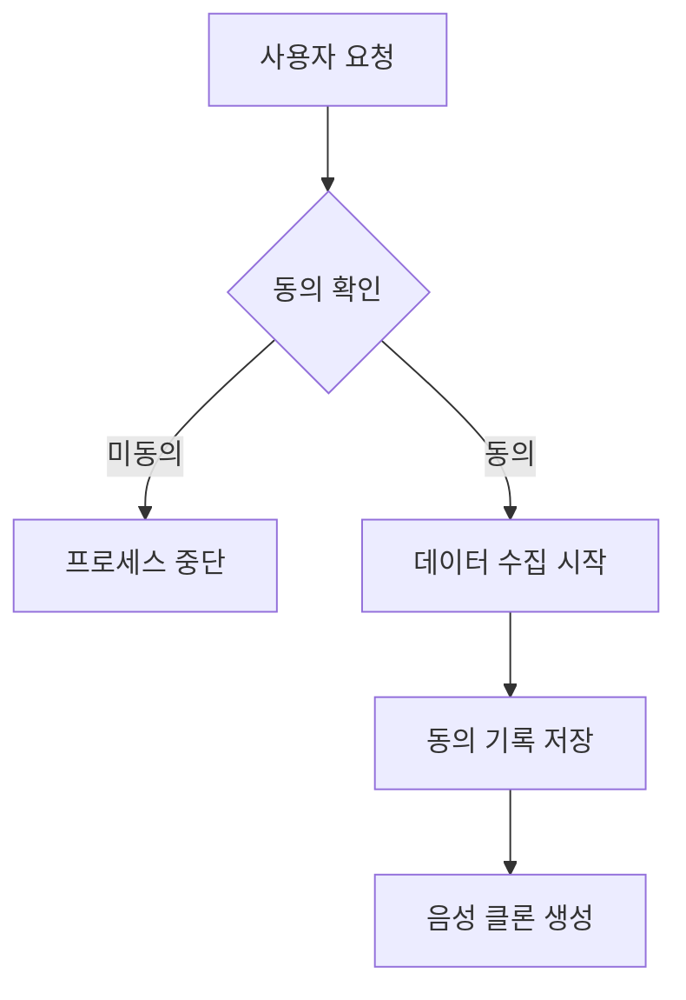

# 음성 복제 & 음성 변환

> 음성 복제는 다른 사람의 목소리로 텍스트를 읽어줍니다. 음성 변환은 말한 내용을 보존하면서 목소리를 다른 사람의 목소리로 재작성합니다. 둘 다 동일한 기본 원리에 의존합니다: 화자 정체성과 내용을 분리하는 것.

**유형:** 구축
**언어:** Python
**사전 요구 사항:** 6단계 · 06(화자 인식), 6단계 · 07(TTS)
**소요 시간:** ~75분

## 문제 정의

2026년에는 5초 분량의 오디오 클립만으로도 소비자용 GPU로 누구나 고음질 음성 복제를 생성할 수 있습니다. ElevenLabs, F5-TTS, OpenVoice v2, VoiceBox 등은 모두 제로샷(zero-shot) 또는 소수샷(few-shot) 복제 기능을 제공합니다. 이 기술은 축복(접근성 TTS, 더빙, 보조 음성)이자 동시에 무기(사기 전화, 정치적 딥페이크, IP 도용)입니다.

두 가지 밀접한 관련 작업:

- **음성 복제(TTS 측):** 텍스트 + 5초 참조 음성 → 해당 음성의 오디오 생성.
- **음성 변환(음성 측):** 소스 오디오(사람 A가 X라고 말함) + 사람 B의 참조 음성 → B가 X라고 말하는 오디오.

둘 모두 파형(waveform)을 (콘텐츠, 화자, 운율)로 분해한 후 한 소스의 콘텐츠와 다른 소스의 화자를 재조합합니다.

2026년 현재 반드시 준수해야 하는 핵심 제약 조건: **EU(AI Act, 2026년 8월 시행)와 캘리포니아(AB 2905, 2025년 발효)에서는 워터마킹과 동의 확인이 법적으로 의무화**되었습니다. 파이프라인은 들리지 않는 워터마크를 삽입해야 하며, 비동의 복제를 거부해야 합니다.

## 개념


**제로샷 클로닝(Zero-shot cloning).** 수천 명의 화자로 훈련된 모델에 5초 클립을 입력합니다. 화자 인코더는 클립을 화자 임베딩으로 매핑하고, TTS 디코더는 해당 임베딩과 텍스트를 조건으로 합성합니다.

사용 모델: F5-TTS (2024), YourTTS (2022), XTTS v2 (2024), OpenVoice v2 (2024).

**퓨샷 파인튜닝(Few-shot fine-tuning).** 대상 음성 5-30분을 녹음한 후, 기본 모델을 1시간 동안 LoRA 파인튜닝합니다. 품질이 "괜찮은" 수준에서 "구별 불가능" 수준으로 향상됩니다. Coqui와 ElevenLabs가 이 방식을 지원하며, 커뮤니티에서는 F5-TTS와 함께 사용합니다.

**음성 변환(Voice conversion, VC).** 두 가지 유형:

- **인식-합성(Recognition-synthesis).** ASR 유사 모델로 내용 표현(예: 소프트 포네믹 사후 확률, PPGs)을 추출한 후, 대상 화자 임베딩으로 재합성합니다. 언어 및 억양에 강건합니다. KNN-VC (2023), Diff-HierVC (2023)에서 사용.
- **분리(Disentanglement).** 오토인코더를 훈련시켜 병목 지점에서 내용, 화자, 억양을 분리합니다. 추론 시 화자 임베딩을 교체합니다. 품질은 낮지만 속도가 빠릅니다. AutoVC (2019), VITS-VC 변형에서 사용.

**신경망 코덱 기반 클로닝(Neural codec-based cloning, 2024+).** VALL-E, VALL-E 2, NaturalSpeech 3, VoiceBox는 SoundStream/EnCodec의 이산 토큰으로 오디오를 처리하고, 코덱 토큰에 대해 대규모 자기회귀 또는 흐름 매칭 모델을 훈련합니다. 짧은 프롬프트에서 ElevenLabs와 유사한 품질을 제공합니다.

## 윤리: 부가 기능이 아닌 핵심

**워터마킹(Watermarking).** PerTh (Perth)와 SilentCipher (2024)는 오디오에 16-32비트 ID를 감지 불가능하게 삽입합니다. 재인코딩, 스트리밍, 일반 편집에도 견딥니다. 오픈소스 기반 상용화 가능.

**동의 게이트(Consent gates).** 모든 클로닝 출력에 검증 가능한 동의 기록을 연결해야 합니다. "저는 Rohit이며, 2026-04-22에 X 목적으로 이 음성을 승인합니다." 변조 방지 로그에 저장합니다.

**탐지(Detection).** AASIST, RawNet2, Wav2Vec2-AASIST가 탐지기로 제공됩니다. ASVspoof 2025 챌린지에서 ElevenLabs, VALL-E 2, Bark 출력에 대한 최신 탐지기의 EER은 0.8–2.3%로 발표되었습니다.

## 수치 (2026)

| 모델 | 제로샷? | SECS (대상 유사도) | WER (지능적) | 파라미터 |
|-------|-----------|--------------------|--------------|--------|
| F5-TTS | 예 | 0.72 | 2.1% | 335M |
| XTTS v2 | 예 | 0.65 | 3.5% | 470M |
| OpenVoice v2 | 예 | 0.70 | 2.8% | 220M |
| VALL-E 2 | 예 | 0.77 | 2.4% | 370M |
| VoiceBox | 예 | 0.78 | 2.1% | 330M |

SECS > 0.70은 대부분의 청취자에게 대상과 구별되지 않는 것으로 간주됩니다.

## 구축 방법

## 단계 1: 인식-합성 분해 (main.py의 코드 전용 데모)

```python
def clone_pipeline(ref_audio, text, target_embedder, tts_model):
    speaker_emb = target_embedder.encode(ref_audio)
    mel = tts_model(text, speaker=speaker_emb)
    return vocoder(mel)
```

개념적으로 단순함; 구현의 대부분은 `tts_model`과 화자 인코더에 있음.

## 단계 2: F5-TTS를 이용한 제로샷 클론

```python
from f5_tts.api import F5TTS
tts = F5TTS()
wav = tts.infer(
    ref_file="rohit_5s.wav",
    ref_text="The quick brown fox jumps over the lazy dog.",
    gen_text="Please add milk and bread to my list.",
)
```

참조 텍스트는 오디오와 정확히 일치해야 함; 불일치 시 정렬 실패.

## 단계 3: KNN-VC를 이용한 음성 변환

```python
import torch
from knnvc import KNNVC  # 2023 모델, https://github.com/bshall/knn-vc
vc = KNNVC.load("wavlm-base-plus")
out_wav = vc.convert(source="my_voice.wav", target_pool=["alice_1.wav", "alice_2.wav"])
```

KNN-VC는 WavLM을 실행하여 소스와 대상 풀의 프레임별 임베딩을 추출한 후, 각 소스 프레임을 풀 내 가장 가까운 이웃으로 대체함. 비모수적 방식이며, 1분 분량의 대상 음성으로 작동.

## 단계 4: 워터마크 삽입

```python
from silentcipher import SilentCipher
sc = SilentCipher(model="2024-06-01")
payload = b"consent_id:abc123;ts:1745353200"
watermarked = sc.embed(wav, sr=24000, message=payload)
detected = sc.detect(watermarked, sr=24000)   # 페이로드 바이트 반환
```

~32비트의 페이로드, MP3 재인코딩 및 가벼운 노이즈 후에도 감지 가능.

## 단계 5: 동의 게이트

```python
def cloned_inference(text, ref_audio, consent_record):
    assert verify_signature(consent_record), "서명된 동의 필요"
    assert consent_record["speaker_id"] == hash_speaker(ref_audio)
    wav = tts.infer(ref_file=ref_audio, gen_text=text)
    wav = watermark(wav, payload=consent_record["id"])
    return wav
```

## 사용 방법

2026 스택:

| 상황 | 선택 |
|-----------|------|
| 5초 제로샷 복제, 오픈소스 | F5-TTS 또는 OpenVoice v2 |
| 상용 프로덕션 복제 | ElevenLabs Instant Voice Clone v2.5 |
| 음성 변환(재작성) | KNN-VC 또는 Diff-HierVC |
| 다중 화자 파인튜닝 | StyleTTS 2 + speaker adapter |
| 크로스링구얼 복제 | XTTS v2 또는 VALL-E X |
| 딥페이크 탐지 | Wav2Vec2-AASIST |

## 주의 사항

- **참조 텍스트 불일치.** F5-TTS 및 유사 모델은 참조 텍스트가 참조 오디오와 정확히 일치해야 하며, 구두점도 포함되어야 합니다.
- **반향 참조.** 에코는 클론을 망칩니다. 건조한(dry) 근접 마이크(close-mic) 녹음을 사용하세요.
- **감정 불일치.** 훈련 참조가 "기쁜" 감정일 경우 모든 클론도 기쁜 감정을 나타냅니다. 참조 감정을 대상 사용 사례와 일치시키세요.
- **언어 누출.** 영어 화자를 클론한 후 모델이 프랑스어를 말하도록 요청하면 여전히 억양이 유지될 수 있습니다. 교차 언어 모델(XTTS, VALL-E X)을 사용하세요.
- **워터마크 없음.** 2026년 8월부터 EU에서 법적 배포가 불가능합니다.

## Ship It

`outputs/skill-voice-cloner.md`로 저장. 동의 게이트 + 워터마크 + 품질 목표를 포함한 클론 또는 변환 파이프라인 설계.

## 1. 파이프라인 개요
- **목적**: 사용자 음성 데이터를 기반으로 고품질 음성 클론 생성
- **핵심 구성 요소**:
  1. **동의 게이트(Consent Gate)**: 데이터 수집 전 명시적 사용자 동의 획득
  2. **워터마크 시스템**: 생성된 음성에 추적 가능한 디지털 워터마크 삽입
  3. **품질 목표(Quality Target)**: MOS(Mean Opinion Score) ≥ 4.0 달성

## 2. 동의 게이트 구현


- **필수 동의 항목**:
  - 데이터 사용 목적(음성 클론 생성)
  - 데이터 보관 기간(최대 30일)
  - 제3자 공유 금지 조항
  - 워터마크 적용 동의

## 3. 워터마크 시스템
- **기술 방식**: 
  - **주파수 영역 워터마크**: 18-20kHz 대역에 비가청 신호 삽입
  - **메타데이터 임베딩**: 음성 파일 ID를 스펙트로그램에 인코딩
- **검증 방법**:
  ```python
  def detect_watermark(audio_file):
      # 주파수 분석 및 메타데이터 디코딩 로직
      return watermark_id if detected else None
  ```

## 4. 품질 목표 및 평가
| 평가 항목 | 목표치 | 측정 방법 |
|-----------|--------|-----------|
| MOS(Mean Opinion Score) | ≥ 4.0 | 10명 평가자 5점 척도 |
| 유사도(Similarity) | ≥ 0.85 | DTW(Dynamic Time Warping) |
| 자연스러움(Naturalness) | ≥ 4.2 | P.503 표준 준수 |

## 5. 파이프라인 아키텍처
```mermaid
graph TD
    L1[음성 입력] --> L2[동의 게이트]
    L2 --> L3{동의?}
    L3 -->|No| L4[거부 처리]
    L3 -->|Yes| L5[전처리]
    L5 --> L6[음성 임베딩 생성]
    L6 --> L7[합성 모델(Tacotron2)]
    L7 --> L8[워터마크 삽입]
    L8 --> L9[품질 검증]
    L9 -->|미달| L10[재생성]
    L9 -->|통과| L11[출력]
```

## 6. 보안 및 감사
- **데이터 보관**: 동의 문서와 음성 샘플을 30일 후 자동 삭제
- **감사 로그**: 모든 생성 요청에 대해 다음 정보 기록
  - 사용자 ID
  - 생성 시간
  - 워터마크 ID
  - 품질 검증 결과

## 7. 배포 전략
1. **스테이징 환경**: 100개 샘플로 품질 검증
2. **점진적 롤아웃**: 
   - 1단계: 10명 베타 테스터
   - 2단계: 100명 공개 테스트
   - 3단계: 전체 서비스 오픈

> **주의**: 모든 구현은 GDPR 및 지역 개인정보 보호법 준수 필수. 음성 클론 생성 시 반드시 원본 화자 식별 가능한 워터마크 포함.

## 연습 문제

1. **쉬움.** `code/main.py`를 실행합니다. 두 "화자" 간의 코사인 유사도를 계산하여 화자 임베딩 스왑을 시연합니다.
2. **중간.** OpenVoice v2를 사용하여 자신의 목소리를 복제합니다. 참조 음성과 복제본 간의 SECS(화자 임베딩 코사인 유사도)를 측정합니다. Whisper를 통해 CER(문자 오류율)을 측정합니다.
3. **어려움.** 20개의 복제본에 SilentCipher 워터마크를 적용하고, 128kbps MP3 인코딩+디코딩을 거친 후 페이로드를 검출합니다. 비트 정확도를 보고합니다.

## 주요 용어

| 용어 | 사람들이 말하는 것 | 실제 의미 |
|------|-------------------|-----------|
| Zero-shot clone | 5초면 충분 | 사전 학습 모델 + 화자 임베딩; 훈련 없음. |
| PPG | 음성적 사후그램 | 프레임별 ASR(Automatic Speech Recognition) 사후 확률, 언어-불변 내용 표현(representation)으로 사용. |
| KNN-VC | 최근접 이웃 변환 | 각 소스 프레임을 가장 가까운 타겟 풀 프레임으로 대체. |
| Neural codec TTS | VALL-E 스타일 | EnCodec/SoundStream 토큰에 대한 AR(Autoregressive) 모델. |
| Watermark | 들리지 않는 서명 | 오디오에 삽입된 비트, 재인코딩 후에도 유지. |
| SECS | 클론 충실도 | 타겟과 클론 화자 임베딩 간 코사인(cosine) 유사도. |
| AASIST | 딥페이크 탐지기 | Anti-spoofing 모델; 합성 음성 탐지.

## 추가 자료

- [Chen et al. (2024). F5-TTS](https://arxiv.org/abs/2410.06885) — 오픈소스 SOTA 제로샷 클로닝.
- [Baevski et al. / Microsoft (2023). VALL-E](https://arxiv.org/abs/2301.02111) 및 [VALL-E 2 (2024)](https://arxiv.org/abs/2406.05370) — 신경망 코덱 기반 TTS.
- [Qian et al. (2019). AutoVC](https://arxiv.org/abs/1905.05879) — 분리 기반 음성 변환.
- [Baas, Waubert de Puiseau, Kamper (2023). KNN-VC](https://arxiv.org/abs/2305.18975) — 검색 기반 음성 변환.
- [SilentCipher (2024) — 오디오 워터마킹](https://github.com/sony/silentcipher) — 프로덕션 준비 완료 32비트 오디오 워터마크.
- [ASVspoof 2025 결과](https://www.asvspoof.org/) — 탐지기 vs 합성기 경쟁, 2026년 업데이트.