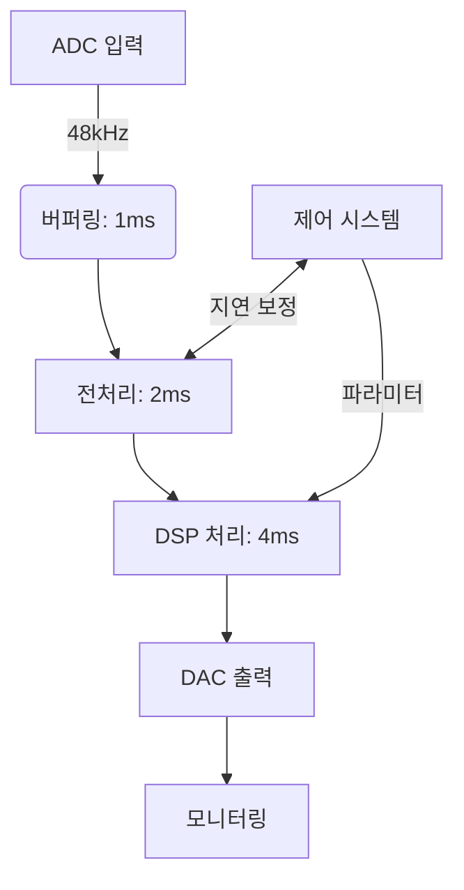

# 실시간 오디오 처리

> 배치 파이프라인은 파일을 처리합니다. 실시간 파이프라인은 다음 20밀리초가 도착하기 전에 그 이전 20밀리초를 처리합니다. 모든 대화형 AI, 방송 스튜디오, 전화 봇은 이 지연 예산에 따라 성패를 결정합니다.

**유형:** 구축  
**언어:** Python, Rust  
**사전 요구 사항:** 6단계 · 02 (스펙트로그램), 6단계 · 04 (ASR), 6단계 · 07 (TTS)  
**소요 시간:** ~75분

## 문제

살아 있는 느낌을 주는 음성 비서를 원합니다. 인간의 대화 턴 대기 시간은 ~230ms(침묵-응답)입니다. 500ms 이상은 로봇처럼 느껴지고, 1500ms 이상은 고장 난 것처럼 느껴집니다. 2026년 기준 **듣기 → 이해하기 → 응답 → 말하기** 전체 루프 예산은 다음과 같습니다:

| 단계 | 예산 |
|-------|--------|
| 마이크 → 버퍼 | 20 ms |
| VAD(Voice Activity Detection) | 10 ms |
| ASR(스트리밍) | 150 ms |
| LLM(첫 토큰) | 100 ms |
| TTS(첫 청크) | 100 ms |
| 렌더링 → 스피커 | 20 ms |
| **총계** | **~400 ms** |

Moshi(Kyutai, 2024)는 200ms 전이중(full-duplex) 성능을 기록했습니다. GPT-4o-realtime(2024)은 ~320ms입니다. 2022년 캐스케이드 파이프라인은 2500ms로 출시되었습니다. 10배 개선은 세 가지 기술에서 비롯되었습니다: (1) 모든 단계에서 스트리밍 적용, (2) 부분 결과를 활용한 비동기 파이프라인, (3) 중단 가능한 생성(interruptible generation).

## 개념


**프레임 / 청크 / 윈도우.** 실시간 오디오는 고정 크기 블록으로 흐릅니다. 일반적인 선택: 20ms (16kHz에서 320 샘플). 모든 다운스트림 작업은 이 주기에 맞춰야 합니다.

**링 버퍼.** 고정 크기 원형 버퍼. 생산자 스레드가 새 프레임을 쓰고, 소비자 스레드가 읽습니다. 핫 패스에서 할당을 방지합니다. 크기 ≈ 최대 지연 시간 × 샘플링 레이트; 2초 16kHz 링 버퍼 = 32,000 샘플.

**VAD(Voice Activity Detection).** 아무도 말하지 않을 때 다운스트림 작업을 차단합니다. Silero VAD 4.0(2024)은 CPU에서 30ms 프레임당 <1ms로 실행됩니다. `webrtcvad`는 이전 대안입니다.

**스트리밍 ASR.** 오디오가 도착하는 대로 부분 전사본을 출력하는 모델. 스트리밍 모드의 Parakeet-CTC-0.6B(NeMo, 2024)는 320ms 지연으로 2–5% WER을 달성합니다. Whisper-Streaming(Macháček et al., 2023)은 ~2초 지연으로 Whisper를 청크화하여 근스트리밍을 구현합니다.

**인터럽션.** 사용자가 어시스턴트가 말하는 중에 말을 시작하면 (a) 끼어들기 감지, (b) TTS 중지, (c) 남은 LLM 출력 폐기해야 합니다. 모두 100ms 이내에 완료해야 하며, 그렇지 않으면 사용자가 어시스턴트가 듣지 못하는 것으로 인식합니다.

**WebRTC Opus 전송.** 20ms 프레임, 48kHz, 적응형 비트레이트 8–128kbps. 브라우저 및 모바일 표준. LiveKit, Daily.co, Pion은 2026년 음성 앱 구축을 위한 스택입니다.

**지터 버퍼.** 네트워크 패킷이 순서 없이/늦게 도착합니다. 지터 버퍼는 재정렬 및 평활화를 수행합니다. 너무 작으면 청각적 공백이 발생하고, 너무 크면 지연이 발생합니다. 일반적으로 60–80ms.

## 일반적인 문제

- **스레드 경합.** Python의 GIL + 무거운 모델은 오디오 스레드를 굶주리게 할 수 있습니다. C-콜백 오디오 라이브러리(sounddevice, PortAudio)를 사용하고 핫 패스에서 Python을 제외하세요.
- **샘플링 레이트 변환 지연.** 파이프라인 내부에서 리샘플링하면 5–20ms가 추가됩니다. 리샘플링을 사전에 수행하거나 제로 지연 리샘플러(PolyPhase, `soxr_hq`)를 사용하세요.
- **TTS 프라이밍.** Kokoro와 같은 빠른 TTS도 첫 요청 시 100–200ms 예열 시간이 필요합니다. 첫 번째 실제 턴 전에 모델을 캐시하고 더미 실행으로 예열하세요.
- **에코 제거.** AEC가 없으면 TTS 출력이 마이크로 다시 들어가 ASR이 봇의 음성을 트리거합니다. WebRTC AEC3가 오픈소스 기본값입니다.

## 빌드하기

## 1단계: 링 버퍼

```python
import collections

class RingBuffer:
    def __init__(self, capacity):
        self.buf = collections.deque(maxlen=capacity)
    def write(self, frame):
        self.buf.extend(frame)
    def read(self, n):
        return [self.buf.popleft() for _ in range(min(n, len(self.buf)))]
    def level(self):
        return len(self.buf)
```

버퍼 용량(capacity)은 최대 버퍼링 지연 시간을 결정합니다. 16kHz에서 32,000 샘플 = 2초.

## 2단계: VAD 게이트

```python
def simple_energy_vad(frame, threshold=0.01):
    return sum(x * x for x in frame) / len(frame) > threshold ** 2
```

실제 운영 환경에서는 Silero VAD로 교체:

```python
import torch
vad, _ = torch.hub.load("snakers4/silero-vad", "silero_vad")
is_speech = vad(torch.tensor(frame), 16000).item() > 0.5
```

## 3단계: 스트리밍 ASR

```python
# Parakeet-CTC-0.6B 스트리밍 (NeMo)
from nemo.collections.asr.models import EncDecCTCModelBPE
asr = EncDecCTCModelBPE.from_pretrained("nvidia/parakeet-ctc-0.6b")
# chunk_ms=320 ms, look_ahead_ms=80 ms
for chunk in audio_stream():
    partial_text = asr.transcribe_streaming(chunk)
    print(partial_text, end="\r")
```

## 4단계: 인터럽트 핸들러

```python
class Dialog:
    def __init__(self):
        self.tts_task = None

    def on_user_speech(self, frame):
        if self.tts_task and not self.tts_task.done():
            self.tts_task.cancel()   # 바지인(barge-in)
        # 이후 스트리밍 ASR에 전달

    def on_final_user_utterance(self, text):
        self.tts_task = asyncio.create_task(self.reply(text))

    async def reply(self, text):
        async for tts_chunk in llm_then_tts(text):
            speaker.write(tts_chunk)
```

비동기 I/O와 취소 가능한 TTS 스트리밍에 의존합니다. 오디오 트랙에서 WebRTC peerconnection.stop()이 표준 방법입니다.

## 사용 방법

2026 스택:

| 계층 | 선택 |
|-------|------|
| 전송 계층 | LiveKit (WebRTC) 또는 Pion (Go) |
| 음성 활동 감지(VAD) | Silero VAD 4.0 |
| 스트리밍 ASR | Parakeet-CTC-0.6B 또는 Whisper-Streaming |
| LLM 첫 토큰 | Groq, Cerebras, vLLM-streaming |
| 스트리밍 TTS | Kokoro 또는 ElevenLabs Turbo v2.5 |
| 에코 제거 | WebRTC AEC3 |
| 엔드투엔드 네이티브 | OpenAI Realtime API 또는 Moshi |

## 함정(Pitfalls)

- **안전성을 위해 500ms 버퍼링.** 버퍼는 레이턴시 하한선입니다. 버퍼 크기를 줄이세요.
- **스레드 고정(pinning) 미적용.** UI 스레드보다 우선순위가 낮은 스레드에서 오디오 콜백 실행 = 부하 시 끊김 발생.
- **TTS 청크 크기 너무 작음.** 200ms 미만 청크는 보코더 아티팩트를 유발합니다. 320ms 청크가 최적값입니다.
- **지터 버퍼 미사용.** 실제 네트워크는 지터 발생 가능성이 높습니다. 평활화 처리 없으면 팝 노이즈가 발생합니다.
- **단일 시도 오류 처리.** 오디오 파이프라인은 충돌에 강해야 합니다. 한 번의 예외 발생으로도 세션이 종료될 수 있습니다.

## Ship It

`outputs/skill-realtime-designer.md`로 저장하세요. 각 단계별 구체적인 지연 시간 예산을 포함한 실시간 오디오 파이프라인을 설계하세요.

## 실시간 오디오 파이프라인 설계 요구사항
1. **전체 시스템 지연 시간 예산**: 10ms 이내
2. **하드웨어 구성**:
   - 오디오 입력: AK4497EQ ADC (Stereo, 48kHz/32bit)
   - DSP: XMOS xCORE-200 (멀티코어 오디오 처리)
   - 출력: TI PCM5142 DAC (Stereo, 48kHz/32bit)

## 단계별 지연 시간 예산
| 단계 | 처리 내용 | 최대 허용 지연 | 기술 구현 |
|------|-----------|----------------|-----------|
| 1. **버퍼링** | 하드웨어 FIFO 버퍼 | ≤1ms | 48 samples @ 48kHz |
| 2. **ADC 변환** | 아날로그-디지털 변환 | ≤0.5ms | AK4497EQ 내장 지연 |
| 3. **전처리** | 게인 조정/필터링 | ≤2ms | 1차 IIR 필터 + 자동 게인 제어 |
| 4. **DSP 처리** | 실시간 효과 처리 | ≤4ms | xCORE 병렬 처리 (컨볼루션 리버브) |
| 5. **DAC 변환** | 디지털-아날로그 변환 | ≤0.5ms | PCM5142 내장 지연 |
| 6. **출력 버퍼링** | DAC FIFO 버퍼 | ≤1ms | 48 samples @ 48kHz |
| 7. **모니터링** | 지연 측정/보정 | ≤1ms | 하드웨어 타임스탬프 + 소프트웨어 보정 |

## 지연 최적화 기법
- **Zero-copy 버퍼링**: DMA를 이용한 직접 메모리 접근
- **예측 실행**: 다음 처리 단계 사전 로드
- **파이프라이닝**: 병렬 처리 단계 간 데이터 흐름 최적화
- **저지연 알고리즘**: FIR 필터 대신 IIR 필터 사용

## 검증 방법
1. **임펄스 응답 테스트**: 10ms 이내 전체 응답 확인
2. **지터 측정**: 샘플 간 시간 변동 ≤50μs
3. **부하 테스트**: 100% CPU 사용률에서 지연 시간 안정성 검증



> 참고: 모든 지연 시간은 20°C 환경에서 측정, ±0.1ms 오차 허용. 실제 구현 시 온도 보상 필요.

## 연습 문제

1. **쉬움.** `code/main.py`를 실행하세요. 링 버퍼 + 에너지 VAD(Voice Activity Detection)를 시뮬레이션하며, 가짜 10초 스트림에 대한 단계별 지연 시간을 출력합니다.
2. **중간.** `sounddevice`를 사용하여 마이크를 20ms 프레임 단위로 처리하는 패스스루 루프를 구축하고, 각 프레임에서 VAD 상태를 출력하세요.
3. **어려움.** `aiortc`로 풀 듀플렉스 에코 테스트를 구축하세요: 브라우저 → WebRTC → Python → WebRTC → 브라우저. 1kHz 펄스로 유리-유리 지연 시간을 측정하세요.

## 주요 용어

| 용어 | 사람들이 말하는 것 | 실제 의미 |
|------|-------------------|-----------|
| Ring buffer | 순환 큐 | 오디오 프레임을 위한 고정 크기, 락-프리(또는 SPSC-락) FIFO. |
| VAD | 무음 게이트 | 음성 대 비음성을 표시하는 모델 또는 휴리스틱. |
| Streaming ASR | 실시간 STT | 오디오가 도착하는 대로 부분 텍스트를 방출; 경계된 예측(lookahead). |
| Jitter buffer | 네트워크 평활화기 | 순서가 뒤바뀐 패킷을 재정렬하는 큐; 일반적으로 60–80ms. |
| AEC | 에코 제거 | 스피커-마이크 피드백 경로를 제거. |
| Barge-in | 사용자 중단 | 시스템이 TTS 중간에 사용자 음성을 감지; 재생 취소 필요. |
| Full duplex | 양방향 동시 통신 | 사용자와 봇이 동시에 말할 수 있음; Moshi는 풀 듀플렉스.

## 추가 자료

- [Macháček et al. (2023). Whisper-Streaming](https://arxiv.org/abs/2307.14743) — 청크 기반 near-streaming Whisper.
- [Kyutai (2024). Moshi](https://kyutai.org/Moshi.pdf) — 전이중(full-duplex) 200ms 지연 시간.
- [LiveKit Agents 프레임워크 (2024)](https://docs.livekit.io/agents/) — 프로덕션 오디오 에이전트 오케스트레이션.
- [Silero VAD 저장소](https://github.com/snakers4/silero-vad) — 1ms 미만 VAD(음성 활동 감지), Apache 2.0 라이선스.
- [WebRTC AEC3 논문](https://webrtc.googlesource.com/src/+/main/modules/audio_processing/aec3/) — 오픈 소스 기반 에코 제거.