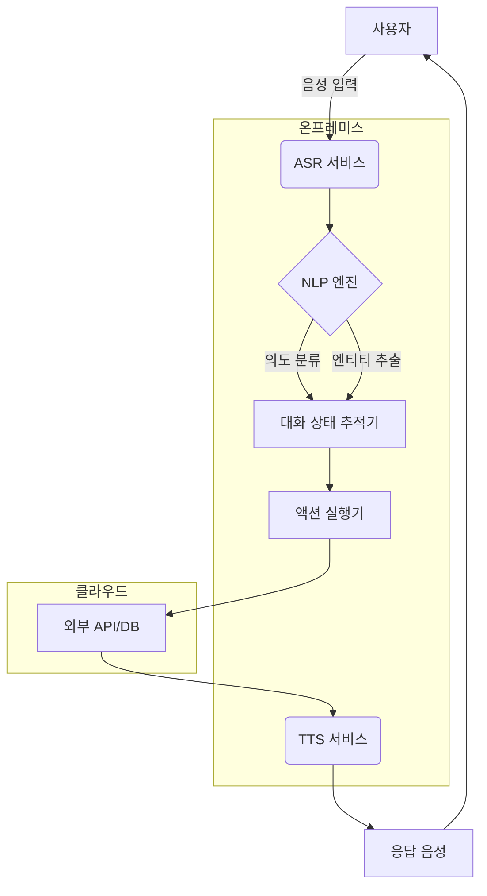

# 음성 어시스턴트 파이프라인 구축 — Phase 6 캡스톤

> 레슨 01-11까지의 모든 내용을 통합합니다. 듣고, 추론하며, 응답하는 음성 어시스턴트를 구축하세요. 2026년에는 연구 문제가 아닌 해결된 엔지니어링 문제이지만, 통합 세부 사항이 출시 여부를 결정합니다.

**유형:** 구축
**언어:** Python
**선수 과목:** Phase 6 · 04, 05, 06, 07, 11; Phase 11 · 09 (함수 호출); Phase 14 · 01 (에이전트 루프)
**소요 시간:** ~120분

## 문제 정의

엔드-투-엔드 어시스턴트 구축:

1. 마이크 입력 캡처(16kHz 모노).
2. 사용자 음성 시작/종료 감지.
3. 스트리밍 전사(transcription).
4. 도구(타이머, 날씨, 캘린더)를 호출할 수 있는 LLM에 전사본 전달.
5. LLM 텍스트를 TTS로 스트리밍.
6. 사용자에게 오디오 재생.
7. 응답 중간에 사용자가 중단 시 정지.

지연 시간 목표: 사용자가 발화를 마친 후 800ms 이내에 첫 TTS 오디오 바이트 출력(노트북 CPU 기준). 품질 목표: 단어 누락 없음, 무음 시 환각 자막 없음, 음성 복제 유출 없음, 프롬프트 인젝션 성공 없음.

## 개념


## 7가지 구성 요소

1. **오디오 캡처.** 마이크 → 16 kHz 모노 → 20 ms 청크. 일반적으로 Python의 `sounddevice` 또는 프로덕션 환경의 네이티브 AudioUnit/ALSA/WASAPI 사용.
2. **VAD (레슨 11).** Silero VAD @ 임계값 0.5, 최소 음성 250 ms, 무음 후처리 500 ms. "시작" 및 "종료" 신호 발생.
3. **스트리밍 STT (레슨 4-5).** Whisper-streaming, Parakeet-TDT 또는 Deepgram Nova-3 (API). 부분 + 최종 전사본.
4. **툴 호출이 가능한 LLM.** GPT-4o / Claude 3.5 / Gemini 2.5 Flash. 툴용 JSON 스키마. 토큰 스트리밍.
5. **스트리밍 TTS (레슨 7).** Kokoro-82M (가장 빠른 오픈소스) 또는 Cartesia Sonic (상용). LLM 토큰 20개 이후 TTS 시작.
6. **재생.** 스피커 출력; 저대역폭 네트워크를 위한 opus 인코딩.
7. **중단 처리기.** TTS 재생 중 VAD가 작동하면 재생 중지, LLM 취소, STT 재시작.

## 마주칠 3가지 실패 모드

1. **첫 단어 잘림.** VAD가 너무 늦게 시작. 사용자의 "헤이"가 누락. 임계값을 0.5가 아닌 0.3으로 시작.
2. **응답 중 중단 혼란.** 사용자가 중단했음에도 LLM이 계속 생성; 어시스턴트가 사용자 말을 가로챔. VAD → LLM 취소 연결.
3. **무음 환각.** Whisper가 무음 워밍업 프레임에서 "시청해 주셔서 감사합니다" 출력. 항상 VAD-게이트 사용.

## 2026년 프로덕션 참조 스택

| 스택 | 지연 시간 | 라이선스 | 비고 |
|-------|---------|---------|-------|
| LiveKit + Deepgram + GPT-4o + Cartesia | 350-500 ms | 상용 API | 2026년 업계 표준 |
| Pipecat + Whisper-streaming + GPT-4o + Kokoro | 500-800 ms | 대부분 오픈소스 | DIY 친화적 |
| Moshi (전이중) | 200-300 ms | CC-BY 4.0 | 단일 모델; 다른 아키텍처, 레슨 15 |
| Vapi / Retell (관리형) | 300-500 ms | 상용 | 가장 빠른 출시; 제한된 커스터마이징 |
| Whisper.cpp + llama.cpp + Kokoro-ONNX | 오프라인 | 오픈소스 | 개인정보 보호/엣지용 |

## 빌드하기

## 1단계: 청킹(chunking)을 통한 마이크 캡처 (의사 코드)

```python
import sounddevice as sd

def mic_stream(chunk_ms=20, sr=16000):
    q = queue.Queue()
    def cb(indata, frames, time, status):
        q.put(indata.copy().flatten())
    with sd.InputStream(channels=1, samplerate=sr, blocksize=int(sr * chunk_ms/1000), callback=cb):
        while True:
            yield q.get()
```

## 2단계: VAD(Voice Activity Detection) 기반 발화 캡처

```python
def capture_turn(stream, vad, pre_roll_ms=300, silence_ms=500):
    buf, pre, triggered = [], collections.deque(maxlen=pre_roll_ms // 20), False
    silent = 0
    for chunk in stream:
        pre.append(chunk)
        if vad(chunk):
            if not triggered:
                buf = list(pre)
                triggered = True
            buf.append(chunk)
            silent = 0
        elif triggered:
            silent += 20
            buf.append(chunk)
            if silent >= silence_ms:
                return b"".join(buf)
```

## 3단계: 스트리밍 STT(Speech-to-Text) → LLM(Large Language Model) → TTS(Text-to-Speech)

```python
async def turn(audio_bytes):
    transcript = await stt.transcribe(audio_bytes)
    async for token in llm.stream(transcript):
        async for audio in tts.stream(token):
            await speaker.play(audio)
```

## 4단계: LLM 루프 내 도구 호출

```python
tools = [
    {"name": "get_weather", "parameters": {"location": "string"}},
    {"name": "set_timer", "parameters": {"seconds": "int"}},
]

async for chunk in llm.stream(user_text, tools=tools):
    if chunk.type == "tool_call":
        result = dispatch(chunk.name, chunk.args)
        continue_streaming(result)
    if chunk.type == "text":
        await tts.stream(chunk.text)
```

## 5단계: 중단 처리

```python
tts_task = asyncio.create_task(tts_loop())
while True:
    chunk = await mic.get()
    if vad(chunk):
        tts_task.cancel()
        await speaker.stop()
        await new_turn()
        break
```

## 사용 방법

실행 가능한 시뮬레이션은 `code/main.py`를 참조하세요. 여기서는 7개의 구성 요소를 스텁 모델과 연결하여 하드웨어 없이도 파이프라인 형태를 확인할 수 있습니다. 실제 구현을 위해서는 스텁을 다음 항목들로 교체하세요:

- 음성 활동 감지(VAD): `silero-vad` (`pip install silero-vad`)
- 음성 인식(ASR): `deepgram-sdk` 또는 `openai-whisper`
- 대규모 언어 모델(LLM): `openai` (`gpt-4o`) 또는 `anthropic`
- 감정 인식: `kokoro` 또는 `cartesia`
- 오디오 입출력: `sounddevice`

## 함정(Pitfalls)

- **PII 영구 로깅.** 전체 음성 데이터는 대부분의 관할권에서 PII(개인 식별 정보)입니다. 30일 보존 기간, 미사용 시 암호화 적용.
- **Barge-in 미지원.** 사용자가 말을 끊을 수 있습니다. 어시스턴트는 즉시 말을 멈춰야 합니다.
- **블로킹 TTS.** 동기식 TTS는 이벤트 루프를 차단합니다. 비동기 방식 또는 별도 스레드 사용.
- **툴 호출 오류 처리 미지원.** 툴은 실패할 수 있습니다. LLM은 오류 메시지를 수신한 후 1회 재시도하고, 이후 우아하게 기능을 축소해야 합니다.
- **과도한 환각 필터.** 과도한 필터링은 "도와드릴 수 없습니다"만 반복하게 합니다. 부족한 필터링은 임의의 응답을 생성합니다. 홀드아웃 세트에서 보정 필요.
- **웨이크 워드 미지원.** 항상 수신 대기 상태는 개인정보 보호 리스크입니다. 웨이크 워드 게이트(Porcupine 또는 openWakeWord) 추가.

## Ship It

`outputs/skill-voice-assistant-architect.md`로 저장. 예산 + 규모 + 언어 + 규정 준수 제약 조건을 고려하여 풀 스택 사양을 작성.

## 1. 시스템 개요
- **목적**: 다국어 지원 음성 기반 AI 어시스턴트 구축
- **핵심 기능**: 음성 인식(ASR), 자연어 처리(NLP), 대화 관리, 음성 합성(TTS)
- **대상 언어**: 한국어(KR), 영어(US), 일본어(JP), 스페인어(ES)
- **규모**: 동시 처리 10,000 RPS, 99.9% 가용성

## 2. 기술 스택
| 계층 | 구성 요소 | 기술 선택 | 비고 |
|------|-----------|-----------|------|
| **프론트엔드** | 웹/모바일 인터페이스 | React.js, Flutter | PWA 지원 |
| **백엔드** | API 서버 | FastAPI (Python) | 비동기 처리 |
| **음성 처리** | ASR/TTS | Whisper (OpenAI), TTS API | 온프레미스 배포 |
| **NLP 엔진** | 대화 관리 | Rasa Open Source | 커스텀 NLU 파이프라인 |
| **데이터베이스** | 대화 기록 | PostgreSQL + TimescaleDB | GDPR 준수 |
| **인프라** | 클라우드 | AWS (서울 리전) | VPC 격리 |
| **모니터링** | 로깅/추적 | Prometheus + Grafana | ELK 스택 통합 |

## 3. 아키텍처 다이어그램


## 4. 규정 준수
- **데이터 저장**: EU/한국 개인정보 보호법 준수
- **감사 로그**: 모든 대화 기록 30일 보관
- **암호화**: TLS 1.3 + AES-256 적용
- **접근 제어**: IAM 역할 기반 접근 관리

## 5. 비용 추정 (연간)
| 항목 | 비용 범위 |
|------|-----------|
| 인프라 | $120,000 - $180,000 |
| 라이선스 | $30,000 (Rasa Enterprise) |
| 개발 인력 | $300,000 - $500,000 |
| 규정 준수 | $50,000 |

## 6. 배포 전략
1. **단계적 롤아웃**: 한국어 → 영어 → 일본어/스페인어
2. **A/B 테스트**: 5% 트래픽으로 신규 모델 검증
3. **롤백 계획**: 이전 안정 버전 자동 전환

## 7. 성능 지표
- **음성 인식 정확도**: WER < 8%
- **응답 지연 시간**: P95 < 800ms
- **시스템 복구 시간**: MTTR < 15분

## 8. 팀 구성
- **ML 엔지니어**: 3명 (NLP/음성 처리)
- **백엔드 개발자**: 2명
- **프론트엔드 개발자**: 2명
- **데이터 엔지니어**: 1명
- **규정 준수 전문가**: 1명

> **주의**: 실제 구현 시 현지 법률 전문가와 기술 검증 필수. 모든 AI 출력은 인간 감독 하에 운영.

## 연습 문제

1. **쉬움.** `code/main.py`를 실행하세요. 스텁 모듈로 전체 턴을 시뮬레이션하고 단계별 지연 시간을 출력합니다.
2. **중간.** STT 스텁을 미리 녹음된 `.wav` 파일의 실제 Whisper 모델로 교체하세요. WER(단어 오류율)과 종단 간 지연 시간을 측정하세요.
3. **어려움.** 도구 호출 추가: `get_weather`(임의의 API)와 `set_timer`를 구현하세요. LLM을 도구를 통해 라우팅하고, 사용자가 "5분 타이머 설정"이라고 말할 때 올바른 함수가 실행되고 음성 응답이 이를 확인하는지 검증하세요.

## 주요 용어

| 용어 | 사람들이 말하는 것 | 실제 의미 |
|------|-------------------|-----------|
| Turn | 사용자 + 어시스턴트 왕복 | 하나의 VAD(음성 활동 감지)로 경계지어진 사용자 음성 + 하나의 LLM-TTS(대화형 음성 응답). |
| Barge-in | 중단 | 어시스턴트가 말하는 동안 사용자가 말함; 어시스턴트가 멈춤. |
| Wake word | "헤이 어시스턴트" | 짧은 키워드 감지기; Porcupine, Snowboy, openWakeWord. |
| End-pointing | 턴 종료 | VAD + 최소 무음 시간 결정을 통해 사용자가 말을 마쳤음을 판단. |
| Pre-roll | 음성 전 버퍼 | VAD가 작동하기 전 200-400ms의 오디오를 유지하여 첫 단어 잘림 방지. |
| Tool call | 기능 호출 | LLM이 JSON을 출력; 런타임이 디스패치; 결과가 루프 내 피드백. |

## 추가 자료

- [LiveKit — 음성 에이전트 퀵스타트](https://docs.livekit.io/agents/) — 프로덕션급 레퍼런스.
- [Pipecat — 음성 에이전트 예제](https://github.com/pipecat-ai/pipecat) — DIY 친화적 프레임워크.
- [OpenAI 실시간 API](https://platform.openai.com/docs/guides/realtime) — 관리형 음성 네이티브 경로.
- [Kyutai Moshi](https://github.com/kyutai-labs/moshi) — 전이중(full-duplex) 레퍼런스 (레슨 15).
- [Porcupine 웨이크 워드](https://picovoice.ai/products/porcupine/) — 웨이크 워드 게이팅.
- [Anthropic — 툴 사용 가이드](https://docs.anthropic.com/en/docs/build-with-claude/tool-use) — LLM 함수 호출.