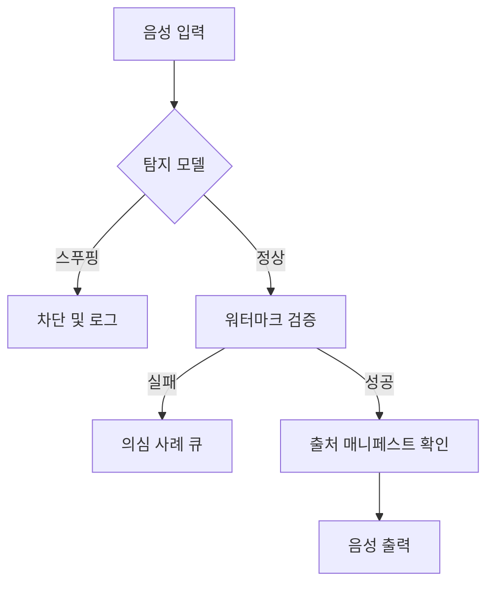

# 음성 스푸핑 방지 & 오디오 워터마킹 — ASVspoof 5, AudioSeal, WaveVerify

> 방어 체계보다 음성 복제가 더 빠르게 상용화되었습니다. 2026년 생산 음성 시스템에는 두 가지가 필요합니다: 실제 음성 vs 가짜 음성을 분류하는 탐지기(AASIST, RawNet2)와 압축 및 편집에도 살아남는 워터마크(AudioSeal). 둘 다 탑재하거나 음성 복제를 출시하지 마세요.

**유형:** 구축
**언어:** Python
**사전 요구 사항:** Phase 6 · 06 (화자 인식), Phase 6 · 08 (음성 복제)
**소요 시간:** ~75분

## 문제 정의

세 가지 관련 방어 기법:

1. **스푸핑 방지 / 딥페이크 탐지.** 오디오 클립이 주어졌을 때, 합성인지 실제인지 판별한다. ASVspoof 벤치마크(ASVspoof 2019 → 2021 → 5)가 표준 평가 기준이다.
2. **오디오 워터마킹.** 생성된 오디오에 감지기가 나중에 추출할 수 있는 눈에 띄지 않는 신호를 삽입한다. AudioSeal(Meta)과 WavMark가 공개 옵션이다.
3. **인증된 출처 추적.** 오디오 파일 + 메타데이터의 암호화 서명. C2PA / 콘텐츠 진위 확인 이니셔티브.

탐지 기법은 협조하지 않는 적대적 공격자를 다룬다. 워터마킹은 규정 준수 — AI 생성 오디오는 식별 가능해야 함 — 를 다룬다. 둘 다 2026년에 필수 요건이 된다.

## 개념


## ASVspoof 5 — 2024-2025 벤치마크

이전 버전 대비 가장 큰 변화:

- **크라우드소싱 데이터** (스튜디오 클린 아님) — 현실적인 조건.
- **~2000명의 화자** (이전 ~100명 대비).
- **32개의 공격 알고리즘.** TTS + 음성 변환 + 적대적 교란.
- **두 가지 트랙.** 대응책(CM) 독립 실행형 탐지; 생체 인식 시스템을 위한 스푸핑-견고 ASV(SASV).

ASVspoof 5의 최신 기술: ~7.23% EER. 이전 ASVspoof 2019 LA: 0.42% EER. 실제 배포: 야생 클립에서 5-10% EER 예상.

## AASIST와 RawNet2 — 탐지 모델 패밀리

**AASIST** (2021, 2026년까지 업데이트). 스펙트럼 특징에 대한 그래프-어텐션. ASVspoof 5 대응책 작업에서 현재 SOTA.

**RawNet2.** 원시 파형 위의 컨볼루션 프론트엔드 + TDNN 백본. 더 간단한 베이스라인; 파인튜닝 시 여전히 경쟁력 있음.

**NeXt-TDNN + SSL 특징.** 2025 변형: ECAPA 스타일 + WavLM 특징 + 포컬 손실. ASVspoof 2019 LA에서 0.42% EER 달성.

## AudioSeal — 2024 워터마크 기본값

Meta의 **AudioSeal** (2024년 1월, v0.2 2024년 12월). 주요 설계:

- **지역화.** 16kHz 샘플 해상도(1/16000초)에서 프레임별 워터마크 탐지.
- **생성기 + 탐지기 공동 훈련.** 생성기는 들리지 않는 신호를 임베딩하는 방법을 학습; 탐지기는 증강을 통해 이를 찾는 방법 학습.
- **견고성.** MP3/AAC 압축, EQ, 속도 변경 ±10%, 노이즈 혼합 +10dB SNR에서 생존.
- **속도.** 탐지기는 실시간의 485배 속도로 실행; WavMark보다 1000배 빠름.
- **용량.** 16비트 페이로드(각 발화에서 모델 ID, 생성 타임스탬프, 사용자 ID 인코딩 가능).

## WavMark

AudioSeal 이전의 공개 베이스라인. 가역적 신경망, 32비트/초. 문제점:

- 동기화 무차별 대입이 느림.
- 가우시안 노이즈 또는 MP3 압축으로 제거 가능.
- 실시간 친화적이지 않음.

## WaveVerify (2025년 7월)

AudioSeal의 약점(시간적 조작: 반전, 속도) 해결. FiLM 기반 생성기 + 전문가 혼합 탐지기 사용. 표준 공격에서 AudioSeal과 경쟁력 있음; 시간적 편집 처리 가능.

## 적대적 공격자가 악용하는 격차

AudioMarkBench에서: "피치 시프트 하에서 모든 워터마크는 0.6 미만의 비트 복구 정확도를 보여 거의 완전히 제거됨을 나타냄." **피치 시프트는 보편적 공격.** 2026년 워터마크도 공격적인 피치 수정에 완전히 견고하지 않음. 이것이 워터마킹과 함께 탐지(AASIST)가 필요한 이유.

## C2PA / 콘텐츠 진위 이니셔티브

ML 기술이 아닌 — 매니페스트 형식. 오디오 파일은 생성 도구, 작성자, 날짜에 대한 암호로 서명된 메타데이터를 운반. Audobox/Seamless가 사용. 출처에 좋음; 악성 행위자가 재인코딩하고 메타데이터를 제거하면 무효.

## 구축 방법

## 1단계: 간단한 스펙트럼 특징 감지기 (토이)

```python
def spectral_rolloff(spec, percentile=0.85):
    cum = 0
    total = sum(spec)
    if total == 0:
        return 0
    threshold = total * percentile
    for k, v in enumerate(spec):
        cum += v
        if cum >= threshold:
            return k
    return len(spec) - 1

def is_suspicious(audio):
    spec = magnitude_spectrum(audio)
    rolloff = spectral_rolloff(spec)
    return rolloff / len(spec) > 0.92
```

합성 음성은 종종 비정상적으로 평탄한 고주파 에너지를 가집니다. 실제 프로덕션 감지기들은 이 방법이 아닌 AASIST를 사용합니다. 하지만 직관적 개념은 유효합니다.

## 2단계: AudioSeal 임베딩 + 감지

```python
from audioseal import AudioSeal
import torch

generator = AudioSeal.load_generator("audioseal_wm_16bits")
detector = AudioSeal.load_detector("audioseal_detector_16bits")

audio = load_wav("generated.wav", sr=16000)[None, None, :]
payload = torch.tensor([[1, 0, 1, 1, 0, 1, 0, 0, 1, 1, 0, 1, 0, 1, 1, 0]])
watermark = generator.get_watermark(audio, sample_rate=16000, message=payload)
watermarked = audio + watermark

result, decoded_payload = detector.detect_watermark(watermarked, sample_rate=16000)
# result: [0, 1] 범위의 float — 워터마크 존재 확률
# decoded_payload: 16비트; 임베딩된 페이로드와 대조
```

## 3단계: 평가 — EER(등오류율)

```python
def eer(real_scores, fake_scores):
    thresholds = sorted(set(real_scores + fake_scores))
    best = (1.0, 0.0)
    for t in thresholds:
        far = sum(1 for s in fake_scores if s >= t) / len(fake_scores)
        frr = sum(1 for s in real_scores if s < t) / len(real_scores)
        if abs(far - frr) < best[0]:
            best = (abs(far - frr), (far + frr) / 2)
    return best[1]
```

## 4단계: 프로덕션 통합

```python
def safe_tts(text, voice, clone_reference=None):
    if clone_reference is not None:
        verify_consent(user_id, clone_reference)
    audio = tts_model.synthesize(text, voice)
    audio_with_wm = audioseal_embed(audio, payload=build_payload(user_id, model_id))
    manifest = c2pa_sign(audio_with_wm, user_id, timestamp=now())
    return audio_with_wm, manifest
```

모든 생성물은 다음을 포함합니다: (1) 워터마크, (2) 서명된 매니페스트, (3) 보존 정책 준수 감사 로그.

## 사용 사례

| 사용 사례 | 방어 방법 |
|----------|---------|
| 배송 TTS / 음성 복제 | 모든 출력에 AudioSeal 임베딩 적용 (협상 불가) |
| 생체 음성 인증 | AASIST + ECAPA 앙상블; 활성(liveness) 검증 |
| 콜센터 사기 탐지 | 수신 통화의 20% 샘플에 AASIST 적용 |
| 팟캐스트 진위 확인 | 업로드 시 C2PA 서명, AI 생성 시 AudioSeal 적용 |
| 연구 / 탐지기 훈련 | ASVspoof 5 train/dev/eval 데이터셋 사용 |

## 함정(Pitfalls)

- **탐지기 없이 워터마크 적용.** 무의미함. CI에 탐지기를 포함시켜 배포하라.
- **보정 없이 탐지.** AASIST는 ASVspoof LA에서 훈련되어 과적합(overfitting) 발생; 실제 환경에서의 정확도 하락. 도메인에서 보정(calibration) 수행.
- **피치 시프트 간격(pitch-shift gap).** 공격적인 피치 시프트는 대부분의 워터마크를 제거. 탐지 대체 수단(fallback) 마련.
- **메타데이터 제거 및 재호스팅.** C2PA는 재인코딩으로 쉽게 우회 가능. 항상 암호화(cryptographic) + 지각적(perceptual, 워터마크) 방어 수단을 함께 적용.
- **활성 검증(liveness)을 탐지로 사용.** 사용자에게 무작위 문구 말하도록 요청. 재생 공격(replay attack)은 방지하지만 실시간 클로닝(cloning)은 방지하지 못함.

## Ship It

`outputs/skill-spoof-defender.md`로 저장. 음성 생성 모델 배포를 위한 탐지 모델, 워터마크, 출처 매니페스트, 운영 플레이북을 선정합니다.

## 1. 탐지 모델 (Detection Model)
- **모델 선택**: **Spoofed Voice Detection Model** (예: ASVspoof 2021 LA 평가용 모델)  
  - **기능**: 재생/합성 음성 탐지, 실시간 스푸핑 공격 식별  
  - **통합 방식**: 음성 입력 파이프라인에 전처리 단계로 배치  
  - **출력**: 신뢰도 점수(0-1) 및 스푸핑 여부 플래그  

## 2. 워터마크 (Watermarking)
- **기술**: **AudioSeal** (비인지 오디오 워터마킹)  
  - **특징**:  
    - 인간 청각에 감지되지 않는 고주파 대역 임베딩  
    - **Robustness**: 리샘플링/압축/잡음 추가에 강함  
  - **검증 API**: `/verify_watermark` (헤더 `X-Auth-Token` 필요)  

## 3. 출처 매니페스트 (Provenance Manifest)
- **구조**: JSON-LD 형식 (W3C 표준)  
  ```json
  {
    "@context": "https://schema.org",
    "generator": "VoiceGen-Enterprise v2.1",
    "model_hash": "sha256:abcd1234...",
    "training_data": {
      "license": "CC-BY-SA-4.0",
      "sources": ["public_domain_audio", "opt_in_voices"]
    },
    "watermark_id": "WS-2023-Q4"
  }
  ```
- **저장 위치**: 음성 파일 메타데이터 또는 별도 매니페스트 서버  

## 4. 운영 플레이북 (Operational Playbook)
| 단계 | 작업 | 담당자 | SLA |
|------|------|--------|-----|
| **1. 입력 검증** | 워터마크/출처 매니페스트 확인 | 보안 팀 | 500ms 이내 |
| **2. 실시간 탐지** | ASVspoof 모델 실행 | ML 엔지니어링 | 200ms 지연 허용 |
| **3. 위험 조치** | 스푸핑 탐지 시:<br>- 음성 차단<br>- 관리자 알림<br>- 로그 기록 | DevOps | 1분 내 대응 |
| **4. 감사** | 월간 워터마크 무결성 검사 | 컴플라이언스 팀 | 월말 3일 이내 |

## 5. 배포 아키텍처


> **참고**: 모든 구성 요소는 **PyTorch** 및 **TensorFlow Serving**으로 배포되며, 모니터링은 **Prometheus+Grafana**로 수행됩니다.

## 연습 문제

1. **쉬움.** `code/main.py`를 실행하세요. 합성 오디오에서 장난감 탐지기 + 장난감 워터마크 삽입/탐지 수행.
2. **중간.** `audioseal`을 설치하고, TTS 출력에 16비트 페이로드를 삽입한 후 재디코딩하세요. 노이즈로 오디오를 손상시키고 비트 복구 정확도(Bit Recovery Accuracy)를 측정하세요.
3. **어려움.** ASVspoof 2019 LA 데이터셋에서 RawNet2 또는 AASIST를 파인튜닝(fine-tuning)하세요. EER(Equal Error Rate)을 측정하고, F5-TTS로 생성된 클립의 홀드아웃 세트에서 테스트하세요 — OOD(Out-Of-Distribution) 탐지 성능 저하 정도를 확인하세요.

## 주요 용어

| 용어 | 사람들이 말하는 것 | 실제 의미 |
|------|-------------------|-----------|
| ASVspoof | 벤치마크 | 2년 주기 챌린지; 2024 = ASVspoof 5. |
| CM (countermeasure) | 탐지기 | 분류기: 실제 음성 vs 합성/변환 음성. |
| SASV | 화자 검증 + CM | 통합 생체 인식 + 스푸핑 탐지. |
| AudioSeal | 메타 워터마크 | 지역화된 16비트 페이로드, WavMark 대비 485배 빠름. |
| Bit Recovery Accuracy | 워터마크 생존률 | 공격 후 복구된 페이로드 비트 비율. |
| C2PA | 출처 메타데이터 | 생성/저작권에 대한 암호화 메타데이터. |
| AASIST | 탐지기 패밀리 | 그래프 어텐션 기반 스푸핑 방지 SOTA. |

## 추가 자료

- [Todisco et al. (2024). ASVspoof 5](https://dl.acm.org/doi/10.1016/j.csl.2025.101825) — 현재 벤치마크.
- [Defossez et al. (2024). AudioSeal](https://arxiv.org/abs/2401.17264) — 워터마크 기본값.
- [Chen et al. (2025). WaveVerify](https://arxiv.org/abs/2507.21150) — 시간적 공격용 MoE 탐지기.
- [Jung et al. (2022). AASIST](https://arxiv.org/abs/2110.01200) — SOTA 탐지 백본.
- [AudioMarkBench (2024)](https://proceedings.neurips.cc/paper_files/paper/2024/file/5d9b7775296a641a1913ab6b4425d5e8-Paper-Datasets_and_Benchmarks_Track.pdf) — 강인성 평가.
- [C2PA 사양](https://c2pa.org/specifications/specifications/) — 출처 매니페스트 형식.