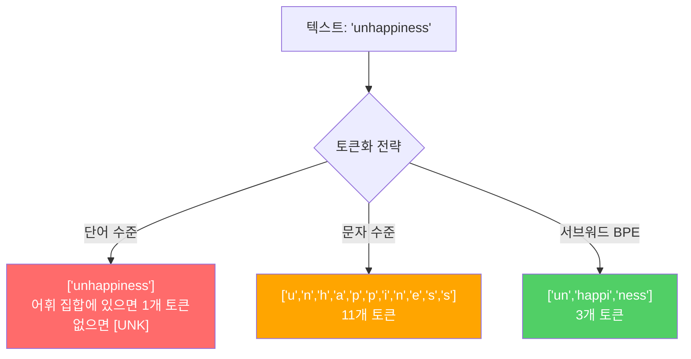
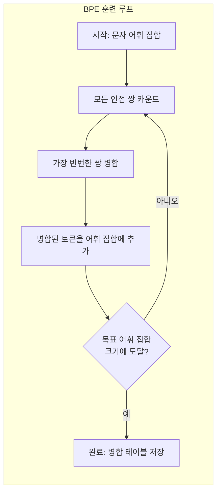
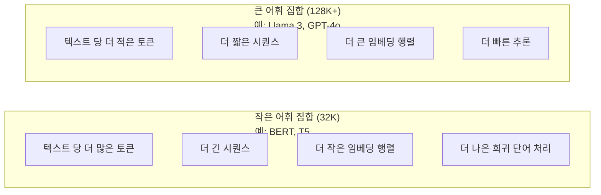

# 토크나이저: BPE, WordPiece, SentencePiece

> 당신의 LLM은 영어를 읽지 않습니다. 정수를 읽습니다. 토크나이저는 그 정수가 의미를 전달하는지 아니면 낭비하는지 결정합니다.

**유형:** 구축
**언어:** Python
**선수 지식:** Phase 05 (NLP 기초)
**소요 시간:** ~90분

## 학습 목표

- BPE, WordPiece, Unigram 토크나이저 알고리즘을 직접 구현하고 병합 전략 비교
- 어휘 집합 크기가 모델 효율성에 미치는 영향 설명: 너무 작으면 긴 시퀀스 생성, 너무 크면 임베딩 파라미터 낭비
- 언어 및 코드 간 토크나이징 아티팩트 분석, 특정 토크나이저가 실패하는 지점 식별
- `tiktoken` 및 `sentencepiece` 라이브러리를 사용해 텍스트 토크나이징 및 결과 토큰 ID 검사

> **참고**:  
> - BPE(Byte-Pair Encoding)  
> - WordPiece  
> - Unigram 토크나이저는 서브워드 분할 전략의 대표적 구현체입니다.  
> - `tiktoken`은 GPT 모델에서 사용되는 공식 토크나이저 라이브러리이며,  
> - `sentencepiece`는 다국어 서브워드 토크나이징에 널리 활용되는 오픈소스 도구입니다.

## 문제 정의

당신의 LLM(Large Language Model)은 영어를 읽지 않습니다. 어떤 언어도 읽지 않습니다. 숫자만 읽습니다.

"Hello, world!"와 [15496, 11, 995, 0] 사이의 간극을 메우는 것이 토크나이저입니다. 모든 단어, 공백, 구두점은 모델이 처리하기 전에 정수로 변환되어야 합니다. 이 변환은 중립적이지 않습니다. 이후 되돌릴 수 없는 가정들을 모델에 내재시킵니다.

이것을 잘못하면 모델이 일반적인 단어를 여러 토큰으로 인코딩하는 데 용량을 낭비하게 됩니다. "unfortunately"는 하나의 토큰 대신 네 개의 토큰이 됩니다. 128K 컨텍스트 윈도우가 다의어 단어가 많은 텍스트에서 75% 축소될 수 있습니다. 올바르게 구현하면 동일한 컨텍스트 윈도우가 두 배의 의미를 담을 수 있습니다. "이 모델은 코드를 잘 처리한다"와 "이 모델은 Python에서 실패한다"의 차이는 종종 토크나이저 훈련 방식에 달려 있습니다.

GPT-4나 Claude에 대한 모든 API 호출은 토큰 단위로 가격이 책정됩니다. 모델이 생성하는 모든 토큰은 계산 비용을 발생시킵니다. 출력을 표현하는 데 필요한 토큰이 적을수록 종단간 추론 속도가 빨라집니다. 토크나이징은 전처리가 아닙니다. 아키텍처입니다.

## 개념

### 실패한 세 가지 접근법 (그리고 성공한 하나)

텍스트를 숫자로 변환하는 세 가지 명백한 방법이 있습니다. 그중 두 가지는 대규모로 작동하지 않습니다.

**단어 수준 토큰화**는 공백과 구두점을 기준으로 분할합니다. "The cat sat"은 ["The", "cat", "sat"]이 됩니다. 간단하지만 "tokenization"은 어떨까요? 또는 "GPT-4o"? 또는 "Geschwindigkeitsbegrenzung" 같은 독일어 합성어는? 단어 수준 토큰화는 모든 언어의 모든 단어를 커버하기 위해 막대한 어휘 집합이 필요합니다. 단어를 놓치면 `[UNK]` 토큰이 발생합니다. 이는 모델이 "이게 뭔지 모르겠다"고 말하는 방식입니다. 영어만 해도 100만 개 이상의 단어 형태가 있습니다. 여기에 코드, URL, 과학 표기법, 100개 이상의 언어를 추가하면 무한한 어휘 집합이 필요합니다.

**문자 수준 토큰화**는 반대 방향으로 갑니다. "hello"는 ["h", "e", "l", "l", "o"]가 됩니다. 어휘 집합은 작습니다(수백 개의 문자). 알 수 없는 토큰은 절대 없습니다. 하지만 시퀀스가 매우 길어집니다. 단어 수준 토큰으로 10개 토큰인 문장이 문자 수준 토큰으로 50개 토큰이 됩니다. 모델은 "t", "h", "e"가 함께 "the"를 의미한다는 것을 학습해야 합니다. 이는 인간이 3세 때 배우는 것을 어텐션 용량으로 소모하는 것입니다.

**서브워드 토큰화**는 최적의 지점을 찾습니다. 일반적인 단어는 그대로 유지됩니다. "the"는 하나의 토큰입니다. 드문 단어는 의미 있는 조각으로 분해됩니다. "unhappiness"는 ["un", "happi", "ness"]가 됩니다. 어휘 집합은 관리 가능한 수준(30K~128K 토큰)을 유지합니다. 시퀀스는 짧게 유지됩니다. 알 수 없는 토큰은 사실상 사라집니다. 어떤 단어든 서브워드 조각으로 구성할 수 있기 때문입니다.

모든 현대 LLM은 서브워드 토큰화를 사용합니다. GPT-2, GPT-4, BERT, Llama 3, Claude 등 모두 마찬가지입니다. 문제는 어떤 알고리즘을 사용할지입니다.



### BPE: 바이트 페어 인코딩

BPE는 토큰화를 위해 재활용된 탐욕적 압축 알고리즘입니다. 아이디어는 인덱스 카드에 들어갈 정도로 간단합니다.

개별 문자로 시작합니다. 훈련 코퍼스에서 모든 인접 쌍을 카운트합니다. 가장 빈번한 쌍을 새로운 토큰으로 병합합니다. 목표 어휘 집합 크기에 도달할 때까지 반복합니다.

다음은 "lower", "lowest", "newest" 단어가 있는 작은 코퍼스에서 BPE가 실행되는 예시입니다:

```
코퍼스 (단어 빈도 포함):
  "lower"  x5
  "lowest" x2
  "newest" x6

단계 0 -- 문자에서 시작:
  l o w e r       (x5)
  l o w e s t     (x2)
  n e w e s t     (x6)

단계 1 -- 인접 쌍 카운트:
  (e,s): 8    (s,t): 8    (l,o): 7    (o,w): 7
  (w,e): 13   (e,r): 5    (n,e): 6    ...

단계 2 -- 가장 빈번한 쌍 (w,e) -> "we" 병합:
  l o we r        (x5)
  l o we s t      (x2)
  n e we s t      (x6)

단계 3 -- 재카운트 및 (e,s) -> "es" 병합:
  l o we r        (x5)
  l o we s t      (x2)    <- 'es'는 'e'+'s'에서만 형성, 'we'+'s'는 아님
  n e we s t      (x6)    <- 'we' 앞의 'e'와 'we' 뒤의 's' 주의

정확히 추적하면:
  "we" 병합 후 남은 쌍:
  (l,o): 7   (o,we): 7   (we,r): 5   (we,s): 8
  (s,t): 8   (n,e): 6    (e,we): 6

단계 3 -- (we,s) -> "wes" 또는 (s,t) -> "st" 병합 (8로 동률, 첫 번째 선택):
  (we,s) -> "wes" 병합:
  l o we r        (x5)
  l o wes t       (x2)
  n e wes t       (x6)

단계 4 -- (wes,t) -> "west" 병합:
  l o we r        (x5)
  l o west        (x2)
  n e west        (x6)

...목표 어휘 집합 크기에 도달할 때까지 계속.
```

병합 테이블이 토크나이저입니다. 새 텍스트를 인코딩하려면 학습된 순서대로 병합을 적용합니다. 훈련 코퍼스는 어떤 병합이 존재하는지 결정하며, 이 선택은 모델이 보는 것을 영구적으로 형성합니다.



### 바이트 수준 BPE (GPT-2, GPT-3, GPT-4)

표준 BPE는 유니코드 문자에서 작동합니다. 바이트 수준 BPE는 원시 바이트(0-255)에서 작동합니다. 이는 정확히 256개의 기본 어휘 집합을 제공하며, 모든 언어나 인코딩을 처리하고 알 수 없는 토큰을 절대 생성하지 않습니다.

GPT-2가 이 접근법을 도입했습니다. 기본 어휘 집합은 모든 가능한 바이트를 커버합니다. BPE 병합은 그 위에 구축됩니다. OpenAI의 tiktoken 라이브러리는 다음과 같은 어휘 집합 크기로 바이트 수준 BPE를 구현합니다:

- GPT-2: 50,257개 토큰
- GPT-3.5/GPT-4: ~100,256개 토큰 (cl100k_base 인코딩)
- GPT-4o: 200,019개 토큰 (o200k_base 인코딩)

### 워드피스 (BERT)

워드피스는 BPE와 비슷해 보이지만 병합을 다르게 선택합니다. 원시 빈도 대신 훈련 데이터의 가능도를 최대화합니다:

```
BPE 병합 기준:      count(A, B)
워드피스 병합 기준: count(AB) / (count(A) * count(B))
```

BPE는 "어떤 쌍이 가장 자주 나타나는가?"라고 묻습니다. 워드피스는 "어떤 쌍이 우연으로 예상되는 것보다 더 자주 함께 나타나는가?"라고 묻습니다. 이 미묘한 차이는 다른 어휘 집합을 생성합니다. 워드피스는 빈도가 높은 것이 아니라 공동 발생이 놀라운 병합을 선호합니다.

워드피스는 연속 서브워드 앞에 "##" 접두사를 사용합니다:

```
"unhappiness" -> ["un", "##happi", "##ness"]
"embedding"   -> ["em", "##bed", "##ding"]
```

"##" 접두사는 이 조각이 이전 토큰을 계속한다는 것을 알려줍니다. BERT는 30,522개 토큰 어휘 집합으로 워드피스를 사용합니다. 모든 BERT 변형 -- DistilBERT, RoBERTa의 토크나이저는 실제로 BPE이지만 BERT 자체는 워드피스입니다.

### 센텐스피스 (Llama, T5)

센텐스피스는 공백을 포함한 원시 유니코드 문자 스트림으로 입력을 처리합니다. 사전 토큰화 단계가 없습니다. 단어 경계에 대한 언어별 규칙이 없습니다. 이는 진정으로 언어에 구애받지 않게 만듭니다. 공백으로 단어가 구분되지 않는 중국어, 일본어, 태국어 등에서도 작동합니다.

센텐스피스는 두 가지 알고리즘을 지원합니다:
- **BPE 모드**: 표준 BPE와 동일한 병합 논리를 원시 문자 시퀀스에 적용
- **유니그램 모드**: 큰 어휘 집합에서 시작하여 전체 가능도에 가장 적게 영향을 미치는 토큰을 반복적으로 제거합니다. BPE의 반대 -- 병합 대신 가지치기.

Llama 2는 32,000개 토큰 어휘 집합으로 센텐스피스 BPE를 사용합니다. T5는 32,000개 토큰으로 센텐스피스 유니그램을 사용합니다. 참고: Llama 3은 128,256개 토큰으로 tiktoken 기반 바이트 수준 BPE 토크나이저로 전환했습니다.

### 어휘 집합 크기 트레이드오프

이는 측정 가능한 결과를 가진 실제 엔지니어링 결정입니다.



구체적인 숫자. 4,096차원 임베딩과 128K 어휘 집합의 경우 임베딩 행렬만 128,000 x 4,096 = 5억 2,400만 개 매개변수입니다. 32K 어휘 집합의 경우 1억 3,100만 개 매개변수입니다. 이는 토크나이저 선택만으로 4억 개의 매개변수 차이가 납니다.

하지만 더 큰 어휘 집합은 텍스트를 더 공격적으로 압축합니다. 32K 어휘 집합으로 100개 토큰인 영어 단락이 128K 어휘 집합으로 70개 토큰이 될 수 있습니다. 이는 생성 중 30% 더 적은 순방향 패스를 의미합니다. 수백만 개의 요청을 처리하는 모델의 경우 이는 직접적인 컴퓨팅 비용 감소입니다.

추세는 명확합니다. 어휘 집합 크기가 커지고 있습니다. GPT-2는 50,257개, GPT-4는 ~100K, Llama 3은 128K, GPT-4o는 200K를 사용합니다.

| 모델 | 어휘 집합 크기 | 토크나이저 유형 | 영어 단어당 평균 토큰 수 |
|-------|-----------|----------------|---------------------------|
| BERT | 30,522 | 워드피스 | ~1.4 |
| GPT-2 | 50,257 | 바이트 수준 BPE | ~1.3 |
| Llama 2 | 32,000 | 센텐스피스 BPE | ~1.4 |
| GPT-4 | ~100,256 | 바이트 수준 BPE | ~1.2 |
| Llama 3 | 128,256 | 바이트 수준 BPE (tiktoken) | ~1.1 |
| GPT-4o | 200,019 | 바이트 수준 BPE | ~1.0 |

### 다국어 세금

주로 영어로 훈련된 토크나이저는 다른 언어에 잔인합니다. GPT-2의 토크나이저에서 한국어 텍스트는 단어당 평균 2-3개 토큰입니다. 중국어는 더 나쁠 수 있습니다. 이는 한국어 사용자가 영어 사용자의 절반 크기의 컨텍스트 윈도우를 가진다는 것을 의미합니다. 동일한 비용을 지불하면서 정보 밀도가 낮습니다.

이것이 Llama 3이 어휘 집합을 32K에서 128K로 4배 확장한 이유입니다. 비영어 스크립트에 더 많은 토큰을 할당하면 언어 간 공정한 압축이 가능해집니다.

## 구축 방법

### 1단계: 문자 수준 토크나이저

기초에서 시작합니다. 문자 수준 토크나이저는 각 문자를 유니코드 코드 포인트에 매핑합니다. 학습이 필요 없습니다. 알 수 없는 토큰도 없습니다. 단순한 매핑입니다.

```python
class CharTokenizer:
    def encode(self, text):
        return [ord(c) for c in text]

    def decode(self, tokens):
        return "".join(chr(t) for t in tokens)
```

"hello"는 [104, 101, 108, 108, 111]이 됩니다. 모든 문자가 자체 토큰입니다. 이는 우리가 개선할 기준선입니다.

### 2단계: 처음부터 시작하는 BPE 토크나이저

실제 구현입니다. 원시 바이트에서 학습(GPT-2와 유사)하고, 쌍을 세고, 가장 빈번한 쌍을 병합하며, 모든 병합을 순서대로 기록합니다. 병합 테이블이 토크나이저입니다.

```python
from collections import Counter

class BPETokenizer:
    def __init__(self):
        self.merges = {}
        self.vocab = {}

    def _get_pairs(self, tokens):
        pairs = Counter()
        for i in range(len(tokens) - 1):
            pairs[(tokens[i], tokens[i + 1])] += 1
        return pairs

    def _merge_pair(self, tokens, pair, new_token):
        merged = []
        i = 0
        while i < len(tokens):
            if i < len(tokens) - 1 and tokens[i] == pair[0] and tokens[i + 1] == pair[1]:
                merged.append(new_token)
                i += 2
            else:
                merged.append(tokens[i])
                i += 1
        return merged

    def train(self, text, num_merges):
        tokens = list(text.encode("utf-8"))
        self.vocab = {i: bytes([i]) for i in range(256)}

        for i in range(num_merges):
            pairs = self._get_pairs(tokens)
            if not pairs:
                break
            best_pair = max(pairs, key=pairs.get)
            new_token = 256 + i
            tokens = self._merge_pair(tokens, best_pair, new_token)
            self.merges[best_pair] = new_token
            self.vocab[new_token] = self.vocab[best_pair[0]] + self.vocab[best_pair[1]]

        return self

    def encode(self, text):
        tokens = list(text.encode("utf-8"))
        for pair, new_token in self.merges.items():
            tokens = self._merge_pair(tokens, pair, new_token)
        return tokens

    def decode(self, tokens):
        byte_sequence = b"".join(self.vocab[t] for t in tokens)
        return byte_sequence.decode("utf-8", errors="replace")
```

학습 루프는 BPE의 핵심입니다: 쌍을 세고, 우승자를 병합하고, 반복합니다. 각 병합은 총 토큰 수를 줄입니다. `num_merges` 라운드 후, 어휘 집합은 256(기본 바이트)에서 256 + num_merges로 성장합니다.

인코딩은 학습된 정확한 순서대로 병합을 적용합니다. 이는 중요합니다. 병합 1에서 "th"를 생성하고 병합 5에서 "the"를 생성했다면, 인코딩은 병합 1을 먼저 적용하여 병합 5에서 "th" + "e"로 "the"가 형성될 수 있도록 해야 합니다.

디코딩은 역과정입니다: 각 토큰 ID를 어휘 집합에서 조회하고, 바이트를 연결한 후 UTF-8로 디코딩합니다.

### 3단계: 인코딩 및 디코딩 왕복 테스트

```python
corpus = (
    "The cat sat on the mat. The cat ate the rat. "
    "The dog sat on the log. The dog ate the frog. "
    "Natural language processing is the study of how computers "
    "understand and generate human language. "
    "Tokenization is the first step in any NLP pipeline."
)

tokenizer = BPETokenizer()
tokenizer.train(corpus, num_merges=40)

test_sentences = [
    "The cat sat on the mat.",
    "Natural language processing",
    "tokenization pipeline",
    "unhappiness",
]

for sentence in test_sentences:
    encoded = tokenizer.encode(sentence)
    decoded = tokenizer.decode(encoded)
    raw_bytes = len(sentence.encode("utf-8"))
    ratio = len(encoded) / raw_bytes
    print(f"'{sentence}'")
    print(f"  Tokens: {len(encoded)} (from {raw_bytes} bytes) -- ratio: {ratio:.2f}")
    print(f"  Roundtrip: {'PASS' if decoded == sentence else 'FAIL'}")
```

압축 비율은 토크나이저의 효율성을 나타냅니다. 0.50 비율은 토크나이저가 원시 바이트의 절반 토큰 수로 압축했음을 의미합니다. 낮을수록 좋습니다. 학습 말뭉치에서는 비율이 좋을 것입니다. "unhappiness"(말뭉치에 없는 단어)와 같은 분포 외 텍스트에서는 비율이 나빠질 것입니다. 토크나이저는 보이지 않는 패턴에 대해 문자 수준 인코딩으로 대체합니다.

### 4단계: tiktoken과 비교

```python
import tiktoken

enc = tiktoken.get_encoding("cl100k_base")

texts = [
    "The cat sat on the mat.",
    "unhappiness",
    "Hello, world!",
    "def fibonacci(n): return n if n < 2 else fibonacci(n-1) + fibonacci(n-2)",
    "Geschwindigkeitsbegrenzung",
]

for text in texts:
    our_tokens = tokenizer.encode(text)
    tiktoken_tokens = enc.encode(text)
    tiktoken_pieces = [enc.decode([t]) for t in tiktoken_tokens]
    print(f"'{text}'")
    print(f"  Our BPE:   {len(our_tokens)} tokens")
    print(f"  tiktoken:  {len(tiktoken_tokens)} tokens -> {tiktoken_pieces}")
```

tiktoken은 동일한 알고리즘을 사용하지만 수백 기가바이트의 텍스트로 학습되고 100,000개의 병합을 수행합니다. 알고리즘은 동일합니다. 차이는 학습 데이터와 병합 수입니다. 40개의 병합으로 단락에 학습된 토크나이저는 대규모 말뭉치의 100K 병합을 가진 tiktoken과 경쟁할 수 없습니다. 하지만 메커니즘은 동일합니다.

### 5단계: 어휘 집합 분석

```python
def analyze_vocabulary(tokenizer, test_texts):
    total_tokens = 0
    total_chars = 0
    token_usage = Counter()

    for text in test_texts:
        encoded = tokenizer.encode(text)
        total_tokens += len(encoded)
        total_chars += len(text)
        for t in encoded:
            token_usage[t] += 1

    print(f"Vocabulary size: {len(tokenizer.vocab)}")
    print(f"Total tokens across all texts: {total_tokens}")
    print(f"Total characters: {total_chars}")
    print(f"Avg tokens per character: {total_tokens / total_chars:.2f}")

    print(f"\nMost used tokens:")
    for token_id, count in token_usage.most_common(10):
        token_bytes = tokenizer.vocab[token_id]
        display = token_bytes.decode("utf-8", errors="replace")
        print(f"  Token {token_id:4d}: '{display}' (used {count} times)")

    unused = [t for t in tokenizer.vocab if t not in token_usage]
    print(f"\nUnused tokens: {len(unused)} out of {len(tokenizer.vocab)}")
```

이는 어휘 집합의 지프 분포를 보여줍니다. 몇 개의 토큰(공백, "the", "e")이 지배적입니다. 대부분의 토큰은 거의 사용되지 않습니다. 프로덕션 토크나이저는 이 분포를 최적화합니다. 일반적인 패턴은 짧은 토큰 ID를 얻고, 드문 패턴은 더 긴 표현을 얻습니다.

## 사용 방법

스크래치 BPE가 작동합니다. 이제 프로덕션 도구가 어떻게 생겼는지 확인해 보세요.

### tiktoken (OpenAI)

```python
import tiktoken

enc = tiktoken.get_encoding("cl100k_base")

text = "Tokenizers convert text to integers"
tokens = enc.encode(text)
print(f"Tokens: {tokens}")
print(f"Pieces: {[enc.decode([t]) for t in tokens]}")
print(f"Roundtrip: {enc.decode(tokens)}")
```

tiktoken은 Rust로 작성되었으며 Python 바인딩을 제공합니다. 초당 수백만 개의 토큰을 인코딩할 수 있습니다. 동일한 BPE 알고리즘이지만 산업용 강도의 구현체입니다.

### Hugging Face 토크나이저

```python
from tokenizers import Tokenizer
from tokenizers.models import BPE
from tokenizers.trainers import BpeTrainer
from tokenizers.pre_tokenizers import ByteLevel

tokenizer = Tokenizer(BPE())
tokenizer.pre_tokenizer = ByteLevel()

trainer = BpeTrainer(vocab_size=1000, special_tokens=["<pad>", "<eos>", ""])
tokenizer.train(["corpus.txt"], trainer)

output = tokenizer.encode("The cat sat on the mat.")
print(f"Tokens: {output.tokens}")
print(f"IDs: {output.ids}")
```

Hugging Face 토크나이저 라이브러리도 내부적으로 Rust를 사용합니다. 기가바이트 규모의 코퍼스에서 BPE를 몇 초 만에 학습시킬 수 있습니다. 자체 모델을 학습시킬 때 사용하는 도구입니다.

### Llama 토크나이저 로드하기

```python
from transformers import AutoTokenizer

tokenizer = AutoTokenizer.from_pretrained("meta-llama/Llama-3.1-8B")

text = "Tokenizers are the unsung heroes of LLMs"
tokens = tokenizer.encode(text)
print(f"Token IDs: {tokens}")
print(f"Tokens: {tokenizer.convert_ids_to_tokens(tokens)}")
print(f"Vocab size: {tokenizer.vocab_size}")

multilingual = ["Hello world", "Hola mundo", "Bonjour le monde"]
for text in multilingual:
    ids = tokenizer.encode(text)
    print(f"'{text}' -> {len(ids)} tokens")
```

Llama 3의 128K 어휘 집합은 GPT-2의 50K 어휘 집합보다 비영어 텍스트를 훨씬 더 잘 압축합니다. 직접 확인할 수 있습니다. 동일한 문장을 여러 언어로 인코딩하고 토큰 수를 세어 보세요.

## Ship It

이 레슨은 `outputs/prompt-tokenizer-analyzer.md`를 생성합니다. 이는 모든 텍스트 및 모델 조합에 대한 토큰화 효율성을 분석하는 재사용 가능한 프롬프트입니다. 텍스트 샘플을 입력하면 어떤 모델의 토크나이저가 가장 효율적으로 처리하는지 알려줍니다.

## 연습 문제

1. BPE 토크나이저를 수정하여 각 병합 단계에서 어휘집을 출력하도록 해. "t" + "h"가 "th"로, 이후 "th" + "e"가 "the"로 변하는 과정을 관찰해. 일반적인 영어 단어가 조각별로 조립되는 과정을 추적해.

2. BPE 토크나이저에 특수 토큰(`<pad>`, `<eos>`, ``)을 추가해. ID를 각각 0, 1, 2로 할당하고 다른 모든 토큰의 ID를 조정해. BPE 실행 전에 공백 기준으로 분할하는 전처리 단계를 구현해.

3. WordPiece 병합 기준(빈도 대신 우도비)을 구현해. 동일한 말뭉치와 동일한 병합 횟수로 BPE와 WordPiece를 학습시켜. 결과 어휘집을 비교해 - 어떤 방식이 더 언어학적으로 의미 있는 서브워드를 생성하는지 분석해.

4. 다국어 토크나이저 효율성 벤치마크를 구축해. 영어, 스페인어, 중국어, 한국어, 아랍어로 된 10개 문장을 준비. 각 문장을 tiktoken(cl100k_base)으로 토크나이징하고 평균 토큰/문자 비율을 측정해. 각 언어별 "다국어 세금"을 수치화해.

5. 더 큰 말뭉치(예: 위키피디아 문서)로 BPE 토크나이저를 학습시켜. 동일한 텍스트에서 tiktoken 대비 10% 이내의 압축률을 달성하기 위해 병합 횟수를 조정해. 이를 통해 말뭉치 크기, 병합 횟수, 압축 품질 간의 관계를 이해해.

## 주요 용어

| 용어 | 사람들이 말하는 것 | 실제 의미 |
|------|----------------|----------------------|
| 토큰(Token) | "단어" | 모델 어휘집의 단위 — 문자, 부분 단어, 단어 또는 다중 단어 청크가 될 수 있음 |
| BPE | "어떤 압축 기술" | 바이트 페어 인코딩(Byte Pair Encoding) — 목표 어휘집 크기에 도달할 때까지 가장 빈번한 인접 토큰 쌍을 반복적으로 병합 |
| WordPiece | "BERT의 토크나이저" | BPE와 유사하지만 원시 빈도 대신 count(AB)/(count(A)*count(B))의 우도 비율을 최대화하는 방식으로 병합 |
| SentencePiece | "토크나이저 라이브러리" | 사전 토크나이징 없이 원시 유니코드를 처리하는 언어-불문 토크나이저, BPE 및 유니그램(Unigram) 알고리즘 지원 |
| 어휘집 크기(Vocabulary size) | "아는 단어 수" | 고유 토큰의 총 개수: GPT-2는 50,257, BERT는 30,522, Llama 3는 128,256 |
| 생산성(Fertility) | "토크나이저 용어가 아님" | 단어당 평균 토큰 수 — 언어 간 토크나이저 효율성 측정 (1.0은 완벽, 3.0은 모델이 3배 더 열심히 작동함을 의미) |
| 바이트 수준 BPE(Byte-level BPE) | "GPT의 토크나이저" | 유니코드 문자 대신 원시 바이트(0-255)에서 작동하는 BPE, 모든 입력에 대해 알 수 없는 토큰이 없음을 보장 |
| 병합 테이블(Merge table) | "토크나이저 파일" | 학습 중 학습된 쌍 병합 순서 목록 — 이것이 바로 토크나이저이며 순서가 중요 |
| 사전 토크나이징(Pre-tokenization) | "공백 기준 분할" | 부분 단어 토크나이징 전에 적용되는 규칙: 공백 분할, 숫자 분리, 구두점 처리 |
| 압축 비율(Compression ratio) | "토크나이저 효율성" | 생성된 토큰 수를 입력 바이트 수로 나눈 값 — 낮을수록 더 나은 압축과 빠른 추론 가능 |

## 추가 자료

- [Sennrich et al., 2016 -- "Neural Machine Translation of Rare Words with Subword Units"](https://arxiv.org/abs/1508.07909) -- NLP에 BPE(서브워드 단위)를 도입한 논문, 1994년 압축 알고리즘을 현대 토크나이저의 기반으로 전환
- [Kudo & Richardson, 2018 -- "SentencePiece: A simple and language independent subword tokenizer"](https://arxiv.org/abs/1808.06226) -- 다국어 모델 실용화를 가능하게 한 언어-불변 서브워드 토크나이저
- [OpenAI tiktoken 저장소](https://github.com/openai/tiktoken) -- GPT-3.5/4/4o에서 사용되는 Rust로 작성된 프로덕션 BPE 구현체 (Python 바인딩 포함)
- [Hugging Face Tokenizers 문서](https://huggingface.co/docs/tokenizers) -- Rust 성능 기반의 프로덕션급 토크나이저 학습 도구