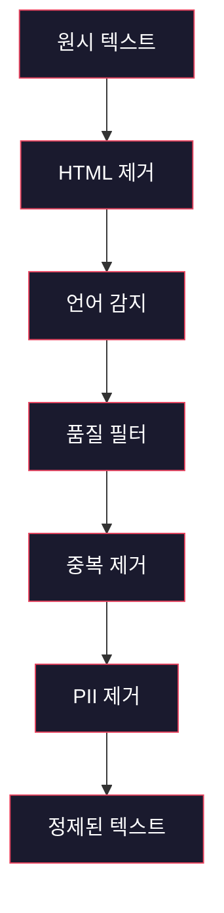
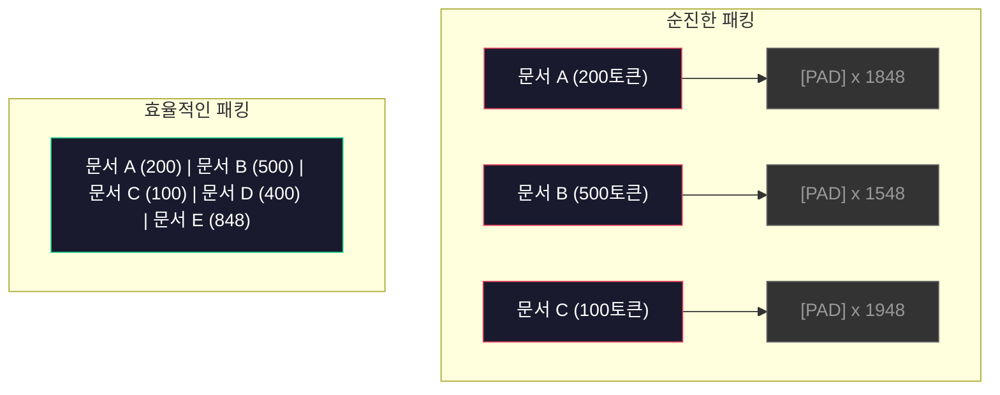

# 사전 학습용 데이터 파이프라인

> 모델은 거울입니다. 모델에 입력한 데이터를 그대로 반영합니다. 쓰레기를 입력하면 완벽한 유창성으로 쓰레기를 반사합니다.

**유형:** 구축
**언어:** Python
**사전 요구 사항:** 1단계, 레슨 01-02(토크나이저, 토크나이저 구축)
**소요 시간:** ~90분

## 학습 목표

- 메모리에 전체 데이터를 로드하지 않고 테라바이트 규모의 텍스트를 토큰화, 청크화, 섞기, 배치화하는 스트리밍 데이터 파이프라인 구축
- 실제 사전 학습 파이프라인에서 사용되는 데이터 품질 필터(중복 제거, 언어 감지, 콘텐츠 필터링) 구현
- 적절한 어텐션 마스크(attention mask) 및 문서 경계 처리를 포함한 고정 길이 훈련 시퀀스 생성
- 데이터 로더가 GPU 훈련 속도를 유지할 수 있도록 파이프라인 처리량(throughput) 프로파일링

> **참고**: 전문 용어는 한국어(영어) 형식으로 표기 (예: 어텐션 마스크(attention mask))

## 문제 정의

토큰화기(tokenizer)는 있지만, 이제 데이터가 필요합니다.

데이터셋도, CSV 파일도 아닙니다. 테라바이트 규모의 텍스트 — 정제(cleaning), 중복 제거(deduplication), 품질 필터링(filtering for quality), 고정 길이 시퀀스(tokenized into fixed-length sequences)로 토큰화되며, 8-GPU 클러스터가 다음 배치를 기다리지 않도록 충분히 빠르게 무작위 배치로 제공되는 데이터입니다.

대부분의 사람들은 LLM 훈련이 모델 아키텍처(model architecture)에 관한 것이라고 생각합니다. 하지만 그렇지 않습니다. Llama 3는 15.6조 개의 토큰을 사용했고, GPT-3는 3000억 개, DeepSeek-V2는 8.1조 개를 사용했습니다. 이 세 모델의 아키텍처는 대략 동일합니다: 어텐션(attention)과 피드포워드(feedforward) 레이어가 있는 트랜스포머(transformer) 블록을 쌓아 만든 구조입니다. 출력 품질의 차이는 압도적으로 데이터(data)에서 비롯됩니다.

DeepMind의 Chinchilla 논문은 이를 정확히 지적했습니다. 주어진 계산 예산(compute budget) 내에서 모델 파라미터(model parameters)와 훈련 토큰(training tokens) 간의 최적 비율이 존재합니다. Chinchilla는 2022년 대부분의 모델이 극심하게 과소 훈련(undertrained)되었음을 보여주었습니다 — 즉, 본 데이터 양에 비해 파라미터가 너무 많았습니다. 1.4조 개의 토큰으로 훈련된 700억(70B) 파라미터 모델(Chinchilla-최적)이 3000억 개의 토큰으로 훈련된 2800억(280B) 파라미터 모델(Gopher)보다 성능이 우수했습니다.

데이터 파이프라인(data pipeline)은 모델이 언어(language)를 학습하는지, 아니면 노이즈(noise)를 학습하는지 결정합니다.

## 개념

### 데이터 출처

모든 대규모 언어 모델은 다양한 소스의 혼합 데이터로 학습됩니다. 정확한 구성은 대부분의 연구소에서 비밀로 유지하지만, 범주를 이해하는 데 충분한 정보가 있습니다.

| 소스 | 크기 | 품질 | 사용 모델 |
|--------|------|---------|---------|
| Common Crawl | ~250 TB 원시 | 낮음 (강력한 필터링 필요) | GPT-3, Llama, 대부분의 오픈 모델 |
| Wikipedia | ~20 GB | 높음 | 모든 주요 LLM |
| GitHub 코드 | ~1 TB+ | 중간 (중복 및 비활성 코드 많음) | StarCoder, CodeLlama, DeepSeek-Coder |
| 도서 (BookCorpus, Pile) | ~100 GB | 높음 | GPT-2, GPT-3, 초기 모델 |
| 학술 논문 (arXiv, S2ORC) | ~100 GB | STEM 분야 높음 | Llama, Galactica |
| StackOverflow, Reddit | ~100 GB | 중간 | Llama, Falcon |
| 선별된 웹 (C4, RefinedWeb) | ~5 TB | 중간-높음 (사전 필터링) | T5, Falcon |

Llama 3은 데이터 혼합 비율을 공개했습니다: 대략 50% 웹 데이터, 25% 코드, 13% 도서 및 학술 논문, 8% 수학 데이터, 4% 다국어 웹 데이터. 총 15.6조 토큰이 5TB가 넘는 원시 텍스트에서 추출되었습니다.

총 크기만큼 비율도 중요합니다. 웹 데이터가 너무 많으면 모델은 Reddit 앵무새가 됩니다. 코드가 너무 적으면 프로그래밍이 불가능합니다. 수학 데이터가 부족하면 추론에 실패합니다. 이 혼합을 올바르게 구성하는 것은 LLM 학습의 가장 어려운 부분 중 하나이며, 공식 없이 실험과 평가가 필요합니다.

### 데이터 정제

원시 웹 데이터는 매우 더럽습니다. 일반적인 Common Crawl 덤프에는 다음이 포함됩니다:

- HTML 태그 및 JavaScript
- 반복적인 헤더, 푸터, 네비게이션 메뉴
- 중복 페이지 (완전 및 근접 중복)
- 기계 생성 스팸
- 개인 식별 정보 (PII)
- 저품질 텍스트 (키워드 목록, SEO 스팸)
- 텍스트로 인코딩된 비텍스트 콘텐츠

이 정제는 선택 사항이 아닙니다. 일관된 단락을 생성하는 모델과 HTML 태그와 제품 목록을 혼합하여 출력하는 모델의 차이입니다.



각 단계는 노이즈 범주를 제거합니다:

**HTML 제거:** 모든 마크업 제거. 보이는 텍스트 콘텐츠만 유지. `trafilatura` 또는 `readability` 같은 라이브러리는 기사 콘텐츠를 추출하면서 네비게이션, 광고, 반복 요소를 제거합니다.

**언어 감지:** fastText의 언어 식별 모델(lid.176.bin)을 사용하여 각 문서를 분류. 대상 언어로 필터링. 0.8 미만의 신뢰도로 영어로 분류된 문서는 깨끗한 영어가 아닐 가능성이 높습니다.

**품질 필터링:** 흥미로운 부분입니다. Falcon의 데이터 세트인 RefinedWeb은 퍼플렉서티 기반 필터를 사용합니다: Wikipedia로 소규모 언어 모델을 학습한 후 각 문서를 점수화. 높은 퍼플렉서티는 문서가 Wikipedia와 다르다는 것을 의미 — 스팸, 키워드 목록 또는 기계 생성 콘텐츠일 가능성이 높습니다. 임계값을 초과하는 문서는 제거됩니다.

**중복 제거:** 가장 영향력 있는 정제 단계. Common Crawl에는 법적 고지, 쿠키 공지, 서비스 약관 등 엄청난 수의 중복 페이지가 있습니다. 중복 데이터로 학습하면 계산 리소스가 낭비되고 모델이 특정 구절을 그대로 암기하고 재생할 수 있습니다.

**PII 제거:** 이름, 이메일 주소, 전화번호, 사회보장번호. 구조화된 PII는 정규식 기반 감지, 문맥 내 이름은 NER 모델을 사용합니다.

### MinHash를 이용한 중복 제거

정확한 중복 제거는 쉽습니다: 각 문서를 해시하여 중복을 제거합니다. 하지만 근접 중복이 실제 문제입니다. 약간 다른 광고가 포함된 동일한 뉴스 기사 두 개는 근접 중복입니다. 콘텐츠는 95% 동일하지만 바이트 단위로는 다릅니다.

MinHash + 지역 감도 해싱(LSH)은 이를 효율적으로 해결합니다.


아이디어:

1. **Shingling:** 각 문서를 n-그램(예: 단어 또는 문자 5-그램) 집합으로 변환. 3-단어 shingle을 사용한 "the quick brown fox"는 {"the quick brown", "quick brown fox"}가 됩니다.

2. **MinHash:** 각 문서의 shingle 집합에 대해 k개의 해시 값을 계산. 각 해시 값은 다른 해시 함수에서 모든 shingle에 대한 최소 해시입니다. 이는 두 문서 간의 자카드 유사도를 근사하는 고정 크기 "서명"을 생성합니다.

3. **LSH:** MinHash 서명의 대역을 기반으로 문서를 버킷에 그룹화. 같은 버킷에 있는 문서는 후보 근접 중복입니다. 이렇게 하면 모든 쌍을 비교하지 않고 후보만 비교합니다.

4. **검증:** 각 후보 쌍에 대해 정확한 자카드 유사도를 계산. 유사도가 임계값(일반적으로 0.8)을 초과하면 한 복사본을 제거합니다.

Llama 팀은 중복 제거를 통해 웹 데이터의 약 38%를 제거했다고 보고했습니다. 이는 작은 수치가 아닙니다. Common Crawl의 1/3 이상이 중복 또는 근접 중복 콘텐츠입니다.

### 시퀀스 패킹

모델은 고정 길이 입력 시퀀스를 기대합니다. 문서는 가변 길이입니다. 일부는 50토큰, 일부는 50,000토큰입니다.

순진한 접근: 모든 문서를 최대 시퀀스 길이로 패딩. 이는 학습에 아무것도 기여하지 않는 패딩 토큰에 엄청난 계산 리소스를 낭비합니다.

더 나은 접근: 여러 문서를 단일 시퀀스로 패킹하고 시퀀스 종료 토큰으로 구분. 2048토큰 시퀀스에는 [EOS] 토큰으로 구분된 세 개의 짧은 문서가 포함될 수 있습니다.



어텐션 마스크가 올바르게 설정되어야 합니다. 문서 A의 토큰은 같은 패킹 시퀀스 내 문서 B의 토큰에 어텐션하지 않아야 합니다. 이는 블록 대각 어텐션 마스크가 필요합니다.

긴 문서는 시퀀스 경계에서 잘리거나 청크로 분할됩니다. 분할 지점은 중요합니다: 문장 중간에 분할하면 모델이 불완전한 생각을 보게 됩니다. 일부 파이프라인은 가능한 경우 단락 또는 문장 경계에 맞춰 분할합니다.

### Chinchilla 스케일링 법칙

고정된 계산 예산 C(FLOPs로 측정)에 대해 최적의 모델 크기 N과 데이터 세트 크기 D는 다음을 따릅니다:

```
N_opt ~ C^0.5
D_opt ~ C^0.5
```

실제로 이는 모델 크기와 데이터 세트 크기를 거의 동일하게 확장해야 함을 의미합니다. 매개변수가 10배 많은 모델은 동일한 손실에 도달하기 위해 대략 10배 더 많은 학습 토큰이 필요합니다.

| 모델 | 매개변수 | 학습 토큰 | Chinchilla-최적? |
|-------|-----------|----------------|-------------------|
| GPT-3 | 175B | 300B | 아니오 (3-4배 미학습) |
| Chinchilla | 70B | 1.4T | 예 (설계상) |
| Llama 2 | 70B | 2T | 과학습 (의도적) |
| Llama 3 | 70B | 15T | 심하게 과학습 |

Llama 3은 Chinchilla 법칙을 의도적으로 위반합니다. Meta는 계산 최적 비율을 훨씬 초과하는 더 많은 데이터로 과학습하면 추론에 더 나은 모델이 생성된다는 것을 발견했습니다. 추가 학습 비용은 한 번만 지불하지만, 더 작은 모델은 영원히 서비스 비용이 저렴합니다. 이는 때때로 "추론-최적" 스케일링 접근법이라고 하며, 2024년 이후 업계 표준이 되었습니다.

## 구축 단계

### 1단계: 텍스트 전처리

HTML 태그 제거, 공백 정규화, 비텍스트 콘텐츠 제거. 공개 도메인 텍스트(Project Gutenberg)를 소규모 코퍼스로 사용할 것입니다.

```python
import re

def clean_text(text):
    text = re.sub(r"<[^>]+>", "", text)
    text = re.sub(r"http\S+", "", text)
    text = re.sub(r"[^\x20-\x7E\n]", "", text)
    text = re.sub(r"\n{3,}", "\n\n", text)
    text = re.sub(r" {2,}", " ", text)
    return text.strip()

def quality_filter(text, min_words=50, max_ratio_caps=0.3, max_ratio_special=0.1):
    words = text.split()
    if len(words) < min_words:
        return False
    caps_ratio = sum(1 for w in words if w.isupper()) / len(words)
    if caps_ratio > max_ratio_caps:
        return False
    special_chars = sum(1 for c in text if not c.isalnum() and not c.isspace())
    if special_chars / max(len(text), 1) > max_ratio_special:
        return False
    return True
```

품질 필터는 SEO 스팸(모두 대문자), 기계 생성 노이즈(특수 문자 비율 높음), 짧은 페이지(너무 짧은 텍스트)를 걸러냅니다. 이 세 가지 검사만으로도 웹 크롤링에서 놀라운 양의 쓰레기를 제거할 수 있습니다.

### 2단계: MinHash 중복 제거

외부 라이브러리 없이 `hashlib`만으로 MinHash를 구현합니다.

```python
import hashlib
from collections import defaultdict

def get_shingles(text, k=5):
    words = text.lower().split()
    if len(words) < k:
        return set()
    return {" ".join(words[i:i+k]) for i in range(len(words) - k + 1)}

def minhash_signature(shingles, num_hashes=128):
    signature = []
    for i in range(num_hashes):
        min_hash = float("inf")
        for shingle in shingles:
            h = int(hashlib.sha256(f"{i}:{shingle}".encode()).hexdigest(), 16)
            min_hash = min(min_hash, h)
        signature.append(min_hash)
    return signature

def lsh_buckets(signature, bands=16):
    rows_per_band = len(signature) // bands
    buckets = []
    for b in range(bands):
        start = b * rows_per_band
        band_data = tuple(signature[start:start + rows_per_band])
        bucket_hash = hashlib.md5(str(band_data).encode()).hexdigest()
        buckets.append((b, bucket_hash))
    return buckets

def deduplicate(documents, threshold=0.8, num_hashes=128, bands=16):
    signatures = []
    shingle_sets = []
    for doc in documents:
        shingles = get_shingles(doc)
        shingle_sets.append(shingles)
        signatures.append(minhash_signature(shingles, num_hashes))

    bucket_map = defaultdict(list)
    for doc_idx, sig in enumerate(signatures):
        for band_id, bucket_hash in lsh_buckets(sig, bands):
            bucket_map[(band_id, bucket_hash)].append(doc_idx)

    duplicate_pairs = set()
    for bucket_docs in bucket_map.values():
        if len(bucket_docs) < 2:
            continue
        for i in range(len(bucket_docs)):
            for j in range(i + 1, len(bucket_docs)):
                duplicate_pairs.add((bucket_docs[i], bucket_docs[j]))

    removed = set()
    for i, j in duplicate_pairs:
        if i in removed or j in removed:
            continue
        s1, s2 = shingle_sets[i], shingle_sets[j]
        if not s1 or not s2:
            continue
        jaccard = len(s1 & s2) / len(s1 | s2)
        if jaccard >= threshold:
            removed.add(j)

    return [doc for idx, doc in enumerate(documents) if idx not in removed], len(removed)
```

`num_hashes=128`과 `bands=16` 매개변수는 정밀도-재현율 트레이드오프를 제어합니다. 더 많은 해시는 더 정확한 유사도 추정을 제공합니다. 더 많은 밴드는 재현율(더 많은 중복 탐지)을 높이지만 거짓 양성도 증가시킵니다. 이 값들은 일반적인 웹 텍스트에 잘 작동합니다.

### 3단계: 토크나이징 및 시퀀스 패킹

정제되고 중복 제거된 텍스트를 토크나이징하고 고정 길이 시퀀스로 패킹하여 학습에 사용합니다.

```python
def tokenize_corpus(documents, tokenizer):
    all_tokens = []
    for doc in documents:
        tokens = tokenizer.encode(doc)
        all_tokens.extend(tokens)
        all_tokens.append(tokenizer.eos_id)
    return all_tokens

def pack_sequences(token_ids, seq_length, pad_id=0):
    sequences = []
    attention_masks = []
    for i in range(0, len(token_ids), seq_length):
        seq = token_ids[i:i + seq_length]
        mask = [1] * len(seq)
        if len(seq) < seq_length:
            pad_count = seq_length - len(seq)
            seq = seq + [pad_id] * pad_count
            mask = mask + [0] * pad_count
        sequences.append(seq)
        attention_masks.append(mask)
    return sequences, attention_masks
```

### 4단계: 학습용 DataLoader

랜덤화된 패킹 시퀀스 배치를 생성합니다. 학습 루프에서 소비되는 데이터입니다.

```python
import random

class PreTrainingDataLoader:
    def __init__(self, sequences, attention_masks, batch_size, shuffle=True):
        self.sequences = sequences
        self.attention_masks = attention_masks
        self.batch_size = batch_size
        self.shuffle = shuffle

    def __len__(self):
        return (len(self.sequences) + self.batch_size - 1) // self.batch_size

    def __iter__(self):
        indices = list(range(len(self.sequences)))
        if self.shuffle:
            random.shuffle(indices)
        for start in range(0, len(indices), self.batch_size):
            batch_idx = indices[start:start + self.batch_size]
            batch_seqs = [self.sequences[i] for i in batch_idx]
            batch_masks = [self.attention_masks[i] for i in batch_idx]
            yield batch_seqs, batch_masks
```

### 5단계: 데이터셋 통계

중요한 수치들을 계산합니다: 총 토큰 수, 고유 토큰 수, 압축 비율, 문서 길이 분포.

```python
from collections import Counter

def compute_statistics(documents, token_ids, sequences, tokenizer_vocab_size):
    total_chars = sum(len(d) for d in documents)
    total_tokens = len(token_ids)
    unique_tokens = len(set(token_ids))
    compression_ratio = total_chars / total_tokens

    doc_lengths = [len(d.split()) for d in documents]
    avg_doc_length = sum(doc_lengths) / max(len(doc_lengths), 1)
    max_doc_length = max(doc_lengths) if doc_lengths else 0
    min_doc_length = min(doc_lengths) if doc_lengths else 0

    token_counts = Counter(token_ids)
    top_tokens = token_counts.most_common(10)

    non_pad_tokens = sum(sum(1 for t in seq if t != 0) for seq in sequences)
    total_positions = sum(len(seq) for seq in sequences)
    utilization = non_pad_tokens / max(total_positions, 1)

    stats = {
        "total_documents": len(documents),
        "total_characters": total_chars,
        "total_tokens": total_tokens,
        "unique_tokens": unique_tokens,
        "vocab_utilization": unique_tokens / tokenizer_vocab_size,
        "compression_ratio": compression_ratio,
        "avg_doc_length_words": avg_doc_length,
        "max_doc_length_words": max_doc_length,
        "min_doc_length_words": min_doc_length,
        "num_sequences": len(sequences),
        "sequence_utilization": utilization,
        "top_10_tokens": top_tokens,
    }
    return stats
```

압축 비율은 토크나이저가 이 코퍼스에서 얼마나 효율적인지 나타냅니다. 영어 텍스트는 일반적으로 토큰당 약 3-4자로 압축됩니다. 토큰당 1.5자 이하라면 토크나이저가 너무 공격적으로 분할하고 있는 것입니다. 8자 이상이라면 매우 도메인 특화된 병합을 학습한 것입니다.

시퀀스 활용도는 패킹된 시퀀스 중 실제 데이터와 패딩의 비율을 나타냅니다. 90% 미만이라면 패킹이 비효율적입니다 - 패딩 토큰에 계산 자원을 낭비하고 있는 것입니다.

## 사용 방법

### HuggingFace 데이터셋과 비교

HuggingFace의 datasets 라이브러리를 통해 동일한 코퍼스를 로드하고 파이프라인 속도를 비교해 보세요.

```python
from datasets import load_dataset
from transformers import AutoTokenizer

ds = load_dataset("wikitext", "wikitext-2-raw-v1", split="train")
tokenizer = AutoTokenizer.from_pretrained("meta-llama/Meta-Llama-3-8B")

import time

start = time.time()
tokenized = ds.map(
    lambda x: tokenizer(x["text"], truncation=True, max_length=2048),
    batched=True,
    num_proc=4,
)
hf_time = time.time() - start
total_tokens = sum(len(t) for t in tokenized["input_ids"])
print(f"HuggingFace: {total_tokens:,} 토큰을 {hf_time:.2f}초 동안 처리 (초당 {total_tokens/hf_time:,.0f} 토큰)")
```

HuggingFace 파이프라인은 내부적으로 Rust 토크나이저를 사용하며 4개 코어에 걸친 병렬 처리를 지원합니다. 순수 Python 파이프라인은 10-50배 더 느릴 수 있습니다. 이러한 성능 차이가 프로덕션 팀에서 컴파일된 토크나이저를 사용하는 이유입니다. 알고리즘은 동일하지만 구현 언어가 차이를 만듭니다.

## Ship It

이 레슨은 LLM 학습 파이프라인에서 데이터 품질을 검증하고 디버깅하기 위한 프롬프트를 생성합니다. `outputs/prompt-data-quality-checker.md`를 참조하세요.

## 연습 문제

1. **쉬움:** 간단한 휴리스틱(문자 집합 분석)을 사용하여 언어 감지 기능을 전처리 파이프라인에 추가하세요. 영어 문서만 필터링하고 제거되는 문서 수를 측정하세요.
2. **중간:** MinHash 근사 중복 제거와 함께 SHA-256 해시를 사용한 정확한 중복 제거를 구현하세요. 웹 크롤링 코퍼스에서 각 방법으로 포착된 중복 문서 수를 비교하세요.
3. **어려움:** 퍼플렉서티(perplexity) 기반 품질 필터를 구축하세요. 위키피디아 텍스트로 작은 바이그램(bigram) 언어 모델을 훈련시키고, 각 문서의 퍼플렉서티를 점수화한 후 하위 20%를 제거하세요. 필터링된 데이터와 원본 데이터로 훈련했을 때 모델 출력 품질을 비교하세요.

## 주요 용어

| 용어 | 사람들이 말하는 것 | 실제 의미 |
|------|----------------|----------------------|
| Common Crawl | "인터넷" | 매월 웹을 크롤링하는 비영리 단체 — ~250TB 원시 데이터, 대부분의 LLM 학습 데이터 시작점 |
| MinHash | "해싱 트릭" | 고정 크기 서명을 사용하여 집합 간 자카드 유사도 추정 기술 — 대규모에서 거의 중복 검출 가능 |
| LSH | "Locality-Sensitive Hashing" | 유사한 항목을 동일 버킷에 그룹화하는 방법 — O(n²) 쌍 비교를 거의 선형으로 감소 |
| Sequence packing | "문서 연결" | 적절한 어텐션 마스크로 고정 길이 시퀀스에 여러 문서 적합 — 패딩 낭비 제거 |
| Chinchilla scaling | "더 많은 데이터 학습" | 고정된 계산 예산에서 최적 성능을 위해 모델 크기와 학습 토큰을 대략 동일하게 확장 |
| Fertility | "단어당 토큰" | 단어당 평균 토큰 수 — GPT-4에서 영어는 1.3, 비라틴 문자 체계는 더 높음 |
| Data mixing | "학습 데이터 선택" | 코드 대 텍스트 대 수학 대 다국어 데이터 비율 — 공식 없음, 실험 필요 |
| Perplexity filter | "품질 점수화" | 소형 언어 모델로 문서 점수화 — 높은 퍼플렉서티는 텍스트가 깨끗한 참조 데이터와 다름을 의미 |
| Deduplication | "복사본 제거" | 정확한 및 거의 중복 문서 제거 — 일반적으로 원시 웹 데이터의 30-40% 제거 |
| Attention mask | "볼 토큰 선택" | 패킹된 시퀀스에서 문서 경계 간 어텐션을 방지하는 이진 마스크 |

## 추가 자료

- [Hoffmann et al., 2022 -- Training Compute-Optimal Large Language Models (Chinchilla)](https://arxiv.org/abs/2203.15556) -- 데이터 규모에 대한 사고 방식을 바꾼 논문
- [Penedo et al., 2023 -- The RefinedWeb Dataset for Falcon LLM](https://arxiv.org/abs/2306.01116) -- Common Crawl을 고품질 데이터로 필터링하는 방법
- [Touvron et al., 2023 -- Llama 2: Open Foundation and Fine-Tuned Chat Models](https://arxiv.org/abs/2307.09288) -- Llama 2의 데이터 파이프라인 세부 사항
- [Lee et al., 2022 -- Deduplicating Training Data Makes Language Models Better](https://arxiv.org/abs/2107.06499) -- 중복 제거가 생각보다 중요한 이유
- [Broder, 1997 -- On the Resemblance and Containment of Documents](https://ieeexplore.ieee.org/document/666900) -- 최초의 MinHash 논문
- [Meta, 2024 -- Llama 3 Technical Report](https://arxiv.org/abs/2407.21783) -- 15.6T 토큰, 데이터 혼합 비율, 필터링 파이프라인