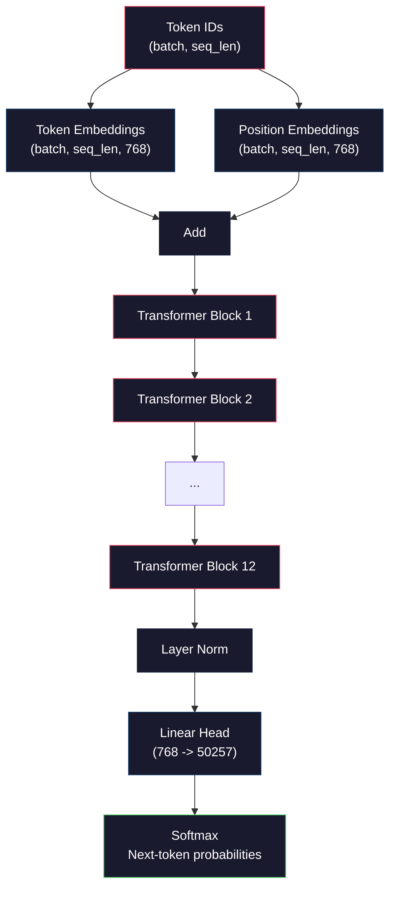
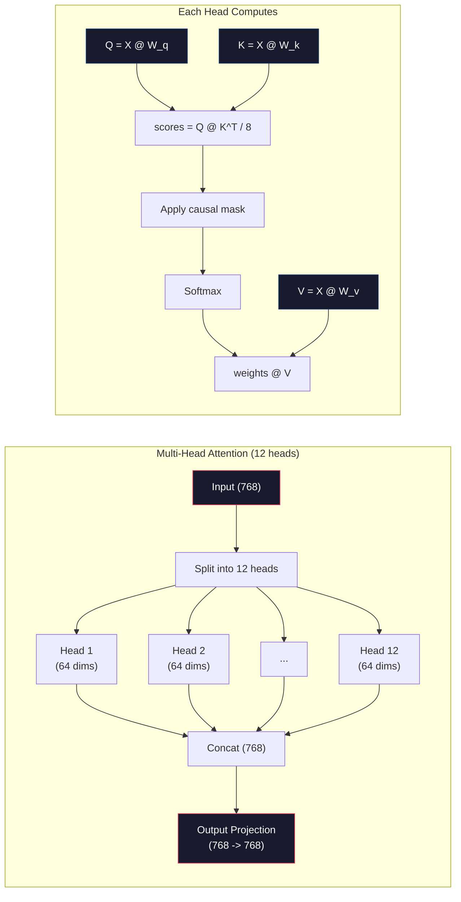
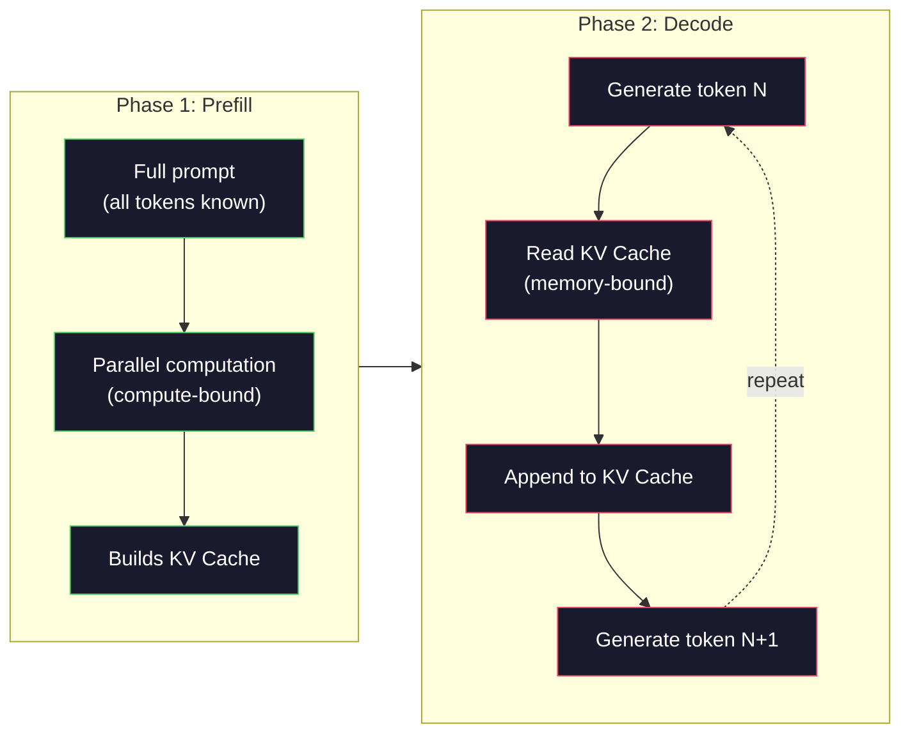

# 미니 GPT(124M 파라미터) 사전 학습

> GPT-2 Small은 124백만 개의 파라미터를 가집니다. 이는 12개의 트랜스포머 레이어, 12개의 어텐션 헤드, 768차원 임베딩으로 구성됩니다. 단일 GPU에서 몇 시간 내에 처음부터 학습할 수 있습니다. 하지만 대부분의 사람들은 이렇게 하지 않습니다. 그들은 사전 학습된 체크포인트를 사용합니다. 하지만 직접 학습하지 않으면, 제품을 구축하는 데 사용하는 모델 내부에서 실제로 어떤 일이 일어나는지 이해하지 못합니다.

**유형:** 실습
**언어:** Python (NumPy 사용)
**선수 지식:** 1단계, 레슨 01-03(토크나이저, 토크나이저 구축, 데이터 파이프라인)
**소요 시간:** ~120분

## 학습 목표

- 토큰 임베딩(token embeddings), 위치 임베딩(positional embeddings), 트랜스포머 블록(transformer blocks), 언어 모델 헤드(language model head)를 포함한 전체 GPT-2 아키텍처(124M 파라미터)를 처음부터 구현
- 교차 엔트로피 손실(cross-entropy loss)을 사용한 다음 토큰 예측(next-token prediction)으로 텍스트 코퍼스에서 GPT 모델 훈련
- 온도 샘플링(temperature sampling)과 상위-k/상위-p 필터링(top-k/top-p filtering)을 활용한 자기회귀적 텍스트 생성(autoregressive text generation) 구현
- 훈련 손실 곡선(training loss curves) 모니터링 및 모델이 일관된 언어 패턴(coherent language patterns)을 학습하는지 검증

## 문제 정의

당신은 트랜스포머가 무엇인지 알고 있습니다. 다이어그램도 읽어보았고, "attention is all you need"를 암송할 수 있으며 화이트보드에 "Multi-Head Attention"이라고 표시된 상자를 그릴 수도 있습니다.

하지만 그 어떤 것도 모델이 텍스트를 생성할 때 실제로 어떤 일이 일어나는지 이해한다는 것을 의미하지 않습니다.

GPT-2 Small(가중치 타이잉 적용)에는 124,438,272개의 파라미터가 있습니다. 이 모든 파라미터는 훈련 루프를 실행하여 설정되었습니다: 순전파, 손실 계산, 역전파, 가중치 업데이트. 12개의 트랜스포머 블록. 블록당 12개의 어텐션 헤드. 768차원 임베딩 공간. 50,257개 토큰의 어휘. 모델이 토큰을 생성할 때마다 1억 2,400만 개의 모든 파라미터가 단일 행렬 곱셈 체인에 참여하여 토큰 ID 시퀀스를 입력으로 받아 다음 토큰에 대한 확률 분포를 출력합니다.

만약 직접 구현해 본 적이 없다면, 당신은 블랙박스를 다루고 있는 것입니다. API를 사용할 수 있고 파인튜닝도 할 수 있습니다. 하지만 문제가 발생했을 때 — 모델이 환각을 일으키거나, 반복하거나, 지시를 따르지 않을 때 — *왜* 그런 현상이 발생하는지 이해할 수 있는 정신적 모델이 없습니다.

이 강의에서는 GPT-2 Small을 처음부터 구축합니다. PyTorch가 아닌 NumPy로 구현합니다. 모든 행렬 곱셈이 명확히 드러나며, 모든 그래디언트는 직접 작성한 코드로 계산됩니다. 1억 2,400만 개의 숫자가 어떻게 다음 단어를 예측하도록 공모하는지 정확히 확인할 수 있을 것입니다.

## 개념

### GPT 아키텍처

GPT는 자기회귀적 언어 모델입니다. "자기회귀적"이란 한 번에 하나의 토큰을 생성하며, 각 토큰은 이전 모든 토큰에 조건부로 의존한다는 의미입니다. 아키텍처는 트랜스포머 디코더 블록의 스택으로 구성됩니다.

토큰 ID에서 다음 토큰 확률까지의 전체 계산 그래프는 다음과 같습니다:

1. 토큰 ID 입력. 형태: (batch_size, seq_len).
2. 토큰 임베딩 조회. 각 ID는 768차원 벡터로 매핑됩니다. 형태: (batch_size, seq_len, 768).
3. 위치 임베딩 조회. 각 위치(0, 1, 2, ...)는 768차원 벡터로 매핑됩니다. 동일한 형태.
4. 토큰 임베딩 + 위치 임베딩 합산.
5. 12개의 트랜스포머 블록 통과.
6. 최종 레이어 정규화.
7. 어휘 크기로 선형 투영. 형태: (batch_size, seq_len, vocab_size).
8. 소프트맥스를 통해 확률 획득.

이것이 전체 모델입니다. 합성곱도, 순환도 없습니다. 임베딩, 어텐션, 피드포워드 네트워크, 레이어 정규화가 12번 쌓인 구조입니다.



### 트랜스포머 블록

12개의 블록은 동일한 패턴을 따릅니다. 사전 정규화 아키텍처(GPT-2는 사전 정규화를 사용하며, 원본 트랜스포머와 같은 사후 정규화가 아님):

1. 레이어 정규화
2. 멀티헤드 자기 어텐션
3. 잔차 연결(입력값 재결합)
4. 레이어 정규화
5. 피드포워드 네트워크(MLP)
6. 잔차 연결(입력값 재결합)

잔차 연결은 매우 중요합니다. 이들이 없으면 역전파 시 기울기가 블록 1에 도달할 때 소실됩니다. 잔차 연결이 있으면 기울기가 "스킵" 경로를 통해 손실에서 어떤 레이어로든 직접 흐를 수 있습니다. 이것이 12, 32, 심지어 96개의 블록(GPT-4는 120개로 추정)을 쌓을 수 있는 이유입니다.

### 어텐션: 핵심 메커니즘

자기 어텐션은 모든 토큰이 이전 모든 토큰을 보고 각각에 얼마나 주의를 기울일지 결정할 수 있게 합니다. 수학적 표현은 다음과 같습니다.

각 토큰 위치에서 입력으로부터 세 벡터를 계산합니다:
- **쿼리(Q)**: "무엇을 찾고 있는가?"
- **키(K)**: "무엇을 포함하고 있는가?"
- **값(V)**: "어떤 정보를 전달하는가?"

```
Q = input @ W_q    (768 -> 768)
K = input @ W_k    (768 -> 768)
V = input @ W_v    (768 -> 768)

attention_scores = Q @ K^T / sqrt(d_k)
attention_scores = mask(attention_scores)   # 인과적 마스킹: 미래 위치에 -inf 적용
attention_weights = softmax(attention_scores)
output = attention_weights @ V
```

인과적 마스킹이 GPT를 자기회귀적으로 만듭니다. 위치 5는 위치 0-5에만 어텐션할 수 있고, 6, 7, 8 등에는 어텐션할 수 없습니다. 이는 학습 중 모델이 미래 토큰을 "부정행위"로 보는 것을 방지합니다.

**멀티헤드 어텐션**은 768차원 공간을 64차원의 12개 헤드로 분할합니다. 각 헤드는 서로 다른 어텐션 패턴을 학습합니다. 한 헤드는 구문적 관계(주어-동사 일치)를 추적할 수 있고, 다른 헤드는 의미적 유사성(동의어)을 추적할 수 있으며, 또 다른 헤드는 위치적 근접성(인접 단어)을 추적할 수 있습니다. 12개 헤드의 출력은 연결(concatenate)된 후 다시 768차원으로 투영됩니다.



sqrt(d_k) = sqrt(64) = 8로 나누는 것은 스케일링입니다. 이 과정이 없으면 고차원 벡터에서 내적값이 커져 소프트맥스가 기울기가 거의 0인 영역으로 밀려납니다. 이는 원본 "Attention Is All You Need" 논문의 핵심 통찰 중 하나였습니다.

### KV 캐시: 추론이 빠른 이유

학습 시에는 전체 시퀀스를 한 번에 처리합니다. 추론 시에는 한 번에 하나의 토큰을 생성합니다. 최적화 없이는 토큰 N을 생성할 때 이전 N-1개 토큰에 대한 어텐션을 재계산해야 합니다. 이는 생성된 토큰당 O(N^2) 또는 길이 N의 시퀀스에 대해 총 O(N^3)의 복잡도를 가집니다.

KV 캐시는 이를 해결합니다. 각 토큰에 대한 K와 V를 계산한 후 저장합니다. 토큰 N+1을 생성할 때는 새 토큰에 대한 Q만 계산하고, 이전 모든 토큰의 캐시된 K와 V를 조회합니다. 이는 K와 V 계산에 대한 토큰당 비용을 O(N)에서 O(1)로 줄입니다. 어텐션 점수 계산은 여전히 O(N)이지만(모든 이전 위치에 어텐션하기 때문), 입력에 대한 중복 행렬 곱셈을 피할 수 있습니다.

12개 레이어와 12개 헤드를 가진 GPT-2의 경우, KV 캐시는 토큰당 2(K+V) × 12 레이어 × 12 헤드 × 64 차원 = 18,432개의 값을 저장합니다. 1024토큰 시퀀스의 경우 FP32에서 약 75MB입니다. 128개 레이어를 가진 Llama 3 405B의 경우 단일 시퀀스의 KV 캐시는 10GB를 초과할 수 있습니다. 이것이 긴 컨텍스트 추론이 메모리 바운드인 이유입니다.

### 프리필 vs 디코드: 추론의 두 단계

LLM에 프롬프트를 보내면 추론은 두 개의 명확한 단계로 발생합니다.

**프리필**은 전체 프롬프트를 병렬로 처리합니다. 모든 토큰이 알려져 있으므로 모델은 모든 위치에 대한 어텐션을 동시에 계산할 수 있습니다. 이 단계는 계산 바운드입니다. GPU가 전체 처리량으로 행렬 곱셈을 수행합니다. A100에서 1000토큰 프롬프트의 프리필은 대략 20-50ms가 소요됩니다.

**디코드**는 토큰을 한 번에 하나씩 생성합니다. 각 새 토큰은 이전 모든 토큰에 의존합니다. 이 단계는 메모리 바운드입니다. 병목 현상은 GPU 메모리에서 모델 가중치와 KV 캐시를 읽는 것이지, 행렬 수학 자체가 아닙니다. GPU의 계산 코어는 메모리 읽기를 기다리며 대부분 유휴 상태입니다. GPT-2의 경우, 각 디코드 단계는 행렬 곱셈에 필요한 FLOP 수와 관계없이 거의 동일한 시간이 소요됩니다. 메모리 대역폭이 제약 조건이기 때문입니다.

이 구분은 프로덕션 시스템에 중요합니다. 프리필 처리량은 GPU 계산(FLOPS가 많을수록 프리필이 빠름)에 비례합니다. 디코드 처리량은 메모리 대역폭(더 빠른 메모리가 디코드를 빠르게 함)에 비례합니다. 이것이 NVIDIA의 H100이 A100 대비 메모리 대역폭 개선에 집중한 이유입니다. 이는 토큰 생성 속도를 직접 향상시킵니다.



### 학습 루프

LLM 학습은 다음 토큰 예측입니다. 토큰 [0, 1, 2, ..., N-1]이 주어졌을 때, 토큰 [1, 2, 3, ..., N]을 예측합니다. 손실 함수는 모델의 예측 확률 분포와 실제 다음 토큰 간의 교차 엔트로피입니다.

한 학습 단계:

1. **순전파**: 배치를 12개 블록 모두에 통과시킵니다. 각 위치에 대한 로짓(소프트맥스 전 점수)을 얻습니다.
2. **손실 계산**: 로짓과 목표 토큰(입력에서 한 위치만큼 시프트된 것) 간의 교차 엔트로피.
3. **역전파**: 역전파를 사용하여 124M개 파라미터에 대한 기울기 계산.
4. **옵티마이저 단계**: 가중치 업데이트. GPT-2는 학습률 워밍업 및 코사인 감쇠를 사용하는 Adam을 사용합니다.

학습률 스케줄은 예상보다 더 중요합니다. GPT-2는 처음 2,000단계에서 0에서 최대 학습률로 워밍업한 후 코사인 곡선을 따라 감쇠합니다. 높은 학습률로 시작하면 모델이 발산합니다. 높은 학습률을 일정하게 유지하면 후반 학습 시 진동이 발생합니다. 워밍업 후 감쇠 패턴은 모든 주요 LLM에서 사용됩니다.

### GPT-2 Small: 수치

| 구성 요소 | 형태 | 파라미터 수 |
|-----------|-------|------------|
| 토큰 임베딩 | (50257, 768) | 38,597,376 |
| 위치 임베딩 | (1024, 768) | 786,432 |
| 블록당 어텐션 (W_q, W_k, W_v, W_out) | 4 x (768, 768) | 2,359,296 |
| 블록당 FFN (업 + 다운) | (768, 3072) + (3072, 768) | 4,718,592 |
| 블록당 레이어 정규화 (2x) | 2 x 768 x 2 | 3,072 |
| 최종 레이어 정규화 | 768 x 2 | 1,536 |
| **블록당 총계** | | **7,080,960** |
| **총계 (12개 블록)** | | **85,054,464 + 39,383,808 = 124,438,272** |

출력 투영(로짓 헤드)은 토큰 임베딩 행렬과 가중치를 공유합니다. 이를 가중치 타이잉(weight tying)이라고 하며, 파라미터 수를 38M 줄이고 입력과 출력에 동일한 표현 공간을 사용하도록 강제하여 성능을 향상시킵니다.

## 구축 방법

### 1단계: 임베딩 레이어

토큰 임베딩은 50,257개의 가능한 토큰 각각을 768차원 벡터로 매핑합니다. 위치 임베딩은 각 토큰이 시퀀스에서 어디에 위치하는지에 대한 정보를 추가합니다. 두 임베딩은 합산됩니다.

```python
import numpy as np

class Embedding:
    def __init__(self, vocab_size, embed_dim, max_seq_len):
        self.token_embed = np.random.randn(vocab_size, embed_dim) * 0.02
        self.pos_embed = np.random.randn(max_seq_len, embed_dim) * 0.02

    def forward(self, token_ids):
        seq_len = token_ids.shape[-1]
        tok_emb = self.token_embed[token_ids]
        pos_emb = self.pos_embed[:seq_len]
        return tok_emb + pos_emb
```

초기화를 위한 0.02 표준편차는 GPT-2 논문에서 유래되었습니다. 너무 크면 초기 순전파에서 극단적인 값이 생성되어 학습이 불안정해집니다. 너무 작으면 초기 출력이 모든 입력에 대해 거의 동일해져 초기 그래디언트 신호가 쓸모없어집니다.

### 2단계: 인과적 마스크가 있는 자기 어텐션

단일 헤드 어텐션부터 시작합니다. 인과적 마스크는 소프트맥스 전에 미래 위치를 음의 무한대로 설정하여 각 위치가 자신과 이전 위치만 참조하도록 합니다.

```python
def attention(Q, K, V, mask=None):
    d_k = Q.shape[-1]
    scores = Q @ K.transpose(0, -1, -2 if Q.ndim == 4 else 1) / np.sqrt(d_k)
    if mask is not None:
        scores = scores + mask
    weights = np.exp(scores - scores.max(axis=-1, keepdims=True))
    weights = weights / weights.sum(axis=-1, keepdims=True)
    return weights @ V
```

소프트맥스 구현은 지수 계산 전에 최댓값을 뺍니다. 이 과정이 없으면 `exp(큰_수)`가 무한대로 오버플로우됩니다. 이는 출력값을 변경하지 않는 수치적 안정성 트릭입니다. 왜냐하면 상수 `c`에 대해 `softmax(x - c) = softmax(x)`이기 때문입니다.

### 3단계: 멀티 헤드 어텐션

768차원 입력을 64차원의 12개 헤드로 분할합니다. 각 헤드는 독립적으로 어텐션을 계산합니다. 결과를 연결(concatenate)하고 다시 768차원으로 투영합니다.

```python
class MultiHeadAttention:
    def __init__(self, embed_dim, num_heads):
        self.num_heads = num_heads
        self.head_dim = embed_dim // num_heads
        self.W_q = np.random.randn(embed_dim, embed_dim) * 0.02
        self.W_k = np.random.randn(embed_dim, embed_dim) * 0.02
        self.W_v = np.random.randn(embed_dim, embed_dim) * 0.02
        self.W_out = np.random.randn(embed_dim, embed_dim) * 0.02

    def forward(self, x, mask=None):
        batch, seq_len, d = x.shape
        Q = (x @ self.W_q).reshape(batch, seq_len, self.num_heads, self.head_dim).transpose(0, 2, 1, 3)
        K = (x @ self.W_k).reshape(batch, seq_len, self.num_heads, self.head_dim).transpose(0, 2, 1, 3)
        V = (x @ self.W_v).reshape(batch, seq_len, self.num_heads, self.head_dim).transpose(0, 2, 1, 3)

        scores = Q @ K.transpose(0, 1, 3, 2) / np.sqrt(self.head_dim)
        if mask is not None:
            scores = scores + mask
        weights = np.exp(scores - scores.max(axis=-1, keepdims=True))
        weights = weights / weights.sum(axis=-1, keepdims=True)
        attn_out = weights @ V

        attn_out = attn_out.transpose(0, 2, 1, 3).reshape(batch, seq_len, d)
        return attn_out @ self.W_out
```

reshape-transpose-reshape 과정은 멀티 헤드 어텐션에서 가장 혼란스러운 부분입니다. (batch, seq_len, 768) 텐서는 (batch, seq_len, 12, 64)가 된 후 (batch, 12, seq_len, 64)가 됩니다. 이제 12개 헤드 각각이 어텐션을 실행할 (seq_len, 64) 행렬을 갖게 됩니다. 어텐션 후에는 과정을 반대로 수행합니다: (batch, 12, seq_len, 64) → (batch, seq_len, 12, 64) → (batch, seq_len, 768).

### 4단계: 트랜스포머 블록

완전한 트랜스포머 블록: LayerNorm, 잔차 연결이 있는 멀티 헤드 어텐션, LayerNorm, 잔차 연결이 있는 피드포워드 네트워크.

```python
class LayerNorm:
    def __init__(self, dim, eps=1e-5):
        self.gamma = np.ones(dim)
        self.beta = np.zeros(dim)
        self.eps = eps

    def forward(self, x):
        mean = x.mean(axis=-1, keepdims=True)
        var = x.var(axis=-1, keepdims=True)
        return self.gamma * (x - mean) / np.sqrt(var + self.eps) + self.beta


class FeedForward:
    def __init__(self, embed_dim, ff_dim):
        self.W1 = np.random.randn(embed_dim, ff_dim) * 0.02
        self.b1 = np.zeros(ff_dim)
        self.W2 = np.random.randn(ff_dim, embed_dim) * 0.02
        self.b2 = np.zeros(embed_dim)

    def forward(self, x):
        h = x @ self.W1 + self.b1
        h = np.maximum(0, h)  # GELU 근사: 단순화를 위해 ReLU 사용
        return h @ self.W2 + self.b2


class TransformerBlock:
    def __init__(self, embed_dim, num_heads, ff_dim):
        self.ln1 = LayerNorm(embed_dim)
        self.attn = MultiHeadAttention(embed_dim, num_heads)
        self.ln2 = LayerNorm(embed_dim)
        self.ffn = FeedForward(embed_dim, ff_dim)

    def forward(self, x, mask=None):
        x = x + self.attn.forward(self.ln1.forward(x), mask)
        x = x + self.ffn.forward(self.ln2.forward(x))
        return x
```

피드포워드 네트워크는 768차원 입력을 3,072차원(4배)으로 확장한 후 비선형성을 적용하고 다시 768차원으로 투영합니다. 이 확장-축소 패턴은 모델이 각 위치에서 더 "넓은" 내부 표현을 사용할 수 있게 합니다. GPT-2는 GELU 활성화 함수를 사용하지만, 여기서는 단순화를 위해 ReLU를 사용합니다. 아키텍처 이해에 있어 차이는 미미합니다.

### 5단계: 전체 GPT 모델

12개의 트랜스포머 블록을 쌓습니다. 앞쪽에 임베딩 레이어를 추가하고 뒤쪽에 출력 투영 레이어를 추가합니다.

```python
class MiniGPT:
    def __init__(self, vocab_size=50257, embed_dim=768, num_heads=12,
                 num_layers=12, max_seq_len=1024, ff_dim=3072):
        self.embedding = Embedding(vocab_size, embed_dim, max_seq_len)
        self.blocks = [
            TransformerBlock(embed_dim, num_heads, ff_dim)
            for _ in range(num_layers)
        ]
        self.ln_f = LayerNorm(embed_dim)
        self.vocab_size = vocab_size
        self.embed_dim = embed_dim

    def forward(self, token_ids):
        seq_len = token_ids.shape[-1]
        mask = np.triu(np.full((seq_len, seq_len), -1e9), k=1)

        x = self.embedding.forward(token_ids)
        for block in self.blocks:
            x = block.forward(x, mask)
        x = self.ln_f.forward(x)

        logits = x @ self.embedding.token_embed.T
        return logits

    def count_parameters(self):
        total = 0
        total += self.embedding.token_embed.size
        total += self.embedding.pos_embed.size
        for block in self.blocks:
            total += block.attn.W_q.size + block.attn.W_k.size
            total += block.attn.W_v.size + block.attn.W_out.size
            total += block.ffn.W1.size + block.ffn.b1.size
            total += block.ffn.W2.size + block.ffn.b2.size
            total += block.ln1.gamma.size + block.ln1.beta.size
            total += block.ln2.gamma.size + block.ln2.beta.size
        total += self.ln_f.gamma.size + self.ln_f.beta.size
        return total
```

가중치 공유에 주목하세요: `logits = x @ self.embedding.token_embed.T`. 출력 투영 레이어는 토큰 임베딩 행렬을 재사용(전치)합니다. 이는 단순히 매개변수를 절약하는 트릭이 아닙니다. 모델이 토큰을 이해(임베딩)하고 예측하는 출력에 동일한 벡터 공간을 사용한다는 의미입니다.

### 6단계: 학습 루프

124M 매개변수에 대한 실제 학습 실행에는 GPU와 PyTorch가 필요합니다. 이 학습 루프는 순수 NumPy로 실행되는 소규모 모델에서 메커니즘을 보여줍니다. 추적 가능성을 위해 소규모 모델(4층, 4헤드, 128차원)을 사용합니다.

```python
def cross_entropy_loss(logits, targets):
    batch, seq_len, vocab_size = logits.shape
    logits_flat = logits.reshape(-1, vocab_size)
    targets_flat = targets.reshape(-1)

    max_logits = logits_flat.max(axis=-1, keepdims=True)
    log_softmax = logits_flat - max_logits - np.log(
        np.exp(logits_flat - max_logits).sum(axis=-1, keepdims=True)
    )

    loss = -log_softmax[np.arange(len(targets_flat)), targets_flat].mean()
    return loss


def train_mini_gpt(text, vocab_size=256, embed_dim=128, num_heads=4,
                   num_layers=4, seq_len=64, num_steps=200, lr=3e-4):
    tokens = np.array(list(text.encode("utf-8")[:2048]))
    model = MiniGPT(
        vocab_size=vocab_size, embed_dim=embed_dim, num_heads=num_heads,
        num_layers=num_layers, max_seq_len=seq_len, ff_dim=embed_dim * 4
    )

    print(f"모델 매개변수: {model.count_parameters():,}")
    print(f"학습 토큰: {len(tokens):,}")
    print(f"설정: {num_layers}층, {num_heads}헤드, {embed_dim}차원")
    print()

    for step in range(num_steps):
        start_idx = np.random.randint(0, max(1, len(tokens) - seq_len - 1))
        batch_tokens = tokens[start_idx:start_idx + seq_len + 1]

        input_ids = batch_tokens[:-1].reshape(1, -1)
        target_ids = batch_tokens[1:].reshape(1, -1)

        logits = model.forward(input_ids)
        loss = cross_entropy_loss(logits, target_ids)

        if step % 20 == 0:
            print(f"단계 {step:4d} | 손실: {loss:.4f}")

    return model
```

손실은 `ln(vocab_size)` 근처에서 시작합니다. 256개 토큰의 바이트 수준 어휘에서는 `ln(256) = 5.55`입니다. 무작위 모델은 모든 토큰에 동일한 확률을 할당합니다. 학습이 진행됨에 따라 손실이 감소합니다. 모델이 "t" 다음에 "h", 마침표 다음에 공백과 같은 일반적인 패턴을 예측하기 때문입니다.

실제 운영에서는 Adam 옵티마이저, 그래디언트 누적, 학습률 워밍업, 그래디언트 클리핑을 사용합니다. 순전파-손실-역전파-업데이트 루프는 동일합니다. 옵티마이저는 더 정교합니다.

### 7단계: 텍스트 생성

생성은 학습된 모델을 사용하여 한 번에 하나의 토큰을 예측합니다. 각 예측은 출력 분포에서 샘플링되거나(또는 argmax로 탐욕적으로 선택됨) 됩니다.

```python
def generate(model, prompt_tokens, max_new_tokens=100, temperature=0.8):
    tokens = list(prompt_tokens)
    seq_len = model.embedding.pos_embed.shape[0]

    for _ in range(max_new_tokens):
        context = np.array(tokens[-seq_len:]).reshape(1, -1)
        logits = model.forward(context)
        next_logits = logits[0, -1, :]

        next_logits = next_logits / temperature
        probs = np.exp(next_logits - next_logits.max())
        probs = probs / probs.sum()

        next_token = np.random.choice(len(probs), p=probs)
        tokens.append(next_token)

    return tokens
```

온도는 무작위성을 제어합니다. 온도 1.0은 원시 분포를 사용합니다. 온도 0.5는 분포를 날카롭게(더 결정적) 만듭니다. 모델이 상위 선택을 더 자주 선택합니다. 온도 1.5는 분포를 평평하게(더 무작위) 만듭니다. 낮은 확률 토큰이 더 큰 기회를 얻습니다. 온도 0.0은 탐욕적 디코딩(항상 최고 확률 토큰 선택)입니다.

`tokens[-seq_len:]` 윈도우는 모델이 최대 컨텍스트 길이(GPT-2의 경우 1024)를 갖기 때문에 필요합니다. 이를 초과하면 가장 오래된 토큰을 삭제해야 합니다. 이것이 모두가 말하는 "컨텍스트 윈도우"입니다.

## 사용 방법

### 전체 학습 및 생성 데모

```python
corpus = """트랜스포머 아키텍처는 자연어 처리 분야를 혁신했습니다.
어텐션 메커니즘은 모델이 입력의 관련 부분에 집중할 수 있게 합니다.
셀프 어텐션은 시퀀스 내 모든 위치 쌍 간의 관계를 계산합니다.
멀티 헤드 어텐션은 표현을 여러 부분 공간으로 분할합니다.
각 어텐션 헤드는 서로 다른 유형의 관계를 학습할 수 있습니다.
피드포워드 네트워크는 각 위치에서 비선형 변환을 제공합니다.
잔차 연결은 깊은 네트워크를 통한 기울기 흐름을 가능하게 합니다.
레이어 정규화는 활성화 값을 정규화하여 학습을 안정화합니다.
위치 임베딩은 토큰 순서에 대한 정보를 모델에 제공합니다.
인과적 마스크는 학습 중 자기회귀적 생성을 보장합니다.
대규모 텍스트 코퍼스에 대한 사전 학습은 모델에게 일반적인 언어 이해를 가르칩니다.
파인튜닝은 사전 학습된 모델을 특정 다운스트림 작업에 적응시킵니다."""

model = train_mini_gpt(corpus, num_steps=200)

prompt = list("The transformer".encode("utf-8"))
output_tokens = generate(model, prompt, max_new_tokens=100, temperature=0.8)
generated_text = bytes(output_tokens).decode("utf-8", errors="replace")
print(f"\n생성된 텍스트: {generated_text}")
```

작은 코퍼스와 작은 모델에서는 생성된 텍스트가 기껏해야 반쯤 일관성 있을 것입니다. 훈련 텍스트에서 일부 바이트 수준 패턴을 학습하지만, 40GB의 훈련 데이터와 전체 124M 파라미터 아키텍처를 사용하는 GPT-2처럼 일반화할 수는 없습니다. 중요한 것은 출력 품질이 아닙니다. 중요한 것은 모든 단계(임베딩 조회, 어텐션 계산, 피드포워드 변환, 로짓 투영, 소프트맥스, 샘플링)를 추적할 수 있다는 점입니다. 모든 연산이 가시화되어 있습니다.

## Ship It

이 레슨은 `outputs/prompt-gpt-architecture-analyzer.md`를 생성합니다. 이 파일은 모든 GPT 스타일 모델의 아키텍처 선택을 분석하는 프롬프트입니다. 모델 카드나 기술 보고서를 입력하면 파라미터 할당, 어텐션(attention) 설계, 확장(scaling) 결정을 분석해 줍니다.

## 연습 문제

1. 모델을 수정하여 12/12 대신 24개의 레이어와 16개의 헤드를 사용하도록 합니다. 파라미터 수를 계산하세요. 깊이를 두 배로 늘리는 것이 너비(임베딩 차원)를 두 배로 늘리는 것과 어떻게 다른지 비교하세요.

2. GELU 활성화 함수(GELU(x) = x * 0.5 * (1 + erf(x / sqrt(2))))를 구현하고 피드포워드 네트워크의 ReLU를 대체합니다. 각 활성화 함수로 500단계 동안 학습을 실행하고 최종 손실을 비교하세요.

3. 생성 함수에 KV 캐시를 추가합니다. 첫 번째 순전파 이후 각 레이어의 K와 V 텐서를 저장하고, 이후 토큰에 대해 재사용합니다. 속도 향상 측정: 캐시 유무에 따라 200개의 토큰을 생성하고 벽시계 시간을 비교하세요.

4. Top-k 샘플링(가장 높은 확률을 가진 k개의 토큰만 고려)과 Top-p 샘플링(핵 샘플링: 누적 확률이 p를 초과하는 가장 작은 토큰 집합 고려)을 구현합니다. 온도 0.8에서 top-k=50과 top-p=0.95의 출력 품질을 비교하세요.

5. 훈련 손실 곡선 플로터를 구축합니다. 1000단계 동안 모델을 훈련하고 손실 대 단계 그래프를 그립니다. 세 단계를 식별하세요: 급격한 초기 하강(일반적인 바이트 학습), 느린 중간 단계(바이트 패턴 학습), 그리고 평탄화(소규모 코퍼스에 대한 과적합). 이 곡선의 형태는 128차원 모델을 훈련하든 GPT-4를 훈련하든 동일합니다.

## 핵심 용어

| 용어 | 사람들이 말하는 것 | 실제 의미 |
|------|----------------|----------------------|
| 자기회귀적(Autoregressive) | "한 번에 한 단어씩 생성한다" | 각 출력 토큰은 이전 모든 토큰에 조건부로 의존 -- 모델은 P(token_n \| token_0, ..., token_{n-1})를 예측 |
| 인과적 마스킹(Causal mask) | "미래를 볼 수 없다" | 훈련 중 미래 위치에 대한 어텐션을 방지하는 -무한대 값으로 구성된 상삼각 행렬 |
| 멀티헤드 어텐션(Multi-head attention) | "여러 어텐션 패턴" | Q, K, V를 병렬 헤드(예: GPT-2의 64차원 12개 헤드)로 분할하여 각 헤드가 서로 다른 관계 유형을 학습하도록 함 |
| KV 캐시(KV Cache) | "속도를 위한 캐싱" | 자기회귀적 생성 중 중복 계산을 피하기 위해 이전 토큰들의 계산된 Key 및 Value 텐서를 저장 |
| 프리필(Prefill) | "프롬프트 처리" | 모든 프롬프트 토큰이 병렬로 처리되는 첫 번째 추론 단계 -- GPU FLOPS에 계산 집약적 |
| 디코드(Decode) | "토큰 생성" | 토큰이 하나씩 생성되는 두 번째 추론 단계 -- GPU 대역폭에 메모리 집약적 |
| 가중치 타이잉(Weight tying) | "임베딩 공유" | 입력 토큰 임베딩과 출력 프로젝션 헤드에 동일한 행렬 사용 -- GPT-2에서 38M 파라미터 절약 |
| 잔차 연결(Residual connection) | "스킵 연결" | 하위층 입력(x)을 출력(x + sublayer(x))에 직접 추가 -- 심층 네트워크에서 그래디언트 흐름 가능 |
| 레이어 정규화(Layer normalization) | "활성화 함수 정규화" | 특징 차원을 기준으로 평균 0, 분산 1로 정규화하며 학습 가능한 스케일 및 편향 파라미터 사용 |
| 교차 엔트로피 손실(Cross-entropy loss) | "예측이 얼마나 틀렸는지" | 모든 위치에서 평균된 -log(정답 다음 토큰에 할당된 확률) -- 표준 LLM 훈련 목적 함수 |

## 추가 자료

- [Radford et al., 2019 -- "Language Models are Unsupervised Multitask Learners" (GPT-2)](https://cdn.openai.com/better-language-models/language_models_are_unsupervised_multitask_learners.pdf) -- 124M~1.5B 파라미터 패밀리를 소개한 GPT-2 논문
- [Vaswani et al., 2017 -- "Attention Is All You Need"](https://arxiv.org/abs/1706.03762) -- 스케일드 닷-프로덕트 어텐션(attention)과 멀티-헤드 어텐션(multi-head attention)을 포함한 원본 트랜스포머(transformer) 논문
- [Llama 3 Technical Report](https://arxiv.org/abs/2407.21783) -- 메타(Meta)가 16K GPU로 GPT 아키텍처를 405B 파라미터까지 확장한 방법
- [Pope et al., 2022 -- "Efficiently Scaling Transformer Inference"](https://arxiv.org/abs/2211.05102) -- 프리필(prefill) vs 디코드(decode) 및 KV 캐시(cache) 분석을 체계화한 논문