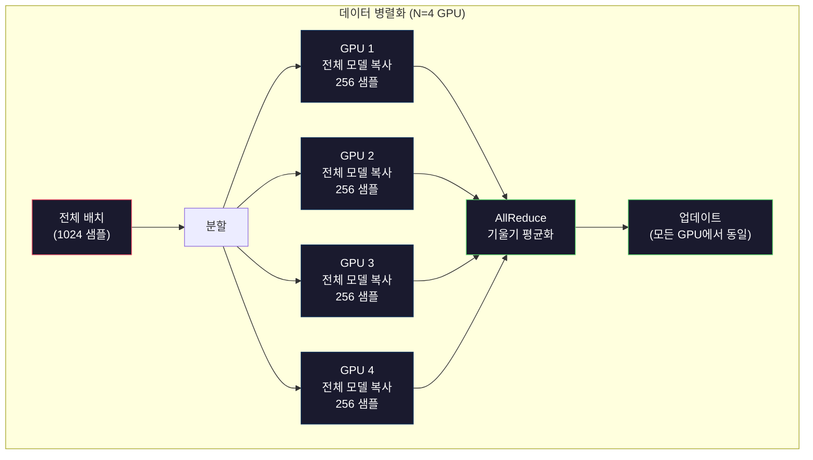
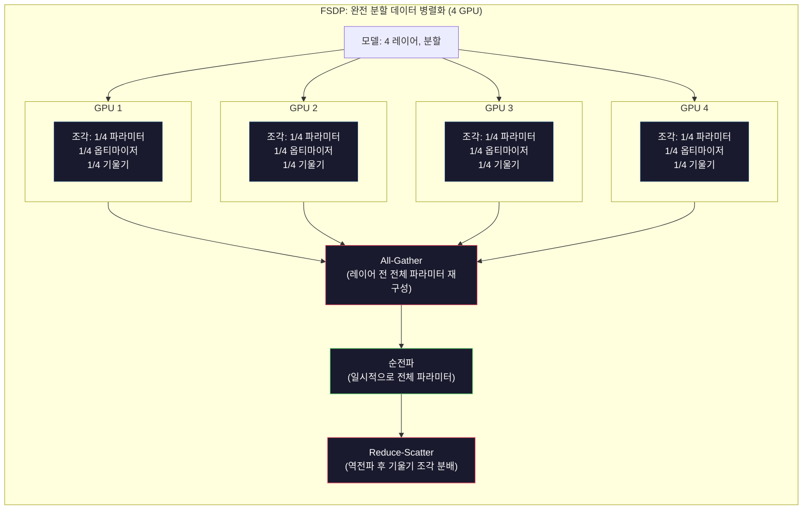
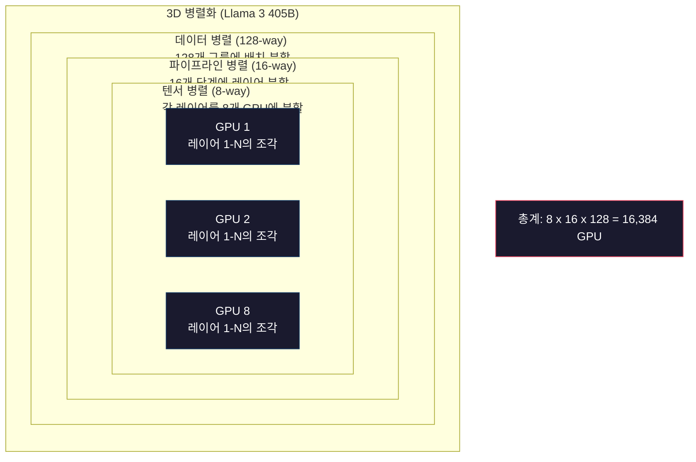

# 확장: 분산 훈련, FSDP, DeepSpeed

> 단일 GPU에서 훈련한 124M 모델. 이제 70억 개의 파라미터를 시도해 보세요. 모델이 메모리에 맞지 않습니다. 단일 머신에서 데이터를 처리하는 데 몇 주가 걸립니다. 대규모에서는 분산 훈련이 선택 사항이 아닙니다. 유일한 전진 방법입니다.

**유형:** 구축
**언어:** Python
**사전 요구 사항:** 10단계, 04강 (미니 GPT 사전 훈련)
**소요 시간:** ~120분

## 학습 목표

- 데이터 병렬화(data parallelism), 텐서 병렬화(tensor parallelism), 파이프라인 병렬화(pipeline parallelism) 3가지 유형의 병렬화 방식을 설명하고, 모델 및 클러스터 크기에 따라 각 방식이 필요한 경우를 구분
- PyTorch DDP(DistributedDataParallel)를 사용하여 다중 GPU 간 그래디언트 동기화(gradient synchronization)를 수행하는 데이터 병렬 학습(data-parallel training) 구현
- 주어진 모델 크기(가중치(weights) + 옵티마이저 상태(optimizer states) + 그래디언트(gradients) + 활성화(activations))에 대한 메모리 예산(memory budget)을 계산하여 최소 하드웨어 요구사항 결정
- FSDP(Fully Sharded Data Parallel) 또는 DeepSpeed ZeRO(Zero Redundancy Optimizer) 스테이지를 구성하여 GPU 간 모델 상태(model states)를 분할(sharding)하고 단일 GPU 메모리를 초과하는 모델 학습 설정

## 문제

FP16의 7B 파라미터 모델은 가중치만 14GB를 차지합니다. Adam 옵티마이저는 모든 파라미터의 두 가지 추가 복사본(1차 및 2차 모멘트 추정치)을 저장하므로 28GB가 더 필요합니다. 역전파 중 그래디언트는 14GB를 추가로 사용합니다. 단일 활성화(activation)를 저장하기 전에 이미 56GB를 사용한 상태입니다.

NVIDIA A100은 80GB 메모리를 가지고 있습니다.

80GB 중 56GB가 사용되었으므로, 활성화를 위해 24GB가 남습니다. 활성화는 역전파를 위해 유지되어야 하는 순전파 중 계산된 중간 값입니다. 4096차원 모델에서 2048토큰 시퀀스의 경우 단일 레이어의 활성화는 약 64MB를 사용합니다. 32개 레이어에서는 샘플당 2GB가 필요하며, 배치 크기 8은 16GB를 요구합니다. 사용 가능한 메모리는 24GB이므로 배치 크기 12는 메모리 초과를 일으킵니다.

이제 70B 파라미터를 고려해 보겠습니다. FP16 가중치만 140GB가 필요합니다. 이는 단일 GPU에 맞지 않습니다. 가중치를 저장하기 위해 최소 2개의 A100(2 x 80GB = 160GB)이 필요합니다. 옵티마이저 상태와 그래디언트를 추가하면 더 많은 메모리가 필요합니다: 최소 3개, 실제로는 샤딩 전략에 따라 8-16개의 GPU가 필요합니다.

Llama 3 405B는 16,384개의 NVIDIA H100 GPU에서 훈련되었으며, 훈련 비용은 약 1억 달러로 추정됩니다. DeepSeek V3는 아키텍처(전문가 혼합(Mixture of Experts)은 토큰당 활성화되는 파라미터가 일부임만 해당)와 훈련 효율성을 개선하여 유사한 모델을 약 560만 달러로 훈련했습니다.

이 강의에서는 대규모 훈련을 가능하게 하는 네 가지 전략(데이터 병렬화, 텐서 병렬화, 파이프라인 병렬화, 완전 샤딩 데이터 병렬화)을 다룹니다. 분산 훈련 프레임워크를 사용하기 전에 순수 Python으로 각 전략을 시뮬레이션하여 메커니즘을 이해할 것입니다.

## 개념

### 분포가 필요한 이유

실제 모델의 메모리 계산입니다. 모든 숫자는 추정치가 아닌 실제 계산값입니다.

| 모델 | 파라미터 | 가중치 (FP16) | Adam 상태 | 기울기 (FP16) | 총계 (활성화 제외) |
|-------|--------|----------------|-------------|------------------|----------------------|
| GPT-2 Small | 124M | 248 MB | 992 MB | 248 MB | 1.5 GB |
| Llama 3 8B | 8B | 16 GB | 64 GB | 16 GB | 96 GB |
| Llama 3 70B | 70B | 140 GB | 560 GB | 140 GB | 840 GB |
| Llama 3 405B | 405B | 810 GB | 3,240 GB | 810 GB | 4,860 GB |

"Adam 상태" 열이 가장 큰 문제입니다. Adam은 모든 파라미터에 대해 FP32 형식의 이동 평균(m)과 이동 분산(v)을 저장합니다. 70B 모델의 경우 70B × 4바이트 × 2 = 560GB가 필요합니다. 옵티마이저만으로도 A100 7개가 필요합니다.

단일 H100은 80GB를 가집니다. Llama 3 405B는 가중치, 옵티마이저, 기울기를 저장하기 위해 최소 61개의 H100이 필요합니다. 활성화를 추가하면 필요한 GPU 수는 더 늘어납니다. Meta는 16,384개의 GPU를 사용한 것이 아니라 사용해야만 했습니다.

### 데이터 병렬화

가장 간단한 분산 전략입니다. 전체 모델을 N개의 GPU에 복사합니다. 각 훈련 배치를 N개의 동일한 부분으로 분할합니다. 각 GPU는 데이터 조각에 대해 순전파와 역전파를 실행합니다. 역전파 후 모든 GPU에서 기울기를 평균화합니다. 모든 GPU는 동일한 평균화된 기울기로 가중치 복사본을 업데이트하여 모든 복사본을 동기화합니다.

**장점:** 선형 처리량 확장. N개의 GPU는 단계당 N배 더 많은 데이터를 처리합니다. 통신은 기울기 평균화로 제한되며 계산과 겹칩니다.

**단점:** 모든 GPU는 모델, 옵티마이저 상태, 기울기의 완전한 복사본을 보유합니다. 70B 모델의 경우 각 GPU에 840GB가 필요합니다. 데이터 병렬화는 GPU당 메모리를 줄이지 않습니다. 훈련 시간만 줄입니다.

**수학:** 유효 배치 크기 = per_gpu_batch_size × N. N=64 GPU와 per-GPU 배치 16의 경우 유효 배치는 1,024입니다. Llama 3은 단계당 1,600만 토큰의 유효 배치 크기를 사용했습니다.



### 텐서 병렬화

개별 레이어를 GPU 간에 분할합니다. 단일 행렬 곱셈은 GPU 간에 분할되어 각 GPU가 결과의 일부를 계산합니다.

피드포워드 레이어에서 (8192, 8192) 형태의 가중치 행렬을 고려합니다. 4-way 텐서 병렬화를 사용하면 각 GPU는 (8192, 2048) 조각을 보유합니다. 각 GPU는 입력에 조각을 곱하여 부분 결과를 생성합니다. 부분 결과는 (all-reduce 또는 all-gather를 통해) 결합되어 전체 출력을 생성합니다.

**장점:** 모델 가중치에 대한 GPU당 메모리 감소. 8개의 GPU에 분할된 70B 모델의 경우 각 GPU는 약 8.75B 파라미터 분량의 가중치를 보유합니다.

**단점:** 모든 레이어 후에 빠른 GPU 간 통신이 필요합니다. 행렬 곱셈 후 all-reduce는 지연을 추가합니다. 이는 NVLink(동일 노드 내 GPU 간 900GB/s)에서는 잘 작동하지만 InfiniBand(400Gb/s, 약 50GB/s)로 연결된 노드 간에는 성능이 떨어집니다. 텐서 병렬화는 거의 항상 단일 노드(8개 GPU) 내로 제한됩니다.

**실제 사용 사례:** Megatron-LM이 텐서 병렬화를 개척했습니다. Llama 3 405B는 각 노드 내에서 8-way 텐서 병렬화를 사용합니다.

### 파이프라인 병렬화

레이어별로 모델을 분할합니다. GPU 1은 레이어 1-8을 실행합니다. GPU 2는 레이어 9-16을 실행합니다. GPU 3은 레이어 17-24를 실행합니다. GPU 4는 레이어 25-32를 실행합니다. 데이터는 파이프라인을 통해 흐릅니다: GPU 1이 레이어를 계산하고 활성화를 GPU 2로 전송하면 GPU 2가 레이어를 계산하고 GPU 3으로 전송하는 식입니다.

**장점:** GPU 간 최소 통신 -- 레이어 경계에서의 활성화만 전송되며, 이는 기울기나 가중치에 비해 작습니다. 대역폭 요구 사항이 낮아 노드 간에도 작동합니다.

**단점:** 파이프라인 버블. GPU 4가 마이크로 배치 1의 순전파를 계산하는 동안 GPU 1, 2, 3은 유휴 상태(이미 해당 부분을 순전파 완료)입니다. 역전파 중에는 패턴이 반전됩니다. 순진한 파이프라인에서는 N개의 파이프라인 단계에 대해 GPU 사용률이 1/N에 불과합니다.

**GPipe와 PipeDream**은 배치를 마이크로 배치로 분할하여 버블 문제를 해결합니다. GPU 1은 마이크로 배치 1의 순전파를 완료하면 즉시 마이크로 배치 2를 시작합니다. 이는 파이프라인 단계 간 계산을 겹치게 합니다. M개의 마이크로 배치와 N개의 단계가 있을 때 버블 비율은 (N-1)/M로 감소합니다. N=4 단계에 M=16 마이크로 배치를 사용하면 버블은 3/16 = 18.75% 유휴 시간입니다.

### FSDP: 완전 분할 데이터 병렬화

FSDP는 데이터 병렬화의 확장성과 분할의 메모리 효율성을 결합합니다. 각 GPU가 모델의 완전한 복사본을 보유하는 대신, 각 GPU는 파라미터, 기울기, 옵티마이저 상태의 1/N만 보유합니다.

레이어의 순전파 전에 FSDP는 모든 GPU에서 전체 파라미터를 수집하기 위해 **all-gather**를 실행합니다. 순전파 후 각 GPU는 비지역 파라미터를 폐기합니다. 역전파 중에는 기울기 계산을 위해 파라미터를 재구성하기 위해 다시 all-gather가 실행됩니다. 역전파 후에는 **reduce-scatter**가 기울기 조각을 분배하여 각 GPU가 기울기의 1/N만 저장합니다.

**70B 모델을 8개 GPU에서 사용하는 경우 수학:**

| 구성 요소 | FSDP 미사용 | FSDP 사용 |
|-----------|-------------|-----------|
| 가중치 (FP16) | GPU당 140 GB | GPU당 17.5 GB |
| Adam 상태 (FP32) | GPU당 560 GB | GPU당 70 GB |
| 기울기 (FP16) | GPU당 140 GB | GPU당 17.5 GB |
| **총계** | **GPU당 840 GB** | **GPU당 105 GB** |

FSDP 없이는 80GB GPU에 70B 모델을 탑재할 수 없습니다. 8개 GPU에서 FSDP를 사용하면 각 GPU는 105GB를 사용합니다. 여전히 탑재할 수 없으므로 최소 16개 GPU가 필요하거나, 활성화 체크포인팅(활성화 저장 대신 역전파 중 재계산)과 FSDP를 결합해야 합니다.

통신 비용은 각 레이어 전의 all-gather로 인해 일반 데이터 병렬화보다 높습니다. 그러나 메모리 절약으로 이전에는 불가능했던 훈련 실행이 가능해집니다.



### DeepSpeed ZeRO

DeepSpeed의 ZeRO(Zero Redundancy Optimizer)는 FSDP와 개념적으로 동일하지만 Microsoft에서 독립적으로 개발했습니다. 세 가지 단계를 정의하며, 각 단계는 더 공격적으로 분할합니다:

| 단계 | 분할 대상 | 메모리 절감 | 통신 |
|-------|--------|---------------|---------------|
| ZeRO-1 | 옵티마이저 상태만 | ~4배 감소 | 데이터 병렬과 동일 |
| ZeRO-2 | + 기울기 | ~8배 감소 | 약간 더 많음 |
| ZeRO-3 | + 파라미터 | ~N배 감소 (N GPU) | 레이어당 all-gather |

ZeRO-3은 FSDP와 동일합니다. 이름은 다르지만 메커니즘은 같습니다. PyTorch는 DeepSpeed가 개념을 증명한 후 FSDP를 네이티브 구현으로 추가했습니다.

DeepSpeed는 또한 ZeRO-Offload(옵티마이저 상태를 CPU RAM으로 오프로드, 더 저렴하고 용량이 큼)와 ZeRO-Infinity(옵티마이저 상태를 NVMe SSD로 오프로드)를 도입했습니다. 이들은 계산 속도를 희생하여 메모리 용량을 확보합니다. 오프로드된 작업은 느리지만 GPU 메모리를 확보합니다.

### 혼합 정밀도 훈련

현대 훈련은 여러 부동소수점 형식을 동시에 사용합니다:

- **순전파:** FP16 또는 BF16(16비트). FP32의 절반 메모리. 텐서 코어에서 행렬 곱셈이 2배 빠릅니다.
- **마스터 가중치:** FP32(32비트). 옵티마이저가 가중치 업데이트 중 수치 정밀도를 유지하기 위해 유지합니다.
- **손실 스케일링:** 역전파 전에 손실을 큰 상수로 곱하여 FP16 기울기가 0으로 언더플로우되는 것을 방지합니다. 옵티마이저 단계 전에 동일한 상수로 나눕니다.

BF16(Brain Float 16)은 FP32와 동일한 지수 범위(8비트 지수)를 가지지만 정밀도가 낮습니다(7비트 가수 vs FP32의 23비트). 동일한 범위의 값을 표현할 수 있어 손실 스케일링이 거의 필요하지 않습니다. FP16은 5비트 지수와 10비트 가수를 가집니다. 세밀한 값을 표현할 수 있지만 극단적인 크기에서 오버플로우/언더플로우가 발생합니다.

Google의 TPU는 BF16을 네이티브로 지원합니다. NVIDIA의 A100과 H100은 FP16과 BF16을 모두 지원합니다. 업계는 손실 스케일링 문제를 제거하기 위해 대부분 BF16으로 이동했습니다.

**7B 모델의 메모리 비교:**

| 정밀도 | 가중치 | 옵티마이저 | 기울기 | 총계 |
|-----------|---------|-----------|-----------|-------|
| FP32 전체 | 28 GB | 56 GB | 28 GB | 112 GB |
| 혼합 (BF16 + FP32 마스터) | 14 GB | 56 GB | 14 GB | 84 GB |

혼합 정밀도는 이 모델에서 28GB를 절약합니다. 옵티마이저 상태는 FP32로 유지됩니다. 대부분의 메모리가 여기에 사용됩니다.

### Megatron-LM과 3D 병렬화

실제 대규모 훈련은 세 가지 병렬화를 결합합니다:

- **데이터 병렬화:** 노드 그룹 간 (배치 크기 확장)
- **텐서 병렬화:** 노드 내 (8개 GPU에 레이어 분할)
- **파이프라인 병렬화:** 노드 간 (머신 간 레이어 그룹 분할)

16,384개의 H100에서 Llama 3 405B:
- 각 노드 내 8-way 텐서 병렬화 (노드당 8개 GPU)
- 노드 간 16-way 파이프라인 병렬화 (16개 파이프라인 단계)
- 나머지 차원에 128-way 데이터 병렬화 (16,384 / 8 / 16 = 128)

이 3D 분해(8 x 16 x 128 = 16,384)는 수천 개의 GPU로 확장하는 방법입니다. 각 GPU는 다른 데이터 조각(데이터 병렬), 각 레이어의 조각(텐서 병렬), 다른 레이어 집합(파이프라인 병렬)을 처리합니다.

DeepSeek V3는 다른 접근법을 사용했습니다. 그들의 Mixture of Experts 아키텍처는 토큰당 671B 파라미터 중 37B만 활성화합니다. 이는 각 GPU가 활성 파라미터만 계산(및 활성화 저장)해야 함을 의미합니다. 그들은 2,048개의 H800 GPU에서 훈련했으며, Meta의 GPU 수(16,384)의 1/8 미만입니다. 비용은 $5.6M로 Meta의 추정치 $100M보다 훨씬 저렴했습니다.



## 구축 방법

### 1단계: 데이터 병렬 시뮬레이션

배치 데이터를 시뮬레이션된 GPU에 분할합니다. 각 GPU는 자신의 샤드에 대해 순전파를 계산하고, "기울기"(손실 값으로 시뮬레이션)를 평균화합니다.

```python
import numpy as np

def simulate_data_parallelism(data, num_gpus, model_fn):
    batch_size = len(data)
    shard_size = batch_size // num_gpus
    remainder = batch_size % num_gpus

    gpu_losses = []
    gpu_gradients = []

    offset = 0
    for gpu_id in range(num_gpus):
        extra = 1 if gpu_id < remainder else 0
        shard = data[offset:offset + shard_size + extra]
        offset += shard_size + extra

        loss, grad = model_fn(shard)
        gpu_losses.append(loss)
        gpu_gradients.append(grad)

    avg_loss = np.mean(gpu_losses)
    avg_gradient = np.mean(gpu_gradients, axis=0)

    return avg_loss, avg_gradient
```

데이터 병렬화에서 all-reduce 연산(기울기 평균화)은 유일한 통신입니다. 실제 구현에서는 NVIDIA GPU의 NCCL 라이브러리를 사용하며, 링 all-reduce를 구현합니다: 각 GPU는 기울기의 1/N을 이웃에게 보내고, 다른 이웃으로부터 1/N을 받으며, N-1단계 후 모든 GPU가 완전한 평균을 갖게 됩니다. 총 통신량: 2 x 기울기_크기 x (N-1)/N, 큰 N에 대해 기울기 크기의 2배에 근접합니다.

### 2단계: 텐서 병렬 시뮬레이션

가중치 행렬을 GPU에 분할합니다. 각 GPU는 부분 행렬 곱셈을 계산하고, 결과를 결합합니다.

```python
def simulate_tensor_parallelism(input_data, weight_matrix, num_gpus):
    d_in, d_out = weight_matrix.shape
    assert d_out % num_gpus == 0, f"d_out {d_out} not divisible by num_gpus {num_gpus}"
    shard_size = d_out // num_gpus

    partial_results = []
    for gpu_id in range(num_gpus):
        start = gpu_id * shard_size
        end = start + shard_size
        weight_shard = weight_matrix[:, start:end]

        partial = input_data @ weight_shard
        partial_results.append(partial)

    full_output = np.concatenate(partial_results, axis=-1)

    direct_output = input_data @ weight_matrix
    error = np.abs(full_output - direct_output).max()

    return full_output, error
```

오차는 정확히 0(또는 기계 엡실론)이어야 합니다. 텐서 병렬화는 수학적으로 정확하며, 하나의 GPU에서 전체 행렬 곱셈을 계산하는 것과 동일한 결과를 생성합니다. 분할은 출력 차원을 기준으로 하므로, 각 GPU는 서로 다른 열 청크를 생성하고, 연결(concatenation)을 통해 전체 결과를 재구성합니다.

출력 차원을 분할하는 열-병렬 선형 계층의 경우 연결(concatenation)을 사용합니다. 입력 차원을 분할하는 행-병렬의 경우 합산(summation)을 사용합니다. 트랜스포머 FFN에서 첫 번째 선형(확장) 계층은 열-병렬을, 두 번째 선형(수축) 계층은 행-병렬을 사용합니다. 이는 두 계층 사이에 all-reduce를 피할 수 있게 합니다.

### 3단계: 파이프라인 병렬 시뮬레이션

모델의 계층을 가상 GPU에 분할합니다. 초기 단계가 대기하는 동안 후기 단계가 계산하는 버블 문제를 보여줍니다.

```python
def simulate_pipeline_parallelism(num_layers, num_stages, num_microbatches):
    layers_per_stage = num_layers // num_stages

    timeline = {}
    clock = 0

    for mb in range(num_microbatches):
        for stage in range(num_stages):
            start_time = max(
                timeline.get((stage, mb - 1, "fwd"), (0, 0))[1] if mb > 0 else 0,
                timeline.get((stage - 1, mb, "fwd"), (0, 0))[1] if stage > 0 else 0,
            )
            end_time = start_time + layers_per_stage
            timeline[(stage, mb, "fwd")] = (start_time, end_time)

    last_fwd_end = max(v[1] for v in timeline.values())

    for mb in range(num_microbatches - 1, -1, -1):
        for stage in range(num_stages - 1, -1, -1):
            deps = [last_fwd_end]
            if mb < num_microbatches - 1 and (stage, mb + 1, "bwd") in timeline:
                deps.append(timeline[(stage, mb + 1, "bwd")][1])
            if stage < num_stages - 1 and (stage + 1, mb, "bwd") in timeline:
                deps.append(timeline[(stage + 1, mb, "bwd")][1])
            start_time = max(deps)
            end_time = start_time + layers_per_stage
            timeline[(stage, mb, "bwd")] = (start_time, end_time)

    total_time = max(v[1] for v in timeline.values())
    compute_time = num_microbatches * num_stages * layers_per_stage * 2
    bubble_fraction = 1.0 - compute_time / (total_time * num_stages)

    return timeline, total_time, bubble_fraction
```

4단계(stage)와 1마이크로배치(microbatch)에서 버블 비율은 75%입니다. 즉, 4개 GPU 중 3개가 대기합니다. 16마이크로배치에서는 약 19%로 감소합니다. 버블을 제거하는 비용은 메모리입니다: 모든 진행 중인 마이크로배치의 활성화(activation)를 동시에 저장해야 합니다.

### 4단계: 메모리 계산기

임의의 모델 크기에 대한 정확한 메모리 요구 사항을 계산합니다.

```python
def memory_calculator(
    params_billions,
    precision_bytes=2,
    optimizer="adam",
    num_gpus=1,
    sharding="none",
    sequence_length=2048,
    batch_size_per_gpu=1,
    hidden_dim=None,
    num_layers=None,
):
    params = params_billions * 1e9

    weight_memory = params * precision_bytes

    if optimizer == "adam":
        optimizer_memory = params * 4 * 2
    elif optimizer == "sgd":
        optimizer_memory = params * 4
    else:
        optimizer_memory = 0

    gradient_memory = params * precision_bytes

    total_no_activation = weight_memory + optimizer_memory + gradient_memory

    if hidden_dim and num_layers:
        activation_per_layer = (
            sequence_length * batch_size_per_gpu * hidden_dim * precision_bytes * 4
        )
        activation_memory = activation_per_layer * num_layers
    else:
        activation_memory = params * precision_bytes * 0.5

    if sharding == "fsdp" or sharding == "zero3":
        weight_memory /= num_gpus
        optimizer_memory /= num_gpus
        gradient_memory /= num_gpus
    elif sharding == "zero2":
        optimizer_memory /= num_gpus
        gradient_memory /= num_gpus
    elif sharding == "zero1":
        optimizer_memory /= num_gpus

    per_gpu_total = weight_memory + optimizer_memory + gradient_memory + activation_memory

    return {
        "params_billions": params_billions,
        "weights_gb": weight_memory / 1e9,
        "optimizer_gb": optimizer_memory / 1e9,
        "gradients_gb": gradient_memory / 1e9,
        "activations_gb": activation_memory / 1e9,
        "per_gpu_total_gb": per_gpu_total / 1e9,
        "total_across_gpus_gb": per_gpu_total * num_gpus / 1e9,
        "fits_on_80gb": per_gpu_total / 1e9 <= 80,
        "num_gpus": num_gpus,
        "sharding": sharding,
    }
```

이 계산기는 모든 ML 엔지니어가 묻는 질문에 답합니다: "GPU가 몇 대 필요한가요?" 모델 크기를 입력하면 적합한지 확인할 수 있습니다. GPU당 총 메모리가 80GB 이하로 떨어질 때까지 분할 전략을 조정하세요.

### 5단계: 혼합 정밀도 시뮬레이션

FP32, FP16, 혼합 정밀도 훈련 간의 메모리 사용량을 비교합니다.

```python
def mixed_precision_comparison(params_billions):
    params = params_billions * 1e9

    fp32_weights = params * 4
    fp32_optimizer = params * 4 * 2
    fp32_gradients = params * 4
    fp32_total = fp32_weights + fp32_optimizer + fp32_gradients

    fp16_weights = params * 2
    fp16_master = params * 4
    fp16_optimizer = params * 4 * 2
    fp16_gradients = params * 2
    fp16_total = fp16_weights + fp16_master + fp16_optimizer + fp16_gradients

    mixed_weights = params * 2
    mixed_optimizer = params * 4 * 2
    mixed_gradients = params * 2
    mixed_total = mixed_weights + mixed_optimizer + mixed_gradients

    return {
        "fp32_total_gb": fp32_total / 1e9,
        "fp16_with_master_gb": fp16_total / 1e9,
        "mixed_bf16_gb": mixed_total / 1e9,
        "savings_vs_fp32": 1 - mixed_total / fp32_total,
    }
```

대부분의 사람들이 가장 놀라는 점: 혼합 정밀도는 메모리를 절반으로 줄이지 않습니다. 옵티마이저 상태(Adam의 m과 v)는 정밀도와 관계없이 FP32로 유지됩니다. 7B 모델의 경우 FP32 훈련은 112GB를 사용합니다. 혼합 정밀도는 84GB를 사용합니다. 이는 50%가 아닌 25% 감소입니다. 옵티마이저가 메모리 사용량을 지배합니다.

## 사용 방법

### 모든 시뮬레이션 실행

```python
def run_all_demos():
    print("=" * 70)
    print("데이터 병렬 시뮬레이션")
    print("=" * 70)

    np.random.seed(42)
    data = np.random.randn(64, 32)
    weight = np.random.randn(32, 16)

    def model_fn(batch):
        output = batch @ weight
        loss = np.mean(output ** 2)
        grad = 2 * batch.T @ (batch @ weight) / len(batch)
        return loss, grad

    for n_gpus in [1, 2, 4, 8]:
        loss, grad = simulate_data_parallelism(data, n_gpus, model_fn)
        print(f"  {n_gpus} GPU: 손실={loss:.4f}, 그래디언트_노름={np.linalg.norm(grad):.4f}")

    print()
    print("=" * 70)
    print("텐서 병렬 시뮬레이션")
    print("=" * 70)

    x = np.random.randn(4, 8192)
    W = np.random.randn(8192, 8192)

    for n_gpus in [1, 2, 4, 8]:
        output, error = simulate_tensor_parallelism(x, W, n_gpus)
        print(f"  {n_gpus} GPU: 출력_형태={output.shape}, 최대_오차={error:.2e}")

    print()
    print("=" * 70)
    print("파이프라인 병렬 시뮬레이션")
    print("=" * 70)

    for n_mb in [1, 4, 8, 16, 32]:
        _, total_t, bubble = simulate_pipeline_parallelism(32, 4, n_mb)
        print(f"  {n_mb:2d} 마이크로-배치: 총_시간={total_t:4d}, 버블={bubble:.1%}")

    print()
    print("=" * 70)
    print("메모리 계산기")
    print("=" * 70)

    configs = [
        (7, "none", 1),
        (70, "fsdp", 8),
        (70, "none", 1),
        (70, "fsdp", 8),
        (70, "fsdp", 16),
        (405, "fsdp", 64),
        (405, "fsdp", 128),
    ]

    print(f"  {'모델':>8} {'샤딩':>8} {'GPU':>5} {'GPU당':>10} {'80GB 적합':>10}")
    print("  " + "-" * 50)
    for params, shard, gpus in configs:
        result = memory_calculator(params, num_gpus=gpus, sharding=shard)
        fits = "Yes" if result["fits_on_80gb"] else "No"
        print(f"  {params:>6}B {shard:>8} {gpus:>5} {result['per_gpu_total_gb']:>8.1f}GB {fits:>10}")

    print()
    print("=" * 70)
    print("혼합 정밀도 비교")
    print("=" * 70)

    for params_b in [7, 13, 70, 405]:
        result = mixed_precision_comparison(params_b)
        print(f"  {params_b}B: FP32={result['fp32_total_gb']:.0f}GB, "
              f"혼합 BF16={result['mixed_bf16_gb']:.0f}GB, "
              f"절감율={result['savings_vs_fp32']:.0%}")
```

## Ship It

이 레슨은 `outputs/prompt-distributed-training-planner.md`를 생성합니다. 이 프롬프트는 모델 크기와 사용 가능한 하드웨어를 입력으로 받아 완전한 분산 학습 계획을 생성합니다: 병렬화 전략, 메모리 예산, 통신 오버헤드, 예상 처리량(throughput) 등이 포함됩니다.

## 연습 문제

1. 메모리 계산기에 활성화 체크포인팅을 추가해 보세요. 체크포인팅을 사용하면 K번째 레이어마다만 활성화 값을 저장합니다(일반적인 K=1, 즉 모든 레이어를 재계산). 메모리-계산 트레이드오프를 보여주세요: 체크포인팅이 얼마나 메모리를 절약하는지, 그리고 훈련 속도를 얼마나 저하시키는지(대략 전체 체크포인팅 시 33% 더 많은 계산 필요).

2. 파이프라인 병렬 시뮬레이션에 PipeDream에서 사용하는 1F1B(one forward, one backward) 스케줄링을 구현해 보세요. 4단계(stage)와 8마이크로배치(micro-batch)에 대해 순진(naive) 스케줄과 버블 비율(bubble fraction)을 비교해 보세요. 1F1B 스케줄은 역전파(backward pass)를 더 일찍 시작하므로 최대 메모리 사용량이 더 작아야 합니다.

3. 그래디언트 누적(gradient accumulation) 시뮬레이터를 구현해 보세요. 모든 마이크로배치 후 all-reduce를 수행하는 대신, K단계 동안 로컬에서 그래디언트를 누적한 후 all-reduce를 수행하세요. 이 방식이 통신량을 K배 줄이지만 최종 그래디언트(및 훈련 결과)는 동일함을 보여주세요.

4. 비용 추정기를 구축해 보세요. 모델 크기, 목표 토큰 수, GPU 유형(A100 시간당 $2, H100 시간당 $3.50), 병렬화 전략을 입력으로 받아 총 훈련 비용을 달러로 추정하세요. 알려진 비용과 검증해 보세요: Llama 3 405B는 약 $1억, DeepSeek V3는 약 $560만 비용이 들었다고 보고됨.

5. 메모리 계산기에 ZeRO-Offload를 추가해 보세요. 노드당 CPU RAM은 512GB, NVMe는 2TB라고 가정합니다. 옵티마이저 상태를 CPU로 오프로드하면 16개 GPU 대신 4개 GPU로 70B 모델을 훈련할 수 있지만, 옵티마이저 단계 속도가 30-50% 느려짐을 보여주세요.

## 주요 용어

| 용어 | 사람들이 말하는 것 | 실제 의미 |
|------|----------------|----------------------|
| 데이터 병렬화(Data parallelism) | "모든 GPU에 모델을 복사해" | 각 GPU는 다른 데이터 조각을 처리; 각 단계 후 all-reduce를 통해 기울기 평균화 |
| 텐서 병렬화(Tensor parallelism) | "레이어를 GPU에 분할해" | 가중치 행렬을 분할하여 각 GPU가 행렬 곱의 일부를 계산; 빠른 NVLink 인터커넥트 필요 |
| 파이프라인 병렬화(Pipeline parallelism) | "레이어를 GPU에 분할해" | 각 GPU는 다른 레이어 그룹을 실행; 마이크로 배치로 파이프라인을 통해 데이터 흐름, 버블 감소 |
| FSDP | "모든 것을 샤딩해" | 완전 샤딩 데이터 병렬화(Fully Sharded Data Parallel) -- 각 GPU는 가중치, 기울기, 옵티마이저 상태의 1/N을 보유; 계산 전 all-gather 수행 |
| ZeRO | "DeepSpeed의 FSDP 버전" | 3단계 제로 중복 옵티마이저(Zero Redundancy Optimizer): 옵티마이저 샤딩(Stage 1), + 기울기(Stage 2), + 파라미터(Stage 3) |
| All-reduce | "GPU 간 평균화" | 모든 GPU가 모든 GPU의 입력 합계(또는 평균)로 끝나는 집단 연산 -- 일반적으로 링 all-reduce로 구현 |
| All-gather | "모든 GPU에서 수집" | 모든 GPU가 모든 GPU의 데이터 연결로 끝나는 집단 연산 -- FSDP에서 전체 파라미터 재구성에 사용 |
| Reduce-scatter | "합산 후 분배" | 데이터를 축소(합산)하고 다른 청크를 다른 GPU에 분산하는 집단 연산 -- FSDP에서 기울기 샤딩에 사용 |
| 혼합 정밀도(Mixed precision) | "반정밀도 훈련" | 순전파/역전파에 FP16/BF16 사용, 옵티마이저 상태에 FP32 사용 -- 옵티마이저가 메모리를 지배하므로 50%가 아닌 ~25% 절약 |
| 파이프라인 버블(Pipeline bubble) | "파이프라인의 유휴 시간" | 이전 단계의 데이터를 기다리는 동안 GPU가 유휴 상태인 시간 비율 -- 더 많은 마이크로 배치 사용으로 감소 |

## 추가 자료

- [Rajbhandari et al., 2020 -- "ZeRO: Memory Optimizations Toward Training Trillion Parameter Models"](https://arxiv.org/abs/1910.02054) -- 3가지 샤딩 단계를 정의한 DeepSpeed ZeRO 논문
- [Shoeybi et al., 2020 -- "Megatron-LM: Training Multi-Billion Parameter Language Models Using Model Parallelism"](https://arxiv.org/abs/1909.08053) -- NVIDIA의 트랜스포머용 텐서 병렬화
- [Narayanan et al., 2021 -- "Efficient Large-Scale Language Model Training on GPU Clusters Using Megatron-LM"](https://arxiv.org/abs/2104.04473) -- 데이터, 텐서, 파이프라인 병렬화를 결합한 3D 병렬화
- [Zhao et al., 2023 -- "PyTorch FSDP: Experiences on Scaling Fully Sharded Data Parallel"](https://arxiv.org/abs/2304.11277) -- PyTorch의 네이티브 FSDP 구현
- [Llama 3 기술 보고서](https://arxiv.org/abs/2407.21783) -- 3D 병렬화 세부 사항을 포함한 16,384 GPU 학습
- [DeepSeek-V3 기술 보고서](https://arxiv.org/abs/2412.19437) -- MoE 아키텍처가 학습 비용을 10배 감소시키는 방법