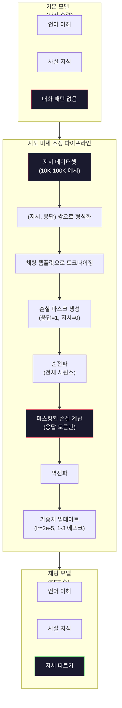

# 지시 튜닝(SFT)

> 기본 모델은 다음 토큰을 예측합니다. 그게 전부입니다. 지시를 따르거나 질문에 답하거나 유해한 요청을 거부하지 않습니다. SFT는 토큰 예측기와 유용한 어시스턴트 사이의 다리입니다. Claude, GPT, Llama Chat 등 당신이 대화해 본 모든 모델은 이 단계를 거쳤습니다.

**유형:** 구축
**언어:** Python (numpy 사용)
**사전 요구 사항:** 10단계, 04과 (미니 GPT 사전 학습)
**소요 시간:** ~90분

## 학습 목표

- 기본 언어 모델을 지시 사항을 따르는 어시스턴트로 변환하는 지도 학습 파인튜닝(SFT)을 구현
- 시스템, 사용자, 어시스턴트 역할이 포함된 채팅 템플릿을 사용하여 훈련 데이터를 포맷하고, 어시스턴트가 아닌 토큰에 대한 손실(loss)을 마스킹
- SFT의 필요성 설명: 기본 모델은 질문에 답변하기보다는 텍스트를 계속 이어나감
- 보유 중인 지시 사항 집합에 대해 기본 모델 vs 파인튜닝 모델 응답을 비교하여 SFT 품질 평가

## 문제

Lesson 04에서 모델을 훈련시켰습니다. 이 모델은 시퀀스가 주어졌을 때 다음 토큰을 예측할 수 있습니다. "The transformer architecture"를 입력하면 "has revolutionized natural language processing"으로 이어질 수 있습니다. 다음 토큰 예측기로는 인상적입니다.

이제 다음을 시도해 보세요: "What is the capital of France?"를 입력합니다. 기본 모델은 "Paris"라고 답하지 않습니다. 패턴을 계속 이어갑니다. 질문 목록이 포함된 문서에서 학습했기 때문에 "What is the capital of Germany? What is the capital of Spain?"을 생성할 수 있습니다. 또는 "is a question that many people ask"를 생성할 수도 있습니다. 이는 그럴듯한 다음 토큰 연속이기 때문입니다. 모델은 *답변*에 대한 개념이 없습니다. 오직 *계속*만 알고 있습니다.

이것이 GPT-3(기본 모델, 2020년 6월 출시)와 ChatGPT(지시문 조정 모델, 2022년 11월 출시)의 차이입니다. 동일한 아키텍처입니다. 동일한 사전 훈련입니다. 차이는 20,000~100,000개의 정교하게 제작된 (지시문, 응답) 쌍으로, 모델이 대화 패턴을 따르도록 가르쳤습니다.

Stanford Alpaca는 수백만 개의 예시가 필요하지 않음을 증명했습니다. 2023년 3월, GPT-3.5로 생성된 52,000개의 지시문-응답 쌍으로 Llama 7B를 파인튜닝했습니다. 총 비용: $600. 결과는 지시를 따르고 질문에 답하며 대화를 유지할 수 있는 챗봇이었습니다. ChatGPT만큼 좋지는 않았지만, $600과 몇 시간의 훈련으로 놀랍도록 근접했습니다.

Meta의 Llama 2 Chat은 초기 SFT 단계에 ~27,000개의 고품질 예시만 사용했습니다. 핵심 통찰: 양보다 질이 중요합니다. 숙련된 주석자가 작성한 27,000개의 예시는 인터넷에서 스크랩한 100만 개의 노이즈 많은 예시보다 우수했습니다.

## 개념

### SFT가 실제로 수행하는 작업

지도 미세 조정(Supervised Fine-Tuning, SFT)은 사전 훈련에서 사용된 동일한 훈련 루프(순전파, 손실 계산, 역전파, 가중치 업데이트)를 계속하지만, 다른 종류의 데이터로 수행합니다. 원시 텍스트 대신 구조화된 대화 데이터로 훈련합니다:

```json
{
  "system": "당신은 도움이 되는 어시스턴트입니다.",
  "user": "프랑스의 수도는 어디인가요?",
  "assistant": "프랑스의 수도는 파리입니다."
}
```

모델은 이미 파리가 프랑스의 수도라는 사실을 알고 있습니다. 이는 위키피디아, 교과서, 웹 페이지 등을 사용한 사전 훈련 중에 학습한 것입니다. SFT는 모델에게 새로운 사실을 가르치지 않습니다. 대신 새로운 *행동*을 가르칩니다: 질문을 보면 답변을 생성하라. 지시를 보면 완료를 생성하라. 유해한 요청을 보면 거절을 생성하라.

이렇게 생각해 보세요. 사전 훈련은 모델에게 지식을 제공합니다. SFT는 모델에게 예의를 가르칩니다.

### 데이터 형식

세 가지 형식이 업계를 주도합니다. 각각은 누가 무엇을 말했는지에 대한 동일한 정보를 다른 구분자로 인코딩합니다.

**알파카 형식**(Stanford, 2023년 3월):

```json
{
  "instruction": "다음 기사를 3문장으로 요약하세요.",
  "input": "유럽중앙은행(ECB)이 금리를 인상했습니다...",
  "output": "ECB는 금리를 25bp 인상했습니다..."
}
```

간단하고 널리 사용됩니다. `input` 필드는 선택 사항입니다. 많은 지시에는 추가 컨텍스트가 필요하지 않습니다. Stanford는 GPT-3.5로 생성한 52,000개의 예시를 이 형식으로 $600에 공개했습니다. 이는 오픈소스 지시 튜닝 운동을 촉발시켰습니다.

**ShareGPT 형식**(커뮤니티, 2023년):

```json
{
  "conversations": [
    {"from": "system", "value": "당신은 도움이 되는 어시스턴트입니다."},
    {"from": "human", "value": "조수의 원인은 무엇인가요?"},
    {"from": "gpt", "value": "조수는 달의 중력에 의해 발생합니다..."},
    {"from": "human", "value": "얼마나 자주 발생하나요?"},
    {"from": "gpt", "value": "대부분의 해안 지역은 하루에 두 번의 고조와 두 번의 저조를 경험합니다..."}
  ]
}
```

다중 턴 대화를 지원합니다. "from" 필드는 실제 모델과 관계없이 관례적으로 "human"과 "gpt"를 사용합니다. Vicuna는 사용자가 공유한 ChatGPT 대화록에서 스크랩한 70,000개의 ShareGPT 대화로 훈련되었습니다.

**ChatML 형식**(OpenAI, 많은 오픈소스 모델에서 사용):

```
system
당신은 도움이 되는 어시스턴트입니다. 
user
프랑스의 수도는 어디인가요? 
assistant
프랑스의 수도는 파리입니다. 
```

역할 구분을 위해 특수 토큰(``, ``)을 사용합니다. 이 토큰들은 미세 조정 중에 토크나이저 어휘에 추가됩니다. Qwen, Yi 등 많은 모델이 ChatML을 사용합니다.

세 형식 모두 동일한 목적을 달성합니다: 모델에게 "이것은 지시, 이것은 응답, 이 패턴을 학습하라"고 알려줍니다.

### 작동 원리

모델은 사전 훈련에서 이미 언어를 알고 있습니다. 질문 뒤에 답변, 지시 뒤에 완료, 사람 간 대화가 이어지는 수십억 개의 예시를 보았습니다. 이러한 패턴은 이미 가중치에 인코딩되어 있습니다.

SFT는 이 잠재 능력을 집중시킵니다. 모델이 컨텍스트에서 질문이나 문서 계속 여부를 파악해야 하는 대신, SFT는 대화 패턴을 명시적으로 훈련합니다. 수천 개의 예시 후 모델은 학습합니다: 어시스턴트 역할 마커를 보면 도움이 되는 응답을 생성하라.

이것이 27,000개의 예시로 충분한 이유입니다. 모델에게 영어를 가르치는 것이 아닙니다. 세상에 대한 사실을 가르치는 것도 아닙니다. 단 하나의 간단한 행동을 가르치는 것입니다: 지시에 응답하라. 지식은 이미 존재했습니다.

### 마스킹된 손실

이것은 SFT에서 가장 중요한 기술적 세부 사항이며, 대부분의 튜토리얼에서 생략됩니다.

사전 훈련 중에는 모든 토큰에 대해 손실을 계산합니다. 모델은 시퀀스의 모든 다음 토큰을 예측하도록 학습합니다. SFT 중에는 *응답* 토큰에 대해서만 손실을 계산합니다. 지시 토큰은 컨텍스트로 제공되지만, 모델이 이를 "잘못 예측"해도 패널티를 받지 않습니다.

왜일까요? 모델이 지시를 *생성*하는 것을 원하지 않기 때문입니다. 지시에 *응답*하는 것을 원합니다. 지시 토큰에 대해 손실을 계산하면 모델이 "프랑스의 수도는 어디인가요?"를 자신이 질문하는 것처럼 예측하도록 훈련됩니다. 이는 그래디언트 신호를 낭비하고 모델의 역할을 혼란스럽게 할 수 있습니다.

실제로 손실 마스크를 생성합니다: 응답 토큰은 1, 지시 토큰은 0. 평균 전 이 마스크로 토큰별 손실을 곱합니다.

```
토큰:    [SYS] 당신은 도움이 됩니다 [USER] 수도는 어디인가요? [ASST] 파리가 수도입니다 [EOS]
손실 마스크:   0    0    0     0      0     0   0  0     0       1     1    1   1     1      1
```

`[ASST]` 이후의 토큰만 손실에 기여합니다. 모델은 순전파 중 전체 대화를 보지만(전방 패스에서 지시를 필요로 함), 응답 예측 정확도에만 기반해 가중치를 업데이트합니다.

### 훈련 하이퍼파라미터

SFT는 사전 훈련과 극적으로 다른 하이퍼파라미터를 사용합니다. 처음부터 훈련하는 것이 아닙니다. 이미 작동하는 모델을 조정합니다.

| 파라미터 | 사전 훈련 (Llama 2 7B) | SFT (Llama 2 Chat) |
|-----------|---------------------------|---------------------|
| 학습률 | 3e-4 (최대) | 2e-5 |
| 에포크 | 1 (데이터 단일 패스) | 2 |
| 배치 크기 | 4M 토큰 | 64 예시 |
| 워밍업 단계 | 2,000 | 0-100 |
| 가중치 감쇠 | 0.1 | 0.0-0.1 |
| 데이터 크기 | 2T 토큰 | 27,000 예시 |

SFT의 학습률은 15배 더 낮습니다. 이는 매우 중요합니다. 미세 조정 중 높은 학습률은 사전 훈련 지식을 파괴합니다. 모델은 학습한 내용을 "잊어버리고" 작은 미세 조정 데이터셋에 과적합됩니다. 이는 치명적 망각(catastrophic forgetting)입니다.

2 에포크는 모델이 각 훈련 예시를 두 번 본다는 의미입니다. 작은 데이터셋에서 3 에포크 이상은 암기(memorization)로 이어집니다. 모델이 일반화하는 대신 훈련 예시를 그대로 재현하기 시작합니다.

### 치명적 망각

미세 조정은 일반적인 능력을 파괴할 수 있습니다. 지시 따르기 데이터로 너무 오래 훈련하면 모델은 코드 작성, 수학 계산, 창의적 텍스트 생성 능력을 잃습니다. 훈련 데이터의 특정 형식에는 매우 능숙해지지만 다른 모든 것에는 서툴러집니다.

세 가지 완화 방법:

1. **낮은 학습률.** 1e-5에서 5e-5. 작은 업데이트는 사전 훈련 특징의 파괴를 줄입니다.

2. **짧은 훈련.** 1-3 에포크. 모델이 과적합되기 전에 중단합니다.

3. **사전 훈련 데이터 혼합.** Llama 2 Chat은 SFT 데이터셋에 소량의(2-5%) 원시 사전 훈련 데이터를 혼합했습니다. 이는 모델에게 일반적인 능력을 상기시키면서 새로운 지시 따르기 행동을 학습시킵니다.

### 실제 수치

10,000개의 고품질 지시 쌍으로 7B 모델을 미세 조정하는 데는 NVIDIA A100 80GB GPU 1대로 약 1시간이 소요됩니다. 계산 과정은 다음과 같습니다:

- 10,000 예시 x 평균 512 토큰 = 5.12M 토큰
- 2 에포크 = 총 10.24M 토큰
- 7B 모델 미세 조정 시 A100 처리량: ~3,000 토큰/초
- 10.24M / 3,000 = ~3,400초 = ~57분

미니 GPT(4층, 128차원)의 경우 훈련이 거의 즉시 완료됩니다. 중요한 것은 규모가 아닌 메커니즘 이해입니다.



## 구축 방법

### 1단계: 지시 데이터셋

합성 지시 데이터셋을 생성합니다. 실제 환경에서는 Scale AI 및 Anthropic과 같은 회사에서 인간 주석 작성자를 고용하여 이를 작성합니다. 여기서는 형식을 보여주기 위해 프로그래밍 방식으로 생성합니다.

```python
import numpy as np

INSTRUCTION_DATA = [
    {
        "instruction": "프랑스의 수도는 무엇인가요?",
        "response": "프랑스의 수도는 파리입니다."
    },
    {
        "instruction": "중력을 한 문장으로 설명하세요.",
        "response": "중력은 질량을 가진 물체를 서로 끌어당기는 힘입니다."
    },
    {
        "instruction": "바다에 관한 하이쿠를 작성하세요.",
        "response": "파도가 해안에 부딪히고, 태양 아래 소금과 거품, 끝없는 푸른 공간."
    },
    {
        "instruction": "15에 7을 곱한 값은 무엇인가요?",
        "response": "15에 7을 곱한 값은 105입니다."
    },
    {
        "instruction": "프로그래밍 언어 3개를 말해주세요.",
        "response": "세 가지 프로그래밍 언어는 Python, Rust, TypeScript입니다."
    },
    {
        "instruction": "광합성을 요약하세요.",
        "response": "광합성은 햇빛, 물, 이산화탄소를 포도당과 산소로 변환합니다."
    },
    {
        "instruction": "제2차 세계 대전은 몇 년에 끝났나요?",
        "response": "제2차 세계 대전은 1945년에 끝났습니다."
    },
    {
        "instruction": "머신 러닝을 정의하세요.",
        "response": "머신 러닝은 알고리즘이 데이터에서 패턴을 학습하여 예측을 수행하는 분야입니다."
    },
]
```

8개의 예시는 매우 작습니다. Stanford Alpaca는 52,000개를 사용했습니다. 하지만 8개든 52,000개든 메커니즘은 동일합니다: 토큰화, 마스킹, 응답에 대한 손실 계산.

### 2단계: 채팅 템플릿으로 토큰화

지시-응답 쌍을 특수 역할 마커가 포함된 토큰 시퀀스로 변환합니다. 마커는 모델에게 지시가 끝나는 위치와 응답이 시작되는 위치를 알려줍니다.

```python
SPECIAL_TOKENS = {
    "INST_START": 253,
    "INST_END": 254,
    "RESP_START": 255,
}


def tokenize_instruction_pair(instruction, response, vocab_size=256):
    inst_tokens = list(instruction.encode("utf-8"))
    resp_tokens = list(response.encode("utf-8"))

    inst_tokens = [min(t, vocab_size - 4) for t in inst_tokens]
    resp_tokens = [min(t, vocab_size - 4) for t in resp_tokens]

    tokens = (
        [SPECIAL_TOKENS["INST_START"]]
        + inst_tokens
        + [SPECIAL_TOKENS["INST_END"]]
        + [SPECIAL_TOKENS["RESP_START"]]
        + resp_tokens
    )

    return tokens


def create_loss_mask(tokens):
    mask = np.zeros(len(tokens), dtype=np.float32)
    in_response = False

    for i, token in enumerate(tokens):
        if token == SPECIAL_TOKENS["RESP_START"]:
            in_response = True
            continue
        if in_response:
            mask[i] = 1.0

    return mask
```

손실 마스크는 지시 토큰에 대해 모두 0이고 응답 토큰에 대해 모두 1입니다. `RESP_START` 토큰 자체는 구분자이므로 응답 내용의 일부가 아니며 마스크 값은 0입니다.

### 3단계: 마스킹된 교차 엔트로피 손실

표준 교차 엔트로피이지만 손실 마스크로 곱해집니다. 응답 토큰만 그래디언트에 기여합니다.

```python
def masked_cross_entropy_loss(logits, targets, loss_mask):
    batch, seq_len, vocab_size = logits.shape
    logits_flat = logits.reshape(-1, vocab_size)
    targets_flat = targets.reshape(-1)
    mask_flat = loss_mask.reshape(-1)

    max_logits = logits_flat.max(axis=-1, keepdims=True)
    log_softmax = logits_flat - max_logits - np.log(
        np.exp(logits_flat - max_logits).sum(axis=-1, keepdims=True)
    )

    per_token_loss = -log_softmax[np.arange(len(targets_flat)), targets_flat]

    masked_loss = per_token_loss * mask_flat
    num_response_tokens = mask_flat.sum()
    if num_response_tokens == 0:
        return 0.0
    loss = masked_loss.sum() / num_response_tokens

    return loss
```

분모는 `num_response_tokens`이며 `seq_len`이 아닙니다. 전체 시퀀스 길이로 나누면 긴 지시가 그래디언트 신호를 희석시킵니다. 응답 토큰 수로 나누면 지시 길이와 관계없이 응답 토큰당 동일한 가중치가 보장됩니다.

### 4단계: SFT 훈련 루프

레슨 04의 MiniGPT를 재사용합니다. 훈련 루프는 사전 훈련과 거의 동일하지만 지시 포맷팅과 마스킹된 손실이 추가됩니다.

```python
import sys
import os
sys.path.insert(0, os.path.join(os.path.dirname(__file__), "..", "..", "04-pre-training-mini-gpt", "code"))
from main import MiniGPT, LayerNorm, FeedForward, MultiHeadAttention, TransformerBlock, Embedding


def sft_train(model, dataset, num_epochs=2, lr=2e-5, seq_len=64):
    formatted_data = []
    for example in dataset:
        tokens = tokenize_instruction_pair(example["instruction"], example["response"])
        mask = create_loss_mask(tokens)
        formatted_data.append((tokens, mask))

    print(f"SFT 훈련: {len(formatted_data)} 예시, {num_epochs} 에포크, lr={lr}")
    print(f"총 토큰 수: {sum(len(t) for t, _ in formatted_data):,}")
    print()

    losses = []

    for epoch in range(num_epochs):
        epoch_loss = 0.0
        num_batches = 0

        indices = np.random.permutation(len(formatted_data))

        for idx in indices:
            tokens, mask = formatted_data[idx]

            if len(tokens) < 3:
                continue
            if len(tokens) > seq_len:
                tokens = tokens[:seq_len]
                mask = mask[:seq_len]

            input_ids = np.array(tokens[:-1]).reshape(1, -1)
            target_ids = np.array(tokens[1:]).reshape(1, -1)
            loss_mask = np.array(mask[1:]).reshape(1, -1)

            logits = model.forward(input_ids)
            loss = masked_cross_entropy_loss(logits, target_ids, loss_mask)

            batch_size, s_len, v_size = logits.shape
            probs = np.exp(logits - logits.max(axis=-1, keepdims=True))
            probs = probs / probs.sum(axis=-1, keepdims=True)
            dlogits = probs.copy()
            dlogits[np.arange(batch_size)[:, None], np.arange(s_len), target_ids] -= 1.0

            mask_expanded = loss_mask[:, :, np.newaxis]
            num_resp = loss_mask.sum()
            if num_resp > 0:
                dlogits = dlogits * mask_expanded / num_resp

            for block in model.blocks:
                block.ffn.W1 -= lr * np.random.randn(*block.ffn.W1.shape) * 0.01
                block.ffn.W2 -= lr * np.random.randn(*block.ffn.W2.shape) * 0.01
                block.ffn.b1 -= lr * np.random.randn(*block.ffn.b1.shape) * 0.01
                block.ffn.b2 -= lr * np.random.randn(*block.ffn.b2.shape) * 0.01

            epoch_loss += loss
            num_batches += 1
            losses.append(loss)

        avg_loss = epoch_loss / max(num_batches, 1)
        print(f"에포크 {epoch + 1}/{num_epochs} | 평균 손실: {avg_loss:.4f}")

    return model, losses
```

학습률은 Llama 2 Chat과 일치하는 2e-5입니다. 사전 훈련에서 사용된 3e-4와 비교하면 15배 더 작습니다. 그래디언트는 마스킹됩니다: 지시 토큰은 그래디언트를 생성하지 않습니다. 응답 토큰만 가중치를 조정합니다.

### 5단계: 기본 모델 vs SFT 모델 비교

SFT의 전체 목적은 행동 변화입니다. 모델이 지시 포맷 입력에 어떻게 반응하는지 확인하여 이를 측정합니다.

```python
def generate_response(model, prompt_tokens, max_new_tokens=50, temperature=0.8):
    tokens = list(prompt_tokens)
    seq_len = model.embedding.pos_embed.shape[0]

    for _ in range(max_new_tokens):
        context = np.array(tokens[-seq_len:]).reshape(1, -1)
        logits = model.forward(context)
        next_logits = logits[0, -1, :]

        next_logits = next_logits / max(temperature, 1e-8)
        probs = np.exp(next_logits - next_logits.max())
        probs = probs / probs.sum()
        probs = np.clip(probs, 1e-10, 1.0)
        probs = probs / probs.sum()

        next_token = np.random.choice(len(probs), p=probs)
        tokens.append(int(next_token))

    return tokens


def evaluate_instruction_following(model, instructions):
    print("지시 따르기 평가:")
    print("-" * 50)

    for instruction in instructions:
        tokens = (
            [SPECIAL_TOKENS["INST_START"]]
            + [min(t, 252) for t in list(instruction.encode("utf-8"))]
            + [SPECIAL_TOKENS["INST_END"]]
            + [SPECIAL_TOKENS["RESP_START"]]
        )

        output = generate_response(model, tokens, max_new_tokens=30, temperature=0.6)
        response_start = len(tokens)
        response_tokens = output[response_start:]
        response_bytes = bytes([t for t in response_tokens if t < 128])
        response_text = response_bytes.decode("utf-8", errors="replace")

        print(f"  Q: {instruction}")
        print(f"  A: {response_text[:80]}")
        print()
```

8개의 예시로 훈련된 작은 모델에서는 응답이 의미 있지 않을 수 있습니다. 이는 예상되는 결과입니다. 중요한 것은 *구조*입니다: 모델은 더 많은 지시를 생성하는 대신 응답 마커 이후에 출력을 생성하도록 학습합니다.

### 6단계: 치명적 망각 측정

SFT 전후의 모델의 다음 토큰 예측 능력을 비교합니다. SFT가 일반 능력을 손상시키면 원시 텍스트에 대한 손실이 증가합니다.

```python
def measure_forgetting(model, test_text, seq_len=64):
    tokens = np.array(list(test_text.encode("utf-8")[:512]))

    total_loss = 0.0
    num_windows = 0

    for start in range(0, len(tokens) - seq_len - 1, seq_len):
        input_ids = tokens[start:start + seq_len].reshape(1, -1)
        target_ids = tokens[start + 1:start + seq_len + 1].reshape(1, -1)

        logits = model.forward(input_ids)

        batch, s_len, vocab_size = logits.shape
        logits_flat = logits.reshape(-1, vocab_size)
        targets_flat = target_ids.reshape(-1)

        max_logits = logits_flat.max(axis=-1, keepdims=True)
        log_softmax = logits_flat - max_logits - np.log(
            np.exp(logits_flat - max_logits).sum(axis=-1, keepdims=True)
        )

        loss = -log_softmax[np.arange(len(targets_flat)), targets_flat].mean()
        total_loss += loss
        num_windows += 1

    return total_loss / max(num_windows, 1)
```

실제 미세 조정에서는 훈련 전반에 걸쳐 이 메트릭을 추적합니다. 원시 텍스트 손실이 10-15% 이상 증가하면 SFT가 너무 공격적입니다. 학습률을 낮추거나 에포크 수를 줄이세요.

## 사용 방법

### 전체 SFT 파이프라인 데모

```python
if __name__ == "__main__":
    np.random.seed(42)

    test_text = """트랜스포머 아키텍처는 자기 주의(self-attention)를 통해 시퀀스를 처리합니다.
각 레이어는 멀티 헤드 어텐션(multi-head attention) 후 피드포워드 네트워크(feedforward network)를 적용합니다.
잔차 연결(residual connections)과 레이어 정규화(layer normalization)는 심층 네트워크를 안정화합니다.
모델은 이전 모든 토큰을 기반으로 다음 토큰을 예측하도록 학습합니다."""

    print("=" * 70)
    print("지시어 튜닝(SFT) 데모")
    print("=" * 70)
    print()

    model = MiniGPT(
        vocab_size=256, embed_dim=128, num_heads=4,
        num_layers=4, max_seq_len=128, ff_dim=512
    )
    print(f"모델: {model.count_parameters():,} 파라미터")
    print(f"설정: 4 레이어, 4 헤드, 128 차원 (레슨 04의 미니 GPT)")
    print()

    print("SFT 전: 원본 텍스트에 대한 기본 모델 손실 측정")
    base_loss = measure_forgetting(model, test_text)
    print(f"  기본 모델 손실: {base_loss:.4f}")
    print()

    print("=" * 70)
    print("SFT 훈련")
    print("=" * 70)

    model, losses = sft_train(
        model, INSTRUCTION_DATA, num_epochs=3, lr=2e-5, seq_len=128
    )

    print()
    print("SFT 후: 미세 조정된 모델 손실 측정")
    sft_loss = measure_forgetting(model, test_text)
    print(f"  SFT 모델 손실: {sft_loss:.4f}")
    print(f"  변화율: {((sft_loss - base_loss) / base_loss * 100):+.1f}%")
    if abs(sft_loss - base_loss) / base_loss < 0.15:
        print("  최소 망각 (< 15% 변화)")
    else:
        print("  상당한 망각 감지됨")
    print()

    print("=" * 70)
    print("지시어 수행 평가")
    print("=" * 70)
    print()

    test_instructions = [
        "프랑스의 수도는 무엇인가요?",
        "프로그래밍 언어 이름을 하나 말해주세요.",
        "중력을 정의해주세요.",
    ]
    evaluate_instruction_following(model, test_instructions)

    print("=" * 70)
    print("데이터 형식 예시")
    print("=" * 70)
    print()

    for i, example in enumerate(INSTRUCTION_DATA[:3]):
        tokens = tokenize_instruction_pair(example["instruction"], example["response"])
        mask = create_loss_mask(tokens)
        resp_count = int(mask.sum())
        total_count = len(tokens)
        print(f"  예시 {i + 1}: {total_count} 토큰, {resp_count} 응답 토큰 ({resp_count/total_count:.0%} of 시퀀스)")
        print(f"    지시어: {example['instruction']}")
        print(f"    응답: {example['response']}")
        print()

    print("=" * 70)
    print("훈련 손실 곡선")
    print("=" * 70)
    print()

    if losses:
        window = max(1, len(losses) // 5)
        for i in range(0, len(losses), window):
            chunk = losses[i:i + window]
            avg = sum(chunk) / len(chunk)
            print(f"  단계 {i:3d}-{i + len(chunk) - 1:3d}: 평균 손실 = {avg:.4f}")
```

## Ship It

이 레슨은 `outputs/prompt-sft-data-curator.md`를 생성합니다. 이는 SFT(지도 미세 조정)를 위한 지시 데이터셋을 설계하고 선별하는 데 도움이 되는 프롬프트입니다. 목표 능력(코드 생성, 수학, 대화)이 주어지면, 형식 사양, 품질 기준, 다양성 요구 사항을 포함한 데이터 수집 계획을 생성합니다.

## 연습 문제

1. 시스템 프롬프트 지원 추가. `tokenize_instruction_pair`를 수정하여 시스템 메시지를 받아들이고 지시문 앞에 추가하도록 변경합니다. "당신은 시인입니다", "당신은 수학 튜터입니다"와 같은 다양한 시스템 프롬프트를 포함한 5개의 예시를 생성하고, 훈련 중 모델이 서로 다른 시스템 프롬프트를 확인하는지 검증합니다.

2. 데이터 혼합 구현. SFT 데이터셋과 원시 텍스트 코퍼스를 입력으로 받아, 예시의 5%는 원시 텍스트(마스킹 없음), 95%는 지시문 쌍(마스킹 적용)으로 구성된 훈련 배치를 생성하는 함수를 작성합니다. 3에포크 동안 실행하고 순수 SFT 훈련 대비 망각 메트릭을 비교합니다.

3. 데이터 품질 평가기 구축. 각 지시문-응답 쌍에 대해 다음을 계산합니다: (a) 토큰 단위 응답 길이, (b) 지시문 대 응답 비율, (c) 어휘 다양성(유니크 토큰 / 총 토큰). 응답 길이가 10토큰 미만이거나 다양성이 0.3 미만인 예시를 필터링합니다. 필터링이 최종 손실에 미치는 영향을 보여줍니다.

4. 다중 턴 대화 훈련 구현. 3턴 대화(사용자-조수-사용자-조수-사용자-조수)를 처리할 수 있도록 토크나이저를 확장합니다. 손실 마스크는 세 번의 조수 턴을 모두 커버해야 합니다. 한 예시에 대한 토큰-마스크 정렬을 출력하여 마스크 정확성을 검증합니다.

5. 학습률 비교. 동일한 모델을 lr=1e-4, lr=2e-5, lr=1e-6 세 가지 설정으로 각각 훈련시킵니다. 손실 곡선을 플롯합니다. 1e-4 실행은 초기 빠른 감소 후 높은 최종 손실(과적합)을, 1e-6 실행은 거의 변화가 없어야 합니다. 2e-5 실행이 최적의 지점이 될 것입니다.

## 주요 용어

| 용어 | 사람들이 말하는 것 | 실제 의미 |
|------|----------------|----------------------|
| SFT | "대화 데이터에 대한 파인튜닝" | 지도 미세 조정(Supervised Fine-Tuning): (지시문, 응답) 쌍에 대한 추가 학습. 손실 계산은 응답 토큰에만 적용 |
| Instruction tuning | "모델에 지시 따르기 가르치기" | 명시적 지시문-응답 쌍으로 학습시켜 기본 모델이 대화 패턴을 학습하도록 함. 새로운 지식 습득이 아님 |
| Loss masking | "프롬프트 무시하기" | 지시문 토큰에 대한 손실을 0으로 설정하여 그래디언트가 응답 토큰 예측에서만 흐르도록 함 |
| ChatML | "대화 마크업 언어" | `<\|im_start\|>` 및 `<\|im_end\|>` 구분자를 사용하는 토큰 형식. 대화 데이터에서 화자 역할을 표시 |
| Alpaca format | "스탠퍼드 대학 형식" | 지시문/입력/출력 필드가 있는 JSON 형식. 52,000개의 GPT-3.5 생성 예시에 사용되었으며 비용은 $600 |
| Catastrophic forgetting | "모델이 더 멍청해진다" | 미세 조정 시 사전 학습된 능력이 파괴됨. 그래디언트 업데이트가 일반 지식을 작업별 패턴으로 덮어씀 |
| Weight tying | "공유 임베딩" | 입력 토큰 임베딩과 출력 예측 헤드에 동일한 행렬 사용. 파라미터 절약 및 일관성 향상 |
| Chat template | "프롬프트 형식화 방법" | 모델을 위한 대화 구조화 특정 토큰 시퀀스(역할 표시자, 구분자) |

## 추가 자료

- [Ouyang et al., 2022 -- "인간 피드백을 통한 지시 따르기 언어 모델 학습 (InstructGPT)"](https://arxiv.org/abs/2203.02155) -- OpenAI에서 지시 튜닝 + RLHF를 도입한 논문
- [Taori et al., 2023 -- "Stanford Alpaca: 지시 따르기 LLaMA 모델"](https://github.com/tatsu-lab/stanford_alpaca) -- 52K 지시 예시를 600달러로 생성, 소규모 데이터셋에서 SFT 효과 입증
- [Touvron et al., 2023 -- "Llama 2: 오픈 파운데이션 및 파인튜닝된 채팅 모델"](https://arxiv.org/abs/2307.09288) -- Meta의 27K 고품질 예시를 활용한 SFT + RLHF 파이프라인
- [Chiang et al., 2023 -- "Vicuna: GPT-4를 능가하는 오픈소스 챗봇"](https://lmsys.org/blog/2023-03-30-vicuna/) -- 70K ShareGPT 대화 데이터 학습
- [Zhou et al., 2023 -- "LIMA: 정렬을 위한 최소주의"](https://arxiv.org/abs/2305.11206) -- 1,000개의 신중하게 선별된 예시로 대규모 데이터셋 SFT와 동등한 성능 달성 증명