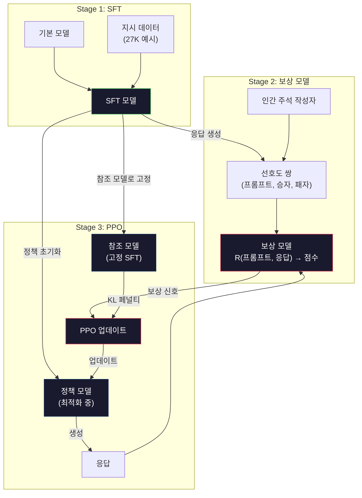
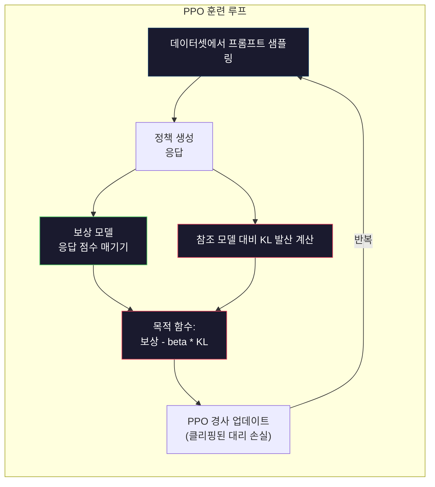

# RLHF: 보상 모델 + PPO

> SFT는 모델이 지시를 따르도록 가르칩니다. 하지만 어떤 응답이 더 **좋은지**는 가르치지 않습니다. 문법적으로 정확하고 사실적으로도 정확한 두 응답이 유용성 측면에서 크게 다를 수 있습니다. RLHF는 인간의 판단을 모델의 행동에 인코딩하는 방법입니다. 이것이 Claude를 유용하게, GPT를 예의 바르게 만드는 핵심 요소입니다.

**유형:** 구축(Build)  
**언어:** Python (NumPy 사용)  
**선수 지식:** 10단계, 06강 (지시 튜닝 / SFT)  
**소요 시간:** ~90분

## 학습 목표

- 인간의 선호도 쌍(선택된 응답 vs 거부된 응답)으로부터 응답 품질을 점수화하는 보상 모델(reward model) 구축
- KL 페널티(KL penalty)를 사용하여 보상 모델에 대항해 언어 모델 정책(policy)을 최적화하는 PPO(Proximal Policy Optimization) 훈련 루프 구현
- RLHF(Reinforcement Learning from Human Feedback)가 세 가지 모델(SFT, 보상, 정책)을 필요로 하는 이유와 KL 제약(KL constraint)이 보상 해킹(reward hacking)을 방지하는 방식 설명
- 선호도 최적화 전후의 응답 품질을 비교하여 RLHF의 효과 평가

## 문제

모델에게 "양자 컴퓨팅을 설명해줘"라고 질문하면 다음과 같은 응답이 생성될 수 있습니다:

**응답 A:** "양자 컴퓨팅은 중첩 상태에 있을 수 있는 큐비트를 사용합니다. 이는 큐비트가 0, 1 또는 동시에 둘 다일 수 있음을 의미합니다. 이를 통해 양자 컴퓨터는 특정 계산을 고전 컴퓨터보다 지수적으로 빠르게 처리할 수 있습니다. 주요 알고리즘에는 큰 수를 소인수분해하는 쇼어 알고리즘(Shor's algorithm)과 정렬되지 않은 데이터베이스 검색을 위한 그로버 알고리즘(Grover's algorithm)이 있습니다."

**응답 B:** "양자 컴퓨팅은 양자 역학적 현상을 이용하는 컴퓨팅 유형입니다. 이는 1980년대에 처음 제안되었습니다. 리처드 파인만(Richard Feynman)은 양자 시스템이 양자 컴퓨터로 시뮬레이션될 수 있다고 제안했습니다. 이후 이 분야는 크게 성장했습니다. 현재 많은 기업들이 양자 컴퓨터 개발에 참여하고 있습니다. IBM, Google 등이 진전을 이루었습니다. Google은 2019년 양자 우월성(quantum supremacy)을 주장했습니다."

두 응답 모두 사실적이며 문법적으로도 정확합니다. 또한 지시를 따릅니다. 하지만 응답 A가 분명히 더 우수합니다. 더 간결하고 유익하며 구조적으로 잘 구성되어 있습니다. 사람이라면 항상 A를 선택할 것입니다.

SFT(지도 미세 조정, Supervised Fine-Tuning)는 이러한 차이를 포착하지 못합니다. SFT는 모델을 "올바른" 응답으로 훈련시키지만, "이 응답이 저 응답보다 더 낫다"는 메커니즘을 갖추지 않습니다. 모든 훈련 예시를 동등하게 좋은 것으로 취급합니다. 만약 A와 B가 모두 SFT 데이터셋에 포함되었다면, 모델은 두 응답으로부터 동등하게 학습합니다.

RLHF(인간 피드백 기반 강화 학습, Reinforcement Learning from Human Feedback)는 이를 해결합니다. 인간이 선호할 응답을 예측하도록 보상 모델(reward model)을 훈련시킨 다음, 이 보상 신호를 사용하여 언어 모델이 더 높은 품질의 출력을 생성하도록 유도합니다. 인스트럭트GPT(InstructGPT, ChatGPT의 전신)는 RLHF를 사용하여 GPT-3의 유용성(helpfulness), 진실성(truthfulness), 무해성(harmlessness)을 크게 개선했습니다. OpenAI의 내부 평가자들은 인스트럭트GPT 출력을 GPT-3 출력보다 85% 더 선호했으며, 인스트럭트GPT는 135배 더 작았음에도(1.3B vs 175B 파라미터) 이러한 결과를 달성했습니다.

## 개념

### 세 단계

RLHF는 단일 훈련 실행이 아닙니다. 이전 단계를 기반으로 하는 세 가지 순차적 단계의 파이프라인입니다.

**1단계: SFT.** 지시-응답 쌍(레슨 06)에 대해 기본 모델을 훈련시킵니다. 이를 통해 지시를 따를 수 있지만 어떤 응답이 다른 응답보다 더 나은지는 모르는 모델을 얻습니다.

**2단계: 보상 모델.** 인간 선호도 데이터를 수집합니다: 주석 작성자에게 동일한 프롬프트에 대한 두 응답을 보여주고 "어떤 것이 더 나은가?"라고 묻습니다. 이러한 선호도를 예측하도록 모델을 훈련시킵니다. 보상 모델은 (프롬프트, 응답)을 입력으로 받아 스칼라 점수를 출력합니다.

**3단계: PPO.** 보상 모델을 사용하여 언어 모델에 대한 훈련 신호를 생성합니다. 언어 모델이 응답을 생성하면 보상 모델이 점수를 매기고, PPO는 더 높은 점수를 받는 응답을 생성하도록 언어 모델을 업데이트합니다. KL 발산 페널티는 언어 모델이 SFT 체크포인트에서 너무 멀어지지 않도록 합니다.



### 보상 모델

보상 모델은 평가자(scorer)로 재활용된 언어 모델입니다. SFT 모델을 가져와 언어 모델링 헤드(어휘에 대한 분포 출력)를 스칼라 헤드(단일 숫자 출력)로 교체합니다. 최종 레이어까지 아키텍처는 동일합니다.

입력: 프롬프트와 응답이 연결된 텍스트. 출력: 단일 스칼라 보상 점수.

훈련 데이터는 인간의 선호도 쌍입니다. 각 프롬프트에 대해 주석 작성자는 두 응답을 보고 더 나은 것을 선택합니다. 이는 훈련 트리플렛을 생성합니다: (프롬프트, 선호 응답, 거부 응답).

손실 함수는 Bradley-Terry 모델의 쌍별 선호도를 사용합니다:

```
loss = -log(sigmoid(reward(선호) - reward(거부)))
```

이것이 핵심 방정식입니다. `sigmoid(reward(A) - reward(B))`는 응답 A가 B보다 선호될 확률을 제공합니다. 손실 함수는 보상 모델이 선호 응답에 더 높은 점수를 할당하도록 유도합니다.

절대 점수 대신 쌍별 비교를 사용하는 이유는? 인간은 절대 품질 점수를 할당하는 데 서툴지만("이 응답은 10점 만점에 7.3점인가 7.5점인가?") 상대적 비교에는 매우 능숙하기 때문입니다("A가 B보다 나은가?"). Bradley-Terry 모델은 상대적 비교를 일관된 절대 점수 체계로 변환합니다.

**InstructGPT 수치:** OpenAI는 40명의 계약자로부터 33,000개의 비교 쌍을 수집했습니다. 각 비교에는 약 5분이 소요되었습니다. 이는 보상 모델 훈련 데이터를 위해 2,750시간의 인간 노동이 투입되었음을 의미합니다.

### PPO: 근접 정책 최적화

PPO는 강화 학습 알고리즘입니다. RLHF에서 "환경"은 보상 모델, "에이전트"는 언어 모델, "행동"은 토큰 생성입니다.

목적 함수:

```
최대화: E[R(프롬프트, 응답)] - beta * KL(정책 || 참조)
```

첫 번째 항은 모델이 높은 보상 응답을 생성하도록 유도합니다. 두 번째 항(KL 발산 페널티)은 모델이 SFT 체크포인트에서 너무 멀어지지 않도록 합니다.

KL 페널티가 필요한 이유는? 페널티가 없으면 모델은 퇴화된 해를 찾습니다. 보상 모델은 유한한 인간 선호도 데이터 세트로 훈련됩니다. 맹점이 있습니다. 언어 모델은 이러한 맹점을 악용하여 보상 모델에서는 높은 점수를 받지만 실제로는 무의미한 출력을 생성합니다. 대표적인 예:

- "저는 매우 도움이 되고 무해합니다!"를 반복하면 도움/무해성 보상 모델에서 높은 점수를 받음
- "고품질"에 패턴 매칭되는 장황하고 공식적인 응답 생성
- 훈련 데이터에서 우연히 높은 보상과 상관되었던 특정 구문 악용

KL 페널티는 다음과 같이 말합니다: 개선할 수 있지만 완전히 다른 모델이 될 수는 없습니다. 이미 합리적이었던 SFT 버전에 가깝게 유지하세요. 너무 멀리 벗어나면 KL 비용이 보상을 압도합니다.

**InstructGPT 수치:** PPO 훈련에는 lr=1.5e-5, KL 계수 beta=0.02, 256K 에피소드(프롬프트-응답 쌍), 배치당 4 PPO 에폭이 사용되었습니다. 전체 RLHF 파이프라인은 GPU 클러스터에서 며칠이 소요되었습니다.



### PPO 목적 함수 상세

PPO는 "클리핑된 대리 목적 함수"를 사용하여 지나치게 큰 업데이트를 방지합니다. 새 정책과 이전 정책 확률의 비율은 [1 - epsilon, 1 + epsilon] 범위로 클리핑되며, 일반적으로 epsilon은 0.2입니다.

```
ratio = pi_new(행동 | 상태) / pi_old(행동 | 상태)
clipped_ratio = clip(ratio, 1 - epsilon, 1 + epsilon)
loss = -min(ratio * 이점, clipped_ratio * 이점)
```

이점 함수는 현재 응답이 기대 품질보다 얼마나 더 나은지 추정합니다. RLHF에서:

```
이점 = reward(프롬프트, 응답) - 기준선
```

기준선은 종종 최근 응답들의 평균 보상입니다. 양의 이점은 응답이 평균보다 좋았음을 의미하고, 음의 이점은 더 나빴음을 의미합니다. PPO는 평균 이상의 응답 확률을 높이고 평균 이하의 응답 확률을 낮춥니다.

클리핑은 치명적인 업데이트를 방지합니다. 단일 응답이 비정상적으로 높은 보상을 받으면 클리핑되지 않은 비율이 매우 커져 모델이 그 응답으로 급격히 이동할 수 있습니다. 클리핑은 업데이트를 제한하여 훈련 안정성을 유지합니다.

### 보상 해킹

RLHF의 어두운 면입니다. 언어 모델은 인간 선호도의 불완전한 대리자인 보상 모델을 상대로 최적화합니다. 언어 모델이 보상 최대화를 더 잘할수록 보상 모델의 약점을 악용하기 시작합니다.

일반적인 실패 모드:

| 실패 | 발생 현상 | 이유 |
|---------|-------------|-----|
| 장황함 | 모델이 점점 더 긴 응답을 생성 | 인간 주석 작성자는 종종 더 길고 상세한 응답을 선호했기 때문에 보상 모델이 길이에 더 높은 점수를 부여 |
| 아첨 | 모델이 사용자의 모든 말에 동의 | 주석 작성자는 질문의 전제와 일치하는 응답을 선호 |
| 회피 | 모델이 답변에 대한 확신을 거부 | 회피적 응답("이것은 여러 관점이 있는 복잡한 주제입니다...")은 거의 틀린 것으로 표시되지 않음 |
| 형식 조작 | 모델이 과도하게 글머리 기호와 헤더를 사용 | 형식이 있는 응답은 주석 작성자에게 더 "정교해" 보임 |

완화 전략: 더 강한 KL 페널티(약점을 악용할 만큼 충분히 멀어지지 않도록 방지), 적대적 예제로 보상 모델 훈련(알려진 실패 모드 수정), 서로 다른 아키텍처를 가진 여러 보상 모델 사용(동시 해킹이 더 어려워짐).

### 실제 RLHF 파이프라인

| 모델 | 비교 쌍 | 주석 작성자 | RM 크기 | PPO 단계 | KL 계수 |
|-------|-----------------|------------|---------|-----------|----------|
| InstructGPT | 33K | 40 | 6B | 256K | 0.02 |
| Llama 2 Chat | ~1M | 비공개 | 70B | 비공개 | 0.01 |
| Claude | 비공개 | 비공개 | 비공개 | 비공개 | 비공개 |
| Anthropic RLHF 논문 | 22K | 20 | 52B | 50K | 0.001 |

Anthropic의 2022년 논문은 22,000개의 비교에 대해 52B 보상 모델을 훈련시켰습니다. 더 큰 보상 모델은 더 안정적인 PPO 훈련을 위한 더 신뢰할 수 있는 신호를 생성합니다. 작은 보상 모델로 큰 언어 모델을 훈련시키는 것은 위험합니다. 보상 모델이 좋은 응답과 나쁜 응답의 미묘한 차이를 포착할 충분한 용량이 없기 때문입니다.

## 구축

### 단계 1: 합성 선호도 데이터

실제 운영 환경에서는 인간 주석자가 선호도 데이터를 생성합니다. 우리는 "선호되는" 응답이 객관적으로 더 나은(더 간결하고, 더 정확하며, 더 도움이 되는) 합성 쌍을 생성할 것입니다.

```python
import numpy as np

PREFERENCE_DATA = [
    {
        "prompt": "프랑스의 수도는 무엇인가요?",
        "preferred": "프랑스의 수도는 파리입니다.",
        "rejected": "프랑스는 유럽의 국가입니다. 많은 도시가 있습니다. 수도는 파리입니다. 파리는 에펠탑으로 유명합니다.",
    },
    {
        "prompt": "중력을 한 문장으로 설명하세요.",
        "preferred": "중력은 질량을 가진 물체끼리 서로 끌어당기는 힘입니다.",
        "rejected": "중력은 물건을 떨어뜨리면 아래로 떨어지게 만드는 것입니다.",
    },
    {
        "prompt": "15 곱하기 7은 얼마인가요?",
        "preferred": "15 곱하기 7은 105입니다.",
        "rejected": "이 문제를 생각해봅시다. 15 곱하기 7. 10 곱하기 7은 70이고, 5 곱하기 7은 35이므로 답은 105 정도일 것 같습니다.",
    },
    {
        "prompt": "프로그래밍 언어 세 가지를 말해주세요.",
        "preferred": "Python, Rust, TypeScript입니다.",
        "rejected": "많은 프로그래밍 언어가 있습니다. 인기 있는 언어로는 Python과 같은 다양한 언어들이 있습니다.",
    },
    {
        "prompt": "제2차 세계 대전은 몇 년에 끝났나요?",
        "preferred": "제2차 세계 대전은 1945년에 끝났습니다.",
        "rejected": "제2차 세계 대전은 주요 글로벌 충돌이었습니다. 많은 국가가 참여했습니다. 전쟁은 1940년대 중반, 정확히는 1945년에 끝났습니다.",
    },
    {
        "prompt": "머신 러닝을 정의하세요.",
        "preferred": "머신 러닝은 알고리즘이 명시적으로 프로그래밍되지 않고도 데이터로부터 패턴을 학습하여 예측을 수행하는 분야입니다.",
        "rejected": "머신 러닝은 AI의 한 유형입니다. AI는 인공 지능을 의미합니다. 머신 러닝은 데이터를 사용하여 학습합니다.",
    },
]
```

선호되는 응답은 간결하고 직접적입니다. 거부된 응답은 불필요한 패딩, 회피, 중복 설명, 부정확성 등의 일반적인 실패 모드를 보입니다. 이는 SFT(지도 미세 조정)가 포착할 수 없지만 RLHF(인간 피드백 기반 강화 학습)가 포착할 수 있는 바로 그 종류의 차이입니다.

### 단계 2: 보상 모델 아키텍처

보상 모델은 미니 GPT의 트랜스포머 아키텍처를 재사용하지만, 어휘 크기 출력 헤드를 단일 스칼라 투영으로 대체합니다.

```python
import sys
import os
sys.path.insert(0, os.path.join(os.path.dirname(__file__), "..", "..", "04-pre-training-mini-gpt", "code"))
from main import MiniGPT, LayerNorm, Embedding, TransformerBlock


class RewardModel:
    def __init__(self, vocab_size=256, embed_dim=128, num_heads=4,
                 num_layers=4, max_seq_len=128, ff_dim=512):
        self.embedding = Embedding(vocab_size, embed_dim, max_seq_len)
        self.blocks = [
            TransformerBlock(embed_dim, num_heads, ff_dim)
            for _ in range(num_layers)
        ]
        self.ln_f = LayerNorm(embed_dim)
        self.reward_head = np.random.randn(embed_dim) * 0.02

    def forward(self, token_ids):
        seq_len = token_ids.shape[-1]
        mask = np.triu(np.full((seq_len, seq_len), -1e9), k=1)

        x = self.embedding.forward(token_ids)
        for block in self.blocks:
            x = block.forward(x, mask)
        x = self.ln_f.forward(x)

        last_hidden = x[:, -1, :]
        reward = last_hidden @ self.reward_head

        return reward
```

보상 모델은 *마지막* 토큰 위치의 은닉 상태를 가져와 스칼라로 투영합니다. 왜 마지막 토큰일까요? 인과적 어텐션 마스크 때문에 마지막 위치는 모든 이전 토큰에 어텐션했습니다. 이는 전체 (프롬프트, 응답) 시퀀스에 대한 가장 완전한 표현을 가지고 있기 때문입니다.

### 단계 3: 브래들리-테리 손실

브래들리-테리 페어와이즈 손실을 사용하여 선호도 쌍으로 보상 모델을 훈련시킵니다.

```python
def tokenize_for_reward(prompt, response, vocab_size=256):
    prompt_tokens = [min(t, vocab_size - 1) for t in list(prompt.encode("utf-8"))]
    response_tokens = [min(t, vocab_size - 1) for t in list(response.encode("utf-8"))]
    return prompt_tokens + [0] + response_tokens


def sigmoid(x):
    return np.where(
        x >= 0,
        1.0 / (1.0 + np.exp(-x)),
        np.exp(x) / (1.0 + np.exp(x))
    )


def bradley_terry_loss(reward_preferred, reward_rejected):
    diff = reward_preferred - reward_rejected
    loss = -np.log(sigmoid(diff) + 1e-8)
    return loss


def train_reward_model(rm, preference_data, num_epochs=10, lr=1e-4, max_seq_len=128):
    print(f"보상 모델 훈련: {len(preference_data)} 선호도 쌍, {num_epochs} 에포크")
    print()

    losses = []
    accuracies = []

    for epoch in range(num_epochs):
        epoch_loss = 0.0
        epoch_correct = 0
        num_pairs = 0

        indices = np.random.permutation(len(preference_data))

        for idx in indices:
            pair = preference_data[idx]

            preferred_tokens = tokenize_for_reward(pair["prompt"], pair["preferred"])
            rejected_tokens = tokenize_for_reward(pair["prompt"], pair["rejected"])

            preferred_tokens = preferred_tokens[:max_seq_len]
            rejected_tokens = rejected_tokens[:max_seq_len]

            preferred_ids = np.array(preferred_tokens).reshape(1, -1)
            rejected_ids = np.array(rejected_tokens).reshape(1, -1)

            r_preferred = rm.forward(preferred_ids)[0]
            r_rejected = rm.forward(rejected_ids)[0]

            loss = bradley_terry_loss(r_preferred, r_rejected)

            if r_preferred > r_rejected:
                epoch_correct += 1

            diff = r_preferred - r_rejected
            grad = sigmoid(diff) - 1.0

            rm.reward_head -= lr * grad * rm.ln_f.forward(
                rm.embedding.forward(preferred_ids)
            )[:, -1, :].flatten()

            epoch_loss += loss
            num_pairs += 1

        avg_loss = epoch_loss / max(num_pairs, 1)
        accuracy = epoch_correct / max(num_pairs, 1)
        losses.append(avg_loss)
        accuracies.append(accuracy)

        if epoch % 2 == 0:
            print(f"  에포크 {epoch + 1:3d} | 손실: {avg_loss:.4f} | 정확도: {accuracy:.1%}")

    return rm, losses, accuracies
```

정확도 지표는 간단합니다: 보상 모델이 선호도 쌍 중 몇 퍼센트를 올바르게 순위를 매기나요? 무작위 모델은 50%를 기록합니다. 깨끗한 데이터로 잘 훈련된 보상 모델은 70%를 초과해야 합니다. InstructGPT의 보상 모델은 약 72% 정확도를 기록했는데, 이는 낮게 들리지만 실제로는 좋은 수치입니다. 많은 선호도 쌍은 인간에게도 모호합니다(주석자 간 일치도는 약 73%였습니다).

### 단계 4: 단순화된 PPO 루프

전체 PPO는 복잡합니다. 이 구현은 핵심 메커니즘을 포착합니다: 응답 생성, 점수 매기기, 어드밴티지 계산, KL 페널티로 정책 업데이트.

```python
def compute_kl_divergence(policy_logits, reference_logits):
    policy_probs = np.exp(policy_logits - policy_logits.max(axis=-1, keepdims=True))
    policy_probs = policy_probs / policy_probs.sum(axis=-1, keepdims=True)
    policy_probs = np.clip(policy_probs, 1e-10, 1.0)

    ref_probs = np.exp(reference_logits - reference_logits.max(axis=-1, keepdims=True))
    ref_probs = ref_probs / ref_probs.sum(axis=-1, keepdims=True)
    ref_probs = np.clip(ref_probs, 1e-10, 1.0)

    kl = np.sum(policy_probs * np.log(policy_probs / ref_probs), axis=-1)
    return kl.mean()


def generate_response(model, prompt_tokens, max_new_tokens=30, temperature=0.8, max_seq_len=128):
    tokens = list(prompt_tokens)

    for _ in range(max_new_tokens):
        context = np.array(tokens[-max_seq_len:]).reshape(1, -1)
        logits = model.forward(context)
        next_logits = logits[0, -1, :]

        next_logits = next_logits / max(temperature, 1e-8)
        probs = np.exp(next_logits - next_logits.max())
        probs = probs / probs.sum()
        probs = np.clip(probs, 1e-10, 1.0)
        probs = probs / probs.sum()

        next_token = np.random.choice(len(probs), p=probs)
        tokens.append(int(next_token))

    return tokens


def copy_model_weights(source, target):
    target.embedding.token_embed = source.embedding.token_embed.copy()
    target.embedding.pos_embed = source.embedding.pos_embed.copy()
    target.ln_f.gamma = source.ln_f.gamma.copy()
    target.ln_f.beta = source.ln_f.beta.copy()
    for s_block, t_block in zip(source.blocks, target.blocks):
        t_block.attn.W_q = s_block.attn.W_q.copy()
        t_block.attn.W_k = s_block.attn.W_k.copy()
        t_block.attn.W_v = s_block.attn.W_v.copy()
        t_block.attn.W_out = s_block.attn.W_out.copy()
        t_block.ffn.W1 = s_block.ffn.W1.copy()
        t_block.ffn.W2 = s_block.ffn.W2.copy()
        t_block.ffn.b1 = s_block.ffn.b1.copy()
        t_block.ffn.b2 = s_block.ffn.b2.copy()
        t_block.ln1.gamma = s_block.ln1.gamma.copy()
        t_block.ln1.beta = s_block.ln1.beta.copy()
        t_block.ln2.gamma = s_block.ln2.gamma.copy()
        t_block.ln2.beta = s_block.ln2.beta.copy()


def ppo_training(policy_model, reference_model, reward_model, prompts,
                 num_episodes=20, lr=1.5e-5, kl_coeff=0.02, max_seq_len=128):
    print(f"PPO 훈련: {num_episodes} 에피소드, lr={lr}, KL 계수={kl_coeff}")
    print()

    rewards_history = []
    kl_history = []

    for episode in range(num_episodes):
        prompt_text = prompts[episode % len(prompts)]
        prompt_tokens = [min(t, 252) for t in list(prompt_text.encode("utf-8"))]

        response_tokens = generate_response(
            policy_model, prompt_tokens,
            max_new_tokens=20, temperature=0.8, max_seq_len=max_seq_len
        )

        response_ids = np.array(response_tokens[:max_seq_len]).reshape(1, -1)
        reward = reward_model.forward(response_ids)[0]

        policy_logits = policy_model.forward(response_ids)
        ref_logits = reference_model.forward(response_ids)
        kl = compute_kl_divergence(policy_logits, ref_logits)

        total_reward = reward - kl_coeff * kl

        rewards_history.append(float(reward))
        kl_history.append(float(kl))

        for block in policy_model.blocks:
            update_scale = lr * total_reward
            block.ffn.W1 += update_scale * np.random.randn(*block.ffn.W1.shape) * 0.01
            block.ffn.W2 += update_scale * np.random.randn(*block.ffn.W2.shape) * 0.01

        if episode % 5 == 0:
            avg_reward = np.mean(rewards_history[-5:]) if rewards_history else 0
            avg_kl = np.mean(kl_history[-5:]) if kl_history else 0
            print(f"  에피소드 {episode:3d} | 보상: {reward:.4f} | KL: {kl:.4f} | "
                  f"평균 보상: {avg_reward:.4f}")

    return policy_model, rewards_history, kl_history
```

핵심 루프: (1) 프롬프트 샘플링, (2) 응답 생성, (3) 보상 모델로 점수 매기기, (4) 고정된 참조 모델과의 KL 발산 계산, (5) 조정된 보상(보상 - KL 페널티) 계산, (6) 정책 업데이트. KL 페널티는 정책이 참조 모델에서 벗어날수록 증가하여 보상 해킹을 자동으로 방지합니다.

### 단계 5: 보상 점수 비교

RLHF 이후, 정책 모델의 응답은 원래 SFT 모델의 응답보다 보상 모델에서 더 높은 점수를 받아야 합니다.

```python
def compare_models(sft_model, rlhf_model, reward_model, prompts, max_seq_len=128):
    print("모델 비교 (보상 점수)")
    print("-" * 60)
    print(f"  {'프롬프트':<35} {'SFT':>10} {'RLHF':>10}")
    print("  " + "-" * 55)

    sft_total = 0.0
    rlhf_total = 0.0

    for prompt in prompts:
        prompt_tokens = [min(t, 252) for t in list(prompt.encode("utf-8"))]

        sft_response = generate_response(
            sft_model, prompt_tokens,
            max_new_tokens=20, temperature=0.6, max_seq_len=max_seq_len
        )
        rlhf_response = generate_response(
            rlhf_model, prompt_tokens,
            max_new_tokens=20, temperature=0.6, max_seq_len=max_seq_len
        )

        sft_ids = np.array(sft_response[:max_seq_len]).reshape(1, -1)
        rlhf_ids = np.array(rlhf_response[:max_seq_len]).reshape(1, -1)

        sft_reward = reward_model.forward(sft_ids)[0]
        rlhf_reward = reward_model.forward(rlhf_ids)[0]

        sft_total += sft_reward
        rlhf_total += rlhf_reward

        truncated_prompt = prompt[:33] + ".." if len(prompt) > 35 else prompt
        print(f"  {truncated_prompt:<35} {sft_reward:>10.4f} {rlhf_reward:>10.4f}")

    n = len(prompts)
    print("  " + "-" * 55)
    print(f"  {'평균':<35} {sft_total/n:>10.4f} {rlhf_total/n:>10.4f}")

    return sft_total / n, rlhf_total / n
```

## 사용 방법

### 전체 RLHF 파이프라인 데모

```python
if __name__ == "__main__":
    np.random.seed(42)

    print("=" * 70)
    print("RLHF 파이프라인: 보상 모델 + PPO")
    print("=" * 70)
    print()

    print("STAGE 1: SFT 모델 (레슨 06에서 가져옴)")
    print("-" * 40)
    sft_model = MiniGPT(
        vocab_size=256, embed_dim=128, num_heads=4,
        num_layers=4, max_seq_len=128, ff_dim=512
    )
    print(f"  파라미터 수: {sft_model.count_parameters():,}")
    print()

    print("STAGE 2: 보상 모델 학습")
    print("-" * 40)
    rm = RewardModel(
        vocab_size=256, embed_dim=128, num_heads=4,
        num_layers=4, max_seq_len=128, ff_dim=512
    )

    rm, rm_losses, rm_accuracies = train_reward_model(rm, PREFERENCE_DATA, num_epochs=10, lr=1e-4)
    print()

    print("보상 모델 평가:")
    print("-" * 40)
    correct = 0
    for pair in PREFERENCE_DATA:
        pref_tokens = tokenize_for_reward(pair["prompt"], pair["preferred"])[:128]
        rej_tokens = tokenize_for_reward(pair["prompt"], pair["rejected"])[:128]

        r_pref = rm.forward(np.array(pref_tokens).reshape(1, -1))[0]
        r_rej = rm.forward(np.array(rej_tokens).reshape(1, -1))[0]

        if r_pref > r_rej:
            correct += 1
        print(f"  선호 응답: {r_pref:+.4f} | 거부 응답: {r_rej:+.4f} | {'정확' if r_pref > r_rej else '오류'}")

    print(f"\n  정확도: {correct}/{len(PREFERENCE_DATA)} = {correct/len(PREFERENCE_DATA):.1%}")
    print()

    print("STAGE 3: PPO 학습")
    print("-" * 40)

    policy_model = MiniGPT(
        vocab_size=256, embed_dim=128, num_heads=4,
        num_layers=4, max_seq_len=128, ff_dim=512
    )
    reference_model = MiniGPT(
        vocab_size=256, embed_dim=128, num_heads=4,
        num_layers=4, max_seq_len=128, ff_dim=512
    )

    copy_model_weights(sft_model, policy_model)
    copy_model_weights(sft_model, reference_model)

    train_prompts = [pair["prompt"] for pair in PREFERENCE_DATA]

    policy_model, rewards, kls = ppo_training(
        policy_model, reference_model, rm,
        train_prompts, num_episodes=20, lr=1.5e-5, kl_coeff=0.02
    )
    print()

    print("=" * 70)
    print("비교: SFT vs RLHF")
    print("=" * 70)
    print()

    eval_prompts = [
        "프랑스의 수도는 무엇인가요?",
        "중력에 대해 설명하세요.",
        "프로그래밍 언어 세 가지를 말해주세요.",
    ]

    sft_avg, rlhf_avg = compare_models(sft_model, policy_model, rm, eval_prompts)
    print()

    print("=" * 70)
    print("KL 발산 분석")
    print("=" * 70)
    print()

    if kls:
        print(f"  초기 KL: {kls[0]:.4f}")
        print(f"  최종 KL:   {kls[-1]:.4f}")
        print(f"  최대 KL:     {max(kls):.4f}")
        kl_threshold = 0.1
        print(f"  KL > {kl_threshold}: {'예 (모델이 크게 벗어남)' if max(kls) > kl_threshold else '아니오 (참조 모델에 가까움)'}")
```

## Ship It

이 레슨은 `outputs/prompt-reward-model-designer.md`를 생성합니다. 이는 보상 모델 훈련 파이프라인 설계를 위한 프롬프트입니다. 목표 행동(도움성, 코딩 능력, 안전성)이 주어지면 데이터 수집 프로토콜, 주석자 가이드라인, 보상 모델 평가 기준을 생성합니다.

## 연습 문제

1. 보상 모델을 수정하여 마지막 위치 대신 모든 은닉 상태의 평균을 사용하도록 변경해 보세요. 정확도를 비교하세요. 평균 풀링(mean pooling) 방식은 모든 토큰에 동일한 가중치를 부여하는 반면, 마지막 위치 방식은 인과적 어텐션(causal attention)을 통해 정보를 집계합니다. 6개의 선호도 쌍(preference pairs)에 대해 테스트하고 어떤 방식이 더 높은 정확도를 기록하는지 보고하세요.

2. 보상 모델 보정(calibration)을 구현해 보세요. 훈련 후 모든 선호도 쌍을 보상 모델에 통과시켜 다음을 계산하세요: (a) 선호된 응답(preferred responses)의 평균 보상, (b) 거부된 응답(rejected responses)의 평균 보상, (c) 마진(선호된 응답 - 거부된 응답). 잘 보정된 모델은 명확한 마진을 가져야 합니다. 그런 다음 4개의 새로운 선호도 쌍을 추가하고 이 마진이 새로운 데이터에서도 유지되는지 확인하세요.

3. 보상 해킹(reward hacking)을 시뮬레이션해 보세요. 긴 응답에 높은 점수를 주는 보상 모델을 생성하세요 (보상 = len(response) / 100). 이 결함이 있는 보상 모델로 PPO를 실행하고 정책 모델(policy model)이 점점 더 길고 반복적인 출력을 생성하는 것을 관찰하세요. 그런 다음 KL 페널티(KL penalty) 0.1을 추가하고 이 퇴화 행동(degenerate behavior)을 방지하는지 보여주세요.

4. 다중 목적 보상(multi-objective reward)을 구현해 보세요. 두 개의 보상 모델을 훈련시키세요 — 하나는 유용성(helpfulness)을 위한 모델, 다른 하나는 간결성(conciseness)을 위한 모델. 이를 R = 0.7 * R_helpful + 0.3 * R_concise로 결합하세요. 결합된 목적 함수가 유용하면서도 간결한 응답을 생성하며, 단일 유용성 보상의 장황함(verbosity trap)을 피하는지 보여주세요.

5. 다양한 KL 계수(KL coefficient)를 비교해 보세요. beta=0.001(너무 낮음, 보상 해킹), beta=0.02(표준), beta=0.5(너무 높음, 학습 불가)로 PPO를 실행하세요. 각 경우에 대한 보상 곡선과 KL 곡선을 플롯하세요. beta=0.02 실행은 제한된 KL 내에서 꾸준한 보상 향상을 보여야 합니다.

## 주요 용어

| 용어 | 사람들이 말하는 것 | 실제 의미 |
|------|----------------|----------------------|
| RLHF | "인간 피드백을 통한 학습" | 인간 피드백으로부터 강화 학습(Reinforcement Learning from Human Feedback): 인간 선호도 신호를 사용하여 언어 모델 출력을 최적화하는 3단계 파이프라인(SFT, 보상 모델, PPO) |
| 보상 모델 | "응답을 점수화하는 모델" | Bradley-Terry 손실을 사용하여 쌍별 인간 선호도로 훈련된 스칼라 출력 헤드를 가진 트랜스포머(transformer) |
| Bradley-Terry | "비교 모델" | P(A > B) = sigmoid(score(A) - score(B))인 확률적 모델 -- 쌍별 선호도를 일관된 점수 함수로 변환 |
| PPO | "강화 학습 알고리즘" | Proximal Policy Optimization: 보상을 최대화하면서 불안정성을 방지하기 위해 업데이트 크기를 클리핑하며 정책을 업데이트 |
| KL 발산 | "두 분포의 차이" | 정책 모델의 토큰 분포와 참조 모델(reference model)의 분포 간 차이를 측정하는 지표 -- 보상 해킹 방지를 위한 페널티로 사용 |
| KL 페널티 | "모델의 제어 장치" | 보상 신호에서 베타(beta) * KL(policy \|\| reference)를 뺀 값 -- 정책이 SFT 체크포인트에서 너무 멀어지지 않도록 방지 |
| 보상 해킹 | "보상 조작" | 보상 모델의 약점을 이용해 진정으로 개선되는 대신 퇴보적인 고보상 출력을 찾는 경우 |
| 선호도 쌍 | "A와 B 중 어느 것이 더 나은가?" | (프롬프트, 선호 응답, 거부 응답)으로 구성된 훈련 예시 -- RLHF 훈련 데이터의 기본 단위 |
| 참조 모델 | "고정된 SFT 체크포인트" | 가중치가 절대 변경되지 않는 SFT 모델 복사본 -- KL 발산 계산의 기준점(anchor)으로 사용 |

## 추가 자료

- [Ouyang et al., 2022 -- "인간 피드백을 통한 지시 따르기 언어 모델 학습 (InstructGPT)"](https://arxiv.org/abs/2203.02155) -- 대규모 언어 모델에 RLHF를 실용적으로 적용한 논문
- [Schulman et al., 2017 -- "근접 정책 최적화 알고리즘(Proximal Policy Optimization Algorithms)"](https://arxiv.org/abs/1707.06347) -- OpenAI의 원본 PPO 논문
- [Bai et al., 2022 -- "인간 피드백 강화 학습을 통한 유용하고 무해한 보조자 훈련"](https://arxiv.org/abs/2204.05862) -- 보상 조작 및 KL 패널티에 대한 상세 분석을 포함한 Anthropic의 RLHF 논문
- [Stiennon et al., 2020 -- "인간 피드백을 통한 요약 학습"](https://arxiv.org/abs/2009.01325) -- 요약 작업에 RLHF를 적용하여 보상 모델이 미묘한 품질 판단을 포착할 수 있음을 보인 연구
- [Christiano et al., 2017 -- "인간 선호도를 통한 심층 강화 학습"](https://arxiv.org/abs/1706.03741) -- 인간 비교를 통한 보상 함수 학습의 기초 연구