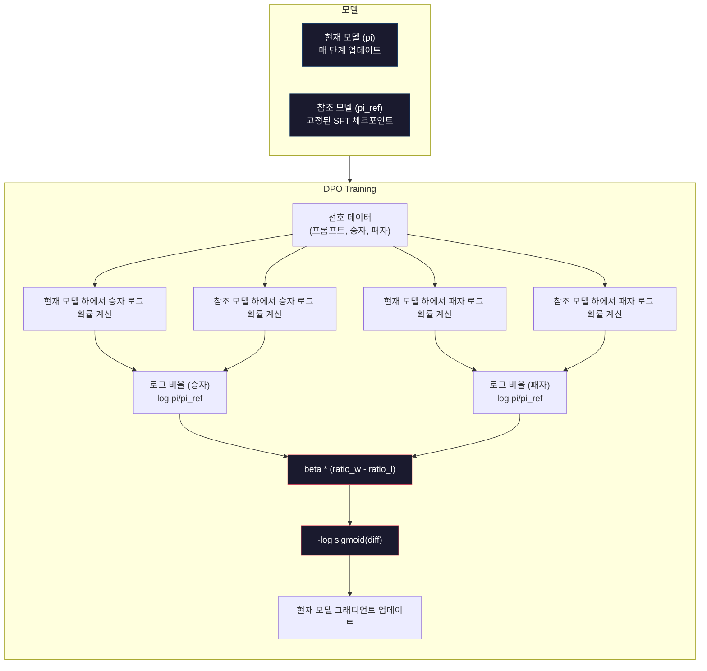

# DPO: 직접 선호 최적화

> RLHF는 효과가 있습니다. 하지만 SFT, 보상 모델, 정책 모델 3개를 훈련해야 하고, PPO의 불안정성을 관리해야 하며, KL 페널티를 조정해야 합니다. DPO는 질문합니다: 이 모든 과정을 건너뛸 수 있다면 어떨까요? DPO는 선호 쌍에 대해 언어 모델을 직접 최적화합니다. 보상 모델도 필요 없습니다. PPO도 필요 없습니다. 하나의 훈련 루프로 동일한 결과를 얻을 수 있습니다.

**유형:** 구축(Build)
**언어:** Python (NumPy 사용)
**사전 요구 사항:** 10단계, 07과(RLHF)
**소요 시간:** ~90분

## 학습 목표

- 별도의 보상 모델 없이 선호도 쌍에 대해 언어 모델을 직접 최적화하는 DPO(Direct Preference Optimization) 훈련 구현
- DPO 손실 함수 유도 및 정책의 로그 확률을 통해 보상 모델을 암묵적으로 표현하는 방법 설명
- 훈련 안정성, 계산 비용, 필요한 모델 수 측면에서 DPO vs RLHF(RL-based Human Feedback) 비교
- 훈련 정책이 참조 모델에서 얼마나 벗어날지 제어하는 베타(β) 파라미터 튜닝

## 문제 정의

레슨 07에서 RLHF 파이프라인을 구축했습니다. 세 단계. 세 모델. SFT 모델, 보상 모델, PPO로 최적화된 정책 모델입니다. 보상 모델만 해도 수천 개의 인간 선호도 쌍과 별도의 훈련 루프가 필요했습니다. PPO는 KL 계수, 학습률, 클리핑 비율, 에폭 수를 세심하게 조정해야 했습니다.

실제로 PPO 훈련은 악명 높게 불안정합니다. 작은 하이퍼파라미터 변경으로 훈련이 발산합니다. 보상 모델은 인간 선호도에 대한 불완전한 프록시이며, 정책 모델은 그 약점을 악용하는 방법을 찾습니다. KL 페널티는 도움이 되지만 자체 조정이 필요합니다 — 너무 낮으면 보상 해킹이 발생하고, 너무 높으면 모델이 거의 학습하지 못합니다.

이러한 복잡성 때문에 대부분의 오픈소스 모델은 InstructGPT가 발표된 후 수년간 RLHF에 어려움을 겪었습니다. 세 단계 파이프라인은 취약합니다. 각 단계마다 고유한 실패 모드가 있으며 오류가 누적됩니다.

2023년 5월, Rafael Rafailov, Archit Sharma 및 스탠포드 동료들은 "직접 선호도 최적화: 당신의 언어 모델은 비밀리에 보상 모델입니다"를 발표했습니다. 핵심 통찰: 별도의 보상 모델이 필요하지 않습니다. 최적의 보상 함수는 언어 모델 자체의 토큰 확률로 수학적으로 결정됩니다. 보상 모델을 완전히 건너뛰고 선호도 쌍에 대해 언어 모델을 직접 최적화할 수 있습니다.

DPO는 RLHF를 단일 지도 학습 단계로 축소합니다. 하나의 모델. 하나의 손실 함수. 하나의 훈련 루프. 강화 학습 없음. DPO를 대규모로 사용한 최초의 모델 중 하나인 Zephyr-7B는 여러 벤치마크에서 전체 RLHF로 훈련된 모델을 따라잡거나 능가했습니다. Meta는 Llama 3의 정렬 파이프라인에 DPO를 사용했습니다. Anthropic은 정렬 연구에서 DPO 스타일 방법을 인용했습니다.

## 개념

### 핵심 통찰

RLHF는 다음 목적 함수를 최적화합니다:

```
최대화: E[R(x, y)] - beta * KL(pi || pi_ref)
```

여기서 R은 보상 모델, pi는 정책, pi_ref는 참조 모델, beta는 KL 계수입니다.

DPO 논문은 이 목적 함수에 닫힌 형태의 최적해가 있음을 보였습니다. 임의의 보상 함수 R에 대해 최적 정책은 다음과 같습니다:

```
pi*(y | x) = pi_ref(y | x) * exp(R(x, y) / beta) / Z(x)
```

여기서 Z(x)는 정규화 상수입니다. 재배열하면:

```
R(x, y) = beta * log(pi*(y | x) / pi_ref(y | x)) + beta * log Z(x)
```

이것이 획기적인 발견입니다. 보상은 정책 모델의 확률과 참조 모델의 확률로만 표현됩니다. 별도의 보상 모델을 훈련할 필요가 없습니다. 보상은 *확률 비율*에 암묵적으로 포함되어 있습니다.

이를 Bradley-Terry 선호 모델에 대입하면:

```
P(y_w > y_l | x) = sigmoid(R(x, y_w) - R(x, y_l))
                  = sigmoid(beta * (log pi(y_w|x)/pi_ref(y_w|x) - log pi(y_l|x)/pi_ref(y_l|x)))
```

Z(x) 항은 두 응답이 동일한 프롬프트 x에 조건화되어 있기 때문에 상쇄됩니다. 남은 것은 선호되는 응답과 거부된 응답에 대한 정책 모델과 참조 모델의 로그 확률만을 함수로 하는 식입니다.

### DPO 손실 함수

```
L_DPO = -log(sigmoid(beta * (log pi(y_w|x)/pi_ref(y_w|x) - log pi(y_l|x)/pi_ref(y_l|x))))
```

각 구성 요소를 설명하면:

- **y_w** = 선호되는(승자) 응답
- **y_l** = 거부된(패자) 응답
- **x** = 프롬프트
- **pi** = 현재 모델(훈련 중)
- **pi_ref** = 참조 모델(고정된 SFT 체크포인트)
- **beta** = 참조 모델에서의 편차를 제어하는 온도 매개변수(일반적으로 0.1~0.5)

`log pi(y|x) / pi_ref(y|x)` 비율은 로그 확률 비율입니다. 이 비율이 양수면 현재 모델이 참조 모델보다 응답 y에 더 높은 확률을 할당합니다. 음수면 더 낮은 확률을 할당합니다.

DPO 손실 함수는 선호되는 응답에 대해 로그 확률 비율을 증가시키고 거부된 응답에 대해 감소시키도록 모델을 유도합니다. beta 매개변수는 모델이 참조 모델에서 얼마나 공격적으로 벗어날 수 있는지 제어합니다. 작은 beta는 큰 편차를 허용하고, 큰 beta는 모델을 참조 모델에 가깝게 유지합니다.



### DPO가 더 간단한 이유

| 측면 | RLHF (PPO) | DPO |
|--------|-----------|-----|
| 훈련할 모델 | 3개 (SFT + 보상 + 정책) | 1개 (정책만) |
| 훈련 루프 | 3개 (SFT, RM 훈련, PPO) | 2개 (SFT, DPO) |
| 하이퍼파라미터 | 학습률, KL 계수, 클리핑 비율, RM 학습률, 에포크 x3 | 학습률, beta, 에포크 |
| 보상 모델 | 필요 (별도 훈련) | 모델 확률에 암묵적 포함 |
| RL 알고리즘 | PPO (복잡, 불안정) | 지도 학습 (안정적) |
| GPU 메모리 | PPO 중 3-4개 모델 메모리 유지 | 2개 모델 (현재 + 참조) |
| 훈련 안정성 | 하이퍼파라미터에 민감 | SFT와 유사하게 견고 |

DPO는 훈련 중 현재 모델과 고정된 참조 모델 2개만 메모리에 필요합니다. RLHF는 정책, 참조, 보상 모델, 그리고 선택적으로 값 함수 기준선까지 3-4개가 필요합니다. 70B 모델의 경우 FP16에서 각 복사본이 140GB를 차지하므로 보상 모델을 제거하면 메모리 절약 효과가 큽니다.

### DPO가 RLHF를 능가하는 경우

**소규모 데이터셋.** 5,000-20,000개의 선호 쌍으로 DPO는 종종 RLHF와 동등하거나 더 나은 성능을 보입니다. RLHF의 보상 모델은 일반화를 위해 충분한 데이터가 필요합니다. 데이터가 부족하면 과적합되어 신뢰할 수 없는 보상 신호를 생성합니다. DPO는 보상 모델 자체가 필요 없어 이 문제를 우회합니다.

**제한된 계산 자원.** DPO는 전체 RLHF의 약 1/3 계산량만 필요합니다(3개 대신 1개 훈련 루프). 대규모 GPU 클러스터가 없는 팀에게 실용적인 선택입니다.

**신속한 반복.** 10개의 다른 선호 데이터셋을 시도하여 어떤 것이 최고 모델을 생성하는지 확인하고 싶나요? DPO는 각 실험을 몇 시간 내에 실행할 수 있습니다. RLHF는 각 데이터셋에 대해 보상 모델을 재훈련해야 합니다.

### RLHF가 DPO를 능가하는 경우

**대규모 훈련.** GPT-4 또는 Claude 규모에서 RLHF의 별도 보상 모델은 더 미묘한 선호 신호를 포착할 수 있습니다. 보상 모델은 복잡한 품질 기준에 적응하는 학습된 손실 함수 역할을 합니다.

**복잡한 보상 신호.** "더 나은" 것이 여러 차원(도움성, 무해성, 정직성)을 포함할 때 보상 모델은 이 다목적 트레이드오프를 학습할 수 있습니다. DPO는 각 선호 쌍을 이진 신호로 처리합니다. 하나는 더 좋고 하나는 더 나쁘다는 것만 알 뿐, 그 이유는 모델링하지 않습니다.

**반복적 정렬.** RLHF 파이프라인은 현재 정책으로 새 응답을 생성하고, 인간이 평가한 후 온라인 루프에서 보상 모델을 재훈련할 수 있습니다. DPO는 고정된 선호 쌍 데이터셋에서 작동합니다. Constitutional AI(Anthropic의 접근법)는 RLHF의 이 반복적 특성을 광범위하게 활용합니다.

### DPO를 넘어서: KTO, ORPO, SimPO

DPO는 단순화된 정렬 방법들의 계보를 영감을 주었습니다.

**KTO (Kahneman-Tversky 최적화, 2024):** 쌍이 필요 없습니다. KTO는 쌍이 없는 피드백으로 작동합니다. 각 응답을 대안과 비교하지 않고 "좋음" 또는 "나쁨"으로 라벨링합니다. 이는 데이터 수집을 크게 단순화합니다. 주석자에게 두 응답을 보여주고 "어떤 것이 더 나은가?"라고 묻는 대신, 하나의 응답을 보여주고 "이것이 좋은가?"라고 묻습니다. 손실 함수는 전망 이론의 손실 회피를 적용합니다. 나쁜 응답은 좋은 응답보다 더 큰 페널티를 받습니다.

**ORPO (승산 비율 선호 최적화, 2024):** SFT와 정렬을 단일 훈련 단계에서 결합합니다. 먼저 SFT를 수행한 후 DPO를 적용하는 대신, ORPO는 SFT 손실 함수에 선호 신호를 포함하도록 수정합니다. 손실 함수에는 두 항이 있습니다. 선호 응답에 대한 표준 다음 토큰 예측 손실과 선호 응답과 거부 응답 확률 간 격차를 증가시키는 승산 비율 항입니다. 두 단계 대신 하나의 훈련 루프로 충분합니다.

**SimPO (단순 선호 최적화, 2024):** 참조 모델을 완전히 제거합니다. 고정된 참조에 대한 로그 확률 비율 계산 대신, SimPO는 응답의 평균 로그 확률(길이로 정규화)을 암묵적 보상으로 사용합니다. 이는 메모리(참조 모델 불필요)를 절약하고 훈련을 단순화합니다. 길이 정규화는 모델이 더 짧은 응답을 선호하는 것을 방지합니다.

| 방법 | 연도 | 메모리 내 모델 | 쌍 필요? | 참조 필요? | 훈련 루프 |
|--------|------|-----------------|-------------|-----------------|----------------|
| RLHF | 2022 | 3-4 | 예 (RM용) | 예 | 3 |
| DPO | 2023 | 2 | 예 | 예 | 2 |
| KTO | 2024 | 2 | 아니오 (쌍 없음) | 예 | 2 |
| ORPO | 2024 | 1 | 예 | 아니오 | 1 |
| SimPO | 2024 | 1 | 예 | 아니오 | 1 |

경향은 명확합니다. 각 방법은 복잡성의 한 요소를 제거합니다. RLHF는 보상 모델과 PPO가 필요했습니다. DPO는 둘 다 제거했습니다. KTO는 쌍 데이터를 제거했습니다. ORPO는 별도의 SFT 단계를 제거했습니다. SimPO는 참조 모델을 제거했습니다. 기본 모델에서 정렬된 모델로 전환하는 데 드는 계산 및 복잡성 비용인 "정렬 세금"은 계속 감소하고 있습니다.

### 실제 DPO 적용 사례

**Zephyr-7B (HuggingFace, 2023년 10월):** Mistral 7B 베이스를 UltraChat(200K 예시)로 SFT한 후 UltraFeedback(60K 선호 쌍)으로 DPO를 적용했습니다. MT-Bench에서 6.47점을 기록했으며, 당시 최고 7B 모델이었습니다. 비교를 위해 Llama 2 Chat 70B는 6.86점을 기록했는데, 이는 Zephyr가 DPO 정렬만으로 10배 큰 모델의 94% 성능에 근접했음을 의미합니다.

**Llama 3 (Meta, 2024년 4월):** 초기 RLHF 단계 후 DPO를 사용했습니다. 이 조합은 DPO와 RLHF가 상호 보완적일 수 있음을 시사합니다. RLHF는 광범위한 정렬에, DPO는 표적 개선에 적합합니다.

**Neural Magic / nm-chat (2024):** 여러 오픈소스 모델에 DPO를 적용하여 SFT만 사용한 기준선 대비 정렬 벤치마크에서 5-15% 일관된 향상을 보였습니다.

## 구축 방법

### 1단계: 선호도 데이터셋

RLHF와 동일한 형식 — (프롬프트, 선호, 거부) 트리플. DPO는 중간 보상 모델 없이 이 데이터를 직접 소비합니다.

```python
import numpy as np
import sys
import os
sys.path.insert(0, os.path.join(os.path.dirname(__file__), "..", "..", "04-pre-training-mini-gpt", "code"))
from main import MiniGPT, LayerNorm, Embedding, TransformerBlock

PREFERENCE_DATA = [
    {
        "prompt": "프랑스의 수도는 무엇인가요?",
        "preferred": "프랑스의 수도는 파리입니다.",
        "rejected": "프랑스는 유럽의 국가입니다. 많은 도시가 있습니다. 수도는 파리입니다. 파리는 에펠탑으로 유명합니다.",
    },
    {
        "prompt": "중력을 한 문장으로 설명하세요.",
        "preferred": "중력은 질량을 가진 물체끼리 서로 끌어당기는 힘입니다.",
        "rejected": "중력은 물건을 떨어뜨리면 아래로 떨어지게 만드는 것입니다.",
    },
    {
        "prompt": "15 곱하기 7은 얼마인가요?",
        "preferred": "15 곱하기 7은 105입니다.",
        "rejected": "이 문제를 생각해봅시다. 15 곱하기 7. 10 곱하기 7은 70이고, 5 곱하기 7은 35이므로 답은 105일 수 있습니다.",
    },
    {
        "prompt": "프로그래밍 언어 세 가지를 말해주세요.",
        "preferred": "Python, Rust, TypeScript입니다.",
        "rejected": "많은 프로그래밍 언어가 있습니다. 인기 있는 언어로는 Python과 같은 다양한 언어들이 있습니다.",
    },
    {
        "prompt": "제2차 세계대전은 몇 년에 끝났나요?",
        "preferred": "제2차 세계대전은 1945년에 끝났습니다.",
        "rejected": "제2차 세계대전은 주요 글로벌 충돌이었습니다. 많은 국가가 참여했습니다. 전쟁은 1940년대 중반, 특히 1945년에 끝났습니다.",
    },
    {
        "prompt": "머신러닝을 정의하세요.",
        "preferred": "머신러닝은 알고리즘이 데이터로부터 패턴을 학습하여 명시적으로 프로그래밍되지 않아도 예측을 수행하는 분야입니다.",
        "rejected": "머신러닝은 AI의 한 유형입니다. AI는 인공 지능을 의미합니다. 머신러닝은 데이터를 사용하여 학습합니다.",
    },
]
```

### 2단계: 시퀀스 로그-확률

DPO 손실은 프롬프트가 주어졌을 때 응답의 총 로그-확률을 계산해야 합니다. 이는 (프롬프트 + 응답) 전체 시퀀스에 대해 모델을 실행하고 각 응답 토큰의 로그-확률을 합산하는 것을 의미합니다.

```python
def tokenize_sequence(text, vocab_size=256):
    return [min(t, vocab_size - 1) for t in list(text.encode("utf-8"))]


def compute_sequence_log_prob(model, prompt_tokens, response_tokens, max_seq_len=128):
    full_sequence = prompt_tokens + response_tokens
    if len(full_sequence) > max_seq_len:
        full_sequence = full_sequence[:max_seq_len]

    if len(full_sequence) < 2:
        return 0.0

    input_ids = np.array(full_sequence[:-1]).reshape(1, -1)
    target_ids = np.array(full_sequence[1:])

    logits = model.forward(input_ids)
    logits = logits[0]

    max_logits = logits.max(axis=-1, keepdims=True)
    log_probs = logits - max_logits - np.log(
        np.exp(logits - max_logits).sum(axis=-1, keepdims=True)
    )

    prompt_len = len(prompt_tokens)
    response_start = max(0, prompt_len - 1)
    response_end = len(target_ids)

    if response_start >= response_end:
        return 0.0

    response_log_probs = log_probs[response_start:response_end, :]
    response_targets = target_ids[response_start:response_end]

    total_log_prob = 0.0
    for i, target in enumerate(response_targets):
        total_log_prob += response_log_probs[i, target]

    return total_log_prob
```

이 함수는 DPO의 핵심 작업자입니다. 각 선호도 쌍에 대해 4번 실행됩니다: 선호 응답에 대한 모델, 거부 응답에 대한 모델, 선호 응답에 대한 참조 모델, 거부 응답에 대한 참조 모델. 이는 훈련 예제당 4번의 순전파입니다. RLHF의 생성 + 보상 점수 계산 + 가치 추정 + PPO 업데이트에 비해 더 간단하고 빠르며 안정적입니다.

### 3단계: DPO 손실

논문의 핵심을 코드로 구현. 하나의 함수. 하나의 손실. 보상 모델 없음.

```python
def sigmoid(x):
    return np.where(
        x >= 0,
        1.0 / (1.0 + np.exp(-x)),
        np.exp(x) / (1.0 + np.exp(x))
    )


def dpo_loss(policy_logprob_preferred, policy_logprob_rejected,
             ref_logprob_preferred, ref_logprob_rejected, beta=0.1):
    preferred_ratio = policy_logprob_preferred - ref_logprob_preferred
    rejected_ratio = policy_logprob_rejected - ref_logprob_rejected

    logit = beta * (preferred_ratio - rejected_ratio)

    loss = -np.log(sigmoid(logit) + 1e-8)

    preferred_reward = beta * preferred_ratio
    rejected_reward = beta * rejected_ratio

    return loss, {
        "preferred_ratio": float(preferred_ratio),
        "rejected_ratio": float(rejected_ratio),
        "logit": float(logit),
        "implicit_preferred_reward": float(preferred_reward),
        "implicit_rejected_reward": float(rejected_reward),
        "reward_margin": float(preferred_reward - rejected_reward),
    }
```

`preferred_ratio`와 `rejected_ratio`는 DPO 유도의 로그-확률 비율입니다. 현재 모델이 참조 모델에 비해 선호 응답에 더 높은 확률을 할당하고 거부 응답에 더 낮은 확률을 할당할 때, logit은 양수가 되고 손실은 낮아집니다. 훈련 신호는 정확히 이 방향으로 모델을 밀어줍니다.

`implicit_preferred_reward`와 `implicit_rejected_reward`는 DPO 손실이 암묵적으로 할당하는 보상입니다. 훈련이 제대로 작동하는지 확인하기 위해 추출할 수 있습니다 — 선호 보상과 거부 보상 사이의 마진은 훈련 과정에서 증가해야 합니다.

### 4단계: DPO 훈련 루프

표준 지도 학습 훈련 루프. PPO 없음. 보상 모델 없음. 순전파와 그래디언트 업데이트만.

```python
def copy_model_weights(source, target):
    target.embedding.token_embed = source.embedding.token_embed.copy()
    target.embedding.pos_embed = source.embedding.pos_embed.copy()
    target.ln_f.gamma = source.ln_f.gamma.copy()
    target.ln_f.beta = source.ln_f.beta.copy()
    for s_block, t_block in zip(source.blocks, target.blocks):
        t_block.attn.W_q = s_block.attn.W_q.copy()
        t_block.attn.W_k = s_block.attn.W_k.copy()
        t_block.attn.W_v = s_block.attn.W_v.copy()
        t_block.attn.W_out = s_block.attn.W_out.copy()
        t_block.ffn.W1 = s_block.ffn.W1.copy()
        t_block.ffn.W2 = s_block.ffn.W2.copy()
        t_block.ffn.b1 = s_block.ffn.b1.copy()
        t_block.ffn.b2 = s_block.ffn.b2.copy()
        t_block.ln1.gamma = s_block.ln1.gamma.copy()
        t_block.ln1.beta = s_block.ln1.beta.copy()
        t_block.ln2.gamma = s_block.ln2.gamma.copy()
        t_block.ln2.beta = s_block.ln2.beta.copy()


def dpo_train(policy_model, reference_model, preference_data,
              num_epochs=5, lr=5e-6, beta=0.1, max_seq_len=128):
    print(f"DPO 훈련: {len(preference_data)} 쌍, {num_epochs} 에포크, "
          f"lr={lr}, beta={beta}")
    print()

    losses = []
    margins = []

    for epoch in range(num_epochs):
        epoch_loss = 0.0
        epoch_margin = 0.0
        num_examples = 0

        indices = np.random.permutation(len(preference_data))

        for idx in indices:
            pair = preference_data[idx]

            prompt_tokens = tokenize_sequence(pair["prompt"])
            preferred_tokens = tokenize_sequence(pair["preferred"])
            rejected_tokens = tokenize_sequence(pair["rejected"])

            pi_logprob_w = compute_sequence_log_prob(
                policy_model, prompt_tokens, preferred_tokens, max_seq_len
            )
            pi_logprob_l = compute_sequence_log_prob(
                policy_model, prompt_tokens, rejected_tokens, max_seq_len
            )
            ref_logprob_w = compute_sequence_log_prob(
                reference_model, prompt_tokens, preferred_tokens, max_seq_len
            )
            ref_logprob_l = compute_sequence_log_prob(
                reference_model, prompt_tokens, rejected_tokens, max_seq_len
            )

            loss, metrics = dpo_loss(
                pi_logprob_w, pi_logprob_l,
                ref_logprob_w, ref_logprob_l, beta
            )

            update_direction = 1.0 if metrics["logit"] < 0 else -0.1
            for block in policy_model.blocks:
                block.ffn.W1 += lr * update_direction * np.random.randn(*block.ffn.W1.shape) * 0.01
                block.ffn.W2 += lr * update_direction * np.random.randn(*block.ffn.W2.shape) * 0.01

            epoch_loss += loss
            epoch_margin += metrics["reward_margin"]
            num_examples += 1
            losses.append(float(loss))
            margins.append(metrics["reward_margin"])

        avg_loss = epoch_loss / max(num_examples, 1)
        avg_margin = epoch_margin / max(num_examples, 1)

        print(f"  에포크 {epoch + 1}/{num_epochs} | 손실: {avg_loss:.4f} | "
              f"평균 마진: {avg_margin:.4f}")

    return policy_model, losses, margins
```

훈련 루프는 RLHF에 비해 상쾌하게 간단합니다. 각 선호도 쌍에 대해: 4개의 로그-확률(2개 모델, 2개 응답) 계산, DPO 손실에 입력, 그래디언트 계산, 정책 업데이트. 생성 단계 없음. 보상 모델 추론 없음. 이점 추정 없음. 클리핑 없음.

### 5단계: DPO vs RLHF 비교

암묵적 보상 마진과 로그-확률 변화를 측정하여 DPO를 7강의 RLHF 모델과 비교합니다.

```python
def evaluate_preference_accuracy(model, reference_model, preference_data, beta=0.1, max_seq_len=128):
    correct = 0
    total = 0

    for pair in preference_data:
        prompt_tokens = tokenize_sequence(pair["prompt"])
        preferred_tokens = tokenize_sequence(pair["preferred"])
        rejected_tokens = tokenize_sequence(pair["rejected"])

        pi_w = compute_sequence_log_prob(model, prompt_tokens, preferred_tokens, max_seq_len)
        pi_l = compute_sequence_log_prob(model, prompt_tokens, rejected_tokens, max_seq_len)
        ref_w = compute_sequence_log_prob(reference_model, prompt_tokens, preferred_tokens, max_seq_len)
        ref_l = compute_sequence_log_prob(reference_model, prompt_tokens, rejected_tokens, max_seq_len)

        preferred_reward = beta * (pi_w - ref_w)
        rejected_reward = beta * (pi_l - ref_l)

        if preferred_reward > rejected_reward:
            correct += 1
        total += 1

    return correct / max(total, 1)


def analyze_implicit_rewards(model, reference_model, preference_data, beta=0.1, max_seq_len=128):
    print("암묵적 보상 분석:")
    print("-" * 65)
    print(f"  {'프롬프트':<30} {'선호 보상':>12} {'거부 보상':>12} {'마진':>10}")
    print("  " + "-" * 60)

    for pair in preference_data:
        prompt_tokens = tokenize_sequence(pair["prompt"])
        preferred_tokens = tokenize_sequence(pair["preferred"])
        rejected_tokens = tokenize_sequence(pair["rejected"])

        pi_w = compute_sequence_log_prob(model, prompt_tokens, preferred_tokens, max_seq_len)
        pi_l = compute_sequence_log_prob(model, prompt_tokens, rejected_tokens, max_seq_len)
        ref_w = compute_sequence_log_prob(reference_model, prompt_tokens, preferred_tokens, max_seq_len)
        ref_l = compute_sequence_log_prob(reference_model, prompt_tokens, rejected_tokens, max_seq_len)

        pref_reward = beta * (pi_w - ref_w)
        rej_reward = beta * (pi_l - ref_l)
        margin = pref_reward - rej_reward

        truncated = pair["prompt"][:28] + ".." if len(pair["prompt"]) > 30 else pair["prompt"]
        print(f"  {truncated:<30} {pref_reward:>12.4f} {rej_reward:>12.4f} {margin:>10.4f}")

    print()
```

### 6단계: 베타 민감도 분석

베타 매개변수는 RLHF의 KL 계수에 해당합니다. 모델이 참조 모델에서 얼마나 벗어날 수 있는지 제어합니다. 이 실험은 그 효과를 보여줍니다.

```python
def beta_sensitivity_analysis(sft_model, preference_data, betas, max_seq_len=128):
    print("베타 민감도 분석")
    print("-" * 60)
    print(f"  {'베타':>8} {'최종 손실':>12} {'최종 마진':>14} {'정확도':>10}")
    print("  " + "-" * 55)

    results = []

    for beta in betas:
        policy = MiniGPT(
            vocab_size=256, embed_dim=128, num_heads=4,
            num_layers=4, max_seq_len=max_seq_len, ff_dim=512
        )
        reference = MiniGPT(
            vocab_size=256, embed_dim=128, num_heads=4,
            num_layers=4, max_seq_len=max_seq_len, ff_dim=512
        )
        copy_model_weights(sft_model, policy)
        copy_model_weights(sft_model, reference)

        policy, losses, margins_list = dpo_train(
            policy, reference, preference_data,
            num_epochs=3, lr=5e-6, beta=beta, max_seq_len=max_seq_len
        )

        accuracy = evaluate_preference_accuracy(
            policy, reference, preference_data, beta, max_seq_len
        )

        final_loss = losses[-1] if losses else 0
        final_margin = margins_list[-1] if margins_list else 0

        print(f"  {beta:>8.3f} {final_loss:>12.4f} {final_margin:>14.4f} {accuracy:>10.1%}")
        results.append({
            "beta": beta,
            "final_loss": final_loss,
            "final_margin": final_margin,
            "accuracy": accuracy,
        })

        print()

    return results
```

작은 베타(0.01)는 모델이 참조 모델에서 자유롭게 벗어나게 합니다 — 빠른 학습이지만 퇴화된 솔루션의 위험이 있습니다. 큰 베타(1.0)는 모델을 참조 모델에 가깝게 유지합니다 — 안정적이지만 학습이 느립니다. 대부분의 응용 분야에서 최적의 값은 0.1에서 0.3 사이입니다.

## 사용 방법

### 전체 DPO 파이프라인 데모

```python
if __name__ == "__main__":
    np.random.seed(42)

    print("=" * 70)
    print("DPO: DIRECT PREFERENCE OPTIMIZATION")
    print("=" * 70)
    print()

    print("STEP 1: SFT 모델 초기화 (Lesson 06에서)")
    print("-" * 50)
    sft_model = MiniGPT(
        vocab_size=256, embed_dim=128, num_heads=4,
        num_layers=4, max_seq_len=128, ff_dim=512
    )
    print(f"  파라미터 수: {sft_model.count_parameters():,}")
    print()

    print("STEP 2: DPO 학습")
    print("-" * 50)

    policy_model = MiniGPT(
        vocab_size=256, embed_dim=128, num_heads=4,
        num_layers=4, max_seq_len=128, ff_dim=512
    )
    reference_model = MiniGPT(
        vocab_size=256, embed_dim=128, num_heads=4,
        num_layers=4, max_seq_len=128, ff_dim=512
    )
    copy_model_weights(sft_model, policy_model)
    copy_model_weights(sft_model, reference_model)

    policy_model, losses, margins = dpo_train(
        policy_model, reference_model, PREFERENCE_DATA,
        num_epochs=5, lr=5e-6, beta=0.1
    )
    print()

    print("=" * 70)
    print("STEP 3: 평가")
    print("=" * 70)
    print()

    pre_accuracy = evaluate_preference_accuracy(
        sft_model, reference_model, PREFERENCE_DATA, beta=0.1
    )
    post_accuracy = evaluate_preference_accuracy(
        policy_model, reference_model, PREFERENCE_DATA, beta=0.1
    )

    print(f"  선호도 정확도 (DPO 전):  {pre_accuracy:.1%}")
    print(f"  선호도 정확도 (DPO 후): {post_accuracy:.1%}")
    print()

    analyze_implicit_rewards(policy_model, reference_model, PREFERENCE_DATA, beta=0.1)

    print("=" * 70)
    print("STEP 4: 학습 동역학")
    print("=" * 70)
    print()

    if losses:
        print("  손실 곡선:")
        window = max(1, len(losses) // 5)
        for i in range(0, len(losses), window):
            chunk = losses[i:i + window]
            avg = sum(chunk) / len(chunk)
            print(f"    단계 {i:3d}-{i + len(chunk) - 1:3d}: 손실 = {avg:.4f}")
        print()

    if margins:
        print("  보상 마진 곡선:")
        window = max(1, len(margins) // 5)
        for i in range(0, len(margins), window):
            chunk = margins[i:i + window]
            avg = sum(chunk) / len(chunk)
            print(f"    단계 {i:3d}-{i + len(chunk) - 1:3d}: 마진 = {avg:.4f}")
        print()

    print("=" * 70)
    print("STEP 5: 베타 민감도")
    print("=" * 70)
    print()

    beta_results = beta_sensitivity_analysis(
        sft_model, PREFERENCE_DATA, betas=[0.01, 0.1, 0.3, 1.0]
    )

    print("=" * 70)
    print("DPO vs RLHF 비교")
    print("=" * 70)
    print()
    print("  DPO 장점:")
    print("    - 1개의 학습 루프 (RLHF는 3개 필요)")
    print("    - 메모리 내 2개 모델 (RLHF는 3-4개 필요)")
    print("    - 지도 학습 (RL보다 안정적)")
    print("    - 훈련할 보상 모델 불필요")
    print()
    print("  RLHF 장점:")
    print("    - 별도의 보상 모델이 복잡한 선호도 포착")
    print("    - 온라인 학습: 생성, 평가, 재훈련")
    print("    - 다중 목표 정렬에 적합")
    print("    - 대규모에서 검증됨 (GPT-4, Claude)")
    print()
    print("  실용적 지침:")
    print("    - DPO로 시작. 더 간단하고 종종 충분함.")
    print("    - DPO가 평가 지표에서 정체되면 RLHF로 전환.")
    print("    - 많은 프로덕션 시스템은 둘 다 사용: RLHF 먼저, DPO로 세부 조정.")
```

## Ship It

이 레슨은 `outputs/prompt-alignment-method-selector.md`를 생성합니다. 이 프롬프트는 사용 사례에 적합한 정렬 방법(SFT, RLHF, DPO, KTO, ORPO, SimPO)을 선택하는 데 도움을 줍니다. 데이터 가용성, 컴퓨팅 예산, 정렬 목표를 고려하여 적합한 방법과 학습 계획을 추천합니다.

## 연습 문제

1. KTO(Kahneman-Tversky Optimization)를 구현하세요. KTO는 쌍이 필요하지 않으며, 각 응답에 대해 "good" 또는 "bad"로 레이블을 지정하면 됩니다. "good" 응답에 대한 손실은 `-log(sigmoid(beta * log_ratio))`이고, "bad" 응답에 대한 손실은 `-log(1 - sigmoid(beta * log_ratio))`입니다. "bad" 응답 손실에는 손실 회피 승수(일반적으로 1.5x)를 적용합니다. 동일한 데이터(선호되는 응답을 "good"으로, 거부된 응답을 "bad"로 독립적으로 처리)로 학습하고 DPO 대비 정확도를 비교하세요.

2. 길이 정규화된 DPO를 구현하세요. 원시 로그 확률 대신 응답 토큰 수로 나눕니다: `normalized_logprob = total_logprob / num_tokens`. 이렇게 하면 모델이 더 짧은 응답을 선호하는 문제(더 높은 총 로그 확률)를 방지할 수 있습니다. 정규화 적용 전후의 암시적 보상 마진을 비교하세요.

3. ORPO 스타일의 결합 손실을 구축하세요. DPO 손실에 선호되는 응답에 대한 표준 다음 토큰 예측 손실을 추가합니다: `L = L_sft(preferred) + alpha * L_dpo`. alpha 값으로 0.1, 0.5, 1.0을 시도해 보세요. 결합 손실은 명령 따르기(SFT 항)와 더 나은 응답 선호(DPO 항)를 동시에 수행하는 모델을 생성하여 별도의 SFT 단계가 필요 없게 해야 합니다.

4. 반복적 DPO를 구현하세요. 3 epoch 동안 DPO를 실행한 후, 훈련된 모델에서 새로운 응답을 생성하고, 이를 원래 선호 응답과 새로운 선호 쌍으로 페어링한 후 다시 DPO를 실행합니다. 이 "자기 대국" 과정을 2회 반복합니다. 1회차와 2회차 후 선호 정확도를 비교하여 반복적 개선이 도움이 되는지 확인하세요.

5. 다양한 참조 모델을 사용한 DPO를 비교하세요. SFT 체크포인트를 참조 모델로 사용하는 대신 다음을 시도해 보세요: (a) 기본 모델(SFT 이전), (b) DPO 1 epoch 체크포인트, (c) 정책 모델의 지수 이동 평균. 어떤 참조 모델이 가장 높은 선호 정확도와 가장 안정적인 학습 곡선을 생성하는지 보고하세요.

## 주요 용어

| 용어 | 사람들이 말하는 표현 | 실제 의미 |
|------|----------------|----------------------|
| DPO | "RLHF 없이 RL" | 직접 선호 최적화(Direct Preference Optimization): 보상 모델과 PPO를 우회하여 선호 쌍에 대해 언어 모델을 직접 최적화하는 지도 학습 알고리즘 |
| 암시적 보상 | "보상이 모델 안에 있다" | 보상 함수는 정책 모델과 참조 모델 간의 로그-확률 비율에 의해 결정됨 -- 별도의 보상 모델 불필요 |
| 베타(DPO) | "온도" | 정책 모델이 참조 모델에서 얼마나 벗어날 수 있는지 제어 -- 작은 베타는 큰 편차 허용, 큰 베타는 모델을 참조 모델에 가깝게 유지 |
| 로그-확률 비율 | "모델이 얼마나 변화했는지" | log pi(y|x) - log pi_ref(y|x) -- 양수 값은 현재 모델이 참조 모델보다 더 높은 확률을 할당함을 의미 |
| 참조 모델 | "동결된 체크포인트" | 가중치가 절대 변경되지 않는 SFT 모델 복사본 -- 확률 비율 계산의 기준점 역할 |
| KTO | "쌍 없이 DPO" | 카너먼-트버스키 최적화(Kahneman-Tversky Optimization): 선호 쌍 대신 "좋음" 또는 "나쁨" 레이블이 지정된 비쌍 데이터로 작동 |
| ORPO | "한 단계 정렬" | 승산 비율 선호 최적화(Odds Ratio Preference Optimization): SFT 손실에 선호 항을 추가하여 SFT와 정렬을 단일 훈련 루프로 결합 |
| SimPO | "참조 모델 불필요" | 단순 선호 최적화(Simple Preference Optimization): 길이 정규화된 평균 로그 확률을 암시적 보상으로 사용하여 참조 모델 제거 |
| 정렬 비용 | "모델 안전화의 대가" | 기본 모델에서 정렬된 모델로 전환하는 데 필요한 추가 계산, 데이터 및 복잡성 -- DPO는 이를 크게 감소시킴 |

## 추가 자료

- [Rafailov et al., 2023 -- "직접 선호 최적화: 당신의 언어 모델은 비밀리에 보상 모델이다"](https://arxiv.org/abs/2305.18290) -- RLHF에서 지도 학습으로의 정렬 간소화를 제시한 DPO 논문
- [Tunstall et al., 2023 -- "제피어: LM 정렬의 직접 증류"](https://arxiv.org/abs/2310.16944) -- UltraFeedback에서 DPO가 벤치마크에서 RLHF와 동등함을 보인 Zephyr-7B
- [Ethayarajh et al., 2024 -- "KTO: 전망 이론 최적화로서의 모델 정렬"](https://arxiv.org/abs/2402.01306) -- 쌍별 선호 필요성 제거
- [Hong et al., 2024 -- "ORPO: 참조 모델 없는 단일체 선호 최적화"](https://arxiv.org/abs/2403.07691) -- SFT와 정렬을 한 단계로 통합
- [Meng et al., 2024 -- "SimPO: 참조 없는 보상을 이용한 단순 선호 최적화"](https://arxiv.org/abs/2405.14734) -- 참조 모델 완전 제거
- [Llama 3 기술 보고서](https://arxiv.org/abs/2407.21783) -- RLHF와 DPO를 결합한 Meta의 정렬 파이프라인