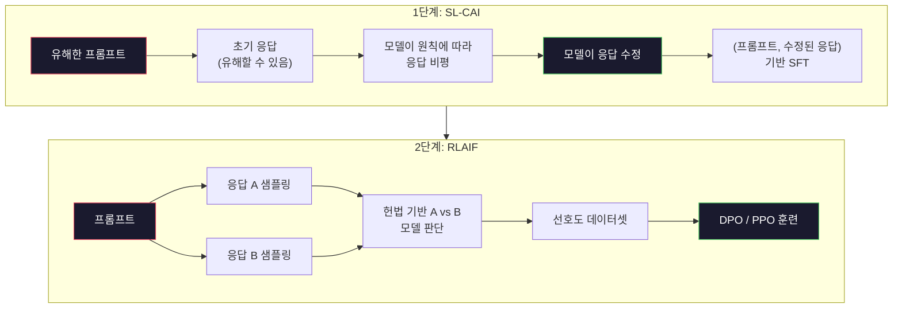
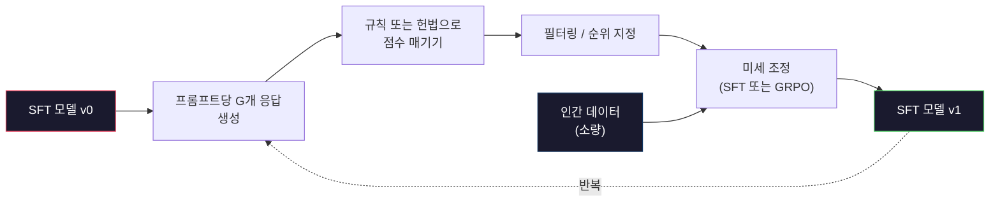

# 헌법 기반 AI와 자기 개선

> RLHF는 인간 개입이 필요합니다. 헌법 기반 AI는 대부분의 인간 역할을 모델 자체로 대체합니다. 원칙 목록을 작성하고, 모델이 해당 원칙에 따라 자신의 출력을 비판하도록 한 후, 비판 내용을 바탕으로 학습시킵니다. DeepSeek-R1은 2025년에 이를 더 발전시켰습니다: 모델이 수백만 개의 추론 과정을 생성하게 하고, 규칙으로 평가한 후 GRPO를 실행합니다. 2026년 최첨단 모델에서 "정렬 작업"의 대부분은 모델 자체의 정렬 작업입니다. 이 레슨은 두 가지 루프를 모두 구축합니다.

**유형:** 구축
**언어:** Python (표준 라이브러리 + NumPy)
**선수 조건:** 10단계, 레슨 06-08 (SFT, RLHF, DPO)
**소요 시간:** ~45분

## 학습 목표

- 헌법 AI(Constitutional AI) 2단계 루프 구현: 자기 비판(self-critique) 및 자기 수정(self-revision) 후 수정된 쌍에 대한 선호 학습(preference training)
- GRPO(Ground Truth Relative Policy Optimization) 목적 함수(DeepSeek-R1의 그룹 상대 정책 최적화) 유도 및 PPO의 가치 함수 기준(value-function baseline)과의 비교
- 규칙 기반 결과 보상(rule-based outcome rewards)으로 검증 가능한 추론 흔적(verifiable reasoning traces) 생성 및 별도의 보상 모델(reward model) 없이 점수 매기기
- 자기 개선(self-improvement)이 인간 선호 데이터를 능가하는 경우와 모드 탐색(mode seeking)으로 붕괴되는 경우 판단 기준 수립

## 문제 정의

Lesson 07에서 RLHF를, Lesson 08에서 DPO를 구축했습니다. 둘 다 동일한 고비용 입력인 인간 선호도 쌍에 의존합니다. Anthropic의 InstructGPT 시대 파이프라인은 약 33,000개의 비교를 사용했습니다. Llama 2 Chat은 150만 개 이상을 사용했으며, Claude 3는 더 많은 양을 사용했습니다. 이 데이터는 생성 속도가 느리고 비용이 많이 들며, 평가자가 평가 당일에 우연히 믿은 내용에 편향될 수 있습니다.

2022년 Constitutional AI 논문은 간단한 질문을 던졌습니다. 모델이 직접 선호도 레이블을 생성하면 어떨까요? "헌법"이라는 문서화된 원칙 목록을 제공하고, 모델이 자신의 응답을 비평하게 합니다. 이 비평이 훈련 신호가 됩니다.

2024년 DeepSeek는 이 아이디어를 더 발전시켰습니다. 검증 가능한 결과(수학 문제의 정답, 테스트 통과/실패하는 코드, 승리/패배가 명확한 게임 등)가 있는 모든 작업에 대해 비평가 단계를 완전히 생략할 수 있음을 보였습니다. 여러 후보 솔루션을 생성한 후, 결정론적 규칙으로 각각을 평가합니다. 보상에 대해 정책 경사 알고리즘을 실행합니다. DeepSeek-R1은 거의 인간 선호도 데이터 없이 이 방식으로 훈련되었으며, o1-클래스 추론 성능을 달성했습니다.

이 두 가지 루프—주관적 행동을 위한 Constitutional AI와 검증 가능한 행동을 위한 규칙 기반 RL—는 2026년의 주요 정렬(alignment) 레시피입니다. 이전에 RLHF에 사용되던 인간 선호도 예산은 이제 훨씬 더 작은 단계에 투자됩니다. 즉, 헌법을 선택하고 보상 규칙을 선택하는 데 사용됩니다.

## 개념

### 헌법 AI 루프

Bai et al. (2022)는 파이프라인을 두 단계로 구조화했습니다.

**1단계: AI 피드백 기반 지도 학습(SL-CAI).** 도움이 되지만 유해할 수 있는 SFT 모델로 시작합니다. 잠재적으로 유해한 요청으로 프롬프트를 입력합니다. 각 응답에 대해 *동일한 모델*에게 헌법 원칙에 따라 응답을 비평한 후 수정하도록 요청합니다. 수정된 응답으로 미세 조정합니다. 데이터셋은 (프롬프트, 수정된 응답) 쌍입니다.

**2단계: AI 피드백 기반 강화 학습(RLAIF).** 응답 쌍을 샘플링합니다. 모델에게 어떤 응답이 헌법을 더 잘 따르는지 판단하도록 요청합니다. 쌍별 선호도는 보상 모델을 훈련시킵니다. 그런 다음 해당 보상을 사용하여 PPO 또는 DPO를 실행합니다. RLHF와의 주요 차이점: 선호도는 인간이 아닌 모델에서 비롯됩니다.



헌법이 핵심 레버입니다. Anthropic의 원본은 16개 원칙(후에 확장)을 가졌습니다. 원칙은 "다양한 문화적 배경을 가진 사람들에게 가장 덜 불쾌할 응답을 선택해주세요"와 같은 형식입니다. 각 단계에서 원칙을 무작위로 선택하거나 프롬프트 범주에 따라 선택합니다.

### 헌법의 실제 역할

헌법은 정렬 계약을 *데이터*에서 *텍스트*로 이동시킵니다. RLHF에서 행동을 변경하려면 수천 개의 쌍을 재라벨링해야 합니다. CAI에서 행동을 변경하려면 단락을 편집하면 됩니다. 이것이 주요 실용적 이점입니다.

비용이 발생합니다. 모델의 자체 판단은 초기 보정에 따라 달라집니다. SFT 모델에 맹점이 있다면(예: 조작적 표현을 인식하지 못함) 비평 단계도 그 맹점을 물려받습니다. CAI는 정렬 루프를 압축하지만 기본 모델의 한계를 넘어서는 신호를 증폭할 수 없습니다. 따라서 모든 프로덕션 CAI 파이프라인은 여전히 일부 인간 선호도 데이터를 사용하며, 일반적으로 순수 RLHF의 5-10% 분량입니다.

### GRPO: 그룹 상대 정책 최적화

DeepSeek은 DeepSeekMath 논문(2024)에서 GRPO를 소개하고 DeepSeek-R1(2025)의 백본으로 사용했습니다. GRPO는 가치 함수를 제거한 PPO 변형입니다.

PPO의 목적 함수(레슨 07 참조):

```
L_PPO = E[min(r(theta) * A, clip(r(theta), 1-eps, 1+eps) * A)]
```

여기서 `A`는 일반적으로 학습된 가치 네트워크 `V(s)`로 추정되는 어드밴티지입니다. 가치 네트워크는 정책과 동일한 크기의 두 번째 모델입니다. 메모리를 두 배로 사용하고 별도의 훈련 루프를 도입합니다.

GRPO는 가치 함수를 제거합니다. 각 프롬프트에 대해 G개의 응답 그룹(일반적으로 G=16 또는 64)을 샘플링합니다. 각 응답의 보상을 계산한 후 그룹 내에서 정규화합니다:

```
A_i = (r_i - mean(r_1, ..., r_G)) / std(r_1, ..., r_G)
```

어드밴티지는 형제 응답 대비 해당 응답의 보상 z-점수입니다. 가치 함수가 필요 없습니다. 그룹이 자체 기준선 역할을 합니다.

```
L_GRPO = E[min(r(theta) * A_group, clip(r(theta), 1-eps, 1+eps) * A_group)] - beta * KL(pi || pi_ref)
```

참조 모델 대비 KL 페널티는 PPO와 동일합니다. 클리핑 비율도 동일합니다. 사라진 것은 별도의 비평가 모델입니다.

### GRPO가 추론에 중요한 이유

추론 작업에서 보상은 종종 희소하고 이진입니다: 최종 답변이 맞거나 틀립니다. 희소 이진 보상으로 훈련된 가치 함수는 낭비입니다. 최종 단계 전까지 거의 모든 상태에서 동일한 기대 보상을 가지므로 유용한 중간 추정을 학습할 수 없습니다. GRPO의 그룹 정규화는 즉각적인 상대 신호를 제공합니다: 동일한 수학 문제에 대한 16번의 시도 중 어떤 시도가 평균 이상이었는가?

이것은 규칙 기반 보상에서도 얻는 정확한 신호 형태입니다:

- **수학**: sympy 또는 기호 체커가 최종 답변 일치 여부를 결정합니다.
- **코드**: 테스트 스위트가 통과/실패를 결정합니다.
- **포맷팅**: 정규 표현식이 필수 XML 태그 내 답변 여부를 결정합니다.
- **다단계 증명**: 증명 보조 도구(Lean, Coq)가 유효성을 결정합니다.

DeepSeek-R1-Zero는 수학 벤치마크 정확도와 포맷 준수(`<answer>` 태그 내 답변) 두 가지 보상만으로 훈련되었습니다. 인간 선호도 없음. 비평가 모델 없음. DeepSeek 논문에서 설명한 "아하 순간" — 모델이 자발적으로 자기 검증과 역추적을 학습 — 은 희소 규칙 보상에 대한 GRPO에서 비롯되었습니다.

### 프로세스 보상 모델 vs 결과 보상 모델

여전히 설계 선택이 있습니다: 최종 답변에 보상(결과 보상 모델, ORM)하거나 각 중간 단계에 보상(프로세스 보상 모델, PRM)합니다.

| 축 | ORM | PRM |
|------|-----|-----|
| 트레이스당 신호 | 1개 숫자 | N개 숫자(단계별 1개) |
| 감독 출처 | 최종 답변 확인 | 단계별 라벨 또는 자체 판단 |
| 훈련 비용 | 저렴 | 고가 |
| 신용 할당 | 희소, 노이즈 많음 | 밀집, 표적화 |
| 보상 해킹 위험 | 낮음 | 높음(모델이 PRM 아티팩트 최적화) |
| 사용처 | DeepSeek-R1, R1-Zero | OpenAI o1(추정), Math-Shepherd |

2024-2025년 합의는 ORM + GRPO가 PRM보다 확장성이 더 좋다는 것입니다. PRM은 토큰당 샘플 효율성은 높지만 비용이 많이 드는 단계별 라벨이 필요하며, PRM에 좋아 보이지만 증명을 진전시키지 않는 단계를 작성하는 등의 단축 행동으로 붕괴되는 경향이 있습니다. 대부분의 팀에게 ORM + GRPO는 첫 번째 시도 대상입니다.

### 자기 개선: 피드백 승수

두 루프 패턴(비평/수정 및 규칙 보상 기반 그룹 상대 RL)을 확보하면 이를 연결할 수 있습니다.

1. SFT 모델로 시작합니다.
2. 프롬프트당 많은 후보 응답을 생성합니다.
3. 규칙 기반 보상(검증 가능한 작업) 또는 헌법 비평가(주관적 작업)로 점수를 매깁니다.
4. 상위 후보를 새로운 SFT 데이터 또는 선호도 쌍으로 유지합니다.
5. 미세 조정합니다. 개선된 모델로 2단계로 이동합니다.

DeepSeek은 R1-Zero 이후 적용된 이 방식을 "거부 샘플링 미세 조정"이라고 불렀습니다. Anthropic은 이전 버전을 "헌법 AI 증류"라고 불렀습니다. 패턴은: 각 반복은 모델에 이미 있는 신호를 증폭합니다. 새로운 신호를 추가하지 않습니다. 모델이 문제 클래스 X를 전혀 해결할 수 없다면, 자기 개선으로도 그 능력을 생성할 수 없습니다.

위험은 모드 붕괴입니다. 자기 생성 데이터는 항상 훈련 코퍼스보다 좁은 분포입니다. 3-5회의 자기 증류 후 모델은 일반적으로 창의적 작업에서 다양성을 잃고, 과신하며, 특징적인 "AI 음성"(반복된 표현, 공식적 구조)을 나타냅니다. 프로덕션 파이프라인은 분포를 정직하게 유지하기 위해 소량의 신선한 인간 데이터와 자기 생성 데이터를 혼합합니다.



### 어떤 방법을 언제 사용할까

- **순수 CAI**: 주관적 행동(톤, 안전, 거부 스타일). 잘 정의된 헌법이 있습니다. 깨끗한 검증 가능한 결과가 없습니다.
- **GRPO + ORM**: 검증 가능한 작업(수학, 코드, 구조화된 추출). 정확성을 저렴하게 확인할 수 있습니다. 보상은 희소하고 이진입니다.
- **자기 생성 쌍에 대한 DPO**: 하이브리드. 헌법으로 선호도 쌍을 생성한 후 PPO/GRPO 대신 DPO(레슨 08)로 훈련합니다.
- **전체 RLHF**: 규칙이나 짧은 헌법으로 표현할 수 없는 다목적 트레이드오프가 필요할 때 여전히 적절합니다.

대부분의 2026년 프론티어 파이프라인은 네 가지를 모두 실행합니다. 안전 계층을 위한 CAI. 추론 후훈련 패스를 위한 GRPO. 선호도 폴리싱을 위한 DPO. 다른 방법에 저항하는 잔여 행동을 위한 소량의 RLHF 패스.

## 구축 방법

이 코드는 순수 Python + numpy로 세 가지 기능을 구현합니다. 헌법 기반 AI 자기 비판 루프, 단순 산술을 위한 규칙 기반 보상 체커, 그리고 Lesson 04의 소형 언어 모델에서 실행되는 최소 GRPO 트레이너입니다.

### 1단계: 헌법

원칙들의 목록입니다. 실제 시스템에서는 각 줄이 더 풍부하고 카테고리가 태깅됩니다. 강의에서는 간단히 유지합니다.

```python
CONSTITUTION = [
    "응답은 질문 회피 없이 직접 답변해야 합니다.",
    "응답은 불필요한 채움이나 패딩을 포함하지 않아야 합니다.",
    "질문에 단일 숫자 답이 있는 경우, 숫자를 명확히 명시해야 합니다.",
    "응답은 합리적이고 무해한 요청을 거부하지 않아야 합니다.",
]
```

### 2단계: 자기 비판 및 수정

실제 시스템에서는 모델 자체가 비판합니다. 강의에서는 LLM 호출 없이 파이프라인이 실행되도록 수작업 평가 기준으로 비평가를 시뮬레이션합니다.

```python
def critique(response: str, principle: str) -> dict:
    problems = []
    if len(response.split()) > 40 and "plainly" in principle:
        problems.append("추가 문구에 답이 묻힘")
    if response.strip().lower().startswith(("i can't", "i cannot", "as an ai")):
        problems.append("불필요한 거부")
    if response.count(",") > 4:
        problems.append("과도한 회피")
    return {"principle": principle, "problems": problems}

def revise(response: str, critique_result: dict) -> str:
    if "answer buried" in " ".join(critique_result["problems"]):
        return response.split(".")[-2].strip() + "."
    if "unwarranted refusal" in " ".join(critique_result["problems"]):
        return "답변은 다음과 같습니다: " + response.split(":")[-1].strip()
    return response
```

수정 함수는 임시 대체물입니다. 실제 LLM에서는 "비평을 고려하여 응답을 다시 작성하세요"라는 두 번째 프롬프트가 됩니다.

### 3단계: 규칙 기반 보상

검증 가능한 작업의 경우 비평가를 완전히 대체합니다. 이 체커는 산술 답을 평가합니다.

```python
import re

def reward_math(prompt: str, response: str) -> float:
    try:
        expected = eval(prompt.replace("What is ", "").replace("?", "").strip())
    except Exception:
        return 0.0
    numbers = re.findall(r"-?\d+", response)
    if not numbers:
        return 0.0
    return 1.0 if int(numbers[-1]) == expected else 0.0

def reward_format(response: str) -> float:
    return 1.0 if re.search(r"<answer>.*</answer>", response) else 0.0
```

두 가지 결정적 규칙입니다. 학습 데이터도, 인간 라벨도 없습니다. 결합된 보상은 `reward_math + 0.1 * reward_format`로, 형식 누락은 처벌하지만 정확성을 가리지 않습니다.

### 4단계: 그룹 상대 우위

동일 프롬프트에 대한 응답 그룹 보상 목록이 주어졌을 때 z-점수를 계산합니다.

```python
import numpy as np

def group_relative_advantage(rewards: list[float]) -> np.ndarray:
    r = np.array(rewards, dtype=float)
    if r.std() < 1e-8:
        return np.zeros_like(r)
    return (r - r.mean()) / (r.std() + 1e-8)
```

그룹 내 모든 샘플이 동일한 보상을 가지면 우위는 0이고 그래디언트 신호가 흐르지 않습니다. 이는 특징입니다. 현재 정책에 대해 프롬프트가 사소하게 해결되거나 불가능함을 알려주며, 이 단계는 건너뛸 수 있습니다.

### 5단계: GRPO 업데이트

한 단계, 기호적 그래디언트입니다. 실제 시스템에서는 torch autograd 패스가 됩니다. 여기서는 업데이트 규칙을 직접 보여줍니다.

```python
def grpo_step(policy_logprobs: np.ndarray, ref_logprobs: np.ndarray,
              advantages: np.ndarray, beta: float = 0.01, clip_eps: float = 0.2) -> dict:
    ratios = np.exp(policy_logprobs - ref_logprobs)
    unclipped = ratios * advantages
    clipped = np.clip(ratios, 1 - clip_eps, 1 + clip_eps) * advantages
    policy_loss = -np.minimum(unclipped, clipped).mean()
    kl = (ref_logprobs - policy_logprobs).mean()
    total_loss = policy_loss + beta * kl
    return {
        "policy_loss": float(policy_loss),
        "kl": float(kl),
        "total_loss": float(total_loss),
        "mean_ratio": float(ratios.mean()),
    }
```

이것은 PPO의 클리핑된 대리 함수에 한 가지 변경사항이 있습니다. 우위는 가치 함수가 아닌 그룹 상대 z-점수에서 옵니다. V(s)를 훈련할 필요가 없습니다. GAE도 없습니다. 그룹이 기준선입니다.

### 6단계: 자기 개선 라운드

구성 요소들을 연결합니다. 그룹을 샘플링하고, 규칙으로 각 응답을 점수화하며, 우위를 계산하고, 실제 최적화기에 입력할 메트릭을 보고합니다.

```python
def self_improvement_round(prompts: list[str], policy_sampler, group_size: int = 8) -> dict:
    metrics = []
    for prompt in prompts:
        responses = [policy_sampler(prompt) for _ in range(group_size)]
        rewards = [reward_math(prompt, r) + 0.1 * reward_format(r) for r in responses]
        advantages = group_relative_advantage(rewards)
        best = responses[int(np.argmax(rewards))]
        metrics.append({
            "prompt": prompt,
            "mean_reward": float(np.mean(rewards)),
            "best_reward": float(np.max(rewards)),
            "std_reward": float(np.std(rewards)),
            "best_response": best,
            "advantages": advantages.tolist(),
        })
    return {"per_prompt": metrics,
            "overall_mean": float(np.mean([m["mean_reward"] for m in metrics]))}
```

## 사용 방법

`code/main.py`를 실행하면 두 루프가 처음부터 끝까지 함께 실행됩니다. CAI 루프는 파인튜닝에 사용할 수 있는 소규모 (초기, 수정) 쌍 집합을 생성합니다. GRPO 루프는 산술 문제에 대한 프롬프트별 보상 통계를 생성하며, 그룹-상대적 이점(group-relative advantages)이 어떻게 약한 샘플러가 가치 함수나 인간 라벨 없이도 성능을 개선하는지 보여줍니다.

숫자 자체는 중요하지 않습니다. 훈련된 모델로 실제 실행할 때 보상 평균은 라운드가 진행될수록 상승해야 하며, 보상 표준편차는 양수로 유지되어야 합니다(0으로 수렴하면 정책이 모드 붕괴(mode-collapsed)된 것이므로 실행을 중단해야 함). 또한 참조 모델과의 KL 발산은 천천히 증가해야 합니다. 이 세 가지 곡선 — 평균 보상 상승, 표준편차 안정, KL 발산 제한 — 이 GRPO 또는 CAI 파이프라인의 생산 단계 건강 상태를 확인하는 지표입니다.

## Ship It

이 레슨은 `outputs/skill-self-improvement-auditor.md`를 생성합니다. 제안된 자기 개선 파이프라인을 입력으로 받아 다음 필수 게이트를 강제 적용합니다: 실제로 검증 가능한 보상 규칙, 참조 모델 대비 KL 예산, 다양성 하한선, 인간 데이터 할당량. 외부 근거 없이 "순수한 자기 개선"을 주장하는 루프는 승인을 거부합니다.

## 연습 문제

1. 2단계의 수작업 비평가(critic)를 LLM 호출로 대체하세요. 로컬 채팅 모델을 자유롭게 사용하세요. 비평과 수정이 실제로 응답을 개선하는 경우와 변경하지 않는 경우의 빈도를 측정하세요.

2. 사실성(factuality)에 관한 세 번째 헌법 원칙을 추가하세요. 사실적 주장(수도, 날짜 등)이 필요한 프롬프트에 파이프라인을 실행하고, 수정이 사실 오류를 제거하는 경우와 새로운 오류를 도입하는 경우의 수를 측정하세요.

3. CAI 2단계에서 생성된 선호도 쌍에 DPO를 구현하세요. 20개의 프롬프트를 사용해 각각 두 개의 응답을 생성한 후, 비평가가 각 쌍의 승자를 선택하도록 한 뒤, 레슨 08의 DPO 손실 함수를 실행하세요. 동일한 데이터에 대한 GRPO 경로와 비교하세요.

4. GRPO 목적 함수에 엔트로피 정규화(entropy regularization)를 추가하세요. `-alpha * entropy(policy)` 항(alpha=0.01)을 사용해 다양한 샘플링을 유도하세요. 5라운드의 자기 개선 과정에서 모드 붕괴(mode collapse)가 지연되는지 측정하세요.

5. 2단계 산술 문제(예: "(3+4)*5는 무엇인가요?")에 대한 과정 보상 평가기(process reward scorer)를 구축하세요. 모델이 중간 단계(3+4=7)를 보여주도록 한 후, 중간 단계와 최종 답을 별도로 평가하고, PRM 가중치 GRPO와 순수 ORM 가중치 GRPO를 10라운드 동안 비교하세요.

## 주요 용어

| 용어 | 사람들이 말하는 것 | 실제 의미 |
|------|----------------|----------------------|
| Constitutional AI | "모델이 스스로 정렬한다" | 대부분의 인간 선호도 레이블을 서면 헌법에 대한 모델 자체 판단으로 대체하는 2단계 파이프라인(자기 비판 + RLAIF) |
| RLAIF | "인간 없는 RLHF" | AI 피드백으로부터의 강화 학습 -- 모델 자체가 생성한 선호도에 대한 PPO 또는 DPO |
| GRPO | "가치 함수 없는 PPO" | 그룹 상대 정책 최적화 -- 프롬프트당 G개의 응답 샘플링, z-점수 그룹 보상을 어드밴티지로 사용 |
| ORM | "답변에 보상" | 결과 보상 모델 -- 최종 답변에만 단일 스칼라 보상 부여 |
| PRM | "각 단계에 보상" | 프로세스 보상 모델 -- 중간 추론 단계마다 보상 부여, 종종 단계 레이블 데이터로 학습 |
| Rule-based reward | "결정론적 평가자" | 학습된 모델 없이 이진 또는 수치 점수를 반환하는 검증기(정규식, sympy, 테스트 스위트) |
| Rejection sampling FT | "승자만 유지하고 재학습" | 많은 응답 샘플링, 최고 보상 응답 필터링, SFT 데이터에 추가, 재학습 |
| Mode collapse | "모델이 다양성을 멈췄다" | 사후 학습 정책이 응답 공간의 좁은 영역에 집중; 그룹 내 보상 표준편차 감소로 측정 |
| KL budget | "얼마나 벗어날 수 있는지" | 훈련 중단 전 최적화기가 누적할 수 있는 참조 모델 대비 총 KL 발산량 |
| R1 moment | "모델이 역추적하는 법을 배웠다" | 결과 보상만으로 훈련된 DeepSeek의 정책에서 자발적으로 자기 점검 및 역추적이 발생한 현상 |

## 추가 자료

- [Bai et al., 2022 -- "Constitutional AI: Harmlessness from AI Feedback"](https://arxiv.org/abs/2212.08073) -- Anthropic의 2단계 SL-CAI + RLAIF 파이프라인을 포함한 원본 CAI 논문
- [Shao et al., 2024 -- "DeepSeekMath: Pushing the Limits of Mathematical Reasoning in Open Language Models"](https://arxiv.org/abs/2402.03300) -- GRPO 소개
- [DeepSeek-AI, 2025 -- "DeepSeek-R1: Incentivizing Reasoning Capability in LLMs via Reinforcement Learning"](https://arxiv.org/abs/2501.12948) -- R1 및 R1-Zero, 대규모 GRPO + 규칙 기반 보상
- [Lightman et al., 2023 -- "Let's Verify Step by Step"](https://arxiv.org/abs/2305.20050) -- OpenAI의 PRM800K 및 프로세스 보상 모델 사례
- [Wang et al., 2024 -- "Math-Shepherd: Verify and Reinforce LLMs Step-by-step without Human Annotations"](https://arxiv.org/abs/2312.08935) -- 몬테카를로 롤아웃을 통한 자동 레이블링 PRM
- [Huang et al., 2024 -- "Large Language Models Cannot Self-Correct Reasoning Yet"](https://arxiv.org/abs/2310.01798) -- 외부 근거 없이 자기 개선에 대한 회의적 반론