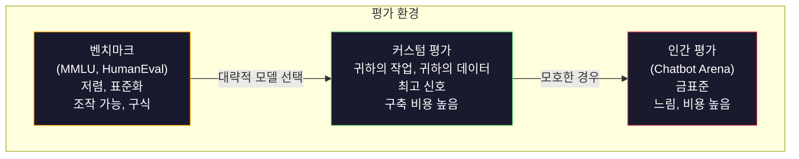
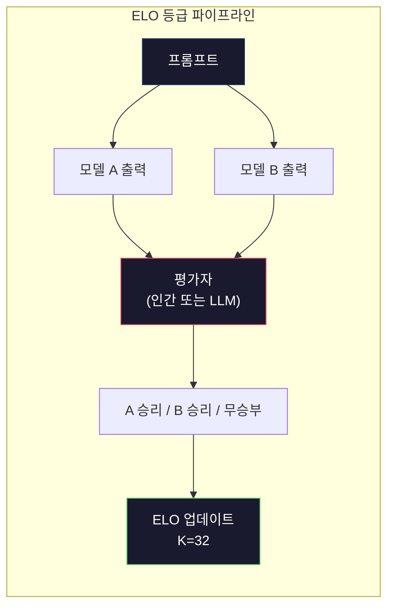

# 평가: 벤치마크, 평가 지표, LM Harness

> 굿하트의 법칙: 측정 지표가 목표가 되면 더 이상 좋은 지표가 될 수 없다. 모든 프론티어 연구실은 벤치마크에 집중한다. MMLU 점수는 올라가지만 모델은 여전히 "strawberry"에 포함된 R의 개수를 정확히 세지 못한다. 중요한 평가 지표는 오직 **당신의 평가 지표**뿐이다 — 당신의 작업, 당신의 데이터로.

**유형:** 구축(Build)
**언어:** Python
**사전 요구 사항:** 10단계, 01-05강 (LLM 처음부터 만들기)
**소요 시간:** ~90분

## 학습 목표

- 언어 모델에 대해 객관식 및 서술형 벤치마크를 실행하는 사용자 정의 평가 하니스 구축
- 표준 벤치마크(MMLU, HumanEval)가 포화 상태에 도달해 첨단 모델 간 차별화에 실패하는 이유 설명
- 정확한 일치(exact match), F1, BLEU, LLM-as-judge 평가 점수 등 적절한 메트릭을 활용한 작업별 평가 구현
- 공개 리더보드에 의존하기보다는 특정 사용 사례에 맞춘 사용자 정의 평가 스위트 설계

## 문제

MMLU는 2020년에 57개 과목에 걸쳐 15,908개의 문제로 발표되었습니다. 3년 안에 최첨단 모델들이 이 벤치마크를 포화 상태로 만들었습니다. GPT-4는 86.4%를 기록했고, Claude 3 Opus는 86.8%, Llama 3 405B는 88.6%를 기록했습니다. 리더보드는 통계적 노이즈에 불과한 3% 범위 내로 압축되었으며, 이는 실제 능력 차이가 아닙니다.

한편, 동일한 모델들은 10세 어린이도 생각 없이 처리할 수 있는 작업에서 실패합니다. MMLU에서 88.7%를 기록한 Claude 3.5 Sonnet은 초기에 "strawberry"의 글자 수를 세지 못했습니다. 이 작업은 세계 지식이나 추론이 전혀 필요 없이 문자 수준의 반복만 요구하는 과제입니다. HumanEval은 164개 문제로 코드 생성을 테스트합니다. 모델들은 이 벤치마크에서 90%+ 점수를 기록하지만, 여전히 초급 개발자도 잡을 수 있는 에지 케이스에서 크래시가 발생하는 코드를 생성합니다.

벤치마크 성능과 실제 신뢰성 사이의 격차가 LLM 평가의 핵심 문제입니다. 벤치마크는 모델이 벤치마크에서 어떻게 수행하는지만 알려줍니다. 특정 작업, 특정 데이터, 특정 실패 모드에서 해당 모델이 어떻게 수행할지에 대해서는 거의 알려주지 않습니다. 고객 지원 봇을 구축한다면 MMLU는 무관합니다. 코드 어시스턴트를 구축한다면 HumanEval은 함수 수준의 생성만 다루며, 디버깅, 리팩토링, 파일 간 코드 설명 등에 대해서는 아무런 정보를 제공하지 않습니다.

사용자 정의 평가가 필요합니다. 벤치마크가 쓸모없어서가 아니라, 대략적인 모델 선택에는 유용하기 때문입니다. 하지만 최종 평가는 반드시 배포 조건과 정확히 일치해야 합니다.

## 개념

## 평가 환경

평가에는 세 가지 범주가 있으며, 각각 비용과 신호 품질이 다릅니다.

**벤치마크**는 표준화된 테스트 스위트입니다. MMLU, HumanEval, SWE-bench, MATH, ARC, HellaSwag 등이 있습니다. 모델을 벤치마크에 실행하고 점수를 얻습니다. 장점: 모든 사람이 동일한 테스트를 사용하므로 모델을 비교할 수 있습니다. 단점: 모델과 학습 데이터가 점점 더 이 벤치마크를 오염시킵니다. 연구실은 벤치마크 질문을 포함하는 데이터로 학습합니다. 점수가 올라갑니다. 실제 능력은 그렇지 않을 수 있습니다.

**커스텀 평가**는 특정 사용 사례를 위해 직접 구축하는 테스트 스위트입니다. 입력, 예상 출력, 점수 함수를 정의합니다. 법률 문서 요약기는 법률 문서로 평가됩니다. SQL 생성기는 데이터베이스 스키마로 평가됩니다. 생성 비용이 많이 들지만 프로덕션 성능을 예측하는 유일한 평가입니다.

**인간 평가**는 유료 주석자가 모델의 출력을 유용성, 정확성, 유창성, 안전성 등의 기준으로 판단합니다. 자동 채점이 불가능한 개방형 작업의 금표준입니다. Chatbot Arena는 100개 이상의 모델에 대해 200만 건 이상의 인간 선호도 투표를 수집했습니다. 단점: 비용(판단당 $0.10-$2.00)과 속도(시간~일).



## 벤치마크가 실패하는 이유

세 가지 메커니즘이 벤치마크 점수가 실제 능력을 반영하지 못하게 합니다.

**데이터 오염.** 학습 코퍼스는 인터넷을 스크랩합니다. 벤치마크 질문은 인터넷에 존재합니다. 모델은 학습 중에 정답을 봅니다. 이는 전통적인 의미의 부정행위는 아닙니다. 연구실이 의도적으로 벤치마크 데이터를 포함하지는 않습니다. 하지만 웹 규모의 스크랩은 이를 제외하는 것을 거의 불가능하게 만듭니다.

**시험에 맞춰 가르치기.** 연구실은 벤치마크 성능을 위해 학습 혼합을 최적화합니다. 학습 혼합의 5%가 MMLU 스타일의 객관식 문제라면 모델은 형식과 정답 분포를 학습합니다. MMLU는 4지 객관식입니다. 모델은 정답 분포가 A/B/C/D에 걸쳐 대략 균일하다는 것을 학습하며, 이는 모델이 정답을 모를 때도 도움이 됩니다.

**포화.** 모든 프론티어 모델이 벤치마크에서 85-90%를 득점하면 벤치마크는 더 이상 변별력이 없습니다. 남은 10-15%의 질문은 모호하거나 잘못 레이블이 지정되었거나 난해한 도메인 지식이 필요할 수 있습니다. MMLU에서 87%에서 89%로 개선되었다는 것은 모델이 더 똑똑해진 것이 아니라 두 개의 난해한 질문을 암기했음을 의미할 수 있습니다.

## 퍼플렉서티: 빠른 건강 검진

퍼플렉서티는 모델이 토큰 시퀀스에 대해 얼마나 놀라워하는지를 측정합니다. 공식적으로는 지수화된 평균 음의 로그 우도입니다:

```
PPL = exp(-1/N * sum(log P(token_i | context)))
```

퍼플렉서티 10은 모델이 각 토큰 위치에서 평균적으로 10개의 옵션 중 균일하게 선택하는 것과 같은 불확실성을 가짐을 의미합니다. 낮을수록 좋습니다. GPT-2는 WikiText-103에서 약 30의 퍼플렉서티를 기록합니다. GPT-3은 약 20, Llama 3 8B는 약 7입니다.

퍼플렉서티는 동일한 테스트 세트에서 모델을 비교하는 데 유용하지만 맹점이 있습니다. 모델은 일반적인 패턴 예측에는 능숙하지만 드물지만 중요한 패턴에는 서툴러도 낮은 퍼플렉서티를 가질 수 있습니다. 또한 지시 따르기, 추론, 사실 정확성에 대해서는 아무런 정보를 제공하지 않습니다. 최종 판단이 아닌 기본 점검으로 사용하세요.

## LLM-as-Judge

강력한 모델을 사용하여 약한 모델의 출력을 평가합니다. 아이디어는 간단합니다. GPT-4o 또는 Claude Sonnet에게 정확성, 유용성, 안전성 기준으로 1-5점 척도로 응답을 평가하도록 요청합니다. GPT-4o-mini로 판단당 약 $0.01이 들며 인간 판단과 약 80% 일치합니다.

모델보다 채점 프롬프트가 더 중요합니다. 모호한 프롬프트("이 응답을 평가하세요")는 잡음이 많은 점수를 생성합니다. 평가 기준("사실적으로 정확하고 출처를 인용한 경우 5점, 정확하지만 출처가 없는 경우 4점...")이 포함된 구조화된 프롬프트는 일관되고 재현 가능한 점수를 생성합니다.

실패 모드: 평가자 모델은 위치 편향(쌍 비교에서 첫 번째 응답을 선호), 장황함 편향(더 긴 응답을 선호), 자기 선호(GPT-4는 동등한 Claude 출력보다 GPT-4 출력을 더 높게 평가) 등을 보입니다. 완화 방법: 순서 무작위화, 길이 정규화, 평가 대상 모델과 다른 평가자 사용.

## 쌍 비교에서 ELO 등급

Chatbot Arena의 접근법입니다. 동일한 프롬프트에 대한 두 모델의 응답을 보여줍니다. 인간(또는 LLM 평가자)이 더 나은 것을 선택합니다. 수천 번의 비교를 통해 각 모델의 ELO 등급을 계산합니다. 이는 체스에서 사용되는 시스템과 동일합니다.

ELO 장점: 절대 점수보다 상대적 순위가 더 신뢰할 수 있으며, 동점을 우아하게 처리하고, 모든 출력을 독립적으로 점수화하는 것보다 더 적은 비교로 수렴합니다. 2026년 초 기준으로 Chatbot Arena 순위는 GPT-4o, Claude 3.5 Sonnet, Gemini 1.5 Pro를 상위 20 ELO 포인트 내에 위치시킵니다.



## 평가 프레임워크

**lm-evaluation-harness** (EleutherAI): 표준 오픈소스 평가 프레임워크입니다. 200개 이상의 벤치마크를 지원합니다. 하나의 명령으로 Hugging Face 모델을 MMLU, HellaSwag, ARC 등에 실행할 수 있습니다. Open LLM Leaderboard에서 사용됩니다.

**RAGAS**: RAG 파이프라인을 위한 평가 프레임워크입니다. 충실도(답변이 검색된 컨텍스트와 일치하는지), 관련성(검색된 컨텍스트가 질문과 관련이 있는지), 답변 정확성을 측정합니다.

**promptfoo**: 프롬프트 엔지니어링을 위한 구성 기반 평가입니다. YAML로 테스트 케이스를 정의하고 여러 모델에 실행한 후 합격/불합격 보고서를 생성합니다. 프롬프트 변경으로 인해 기존 테스트 케이스가 깨지지 않는지 확인하는 회귀 테스트에 유용합니다.

## 커스텀 평가 구축

프로덕션에 중요한 유일한 평가입니다. 프로세스:

1. **작업 정의.** 모델이 정확히 무엇을 해야 하는지 정의합니다. "질문에 답하기"는 너무 모호합니다. "고객 불만 이메일을 받아 제품 이름, 문제 범주, 감정을 추출하기"는 평가할 수 있는 작업입니다.

2. **테스트 케이스 생성.** 프로토타입 평가에는 최소 50개, 프로덕션에는 200개 이상이 필요합니다. 각 테스트 케이스는 (입력, 예상 출력) 쌍입니다. 엣지 케이스(빈 입력, 적대적 입력, 모호한 입력, 다른 언어의 입력)를 포함합니다.

3. **점수 정의.** 구조화된 출력은 정확 일치, 텍스트 유사성은 BLEU/ROUGE, 개방형 품질은 LLM-as-judge, 추출 작업은 F1을 사용합니다. 여러 메트릭을 가중치와 함께 결합합니다.

4. **자동화.** 모든 평가는 하나의 명령으로 실행됩니다. 수동 단계는 없습니다. 시간에 따른 비교를 가능하게 하는 형식으로 결과를 저장합니다.

5. **시간 추적.** 평가 점수는 단독으로 의미가 없습니다. 추세선이 필요합니다. 마지막 프롬프트 변경 후 점수가 개선되었나요? 모델 전환 후 점수가 하락했나요? 프롬트와 함께 평가 버전을 관리합니다.

| 평가 유형 | 판단당 비용 | 인간과의 일치도 | 최적 용도 |
|-----------|------------------|----------------------|----------|
| 정확 일치 | ~$0 | 100% (적용 가능한 경우) | 구조화된 출력, 분류 |
| BLEU/ROUGE | ~$0 | ~60% | 번역, 요약 |
| LLM-as-judge | ~$0.01 | ~80% | 개방형 생성 |
| 인간 평가 | $0.10-$2.00 | N/A (기준 진실) | 모호함, 고위험 작업 |

## 구축 방법

## 1단계: 최소한의 평가 프레임워크

핵심 추상화를 정의합니다. 평가 사례에는 입력, 예상 출력, 선택적 메타데이터 딕셔너리가 있습니다. 평가자는 예측과 참조를 받아 0과 1 사이의 점수를 반환합니다.

```python
import json
from collections import Counter

class EvalCase:
    def __init__(self, input_text, expected, metadata=None):
        self.input_text = input_text
        self.expected = expected
        self.metadata = metadata or {}

class EvalSuite:
    def __init__(self, name, cases, scorers):
        self.name = name
        self.cases = cases
        self.scorers = scorers

    def run(self, model_fn):
        results = []
        for case in self.cases:
            prediction = model_fn(case.input_text)
            scores = {}
            for scorer_name, scorer_fn in self.scorers.items():
                scores[scorer_name] = scorer_fn(prediction, case.expected)
            results.append({
                "input": case.input_text,
                "expected": case.expected,
                "prediction": prediction,
                "scores": scores,
            })
        return results
```

## 2단계: 평가 함수

정확한 일치, 토큰 F1, 시뮬레이션된 LLM 평가자 평가 함수를 구축합니다.

```python
def exact_match(prediction, expected):
    return 1.0 if prediction.strip().lower() == expected.strip().lower() else 0.0

def token_f1(prediction, expected):
    pred_tokens = set(prediction.lower().split())
    exp_tokens = set(expected.lower().split())
    if not pred_tokens or not exp_tokens:
        return 0.0
    common = pred_tokens & exp_tokens
    precision = len(common) / len(pred_tokens)
    recall = len(common) / len(exp_tokens)
    if precision + recall == 0:
        return 0.0
    return 2 * (precision * recall) / (precision + recall)

def llm_judge_simulated(prediction, expected):
    pred_words = set(prediction.lower().split())
    exp_words = set(expected.lower().split())
    if not exp_words:
        return 0.0
    overlap = len(pred_words & exp_words) / len(exp_words)
    length_penalty = min(1.0, len(prediction) / max(len(expected), 1))
    return round(overlap * 0.7 + length_penalty * 0.3, 3)
```

## 3단계: ELO 등급 시스템

ELO 업데이트를 사용한 쌍별 비교를 구현합니다. 이는 Chatbot Arena에서 모델 순위를 매기는 데 사용하는 시스템과 동일합니다.

```python
class ELOTracker:
    def __init__(self, k=32, initial_rating=1500):
        self.ratings = {}
        self.k = k
        self.initial_rating = initial_rating
        self.history = []

    def _ensure_player(self, name):
        if name not in self.ratings:
            self.ratings[name] = self.initial_rating

    def expected_score(self, rating_a, rating_b):
        return 1 / (1 + 10 ** ((rating_b - rating_a) / 400))

    def record_match(self, player_a, player_b, outcome):
        self._ensure_player(player_a)
        self._ensure_player(player_b)

        ea = self.expected_score(self.ratings[player_a], self.ratings[player_b])
        eb = 1 - ea

        if outcome == "a":
            sa, sb = 1.0, 0.0
        elif outcome == "b":
            sa, sb = 0.0, 1.0
        else:
            sa, sb = 0.5, 0.5

        self.ratings[player_a] += self.k * (sa - ea)
        self.ratings[player_b] += self.k * (sb - eb)

        self.history.append({
            "a": player_a, "b": player_b,
            "outcome": outcome,
            "rating_a": round(self.ratings[player_a], 1),
            "rating_b": round(self.ratings[player_b], 1),
        })

    def leaderboard(self):
        return sorted(self.ratings.items(), key=lambda x: -x[1])
```

## 4단계: 퍼플렉서티 계산

토큰 확률을 사용한 퍼플렉서티를 계산합니다. 실제로는 모델의 로짓에서 이 값을 얻습니다. 여기서는 확률 분포로 시뮬레이션합니다.

```python
import numpy as np

def perplexity(log_probs):
    if not log_probs:
        return float("inf")
    avg_neg_log_prob = -np.mean(log_probs)
    return float(np.exp(avg_neg_log_prob))

def token_log_probs_simulated(text, model_quality=0.8):
    np.random.seed(hash(text) % 2**31)
    tokens = text.split()
    log_probs = []
    for i, token in enumerate(tokens):
        base_prob = model_quality
        if len(token) > 8:
            base_prob *= 0.6
        if i == 0:
            base_prob *= 0.7
        prob = np.clip(base_prob + np.random.normal(0, 0.1), 0.01, 0.99)
        log_probs.append(float(np.log(prob)))
    return log_probs
```

## 5단계: 결과 집계

평가 실행 전반에 걸친 요약 통계(평균, 중앙값, 임계값에서의 통과율, 메트릭별 분석)를 계산합니다.

```python
def summarize_results(results, threshold=0.8):
    all_scores = {}
    for r in results:
        for metric, score in r["scores"].items():
            all_scores.setdefault(metric, []).append(score)

    summary = {}
    for metric, scores in all_scores.items():
        arr = np.array(scores)
        summary[metric] = {
            "mean": round(float(np.mean(arr)), 3),
            "median": round(float(np.median(arr)), 3),
            "std": round(float(np.std(arr)), 3),
            "min": round(float(np.min(arr)), 3),
            "max": round(float(np.max(arr)), 3),
            "pass_rate": round(float(np.mean(arr >= threshold)), 3),
            "n": len(scores),
        }
    return summary

def print_summary(summary, suite_name="Eval"):
    print(f"\n{'=' * 60}")
    print(f"  {suite_name} 요약")
    print(f"{'=' * 60}")
    for metric, stats in summary.items():
        print(f"\n  {metric}:")
        print(f"    평균:      {stats['mean']:.3f}")
        print(f"    중앙값:    {stats['median']:.3f}")
        print(f"    표준편차:  {stats['std']:.3f}")
        print(f"    범위:      [{stats['min']:.3f}, {stats['max']:.3f}]")
        print(f"    통과율:   {stats['pass_rate']:.1%} (임계값 >= 0.8)")
        print(f"    N:         {stats['n']}")
```

## 6단계: 전체 파이프라인 실행

모든 것을 연결합니다. 작업을 정의하고 테스트 사례를 생성하며 두 모델을 시뮬레이션하고 평가를 실행하며 쌍별 비교에서 ELO를 계산하고 리더보드를 출력합니다.

```python
def demo_model_good(prompt):
    responses = {
        "What is the capital of France?": "Paris",
        "What is 2 + 2?": "4",
        "Who wrote Hamlet?": "William Shakespeare",
        "What language is PyTorch written in?": "Python and C++",
        "What is the boiling point of water?": "100 degrees Celsius",
    }
    return responses.get(prompt, "I don't know")

def demo_model_bad(prompt):
    responses = {
        "What is the capital of France?": "Paris is the capital city of France",
        "What is 2 + 2?": "The answer is four",
        "Who wrote Hamlet?": "Shakespeare",
        "What language is PyTorch written in?": "Python",
        "What is the boiling point of water?": "212 Fahrenheit",
    }
    return responses.get(prompt, "Unknown")

cases = [
    EvalCase("What is the capital of France?", "Paris"),
    EvalCase("What is 2 + 2?", "4"),
    EvalCase("Who wrote Hamlet?", "William Shakespeare"),
    EvalCase("What language is PyTorch written in?", "Python and C++"),
    EvalCase("What is the boiling point of water?", "100 degrees Celsius"),
]

suite = EvalSuite(
    name="일반 지식",
    cases=cases,
    scorers={
        "exact_match": exact_match,
        "token_f1": token_f1,
        "llm_judge": llm_judge_simulated,
    },
)

results_good = suite.run(demo_model_good)
results_bad = suite.run(demo_model_bad)

print_summary(summarize_results(results_good), "모델 A (간결)")
print_summary(summarize_results(results_bad), "모델 B (장황)")
```

"좋은" 모델은 정확한 답변을 제공합니다. "나쁜" 모델은 장황한 의역을 제공합니다. 정확한 일치는 장황한 모델에 가혹한 점수를 줍니다. 토큰 F1과 LLM 평가자는 더 관대합니다. 이는 메트릭 선택이 중요한 이유를 보여줍니다: 동일한 모델이 평가 방법에 따라 훌륭하거나 형편없게 보일 수 있습니다.

## 7단계: ELO 토너먼트

여러 라운드에 걸쳐 모델 간 쌍별 비교를 실행합니다.

```python
elo = ELOTracker(k=32)

for case in cases:
    pred_a = demo_model_good(case.input_text)
    pred_b = demo_model_bad(case.input_text)

    score_a = token_f1(pred_a, case.expected)
    score_b = token_f1(pred_b, case.expected)

    if score_a > score_b:
        outcome = "a"
    elif score_b > score_a:
        outcome = "b"
    else:
        outcome = "tie"

    elo.record_match("model_a_concise", "model_b_verbose", outcome)

print("\nELO 리더보드:")
for name, rating in elo.leaderboard():
    print(f"  {name}: {rating:.0f}")
```

## 8단계: 퍼플렉서티 비교

다양한 품질 수준의 "모델"에 걸쳐 퍼플렉서티를 비교합니다.

```python
test_text = "The quick brown fox jumps over the lazy dog in the garden"

for quality, label in [(0.9, "강력한 모델"), (0.7, "중간 모델"), (0.4, "약한 모델")]:
    log_probs = token_log_probs_simulated(test_text, model_quality=quality)
    ppl = perplexity(log_probs)
    print(f"  {label} (품질={quality}): 퍼플렉서티 = {ppl:.2f}")
```

## 사용 방법

## lm-evaluation-harness (EleutherAI)

모든 모델에 대한 벤치마크 실행을 위한 표준 도구.

```python
# pip install lm-eval
# 명령어:
# lm_eval --model hf --model_args pretrained=meta-llama/Llama-3.1-8B --tasks mmlu --batch_size 8

# Python API:
# import lm_eval
# results = lm_eval.simple_evaluate(
#     model="hf",
#     model_args="pretrained=meta-llama/Llama-3.1-8B",
#     tasks=["mmlu", "hellaswag", "arc_easy"],
#     batch_size=8,
# )
# print(results["results"])
```

## promptfoo

프롬프트 엔지니어링을 위한 구성 기반 평가 도구. YAML로 테스트 정의 후 여러 공급자에 대해 실행.

```yaml
# promptfoo.yaml
providers:
  - openai:gpt-4o-mini
  - anthropic:claude-3-haiku

prompts:
  - "한 단어로 답하세요: {{question}}"

tests:
  - vars:
      question: "프랑스의 수도는 무엇인가요?"
    assert:
      - type: contains
        value: "파리"
  - vars:
      question: "2 + 2는 무엇인가요?"
    assert:
      - type: equals
        value: "4"
```

## RAG 평가를 위한 RAGAS

```python
# pip install ragas
# from ragas import evaluate
# from ragas.metrics import faithfulness, answer_relevancy, context_precision
# result = evaluate(
#     dataset,
#     metrics=[faithfulness, answer_relevancy, context_precision],
# )
# print(result)
```

RAGAS는 일반적인 평가에서 놓치는 부분을 측정합니다: 모델의 답변이 추상적으로 "정답"인지 여부뿐 아니라, 검색된 컨텍스트에 근거했는지 여부를 평가합니다.

## Ship It

이 레슨은 `outputs/prompt-eval-designer.md`를 생성합니다. 이 파일은 모든 작업에 대해 사용자 정의 평가 스위트를 설계하는 재사용 가능한 프롬프트입니다. 작업 설명을 입력하면 테스트 케이스, 점수 함수, 합격/불합격 임계값 권장 사항을 생성합니다.

또한 `outputs/skill-evaluation.md`를 생성합니다. 이 파일은 작업 유형, 예산, 지연 시간 요구 사항에 따라 적절한 평가 전략을 선택하는 의사 결정 프레임워크입니다.

## 연습 문제

1. 동일한 입력을 모델에 5번 실행하고 출력이 일치하는 빈도를 측정하는 "일관성" 평가기를 추가하세요. 결정적 입력에서 불일치하는 답변은 취약한 프롬프트 또는 높은 온도 설정을 나타냅니다.

2. ELO 추적기를 확장하여 여러 평가 함수(정확 일치, F1, LLM-as-judge)를 지원하고 가중치를 부여하세요. 정확 일치를 강조했을 때와 F1을 강조했을 때 리더보드가 어떻게 달라지는지 비교하세요.

3. 특정 작업(이메일을 5개 카테고리로 분류)에 대한 평가 스위트를 구축하세요. 여러 카테고리에 속할 수 있는 이메일, 빈 이메일, 다른 언어로 된 이메일 등 엣지 케이스를 포함한 100개의 테스트 케이스를 생성하세요. 다양한 "모델"(규칙 기반, 키워드 매칭, 시뮬레이션된 LLM)의 성능을 측정하세요.

4. 오염 감지 기능을 구현하세요: 평가 질문 세트와 학습 코퍼스가 주어졌을 때, 평가 질문(또는 유사 의역) 중 몇 퍼센트가 학습 데이터에 나타나는지 확인하세요. 이는 연구자들이 벤치마크 유효성을 감사하는 방법입니다.

5. "모델 차이" 도구를 구축하세요. 두 모델 버전의 평가 결과를 입력으로 받아 어떤 특정 테스트 케이스가 개선되었는지, 저하되었는지, 유지되었는지 강조하세요. 이는 코드 차이 비교의 평가 버전으로, 변경 사항이 도움이 되었는지 아니면 해를 끼쳤는지 이해하는 데 필수적입니다.

## 주요 용어

| 용어 | 사람들이 말하는 표현 | 실제 의미 |
|------|----------------|----------------------|
| MMLU | "벤치마크" | 대규모 다중 작업 언어 이해(Massive Multitask Language Understanding) -- 57개 과목에 걸친 15,908개의 객관식 문제, 2025년까지 88% 이상의 포화도 달성 |
| HumanEval | "코드 평가" | OpenAI의 164개 Python 함수 완성 문제, 고립된 함수 생성만 테스트 |
| SWE-bench | "실제 코딩 평가" | 12개 Python 저장소의 2,294개 GitHub 이슈, 테스트 생성을 포함한 종단간 버그 수정 측정 |
| 퍼플렉서티(Perplexity) | "모델이 얼마나 혼란스러워하는지" | exp(-avg(log P(token_i given context))) -- 낮을수록 모델이 실제 토큰에 더 높은 확률을 할당함 |
| ELO 평점 | "모델용 체스 랭킹" | 쌍대 승/패 기록에서 계산된 상대적 기술 평점, Chatbot Arena에서 100+ 모델 순위 결정에 사용 |
| LLM-as-judge | "AI로 AI 평가" | 강력한 모델이 평가 기준에 따라 약한 모델의 출력을 채점, 인간 평가자와 ~80% 일치율 달성 (평가당 ~$0.01 비용) |
| 데이터 오염(Data contamination) | "모델이 테스트 데이터를 봤다" | 훈련 데이터에 벤치마크 문제 포함, 실제 능력 향상 없이 점수만 상승 |
| 평가 스위트(Eval suite) | "여러 테스트 모음" | 특정 능력을 측정하는 (입력, 기대 출력, 채점자) 삼중항으로 구성된 버전 관리 컬렉션 |
| 통과율(Pass rate) | "정답률" | 임계값 이상 점수를 받은 평가 사례 비율 -- 평균 점수보다 신뢰성 측정에 더 실용적 |
| Chatbot Arena | "모델 순위 웹사이트" | 200만+ 인간 선호도 투표를 보유한 LMSYS 플랫폼, ELO 평점을 통해 가장 신뢰할 수 있는 LLM 리더보드 생성 |

## 추가 자료

- [Hendrycks et al., 2021 -- "대규모 다중 작업 언어 이해 측정(Measuring Massive Multitask Language Understanding)"](https://arxiv.org/abs/2009.03300) -- MMLU 논문, 포화 상태임에도 여전히 가장 많이 인용되는 LLM 벤치마크
- [Chen et al., 2021 -- "코드 학습 대형 언어 모델 평가(Evaluating Large Language Models Trained on Code)"](https://arxiv.org/abs/2107.03374) -- OpenAI의 HumanEval 논문, 코드 생성 평가 방법론 정립
- [Zheng et al., 2023 -- "LLM-as-a-Judge 평가(Judging LLM-as-a-Judge)"](https://arxiv.org/abs/2306.05685) -- 위치 편향 및 장황성 편향 발견을 포함한 LLM을 이용한 LLM 평가 체계적 분석
- [LMSYS 챗봇 아레나(LMSYS Chatbot Arena)](https://chat.lmsys.org/) -- 200만+ 투표가 있는 크라우드소싱 모델 비교 플랫폼, 가장 신뢰할 수 있는 실제 LLM 순위 제공