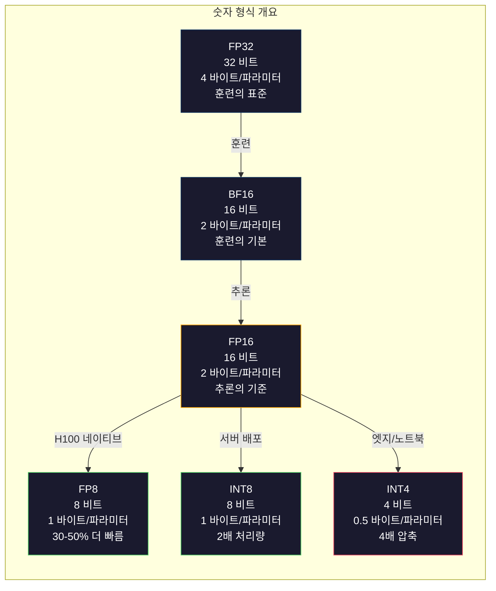
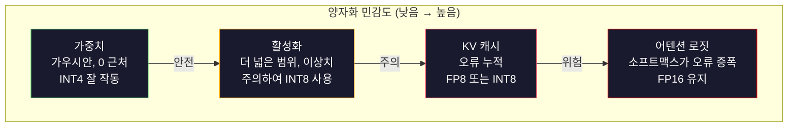
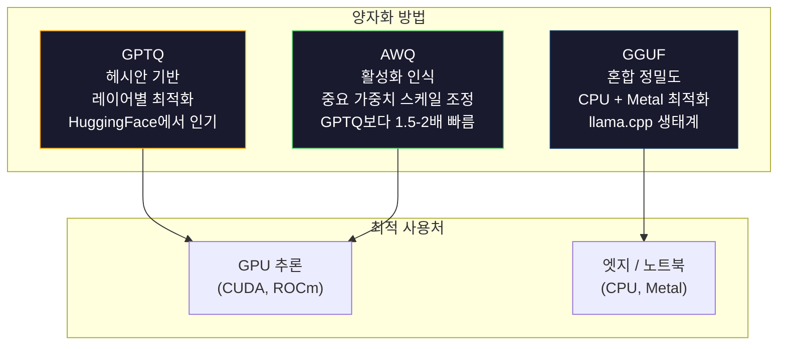

# 양자화: 모델 최적화하기

> FP16의 70B 모델은 140GB가 필요합니다. 가중치만 저장하려면 A100 GPU 2개가 필요하죠. FP8로 양자화하면 80GB GPU 1개로 충분합니다. INT4로는 맥북에서도 실행 가능합니다.

**유형:** 구축
**언어:** Python (NumPy 사용)
**선수 지식:** 10단계, 레슨 01-10 (LLM 기초부터)
**소요 시간:** ~120분

## 학습 목표

- FP16에서 INT8 및 INT4로의 대칭(symmetric) 및 비대칭(asymmetric) 양자화 구현, 텐서별(per-tensor) 및 채널별(per-channel) 스케일링 포함
- 양자화로 인한 메모리 절감량 계산 및 특정 GPU의 VRAM에 적합한 정밀도 결정
- 사후 학습 양자화(PTQ, Post-Training Quantization)와 양자화 인식 학습(QAT, Quantization-Aware Training)의 차이 설명
- GPTQ 또는 AWQ를 적용하여 실제 모델을 양자화하고 벤치마크에서 정확도-메모리 트레이드오프 측정

## 문제

Llama 3 70B는 700억 개의 파라미터를 가지고 있습니다. 각 파라미터는 16비트 부동소수점 숫자입니다. 이는 1400억 바이트, 즉 140GB에 해당합니다. 단일 A100 GPU는 80GB의 VRAM을 갖추고 있어, 단일 GPU에서 가중치를 로드하는 것은 물론 추론 실행도 불가능합니다. 단일 모델 서빙을 위해 시간당 $2씩 하는 A100 두 대가 필요합니다.

하지만 파라미터당 16비트는 낭비입니다. 신경망의 대부분의 가중치는 0 근처에 밀집되어 있습니다. FP16의 전체 동적 범위(0.000000059에서 65,504까지)는 거의 사용되지 않습니다. Llama 3 70B의 실제 가중치 분포를 측정하면 95%가 -0.1과 +0.1 사이에 분포합니다. 4비트로도 표현 가능한 값을 위해 16비트를 소모하고 있는 것입니다.

양자화(Quantization)는 고정밀도 숫자를 저정밀도 숫자로 대체합니다. FP16에서 FP8로 변환하면 메모리 사용량이 절반으로 줄어듭니다. FP16에서 INT4로 변환하면 1/4로 줄어듭니다. 140GB 모델은 35GB가 되어 단일 소비자 GPU에 로드할 수 있습니다. 2비트 양자화(공격적이고 손실률이 높지만 일부 작업에 사용 가능)로 변환하면 동일한 모델을 16GB 노트북에서 실행할 수 있습니다.

대가는 정확도입니다. 제거하는 비트마다 정보가 손실됩니다. 문제는 얼마나 많은 정확도를 잃는지, 그리고 어디서 손실이 발생하는지입니다. 잘 양자화된 INT4 모델은 대부분의 벤치마크에서 원본 품질의 95-99%를 유지합니다. 반면 순진한 INT4 양자화는 모델을 완전히 망가뜨릴 수 있습니다. 차이는 기술에 있습니다.

GPTQ를 사용한 Llama 3의 커뮤니티 INT4 양자화는 WikiText에서 대략 1-2 퍼플렉서티(perplexity) 포인트 손실을 보입니다. Mistral은 MMLU에서 측정 가능한 품질 손실 없이 Mixtral 8x22B의 FP8 체크포인트를 공개했습니다. GGUF 포맷은 llama.cpp를 구동하여 M-시리즈 칩이 탑재된 MacBook에서 70B 모델을 실행합니다. 양자화는 임시 방편이 아닙니다. 7B보다 큰 모든 모델의 표준 배포 경로입니다.

## 개념

## 숫자 형식: 각 비트의 역할

모든 부동소수점 숫자는 부호(sign), 지수(exponent), 가수(mantissa, significand) 세 부분으로 구성됩니다. 부호는 1비트입니다. 지수는 범위(숫자가 얼마나 크거나 작을 수 있는지)를 결정합니다. 가수는 정밀도(소수점 이하 자릿수)를 결정합니다.

```
FP32:  [1 부호] [8 지수] [23 가수]  = 32 비트
FP16:  [1 부호] [5 지수] [10 가수]  = 16 비트
BF16:  [1 부호] [8 지수] [7  가수]  = 16 비트
FP8:   [1 부호] [4 지수] [3  가수]  = 8  비트 (E4M3)
FP8:   [1 부호] [5 지수] [2  가수]  = 8  비트 (E5M2)
INT8:  [1 부호] [7 값]                   = 8  비트 (균일 단계)
INT4:  [1 부호] [3 값]                   = 4  비트 (총 16 단계)
```

**FP32**는 전체 정밀도입니다. 23개의 가수 비트는 약 7개의 소수점 자릿수를 제공합니다. 범위: 대략 1.2 x 10^-38에서 3.4 x 10^38. 훈련은 FP32에서만 이루어졌습니다. 누적(행렬 곱셈 중 실행 합계)에는 여전히 사용됩니다.

**FP16**은 비트 수를 절반으로 줄입니다. 10개의 가수 비트는 약 3.3개의 소수점 자릿수를 제공합니다. 지수가 5비트로 줄어들어 범위가 크게 감소합니다(최대값 ~65,504). 가중치(0 근처에 밀집)에는 적합하지만, 훈련 중 스파이크가 발생할 수 있는 활성화 및 그래디언트에는 위험합니다. FP16 훈련에는 언더플로우 방지를 위한 손실 스케일링이 필요합니다.

**BF16**(Brain Float 16)은 FP32의 8비트 지수를 유지하면서 가수를 7비트로 줄입니다. FP32와 동일한 범위, FP16보다 낮은 정밀도. Google이 딥러닝을 위해 특별히 설계했습니다. 직관: 신경망에는 정밀도보다 범위가 더 중요합니다. FP16에서 10^-20으로 언더플로우되는 그래디언트가 BF16에서는 살아남습니다. BF16에서 0.07342로 반올림되는 0.07342 가중치는 충분히 가깝습니다. 모든 최신 훈련 실행은 BF16 또는 BF16/FP32 혼합을 사용합니다.

**FP8**은 두 가지 변형이 있습니다. E4M3(4 지수, 3 가수)은 추론 중 가중치 및 활성화에 사용됩니다. E5M2(5 지수, 2 가수)는 훈련 중 그래디언트에 사용되며, 정밀도보다 범위가 더 중요합니다. H100 GPU에서 FP8 추론은 FP16 대비 30-50% 속도 향상을 달성하며 품질 손실은 무시할 수 있습니다.

**INT8**은 정수 형식입니다. 지수, 가수 없음. -128에서 127까지 256개의 균일한 값. 부동소수점 가중치를 이 범위로 매핑하려면 스케일 팩터가 필요합니다. 장점: 정수 연산은 부동소수점보다 빠르고 전력 효율적입니다. A100에서 INT8 행렬 곱셈은 624 TOPS로 실행되며, FP16의 312 TFLOPS보다 빠릅니다.

**INT4**는 더 나아갑니다. 16개의 가능한 값만 있습니다. 스케일 팩터가 주요 역할을 합니다. 품질은 스케일 선택 방법과 양자화할 가중치를 어떻게 선택하느냐에 전적으로 달려 있습니다. 최신 INT4 방법(GPTQ, AWQ)은 원본 모델 품질의 95% 이상을 유지합니다.



## 양자화 작동 방식

핵심 연산은 간단합니다. 부동소수점 값 텐서를 가져와 스케일 팩터를 찾고, 곱한 후 가장 가까운 정수로 반올림하고, 정수와 스케일 팩터를 저장합니다.

**양자화:**
```
scale = max(abs(tensor)) / max_int_value
quantized = round(tensor / scale)
```

**역양자화:**
```
reconstructed = quantized * scale
```

대칭 범위(-127~127)를 가진 INT8의 경우:
```
scale = max(abs(tensor)) / 127
quantized = clamp(round(tensor / scale), -128, 127)
```

오차는 반올림 오차입니다. 각 값은 최대 `scale / 2`만큼 차이가 날 수 있습니다. 레이어 전체의 오차는 가중치 수와 해당 가중치 변동에 대한 모델 민감도에 따라 달라집니다.

**텐서별 vs 채널별 양자화.** 텐서별은 전체 가중치 행렬에 하나의 스케일 팩터를 사용합니다. 간단하지만 손실 발생: 한 열이 큰 값을 가지고 다른 열이 작은 값을 가지면 작은 값은 대부분의 정밀도를 잃습니다. 채널별은 출력 채널당 하나의 스케일 팩터를 사용합니다(행렬의 행 또는 열당). 오버헤드가 더 크지만(1개 대신 N개의 스케일 팩터 저장) 품질이 크게 향상됩니다. 모든 프로덕션 양자화 방법은 채널별 또는 더 세밀한 세분성을 사용합니다.

**비대칭 양자화**는 영점 오프셋을 추가합니다: `quantized = round(tensor / scale) + zero_point`. 이는 0을 중심으로 하지 않는 분포를 처리합니다. 예를 들어 ReLU 활성화는 항상 비음수입니다. 대칭 양자화는 나타나지 않는 음수 값에 정수 범위의 절반을 낭비합니다. 비대칭 양자화는 실제 범위 [min, max]를 전체 정수 범위에 매핑합니다.

## 민감도 계층

모델의 모든 부분이 양자화를 동일하게 허용하지는 않습니다. 명확한 계층이 있습니다.

**가중치(가장 강건).** 모델 가중치는 훈련 중 천천히 변화하며 0 근처에 대략 가우시안 분포를 따릅니다. 양자화가 잘 됩니다. 채널별 스케일을 사용한 INT8 가중치는 거의 무손실 결과를 제공합니다. INT4는 더 정교한 방법이 필요하지만 작동합니다.

**활성화(중간 민감도).** 활성화는 추론 중 네트워크를 통해 흐르는 중간 값입니다. 가중치보다 더 넓은 동적 범위를 가지며 이상치를 포함합니다. 단일 어텐션 헤드가 평균보다 100배 큰 활성화 값을 생성할 수 있습니다. 이러한 이상치는 모델 품질에 중요합니다. 이를 무작정 양자화하면 정보가 파괴됩니다. 해결책: 이상치 채널을 더 높은 정밀도로 유지(LLM.int8()), 토큰별 또는 채널별 활성화 스케일 사용.

**KV 캐시(고감도).** 키-값 캐시는 모든 이전 토큰에 대한 어텐션 상태를 저장합니다. 긴 컨텍스트 길이에서 KV 캐시는 메모리를 지배합니다. 32K 컨텍스트에서 70B 모델의 KV 캐시만 FP16에서 40GB입니다. KV 캐시를 FP8 또는 INT8로 양자화하면 메모리를 크게 절약하지만, 모든 미래 어텐션 계산에 오류가 누적됩니다. 품질 영향은 시퀀스 길이에 비례합니다.

**어텐션 로짓(가장 민감).** 어텐션의 소프트맥스는 입력의 작은 변화에 매우 민감합니다. 사전 소프트맥스 로짓의 0.01 양자화 오차는 어텐션 분포를 의미 있게 변경할 수 있습니다. 대부분의 양자화 방식은 다른 모든 것이 양자화되어도 어텐션 계산을 더 높은 정밀도(FP16 또는 BF16)로 유지합니다.



## PTQ vs QAT

**훈련 후 양자화(PTQ)**는 이미 훈련된 모델을 양자화합니다. 재훈련 없음. FP16 가중치를 가져와 스케일 팩터를 계산하고 반올림한 후 배포합니다. 빠르고 저렴합니다. INT8 및 FP8에 잘 작동합니다. INT4의 경우, 반올림 오차가 누적되어 단순한 PTQ는 종종 실패합니다. 고급 PTQ 방법(GPTQ, AWQ)은 교정 데이터를 사용하여 양자화 오차를 최소화합니다.

**양자화 인식 훈련(QAT)**은 훈련 중 순전파에 가짜 양자화 연산을 삽입합니다. 모델은 반올림 오차가 작은 위치에 가중치를 배치하도록 학습합니다. 그래디언트는 직선 통과 추정기(STE)를 통해 가짜 양자화를 흐릅니다: 반올림 연산의 그래디언트를 1로 가정합니다. QAT는 PTQ보다 더 나은 INT4 및 INT2 모델을 생성하지만 전체 훈련 실행이 필요합니다. Google은 Gemini의 효율적인 서빙을 위해 QAT를 사용했습니다. Meta는 일부 Llama 배포 대상에 QAT를 사용했습니다.

| 측면 | PTQ | QAT |
|--------|-----|-----|
| 비용 | 수분~수시간 | 전체 훈련 실행 |
| INT8 품질 | 우수함 (< 0.1% 손실) | 우수함 |
| INT4 품질 | GPTQ/AWQ로 양호함 (1-3% 손실) | 더 나음 (< 1% 손실) |
| INT2 품질 | 불량 | 일부 작업에 사용 가능 |
| 교정 데이터 | 128-1024개 예시 | 전체 훈련 데이터셋 |
| 사용 시기 | 배포, 반복 | 저비트폭에서 최대 품질 |

## GPTQ, AWQ, GGUF

**GPTQ(GPT 양자화)**는 일회성 PTQ 방법입니다. 작은 교정 데이터셋(128개 예시 일반)을 사용하여 한 번에 한 레이어씩 가중치를 양자화합니다. 헤시안(출력이 각 가중치에 얼마나 민감한지에 대한 2차 정보)을 측정합니다. 헤시안이 중요하다고 판단하는 가중치는 더 신중하게 양자화됩니다. GPTQ는 LLM에 INT4 양자화를 실용화한 첫 번째 방법입니다. Hugging Face의 TheBloke는 수백 개의 모델 양자화 버전을 공개하며 GPTQ를 대중화했습니다.

**AWQ(활성화 인식 가중치 양자화)**는 작은 비율의 가중치(약 1%)가 큰 활성화 값과 곱해져 불균형적으로 중요하다는 것을 관찰합니다. AWQ는 교정 데이터를 사용하여 이러한 중요한 가중치를 식별하고 양자화 전에 스케일을 확대한 후(해당 활성화는 스케일 축소) INT4 양자화가 정확해지는 범위에 유지합니다. AWQ는 일반적으로 GPTQ 품질과 비슷하거나 약간 우수하며 적용 속도가 1.5-2배 빠릅니다.

**GGUF(GPT-Generated Unified Format)**는 llama.cpp 및 그 생태계에서 사용하는 파일 형식입니다. 혼합 양자화를 지원합니다: 다른 레이어에 다른 비트폭 적용. 첫 번째 및 마지막 레이어(임베딩 및 출력 헤드)는 일반적으로 더 높은 정밀도로 유지됩니다. 중간 레이어는 INT4 또는 INT3을 사용합니다. GGUF 파일은 자체 포함형: 가중치, 토크나이저, 메타데이터가 모두 하나의 파일에 있습니다. 이 형식은 CPU 추론 및 Apple Silicon용으로 설계되었으며, 전체 모델을 메모리에 로드하고 CPU 또는 Metal GPU에서 행렬 곱셈을 실행하는 것이 표준 경로입니다. Q4_K_M은 품질과 크기의 균형을 이루는 가장 인기 있는 GGUF 양자화 변형입니다.



## 품질 측정

양자화된 모델이 여전히 좋은지 어떻게 알 수 있을까요?

**퍼플렉서티.** 가장 일반적인 지표입니다. 낮을수록 좋습니다. 원본 및 양자화 모델 모두에 대해 보유 데이터셋(WikiText-2가 표준)에서 퍼플렉서티를 계산합니다. 델타는 양자화가 얼마나 많은 정보를 파괴했는지 알려줍니다. 경험 법칙: 델타 < 0.5는 우수, 0.5-1.0은 양호, 1.0-2.0은 대부분의 작업에 허용 가능, > 2.0은 문제가 있음을 의미합니다.

**작업별 벤치마크.** MMLU, HumanEval, GSM8K 또는 사용자 정의 평가 스위트에서 양자화 모델을 실행합니다. 원본과 비교합니다. 양자화는 다양한 기능에 불균등하게 영향을 미칩니다. 수학 및 코드 작업은 일반 지식보다 정밀도 손실에 더 민감합니다.

**출력 비교.** 동일한 프롬프트에 대해 두 모델에서 응답을 생성하고 비교합니다. LLM-as-judge(레슨 10)가 여기에 잘 작동합니다. 승률 계산: 양자화 모델이 원본 모델을 일치하거나 능가하는 프롬프트 비율.

**지연 시간 및 처리량.** 양자화는 모델을 더 빠르고 저렴하게 만들기 위해 존재합니다. 초당 토큰, 첫 토큰까지의 시간, 메모리 사용량을 측정합니다. 원본보다 느린 양자화 모델은 쓸모없습니다.

| 모델 | 형식 | 크기 | 퍼플렉서티 (WikiText-2) | MMLU | 초당 토큰 (A100) |
|-------|--------|------|------------------------|------|-------------------|
| Llama 3 70B | FP16 | 140GB | 3.12 | 79.5% | 38 |
| Llama 3 70B | FP8 | 70GB | 3.14 | 79.3% | 55 |
| Llama 3 70B | GPTQ INT4 | 35GB | 4.32 | 77.8% | 72 |
| Llama 3 70B | AWQ INT4 | 35GB | 4.18 | 78.1% | 75 |
| Llama 3 70B | GGUF Q4_K_M | 40GB | 4.25 | 77.9% | 28 (CPU) |

패턴: FP8은 거의 무료입니다. INT4는 1-2 MMLU 포인트를 희생하지만 처리량을 2배로 늘리고 메모리를 1/4로 줄입니다. 거의 모든 배포에 이 절충은 가치가 있습니다.

## 실제 사례

H100에서 FP16 → FP8: 30-50% 추론 속도 향상, < 0.1% 품질 손실. 이는 당연한 양자화입니다. 모든 H100 배포는 이를 사용해야 합니다.

FP16 → INT8 (LLM.int8()): 2배 메모리 감소, < 0.5% 품질 손실. 혼합 정밀도 접근 방식은 이상치 특성을 FP16으로 유지하면서 나머지를 INT8로 양자화합니다.

FP16 → INT4 (GPTQ/AWQ): 4배 메모리 감소, 모델 및 방법에 따라 1-3% 품질 손실. 단일 48GB GPU에서 70B 모델 사용 가능.

FP16 → INT4 (GGUF Q4_K_M): 3.5배 메모리 감소, 1-2% 품질 손실. CPU 추론에 최적화. Q4_K_M의 70B 모델은 약 40GB이며 64GB M3 Max에서 초당 10-15 토큰으로 실행됩니다.

FP16 → INT2: 8배 메모리 감소, 5-15% 품질 손실. 특정 좁은 작업에서만 사용 가능. 연구 단계, 일반 사용에는 프로덕션 준비되지 않음.

## 빌드하기

## 단계 1: 숫자 형식 표현

각 형식의 비트 수준 표현을 구축하여 부호, 지수, 가수(mantissa)가 정확히 무엇을 하는지 확인합니다.

```python
import numpy as np


def float_to_fp32_bits(value):
    bits = np.float32(value).view(np.uint32)
    sign = (bits >> 31) & 1
    exponent = (bits >> 23) & 0xFF
    mantissa = bits & 0x7FFFFF
    return {"sign": int(sign), "exponent": int(exponent), "mantissa": int(mantissa),
            "exponent_bits": format(int(exponent), '08b'),
            "mantissa_bits": format(int(mantissa), '023b'),
            "value": float(value),
            "actual_exponent": int(exponent) - 127}


def float_to_fp16_bits(value):
    fp16 = np.float16(value)
    bits = fp16.view(np.uint16)
    sign = (bits >> 15) & 1
    exponent = (bits >> 10) & 0x1F
    mantissa = bits & 0x3FF
    return {"sign": int(sign), "exponent": int(exponent), "mantissa": int(mantissa),
            "exponent_bits": format(int(exponent), '05b'),
            "mantissa_bits": format(int(mantissa), '010b'),
            "value": float(fp16),
            "actual_exponent": int(exponent) - 15}


def float_to_bf16_bits(value):
    fp32_bits = np.float32(value).view(np.uint32)
    bf16_bits = (fp32_bits >> 16).astype(np.uint16)
    sign = (bf16_bits >> 15) & 1
    exponent = (bf16_bits >> 7) & 0xFF
    mantissa = bf16_bits & 0x7F
    reconstructed = np.uint32(bf16_bits.astype(np.uint32) << 16).view(np.float32)
    return {"sign": int(sign), "exponent": int(exponent), "mantissa": int(mantissa),
            "exponent_bits": format(int(exponent), '08b'),
            "mantissa_bits": format(int(mantissa), '07b'),
            "value": float(reconstructed),
            "actual_exponent": int(exponent) - 127}


def simulate_fp8_e4m3(value):
    sign = 1 if value < 0 else 0
    abs_val = abs(value)
    max_val = 448.0
    abs_val = min(abs_val, max_val)
    if abs_val == 0:
        return {"sign": sign, "exponent": 0, "mantissa": 0, "value": 0.0,
                "exponent_bits": "0000", "mantissa_bits": "000"}
    exp = int(np.floor(np.log2(abs_val)))
    exp = max(-6, min(8, exp))
    mantissa_val = abs_val / (2.0 ** exp) - 1.0
    mantissa_quant = round(mantissa_val * 8) / 8
    mantissa_quant = max(0, min(0.875, mantissa_quant))
    reconstructed = (1.0 + mantissa_quant) * (2.0 ** exp)
    if sign:
        reconstructed = -reconstructed
    mantissa_int = int(round(mantissa_quant * 8))
    return {"sign": sign, "exponent": exp + 7, "mantissa": mantissa_int,
            "exponent_bits": format(exp + 7, '04b'),
            "mantissa_bits": format(mantissa_int, '03b'),
            "value": float(reconstructed),
            "actual_exponent": exp}


def display_format_comparison(value):
    fp32 = float_to_fp32_bits(value)
    fp16 = float_to_fp16_bits(value)
    bf16 = float_to_bf16_bits(value)
    fp8 = simulate_fp8_e4m3(value)

    print(f"\n  값: {value}")
    print(f"  {'형식':<8} {'저장된 값':>14} {'오차':>12} {'부호':>5} {'지수 비트':>10} {'가수 비트':>25}")
    print(f"  {'-'*76}")
    print(f"  {'FP32':<8} {fp32['value']:>14.6f} {abs(fp32['value'] - value):>12.8f} {fp32['sign']:>5} {fp32['exponent_bits']:>10} {fp32['mantissa_bits']:>25}")
    print(f"  {'FP16':<8} {fp16['value']:>14.6f} {abs(fp16['value'] - value):>12.8f} {fp16['sign']:>5} {fp16['exponent_bits']:>10} {fp16['mantissa_bits']:>25}")
    print(f"  {'BF16':<8} {bf16['value']:>14.6f} {abs(bf16['value'] - value):>12.8f} {bf16['sign']:>5} {bf16['exponent_bits']:>10} {bf16['mantissa_bits']:>25}")
    print(f"  {'FP8e4m3':<8} {fp8['value']:>14.6f} {abs(fp8['value'] - value):>12.8f} {fp8['sign']:>5} {fp8['exponent_bits']:>10} {fp8['mantissa_bits']:>25}")
```

## 단계 2: 대칭 양자화 (텐서별 및 채널별)

기본적인 양자화 연산입니다. 텐서별은 전체 행렬에 하나의 스케일을 사용하고, 채널별은 행 또는 열당 하나의 스케일을 사용합니다.

```python
def quantize_symmetric(tensor, num_bits=8):
    qmin = -(2 ** (num_bits - 1))
    qmax = 2 ** (num_bits - 1) - 1
    abs_max = np.max(np.abs(tensor))
    if abs_max == 0:
        return np.zeros_like(tensor, dtype=np.int32), 1.0
    scale = abs_max / qmax
    quantized = np.clip(np.round(tensor / scale), qmin, qmax).astype(np.int32)
    return quantized, float(scale)


def dequantize_symmetric(quantized, scale):
    return quantized.astype(np.float64) * scale


def quantize_per_channel(tensor, num_bits=8, axis=0):
    qmin = -(2 ** (num_bits - 1))
    qmax = 2 ** (num_bits - 1) - 1

    if axis == 0:
        abs_max = np.max(np.abs(tensor), axis=1, keepdims=True)
    else:
        abs_max = np.max(np.abs(tensor), axis=0, keepdims=True)

    abs_max = np.where(abs_max == 0, 1.0, abs_max)
    scales = abs_max / qmax
    quantized = np.clip(np.round(tensor / scales), qmin, qmax).astype(np.int32)
    return quantized, scales.squeeze()


def dequantize_per_channel(quantized, scales, axis=0):
    if axis == 0:
        return quantized.astype(np.float64) * scales.reshape(-1, 1)
    else:
        return quantized.astype(np.float64) * scales.reshape(1, -1)


def quantize_asymmetric(tensor, num_bits=8):
    qmin = 0
    qmax = 2 ** num_bits - 1
    t_min = np.min(tensor)
    t_max = np.max(tensor)
    if t_max == t_min:
        return np.zeros_like(tensor, dtype=np.int32), 1.0, 0
    scale = (t_max - t_min) / (qmax - qmin)
    zero_point = int(np.round(qmin - t_min / scale))
    zero_point = max(qmin, min(qmax, zero_point))
    quantized = np.clip(np.round(tensor / scale + zero_point), qmin, qmax).astype(np.int32)
    return quantized, float(scale), int(zero_point)


def dequantize_asymmetric(quantized, scale, zero_point):
    return (quantized.astype(np.float64) - zero_point) * scale
```

## 단계 3: 품질 측정

양자화가 얼마나 많은 정보를 파괴하는지 측정합니다. 원본과 복원된 텐서 간의 평균 제곱 오차, 신호 대 잡음비, 코사인 유사도를 측정합니다.

```python
def quantization_error(original, reconstructed):
    diff = original - reconstructed
    mse = float(np.mean(diff ** 2))
    rmse = float(np.sqrt(mse))
    max_error = float(np.max(np.abs(diff)))
    signal_power = float(np.mean(original ** 2))
    snr_db = 10 * np.log10(signal_power / max(mse, 1e-20))

    orig_flat = original.flatten()
    recon_flat = reconstructed.flatten()
    norm_orig = np.linalg.norm(orig_flat)
    norm_recon = np.linalg.norm(recon_flat)
    if norm_orig == 0 or norm_recon == 0:
        cosine_sim = 0.0
    else:
        cosine_sim = float(np.dot(orig_flat, recon_flat) / (norm_orig * norm_recon))

    return {"mse": mse, "rmse": rmse, "max_error": max_error,
            "snr_db": float(snr_db), "cosine_similarity": cosine_sim}


def compare_quantization_methods(tensor, num_bits=8):
    q_pt, s_pt = quantize_symmetric(tensor, num_bits)
    recon_pt = dequantize_symmetric(q_pt, s_pt)
    err_pt = quantization_error(tensor, recon_pt)

    q_pc, s_pc = quantize_per_channel(tensor, num_bits, axis=0)
    recon_pc = dequantize_per_channel(q_pc, s_pc, axis=0)
    err_pc = quantization_error(tensor, recon_pc)

    q_asym, s_asym, zp = quantize_asymmetric(tensor, num_bits)
    recon_asym = dequantize_asymmetric(q_asym, s_asym, zp)
    err_asym = quantization_error(tensor, recon_asym)

    print(f"\n  양자화 비교 ({num_bits}-비트, 텐서 형태 {tensor.shape}):")
    print(f"  {'방법':<20} {'MSE':>12} {'SNR (dB)':>10} {'코사인 유사도':>12} {'최대 오차':>12}")
    print(f"  {'-'*68}")
    print(f"  {'텐서별 대칭':<20} {err_pt['mse']:>12.8f} {err_pt['snr_db']:>10.2f} {err_pt['cosine_similarity']:>12.8f} {err_pt['max_error']:>12.8f}")
    print(f"  {'채널별 대칭':<20} {err_pc['mse']:>12.8f} {err_pc['snr_db']:>10.2f} {err_pc['cosine_similarity']:>12.8f} {err_pc['max_error']:>12.8f}")
    print(f"  {'비대칭':<20} {err_asym['mse']:>12.8f} {err_asym['snr_db']:>10.2f} {err_asym['cosine_similarity']:>12.8f} {err_asym['max_error']:>12.8f}")

    return {"텐서별": err_pt, "채널별": err_pc, "비대칭": err_asym}
```

## 단계 4: 비트 폭 스윕

동일한 텐서를 다양한 비트 폭(2, 3, 4, 8, 16)으로 양자화하고 각 수준에서 품질을 측정합니다. 이는 품질 임계점을 정확히 보여줍니다.

```python
def bit_width_sweep(tensor):
    print(f"\n  비트 폭 스윕 (텐서 형태 {tensor.shape}):")
    print(f"  {'비트':>6} {'레벨':>8} {'MSE':>14} {'SNR (dB)':>10} {'코사인 유사도':>12} {'압축률':>12}")
    print(f"  {'-'*64}")

    results = []
    for bits in [2, 3, 4, 8, 16]:
        q, s = quantize_per_channel(tensor, bits, axis=0)
        recon = dequantize_per_channel(q, s, axis=0)
        err = quantization_error(tensor, recon)
        levels = 2 ** bits
        compression = 32.0 / bits

        print(f"  {bits:>6} {levels:>8} {err['mse']:>14.8f} {err['snr_db']:>10.2f} {err['cosine_similarity']:>12.8f} {compression:>11.1f}x")
        results.append({"bits": bits, "levels": levels, "error": err, "compression": compression})

    return results
```

## 단계 5: 민감도 실험

트랜스포머의 다른 부분을 양자화하고 어떤 구성 요소가 가장 민감한지 측정합니다. 이는 민감도 계층 구조를 보여줍니다: 가중치 < 활성화 < KV 캐시 < 어텐션.

```python
def simulate_transformer_layer(input_data, weights, kv_scale=1.0):
    hidden = input_data @ weights["qkv"]
    seq_len = hidden.shape[1]
    d_model = weights["qkv"].shape[1] // 3
    q, k, v = hidden[:, :, :d_model], hidden[:, :, d_model:2*d_model], hidden[:, :, 2*d_model:]

    attn_scores = (q @ k.transpose(0, 2, 1)) / np.sqrt(d_model) * kv_scale
    attn_max = np.max(attn_scores, axis=-1, keepdims=True)
    attn_exp = np.exp(attn_scores - attn_max)
    attn_weights = attn_exp / np.sum(attn_exp, axis=-1, keepdims=True)

    attn_output = attn_weights @ v
    output = attn_output @ weights["out"]
    return output, {"q": q, "k": k, "v": v, "attn_scores": attn_scores,
                    "attn_weights": attn_weights, "attn_output": attn_output}


def sensitivity_experiment(batch_size=2, seq_len=16, d_model=64, num_bits=8):
    np.random.seed(42)
    input_data = np.random.randn(batch_size, seq_len, d_model) * 0.1

    weights = {
        "qkv": np.random.randn(d_model, 3 * d_model) * (2.0 / d_model) ** 0.5,
        "out": np.random.randn(d_model, d_model) * (2.0 / d_model) ** 0.5,
    }

    baseline_output, baseline_internals = simulate_transformer_layer(input_data, weights)

    experiments = {}

    q_qkv, s_qkv = quantize_per_channel(weights["qkv"], num_bits, axis=0)
    q_out, s_out = quantize_per_channel(weights["out"], num_bits, axis=0)
    quantized_weights = {
        "qkv": dequantize_per_channel(q_qkv, s_qkv, axis=0),
        "out": dequantize_per_channel(q_out, s_out, axis=0),
    }
    weight_quant_output, _ = simulate_transformer_layer(input_data, quantized_weights)
    experiments["가중치만"] = quantization_error(baseline_output, weight_quant_output)

    _, fresh_internals = simulate_transformer_layer(input_data, weights)
    q_act, s_act = quantize_per_channel(
        fresh_internals["attn_output"].reshape(-1, d_model), num_bits, axis=0
    )
    quant_attn_out = dequantize_per_channel(q_act, s_act, axis=0).reshape(batch_size, seq_len, d_model)
    act_quant_output = quant_attn_out @ weights["out"]
    experiments["활성화만"] = quantization_error(baseline_output, act_quant_output)

    q_k, s_k = quantize_per_channel(fresh_internals["k"].reshape(-1, d_model), num_bits, axis=0)
    q_v, s_v = quantize_per_channel(fresh_internals["v"].reshape(-1, d_model), num_bits, axis=0)
    quant_k = dequantize_per_channel(q_k, s_k, axis=0).reshape(batch_size, seq_len, d_model)
    quant_v = dequantize_per_channel(q_v, s_v, axis=0).reshape(batch_size, seq_len, d_model)
    attn_scores_kv = (fresh_internals["q"] @ quant_k.transpose(0, 2, 1)) / np.sqrt(d_model)
    attn_max_kv = np.max(attn_scores_kv, axis=-1, keepdims=True)
    attn_exp_kv = np.exp(attn_scores_kv - attn_max_kv)
    attn_weights_kv = attn_exp_kv / np.sum(attn_exp_kv, axis=-1, keepdims=True)
    kv_quant_output = (attn_weights_kv @ quant_v) @ weights["out"]
    experiments["KV 캐시만"] = quantization_error(baseline_output, kv_quant_output)

    noise_scale = np.std(fresh_internals["attn_scores"]) * 0.05
    noisy_scores = fresh_internals["attn_scores"] + np.random.randn(*fresh_internals["attn_scores"].shape) * noise_scale
    noisy_max = np.max(noisy_scores, axis=-1, keepdims=True)
    noisy_exp = np.exp(noisy_scores - noisy_max)
    noisy_weights = noisy_exp / np.sum(noisy_exp, axis=-1, keepdims=True)
    attn_quant_output = (noisy_weights @ fresh_internals["v"]) @ weights["out"]
    experiments["어텐션 로그(5% 노이즈)"] = quantization_error(baseline_output, attn_quant_output)

    print(f"\n  민감도 실험 ({num_bits}-비트 양자화):")
    print(f"  {'구성 요소':<30} {'MSE':>14} {'SNR (dB)':>10} {'코사인 유사도':>12}")
    print(f"  {'-'*68}")
    for name, err in sorted(experiments.items(), key=lambda x: x[1]["mse"]):
        print(f"  {name:<30} {err['mse']:>14.8f} {err['snr_db']:>10.2f} {err['cosine_similarity']:>12.8f}")

    return experiments
```

## 단계 6: 시뮬레이션된 GPTQ

GPTQ는 헤시안을 사용하여 반올림 오차를 어떻게 분배할지 결정하면서 한 번에 하나의 열을 양자화합니다. 이는 핵심 아이디어를 포착하는 단순화된 버전입니다: 교정 데이터를 사용하여 가중치 중요도를 측정한 다음 가장 중요하지 않은 가중치를 더 공격적으로 양자화합니다.

```python
def simulated_gptq(weight_matrix, calibration_inputs, num_bits=4):
    n_in, n_out = weight_matrix.shape
    qmin = -(2 ** (num_bits - 1))
    qmax = 2 ** (num_bits - 1) - 1

    H = np.zeros((n_in, n_in))
    for x in calibration_inputs:
        x = x.reshape(-1, 1) if x.ndim == 1 else x
        for row in range(x.shape[0]):
            xi = x[row].reshape(-1, 1)
            H += xi @ xi.T
    H /= len(calibration_inputs)
    H += np.eye(n_in) * 1e-4

    weight_importance = np.diag(H)

    quantized = np.zeros_like(weight_matrix, dtype=np.int32)
    scales = np.zeros(n_out)
    errors = np.zeros(n_out)

    W = weight_matrix.copy()

    for col in range(n_out):
        w_col = W[:, col]
        abs_max = np.max(np.abs(w_col))
        if abs_max == 0:
            scales[col] = 1.0
            continue
        scale = abs_max / qmax
        scales[col] = scale

        q_col = np.clip(np.round(w_col / scale), qmin, qmax).astype(np.int32)
        quantized[:, col] = q_col

        quant_error = w_col - q_col * scale
        errors[col] = np.sqrt(np.mean(quant_error ** 2))

        if col < n_out - 1:
            importance_weights = weight_importance / (np.max(weight_importance) + 1e-10)
            for next_col in range(col + 1, min(col + 4, n_out)):
                compensation = quant_error * importance_weights * 0.1
                W[:, next_col] += compensation

    return quantized, scales, {"열 오차": errors,
                               "평균 오차": float(np.mean(errors)),
                               "최대 오차": float(np.max(errors))}


def dequantize_gptq(quantized, scales):
    result = np.zeros_like(quantized, dtype=np.float64)
    for col in range(quantized.shape[1]):
        result[:, col] = quantized[:, col] * scales[col]
    return result
```

## 단계 7: AWQ 시뮬레이션

AWQ는 중요한 가중치(큰 활성화와 곱해지는 가중치)를 식별하고 양자화 전에 스케일링하여 보호합니다.

```python
def simulated_awq(weight_matrix, calibration_inputs, num_bits=4, salient_fraction=0.01):
    n_in, n_out = weight_matrix.shape
    qmin = -(2 ** (num_bits - 1))
    qmax = 2 ** (num_bits - 1) - 1

    activation_magnitudes = np.zeros(n_in)
    for x in calibration_inputs:
        if x.ndim == 1:
            activation_magnitudes += np.abs(x)
        else:
            activation_magnitudes += np.mean(np.abs(x), axis=0)
    activation_magnitudes /= len(calibration_inputs)

    n_salient = max(1, int(n_in * salient_fraction))
    salient_indices = np.argsort(activation_magnitudes)[-n_salient:]

    scale_factors = np.ones(n_in)
    for idx in salient_indices:
        col_max = np.max(np.abs(weight_matrix[idx, :]))
        if col_max > 0:
            scale_factors[idx] = min(4.0, 1.0 / (col_max + 1e-8) * np.mean(np.abs(weight_matrix)))

    scaled_weights = weight_matrix * scale_factors.reshape(-1, 1)

    quantized, scales = quantize_per_channel(scaled_weights, num_bits, axis=0)
    dequantized = dequantize_per_channel(quantized, scales, axis=0)

    result = dequantized / scale_factors.reshape(-1, 1)

    err = quantization_error(weight_matrix, result)

    return result, {"중요 인덱스": salient_indices,
                    "스케일 팩터": scale_factors[salient_indices],
                    "오차": err,
                    "중요 가중치 수": n_salient}
```

## 단계 8: 전체 파이프라인

모든 것을 연결합니다. 동일한 가중치 행렬에 대해 순진 양자화, 채널별, GPTQ, AWQ를 비교합니다.

```python
def full_quantization_comparison(d_in=256, d_out=512, num_bits=4, n_calibration=32):
    np.random.seed(42)

    weight = np.random.randn(d_in, d_out) * 0.02
    outlier_rows = np.random.choice(d_in, size=5, replace=False)
    weight[outlier_rows] *= 10

    calibration = [np.random.randn(8, d_in) * 0.1 for _ in range(n_calibration)]

    q_naive, s_naive = quantize_symmetric(weight, num_bits)
    recon_naive = dequantize_symmetric(q_naive, s_naive)
    err_naive = quantization_error(weight, recon_naive)

    q_pc, s_pc = quantize_per_channel(weight, num_bits, axis=0)
    recon_pc = dequantize_per_channel(q_pc, s_pc, axis=0)
    err_pc = quantization_error(weight, recon_pc)

    q_gptq, s_gptq, gptq_info = simulated_gptq(weight, calibration, num_bits)
    recon_gptq = dequantize_gptq(q_gptq, s_gptq)
    err_gptq = quantization_error(weight, recon_gptq)

    recon_awq, awq_info = simulated_awq(weight, calibration, num_bits)
    err_awq = awq_info["오차"]

    print(f"\n  전체 양자화 비교 ({num_bits}-비트, {d_in}x{d_out} 행렬)")
    print(f"  행렬에는 {len(outlier_rows)}개의 이상치 행(10배 스케일)이 있습니다.")
    print()
    print(f"  {'방법':<20} {'MSE':>14} {'SNR (dB)':>10} {'코사인 유사도':>12}")
    print(f"  {'-'*58}")
    print(f"  {'순진 텐서별':<20} {err_naive['mse']:>14.8f} {err_naive['snr_db']:>10.2f} {err_naive['cosine_similarity']:>12.8f}")
    print(f"  {'채널별':<20} {err_pc['mse']:>14.8f} {err_pc['snr_db']:>10.2f} {err_pc['cosine_similarity']:>12.8f}")
    print(f"  {'시뮬레이션 GPTQ':<20} {err_gptq['mse']:>14.8f} {err_gptq['snr_db']:>10.2f} {err_gptq['cosine_similarity']:>12.8f}")
    print(f"  {'시뮬레이션 AWQ':<20} {err_awq['mse']:>14.8f} {err_awq['snr_db']:>10.2f} {err_awq['cosine_similarity']:>12.8f}")

    test_input = np.random.randn(4, d_in) * 0.1
    baseline = test_input @ weight
    output_naive = test_input @ recon_naive
    output_pc = test_input @ recon_pc
    output_gptq = test_input @ recon_gptq
    output_awq = test_input @ recon_awq

    print(f"\n  종단간 출력 오차 (테스트 입력과의 행렬 곱):")
    print(f"  {'방법':<20} {'출력 MSE':>14} {'출력 코사인':>14}")
    print(f"  {'-'*50}")
    for name, output in [("순진", output_naive), ("채널별", output_pc),
                          ("GPTQ", output_gptq), ("AWQ", output_awq)]:
        out_err = quantization_error(baseline, output)
        print(f"  {name:<20} {out_err['mse']:>14.8f} {out_err['cosine_similarity']:>14.8f}")

    return {"순진": err_naive, "채널별": err_pc, "gptq": err_gptq, "awq": err_awq}


def memory_calculator(num_params_billions, bits_per_param):
    bytes_per_param = bits_per_param / 8
    total_bytes = num_params_billions * 1e9 * bytes_per_param
    total_gb = total_bytes / (1024 ** 3)
    return total_gb


def print_memory_table():
    print("\n  모델 및 정밀도별 메모리 요구 사항:")
    print(f"  {'모델':<15} {'FP32':>8} {'FP16':>8} {'FP8':>8} {'INT8':>8} {'INT4':>8} {'INT2':>8}")
    print(f"  {'-'*64}")
    for name, params in [("7B", 7), ("13B", 13), ("34B", 34), ("70B", 70), ("405B", 405)]:
        fp32 = memory_calculator(params, 32)
        fp16 = memory_calculator(params, 16)
        fp8 = memory_calculator(params, 8)
        int8 = memory_calculator(params, 8)
        int4 = memory_calculator(params, 4)
        int2 = memory_calculator(params, 2)
        print(f"  {name:<15} {fp32:>7.1f}G {fp16:>7.1f}G {fp8:>7.1f}G {int8:>7.1f}G {int4:>7.1f}G {int2:>7.1f}G")


if __name__ == "__main__":
    np.random.seed(42)

    print("=" * 70)
    print("양자화: 모델 적합시키기")
    print("=" * 70)

    print("\n단계 1: 숫자 형식 비교")
    print("-" * 50)
    for val in [0.1, 3.14159, -0.00073, 42.5, 0.0000012]:
        display_format_comparison(val)

    print("\n\n단계 2: 메모리 요구 사항")
    print("-" * 50)
    print_memory_table()

    print("\n\n단계 3: 양자화 방법 비교")
    print("-" * 50)
    weight_matrix = np.random.randn(128, 256) * 0.02
    weight_matrix[0] *= 15
    weight_matrix[42] *= 8
    compare_quantization_methods(weight_matrix, num_bits=8)
    compare_quantization_methods(weight_matrix, num_bits=4)

    print("\n\n단계 4: 비트 폭 스윕")
    print("-" * 50)
    sweep_tensor = np.random.randn(64, 128) * 0.05
    bit_width_sweep(sweep_tensor)

    print("\n\n단계 5: 민감도 실험")
    print("-" * 50)
    print("\n  INT8:")
    sensitivity_experiment(num_bits=8)
    print("\n  INT4:")
    sensitivity_experiment(num_bits=4)

    print("\n\n단계 6: GPTQ vs AWQ vs 순진 (INT4)")
    print("-" * 50)
    full_quantization_comparison(d_in=256, d_out=512, num_bits=4)

    print("\n\n단계 7: 분포 분석")
    print("-" * 50)
    np.random.seed(0)
    simulated_weights = np.random.randn(1000) * 0.02
    abs_vals = np.abs(simulated_weights)
    pct_in_range = np.mean(abs_vals < 0.1) * 100
    print(f"\n  시뮬레이션된 가중치 분포 (1000개 파라미터, 표준편차=0.02):")
    print(f"  [-0.1, 0.1] 범위 내 가중치: {pct_in_range:.1f}%")
    print(f"  [-0.05, 0.05] 범위 내 가중치: {np.mean(abs_vals < 0.05) * 100:.1f}%")
    print(f"  [-0.01, 0.01] 범위 내 가중치: {np.mean(abs_vals < 0.01) * 100:.1f}%")
    print(f"  최대 절댓값: {np.max(abs_vals):.6f}")
    print(f"  평균 절댓값: {np.mean(abs_vals):.6f}")

    histogram = np.histogram(simulated_weights, bins=20)
    print(f"\n  가중치 히스토그램:")
    max_count = max(histogram[0])
    for i in range(len(histogram[0])):
        bar_len = int(histogram[0][i] / max_count * 40)
        lo = histogram[1][i]
        hi = histogram[1][i + 1]
        print(f"  [{lo:>7.4f}, {hi:>7.4f}] {'#' * bar_len} ({histogram[0][i]})")

    print("\n\n" + "=" * 70)
    print("완료")
    print("=" * 70)
```

## 사용 방법

## AutoGPTQ를 이용한 양자화

```python
# pip install auto-gptq transformers
# from auto_gptq import AutoGPTQForCausalLM, BaseQuantizeConfig
# from transformers import AutoTokenizer
# model_id = "meta-llama/Llama-3.1-8B"
# quantize_config = BaseQuantizeConfig(
#     bits=4,
#     group_size=128,
#     desc_act=False,
# )
# tokenizer = AutoTokenizer.from_pretrained(model_id)
# model = AutoGPTQForCausalLM.from_pretrained(model_id, quantize_config)
# calibration = [tokenizer(t, return_tensors="pt") for t in calibration_texts[:128]]
# model.quantize(calibration)
# model.save_quantized("llama-8b-gptq-int4")
```

## AutoAWQ를 이용한 양자화

```python
# pip install autoawq
# from awq import AutoAWQForCausalLM
# from transformers import AutoTokenizer
# model_id = "meta-llama/Llama-3.1-8B"
# model = AutoAWQForCausalLM.from_pretrained(model_id)
# tokenizer = AutoTokenizer.from_pretrained(model_id)
# model.quantize(tokenizer, quant_config={"zero_point": True, "q_group_size": 128, "w_bit": 4})
# model.save_quantized("llama-8b-awq-int4")
```

## GGUF로 변환

```bash
# pip install llama-cpp-python
# python convert_hf_to_gguf.py meta-llama/Llama-3.1-8B --outtype q4_k_m --outfile llama-8b-q4km.gguf
# llama-server -m llama-8b-q4km.gguf -c 4096 -ngl 99
```

## vLLM으로 서빙

```python
# pip install vllm
# vllm serve model-awq --quantization awq --dtype half --max-model-len 8192
```

vLLM은 AWQ 및 GPTQ 모델을 네이티브로 지원합니다. 행렬 곱셈 중 역양자화를 처리하고 KV 캐시에 페이징 어텐션(paged attention)을 사용합니다. H100에서 FP8을 사용하려면 `--dtype float8_e4m3fn`을 추가하세요.

## Ship It

이 레슨은 `outputs/skill-quantization.md`를 생성하며, 적절한 양자화 전략 선택을 위한 결정 프레임워크를 제공합니다. 모델 크기, 대상 하드웨어, 품질 요구 사항을 고려하여 어떤 형식, 방법, 검증 단계를 사용할지 알려줍니다. 메모리 예산 계산, 구성 요소별 정밀도 권장 사항, vLLM, llama.cpp, TensorRT-LLM을 위한 배포 레시피가 포함되어 있습니다.

## 연습 문제

1. 그룹 양자화(group quantization)를 구현하세요. 채널당 하나의 스케일(scale) 대신, 채널 내 128개 가중치 그룹당 하나의 스케일을 사용합니다. 이는 GPTQ와 AWQ에서 실제로 사용하는 방식입니다. 동일한 가중치 행렬에 대해 그룹 크기 32, 64, 128, 256을 비교하세요. 작은 그룹은 더 나은 품질을 제공하지만 스케일 계수에 대한 저장 오버헤드가 더 큽니다.

2. 혼합 정밀도 양자화기(mixed-precision quantizer)를 구축하세요. 다층 네트워크의 첫 번째 및 마지막 레이어는 INT8로 양자화하고 중간 레이어는 INT4로 양자화합니다. 균일한 INT4 및 균일한 INT8과 종단간 출력 품질을 비교하세요. 전체 INT8 대비 메모리 절감량을 측정하세요.

3. 양자화 인식 학습(quantization-aware training)을 위한 스트레이트-스루 추정기(STE)를 구현하세요. 회귀 작업에서 훈련된 간단한 2층 네트워크의 순전파(forward pass)에 가상 양자화/역양자화(fake quantize/dequantize) 연산을 삽입하세요. 일반적으로 훈련된 모델(PTQ로 INT4 변환)과 처음부터 QAT로 훈련된 모델 간의 최종 손실(loss)을 비교하세요.

4. LLM.int8()에서 영감을 받은 이상치 인식 양자화기(outlier-aware quantizer)를 구축하세요. 활성화 크기(activation magnitude)가 평균의 6배를 초과하는 채널을 감지합니다. 해당 채널은 FP16으로 유지하고 나머지는 INT8로 양자화합니다. 5단계의 트랜스포머 레이어에서 다양한 이상치 임계값(3x, 6x, 10x)에 대한 종단간 품질을 측정하세요.

5. 양자화 품질 대시보드를 구현하세요. 가중치 행렬이 주어졌을 때 다음을 계산하고 표시합니다:  
   - 가중치 분포 히스토그램  
   - 양자화 오차 분포  
   - 채널별 스케일 계수  
   - 가장 오류가 큰 양자화 채널(최고 재구성 오차)  
   - 100개의 무작위 입력에 걸쳐 원본과 양자화된 출력 간의 코사인 유사도  
   어떤 채널을 더 높은 정밀도로 유지해야 하는지 식별하세요.

## 주요 용어

| 용어 | 사람들이 말하는 표현 | 실제 의미 |
|------|----------------|----------------------|
| FP16 | "하프 정밀도" | 5개의 지수 비트와 10개의 가수 비트를 가진 16비트 부동소수점, 최대값 65,504, 표준 추론 형식 |
| BF16 | "브레인 플로트" | 8개의 지수 비트(FP32와 동일한 범위)와 7개의 가수 비트를 가진 16비트 부동소수점, Google이 훈련용으로 설계 |
| FP8 | "8비트 부동소수점" | 두 가지 변형: E4M3(추론용, 더 높은 정밀도)과 E5M2(훈련용, 더 넓은 범위), H100에서 네이티브 지원 |
| INT8 | "8비트 정수" | -128에서 127까지 256개의 균일하게 분포된 값, 부동소수점과의 매핑을 위해 스케일 팩터 필요 |
| INT4 | "4비트 정수" | 총 16개의 레벨, 품질 유지를 위해 정교한 방법(GPTQ, AWQ) 필요 |
| Per-channel quantization | "행당 하나의 스케일" | 전체 텐서 대신 각 출력 채널에 별도의 스케일 팩터 사용, 오차 크게 감소 |
| GPTQ | "헤시안 방법" | 출력 오차 최소화를 위해 2차 정보를 사용하는 사후 훈련 양자화, 한 번에 한 레이어씩 처리 |
| AWQ | "활성화 인식" | 양자화 전에 중요한 가중치(큰 활성화 값과 곱해지는 가중치)에 스케일 적용하여 보호 |
| GGUF | "llama.cpp 형식" | 혼합 정밀도 레이어를 가진 자체 포함 모델 파일, CPU 및 Apple Silicon 추론에 최적화 |
| PTQ | "훈련 후 양자화" | 재훈련 없이 훈련된 모델의 가중치를 낮은 정밀도로 변환, 빠르지만 극한 압축에서는 제한적 |
| QAT | "훈련 중 양자화" | 순전파 패스에 가짜 양자화를 삽입하여 모델이 반올림에 내성을 학습하도록 함, INT4/INT2에서 더 우수 |
| Calibration data | "128개의 예시" | 스케일 팩터 설정을 위한 활성화 통계 계산을 위해 모델을 통해 실행되는 소규모 데이터셋 |
| Scale factor | "승수" | 부동소수점 범위와 정수 범위 간 변환: `float_val = int_val * scale` |
| Perplexity delta | "얼마나 더 나쁜지" | 원본 모델과 양자화 모델 간 퍼플렉서티 차이, < 0.5는 우수, > 2.0은 문제 있음 |

## 추가 자료

- [Frantar et al., 2022 -- "GPTQ: 생성형 사전 훈련 트랜스포머를 위한 정확한 사후 훈련 양자화"](https://arxiv.org/abs/2210.17323) -- 헤시안 기반 가중치 반올림을 사용하여 LLM에 INT4 양자화를 실용화한 논문
- [Lin et al., 2023 -- "AWQ: LLM 압축 및 가속화를 위한 활성화 인식 가중치 양자화"](https://arxiv.org/abs/2306.00978) -- 양자화 전 스케일링을 통해 중요한 가중치 보호, GPTQ와 동등하거나 더 나은 성능 달성
- [Dettmers et al., 2022 -- "LLM.int8(): 대규모 트랜스포머를 위한 8비트 행렬 곱셈"](https://arxiv.org/abs/2208.07339) -- 이상치 특성을 FP16으로 유지하는 혼합 정밀도 INT8, 품질 손실 없이 INT8 추론 가능
- [Xiao et al., 2023 -- "SmoothQuant: 대규모 언어 모델을 위한 정확하고 효율적인 사후 훈련 양자화"](https://arxiv.org/abs/2211.10438) -- W8A8 배포를 위해 양자화 난이도를 활성화에서 가중치로 이전
- [Micikevicius et al., 2022 -- "심층 학습을 위한 FP8 형식"](https://arxiv.org/abs/2209.05433) -- H100에 기본 지원되는 E4M3 및 E5M2 형식을 정의한 NVIDIA/ARM/Intel 논문