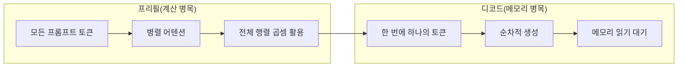
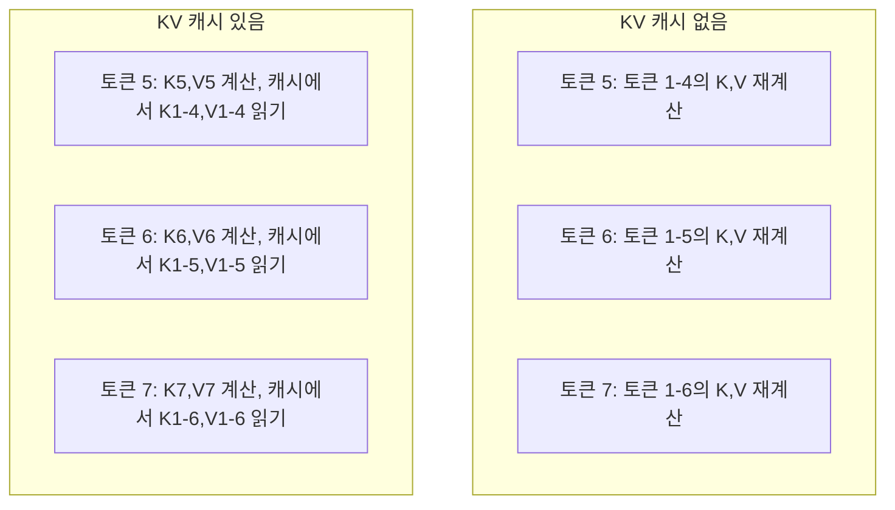
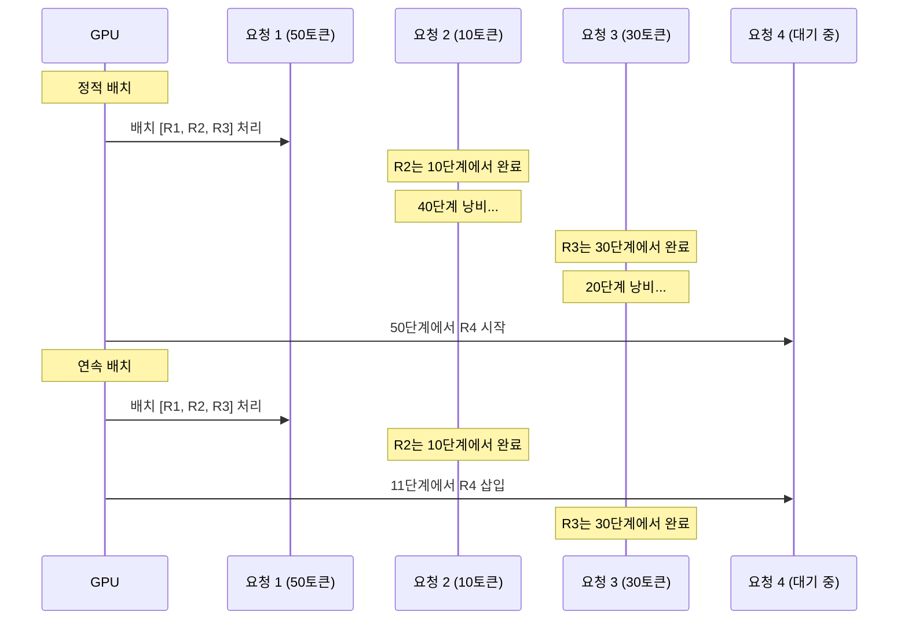
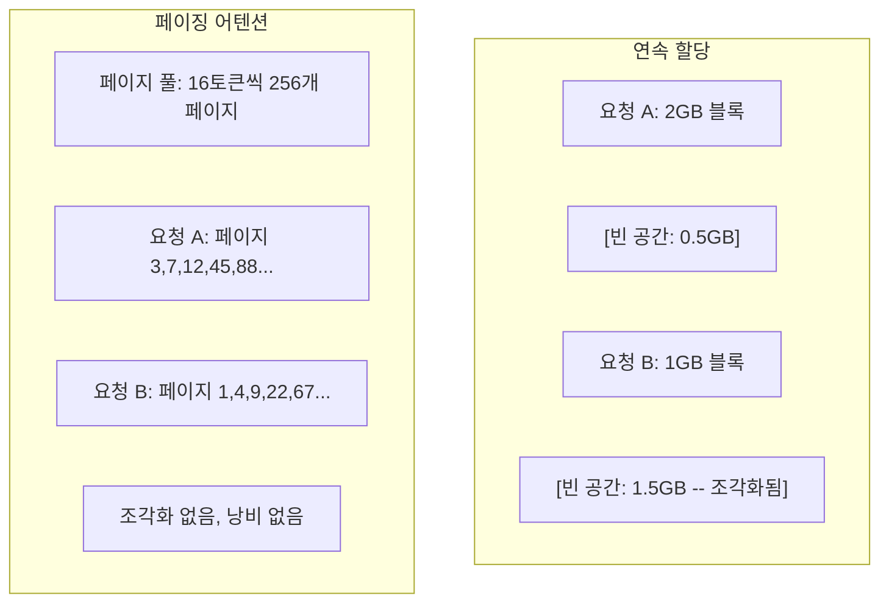
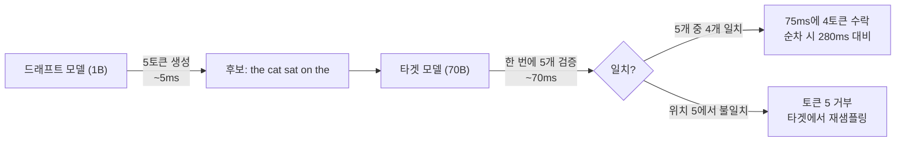

# 추론 최적화

> LLM 추론은 두 단계로 정의됩니다. 프리필(Prefill)은 프롬프트를 병렬로 처리합니다 — 계산 집약적. 디코드(Decode)는 토큰을 하나씩 생성합니다 — 메모리 집약적. 모든 최적화는 하나 또는 두 단계 모두를 대상으로 합니다.

**유형:** 구축
**언어:** Python
**선수 조건:** 10단계, 01-08강 (트랜스포머 아키텍처, 어텐션)
**소요 시간:** ~120분

## 학습 목표

- 자기회귀적 토큰 생성 중 중복 계산을 제거하기 위한 KV-캐시(KV-cache) 구현
- LLM 추론 시 프리필(prefill) vs 디코드(decode) 단계 설명 및 각 단계의 서로 다른 병목 현상(계산 집약적 vs 메모리 집약적) 원인 분석
- 동시 요청 환경에서 GPU 활용률 극대화를 위한 연속 배치(continuous batching) 및 페이징 어텐션(PagedAttention) 개념 구현
- 추론 최적화 기법(KV-캐시, 추측 디코딩(speculative decoding), 플래시 어텐션(flash attention)) 비교 및 처리량/지연 시간 트레이드오프 분석

## 문제

Llama 3 70B를 4xA100 GPU에 배포합니다. 단일 사용자는 초당 ~50토큰을 받습니다. 빠르게 느껴집니다. 그런데 100명의 사용자가 동시에 엔드포인트에 접속하면 처리량이 사용자당 초당 3토큰으로 떨어집니다. 월 $25,000의 GPU 비용이 인간이 타이핑하는 속도보다 느린 응답을 제공하고 있습니다.

모델 자체는 1명의 사용자와 100명의 사용자 사이에서 변하지 않습니다. 동일한 가중치, 동일한 아키텍처, 동일한 수학 연산입니다. 변하는 것은 작업 스케줄링 방식입니다. 순진한 추론 방식은 사용 가능한 GPU 연산 능력의 90% 이상을 낭비합니다. 47번째 토큰을 기다리는 사용자는 GPU 메모리 버스가 행렬 곱셈(matmul) 사이에 유휴 상태로 있는 동안 전체 배치 슬롯을 점유합니다. 한편, 새로운 사용자의 2,000토큰 프롬프트는 그 유휴 시간을 유용한 연산으로 채울 수 있습니다.

이것은 확장성 문제가 아닙니다. 스케줄링 문제입니다. 이 강의에서 다루는 기술들—KV 캐싱, 연속 배치(continuous batching), PagedAttention, 추측적 디코딩(speculative decoding), 접두사 캐싱(prefix caching)—이 월 $25,000의 추론 비용을 동일한 트래픽을 처리하는 월 $5,000의 비용으로 구분하는 요소입니다.

vLLM은 4xA100-80GB에서 Llama 3 70B를 서빙할 때 낮은 동시성 환경에서 사용자당 초당 ~50토큰을 달성하며, 연속 배치와 PagedAttention을 통해 100개의 동시 요청에서 사용자당 15-25 TPS를 유지합니다. 이러한 최적화가 없다면 동일한 하드웨어는 해당 동시성 수준에서 사용자당 5 TPS만 제공합니다. 동일한 GPU, 동일한 모델, 4배 높은 처리량입니다.

## 개념

### 프리필(PreFill) vs 디코드(Decode)

모든 LLM 추론 요청은 두 가지 명확한 단계를 가집니다.

**프리필(PreFill)**은 전체 입력 프롬프트를 처리합니다. 모든 토큰이 알려져 있으므로 전체 시퀀스에 대해 병렬로 어텐션을 계산할 수 있습니다. 이는 대규모 행렬 곱셈 작업입니다. GPU 코어는 계속 바쁘게 작동합니다. 병목 현상은 계산입니다. 하드웨어가 초당 제공할 수 있는 FLOPS(연산 성능)가 중요합니다. A100은 312 TFLOPS(BF16)를 제공합니다. 70B 모델에서 4,096토큰 프롬프트의 프리필은 단일 A100에서 약 400ms가 소요됩니다.

**디코드(Decode)**는 출력 토큰을 하나씩 생성합니다. 각 새 토큰은 이전 모든 토큰에 어텐션하지만, 한 번의 순전파(forward pass)당 하나의 토큰만 생성됩니다. 가중치 행렬은 프리필 때와 같은 크기이지만, 행렬 대신 단일 벡터와 곱합니다. GPU 코어는 마이크로초 단위로 작업을 완료한 후 메모리에서 다음 가중치 배치를 기다립니다. 병목 현상은 메모리 대역폭입니다. HBM에서 계산 유닛으로 모델 가중치를 얼마나 빠르게 스트리밍할 수 있는지가 중요합니다. A100은 2 TB/s 대역폭을 가집니다. FP16의 70B 모델은 140GB입니다. 전체 모델을 한 번 읽는 데 70ms가 소요됩니다. 이는 단일 디코드 단계의 최소 시간입니다.



**연산:바이트 비율(ops:byte ratio)**은 이 트레이드오프를 포착합니다. 메모리에서 로드한 바이트당 수행하는 연산 수를 측정합니다.

```
연산:바이트 비율 = 토큰당 FLOPs / 메모리에서 읽은 바이트
```

4,096토큰 배치로 프리필할 때, 로드한 가중치당 약 4,096개의 곱셈-누산 연산을 수행합니다. 비율이 높아 계산 병목입니다. 배치 크기 1로 디코드할 때, 로드한 가중치당 약 1개의 연산을 수행합니다. 비율이 낮아 메모리 병목입니다.

핵심 통찰: *디코드는 단일 토큰을 생성하기 위해 전체 모델을 읽기 때문에 메모리 병목입니다*. 아래 모든 최적화는 읽는 양을 줄이거나, 읽기당 처리하는 토큰 배치를 늘리거나, 읽기를 완전히 피합니다.

### KV 캐시

어텐션 중 각 토큰의 쿼리(query)는 모든 이전 토큰의 키(key)와 값(value) 벡터에 어텐션합니다. 캐시가 없으면 토큰 N을 생성하려면 N-1개의 이전 토큰에 대한 키와 값 투영을 다시 계산해야 합니다. 토큰 1은 토큰 2 생성 시 투영되고, 토큰 3, 4 생성 시에도 다시 투영됩니다. 토큰 1,000에 도달하면 토큰 1을 총 999번 투영합니다.

KV 캐시는 모든 이전 토큰의 키와 값 투영을 저장합니다. 토큰 N을 생성할 때 토큰 N의 키와 값만 계산한 후, 캐시된 토큰 1~N-1의 K/V와 연결합니다.



**KV 캐시 메모리 공식:**

```
KV 캐시 크기 = 2 * 레이어 수 * KV 헤드 수 * 헤드 차원 * 시퀀스 길이 * 파라미터당 바이트
```

Llama 3 70B(80 레이어, GQA로 8개 KV 헤드, head_dim=128, BF16) 기준:

```
토큰당: 2 * 80 * 8 * 128 * 2 바이트 = 327,680 바이트 = 320 KB
4,096토큰: 320 KB * 4,096 = 1.28 GB
128K 토큰: 320 KB * 131,072 = 40 GB
```

Llama 3 70B의 128K 컨텍스트 대화 1회는 40GB의 KV 캐시를 소비합니다. A100 메모리 절반입니다. 100명의 동시 사용자가 각각 4K 토큰을 사용할 때 KV 캐시만 128GB가 필요합니다. 따라서 KV 캐시 관리가 추론 최적화의 핵심 과제입니다.

### 연속 배치(Continuous Batching)

정적 배치는 N개의 요청이 도착할 때까지 기다린 후 함께 처리하고, 모든 요청이 완료될 때까지 새 요청을 받지 않습니다. 한 요청이 500토큰, 다른 요청이 10토큰이 필요하면, 짧은 요청은 완료 후 490 디코드 단계 동안 유휴 상태로 있습니다.

연속 배치(반복 수준 배치)는 어떤 요청이 완료되는 즉시 새 요청을 배치에 삽입합니다. 배치는 매 디코드 단계마다 재평가됩니다. 10토큰 후 완료된 요청은 즉시 대기 중인 요청으로 대체됩니다.



처리량 향상은 출력 길이 변동성에 따라 달라집니다. 균일한 길이일 때 연속 배치는 정적 배치와 동일합니다. 가변 길이(일반적인 경우)일 때 GPU 슬롯이 비어 있지 않아 2-5배 높은 처리량을 달성할 수 있습니다.

### 페이징 어텐션(PagedAttention)

각 요청의 KV 캐시는 연속된 메모리 블록입니다. 요청이 도착하고 떠나면서 메모리가 조각화됩니다. 4K 토큰 요청은 1.28GB 연속 메모리가 필요합니다. 총 2GB가 비어 있어도 1.28GB 연속 블록이 없으면 요청을 거부하거나 메모리를 낭비합니다.

vLLM의 페이징 어텐션은 KV 캐시에 OS 스타일 가상 메모리를 적용합니다. 요청당 하나의 연속 블록 대신 고정 크기 "페이지"(일반적으로 16토큰)를 할당합니다. 페이지는 GPU 메모리의 어디에나 위치할 수 있습니다. 페이지 테이블은 각 요청의 논리적 시퀀스 위치를 물리적 페이지 위치에 매핑합니다.



페이징 어텐션은 **쓰기 시 복사(copy-on-write)**를 통해 공유 프리픽스를 지원합니다. 50개 요청이 동일한 시스템 프롬프트를 공유하면, 해당 시스템 프롬프트의 KV 캐시 페이지는 한 번 저장되어 50개 요청에서 참조됩니다. 요청이 분기(서로 다른 사용자 메시지)될 때만 자체 페이지를 얻습니다. 이는 공유 시스템 프롬프트가 있는 애플리케이션의 메모리 사용량을 크게 줄입니다.

vLLM은 페이징 어텐션을 통해 거의 0%의 메모리 낭비(~4% vs 순진한 할당의 ~60-80%)를 보고합니다.

### 추측 디코딩(Speculative Decoding)

디코드는 순차적이기 때문에 느립니다. 한 토큰을 생성하고, 다시 피드백하고, 다음 토큰을 생성합니다. 하지만 다음 5개 토큰을 저렴하게 추측한 후 한 번에 검증할 수 있다면 어떨까요?

추측 디코딩은 작고 빠른 **드래프트 모델**을 사용해 K개의 후보 토큰을 생성합니다. 큰 **타겟 모델**은 단일 순전파(프리필과 유사, 병렬, 계산 병목, 효율적)로 모든 K개 후보를 처리합니다. 타겟 모델이 드래프트 모델의 예측에 동의하면, 하나의 타겟 순전파 시간에 K개 토큰을 수락합니다. 위치 j에서 불일치하면 1~j-1 토큰을 수락하고 나머지는 폐기합니다.



속도 향상은 **수락률**에 따라 달라집니다. 드래프트 모델의 예측이 타겟과 얼마나 자주 일치하는지입니다. Llama 3 8B가 Llama 3 70B를 드래프트할 때 자연어에서는 70-85% 수락률이 일반적입니다. 이는 2-3배 디코드 속도 향상으로 이어집니다.

추측 디코딩의 세 가지 접근 방식:

| 방법 | 드래프트 소스 | 수락률 | 오버헤드 |
|--------|-------------|-----------------|----------|
| 드래프트-타겟 (Leviathan et al.) | 별도의 소형 모델 | 70-85% | 드래프트 모델 메모리 |
| EAGLE (Li et al.) | 타겟의 경량 헤드 | 75-90% | ~1% 추가 파라미터 |
| N-그램 조회 | 토큰 N-그램 테이블 | 40-60% | 무시할 수 있음 |

**EAGLE**은 타겟 모델의 은닉 상태 위에 작은 자기회귀 헤드를 훈련시킵니다. 타겟 모델의 두 번째 마지막 레이어 특성을 사용해 다음 토큰 임베딩을 예측합니다. 별도의 모델이 아닌 타겟 모델 자체의 표현을 사용하므로, 추가 메모리 없이 더 높은 수락률을 달성합니다. EAGLE-2는 컨텍스트에 따라 후보 수를 조정하는 동적 드래프트 트리를 추가합니다.

**N-그램 추측 디코딩**은 현재 컨텍스트 또는 사전 구축된 코퍼스에서 N-그램 연속 테이블을 유지합니다. 드래프트가 동일 대화에서 이전에 나타난 것과 일치하면(반복 패턴, 코드, 구조화된 출력), 신경망 오버헤드 없이 작동합니다. 평균 수락률은 낮지만 추측당 비용은 사실상 무료입니다.

추측 디코딩은 **수학적으로 정확**합니다. 출력 분포는 타겟 모델의 분포와 동일합니다. 근사치가 아닙니다. 검증 단계는 수락된 모든 토큰이 타겟 모델이 할당한 정확한 확률을 갖도록 보장합니다.

### 프리픽스 캐싱(Prefix Caching)

많은 요청이 동일한 프리픽스를 공유합니다. 챗봇 시스템 프롬프트. RAG 컨텍스트 블록. 몇 가지 예시 세트. 프리픽스 캐싱이 없으면 모든 요청이 이러한 공유 토큰에 대한 KV 캐시를 처음부터 다시 계산합니다.

프리픽스 캐싱은 일반적인 프리픽스의 KV 캐시를 저장하고 요청 간에 재사용합니다. 알려진 프리픽스로 새 요청이 도착하면, 시스템은 캐시된 KV 항목을 복사(또는 참조)하고 고유한 서픽스에 대한 KV만 계산합니다.

모든 요청에서 공유되는 2,000토큰 시스템 프롬프트의 경우, 프리픽스 캐싱은 요청당 약 400ms의 프리필을 제거합니다. 초당 100개 요청 시, 초당 40초의 GPU 계산을 절약합니다. 이는 GPU 한 대 이상의 작업량입니다.

SGLang의 RadixAttention은 토큰 내용으로 프리픽스를 인덱싱하는 기수 트리(trie)로 프리픽스 캐싱을 구현합니다. 저장된 프리픽스와 일치하는 요청은 KV 캐시를 무료로 얻습니다. 트리는 부분 프리픽스 일치를 지원합니다. 캐시된 항목과 2,000개 중 1,500개 프리픽스 토큰을 공유하면 1,500개를 재사용하고 500개만 다시 계산합니다.

### 추론 엔진

세 가지 엔진이 프로덕션 LLM 서빙을 지배합니다:

| 엔진 | 주요 혁신 | 최적 사용처 |
|--------|---------------|----------|
| vLLM | 페이징 어텐션, 연속 배치 | 범용 서빙, 최고 호환성 |
| SGLang | 기수 어텐션(프리픽스 캐싱), 구조화된 생성 | 다중 턴 챗봇, 제약된 디코딩 |
| TensorRT-LLM | NVIDIA 커널 퓨전, FP8 양자화 | NVIDIA 하드웨어에서 최대 단일 GPU 처리량 |

**vLLM**은 기본 시작점입니다. 가장 넓은 범위의 모델을 지원하고, 모든 GPU 벤더(NVIDIA, AMD, Intel)에서 실행되며, 페이징 어텐션 + 연속 배치를 통해 강력한 처리량을 달성합니다. OpenAI 호환 API는 OpenAI API 호출 대체로 바로 사용할 수 있음을 의미합니다.

**SGLang**은 vLLM과 동일한 기반 위에 RadixAttention을 추가해 프리픽스 캐싱과 구조화된 LLM 프로그램을 위한 도메인 특화 언어를 제공합니다. 워크로드가 다중 턴 대화, 도구 사용, 제약된 디코딩(JSON 출력, 정규식 기반 생성)을 포함할 때, SGLang은 프리픽스 재사용을 통해 vLLM보다 2-5배 더 나은 성능을 발휘합니다.

**TensorRT-LLM**은 모델을 최적화된 NVIDIA GPU 커널로 컴파일합니다. 연산(어텐션 + 선형 + 활성화)을 하나의 커널로 퓨전하고, H100 GPU에서 FP8을 사용하며, NVIDIA Triton Inference Server와 통합해 프로덕션 배포를 지원합니다. NVIDIA 하드웨어에서 최고 단일 GPU 처리량을 달성하지만, 더 많은 설정이 필요하고 NVIDIA GPU에서만 작동합니다.

Llama 3 70B(4xA100-80GB, BF16)에 대한 실제 수치:

| 메트릭 | vLLM | SGLang | TensorRT-LLM |
|--------|------|--------|---------------|
| 처리량 (1 사용자) | ~50 TPS | ~55 TPS | ~65 TPS |
| 처리량 (100 사용자) | ~2,500 총 TPS | ~3,200 총 TPS | ~3,000 총 TPS |
| 첫 토큰 시간 | ~400ms | ~300ms (프리픽스 히트) | ~350ms |
| 최대 컨텍스트 | 128K | 128K | 128K |

### 연산:바이트 프레임워크

측정하지 않으면 최적화할 수 없습니다. 연산:바이트 비율은 계산 병목인지 메모리 병목인지 알려주며, 어떤 최적화가 중요한지 결정합니다.

```
계산 상한: GPU의 최대 FLOPS
메모리 상한: 최대 대역폭 * 연산:바이트 비율
```

연산:바이트 비율이 낮을 때(디코드, 작은 배치), 메모리 대역폭 상한에 도달합니다. 더 많은 계산(높은 클럭, 더 많은 코어)을 추가해도 도움이 되지 않습니다. 메모리 읽기 감소(양자화, KV 캐시 압축) 또는 더 큰 배치로 읽기당 유용한 작업 증가가 필요합니다.

연산:바이트 비율이 높을 때(프리필, 큰 배치), 계산 상한에 도달합니다. 메모리 대역폭 최적화는 도움이 되지 않습니다. 더 빠른 GPU, 커널 퓨전, 또는 감소된 정밀도가 필요합니다.

| 시나리오 | 연산:바이트 | 병목 | 최적화 방법 |
|----------|----------|-------|---------------|
| 프리필, 배치=1 | ~4,096 | 계산 | 커널 퓨전, FP8 |
| 디코드, 배치=1 | ~1 | 메모리 | 양자화, KV 압축 |
| 디코드, 배치=32 | ~32 | 메모리 | 더 큰 배치, 연속 배치 |
| 디코드, 배치=256 | ~256 | 전환 중 | 둘 다 중요 |
| 디코드, 배치=1024 | ~1,024 | 계산 | 커널 퓨전, 텐서 병렬성 |

A100의 교차점은 연산:바이트 = 156(312 TFLOPS / 2 TB/s)입니다. 156 미만은 메모리 병목, 이상은 계산 병목입니다. 연속 배치는 디코드를 이 교차점으로 밀어내어 읽기당 더 많은 토큰을 처리합니다.

## 빌드하기

### 1단계: 처음부터 시작하는 KV 캐시

레이어별, 헤드별로 키와 값 투영을 저장하고 메모리 성장 패턴을 보여주는 멀티헤드 KV 캐시를 구축합니다.

```python
import numpy as np

class KVCache:
    def __init__(self, num_layers, num_heads, head_dim, max_seq_len, dtype=np.float16):
        self.num_layers = num_layers
        self.num_heads = num_heads
        self.head_dim = head_dim
        self.max_seq_len = max_seq_len
        self.dtype = dtype

        self.k_cache = np.zeros(
            (num_layers, num_heads, max_seq_len, head_dim), dtype=dtype
        )
        self.v_cache = np.zeros(
            (num_layers, num_heads, max_seq_len, head_dim), dtype=dtype
        )
        self.seq_len = 0

    def update(self, layer_idx, new_keys, new_values):
        num_new = new_keys.shape[1]
        end = self.seq_len + num_new
        self.k_cache[layer_idx, :, self.seq_len:end, :] = new_keys
        self.v_cache[layer_idx, :, self.seq_len:end, :] = new_values
        return (
            self.k_cache[layer_idx, :, :end, :],
            self.v_cache[layer_idx, :, :end, :]
        )

    def advance(self, num_tokens):
        self.seq_len += num_tokens

    def memory_bytes(self):
        return self.k_cache.nbytes + self.v_cache.nbytes

    def used_bytes(self):
        per_token = 2 * self.num_layers * self.num_heads * self.head_dim * np.dtype(self.dtype).itemsize
        return per_token * self.seq_len
```

### 2단계: KV 캐시를 사용한 어텐션

디코딩 단계에서 KV 캐시를 사용하는 간소화된 멀티헤드 어텐션입니다.

```python
def scaled_dot_product_attention(query, keys, values):
    head_dim = query.shape[-1]
    scores = np.matmul(query, keys.transpose(0, 1, 3, 2)) / np.sqrt(head_dim)
    seq_len_q = scores.shape[-2]
    seq_len_k = scores.shape[-1]
    if seq_len_q > 1:
        mask = np.triu(np.ones((seq_len_q, seq_len_k), dtype=np.float32), k=seq_len_k - seq_len_q + 1)
        scores = scores + mask * (-1e9)
    max_scores = np.max(scores, axis=-1, keepdims=True)
    exp_scores = np.exp(scores - max_scores)
    attn_weights = exp_scores / np.sum(exp_scores, axis=-1, keepdims=True)
    return np.matmul(attn_weights, values)


class MultiHeadAttention:
    def __init__(self, d_model, num_heads):
        self.num_heads = num_heads
        self.head_dim = d_model // num_heads
        scale = np.sqrt(2.0 / d_model)
        self.W_q = np.random.randn(d_model, d_model).astype(np.float32) * scale
        self.W_k = np.random.randn(d_model, d_model).astype(np.float32) * scale
        self.W_v = np.random.randn(d_model, d_model).astype(np.float32) * scale
        self.W_o = np.random.randn(d_model, d_model).astype(np.float32) * scale

    def forward(self, x, kv_cache=None, layer_idx=0):
        batch, seq_len, d_model = x.shape
        Q = np.matmul(x, self.W_q).reshape(batch, seq_len, self.num_heads, self.head_dim).transpose(0, 2, 1, 3)
        K = np.matmul(x, self.W_k).reshape(batch, seq_len, self.num_heads, self.head_dim).transpose(0, 2, 1, 3)
        V = np.matmul(x, self.W_v).reshape(batch, seq_len, self.num_heads, self.head_dim).transpose(0, 2, 1, 3)

        if kv_cache is not None:
            K_full, V_full = kv_cache.update(layer_idx, K[0], V[0])
            K = K_full[np.newaxis, :, :, :]
            V = V_full[np.newaxis, :, :, :]
            if seq_len == 1:
                kv_cache.advance(1)

        attn_out = scaled_dot_product_attention(Q, K, V)
        attn_out = attn_out.transpose(0, 2, 1, 3).reshape(batch, -1, d_model)
        return np.matmul(attn_out, self.W_o)
```

### 3단계: 연속 배치 시뮬레이터

정적 배치와 연속 배치 간의 스케줄링 차이를 시뮬레이션합니다.

```python
import heapq

class Request:
    def __init__(self, request_id, prompt_tokens, output_tokens, arrival_step):
        self.request_id = request_id
        self.prompt_tokens = prompt_tokens
        self.output_tokens = output_tokens
        self.arrival_step = arrival_step
        self.tokens_generated = 0
        self.start_step = None
        self.end_step = None

    def is_done(self):
        return self.tokens_generated >= self.output_tokens


def simulate_static_batching(requests, batch_size):
    step = 0
    completed = []
    queue = list(requests)
    queue.sort(key=lambda r: r.arrival_step)

    while queue:
        batch = []
        while queue and len(batch) < batch_size:
            r = queue.pop(0)
            r.start_step = max(step, r.arrival_step)
            batch.append(r)

        if batch:
            step = max(step, max(r.start_step for r in batch))
            max_output = max(r.output_tokens for r in batch)
            for r in batch:
                r.tokens_generated = r.output_tokens
                r.end_step = step + max_output
            step += max_output
            completed.extend(batch)

    return completed


def simulate_continuous_batching(requests, batch_size):
    step = 0
    completed = []
    queue = sorted(requests, key=lambda r: r.arrival_step)
    queue_idx = 0
    active = []
    waiting = []

    while queue_idx < len(queue) or active or waiting:
        while queue_idx < len(queue) and queue[queue_idx].arrival_step <= step:
            waiting.append(queue[queue_idx])
            queue_idx += 1

        while waiting and len(active) < batch_size:
            r = waiting.pop(0)
            r.start_step = step
            active.append(r)

        if not active:
            if waiting:
                step += 1
                continue
            elif queue_idx < len(queue):
                step = queue[queue_idx].arrival_step
                continue
            else:
                break

        for r in active:
            r.tokens_generated += 1

        done = [r for r in active if r.is_done()]
        for r in done:
            r.end_step = step + 1
            completed.append(r)
        active = [r for r in active if not r.is_done()]

        step += 1

    return completed


def batching_stats(completed):
    latencies = [r.end_step - r.arrival_step for r in completed]
    total_time = max(r.end_step for r in completed) - min(r.arrival_step for r in completed)
    total_tokens = sum(r.output_tokens for r in completed)
    return {
        "avg_latency": np.mean(latencies),
        "p50_latency": np.median(latencies),
        "p99_latency": np.percentile(latencies, 99),
        "total_time": total_time,
        "throughput": total_tokens / total_time if total_time > 0 else 0,
    }
```

### 4단계: 접두사 캐시

공유 접두사에 대한 KV 항목을 저장하는 트라이 기반 접두사 캐시입니다.

```python
class TrieNode:
    def __init__(self):
        self.children = {}
        self.kv_data = None
        self.hit_count = 0


class PrefixCache:
    def __init__(self, max_entries=1000):
        self.root = TrieNode()
        self.max_entries = max_entries
        self.total_entries = 0
        self.hits = 0
        self.misses = 0

    def _walk(self, token_ids):
        node = self.root
        depth = 0
        for tid in token_ids:
            if tid not in node.children:
                break
            node = node.children[tid]
            depth += 1
        return node, depth

    def lookup(self, token_ids):
        node, depth = self._walk(token_ids)
        if depth > 0:
            self.hits += 1
            current = self.root
            for tid in token_ids[:depth]:
                current = current.children[tid]
                current.hit_count += 1
            kv_entries = []
            current = self.root
            for tid in token_ids[:depth]:
                current = current.children[tid]
                if current.kv_data is not None:
                    kv_entries.append(current.kv_data)
            return depth, kv_entries
        self.misses += 1
        return 0, []

    def insert(self, token_ids, kv_per_token):
        node = self.root
        for i, tid in enumerate(token_ids):
            if tid not in node.children:
                if self.total_entries >= self.max_entries:
                    return i
                node.children[tid] = TrieNode()
                self.total_entries += 1
            node = node.children[tid]
            if i < len(kv_per_token):
                node.kv_data = kv_per_token[i]
        return len(token_ids)

    def hit_rate(self):
        total = self.hits + self.misses
        return self.hits / total if total > 0 else 0.0
```

### 5단계: 추측 디코딩 시뮬레이터

구성 가능한 수용률을 가진 초안-대상 추측 디코딩을 시뮬레이션합니다.

```python
class DraftModel:
    def __init__(self, vocab_size, acceptance_rate=0.8):
        self.vocab_size = vocab_size
        self.acceptance_rate = acceptance_rate

    def generate(self, context, num_tokens):
        tokens = np.random.randint(0, self.vocab_size, size=num_tokens)
        return tokens

    def get_probs(self, context, token):
        probs = np.random.dirichlet(np.ones(self.vocab_size))
        return probs


class TargetModel:
    def __init__(self, vocab_size):
        self.vocab_size = vocab_size

    def get_probs(self, context, tokens=None):
        if tokens is not None:
            return [np.random.dirichlet(np.ones(self.vocab_size)) for _ in tokens]
        return np.random.dirichlet(np.ones(self.vocab_size))


def speculative_decode(draft_model, target_model, context, num_speculative=5,
                       draft_cost=1.0, target_cost=10.0, verify_cost=12.0):
    total_tokens = 0
    total_cost = 0.0
    accepted_counts = []
    context = list(context)

    max_tokens = 100

    while total_tokens < max_tokens:
        draft_tokens = draft_model.generate(context, num_speculative)
        total_cost += draft_cost * num_speculative

        target_probs = target_model.get_probs(context, draft_tokens)
        total_cost += verify_cost

        accepted = 0
        for i, token in enumerate(draft_tokens):
            draft_p = draft_model.get_probs(context + list(draft_tokens[:i]), token)
            target_p = target_probs[i]

            r = np.random.random()
            acceptance_prob = min(1.0, target_p[token] / (draft_p[token] + 1e-10))

            if r < draft_model.acceptance_rate:
                accepted += 1
                context.append(token)
                total_tokens += 1
            else:
                new_token = np.random.choice(draft_model.vocab_size, p=target_p)
                context.append(new_token)
                total_tokens += 1
                break

        accepted_counts.append(accepted)

        if accepted == num_speculative:
            bonus_probs = target_model.get_probs(context)
            bonus_token = np.random.choice(draft_model.vocab_size, p=bonus_probs)
            context.append(bonus_token)
            total_tokens += 1

    sequential_cost = total_tokens * target_cost
    return {
        "total_tokens": total_tokens,
        "speculative_cost": total_cost,
        "sequential_cost": sequential_cost,
        "speedup": sequential_cost / total_cost if total_cost > 0 else 1.0,
        "avg_accepted": np.mean(accepted_counts),
        "acceptance_rate": np.mean(accepted_counts) / num_speculative,
    }


def compare_speculation_strategies(vocab_size=1000, num_trials=20):
    results = {}

    for name, acceptance_rate, spec_tokens in [
        ("초안-대상 (8B->70B)", 0.78, 5),
        ("EAGLE", 0.85, 6),
        ("N-그램", 0.50, 4),
        ("추측 없음", 0.0, 0),
    ]:
        if spec_tokens == 0:
            results[name] = {
                "speedup": 1.0,
                "acceptance_rate": 0.0,
                "avg_accepted": 0.0,
            }
            continue

        trial_results = []
        for _ in range(num_trials):
            draft = DraftModel(vocab_size, acceptance_rate=acceptance_rate)
            target = TargetModel(vocab_size)
            context = list(np.random.randint(0, vocab_size, size=10))
            result = speculative_decode(draft, target, context, num_speculative=spec_tokens)
            trial_results.append(result)

        results[name] = {
            "speedup": np.mean([r["speedup"] for r in trial_results]),
            "acceptance_rate": np.mean([r["acceptance_rate"] for r in trial_results]),
            "avg_accepted": np.mean([r["avg_accepted"] for r in trial_results]),
        }

    return results
```

### 6단계: KV 캐시 메모리 프로파일러

실제 모델 구성에 대한 KV 캐시 메모리 요구 사항을 계산합니다.

```python
MODEL_CONFIGS = {
    "Llama-3-8B": {
        "num_layers": 32, "num_kv_heads": 8, "head_dim": 128,
        "model_params_b": 8, "gqa": True,
    },
    "Llama-3-70B": {
        "num_layers": 80, "num_kv_heads": 8, "head_dim": 128,
        "model_params_b": 70, "gqa": True,
    },
    "Llama-3-405B": {
        "num_layers": 126, "num_kv_heads": 8, "head_dim": 128,
        "model_params_b": 405, "gqa": True,
    },
    "Mistral-7B": {
        "num_layers": 32, "num_kv_heads": 8, "head_dim": 128,
        "model_params_b": 7, "gqa": True,
    },
    "GPT-4-est": {
        "num_layers": 120, "num_kv_heads": 96, "head_dim": 128,
        "model_params_b": 1800, "gqa": False,
    },
}


def kv_cache_memory(config, seq_len, dtype_bytes=2):
    per_token = 2 * config["num_layers"] * config["num_kv_heads"] * config["head_dim"] * dtype_bytes
    total = per_token * seq_len
    return {
        "per_token_bytes": per_token,
        "per_token_kb": per_token / 1024,
        "total_bytes": total,
        "total_mb": total / (1024 ** 2),
        "total_gb": total / (1024 ** 3),
    }


def memory_budget(config, gpu_memory_gb, model_dtype_bytes=2, kv_dtype_bytes=2):
    model_memory_gb = config["model_params_b"] * 1e9 * model_dtype_bytes / (1024 ** 3)
    overhead_gb = gpu_memory_gb * 0.1
    available_for_kv = gpu_memory_gb - model_memory_gb - overhead_gb

    if available_for_kv <= 0:
        return {"error": "모델이 GPU 메모리에 맞지 않음", "model_memory_gb": model_memory_gb}

    per_token = 2 * config["num_layers"] * config["num_kv_heads"] * config["head_dim"] * kv_dtype_bytes
    max_tokens = int(available_for_kv * (1024 ** 3) / per_token)

    return {
        "gpu_memory_gb": gpu_memory_gb,
        "model_memory_gb": round(model_memory_gb, 1),
        "overhead_gb": round(overhead_gb, 1),
        "available_for_kv_gb": round(available_for_kv, 1),
        "max_total_tokens": max_tokens,
        "max_users_at_2k": max_tokens // 2048,
        "max_users_at_4k": max_tokens // 4096,
        "max_users_at_32k": max_tokens // 32768,
    }
```

## 사용 방법

vLLM 사용 시:

```python
from vllm import LLM, SamplingParams

llm = LLM(
    model="meta-llama/Llama-3-70B-Instruct",
    tensor_parallel_size=4,
    enable_prefix_caching=True,
    max_model_len=8192,
    gpu_memory_utilization=0.9,
)

params = SamplingParams(temperature=0.7, max_tokens=256)
outputs = llm.generate(["Explain inference optimization in one paragraph."], params)
```

SGLang을 사용한 프리픽스 캐싱 + 구조화된 출력:

```python
import sglang as sgl

@sgl.function
def classify(s, text):
    s += sgl.system("당신은 분류기입니다. JSON만 출력하세요.")
    s += sgl.user(f"이 텍스트를 분류하세요: {text}")
    s += sgl.assistant(sgl.gen("result", regex=r'\{"label": "(positive|negative|neutral)"\}'))

runtime = sgl.Runtime(model_path="meta-llama/Llama-3-70B-Instruct", tp_size=4)
sgl.set_default_backend(runtime)

results = classify.run_batch([
    {"text": "이 제품은 놀라워요!"},
    {"text": "끔찍한 경험이었습니다."},
    {"text": "그냥 괜찮았어요."},
])
```

TensorRT-LLM 사용 시:

```python
import tensorrt_llm
from tensorrt_llm.runtime import ModelRunner

runner = ModelRunner.from_dir("./llama-70b-trt-engine/", rank=0)

outputs = runner.generate(
    batch_input_ids=[tokenizer.encode("KV 캐싱에 대해 설명하세요.")],
    max_new_tokens=256,
    temperature=0.7,
)
```

## Ship It

이 레슨은 다음을 생성합니다:
- `outputs/skill-inference-optimization.md` -- LLM 추론 서빙 진단 및 최적화를 위한 기술 문서

## 연습 문제

1. KV 캐시 프로파일러를 수정하여 FP16 vs FP8 vs INT4 KV 캐시 양자화를 비교하라. 4K 컨텍스트에서 Llama 3 70B에 대해 4xA100-80GB에서 각 방식별 최대 동시 사용자 수를 계산하라. INT4 양자화는 사용자 처리 용량을 약 4배 증가시켜야 한다.

2. 연속 배치 시뮬레이터를 확장하여 GPU 활용도(단계별 배치 슬롯 점유율)를 추적하라. 출력 길이가 파레토 분포(형상=1.5, 척도=20)를 따르는 50개 요청에 대해 정적 배치와 연속 배치의 활용도를 시간에 따라 플롯하라. 연속 배치는 80% 이상의 활용도를 유지해야 한다.

3. `num_kv_heads < num_query_heads`인 그룹화 쿼리 어텐션(GQA) 버전의 KV 캐시를 구현하라. Llama 3 70B는 64개의 쿼리 헤드를 사용하지만 KV 헤드는 8개만 사용한다. 전체 멀티헤드 어텐션 대비 메모리 절감 효과(KV 캐시 크기 8배 감소)를 계산하라.

4. LRU(Least Recently Used) 교체 정책을 사용하는 프리픽스 캐시를 구축하라. `max_entries`를 500으로 설정하고 1,000개의 요청을 생성하라(60%는 5개의 공통 프리픽스 중 하나를 공유). 히트율을 측정하고 무제한 캐시와 비교하라. 적절한 교체 정책 시 히트율은 55% 이상 유지되어야 한다.

5. 추측 디코딩 시뮬레이터를 확장하여 트리 기반 추측(EAGLE-2 스타일)을 구현하라. K개의 초안 토큰 단일 체인 대신 후보 트리(예: 3개 레벨에서 각각 2개 분기 = 8개 리프 후보)를 생성하라. 선형 추측 대비 검증 라운드당 수용된 총 토큰 수를 비교하라.

## 주요 용어

| 용어 | 사람들이 말하는 것 | 실제 의미 |
|------|----------------|----------------------|
| 프리필(Pre-fill) | "프롬프트 처리" | 모든 입력 토큰에 대한 어텐션(attention)을 병렬로 계산 -- 전체 행렬 곱셈이 GPU 코어를 계속 점유하므로 계산 집약적(compute-bound) |
| 디코드(Decode) | "토큰 생성" | 한 번의 순전파(forward pass)당 하나의 토큰 생성, 매번 전체 모델 가중치(weights)를 읽음 -- 계산보다 메모리 접근이 더 오래 걸려 메모리 집약적(memory-bound) |
| KV 캐시(KV cache) | "어텐션 상태 캐싱" | 모든 이전 토큰에 대한 키(key)와 값(value) 투영(projection)을 저장하여 디코드 단계에서 재계산하지 않음 -- 메모리 대 계산 트레이드오프 |
| 연속 배치(Continuous batching) | "동적 배치" | 어떤 요청이 완료되는 즉시 실행 중인 배치에 새 요청을 삽입, 전체 배치 대기 없이 매 디코드 반복마다 평가 |
| 페이징 어텐션(PagedAttention) | "KV 캐시를 위한 가상 메모리" | 연속된 블록 대신 고정 크기 페이지로 KV 캐시 할당, 메모리 단편화 제거 및 공유 프리픽스에 대한 쓰기 시 복사(copy-on-write) 가능 |
| 추측 디코딩(Speculative decoding) | "초안 작성 및 검증" | 빠른 초안 모델로 여러 토큰을 제안한 후, 대상 모델(target model)의 한 번의 순전파로 모두 검증 -- 수학적으로 정확하며 2-3배 속도 향상 |
| 이글(EAGLE) | "자기 추측 디코딩" | 대상 모델 자신의 은닉 상태(hidden states)에 경량 헤드(head)를 훈련시키는 추측 디코딩 변형, 별도 초안 모델보다 높은 수용률(acceptance rate) 달성 |
| 프리픽스 캐싱(Prefix caching) | "시스템 프롬프트 KV 재사용" | 일반적인 프리픽스(시스템 프롬프트, few-shot 예시)에 대한 계산된 KV 캐시 항목을 저장하고 요청 간에 재사용하여 중복 프리필 생략 |
| 연산:바이트 비율(Ops:byte ratio) | "산술 집약도" | 계산 연산 수와 읽은 메모리 바이트 수의 비율 -- 작업 부하가 계산 집약적(높은 비율)인지 메모리 집약적(낮은 비율)인지 결정 |
| 첫 토큰까지 시간(Time to first token) | "TTFT" | 요청 수신부터 첫 출력 토큰 생성까지의 지연 시간 -- 긴 프롬프트의 경우 프리필 시간이 지배적 |

## 추가 자료

- Kwon et al., "PagedAttention을 활용한 대규모 언어 모델 서빙을 위한 효율적인 메모리 관리" (2023) -- 페이징된 KV 캐시 관리를 도입한 vLLM 논문으로, 현재 추론 서빙의 산업 표준
- Leviathan et al., "추측 디코딩을 통한 트랜스포머 고속 추론" (2023) -- 초안-검증 추측이 목표 모델 분포를 정확히 유지하면서 2-3배 속도 향상을 달성함을 증명한 기초 논문
- Li et al., "EAGLE: 추측 샘플링은 특징 불확실성 재고찰이 필요하다" (2024) -- 별도의 초안 모델 대신 목표 모델 자체의 특징에 헤드를 훈련시켜 더 높은 수용률 달성
- Zheng et al., "SGLang: 구조화된 언어 모델 프로그램의 효율적 실행" (2024) -- 접두사 캐싱을 위한 RadixAttention 및 다중 호출 LLM 프로그램을 위한 프로그래밍 모델 소개
- Williams et al., "루프라인: 멀티코어 아키텍처를 위한 통찰력 있는 시각적 성능 모델" (2009) -- 연산 대 메모리 병목 분석을 위한 ops:byte 프레임워크를 정립한 원본 루프라인 논문