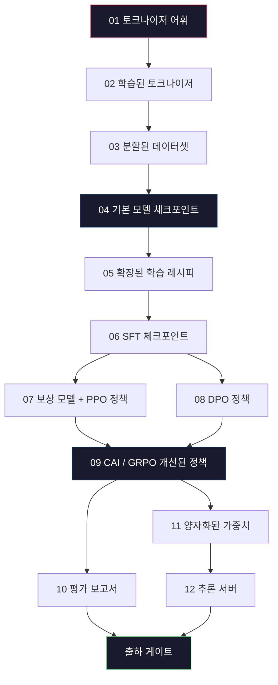
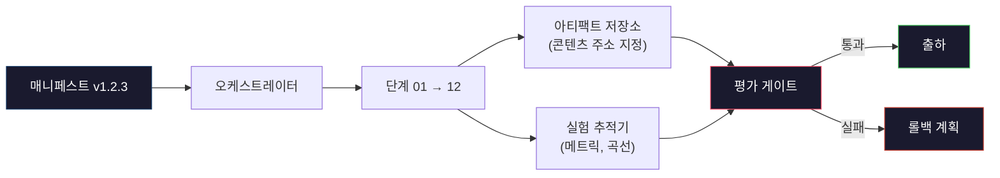

# 완전한 LLM 파이프라인 구축

> 레슨 01부터 12까지의 모든 내용은 하나의 파이프라인 단계입니다. 이 레슨은 이러한 단계들을 하나의 엔드-투-엔드 실행으로 변환하는 프레임워크입니다: 토크나이징, 사전 학습, 확장, SFT(지도 미세 조정), 정렬, 평가, 양자화, 서빙. 노트북에서 70B 모델을 학습시키지는 않을 것입니다. 대신 2026년 프론티어 팀이 어떤 모델을 출시할지 결정하는 데 사용하는 오케스트레이션 계층, 매니페스트, 평가 게이트, 롤백 계획을 생성하게 됩니다. 이것이 최종 프로젝트입니다.

**유형:** 구축
**언어:** Python (표준 라이브러리)
**선수 조건:** Phase 10 레슨 01-12 전체
**소요 시간:** ~120분

## 학습 목표

- 이전 11개 강의(토크나이저(tokenizer), 데이터(data), 사전 학습(pre-training), 확장(scaling), SFT, RLHF, DPO, CAI, 평가(eval), 양자화(quantization), 추론(inference))를 재현 가능한 단일 파이프라인 사양으로 통합
- 단계별 아티팩트 계약 정의: 각 단계가 소비하는 입력, 생성하는 출력, 다음 단계의 입력 검증 방법
- 실험 추적, 아티팩트 해싱, 평가 임계값(eval thresholds) 기반 출하 승인(gate ship decisions) 기능을 갖춘 오케스트레이터(orchestrator) 구축
- 롤백 계획 설계: 재실행 비용이 저렴한 아티팩트, 고비용 아티팩트, 손상된 체크포인트(corrupted checkpoint)의 영향 분석

## 문제 정의

이전 강의들은 각각 작동합니다. 토크나이저가 학습되었고, Tiny GPT가 사전 훈련되었으며, SFT 데이터셋이 구성되었고, 보상 모델이 훈련되었으며, DPO가 실행되었고, 평가가 측정되었으며, 양자화된 가중치가 내보내졌고, 추론 서버가 가동되었습니다. 각각은 노트북 형태로 제공되며, 각각의 규칙, 출력 경로, 시드를 가지고 있습니다.

프론티어 수준의 훈련 실행은 노트북이 아닙니다. Llama 3 405B는 약 54일 동안 3천만 H100 시간이 소요되었습니다. DeepSeek-V3는 약 280만 H800 시간을 사용했습니다. 이 기간 동안 하나의 손상된 체크포인트, 하나의 데이터 오염, 하나의 평가 성능 저하가 발생하면 팀은 일주일 간의 실제 시간과 한 달 간의 GPU 예산을 잃을 수 있습니다. 팀이 이를 극복하는 방법은 파이프라인 위생입니다: 모든 단계에는 결정적 입력, 결정적 출력, 매니페스트, 해시, 게이트가 있습니다.

이것이 최종 프로젝트입니다. 노트북에서 파이프라인을 종단간으로 실행하지는 않을 것입니다. 대신 단계를 조정하는 오케스트레이터, 실행 내용을 설명하는 매니페스트, 출하 결정을 관리하는 검증기, 제3자가 단일 파일에서 작업을 재실행할 수 있는 재생 계획을 작성할 것입니다. 코드는 작지만, 규율은 큽니다.

이 패턴은 100M에서 1T 파라미터까지 변경 없이 확장됩니다. 동일한 네 가지 구성 요소 — 매니페스트, 오케스트레이터, 평가 게이트, 아티팩트 저장소 — 는 Llama 3과 취미용 GPT를 모두 실행합니다. 차이점은 각 단계 설정 내부의 숫자 크기이며, 파이프라인의 형태는 동일합니다.

## 개념

### 12단계

모든 Phase 10 레슨은 하나의 단계입니다. 전체 의존성 그래프는 다음과 같습니다.



단계 07과 08은 병렬로 실행할 수 있습니다. 나머지는 하드 의존성입니다. 단계 02(토크나이저) 변경 시 모든 하위 아티팩트가 무효화됩니다. 단계 10(평가) 변경 시 출하 결정만 무효화됩니다.

### 매니페스트

매니페스트는 실행을 완전히 재현할 수 있도록 설명하는 단일 파일입니다. 파이프라인이 생성하는 모든 것은 매니페스트에 없는 상태에 의존해서는 안 됩니다. 필드는 필수이며 단순합니다.

```
pipeline_version: 1.2.3
seed: 42
git_commit: a1b2c3d4
stages:
  01_tokenizer:
    recipe: bpe_32k
    input_hash: sha256:...
    output_hash: sha256:...
    wall_clock_sec: 3600
    cost_usd: 12
```

단계 N의 출력 해시는 단계 N+1의 입력 해시입니다. 편차가 있으면 파이프라인이 중지됩니다. 이는 데이터 손상을 조기에 발견하는 방법이며, 다른 대륙의 팀원이 자신의 재현 결과가 동일함을 검증하는 방법이기도 합니다.

실제 팀은 작은 YAML 스키마와 매니페스트 검증기를 사용하며, 이전 성공 실행과 비교합니다. 예상 필드(비용, 벽시계 시간) 외 델타는 위험 신호입니다.

### 아티팩트 타이핑

각 단계의 출력은 타입이 지정된 아티팩트입니다. 디렉터리 블롭이나 피클이 아닌, 알려진 스키마를 가진 명명된 타입입니다.

| 단계 | 아티팩트 타입 | 주요 필드 |
|-------|--------------|-----------|
| 01-02 | 토크나이저 | vocab.json, merges.txt, config.json, 해시 |
| 03 | 데이터셋 | shards[], 행 수, 토큰 수, 중복 제거 통계 |
| 04-05 | 체크포인트 | weights.safetensors, config.json, 옵티마이저 상태, 스텝 수 |
| 06 | SFT 모델 | 체크포인트 + SFT 레시피 + 데이터 혼합 |
| 07 | 보상 모델 | RM 체크포인트 + 선호도 데이터 해시 |
| 08-09 | 정책 | 체크포인트 + 참조 해시 + 베타 + KL 예산 소비량 |
| 10 | 평가 보고서 | 벤치마크 점수 + 회귀 차이 + 평가 데이터 해시 |
| 11 | 양자화 모델 | 양자화된 가중치 + 보정 데이터 + FP16 대비 정확도 차이 |
| 12 | 서버 사양 | 엔드포인트 + 모델 해시 + 설정 + 관측 가능성 훅 |

타이핑은 가장 흔한 실패 모드를 방지합니다: 단계 08 출력을 단계 06 입력으로 사용하거나, DPO 훈련 모델을 SFT 경로로 출하하는 것. 타입이 지정된 아티팩트와 단계 서명은 이러한 오류를 컴파일 타임 실패로 만듭니다.

### 평가 게이트

출하는 "훈련 완료"가 아닙니다. "훈련 완료 및 평가 게이트 통과"입니다. 게이트는 실행 시작 전에 정의됩니다.

```
gates:
  mmlu:      >= baseline + 0.5   # 회귀 없음
  humaneval: >= baseline + 1.0
  truthfulqa: >= baseline         # 하락 없음
  safety_refusal_rate: <= 0.05
  kl_from_reference: <= 25.0
  cost_total_usd: <= 50000
```

모든 게이트는 수치적 임계값입니다. "좋아 보임" 게이트나 주관적 승인은 없습니다. 모든 게이트를 통과하면 아티팩트는 출하 가능으로 표시됩니다. 게이트 실패 시, 실행은 명시적 오버라이드(대리인 이름 기록)를 기다리는 보류 상태가 됩니다.

두 게이트가 대부분의 재난을 포착합니다. *회귀* 게이트(새 모델은 핵심 벤치마크에서 이전 모델보다 최소 동일해야 함)는 훈련 버그를 포착합니다. *KL 예산* 게이트(정렬된 정책은 참조에서 X 이상 벗어나면 안 됨)는 과도한 정렬을 포착합니다. 모든 프로덕션 파이프라인은 둘 다 가집니다.

### 오케스트레이터

매니페스트를 읽고, 단계를 디스패치하며, 아티팩트를 추적하고, 계약 위반 시 중지하는 작은 코드 조각입니다. Airflow나 Kubeflow가 아닙니다. 파이프라인 위생을 위해 직접 작성한 단순한 것이 필요합니다.

오케스트레이터의 역할은 다음과 같습니다:

1. 매니페스트에서 DAG를 해석합니다.
2. 각 단계에 대해 예상 출력이 올바른 해시로 이미 존재하는지 확인합니다(존재하면 건너뜁니다).
3. 단계를 실행하고, 표준 출력/오류를 캡처하며, 벽시계 시간과 비용을 측정합니다.
4. 출력 해시를 다운스트림 단계의 예상 입력 해시와 검증합니다.
5. 실패 시 정확한 실패 단계를 포함한 부분 매니페스트를 작성하고 비영(0이 아닌) 종료 코드를 반환합니다.

이는 200줄의 Python 코드입니다. 이 레슨의 `code/main.py` 파일과 유사할 것입니다. 실제 파이프라인은 `torchrun`이나 `ray`를 사용해 클러스터 상에서 개별 단계를 실행하지만, 오케스트레이터 자체는 단일 박스에서 실행됩니다.

### 실험 추적 및 아티팩트 저장소

두 외부 시스템이 파이프라인을 고정합니다.

**실험 추적기 (wandb, neptune, mlflow).** 손실 곡선, 평가 메트릭, 단계별 시스템 원격 측정을 기록합니다. 추적기는 3주 후 실행 A와 실행 B를 비교할 때 사용하는 곳입니다. 팀은 거의 항상 호스팅된 추적기를 사용합니다. 직접 작성하면 훈련에 투자해야 할 시간을 낭비하게 됩니다.

**아티팩트 저장소 (S3, R2, GCS).** 체크포인트, 데이터셋, 토크나이저, 평가 보고서를 위한 불변 객체 저장소입니다. 아티팩트는 파일 이름이 아닌 해시로 주소 지정됩니다. `latest.pt` 같은 파일 이름은 위험합니다. `ckpt-7b-step-20000-sha256:abc123.safetensors`는 계약입니다.

오케스트레이터는 둘 다에 기록합니다. 추적기는 차트를 보는 인간을 위한 것입니다. 저장소는 다음 단계가 입력을 조회하기 위한 것입니다.

### 비용 관리

프론티어 실행에는 달러 금액이 부여됩니다. 예산 규율은 두 곳에서 발생합니다.

**사전 실행 추정.** 매니페스트에서 예상 FLOPs(사전 훈련: 6 x 파라미터 x 토큰), 예상 GPU 시간(FLOPs / 최대 처리량 / 활용률), 현재 임대 요율 기준 달러 비용을 계산합니다. 추정치가 예산 게이트를 초과하면 파이프라인은 시작을 거부합니다.

**실행 중 추적.** 단계별 벽시계 시간과 비용이 매니페스트에 기록됩니다. 매 단계 후 남은 예산을 확인합니다. 단계가 예산을 초과했으면 다음 단계의 게이트는 새로운 남은 예산으로 평가됩니다. VC가 전화할 때 돈이 바닥났음을 알게 되는 상황은 피해야 합니다.

Llama 3의 보고된 비용은 $61M입니다. DeepSeek-V3는 주요 사전 훈련 실행에 $5.6M를 보고했습니다. 이 비율은 대부분 하드웨어 효율성 + 혼합 전문가(MoE) 때문이지만, 구체적인 비용은 두 팀이 실행 단위가 아닌 단계 단위로 추적했기 때문에 가시화됩니다.

### 재현성 vs 결정성

이 둘은 동일하지 않습니다. *재현 가능*은 동일한 매니페스트, 코드, 인프라에서 동등한 다운스트림 메트릭을 가진 체크포인트를 생성함을 의미합니다. *결정적*은 비트 동일 출력을 의미합니다.

현대 LLM 훈련은 재현 가능하지만 결정적이지 않습니다. 분산 훈련의 축소 순서, GPU 커널 비결정성(cuBLAS, flash-attn), 혼합 정밀도 반올림이 결합되어 실행 간 1e-5 수준에서 부동소수점 차이가 발생합니다. 최종 메트릭은 변하지 않으므로 괜찮습니다. 그러나 비트 수준 차이로 디버깅할 때는 치명적입니다. 해결책은 모든 단계의 입력 해시, 출력 해시, 주요 메트릭을 기록하는 것입니다. 이들이 일치하면 가중치가 비트 동일하지 않아도 실행이 "재현"된 것입니다.



### 롤백 계획

실행 시작 전 각 단계 실패 시 조치를 명시합니다. 세 가지 범주입니다.

- **재실행 비용 저렴** (시간): 토크나이저, 평가, 양자화, 추론 서버. 그냥 재실행합니다.
- **중간** (일): SFT, DPO, CAI. 기본 모델은 유지하고 정렬 단계만 재실행합니다.
- **고비용** (주 및 수백만 달러): 사전 훈련. 롤백 계획은 "재실행"이 아닙니다. "마지막 양호한 체크포인트를 사용하고 수정된 데이터로 저렴한 다운스트림 단계만 재실행"입니다.

단계 의존성이 타입 및 해시 기반이므로 오케스트레이터는 롤백 집합을 자동 계산할 수 있습니다: 실패한 단계와 모든 하위 단계를 무효화합니다. 단계 06(SFT) 실패는 06, 07, 08, 09, 10, 11, 12를 무효화합니다. 단계 11(양화) 실패는 11과 12만 무효화합니다. 이를 미리 명시하면 팀이 새벽 4시에 즉흥적으로 대응할 필요가 없습니다.

### 2026년 관찰된 프로덕션 레시피

대부분의 프론티어 팀은 동일한 골격에 수렴했습니다.

- 토크나이저: 128k BPE + 바이트 폴백. 소규모 균형 잡힌 다국어 슬라이스로 훈련.
- 사전 훈련: 10-20T 토큰, 대부분 웹 + 코드 + 합성. Muon 또는 AdamW 옵티마이저. FSDP2 또는 DeepSpeed ZeRO-3. 그래디언트 체크포인팅. BF16 가중치, FP32 마스터.
- SFT: 500k-2M 지시 쌍, 인간 및 합성 혼합, 평가 세트 대비 엄격한 중복 제거.
- 정렬: DPO 또는 CAI + GRPO. 선호도 신호가 DPO에 너무 다차원적일 때만 RLHF.
- 평가: MMLU-Pro, MATH, HumanEval+, GPQA, SWE-Bench Verified, LiveBench, 공개되지 않은 비공개 홀드아웃 세트.
- 양자화: 서빙용 4비트 GPTQ 또는 AWQ, 정확도 차이가 중요한 안전 평가용 8비트.
- 서빙: vLLM, TensorRT-LLM 또는 자체 개발. 연속 배치. 추측 디코딩. KV 캐시 제거.

숫자는 6개월마다 변합니다. 골격은 변하지 않습니다.

## 빌드하기

이 레슨의 코드는 오케스트레이터와 매니페스트 검증기로, 12개의 훈련 스크립트가 아닙니다. 각 단계는 올바른 형태와 해시를 가진 출력 아티팩트를 생성하는 플레이스홀더로 시뮬레이션됩니다. 오케스트레이터를 종단간 실행하면 실제 단계에 GPU 비용을 투입하기 전에 파이프라인의 배관이 작동하는지 확인할 수 있습니다.

전체 구현은 `code/main.py`를 참조하세요. 주요 구성 요소:

- `Manifest` 데이터 클래스: 파이프라인 버전, 시드, Git 커밋, 단계, 게이트.
- `Stage` 데이터 클래스: 이름, 유형, 입력(해시들), 출력(해시), 벽시계 시간, 비용.
- `Orchestrator.run()`: DAG 해결, 단계 디스패치, 해시 검증, 매니페스트 업데이트.
- `EvalGate.check()`: 임계값 읽기, 최신 평가 보고서와 비교, 통과/실패 반환.
- `ArtifactStore`(인메모리 스텁): 해시별 put/get, S3 시뮬레이션.
- `CostTracker`: 단계별 및 누적 비용 추적, 한도 초과 시 중단.

`main.py`의 파이프라인은 12개의 플레이스홀더 단계를 실행하고 매니페스트를 생성하며, 실패한 평가 게이트를 실행하여 중단된 실행 사례를 보여줍니다. 각 플레이스홀더를 해당 레슨의 실제 훈련 스크립트로 교체하면 실제 프론티어 파이프라인에서 사용하는 골격을 갖추게 됩니다.

## 사용 방법

표준 워크플로우는 세 가지 명령어로 구성됩니다.

```
python code/main.py plan    # 매니페스트 검증, 비용 추정 계산, DAG 출력
python code/main.py run     # 스테이지 실행, manifest.out.yaml에 결과 기록
python code/main.py gate    # manifest.out.yaml 읽기, 평가 게이트 적용, SHIP/HOLD 결정
```

매번 `plan`을 먼저 실행하세요. 대부분의 파이프라인 버그는 계획 단계에서 발견됩니다 — 누락된 게이트 임계값, 오래된 해시, 예산 초과 등. `plan` 실행은 비용이 들지 않습니다. `run` 실행은 비용이 많이 듭니다. 저렴한 단계에서 버그를 잡아 비용을 절약하세요.

`gate`의 출력은 `SHIP` 또는 `HOLD: <이유>`입니다. 보류된 실행은 실패가 아니라 의사 결정 지점입니다. 지정된 검토자는 오버라이드(로그에 기록됨)하거나 롤백 승인을 할 수 있습니다.

## Ship It

이 레슨은 `outputs/skill-llm-pipeline-reviewer.md`를 생성합니다. 제안된 파이프라인 매니페스트를 입력으로 받아 모든 계약 사항을 검증합니다: 스테이지 타이핑, 해시 체인, 게이트, 롤백 계획, 비용 추정. 평가 게이트 누락, 무제한 KL 예산, 평가 데이터와 학습 데이터가 혼합된 실행이 포함된 매니페스트는 승인을 거부합니다.

## 연습 문제

1. 오케스트레이터를 확장하여 단계 07과 08의 병렬 실행을 지원하세요. stdlib `concurrent.futures` 모듈을 사용하세요. 최종 매니페스트가 두 단계의 출력을 모두 기록하고, 단계 09의 입력 해시가 두 출력의 결정적 조합인지 확인하세요.

2. "오염 검사" 게이트를 추가하세요. 평가 데이터셋 해시와 훈련 데이터셋 샤드를 기반으로 중복도(정확한 문자열 일치 또는 13-그램 일치)를 계산하세요. 중복도가 0.1%를 초과하면 게이트가 실패합니다. 오염된 훈련 세트를 입력으로 제공하고 게이트가 실행을 차단하는지 확인하세요.

3. 비용 추정기를 처음부터 구현하세요. 단계 04(사전 훈련)의 경우 FLOPs를 6 x 파라미터 x 토큰으로 추정하세요. H100에서 40% MFU(모델 FLOPs 활용도)와 989 TFLOPs BF16, GPU 시간당 $2.50을 가정하세요. 7B 모델을 2T 토큰으로 훈련시키는 경우의 추정치를 보고하세요. 공개된 Llama 2 수치와 비교하세요.

4. 부분 롤백을 구현하세요. 단계 09(CAI)에서 실패를 시뮬레이션한 후, 단계 01-08은 캐시된 상태로 두고 단계 09부터 12까지 재실행하세요. 오케스트레이터가 해시를 통해 캐시된 아티팩트를 감지하고 건너뛰는지 확인하세요. 전체 재실행 대비 절약된 벽시계 시간을 측정하세요.

5. 관측 가능성을 추가하세요. 각 단계에 대해 OpenTelemetry 스팬을 생성하고, 파라미터, 처리된 토큰 수, 손실, 비용 등의 속성을 포함하세요. 스팬을 로컬 수집기로 전달하세요. 대시보드가 아닌, 모든 단계의 건강 상태를 단일 트레이스 ID로 추적할 수 있는 것이 목적입니다.

## 주요 용어

| 용어 | 사람들이 말하는 표현 | 실제 의미 |
|------|----------------|----------------------|
| 매니페스트(Manifest) | "레시피 파일" | 파이프라인 버전, 시드, 단계별 설정, 게이트 임계값을 설명하는 YAML 또는 JSON — 실행을 재생성하는 데 충분함 |
| 콘텐츠 주소 지정(Content-addressed) | "이름이 아닌 해시로" | SHA-256 해시를 기반으로 아티팩트를 저장하여 버전 A와 버전 B를 혼동할 수 없음 |
| 평가 게이트(Eval gate) | "출시 기준" | 아티팩트가 출시 가능으로 표시되기 전에 통과해야 하는 벤치마크 메트릭 및 안전 점수에 대한 수치적 임계값 |
| KL 예산(KL budget) | "정렬이 얼마나 벗어났는지" | 정렬 단계 전반에 걸쳐 누적된 KL(정책 || 참조)에 대한 상한 — 게이트로 강제 적용 |
| MFU | "GPU 사용량" | 모델 FLOPs 활용도 — 이론적 최대치 대비 실제 달성한 FLOPs. 70B 규모에서는 40%, 7B에서는 55%가 일반적 |
| 롤백 계획(Rollback plan) | "문제가 생겼을 때 하는 조치" | 실패 시 단계별 사전 작성된 조치 세트: 재실행, 이전 버전 복귀, 수정된 입력으로 재학습 |
| 오케스트레이터(Orchestrator) | "지휘자" | 매니페스트를 읽고 단계를 실행하며 해시를 검증하고 계약 위반 시 중단하는 프로세스 |
| 아티팩트 저장소(Artifact store) | "가중치를 위한 버전 관리 S3" | 불변 콘텐츠 주소 지정 객체 저장소 — 체크포인트, 데이터셋, 평가 보고서의 단일 진실 소스 |
| 재현 가능(Reproducible) | "재생 시 동일한 메트릭" | 비트 수준에서는 다른 가중치지만 다운스트림 메트릭은 동등 — 분산 LLM 학습의 현실적인 목표 |
| 비용 게이트(Cost gate) | "X를 초과할 수 없음" | 사전 실행 비용 추정치 + 실행 중 추적기 — 추정치가 예산을 초과하면 파이프라인이 시작되지 않음 |

## 추가 읽기 자료

- [Dubey et al., 2024 -- "The Llama 3 Herd of Models"](https://arxiv.org/abs/2407.21783) -- 데이터, 학습, 정렬(alignment), 평가를 포함한 프론티어 파이프라인에 대한 가장 상세한 공개 설명
- [DeepSeek-AI, 2024 -- "DeepSeek-V3 기술 보고서"](https://arxiv.org/abs/2412.19437) -- Llama 3 클래스 학습 비용의 약 1/10 수준의 효율성 중심 파이프라인
- [Kaplan et al., 2020 -- "신경망 언어 모델을 위한 확장 법칙(Scaling Laws)"](https://arxiv.org/abs/2001.08361) -- 원본 계산-데이터-파라미터 확장 관계
- [Hoffmann et al., 2022 -- "계산 최적화 대형 언어 모델 학습(Chinchilla)"](https://arxiv.org/abs/2203.15556) -- Kaplan의 수정본으로 현대 데이터 예산을 재조정
- [PyTorch FSDP2 문서](https://pytorch.org/docs/stable/fsdp.html) -- PyTorch 2.4+에서 FSDP1을 대체하는 분산 학습 기본 요소
- [Weights & Biases LLM 보고서](https://wandb.ai/site/llms) -- 오픈소스 LLM 실행을 위한 실제 매니페스트 및 실험 추적기 출력, 표절 가능한 템플릿으로 유용