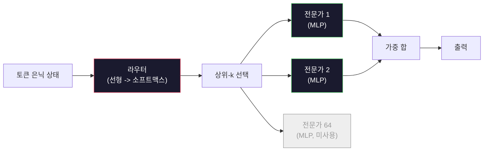

# 오픈 모델: 아키텍처 분석

> 레슨 04에서 GPT-2 Small을 처음부터 구축했습니다. 2026년의 프론티어 오픈 모델들은 5~6가지 구체적인 변경점을 가진 동일한 패밀리입니다. LayerNorm 대신 RMSNorm. GELU 대신 SwiGLU. 학습된 위치 대신 RoPE. 전체 MHA 대신 GQA 또는 MLA. 대규모 Mixture-of-Experts. 이미 알고 있는 수학 지식이 95%를 커버합니다. 이 레슨에서는 Llama 3, DeepSeek-V3, Mixtral, Qwen, Gemma를 나란히 비교하고 각 아키텍처가 분기되는 정확한 위치를 명시합니다.

**유형:** 학습
**언어:** Python (표준 라이브러리)
**선수 지식:** 10단계, 레슨 04, 05, 12 (사전 학습, 확장, 추론)
**소요 시간:** ~45분

## 학습 목표

- Llama 3, Mistral, Mixtral, Gemma 2, Qwen 2.5, DeepSeek-V3의 `config.json`을 읽고 모든 필드를 설명
- 각 모델이 GPT-2 Small 대비 적용한 구체적인 아키텍처 변경 사항을 명시하고, 이를 첫 원리(first principles) 관점에서 정당화
- 구성(config) 파일만으로 모든 오픈 모델의 파라미터 수, KV 캐시 크기, 활성화 메모리(activation memory) 계산
- 지연 시간(latency), 메모리, 성능 제약 조건을 고려하여 배포 대상에 적합한 오픈 모델 선택

## 문제 정의

Lesson 04에서 여러분은 350줄의 NumPy 코드를 작성했고 GPT-2 형태의 모델을 구현했습니다. Llama 3 405B는 200페이지 분량의 기술 보고서를 가지고 있습니다. 직감적으로 이 둘은 완전히 다른 모델이라고 생각할 수 있습니다. 하지만 그렇지 않습니다. 200페이지 보고서는 동일한 기본 구조에 5~6가지 잘 동기화된 수정 사항과 확장을 위한 수천 가지 구현 세부 사항을 추가한 것을 설명합니다. 기본 골격—임베딩(embedding), 트랜스포머 블록(transformer blocks), 어텐션(attention), MLP, 정규화(norm), 헤드(head)—은 변하지 않았습니다.

이 레슨은 "변경 사항 비교(diff)"입니다. 주요 오픈소스 모델 패밀리마다 GPT-2 대비 정확히 무엇이 변경되었는지, 그 이유와 비용을 정리합니다. 학습을 마치면 새로운 모델 카드를 읽고 이를 GPT-2 기준으로 정신적으로 역변환할 수 있게 될 것입니다.

실용적인 이점은 Meta가 Llama 5를 출시하거나 DeepSeek이 V4를 출시할 때 새로운 정신 모델을 구축할 필요가 없다는 점입니다. 설정(config)을 보고 잘 알려진 조절 장치(knob) 중 어떤 것이 조정되었는지 확인하면, 그 하위 영향(downstream implications)을 즉시 파악할 수 있습니다. 2026년의 아키텍처들은 유한한 도구 상자입니다. 각 새로운 모델은 서로 다른 조합을 선택할 뿐입니다.

## 개념

### 불변 코어

모든 자기회귀형 오픈 모델은 다음을 공유합니다:

- 토큰 임베딩 행렬 (vocab_size x hidden_dim).
- N개의 디코더 블록 스택: norm, self-attention, residual, norm, MLP, residual.
- 최종 norm과 vocab_size로 투영하는 선형 헤드 (종종 임베딩과 가중치 공유).
- 인과적 마스크, 다음 토큰 교차 엔트로피 손실.

이것이 기본 형태입니다. 나머지는 조절 가능한 요소(knob)입니다.

### 실제로 영향을 미치는 6가지 조절 요소

2024-2026년 프론티어 오픈 모델 전반에서 동일한 6가지 설계 선택이 반복적으로 선택됩니다:

1. **정규화.** LayerNorm -> RMSNorm.
2. **위치 인코딩.** 학습된 절대값 -> RoPE (변형: YaRN, NTK 포함).
3. **활성화 함수.** GELU -> SwiGLU (또는 GeGLU).
4. **어텐션 헤드 공유.** MHA -> GQA -> MQA -> MLA.
5. **밀집 vs 희소 MLP.** 밀집 -> Mixture-of-Experts.
6. **사전 정규화 위치.** 사전 정규화는 유지. 사후 정규화는 사라짐.

나머지 모든 것(학습률 스케줄, 데이터 혼합, 배치 크기, 컨텍스트 길이)은 훈련 구성에 속하며 아키텍처에 속하지 않습니다. 6가지 조절 요소입니다.

### 조절 요소 1: RMSNorm

LayerNorm은 평균을 빼고 표준편차로 나눈 후 스케일링 및 시프트를 적용합니다. RMSNorm은 스케일만 유지합니다:

```
RMSNorm(x) = x / sqrt(mean(x^2) + eps) * gamma
```

평균 빼기 없음. 편향 없음. 토큰당 행렬 곱셈 1회 감소. Zhang과 Sennrich(2019)는 기계 번역에서 LayerNorm과 동일한 성능을 유지하면서 10% 더 빠르다고 주장했습니다. 모든 현대 오픈 모델은 이를 사용합니다.

비용: 없음. 이점: 작은 처리량 향상, 더 간단한 코드.

### 조절 요소 2: RoPE

학습된 위치 임베딩은 GPT-2에서 1024개 슬롯의 룩업 테이블이었습니다. 컨텍스트 1025는 테이블 범위를 벗어납니다. 모델은 훈련 길이를 넘어 외삽할 수 없습니다.

회전 위치 임베딩(Su et al. 2021)은 어텐션 내적 전에 Q와 K 벡터를 쌍으로 회전시켜 위치를 주입합니다. 회전 각도는 위치의 결정론적 함수이므로 학습할 것이 없고 부족해질 것도 없습니다. 스케일링 기법(NTK 인식 보간, YaRN)을 사용하면 8k 컨텍스트에서 훈련된 모델이 추론 시 128k로 확장되며 정확도 손실이 적습니다.

```
q_rotated = rotate(q, angle(pos))
k_rotated = rotate(k, angle(pos))
score = q_rotated . k_rotated
```

모든 Llama, Mistral, Qwen, DeepSeek, Gemma는 RoPE를 사용합니다. Gemma 2는 하이브리드(대부분 레이어에 RoPE, 다른 레이어에 로컬 슬라이딩 윈도우 어텐션)를 사용합니다.

### 조절 요소 3: SwiGLU

GPT-2의 MLP는 `x -> gelu(xW1 + b1) -> (...)W2 + b2`입니다. SwiGLU(Shazeer 2020)는 활성화 함수를 게이트 곱으로 대체합니다:

```
SwiGLU(x) = (xW1) * sigmoid(xW1) * xV
```

하나의 투영 대신 병렬로 두 개의 투영을 Swish 활성화로 게이트합니다. 파라미터당 퍼플렉서티에서 경험적으로 더 강력합니다. Llama 2가 채택했고 모두가 따라했습니다. MLP의 은닉 크기는 일반적으로 총 파라미터 수가 원래 밀집 MLP와 일치하도록 설정됩니다: GPT-2가 `ff_dim = 4 * hidden`을 사용했다면 SwiGLU는 `ff_dim = (2/3) * 4 * hidden = 8/3 * hidden`을 사용합니다.

### 조절 요소 4: 어텐션 헤드 공유

GPT-2는 **Multi-Head Attention (MHA)**를 사용했습니다: 모든 헤드는 고유한 Q, K, V 투영을 가집니다.

**Multi-Query Attention (MQA, Shazeer 2019)**은 모든 헤드에 대해 하나의 K와 하나의 V를 공유합니다. KV 캐시를 num_heads만큼 줄입니다. 일반적인 모델에서 12x~32x 감소. 어려운 벤치마크에서 정확도가 약간 하락합니다.

**Grouped-Query Attention (GQA, Ainslie et al. 2023)**은 중간 지점입니다: G개의 Q 헤드 그룹이 하나의 K와 하나의 V를 공유합니다. Llama 3 8B는 32개의 Q 헤드와 8개의 KV 헤드로 GQA를 사용하므로(G=8), KV 캐시는 전체 MHA 대비 4x 축소됩니다.

**Multi-Head Latent Attention (MLA, DeepSeek 2024)**은 K와 V를 공유 저랭크 잠재 공간으로 압축한 후 헤드별로 다시 확장합니다. KV 캐시를 더 줄이면서 헤드별 표현력을 유지합니다. DeepSeek-V2와 V3는 긴 컨텍스트 성능을 위해 이에 의존합니다.

| 방식 | KV 헤드 | KV 캐시 | 정확도 |
|------|---------|---------|--------|
| MHA  | num_heads | 전체 | 최고 |
| GQA  | num_groups (G < num_heads) | num_heads / G 감소 | MHA 근접 |
| MQA  | 1 | num_heads 감소 | 약간 하락 |
| MLA  | 잠재, 헤드별 복원 | MQA보다 작음 | MHA 근접 |

~13B 이상의 모든 모델에서 GQA 또는 MLA는 사실상 필수입니다. 대규모에서 전체 MHA는 KV 캐시 재앙입니다.

### 조절 요소 5: Mixture of Experts

밀집 MLP는 모든 토큰에 대해 모든 파라미터를 활성화합니다. MoE MLP는 블록당 K개의 전문가를 가지며 라우터가 토큰당 상위 k개 전문가를 선택합니다(일반적으로 상위 2개). 해당 전문가의 가중치만 해당 토큰에 대한 순전파에서 사용됩니다.

```
router_logits = xW_r
indices, weights = top_k(router_logits, k=2)
output = sum_i weights[i] * expert[indices[i]](x)
```

장점: 64개의 7B 전문가를 가질 수 있지만(따라서 총 파라미터 수는 매우 큼) 토큰당 2개만 실행(따라서 토큰당 계산량은 밀집 7B 모델과 동일). Mixtral 8x7B는 총 47B 파라미터를 가지지만 토큰당 13B만 활성화합니다. DeepSeek-V3는 총 671B 파라미터를 가지지만 토큰당 37B만 활성화합니다.



장점: 동일한 계산량, 더 많은 파라미터, 더 큰 용량. 단점: 전문가 메모리는 여전히 어딘가에 존재해야 함(따라서 서빙 시 밀집 모델보다 더 많은 VRAM 필요), 라우터 부하 분산이 어려움, 정렬 중 라우터 미세 조정은 별도의 연구 분야.

### 조절 요소 6: 사전 정규화 유지

원래 트랜스포머는 각 하위 레이어 후에 레이어 정규화를 적용했습니다. GPT-2 이후 모든 오픈 모델은 각 하위 레이어 *전*에 적용합니다. 사전 정규화는 깊이에서 훈련이 훨씬 쉽습니다. 논쟁할 여지가 없습니다.

### 모델별 차이점

다음은 이 모든 내용을 구체화하는 표입니다.

| 모델 | 연도 | 총 파라미터 | 활성 파라미터 | 정규화 | 활성화 | 위치 | 어텐션 | MoE | 컨텍스트 |
|------|------|-------------|---------------|--------|---------|--------|---------|-----|----------|
| GPT-2 Small | 2019 | 124M | 124M | LayerNorm | GELU | 학습됨 | MHA (12 헤드) | 아니오 | 1k |
| Llama 3 8B | 2024 | 8B | 8B | RMSNorm | SwiGLU | RoPE | GQA (32/8) | 아니오 | 128k |
| Llama 3 70B | 2024 | 70B | 70B | RMSNorm | SwiGLU | RoPE | GQA (64/8) | 아니오 | 128k |
| Llama 3 405B | 2024 | 405B | 405B | RMSNorm | SwiGLU | RoPE | GQA (128/16) | 아니오 | 128k |
| Mistral 7B | 2023 | 7.2B | 7.2B | RMSNorm | SwiGLU | RoPE | GQA | 아니오 | 32k |
| Mixtral 8x7B | 2023 | 47B | 13B | RMSNorm | SwiGLU | RoPE | GQA | 예 (8 전문가, 상위-2) | 32k |
| Gemma 2 9B | 2024 | 9B | 9B | RMSNorm (사전+사후) | GeGLU | RoPE + 슬라이딩 | GQA | 아니오 | 8k |
| Qwen 2.5 72B | 2024 | 72B | 72B | RMSNorm | SwiGLU | RoPE (YaRN) | GQA (64/8) | 아니오 | 128k |
| DeepSeek V2 236B | 2024 | 236B | 21B | RMSNorm | SwiGLU | RoPE | MLA | 예 (160 전문가, 상위-6) | 128k |
| DeepSeek V3 | 2024 | 671B | 37B | RMSNorm | SwiGLU | RoPE | MLA | 예 (256 전문가, 상위-8) | 128k |

열을 스캔하세요. RMSNorm은 보편적입니다. SwiGLU 또는 그 변형인 GeGLU도 보편적입니다. RoPE는 보편적입니다. 7B 이상에서는 GQA가 보편적이며 MLA로 대체될 수 있습니다. MoE는 최상위에서 차별화 요소입니다.

### config.json 읽기

Llama 3 8B 구성:

```
{
  "hidden_size": 4096,
  "intermediate_size": 14336,
  "num_hidden_layers": 32,
  "num_attention_heads": 32,
  "num_key_value_heads": 8,
  "max_position_embeddings": 131072,
  "rope_theta": 500000.0,
  "rms_norm_eps": 1e-5,
  "vocab_size": 128256
}
```

모든 필드는 이미 구현한 내용과 대응됩니다.

- `hidden_size`: 임베딩 차원.
- `intermediate_size`: MLP 은닉 크기 (3.5x hidden -- SwiGLU 수학).
- `num_hidden_layers`: 스택 깊이.
- `num_attention_heads`: Q 헤드.
- `num_key_value_heads`: KV 헤드 (GQA).
- `max_position_embeddings`: 훈련 컨텍스트 길이.
- `rope_theta`: RoPE 기본 주파수. Meta는 기본 10k에서 500k로 스케일링하여 긴 컨텍스트 외삽을 개선했습니다.
- `rms_norm_eps`: 수치 안정성.
- `vocab_size`: 토큰.

이들로부터 총 파라미터, KV 캐시, 최대 활성화 메모리를 계산합니다. 정확한 공식은 `code/main.py`를 참조하세요.

### 활성화 메모리 예산

활성화는 수십억 파라미터 이상의 훈련 메모리를 지배합니다. 사전 훈련(그래디언트 체크포인팅 포함)의 경험 법칙:

```
activation_mem ~ 배치_크기 * 시퀀스_길이 * 은닉_크기 * 레이어_수 * 요소당_바이트
```

Llama 3 8B에서 배치 1, 시퀀스 8192, BF16, 32 레이어, 은닉 4096: 체크포인팅 시 약 8GB, 체크포인팅 없을 시 40GB. 이것이 플래시 어텐션과 링 어텐션이 중요한 이유입니다. 이들은 활성화를 맞추도록 어텐션 계산을 재작성합니다.

### KV 캐시 예산

최대 컨텍스트에서의 추론:

```
kv_cache = 2 * 레이어_수 * kv_헤드_수 * 헤드_차원 * 최대_시퀀스_길이 * 요소당_바이트
```

Llama 3 8B에서 128k 컨텍스트, BF16, 헤드_차원 = 은닉 / 헤드_수 = 128:
`2 * 32 * 8 * 128 * 131072 * 2 = 17.2 GB` per sequence.

8B 가중치는 BF16에서 16GB입니다. 단일 128k 시퀀스의 KV 캐시는 가중치보다 큽니다. 이것이 GQA, MLA, KV 캐시 양자화 연구를 주도하는 메모리 압력입니다.

### 각 모델의 강점

- **단일 80GB GPU, MoE 없음**: Llama 3 8B, Mistral 7B, Gemma 2 9B. 서빙이 쉽고 도구 지원이 넓음.
- **단일 노드(8x80GB), 큰 용량**: Llama 3 70B, Qwen 2.5 72B. 최고 밀도 오픈 기능.
- **가장 큰 오픈 기능, MoE 복잡성 수용**: DeepSeek V3, Mixtral 8x22B. 활성 FLOP당 최고 기능.
- **긴 컨텍스트 필요**: Llama 3 (RoPE 스케일링으로 128k), DeepSeek (MLA 장점).
- **저지연 서빙**: Gemma 2 9B (슬라이딩 윈도우로 긴 컨텍스트 계산 감소).

## Build It

이 레슨의 코드는 계산기입니다. 주어진 `config.json`에 대해 구성 요소별 파라미터 수, 최대 컨텍스트에서의 KV 캐시, SwiGLU MLP 비율, 그리고 아키텍처(밀집형/ GQA/ MLA/ MoE)에 대한 간단한 평가 결과를 출력합니다.

```python
config = {
    "hidden_size": 4096, "intermediate_size": 14336,
    "num_hidden_layers": 32, "num_attention_heads": 32,
    "num_key_value_heads": 8, "vocab_size": 128256,
    "max_position_embeddings": 131072,
}
```

스크립트는 아키텍처를 필드별로 순회하며 임베딩, 어텐션(GQA 축소 적용), MLP(SwiGLU 확장 적용), 레이어 정규화, 헤드의 파라미터 수를 계산합니다. 이후 명시된 컨텍스트 길이에서의 KV 캐시를 계산하고 요약 정보를 출력합니다.

구현은 `code/main.py`를 참조하세요.

## 사용 방법

Llama 3 8B, Mistral 7B, Mixtral 8x7B 및 DeepSeek V3 구성에서 번들로 제공되는 스크립트를 통해 계산기를 실행해 보세요. 파라미터 분해를 비교해 보세요. MoE 모델들은 총 파라미터 수가 밀집 모델(dense model)보다 훨씬 크지만 활성 파라미터 수는 종종 더 작다는 점에 주목하세요. 또한 DeepSeek V3의 KV 캐시가 총 파라미터 수는 더 많음에도 불구하고 Llama 3 405B보다 작다는 점 - 이는 MLA(Memory-efficient Linear Attention)의 효과입니다.

그런 다음 로컬에 있는 모든 모델의 구성을 입력하고 요약 정보를 읽은 후 해당 모델이 GPU에 적합한지 결정하세요.

## Ship It

이 레슨은 `outputs/skill-open-model-picker.md`를 생성합니다. 배포 대상(GPU 유형, VRAM, 컨텍스트 길이, 지연 시간 예산)과 작업 프로필(채팅, 코드, 추론, 장문 컨텍스트)이 주어졌을 때, 오픈 모델, 레슨 11의 양자화 방식, 레슨 12의 추론 스택을 추천하며, 6가지 아키텍처 조정 요소에 대한 명시적 근거를 제시합니다.

## 연습 문제

1. HuggingFace에서 Qwen 2.5 72B 설정을 읽어옵니다. 총 파라미터 수를 처음부터 계산하고, HF에서 보고한 값과 비교합니다. 차이가 발생하는 원인(head dim 반올림, KV 공유 계수 등)을 식별하세요.

2. DeepSeek V3는 256개 전문가 중 상위 8개 라우팅을 사용합니다. 활성화된 전문가 대 총 전문가 비율을 계산하고, Mixtral 8x7B의 상위 2개(8개 중)와 비교합니다. 희소(25%)에서 더 밀집된 희소(3%)로의 전환이 FLOP당 용량에 대해 시사하는 바는 무엇인가요?

3. Llama 3 405B의 128k 컨텍스트에 대한 KV 캐시를 FP8과 BF16으로 계산합니다. FP8은 BF16 값의 절반입니다. 단일 8xH100 노드(각각 80GB = 총 640GB, 가중치 메모리 제외)에서 병렬로 제공할 수 있는 시퀀스 수는 몇 개인가요?

4. Gemma 2는 전체 어텐션과 슬라이딩 윈도우 어텐션 레이어를 번갈아 사용합니다. 전체 컨텍스트 대신 4096토큰 슬라이딩 윈도우를 사용하는 레이어가 절반일 때 KV 캐시의 수학적 표현을 작성하세요. 8k 총 컨텍스트에서 얼마나 많은 메모리를 절약할 수 있나요?

5. 이 레슨 작성 이후 공개된 최신 프론티어 오픈 모델을 찾습니다. 해당 모델이 선택한 6가지 조정 요소(knob)를 식별하고, 7번째 조정 요소를 도입했는지 확인합니다. 새로운 아키텍처가 출시되는 순간 커리큘럼은 구식이 됩니다. 목표는 정신 모델을 재구성하지 않고 표를 업데이트하는 것입니다.

## 주요 용어

| 용어 | 사람들이 말하는 것 | 실제 의미 |
|------|----------------|----------------------|
| RMSNorm | "평균을 제외한 LayerNorm" | 루트 평균 제곱으로만 정규화하고 학습된 스케일을 적용 — LayerNorm보다 저렴하며 성능도 비슷 |
| RoPE | "회전 위치 임베딩" | 각 Q와 K 벡터를 2D 쌍으로 위치에 의존하는 각도로 회전 — 스케일링 트릭으로 학습 길이 이상으로 확장 가능 |
| SwiGLU | "새로운 MLP 활성화 함수" | Swish를 적용한 게이티드 선형 유닛: `(xW1) * sigmoid(xW1) * xV` — 2024년 이후 모든 오픈 모델의 표준 |
| GQA | "중간 지점 어텐션" | 그룹화된 쿼리 어텐션: G개의 Q 헤드 그룹이 하나의 K와 V 헤드를 공유 — MQA의 정확도 저하 없이 KV 캐시 축소 |
| MLA | "DeepSeek의 어텐션" | 멀티헤드 잠재 어텐션: K/V를 공유된 저랭크 잠재 공간으로 압축 후 헤드별로 복원 — 대형 모델에서 가장 작은 KV 캐시 |
| MoE | "희소 전문가" | 전문가 혼합: 블록당 N개의 MLP, 라우터가 토큰당 상위-k 선택 — 총 파라미터는 크나 활성 파라미터는 작음 |
| Top-k 라우팅 | "토큰당 k개 전문가 선택" | 라우터가 전문가별 점수를 계산하고 상위 k개 활성화 — 일반적인 k는 2(Mixtral)에서 8(DeepSeek) |
| YaRN | "RoPE 확장" | 또 다른 RoPE 확장 기법 — 회전 각도를 보간하여 추론 시 컨텍스트를 8k에서 128k+로 확장 |
| 슬라이딩 윈도우 어텐션 | "모든 것에 주목하지 않음" | 각 토큰은 최근 W개의 토큰에만 주목 — 어텐션 비용을 토큰당 O(W)로 제한, Gemma 2 및 초기 Mistral에서 사용 |
| 활성 파라미터 | "토큰당 실행되는 것" | MoE 모델에서 토큰당 순전파되는 파라미터 수(총 파라미터보다 훨씬 작음) — 토큰당 FLOPs를 결정 |

## 추가 자료

- [Dubey et al., 2024 -- "The Llama 3 Herd of Models"](https://arxiv.org/abs/2407.21783) -- 밀집형 Llama 3 패밀리의 아키텍처 및 학습 참조 문서
- [DeepSeek-AI, 2024 -- "DeepSeek-V3 Technical Report"](https://arxiv.org/abs/2412.19437) -- MLA(Mixture of Experts Layers) + 보조 손실 없는 로드 밸런싱 + 671B MoE
- [Jiang et al., 2024 -- "Mixtral of Experts"](https://arxiv.org/abs/2401.04088) -- 표준 MoE 오픈 모델 논문
- [Su et al., 2021 -- "RoFormer: Enhanced Transformer with Rotary Position Embedding"](https://arxiv.org/abs/2104.09864) -- RoPE(Rotary Position Embedding) 논문
- [Shazeer, 2020 -- "GLU Variants Improve Transformer"](https://arxiv.org/abs/2002.05202) -- SwiGLU, GeGLU 및 관련 변형
- [Ainslie et al., 2023 -- "GQA: Training Generalized Multi-Query Transformer Models"](https://arxiv.org/abs/2305.13245) -- GQA(Generalized Multi-Query Attention) 논문
- [Gemma 2 Team, 2024 -- "Gemma 2: Improving Open Language Models at a Practical Size"](https://arxiv.org/abs/2408.00118) -- 하이브리드 전체+슬라이딩 어텐션, 사전+사후 정규화
- [Qwen Team, 2024 -- "Qwen 2.5 Technical Report"](https://arxiv.org/abs/2412.15115) -- YaRN(Yet another RNN) 컨텍스트 확장 및 장문 컨텍스트 학습 레시피